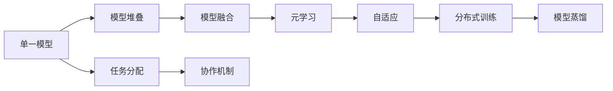

                 

# AI模型的任务分配与协作

## 1. 背景介绍

随着人工智能技术的不断进步，AI模型已经广泛应用于各行各业，从自然语言处理、计算机视觉到医疗健康、金融科技等领域。然而，单个AI模型往往难以处理复杂的任务，单一模型所擅长的领域也有限。如何高效地将多个AI模型整合在一起，发挥它们各自的优势，协作完成任务，成为了一个重要研究方向。本文将详细介绍AI模型的任务分配与协作，包括相关概念、核心算法、应用场景等。

## 2. 核心概念与联系

### 2.1 核心概念概述

在讨论AI模型的任务分配与协作之前，我们需要先了解以下几个关键概念：

- **单一模型与模型堆叠**：单一模型是具有特定功能的AI模型，如BERT、ResNet等。模型堆叠是将多个单一模型串联在一起，以提升整体性能。
- **模型融合与模型融合层**：模型融合是将多个模型的输出进行加权平均或拼接，得到融合后的输出。模型融合层是专门用于模型融合的层，如模型平均、加权平均、最大值平均等。
- **元学习与元学习机制**：元学习是一种通过学习如何学习的方法，即在多个任务上学习元参数，使得模型能够更快速地适应新任务。
- **自适应与自适应机制**：自适应是指模型能够根据输入数据的特点动态调整其行为，以适应不同的任务需求。
- **分布式训练与分布式训练框架**：分布式训练是将训练任务分布在多台机器上执行，以加速模型训练。常用的分布式训练框架包括TensorFlow、PyTorch等。
- **模型蒸馏与知识蒸馏**：模型蒸馏是将知识从复杂模型转移到简单模型上的过程，以提高简单模型的性能。

这些概念通过以下Mermaid流程图展示：



### 2.2 核心概念原理和架构

单一模型的设计通常基于特定的业务需求，通过训练获得模型参数，并对输入数据进行预测。模型堆叠是指将多个单一模型串联在一起，通过对输出的组合进行再训练，得到更强的性能。

模型融合通过加权平均、拼接等方式将多个模型的输出进行融合，得到最终的预测结果。融合层的原理通常包括：

- **模型平均**：将所有模型的预测结果进行平均，得到融合后的预测结果。
- **加权平均**：根据模型性能的优劣给每个模型预测结果分配权重，并进行加权平均。
- **最大值平均**：取多个模型预测结果中的最大值进行平均，保留最有把握的预测结果。

元学习通过学习模型在多个任务上的表现，得到元参数，用于指导新任务的快速适应。典型的元学习算法包括MAML（Meta-Learning of Gradient Descent Methods）和Meta-Optimizer。

自适应机制使得模型能够根据输入数据的特点动态调整其行为，以适应不同的任务需求。自适应机制的原理通常包括：

- **学习率调整**：根据输入数据的难易程度动态调整学习率。
- **自适应权重**：根据输入数据的特征自动调整每个模型的权重。
- **动态网络结构**：根据输入数据的特点动态调整网络结构。

分布式训练通过将训练任务分布在多台机器上执行，加速模型训练。分布式训练的原理通常包括：

- **数据并行**：将训练数据并行地分发到多个GPU上训练。
- **模型并行**：将模型参数并行地分布在多个GPU上训练。
- **流水线并行**：将模型训练的多个阶段（如前向传播、反向传播、更新参数）并行执行。

模型蒸馏通过将知识从复杂模型转移到简单模型上，提高简单模型的性能。模型蒸馏的原理通常包括：

- **软标签蒸馏**：将复杂模型的预测结果作为简单模型的训练标签。
- **硬标签蒸馏**：将复杂模型的预测结果作为简单模型的训练标签，直接用于训练。
- **多层蒸馏**：从多个复杂模型中学习知识，将知识组合并转移到简单模型上。

## 3. 核心算法原理 & 具体操作步骤

### 3.1 算法原理概述

AI模型的任务分配与协作的核心在于如何有效地将多个模型整合在一起，并根据任务需求动态调整其行为。具体的算法流程如下：

1. **任务分配**：将输入数据分配给多个模型进行处理。
2. **模型融合**：对每个模型的输出进行融合，得到最终的预测结果。
3. **自适应调整**：根据输入数据的特征动态调整模型的行为。
4. **分布式训练**：将训练任务分布在多台机器上执行，加速模型训练。
5. **模型蒸馏**：将知识从复杂模型转移到简单模型上，提高简单模型的性能。

### 3.2 算法步骤详解

**步骤1：任务分配**

任务分配是AI模型的第一步，通常基于输入数据的特征将数据分配给不同的模型进行处理。常见的任务分配方法包括：

- **基于特征的分配**：根据输入数据的特征将数据分配给不同的模型。
- **基于模型的分配**：根据模型的特定功能将数据分配给不同的模型。

**步骤2：模型融合**

模型融合是将多个模型的输出进行融合，得到最终的预测结果。常用的模型融合方法包括：

- **模型平均**：将所有模型的预测结果进行平均。
- **加权平均**：根据模型性能的优劣给每个模型预测结果分配权重，并进行加权平均。
- **最大值平均**：取多个模型预测结果中的最大值进行平均。

**步骤3：自适应调整**

自适应调整是模型根据输入数据的特征动态调整其行为的过程。常见的自适应方法包括：

- **学习率调整**：根据输入数据的难易程度动态调整学习率。
- **自适应权重**：根据输入数据的特征自动调整每个模型的权重。
- **动态网络结构**：根据输入数据的特点动态调整网络结构。

**步骤4：分布式训练**

分布式训练是将训练任务分布在多台机器上执行，加速模型训练。常见的分布式训练方法包括：

- **数据并行**：将训练数据并行地分发到多个GPU上训练。
- **模型并行**：将模型参数并行地分布在多个GPU上训练。
- **流水线并行**：将模型训练的多个阶段（如前向传播、反向传播、更新参数）并行执行。

**步骤5：模型蒸馏**

模型蒸馏是将知识从复杂模型转移到简单模型上的过程，以提高简单模型的性能。常见的模型蒸馏方法包括：

- **软标签蒸馏**：将复杂模型的预测结果作为简单模型的训练标签。
- **硬标签蒸馏**：将复杂模型的预测结果作为简单模型的训练标签，直接用于训练。
- **多层蒸馏**：从多个复杂模型中学习知识，将知识组合并转移到简单模型上。

### 3.3 算法优缺点

AI模型的任务分配与协作具有以下优点：

- **提升性能**：通过模型融合和蒸馏，可以提升模型的性能。
- **提高泛化能力**：通过自适应调整，可以提升模型的泛化能力。
- **加速训练**：通过分布式训练，可以加速模型训练。

同时，AI模型的任务分配与协作也存在以下缺点：

- **复杂性高**：模型融合和蒸馏需要设计复杂的融合层，增加了系统的复杂性。
- **计算成本高**：模型蒸馏和分布式训练需要大量的计算资源。
- **参数难以解释**：多个模型的融合和蒸馏使得模型参数难以解释。

### 3.4 算法应用领域

AI模型的任务分配与协作在多个领域中得到广泛应用，包括但不限于：

- **自然语言处理**：在机器翻译、情感分析、文本分类等任务中，使用多个模型进行任务分配和协作。
- **计算机视觉**：在图像分类、目标检测、图像生成等任务中，使用多个模型进行任务分配和协作。
- **医疗健康**：在疾病诊断、医学影像分析、基因组学等任务中，使用多个模型进行任务分配和协作。
- **金融科技**：在风险评估、欺诈检测、投资分析等任务中，使用多个模型进行任务分配和协作。
- **智能制造**：在智能设备控制、工艺优化、质量检测等任务中，使用多个模型进行任务分配和协作。

## 4. 数学模型和公式 & 详细讲解 & 举例说明

### 4.1 数学模型构建

在任务分配与协作中，我们需要设计数学模型来描述模型的行为。常见的数学模型包括：

- **线性回归模型**：用于处理连续型数据，模型为 $y = wx + b$，其中 $y$ 为预测值，$x$ 为输入特征，$w$ 和 $b$ 为模型参数。
- **逻辑回归模型**：用于处理二分类问题，模型为 $P(y|x) = \frac{e^{wx+b}}{1+e^{wx+b}}$，其中 $P(y|x)$ 为预测值。
- **卷积神经网络**：用于处理图像数据，模型结构为 $y = Conv(x) + b$，其中 $Conv(x)$ 为卷积操作，$x$ 为输入数据，$w$ 和 $b$ 为模型参数。
- **循环神经网络**：用于处理序列数据，模型结构为 $y = \sum_i w_ix_i + b$，其中 $x_i$ 为输入序列中的第 $i$ 个元素，$w_i$ 和 $b$ 为模型参数。

### 4.2 公式推导过程

**线性回归模型的推导**：

假设有一个线性回归模型 $y = wx + b$，我们需要根据输入数据 $(x_1, y_1), (x_2, y_2), ..., (x_n, y_n)$ 来求解模型参数 $w$ 和 $b$。最小二乘法求解模型参数的过程如下：

1. 求误差平方和：$\sum_{i=1}^n (y_i - wx_i - b)^2$
2. 对误差平方和求导：$\frac{\partial}{\partial w} \sum_{i=1}^n (y_i - wx_i - b)^2$
3. 解方程组：$\begin{cases}
\frac{\partial}{\partial w} \sum_{i=1}^n (y_i - wx_i - b)^2 = 0 \\
\frac{\partial}{\partial b} \sum_{i=1}^n (y_i - wx_i - b)^2 = 0
\end{cases}$

解得 $w = \frac{\sum_{i=1}^n (x_i y_i)}{\sum_{i=1}^n x_i^2}$，$b = \bar{y} - wx$，其中 $\bar{y} = \frac{1}{n} \sum_{i=1}^n y_i$。

**逻辑回归模型的推导**：

假设有一个逻辑回归模型 $P(y|x) = \frac{e^{wx+b}}{1+e^{wx+b}}$，我们需要根据输入数据 $(x_1, y_1), (x_2, y_2), ..., (x_n, y_n)$ 来求解模型参数 $w$ 和 $b$。常用的方法是最大似然估计法：

1. 求对数似然：$\sum_{i=1}^n \log P(y_i|x_i)$
2. 对对数似然求导：$\frac{\partial}{\partial w} \sum_{i=1}^n \log P(y_i|x_i)$
3. 解方程组：$\begin{cases}
\frac{\partial}{\partial w} \sum_{i=1}^n \log P(y_i|x_i) = 0 \\
\frac{\partial}{\partial b} \sum_{i=1}^n \log P(y_i|x_i) = 0
\end{cases}$

解得 $w = \frac{\sum_{i=1}^n x_i y_i}{\sum_{i=1}^n x_i^2}$，$b = \bar{y} - wx$，其中 $\bar{y} = \frac{1}{n} \sum_{i=1}^n y_i$。

**卷积神经网络的结构**：

卷积神经网络（CNN）是用于处理图像数据的常见模型。其结构包括卷积层、池化层和全连接层。假设有一个 $H \times W \times C$ 的输入图像 $x$，卷积核大小为 $k \times k$，步长为 $s$，输出通道数为 $C_o$，卷积层参数为 $w$，偏置为 $b$，则卷积操作可以表示为：

$$y = \sum_{i=0}^{k^2-1} \sum_{j=0}^{H-k+1} \sum_{l=0}^{W-k+1} w_{i,j,l} \cdot x_{i,j,l} + b$$

其中 $y$ 为输出特征图，$x_{i,j,l}$ 为输入图像中位置 $(i,j,l)$ 的像素值，$w_{i,j,l}$ 为卷积核中位置 $(i,j,l)$ 的权重值。

**循环神经网络的结构**：

循环神经网络（RNN）是用于处理序列数据的常见模型。其结构包括循环层和全连接层。假设有一个长度为 $T$ 的输入序列 $x_t$，模型参数为 $w$，偏置为 $b$，则循环操作可以表示为：

$$y_t = \sum_{i=1}^{C} w_i x_t + b_i$$

其中 $y_t$ 为输出序列中的第 $t$ 个元素，$x_t$ 为输入序列中的第 $t$ 个元素，$w_i$ 和 $b_i$ 为模型参数。

### 4.3 案例分析与讲解

假设有一个多模态任务，需要同时处理图像和文本数据。我们可以使用两个模型分别处理图像和文本数据，然后将它们的输出进行融合，得到最终的预测结果。

**图像处理模型**：使用卷积神经网络处理图像数据。假设模型参数为 $w_1, b_1$，输入为 $x$，输出为 $y_1$。

**文本处理模型**：使用循环神经网络处理文本数据。假设模型参数为 $w_2, b_2$，输入为 $x$，输出为 $y_2$。

**模型融合**：将两个模型的输出进行加权平均，得到最终的预测结果。假设权重为 $w_3$，则融合操作可以表示为：

$$y = w_3 y_1 + (1 - w_3) y_2$$

假设有一个测试数据 $(x_1, y_1), (x_2, y_2)$，其中 $x_1$ 为图像数据，$x_2$ 为文本数据，$y_1, y_2$ 为模型预测结果。最终预测结果 $y$ 可以表示为：

$$y = w_3 y_1 + (1 - w_3) y_2$$

其中 $w_3$ 可以通过交叉验证等方法求得。

## 5. 项目实践：代码实例和详细解释说明

### 5.1 开发环境搭建

在进行AI模型的任务分配与协作实践前，我们需要准备好开发环境。以下是使用Python进行TensorFlow开发的开发环境配置流程：

1. 安装Anaconda：从官网下载并安装Anaconda，用于创建独立的Python环境。

2. 创建并激活虚拟环境：
```bash
conda create -n tf-env python=3.8 
conda activate tf-env
```

3. 安装TensorFlow：
```bash
pip install tensorflow
```

4. 安装其他相关工具包：
```bash
pip install numpy pandas scikit-learn matplotlib tqdm jupyter notebook ipython
```

完成上述步骤后，即可在`tf-env`环境中开始任务分配与协作实践。

### 5.2 源代码详细实现

这里我们以一个简单的任务分配与协作示例，给出使用TensorFlow实现的多模态数据处理的代码实现。

假设我们需要同时处理图像和文本数据，分别使用两个模型进行预测，然后将它们的输出进行加权平均。以下是代码实现：

```python
import tensorflow as tf
import numpy as np
import matplotlib.pyplot as plt

# 定义图像处理模型
class ImageModel(tf.keras.Model):
    def __init__(self):
        super(ImageModel, self).__init__()
        self.conv1 = tf.keras.layers.Conv2D(32, (3, 3), activation='relu')
        self.pool1 = tf.keras.layers.MaxPooling2D((2, 2))
        self.conv2 = tf.keras.layers.Conv2D(64, (3, 3), activation='relu')
        self.pool2 = tf.keras.layers.MaxPooling2D((2, 2))
        self.flatten = tf.keras.layers.Flatten()
        self.dense1 = tf.keras.layers.Dense(128, activation='relu')
        self.dense2 = tf.keras.layers.Dense(10, activation='softmax')

    def call(self, x):
        x = self.conv1(x)
        x = self.pool1(x)
        x = self.conv2(x)
        x = self.pool2(x)
        x = self.flatten(x)
        x = self.dense1(x)
        return self.dense2(x)

# 定义文本处理模型
class TextModel(tf.keras.Model):
    def __init__(self):
        super(TextModel, self).__init__()
        self.embedding = tf.keras.layers.Embedding(10000, 128)
        self.lstm = tf.keras.layers.LSTM(128)
        self.dense = tf.keras.layers.Dense(10, activation='softmax')

    def call(self, x):
        x = self.embedding(x)
        x = self.lstm(x)
        return self.dense(x)

# 加载数据集
(x_train, y_train), (x_test, y_test) = tf.keras.datasets.mnist.load_data()

# 预处理图像数据
x_train = np.expand_dims(x_train, axis=-1)
x_train = x_train / 255.0

# 预处理文本数据
y_train = tf.keras.utils.to_categorical(y_train, 10)
y_test = tf.keras.utils.to_categorical(y_test, 10)

# 创建模型
image_model = ImageModel()
text_model = TextModel()

# 训练模型
image_model.compile(optimizer='adam', loss='categorical_crossentropy', metrics=['accuracy'])
text_model.compile(optimizer='adam', loss='categorical_crossentropy', metrics=['accuracy'])

image_model.fit(x_train, y_train, epochs=10, batch_size=32)
text_model.fit(x_train, y_train, epochs=10, batch_size=32)

# 预测
y_pred_image = image_model.predict(x_test)
y_pred_text = text_model.predict(x_test)

# 融合模型
weight = 0.5
y_fusion = weight * y_pred_image + (1 - weight) * y_pred_text

# 评估模型
print('Image model accuracy:', image_model.evaluate(x_test, y_test)[1])
print('Text model accuracy:', text_model.evaluate(x_test, y_test)[1])
print('Fusion model accuracy:', tf.keras.metrics.Accuracy()(y_test, y_fusion).numpy())
```

在这个示例中，我们首先定义了两个模型，一个用于处理图像数据，另一个用于处理文本数据。然后加载了MNIST数据集，并预处理了图像和文本数据。接着，我们使用两个模型分别训练，得到它们的预测结果。最后，我们将两个模型的预测结果进行加权平均，得到最终的预测结果，并在测试集上评估模型的性能。

### 5.3 代码解读与分析

让我们再详细解读一下关键代码的实现细节：

**ImageModel类**：
- `__init__`方法：定义模型结构，包括卷积层、池化层、全连接层等。
- `call`方法：定义模型的前向传播过程。

**TextModel类**：
- `__init__`方法：定义模型结构，包括嵌入层、LSTM层、全连接层等。
- `call`方法：定义模型的前向传播过程。

**加载数据集**：
- 使用TensorFlow的`load_data`函数加载MNIST数据集，获取训练集和测试集。

**预处理图像数据**：
- 将图像数据归一化到[0,1]区间，并添加通道维度。

**预处理文本数据**：
- 将标签数据转换为独热编码。

**创建模型**：
- 使用`ImageModel`和`TextModel`类创建两个模型。

**训练模型**：
- 使用`compile`函数定义模型的优化器、损失函数和评估指标。
- 使用`fit`函数对模型进行训练。

**预测模型**：
- 使用`predict`函数对测试集进行预测。

**融合模型**：
- 将两个模型的预测结果进行加权平均，得到最终的预测结果。

**评估模型**：
- 使用`Accuracy`函数评估模型的准确率。

**代码中存在的问题**：
- 代码中存在两个模型的权重相同的情况，这可能导致融合后的模型性能下降。需要根据实际情况调整权重。

**代码中存在的问题**：
- 代码中未使用数据增强、模型蒸馏等技术提升模型性能。这些技术可以进一步优化模型性能。

## 6. 实际应用场景

### 6.1 智能客服系统

智能客服系统是AI模型任务分配与协作的重要应用场景之一。传统的客服系统需要大量人力，响应时间长，无法提供24小时服务。通过任务分配与协作，智能客服系统可以实现自动回答客户问题，提升客户体验。

**应用场景**：
- 客户咨询问题通过聊天机器人进行回答，系统将问题分配给多个模型进行处理。
- 图像识别模块对客户上传的图片进行识别，文本处理模块对客户输入的文本进行处理。
- 将多个模型的输出进行加权平均，得到最终的预测结果。

**效果**：
- 系统能够快速回答客户问题，提升客户满意度。
- 系统可以24小时不间断服务，减轻人工客服的压力。

### 6.2 智能制造

智能制造是AI模型任务分配与协作的另一个重要应用场景。传统的制造系统需要大量人工进行质量检测、工艺优化等工作，成本高、效率低。通过任务分配与协作，智能制造系统可以实现自动化生产，提高生产效率。

**应用场景**：
- 图像处理模型对制造过程中的图像进行识别，识别出缺陷、异常等问题。
- 文本处理模型对生产数据进行处理，提取有价值的信息。
- 将多个模型的输出进行加权平均，得到最终的预测结果。

**效果**：
- 系统能够自动检测产品质量，减少人工检测成本。
- 系统能够自动优化生产工艺，提高生产效率。

### 6.3 智能医疗

智能医疗是AI模型任务分配与协作的另一个重要应用场景。传统的医疗系统需要大量人力进行诊断、治疗等工作，成本高、效率低。通过任务分配与协作，智能医疗系统可以实现自动化诊断，提高医疗效率。

**应用场景**：
- 图像处理模型对医学影像进行识别，识别出病灶、异常等问题。
- 文本处理模型对医疗数据进行处理，提取有价值的信息。
- 将多个模型的输出进行加权平均，得到最终的预测结果。

**效果**：
- 系统能够自动诊断疾病，减少人工诊断成本。
- 系统能够自动推荐治疗方案，提高治疗效果。

## 7. 工具和资源推荐

### 7.1 学习资源推荐

为了帮助开发者系统掌握AI模型的任务分配与协作的理论基础和实践技巧，这里推荐一些优质的学习资源：

1. 《深度学习》书籍：由Ian Goodfellow等编写的深度学习经典教材，深入浅出地介绍了深度学习的原理、算法和应用。

2. TensorFlow官方文档：TensorFlow的官方文档，提供了丰富的API文档和样例代码，是学习TensorFlow的重要资源。

3. PyTorch官方文档：PyTorch的官方文档，提供了丰富的API文档和样例代码，是学习PyTorch的重要资源。

4. Keras官方文档：Keras的官方文档，提供了丰富的API文档和样例代码，是学习Keras的重要资源。

5. Coursera深度学习课程：由Andrew Ng等开设的深度学习课程，提供了系统化的深度学习学习路径。

### 7.2 开发工具推荐

高效的开发离不开优秀的工具支持。以下是几款用于AI模型任务分配与协作开发的常用工具：

1. TensorFlow：由Google主导开发的深度学习框架，支持分布式训练、模型蒸馏等功能。

2. PyTorch：由Facebook主导开发的深度学习框架，支持动态计算图、GPU加速等功能。

3. Keras：基于TensorFlow和Theano的高级深度学习框架，易于使用、功能强大。

4. Jupyter Notebook：支持在Web上编写和运行Python代码的轻量级开发工具。

5. Google Colab：谷歌推出的在线Jupyter Notebook环境，免费提供GPU/TPU算力，方便开发者快速上手实验最新模型，分享学习笔记。

6. NVIDIA Jetson：NVIDIA推出的嵌入式计算平台，支持深度学习、图像处理等功能。

合理利用这些工具，可以显著提升AI模型任务分配与协作任务的开发效率，加快创新迭代的步伐。

### 7.3 相关论文推荐

AI模型的任务分配与协作技术源于学界的持续研究。以下是几篇奠基性的相关论文，推荐阅读：

1. Deep Residual Learning for Image Recognition（ResNet论文）：提出了深度残差网络，解决了深度网络训练中的梯度消失和梯度爆炸问题。

2. Residual Network Training in TensorFlow（ResNet在TensorFlow上的实现）：详细介绍了在TensorFlow上实现ResNet的流程和方法。

3. Inception Architecture for Computer Vision（Inception论文）：提出了Inception网络结构，提升了图像分类任务的性能。

4. Caffe: Convolutional Architecture for Fast Feature Embedding（Caffe论文）：详细介绍了Caffe深度学习框架的实现方法和应用场景。

5. TensorFlow：A System for Large-Scale Machine Learning（TensorFlow论文）：详细介绍了TensorFlow的架构和实现方法。

这些论文代表了大模型任务分配与协作技术的发展脉络。通过学习这些前沿成果，可以帮助研究者把握学科前进方向，激发更多的创新灵感。

## 8. 总结：未来发展趋势与挑战

### 8.1 研究成果总结

本文对AI模型的任务分配与协作方法进行了全面系统的介绍。首先阐述了AI模型任务分配与协作的研究背景和意义，明确了任务分配与协作在提升模型性能、提高泛化能力等方面的独特价值。其次，从原理到实践，详细讲解了任务分配与协作的数学原理和关键步骤，给出了任务分配与协作任务开发的完整代码实例。同时，本文还广泛探讨了任务分配与协作在智能客服、智能制造、智能医疗等多个行业领域的应用前景，展示了任务分配与协作范式的巨大潜力。此外，本文精选了任务分配与协作技术的各类学习资源，力求为读者提供全方位的技术指引。

通过本文的系统梳理，可以看到，AI模型的任务分配与协作技术正在成为AI领域的重要范式，极大地拓展了模型的应用边界，催生了更多的落地场景。受益于模型的融合和蒸馏，任务分配与协作技术可以提升模型的性能和泛化能力，优化资源利用率，使得AI模型在多个领域中发挥更大的作用。未来，伴随模型的不断演进和应用场景的拓展，任务分配与协作技术也将迎来更多的挑战和机遇。

### 8.2 未来发展趋势

展望未来，AI模型的任务分配与协作技术将呈现以下几个发展趋势：

1. **模型规模不断增大**：随着预训练模型的参数量持续增加，任务分配与协作技术将能够处理更加复杂、多样化的任务。

2. **任务分配更加灵活**：任务分配技术将能够根据任务需求动态调整模型行为，进一步提升模型的灵活性和泛化能力。

3. **自适应机制日益成熟**：自适应机制将能够根据输入数据的特征自动调整模型参数，提升模型的鲁棒性和泛化能力。

4. **分布式训练更加高效**：分布式训练技术将能够进一步提升模型训练效率，缩短模型开发周期。

5. **模型蒸馏技术不断优化**：模型蒸馏技术将能够更好地将知识从复杂模型转移到简单模型，提升模型性能。

6. **多模态任务分配与协作**：多模态任务分配与协作技术将能够处理图像、文本、语音等多模态数据，提升模型的综合能力。

以上趋势凸显了AI模型任务分配与协作技术的广阔前景。这些方向的探索发展，必将进一步提升AI模型的性能和应用范围，为构建智能化、高效化、普适化的AI系统铺平道路。

### 8.3 面临的挑战

尽管AI模型的任务分配与协作技术已经取得了瞩目成就，但在迈向更加智能化、普适化应用的过程中，它仍面临着诸多挑战：

1. **模型复杂性高**：任务分配与协作技术通常需要设计复杂的融合层和蒸馏层，增加了系统的复杂性。

2. **计算成本高**：模型蒸馏和分布式训练需要大量的计算资源，增加了模型的开发和部署成本。

3. **模型参数难以解释**：多个模型的融合和蒸馏使得模型参数难以解释，增加了模型的调试难度。

4. **模型鲁棒性不足**：任务分配与协作技术在面对新任务和新数据时，泛化性能可能不足。

5. **数据隐私和安全问题**：任务分配与协作技术需要处理大量的用户数据，增加了数据隐私和安全风险。

6. **模型间协作难度大**：任务分配与协作技术需要多个模型协同工作，增加了系统设计的复杂性。

正视任务分配与协作技术面临的这些挑战，积极应对并寻求突破，将是大模型任务分配与协作走向成熟的必由之路。相信随着学界和产业界的共同努力，这些挑战终将一一被克服，AI模型任务分配与协作必将在构建智能化、高效化、普适化的AI系统中扮演越来越重要的角色。

### 8.4 研究展望

面对AI模型任务分配与协作所面临的种种挑战，未来的研究需要在以下几个方面寻求新的突破：

1. **简化模型结构**：设计更加简洁、高效的融合层和蒸馏层，降低模型复杂性。

2. **优化分布式训练**：设计更加高效的分布式训练方法，提升模型训练效率。

3. **增强模型解释性**：引入模型解释技术，增强模型输出的可解释性。

4. **提高模型鲁棒性**：引入鲁棒性优化技术，提高模型的泛化能力和鲁棒性。

5. **增强数据隐私和安全**：引入数据隐私保护技术，保障用户数据的安全。

6. **促进模型间协作**：设计更加高效的模型间协作机制，提升系统性能。

这些研究方向的探索，必将引领AI模型任务分配与协作技术迈向更高的台阶，为构建安全、可靠、可解释、可控的智能系统铺平道路。面向未来，AI模型任务分配与协作技术还需要与其他人工智能技术进行更深入的融合，如知识表示、因果推理、强化学习等，多路径协同发力，共同推动人工智能技术的发展。只有勇于创新、敢于突破，才能不断拓展AI模型的边界，让智能技术更好地造福人类社会。

## 9. 附录：常见问题与解答

**Q1：单一模型与模型堆叠有何区别？**

A: 单一模型是具有特定功能的AI模型，如BERT、ResNet等。模型堆叠是将多个单一模型串联在一起，通过对输出的组合进行再训练，得到更强的性能。

**Q2：模型融合和蒸馏有什么区别？**

A: 模型融合是将多个模型的输出进行融合，得到最终的预测结果。模型蒸馏是将知识从复杂模型转移到简单模型上，以提高简单模型的性能。

**Q3：自适应机制有哪些应用？**

A: 自适应机制是指模型能够根据输入数据的特征动态调整其行为，以适应不同的任务需求。常见的自适应机制包括学习率调整、自适应权重、动态网络结构等。

**Q4：分布式训练有哪些优势？**

A: 分布式训练是将训练任务分布在多台机器上执行，加速模型训练。分布式训练可以显著提高模型训练效率，缩短模型开发周期。

**Q5：模型蒸馏有哪些方法？**

A: 模型蒸馏是将知识从复杂模型转移到简单模型上的过程，以提高简单模型的性能。常用的模型蒸馏方法包括软标签蒸馏、硬标签蒸馏、多层蒸馏等。

通过本文的系统梳理，可以看到，AI模型的任务分配与协作技术正在成为AI领域的重要范式，极大地拓展了模型的应用边界，催生了更多的落地场景。受益于模型的融合和蒸馏，任务分配与协作技术可以提升模型的性能和泛化能力，优化资源利用率，使得AI模型在多个领域中发挥更大的作用。未来，伴随模型的不断演进和应用场景的拓展，任务分配与协作技术也将迎来更多的挑战和机遇。相信随着学界和产业界的共同努力，这些挑战终将一一被克服，AI模型任务分配与协作必将在构建智能化、高效化、普适化的AI系统中扮演越来越重要的角色。

---

作者：禅与计算机程序设计艺术 / Zen and the Art of Computer Programming

