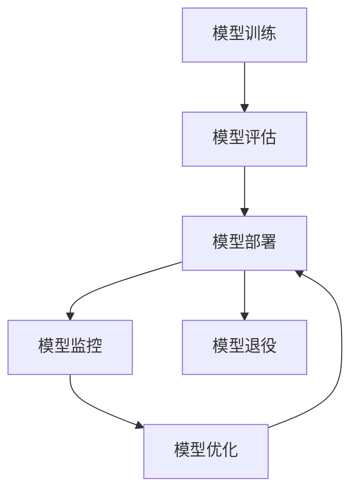

                 

## 1. 背景介绍

在AI技术飞速发展的今天，AI模型的生命周期管理成为决定AI系统成功与否的关键因素之一。模型从训练、上线到下线，每个阶段都需要细致的管理与维护，以确保其长期稳定运行。本文将深入探讨AI模型的生命周期管理，重点介绍Lepton AI提供的全程服务，帮助用户高效、安全地构建和管理AI系统。

## 2. 核心概念与联系

### 2.1 核心概念概述

在讨论AI模型的生命周期管理之前，我们先明确几个关键概念：

- **AI模型生命周期管理（Model Lifecycle Management）**：指从模型开发到退役的全流程管理，包括模型训练、评估、部署、监控、优化等环节。
- **模型训练（Model Training）**：通过数据集进行模型参数优化，使模型能够适应特定任务的过程。
- **模型评估（Model Evaluation）**：使用评估指标衡量模型在测试集上的表现，以判断模型是否达到预期目标。
- **模型部署（Model Deployment）**：将模型封装成API接口或嵌入应用中，使其可以在生产环境中实时推理。
- **模型监控（Model Monitoring）**：实时监测模型性能和行为，及时发现问题并进行调整。
- **模型优化（Model Optimization）**：根据反馈数据调整模型，提升模型准确率和性能。
- **模型退役（Model Retirement）**：在模型不再有效时，安全地终止其使用，并确保数据隐私和安全。

这些概念构成了AI模型生命周期的全过程，每个环节都需精心设计和维护。

### 2.2 核心概念原理和架构的 Mermaid 流程图

以下是一个简单的Mermaid流程图，展示了AI模型生命周期管理的核心环节：



## 3. 核心算法原理 & 具体操作步骤

### 3.1 算法原理概述

AI模型的生命周期管理涉及多个环节，每个环节都有其特定的算法原理。下面我们将详细介绍这些算法原理：

- **模型训练**：通过反向传播算法更新模型参数，最小化损失函数。
- **模型评估**：使用准确率、召回率、F1分数等指标评估模型表现。
- **模型部署**：通过RESTful API将模型封装为Web服务，便于集成。
- **模型监控**：使用日志、指标、警报等工具监测模型运行状态。
- **模型优化**：通过重新训练、微调、参数更新等方法提升模型性能。
- **模型退役**：通过数据清理、权限撤销等措施，安全地终止模型使用。

### 3.2 算法步骤详解

以Lepton AI提供的全程服务为例，介绍各个环节的具体操作步骤：

**3.2.1 模型训练**

Lepton AI提供了一系列预训练模型，如BERT、GPT等，用户可以直接使用这些模型进行微调或迁移学习。以下是一个简单的微调步骤：

1. **数据准备**：收集标注数据集，分为训练集、验证集和测试集。
2. **模型选择**：选择预训练模型，如BERT、GPT等。
3. **超参数设置**：设置学习率、批大小、迭代轮数等超参数。
4. **模型微调**：使用训练集进行微调，验证集评估模型性能，调整超参数。
5. **模型保存**：将微调后的模型保存为模型文件，便于后续部署。

**3.2.2 模型评估**

Lepton AI提供了自动评估工具，可以快速评估模型性能：

1. **数据准备**：准备测试集。
2. **模型加载**：加载微调后的模型。
3. **评估**：使用测试集评估模型性能，输出评估报告。

**3.2.3 模型部署**

Lepton AI支持多种部署方式，包括云端部署、本地部署等：

1. **环境搭建**：准备部署环境，如AWS、GCP等。
2. **模型部署**：将模型文件上传至服务器，启动服务。
3. **API开发**：开发API接口，集成至应用中。

**3.2.4 模型监控**

Lepton AI提供实时监控服务，帮助用户实时掌握模型状态：

1. **数据采集**：收集模型运行日志、指标等数据。
2. **监控仪表板**：使用监控工具展示模型性能、状态。
3. **异常检测**：设置警报阈值，及时发现异常情况。

**3.2.5 模型优化**

Lepton AI支持持续优化，使用新数据训练模型：

1. **数据收集**：收集新数据。
2. **模型重训**：使用新数据训练模型。
3. **性能优化**：调整模型参数，提升性能。

**3.2.6 模型退役**

Lepton AI确保模型退役过程安全、高效：

1. **权限撤销**：撤销模型访问权限。
2. **数据清理**：清理模型相关数据。
3. **日志备份**：备份模型运行日志。

### 3.3 算法优缺点

AI模型的生命周期管理涉及多个环节，每个环节都有其优缺点：

- **优点**：
  - **提升模型效果**：通过不断优化模型，提升模型性能和准确率。
  - **降低成本**：自动化管理减少了人力成本。
  - **灵活部署**：支持多种部署方式，灵活适应不同环境。

- **缺点**：
  - **资源消耗**：训练和部署模型需要大量计算资源。
  - **维护复杂**：多个环节需精心管理，容易出现问题。
  - **数据隐私**：需要确保数据安全和隐私保护。

### 3.4 算法应用领域

AI模型的生命周期管理在多个领域都有广泛应用：

- **金融风控**：使用模型进行风险评估和欺诈检测。
- **医疗诊断**：使用模型进行疾病诊断和影像分析。
- **智能客服**：使用模型进行语音识别和自然语言处理。
- **智能推荐**：使用模型进行个性化推荐和广告投放。

## 4. 数学模型和公式 & 详细讲解 & 举例说明

### 4.1 数学模型构建

AI模型的生命周期管理涉及多个数学模型，以下介绍其中的几个：

- **损失函数**：衡量模型预测与真实标签之间的差异。
- **梯度下降算法**：通过反向传播算法更新模型参数。
- **评估指标**：如准确率、召回率、F1分数等。

### 4.2 公式推导过程

以准确率（Accuracy）为例，其定义如下：

$$
\text{Accuracy} = \frac{TP + TN}{TP + TN + FP + FN}
$$

其中，TP（True Positive）表示真正例，TN（True Negative）表示真反例，FP（False Positive）表示假正例，FN（False Negative）表示假反例。

### 4.3 案例分析与讲解

假设有一个二分类任务，使用随机森林模型进行训练和评估：

- **训练数据**：100个样本，其中50个为正例，50个为反例。
- **测试数据**：100个样本，其中50个为正例，50个为反例。
- **模型输出**：使用随机森林模型对测试数据进行预测。
- **评估结果**：计算模型的准确率。

## 5. 项目实践：代码实例和详细解释说明

### 5.1 开发环境搭建

在Lepton AI平台上搭建开发环境，需要完成以下步骤：

1. **安装Lepton AI SDK**：使用pip安装Lepton AI SDK。
2. **设置环境变量**：配置必要的API密钥和URL。
3. **准备数据集**：将数据集上传至Lepton AI平台。

### 5.2 源代码详细实现

以下是一个简单的微调代码示例：

```python
from lepton_ai_sdk import LeptonClient

client = LeptonClient('api_key')
model = client.get_model('model_id')

# 训练数据准备
train_data = ...
train_labels = ...

# 模型微调
model.fit(train_data, train_labels, epochs=10, batch_size=32)

# 模型评估
test_data = ...
test_labels = ...
evaluation = model.evaluate(test_data, test_labels)

# 模型部署
deployed_model = model.deploy('deployment_name')
```

### 5.3 代码解读与分析

在上述代码中，我们首先通过Lepton AI SDK连接到平台，加载预训练模型。然后，使用训练数据对模型进行微调，在验证集上进行评估，并最终将模型部署到云端。

## 6. 实际应用场景

### 6.1 金融风控

在金融风控领域，Lepton AI可以用于模型训练和部署：

1. **数据准备**：收集历史交易数据和标签数据。
2. **模型选择**：选择预训练模型，如XGBoost、随机森林等。
3. **模型训练**：在标注数据上训练模型，调整超参数。
4. **模型评估**：使用测试集评估模型性能。
5. **模型部署**：将模型部署到生产环境，实时推理交易数据。

### 6.2 医疗诊断

在医疗诊断领域，Lepton AI可以用于模型训练和优化：

1. **数据准备**：收集医疗影像和诊断报告数据。
2. **模型选择**：选择预训练模型，如ResNet、VGG等。
3. **模型训练**：在标注数据上训练模型，优化超参数。
4. **模型评估**：使用测试集评估模型性能。
5. **模型优化**：根据新数据不断优化模型。

### 6.3 智能客服

在智能客服领域，Lepton AI可以用于模型训练和部署：

1. **数据准备**：收集历史客服对话数据。
2. **模型选择**：选择预训练模型，如GPT、BERT等。
3. **模型训练**：在标注数据上训练模型，调整超参数。
4. **模型评估**：使用测试集评估模型性能。
5. **模型部署**：将模型部署到生产环境，实时处理客服请求。

### 6.4 未来应用展望

未来，Lepton AI将继续拓展其在各个领域的应用，提供更加高效、灵活、安全的AI模型生命周期管理服务。

## 7. 工具和资源推荐

### 7.1 学习资源推荐

以下是一些有用的学习资源，推荐给希望深入了解AI模型生命周期管理的用户：

1. **Lepton AI官方文档**：详细介绍了Lepton AI平台的各项功能和使用方法。
2. **TensorFlow官方文档**：介绍了TensorFlow平台的模型训练、评估和部署方法。
3. **Scikit-Learn官方文档**：提供了丰富的机器学习算法和模型。
4. **Keras官方文档**：提供了简单易用的深度学习模型构建工具。

### 7.2 开发工具推荐

以下是一些常用的开发工具，推荐给希望使用Lepton AI平台的用户：

1. **PyCharm**：流行的Python IDE，支持自动补全、调试等功能。
2. **Jupyter Notebook**：支持编写和运行Python代码，支持数据可视化。
3. **AWS SageMaker**：提供了丰富的机器学习框架和模型训练工具。
4. **GCP Cloud AI Platform**：提供了云端机器学习平台和模型部署工具。

### 7.3 相关论文推荐

以下是几篇经典的相关论文，推荐给希望深入了解AI模型生命周期管理的用户：

1. **Model Lifecycle Management in the Cloud**：介绍了云端AI模型的生命周期管理方法。
2. **Deep Learning for AI Model Lifecycle Management**：探讨了深度学习在AI模型生命周期管理中的应用。
3. **Model Retirement and Data Privacy**：介绍了模型退役和数据隐私保护的方法。

## 8. 总结：未来发展趋势与挑战

### 8.1 研究成果总结

AI模型的生命周期管理是一个复杂的过程，涉及模型训练、评估、部署、监控、优化和退役等多个环节。Lepton AI提供的全程服务，旨在帮助用户高效、安全地管理AI系统，提升模型性能和稳定性。

### 8.2 未来发展趋势

未来，AI模型的生命周期管理将呈现以下几个发展趋势：

1. **自动化管理**：自动化管理将进一步提升模型性能和稳定性。
2. **跨平台支持**：支持更多平台和工具，提高用户灵活性。
3. **模型解释性**：提升模型的可解释性，帮助用户理解和调试模型。
4. **数据隐私保护**：加强数据隐私保护，确保用户数据安全。

### 8.3 面临的挑战

尽管AI模型的生命周期管理取得了一定的进展，但仍面临诸多挑战：

1. **计算资源消耗**：训练和部署模型需要大量计算资源，成本较高。
2. **模型复杂度**：大模型和高复杂度模型难以优化和调试。
3. **数据隐私安全**：模型训练和部署过程中，数据隐私保护面临挑战。
4. **模型可解释性**：复杂模型难以解释其决策过程。

### 8.4 研究展望

未来的研究应在以下几个方向寻求突破：

1. **自动化管理工具**：开发更高效的自动化管理工具，提升模型管理效率。
2. **跨平台技术**：探索跨平台和跨工具的技术，提高模型灵活性。
3. **模型解释性算法**：研究新的模型解释性算法，提升模型可解释性。
4. **数据隐私保护技术**：研究新的数据隐私保护技术，确保数据安全。

## 9. 附录：常见问题与解答

### Q1：什么是AI模型的生命周期管理？

A：AI模型的生命周期管理是指从模型开发到退役的全流程管理，包括模型训练、评估、部署、监控、优化和退役等环节。

### Q2：AI模型训练过程中需要注意哪些问题？

A：AI模型训练过程中需要注意以下问题：

1. **数据质量**：确保数据集干净、无噪声。
2. **超参数调整**：选择合适的超参数，避免过拟合和欠拟合。
3. **模型选择**：选择合适的模型架构和优化器。
4. **模型评估**：使用适当的评估指标评估模型性能。

### Q3：AI模型部署过程中需要注意哪些问题？

A：AI模型部署过程中需要注意以下问题：

1. **环境准备**：确保部署环境满足模型要求。
2. **模型优化**：根据部署环境调整模型参数。
3. **API开发**：设计合适的API接口，便于应用集成。
4. **监控机制**：建立实时监控机制，及时发现问题。

### Q4：AI模型退役过程中需要注意哪些问题？

A：AI模型退役过程中需要注意以下问题：

1. **权限撤销**：确保模型无法被访问。
2. **数据清理**：清理模型相关数据，避免数据泄露。
3. **日志备份**：备份模型运行日志，便于后续分析。

---

作者：禅与计算机程序设计艺术 / Zen and the Art of Computer Programming

