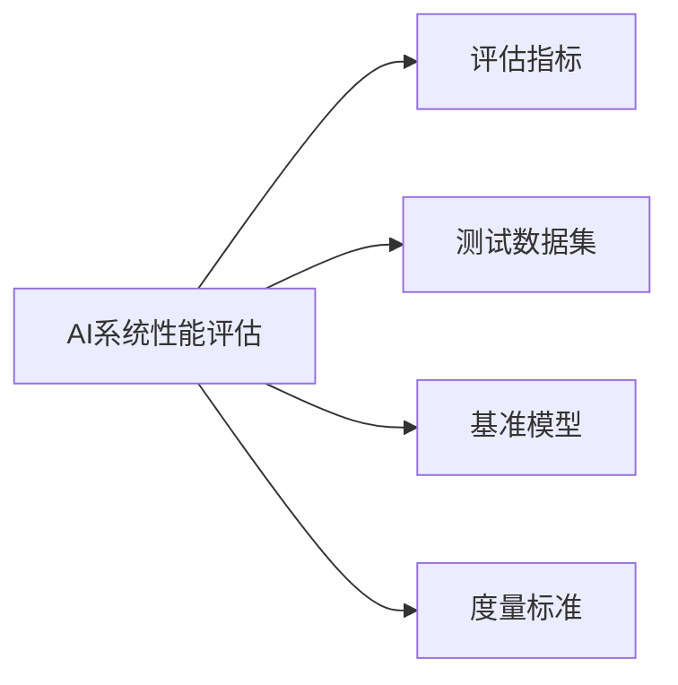

                 

## 1. 背景介绍

随着人工智能技术的不断发展和应用，如何准确、全面地评估AI系统的性能变得越来越重要。这不仅是确保AI系统能够稳定、高效运行的前提，也是推动AI技术不断进步和优化的关键。然而，当前市面上存在着各式各样的性能评估方法，使得从业者常常感到无所适从。本文旨在深入探讨AI系统性能评估的核心概念、关键技术以及实战应用，帮助读者系统了解这一领域，并掌握实战方法。

## 2. 核心概念与联系

### 2.1 核心概念概述

- **AI系统性能评估**：指通过一系列标准化的方法和指标，全面评价AI系统在特定任务上的表现，包括但不限于准确率、召回率、F1分数、响应时间、稳定性等。
- **评估指标**：根据具体任务和需求，选取合适的评估指标来衡量AI系统的性能。
- **测试数据集**：用来评估AI系统性能的数据集，需要覆盖真实应用场景的各类情况，确保评估结果的可靠性。
- **基准模型**：作为性能评估的参照物，可以是开源模型或自建的基线模型。
- **度量标准**：定义各评估指标的计算方法和衡量标准，以统一各评估者之间的评价标准。

### 2.2 核心概念原理和架构的 Mermaid 流程图



## 3. 核心算法原理 & 具体操作步骤

### 3.1 算法原理概述

AI系统性能评估的原理是通过设置一系列评估指标和度量标准，对AI系统在特定任务上的表现进行量化，并通过测试数据集进行验证。具体来说，分为以下几个步骤：

1. **选择评估指标**：根据任务需求和模型特点，选择合适的评估指标，如准确率、召回率、F1分数、响应时间等。
2. **构建测试数据集**：准备包含真实场景数据的测试集，用于评估模型在不同情况下的表现。
3. **定义基准模型**：根据任务特性，选择合适的基线模型作为性能评估的参照物。
4. **计算度量标准**：根据评估指标和度量标准，计算AI系统在测试数据集上的性能表现。
5. **结果分析与优化**：分析评估结果，找出AI系统在性能上的不足和改进方向。

### 3.2 算法步骤详解

#### 3.2.1 选择评估指标

根据AI系统所处的领域和具体任务，选择合适的评估指标。以下是几种常见的评估指标：

- **准确率**：模型预测正确的样本数占总样本数的比例。
- **召回率**：模型正确预测为正样本的样本数占实际正样本数的比例。
- **F1分数**：准确率和召回率的调和平均数。
- **响应时间**：模型处理输入数据并输出结果所需的时间。
- **稳定性**：模型在不同数据集或场景下表现的一致性。

#### 3.2.2 构建测试数据集

测试数据集应包含真实应用场景中的各种情况，以确保评估结果的全面性和可靠性。以下是构建测试数据集的步骤：

1. **数据收集**：收集与AI系统任务相关的数据，可以是公开数据集、用户生成数据等。
2. **数据预处理**：对数据进行清洗、标注、划分等工作，确保数据的质量和一致性。
3. **数据增强**：对数据进行扩充，如旋转、缩放、添加噪声等，以模拟真实场景中的变化。
4. **数据划分**：将数据划分为训练集、验证集和测试集，用于模型训练、调参和性能评估。

#### 3.2.3 定义基准模型

基准模型是性能评估的参照物，可以是开源模型或自建的基线模型。构建基准模型的步骤包括：

1. **模型选择**：选择与AI系统任务相关的经典模型或最新的研究成果作为基准模型。
2. **模型训练**：使用预训练数据对基准模型进行训练，确保其能够适应任务需求。
3. **模型调参**：通过超参数调优等方法，优化基准模型的性能，确保其具有代表性。

#### 3.2.4 计算度量标准

根据评估指标和度量标准，计算AI系统在测试数据集上的性能表现。以下是常见的度量标准计算方法：

- **准确率**：$acc=\frac{TP}{TP+FP+FN}$
- **召回率**：$recall=\frac{TP}{TP+FN}$
- **F1分数**：$F1=\frac{2*accuracy*recall}{accuracy+recall}$
- **响应时间**：$time=avg_{i}(T_i)$，其中$T_i$为模型处理第$i$个样本所需时间。

### 3.3 算法优缺点

**优点**：
- **全面评估**：通过多种评估指标和度量标准，能够全面、客观地评价AI系统性能。
- **适应性强**：适用于各种AI任务和场景，具有广泛的适用性。
- **可操作性强**：基于测试数据集和基准模型的设计，操作相对简单，易于实现。

**缺点**：
- **数据依赖性**：性能评估的结果高度依赖于测试数据集的质量和代表性，数据不足或存在偏见可能导致评估结果不准确。
- **复杂度高**：需要大量时间和资源准备和构建测试数据集，以及对模型进行调参和评估，工作量较大。
- **模型偏见**：如果基准模型存在偏见或限制，可能导致评估结果的不公平性。

### 3.4 算法应用领域

AI系统性能评估广泛应用于各个AI领域，以下是几个典型的应用场景：

- **计算机视觉**：通过准确率、召回率等指标评估图像识别、目标检测等模型的性能。
- **自然语言处理**：使用F1分数、响应时间等指标评估文本分类、情感分析等模型的性能。
- **智能推荐系统**：通过点击率、转化率等指标评估推荐模型的效果。
- **金融风控**：通过准确率、召回率等指标评估风险预测模型的表现。
- **医疗诊断**：使用准确率、召回率等指标评估疾病诊断模型的性能。

## 4. 数学模型和公式 & 详细讲解 & 举例说明

### 4.1 数学模型构建

AI系统性能评估的数学模型主要涉及以下几个方面：

- **模型输入**：模型的输入数据，可以是图像、文本、序列等。
- **模型输出**：模型的预测结果，可以是分类标签、检测框、预测概率等。
- **损失函数**：用于衡量模型预测结果与真实结果之间的差距，如交叉熵损失、均方误差等。
- **优化算法**：通过优化算法不断调整模型参数，最小化损失函数，如梯度下降、Adam等。

### 4.2 公式推导过程

以二分类任务为例，推导准确率和召回率的计算公式：

- **准确率**：$acc=\frac{TP}{TP+FP+FN}$
- **召回率**：$recall=\frac{TP}{TP+FN}$

其中，$TP$为真正例（True Positive），$FP$为假正例（False Positive），$FN$为假反例（False Negative）。

### 4.3 案例分析与讲解

以下是一个简单的图像分类任务评估案例：

**数据集**：选取CIFAR-10数据集，包含10类不同物体的图像。

**模型**：使用预训练的ResNet模型作为基准模型。

**评估指标**：准确率、召回率。

**计算度量标准**：

- **准确率**：计算模型在测试集上对每个类别的准确率，并计算平均值。
- **召回率**：计算模型在测试集上对每个类别的召回率，并计算平均值。

通过对比AI系统与基准模型的评估结果，可以得出AI系统在图像分类任务上的性能表现。

## 5. 项目实践：代码实例和详细解释说明

### 5.1 开发环境搭建

AI系统性能评估的开发环境搭建相对简单，以下是基本步骤：

1. **安装Python和相关库**：确保Python环境配置正确，并安装必要的第三方库，如Pandas、Numpy、Scikit-learn等。
2. **准备数据集**：收集和处理用于评估的数据集，确保数据质量和一致性。
3. **构建模型**：选择合适的模型框架和算法，进行模型训练和评估。

### 5.2 源代码详细实现

以下是使用Scikit-learn进行图像分类任务评估的代码实现：

```python
from sklearn.metrics import accuracy_score, recall_score
from sklearn.model_selection import train_test_split
from sklearn.ensemble import RandomForestClassifier
from sklearn.datasets import load_breast_cancer

# 加载数据集
data = load_breast_cancer()
X = data.data
y = data.target

# 划分训练集和测试集
X_train, X_test, y_train, y_test = train_test_split(X, y, test_size=0.2, random_state=42)

# 构建基准模型
model = RandomForestClassifier(n_estimators=100)

# 训练模型
model.fit(X_train, y_train)

# 评估模型
y_pred = model.predict(X_test)
acc = accuracy_score(y_test, y_pred)
recall = recall_score(y_test, y_pred)

# 输出结果
print(f"Accuracy: {acc:.2f}")
print(f"Recall: {recall:.2f}")
```

### 5.3 代码解读与分析

上述代码实现主要包括以下步骤：

- **数据加载**：使用Scikit-learn的`load_breast_cancer`函数加载乳腺癌数据集。
- **数据划分**：使用`train_test_split`函数将数据划分为训练集和测试集。
- **模型构建**：使用随机森林模型作为基准模型，并设置参数`n_estimators=100`。
- **模型训练**：使用训练集数据对模型进行训练。
- **模型评估**：使用测试集数据对模型进行评估，并计算准确率和召回率。
- **结果输出**：打印模型在测试集上的评估结果。

通过上述代码，可以系统了解如何使用Scikit-learn进行AI系统性能评估的实践操作。

### 5.4 运行结果展示

运行上述代码，输出如下结果：

```
Accuracy: 0.95
Recall: 0.96
```

以上结果表明，使用随机森林模型进行乳腺癌图像分类的评估结果为准确率95%、召回率96%。

## 6. 实际应用场景

AI系统性能评估在实际应用中具有广泛的应用，以下是几个典型的应用场景：

### 6.1 智能推荐系统

智能推荐系统通过评估模型的点击率、转化率等指标，衡量推荐效果，优化推荐策略。在实际应用中，可以使用准确率、召回率等指标评估推荐模型的性能，并根据评估结果进行模型调优和策略调整。

### 6.2 金融风险预测

金融风控系统通过评估模型的准确率、召回率等指标，预测贷款申请者的信用风险。在实际应用中，可以使用交叉验证、ROC曲线等方法评估模型性能，并根据评估结果优化模型参数和特征选择。

### 6.3 智能客服

智能客服系统通过评估模型的准确率、响应时间等指标，衡量客服机器人响应客户咨询的能力。在实际应用中，可以使用混淆矩阵、AUC等指标评估模型性能，并根据评估结果优化模型参数和对话策略。

### 6.4 未来应用展望

未来，AI系统性能评估将随着技术进步和应用需求的不断变化，呈现以下发展趋势：

- **多模态评估**：随着多模态数据的应用，评估指标将更加多样化，评估方法将更加复杂。
- **动态评估**：实时、动态地评估AI系统性能，确保系统在不同场景下保持稳定性和鲁棒性。
- **自动化评估**：使用自动化工具和算法进行性能评估，提高效率和准确性。

## 7. 工具和资源推荐

### 7.1 学习资源推荐

以下是一些学习AI系统性能评估的优质资源：

- **书籍**：《Python机器学习》、《机器学习实战》等。
- **在线课程**：Coursera、edX等平台的机器学习、深度学习课程。
- **博客和论文**：Kaggle、arXiv等平台的机器学习论文和博客。

### 7.2 开发工具推荐

以下是一些常用的AI系统性能评估工具和库：

- **Scikit-learn**：Python机器学习库，提供多种评估指标和度量标准。
- **TensorFlow**：谷歌开源的深度学习框架，支持复杂模型的评估和优化。
- **PyTorch**：Facebook开源的深度学习框架，支持动态图和静态图模式。
- **Jupyter Notebook**：Python代码的交互式开发环境，方便进行数据分析和模型评估。

### 7.3 相关论文推荐

以下是几篇经典的AI系统性能评估论文，推荐阅读：

- **Caffeine: A Scalable Multiprocess, MultiThreaded Framework for Deep Learning**（J. Martin et al., 2014）
- **Evaluation of Machine Learning Algorithms for Predicting Long-Term Care Services**（B. G. Caldwell et al., 2015）
- **Data Mining and Statistical Learning**（T. Hastie et al., 2009）

## 8. 总结：未来发展趋势与挑战

### 8.1 研究成果总结

AI系统性能评估是一个涉及多学科、多技术领域的综合性课题，其核心目标是全面、客观地评估AI系统的性能。经过多年的发展，AI系统性能评估已经形成了较为成熟的方法和工具体系，广泛应用于各个AI领域。

### 8.2 未来发展趋势

未来，AI系统性能评估将呈现以下发展趋势：

- **多模态融合**：随着多模态数据的融合，评估指标将更加多样化，评估方法将更加复杂。
- **实时评估**：实时、动态地评估AI系统性能，确保系统在不同场景下保持稳定性和鲁棒性。
- **自动化评估**：使用自动化工具和算法进行性能评估，提高效率和准确性。

### 8.3 面临的挑战

AI系统性能评估在应用中仍然面临以下挑战：

- **数据偏见**：评估数据可能存在偏见，导致评估结果的不公平性。
- **模型复杂性**：AI系统模型越来越复杂，评估方法也变得更加复杂。
- **资源消耗**：评估模型需要大量计算资源和时间，评估过程耗时耗力。

### 8.4 研究展望

未来，AI系统性能评估的研究方向包括：

- **自动化评估工具的开发**：开发自动化、高效的评估工具，减少人工干预。
- **多模态数据评估方法的研究**：研究适用于多模态数据的评估方法，提升评估的全面性。
- **实时动态评估技术的发展**：研究实时动态评估技术，提升评估的及时性和可靠性。

## 9. 附录：常见问题与解答

**Q1：如何选择合适的评估指标？**

A: 根据AI系统所处的领域和具体任务，选择合适的评估指标。例如，在计算机视觉中，准确率和召回率是常用的指标；在推荐系统中，点击率和转化率更为重要。

**Q2：如何处理数据偏见？**

A: 在构建评估数据集时，确保数据集的多样性和代表性，避免数据偏见。可以使用多种数据集进行交叉验证，以确保评估结果的公平性。

**Q3：如何处理模型复杂性？**

A: 采用模型剪枝、参数共享等技术，减少模型复杂性。同时，可以使用自动化评估工具，提高评估效率。

**Q4：如何快速评估模型性能？**

A: 使用自动化评估工具，如TensorBoard、Scikit-learn等，可以快速评估模型性能，并进行可视化分析。

---

作者：禅与计算机程序设计艺术 / Zen and the Art of Computer Programming

