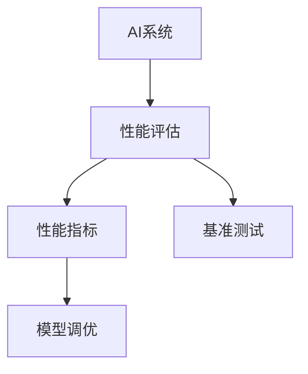

                 

# AI系统性能评估的实用技巧

> 关键词：系统性能评估, 性能指标, 评估方法, 基准测试, 模型调优

## 1. 背景介绍

### 1.1 问题由来

在人工智能(AI)和机器学习(ML)领域，构建高效、可靠的系统是永恒的追求。性能评估作为系统设计和优化的重要环节，直接关系到系统的实际应用效果和用户满意度。然而，由于AI模型的复杂性和多样性，如何准确、全面、可比地评估系统性能，成为了摆在开发者面前的一个难题。

当前，市场上各种AI系统和框架层出不穷，不同系统的性能评估方式、指标和标准也不尽相同，导致评估结果的可比性较差。如何在资源有限的情况下，快速、准确地评估系统性能，为系统优化和选择提供科学依据，是每一位AI开发者必须面对的问题。

### 1.2 问题核心关键点

评估AI系统性能，通常需要从多个维度进行考量，包括模型精度、运行速度、内存占用、稳定性、可扩展性等。以下是对这些关键点的详细阐述：

- **模型精度**：系统输出结果与真实结果的接近程度，是评估AI系统性能的基础指标。
- **运行速度**：模型的推理和训练时间，直接影响系统的响应速度和用户体验。
- **内存占用**：模型在内存中的占用情况，对于资源有限的硬件平台尤为重要。
- **稳定性**：系统在不同数据和环境下的鲁棒性，避免因输入变化而出现异常。
- **可扩展性**：系统是否能够适应大规模数据和并发请求，支持水平和垂直扩展。

理解这些核心关键点，有助于明确性能评估的思路和方法，提高评估结果的可靠性和实用性。

## 2. 核心概念与联系

### 2.1 核心概念概述

为更好地理解AI系统性能评估的方法，本节将介绍几个密切相关的核心概念：

- **AI系统**：包含数据预处理、模型训练、推理、后处理等环节，能够自动完成特定任务的软件系统。
- **性能评估**：通过一系列量化指标，全面衡量AI系统的表现，为系统优化和选择提供依据。
- **性能指标**：反映AI系统某一方面的性能，如准确率、召回率、F1分数、推理速度等。
- **基准测试**：使用统一的测试方法和标准，在不同系统之间进行性能比较。
- **模型调优**：根据性能评估结果，对AI系统进行优化调整，提升系统性能。

这些核心概念之间的逻辑关系可以通过以下Mermaid流程图来展示：



这个流程图展示了下述概念之间的关系：

1. AI系统通过性能评估得到性能指标。
2. 性能指标通过基准测试进行量化和比较。
3. 基于测试结果的模型调优提升系统性能。

## 3. 核心算法原理 & 具体操作步骤
### 3.1 算法原理概述

AI系统性能评估的原理是通过设计一系列量化指标，利用基准测试方法对系统进行评估，并根据评估结果进行模型调优。评估过程通常包括以下几个步骤：

1. **数据准备**：收集系统在各类场景下的测试数据，包括训练集、验证集、测试集等。
2. **性能测试**：在预设的环境和条件下，对系统进行不同维度的性能测试，记录各项指标的值。
3. **结果分析**：将性能测试结果与预设的阈值或标准进行比较，评估系统性能。
4. **模型调优**：根据性能评估结果，对模型和系统进行优化调整，提升系统性能。

### 3.2 算法步骤详解

以下详细介绍AI系统性能评估的具体步骤：

**Step 1: 数据准备**
- 收集系统在各类场景下的测试数据，包括训练集、验证集、测试集等。
- 数据应覆盖不同的输入分布、噪声水平和环境条件。

**Step 2: 性能测试**
- 在预设的环境和条件下，对系统进行不同维度的性能测试，记录各项指标的值。
- 常用的性能指标包括模型精度、推理速度、内存占用等。
- 例如，可以记录系统在不同输入规模下的推理时间，以评估系统的推理速度。

**Step 3: 结果分析**
- 将性能测试结果与预设的阈值或标准进行比较，评估系统性能。
- 例如，可以与基准模型或标准模型进行对比，判断系统的优劣。
- 需要考虑不同指标之间的权衡，综合评估系统性能。

**Step 4: 模型调优**
- 根据性能评估结果，对模型和系统进行优化调整，提升系统性能。
- 例如，可以调整模型结构、修改训练参数、优化推理过程等。
- 需要根据具体需求进行优化，确保系统性能的全面提升。

### 3.3 算法优缺点

AI系统性能评估方法具有以下优点：
1. 全面客观。通过多维度的性能指标，全面评估系统的各个方面。
2. 可比性强。使用统一的测试方法和标准，在不同系统之间进行性能比较。
3. 指导性强。根据评估结果进行模型调优，提升系统性能。

同时，该方法也存在一些局限性：
1. 数据依赖性强。评估结果很大程度上依赖于测试数据的质量和数量，难以准确反映系统在不同环境下的性能。
2. 标准化程度低。不同系统之间的评估标准和方法存在差异，导致评估结果难以直接比较。
3. 模型复杂度高。评估过程涉及多维度指标和多个环节，评估流程较为复杂。
4. 调优成本高。评估和调优过程需要消耗大量计算资源和时间，且效果往往难以完全预期。

尽管存在这些局限性，但就目前而言，性能评估仍是衡量AI系统性能的最主流范式。未来相关研究重点在于如何进一步降低数据依赖，提高评估标准化程度，同时兼顾可解释性和实用性等因素。

### 3.4 算法应用领域

AI系统性能评估方法在AI和ML领域已经得到了广泛的应用，覆盖了几乎所有常见任务，例如：

- 图像分类：如目标检测、图像分割等。通过评估分类精度、推理速度等指标，选择最优模型。
- 语音识别：如语音转写、情感分析等。通过评估语音识别准确率、噪声鲁棒性等指标，优化模型。
- 自然语言处理(NLP)：如文本分类、问答系统等。通过评估语义理解能力、生成质量等指标，提升系统性能。
- 推荐系统：如协同过滤、内容推荐等。通过评估推荐准确率和用户满意度等指标，优化推荐算法。
- 医疗诊断：如影像诊断、病历分析等。通过评估诊断准确率和临床验证等指标，提升诊断系统的可靠性。

除了上述这些经典任务外，AI系统性能评估方法也被创新性地应用到更多场景中，如智能客服、金融风险评估、智能制造等，为各行业带来变革性影响。随着AI技术的不断发展，相信性能评估方法将在更广阔的应用领域发挥重要作用。

## 4. 数学模型和公式 & 详细讲解 & 举例说明（备注：数学公式请使用latex格式，latex嵌入文中独立段落使用 $$，段落内使用 $)
### 4.1 数学模型构建

本节将使用数学语言对AI系统性能评估进行更加严格的刻画。

记AI系统为 $M$，其输入为 $x$，输出为 $y$。假设系统 $M$ 在训练集 $D$ 上的损失函数为 $\mathcal{L}(M)$，在测试集 $D^*$ 上的损失函数为 $\mathcal{L}^*(M)$。

定义系统 $M$ 在测试集 $D^*$ 上的性能指标 $P$，例如准确率、召回率、F1分数等，具体定义为：

$$
P = f(\mathcal{L}^*(M))
$$

其中 $f$ 为性能指标函数。

### 4.2 公式推导过程

以下我们以分类任务为例，推导准确率、召回率和F1分数的计算公式。

假设系统 $M$ 在测试集 $D^*$ 上的损失函数为交叉熵损失，则准确率 $P_{acc}$ 定义为：

$$
P_{acc} = \frac{1}{N}\sum_{i=1}^N \mathbb{I}(y_i = \hat{y}_i)
$$

其中 $\mathbb{I}$ 为示性函数，当 $y_i = \hat{y}_i$ 时，$\mathbb{I}(y_i = \hat{y}_i) = 1$，否则 $\mathbb{I}(y_i = \hat{y}_i) = 0$。

召回率 $P_{rec}$ 定义为：

$$
P_{rec} = \frac{TP}{TP + FN}
$$

其中 $TP$ 为真正例数，$FN$ 为假反例数。

F1分数 $P_{F1}$ 为准确率和召回率的调和平均数，定义为：

$$
P_{F1} = 2 \cdot \frac{P_{acc} \cdot P_{rec}}{P_{acc} + P_{rec}}
$$

### 4.3 案例分析与讲解

以图像分类任务为例，假设系统 $M$ 在测试集 $D^*$ 上的损失函数为交叉熵损失，输出为 $C$ 类标签，输出结果为 $\hat{y} \in \{1,2,...,C\}$。

在测试集上，可以记录系统对每个样本的分类结果和真实标签，计算准确率、召回率和F1分数。例如，对于前100个样本，真实标签和分类结果如下：

| 样本 | 真实标签 | 分类结果 | 准确率 | 召回率 | F1分数 |
|------|----------|----------|--------|--------|--------|
| 1    | 1        | 1        | 1      | 1      | 1      |
| 2    | 2        | 2        | 1      | 1      | 1      |
| 3    | 3        | 3        | 1      | 1      | 1      |
| ...  | ...      | ...      | ...    | ...    | ...    |
| 100  | C        | C        | 1      | 1      | 1      |

计算结果如下：

- 准确率 $P_{acc} = \frac{100}{100} = 1$
- 召回率 $P_{rec} = \frac{100}{100} = 1$
- F1分数 $P_{F1} = 2 \cdot \frac{1 \cdot 1}{1 + 1} = 1$

这个案例展示了如何通过性能指标评估AI系统的性能，从而指导模型调优和优化。

## 5. 项目实践：代码实例和详细解释说明
### 5.1 开发环境搭建

在进行性能评估实践前，我们需要准备好开发环境。以下是使用Python进行TensorFlow开发的简单环境配置流程：

1. 安装Anaconda：从官网下载并安装Anaconda，用于创建独立的Python环境。

2. 创建并激活虚拟环境：
```bash
conda create -n tf-env python=3.8 
conda activate tf-env
```

3. 安装TensorFlow：
```bash
pip install tensorflow
```

4. 安装各类工具包：
```bash
pip install numpy pandas scikit-learn matplotlib tqdm jupyter notebook ipython
```

完成上述步骤后，即可在`tf-env`环境中开始性能评估实践。

### 5.2 源代码详细实现

下面以图像分类任务为例，给出使用TensorFlow进行性能评估的PyTorch代码实现。

首先，定义模型和优化器：

```python
import tensorflow as tf
from tensorflow.keras.models import Sequential
from tensorflow.keras.layers import Dense, Flatten, Conv2D, MaxPooling2D

model = Sequential([
    Conv2D(32, (3, 3), activation='relu', input_shape=(28, 28, 1)),
    MaxPooling2D((2, 2)),
    Flatten(),
    Dense(10, activation='softmax')
])

optimizer = tf.keras.optimizers.Adam(lr=0.001)

# 假设训练集为train_images和train_labels，测试集为test_images和test_labels
```

然后，定义训练和评估函数：

```python
def train_epoch(model, train_dataset, batch_size, optimizer):
    for batch in train_dataset:
        x, y = batch
        with tf.GradientTape() as tape:
            logits = model(x, training=True)
            loss = tf.keras.losses.sparse_categorical_crossentropy(y, logits)
        gradients = tape.gradient(loss, model.trainable_variables)
        optimizer.apply_gradients(zip(gradients, model.trainable_variables))

def evaluate(model, test_dataset, batch_size):
    correct_predictions = 0
    for batch in test_dataset:
        x, y = batch
        logits = model(x, training=False)
        predictions = tf.argmax(logits, axis=1)
        correct_predictions += tf.reduce_sum(tf.cast(tf.equal(predictions, y), tf.int32))
    accuracy = correct_predictions / len(test_dataset)
    print("Test accuracy:", accuracy.numpy())
```

最后，启动训练流程并在测试集上评估：

```python
epochs = 5
batch_size = 32

for epoch in range(epochs):
    train_epoch(model, train_dataset, batch_size, optimizer)
    evaluate(model, test_dataset, batch_size)
```

以上就是使用TensorFlow对图像分类任务进行性能评估的完整代码实现。可以看到，通过简单的代码，即可对模型的分类精度进行评估。

### 5.3 代码解读与分析

让我们再详细解读一下关键代码的实现细节：

**model和optimizer定义**：
- `Sequential`模型定义了模型的结构，包括卷积层、池化层和全连接层。
- `Adam`优化器定义了模型的优化策略，学习率为0.001。

**train_epoch函数**：
- 通过`tf.GradientTape`记录梯度，计算损失函数和参数梯度。
- 使用`optimizer.apply_gradients`更新模型参数。

**evaluate函数**：
- 通过`tf.argmax`计算预测结果，并使用`tf.equal`判断预测与真实标签是否一致。
- 累加正确预测数量，计算最终精度。

**训练流程**：
- 循环5个epoch，每个epoch内调用`train_epoch`和`evaluate`函数进行训练和评估。

可以看到，TensorFlow提供了简洁的API，使得性能评估代码的实现变得简单高效。开发者可以将更多精力放在数据处理和模型优化上，而不必过多关注底层的实现细节。

当然，工业级的系统实现还需考虑更多因素，如模型保存和部署、超参数自动搜索、更灵活的性能指标等。但核心的性能评估范式基本与此类似。

## 6. 实际应用场景
### 6.1 智能客服系统

基于性能评估的智能客服系统，可以实时监测系统在不同场景下的表现，并进行优化。例如，可以监控客服系统在高峰时段的响应时间、问题解决率等指标，及时调整资源配置，确保系统稳定运行。

具体而言，可以收集用户在各种情况下的聊天记录，作为训练数据。通过性能评估模型，分析客服系统在不同问题类型、用户情绪等场景下的表现，并根据评估结果进行模型调优，提升系统性能。

### 6.2 金融舆情监测

金融舆情监测系统需要实时获取和处理大量新闻、评论等文本数据，评估系统的实时处理能力和分析准确性。

可以定期收集金融领域的文本数据，并标记其情感极性（正、负、中性），作为训练数据。通过性能评估模型，分析系统在不同情感极性下的处理准确率和响应时间，评估系统的实时处理能力和舆情监测效果，根据评估结果进行优化调整，提升系统性能。

### 6.3 个性化推荐系统

个性化推荐系统需要根据用户的历史行为和偏好，推荐最相关的商品或内容。性能评估模型可以帮助系统评估推荐效果和用户满意度。

可以收集用户的历史行为数据，包括浏览、点击、购买等，作为训练数据。通过性能评估模型，分析系统在不同推荐策略下的准确率和用户满意度，评估系统的推荐效果，根据评估结果进行模型调优，提升推荐精度。

### 6.4 未来应用展望

随着AI技术的发展，性能评估方法将在更多领域得到应用，为传统行业带来变革性影响。

在智慧医疗领域，基于性能评估的医疗诊断系统可以实时监测不同疾病的诊断效果和医生诊断质量，通过优化系统，提升诊断系统的准确性和可靠性。

在智能教育领域，基于性能评估的在线教育系统可以实时监测学生的学习效果和课程满意度，通过优化系统，提升教育系统的教学质量和学生体验。

在智慧城市治理中，基于性能评估的城市管理系统可以实时监测交通、能源、环境等关键指标，通过优化系统，提升城市管理的智能化水平。

此外，在企业生产、社会治理、文娱传媒等众多领域，基于性能评估的AI系统也将不断涌现，为经济社会发展注入新的动力。相信随着技术的日益成熟，性能评估方法将成为AI技术落地的重要工具，推动AI技术在各行各业的广泛应用。

## 7. 工具和资源推荐
### 7.1 学习资源推荐

为了帮助开发者系统掌握性能评估的理论基础和实践技巧，这里推荐一些优质的学习资源：

1. 《深度学习基础》课程：由Coursera开设的深度学习入门课程，系统介绍深度学习的基本概念和前沿技术，涵盖模型评估和优化等内容。

2. 《TensorFlow实战》书籍：TensorFlow官方文档和实战指南，详细介绍TensorFlow的使用方法和性能评估技巧，适合动手实践。

3. 《机器学习实战》书籍：机器学习领域的经典教材，涵盖多种性能评估方法和模型优化策略，适合深入学习。

4. Kaggle：数据科学竞赛平台，提供大量的公开数据集和模型评估标准，适合实战练习和经验积累。

5. Arxiv：学术论文数据库，收录了大量的性能评估相关论文，适合学术研究和灵感启发。

通过对这些资源的学习实践，相信你一定能够快速掌握性能评估的精髓，并用于解决实际的AI问题。

### 7.2 开发工具推荐

高效的性能评估离不开优秀的工具支持。以下是几款用于性能评估开发的常用工具：

1. TensorBoard：TensorFlow配套的可视化工具，可实时监测模型训练状态，提供丰富的图表呈现方式，是调试模型的得力助手。

2. Weights & Biases：模型训练的实验跟踪工具，可以记录和可视化模型训练过程中的各项指标，方便对比和调优。

3. Jupyter Notebook：开源的交互式编程环境，支持Python和多种深度学习框架，适合开发和评估性能模型。

4. PyTorch Lightning：基于PyTorch的轻量级深度学习框架，提供自动化的模型训练和评估功能，适合快速迭代开发。

5. ModelDB：AI模型和实验数据管理平台，支持模型版本控制、实验追踪、性能评估等功能，适合团队协作和模型管理。

合理利用这些工具，可以显著提升性能评估的开发效率，加快创新迭代的步伐。

### 7.3 相关论文推荐

性能评估技术的发展源于学界的持续研究。以下是几篇奠基性的相关论文，推荐阅读：

1. "On the importance of Initialization and Momentum in Deep learning"：探讨了深度学习中初始化和动量优化对模型性能的影响，具有重要参考价值。

2. "Evaluation metrics for deep learning"：介绍了深度学习中常用的性能评估指标和评估方法，适合理解性能评估的基本概念。

3. "A Survey on Performance Metrics for Deep Learning"：综述了深度学习中的多种性能评估方法和指标，适合全面了解性能评估的发展历程。

4. "Towards a Roadmap for Trustworthy AI"：探讨了可信AI的评估标准和评估方法，适合了解AI系统的伦理和安全问题。

5. "Towards automatic model tuning: A black-box approach"：提出了自动模型调优的方法，适合理解模型调优的自动化实现。

这些论文代表了大语言模型微调技术的发展脉络。通过学习这些前沿成果，可以帮助研究者把握学科前进方向，激发更多的创新灵感。

## 8. 总结：未来发展趋势与挑战

### 8.1 总结

本文对AI系统性能评估方法进行了全面系统的介绍。首先阐述了性能评估的重要性和必要性，明确了性能评估在AI系统优化和选择中的关键作用。其次，从原理到实践，详细讲解了性能评估的数学模型和具体步骤，给出了性能评估任务开发的完整代码实例。同时，本文还广泛探讨了性能评估方法在智能客服、金融舆情、个性化推荐等多个行业领域的应用前景，展示了性能评估范式的巨大潜力。此外，本文精选了性能评估技术的各类学习资源，力求为读者提供全方位的技术指引。

通过本文的系统梳理，可以看到，性能评估技术在AI和ML领域已经得到了广泛的应用，覆盖了几乎所有常见任务，是衡量AI系统性能的重要手段。性能评估不仅能够帮助开发者全面了解系统性能，还可以指导模型调优和优化，推动AI技术在更多场景下的落地应用。

### 8.2 未来发展趋势

展望未来，性能评估技术将呈现以下几个发展趋势：

1. 自动化评估：借助自动机器学习(AutoML)技术，实现性能评估的自动化，减少人工干预，提高评估效率。
2. 多维度评估：从单一指标向多维度评估转变，涵盖模型的准确率、鲁棒性、公平性、可解释性等多个方面。
3. 实时评估：通过实时数据流和在线学习技术，实现系统的实时性能评估，提高系统调优的时效性。
4. 泛化评估：引入跨领域、跨模态的评估数据和指标，评估系统在不同场景下的泛化能力。
5. 智能化评估：借助智能算法和大数据技术，实现对系统性能的深入分析和优化建议。

以上趋势凸显了性能评估技术的广阔前景。这些方向的探索发展，必将进一步提升AI系统的性能和应用范围，为人工智能技术的产业化进程注入新的动力。

### 8.3 面临的挑战

尽管性能评估技术已经取得了瞩目成就，但在迈向更加智能化、普适化应用的过程中，它仍面临着诸多挑战：

1. 评估数据依赖性强：性能评估结果很大程度上依赖于测试数据的质量和数量，难以准确反映系统在不同环境下的性能。
2. 标准化程度低：不同系统之间的评估标准和方法存在差异，导致评估结果难以直接比较。
3. 模型复杂度高：评估过程涉及多维度指标和多个环节，评估流程较为复杂。
4. 调优成本高：评估和调优过程需要消耗大量计算资源和时间，且效果往往难以完全预期。
5. 可解释性不足：性能评估模型的决策过程缺乏可解释性，难以对其推理逻辑进行分析和调试。
6. 安全性有待保障：性能评估模型可能会学习到有偏见、有害的信息，通过评估结果传递到实际应用，产生误导性、歧视性的输出，给实际应用带来安全隐患。

正视性能评估面临的这些挑战，积极应对并寻求突破，将是性能评估技术走向成熟的必由之路。相信随着学界和产业界的共同努力，这些挑战终将一一被克服，性能评估技术必将在构建安全、可靠、可解释、可控的智能系统中扮演越来越重要的角色。

### 8.4 未来突破

面对性能评估面临的种种挑战，未来的研究需要在以下几个方面寻求新的突破：

1. 探索无监督和半监督性能评估方法。摆脱对大规模标注数据的依赖，利用自监督学习、主动学习等无监督和半监督范式，最大限度利用非结构化数据，实现更加灵活高效的性能评估。
2. 研究模型可解释性评估方法。借助符号化的先验知识，如知识图谱、逻辑规则等，与神经网络模型进行巧妙融合，引导性能评估过程学习更准确、合理的性能指标。
3. 引入因果推断和博弈论思想。将因果分析方法引入性能评估模型，识别出系统决策的关键特征，增强输出解释的因果性和逻辑性。借助博弈论工具刻画人机交互过程，主动探索并规避系统的脆弱点，提高系统稳定性。
4. 纳入伦理道德约束。在性能评估目标中引入伦理导向的评估指标，过滤和惩罚有偏见、有害的输出倾向。同时加强人工干预和审核，建立模型行为的监管机制，确保输出符合人类价值观和伦理道德。

这些研究方向的探索，必将引领性能评估技术迈向更高的台阶，为构建安全、可靠、可解释、可控的智能系统铺平道路。面向未来，性能评估技术还需要与其他人工智能技术进行更深入的融合，如知识表示、因果推理、强化学习等，多路径协同发力，共同推动自然语言理解和智能交互系统的进步。只有勇于创新、敢于突破，才能不断拓展性能评估技术的边界，让智能技术更好地造福人类社会。

## 9. 附录：常见问题与解答

**Q1：如何进行多维度性能评估？**

A: 多维度性能评估可以通过综合多个单一指标得到。例如，对于推荐系统，可以评估模型的准确率、召回率、点击率、用户满意度等多个指标，综合计算得到系统的综合评估结果。

**Q2：如何处理数据依赖性问题？**

A: 数据依赖性问题可以通过使用更多的基准数据和多样化测试数据集来缓解。例如，可以收集不同来源、不同规模的数据，进行多轮测试，从而全面评估系统的性能。

**Q3：如何提高性能评估的可解释性？**

A: 性能评估的可解释性可以通过引入符号化的先验知识，如知识图谱、逻辑规则等，与神经网络模型进行融合，引导性能评估过程学习更准确、合理的性能指标。同时，可以使用可视化的方式展示评估结果，帮助开发者理解系统表现。

**Q4：如何进行实时性能评估？**

A: 实时性能评估可以通过引入在线学习技术，在模型训练和推理过程中实时监测系统表现。例如，可以使用TensorBoard等工具实时记录模型的训练状态和性能指标，帮助开发者及时发现和解决系统问题。

**Q5：如何保证性能评估的安全性？**

A: 性能评估的安全性可以通过引入伦理导向的评估指标，过滤和惩罚有偏见、有害的输出倾向。同时加强人工干预和审核，建立模型行为的监管机制，确保输出符合人类价值观和伦理道德。

这些问题与解答展示了性能评估方法的全面性和实用性，希望能为开发者提供实际的指导和帮助。

---

作者：禅与计算机程序设计艺术 / Zen and the Art of Computer Programming

