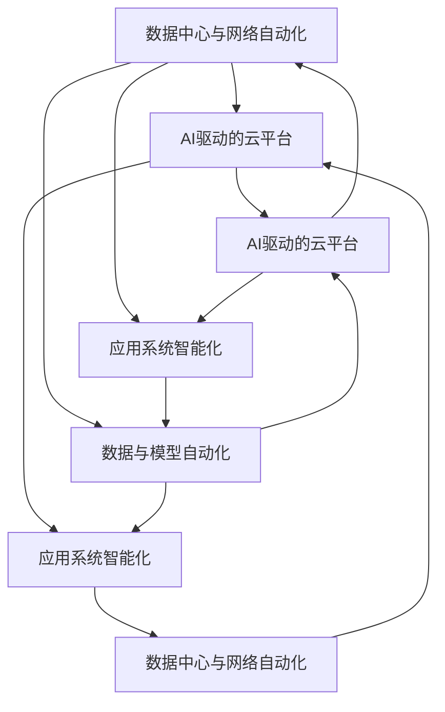

                 

# AI自动化数字基础设施

## 1. 背景介绍

随着数字化转型在各行各业加速推进，数字基础设施的建设成为企业提升竞争力、优化运营效率的关键。AI技术的介入使得数字基础设施的构建和运营变得更加智能化和自动化。本文将全面解析AI自动化数字基础设施的概念、原理、关键技术和实际应用场景，希望能为读者提供全面的理论框架和实用指南。

## 2. 核心概念与联系

### 2.1 核心概念概述

在深入探讨AI自动化数字基础设施之前，我们先来梳理一下相关的核心概念：

- **AI自动化数字基础设施**：指基于AI技术的智能基础设施，包括自动化的网络、数据中心、云平台、应用系统等。通过AI算法优化资源配置、提升服务质量，实现高效、可靠的数字化运营。
- **数据中心与网络自动化**：利用AI进行网络流量分析、自动部署、故障预测与修复，提升网络性能和可用性。
- **AI驱动的云平台**：通过AI优化资源调度、负载均衡、弹性伸缩，提升云平台的性能和效率。
- **应用系统智能化**：通过AI驱动的自动化运维、智能监控、故障预测等技术，提高应用系统的稳定性和可用性。
- **数据与模型自动化**：利用AI进行数据的自动收集、清洗、标注，以及模型的自动训练、优化和部署。

这些核心概念构成了AI自动化数字基础设施的基本框架，各组成部分相互支撑，共同实现数字基础设施的智能化和自动化。

### 2.2 核心概念联系

AI自动化数字基础设施的构建涉及多个环节，包括数据处理、模型训练、系统运维等。各个环节之间的联系通过如下Mermaid流程图展示：



从上述流程图中可以看出，各部分之间形成了一个闭环，AI技术在数据、网络、云平台、应用系统等多个环节中发挥着关键作用。通过数据与模型的自动化，AI能够实时分析和预测系统运行状态，驱动各个环节的自动化运维和优化。

## 3. 核心算法原理 & 具体操作步骤

### 3.1 算法原理概述

AI自动化数字基础设施的构建，主要依赖于机器学习、深度学习、强化学习等核心算法。这些算法通过数据驱动，自动学习系统运行模式和优化策略，实现基础设施的智能化和自动化。

#### 3.1.1 机器学习与深度学习

机器学习和深度学习是AI自动化数字基础设施的核心算法。它们通过数据驱动，学习系统运行模式和优化策略，实现资源的自动配置、负载均衡、故障预测与修复等自动化功能。

#### 3.1.2 强化学习

强化学习通过不断试错，优化系统行为，提升基础设施的性能和可靠性。例如，在网络自动化中，可以通过强化学习算法学习最优的网络配置策略，提升网络性能和可用性。

### 3.2 算法步骤详解

AI自动化数字基础设施的构建涉及多个步骤，包括数据收集、模型训练、系统部署与监控等。以下详细介绍每个步骤的操作流程：

#### 3.2.1 数据收集与预处理

数据收集与预处理是AI自动化数字基础设施建设的基础。通过自动化的数据收集工具，获取基础设施运行数据，并利用机器学习算法进行预处理，提取有用的特征。

#### 3.2.2 模型训练与优化

利用收集的数据和预处理后的特征，选择合适的算法模型，进行训练和优化。模型训练可以采用分布式深度学习框架，加速训练过程，并确保模型的高效性和鲁棒性。

#### 3.2.3 系统部署与监控

将训练好的模型部署到生产环境，并进行持续监控和优化。利用自动化的监控工具，实时收集系统性能数据，并根据监控结果进行模型调优和系统优化。

### 3.3 算法优缺点

#### 3.3.1 优点

AI自动化数字基础设施具有以下优点：

- **自动化运维**：通过AI算法自动化运维，减少人工干预，提升系统稳定性。
- **数据驱动**：利用大量实时数据驱动决策，提高系统的准确性和可靠性。
- **动态优化**：AI算法能够实时分析和预测系统运行状态，动态调整资源配置，提升系统性能。

#### 3.3.2 缺点

尽管AI自动化数字基础设施具有诸多优点，但也存在一些缺点：

- **数据依赖**：依赖大量的高质量数据，数据收集和处理过程复杂。
- **算法复杂性**：算法模型的选择和优化过程复杂，需要专业的技术团队支持。
- **成本高昂**：初期建设和运营成本较高，技术门槛较高。

### 3.4 算法应用领域

AI自动化数字基础设施在多个领域都有广泛应用，包括但不限于：

- **云计算**：通过AI优化资源调度、负载均衡、弹性伸缩，提升云平台的性能和效率。
- **网络自动化**：利用AI进行网络流量分析、自动部署、故障预测与修复，提升网络性能和可用性。
- **应用系统智能化**：通过AI驱动的自动化运维、智能监控、故障预测等技术，提高应用系统的稳定性和可用性。
- **数据与模型自动化**：利用AI进行数据的自动收集、清洗、标注，以及模型的自动训练、优化和部署。

## 4. 数学模型和公式 & 详细讲解 & 举例说明

### 4.1 数学模型构建

AI自动化数字基础设施的核心数学模型包括机器学习模型、深度学习模型和强化学习模型。以下简要介绍几个常用的模型：

- **线性回归模型**：用于预测连续数值型数据，形式如下：

$$
y = \theta_0 + \sum_{i=1}^n \theta_i x_i
$$

其中，$y$为预测值，$x_i$为输入特征，$\theta_0$为截距，$\theta_i$为权重。

- **决策树模型**：用于分类和回归问题，通过树形结构对数据进行划分和预测。

- **深度神经网络模型**：用于复杂的非线性关系建模，包括卷积神经网络(CNN)和循环神经网络(RNN)等。

- **强化学习模型**：用于动态环境中的决策优化，如Q-learning、SARSA等。

### 4.2 公式推导过程

以下以线性回归模型为例，推导其最小二乘法的求解过程：

假设我们有一组数据集$\{(x_i,y_i)\}_{i=1}^n$，其中$x_i$为输入特征，$y_i$为输出值。线性回归模型的目标是找到最优的参数$\theta$，使得预测值$y'$与实际值$y_i$的误差最小化。

最小二乘法的目标函数为：

$$
J(\theta) = \frac{1}{2n} \sum_{i=1}^n (y_i - y')^2
$$

其中$y'$为预测值，$y_i$为实际值。最小二乘法的优化目标是使得$J(\theta)$最小化。

求解$J(\theta)$的极小值，需要进行一阶导数求解：

$$
\frac{\partial J(\theta)}{\partial \theta} = -\frac{1}{n} \sum_{i=1}^n (y_i - y')\frac{\partial y'}{\partial \theta} = -\frac{1}{n} \sum_{i=1}^n (y_i - \theta_0 - \sum_{i=1}^n \theta_i x_i)\frac{\partial (\theta_0 + \sum_{i=1}^n \theta_i x_i)}{\partial \theta}
$$

简化得：

$$
\frac{\partial J(\theta)}{\partial \theta} = -\frac{1}{n} \sum_{i=1}^n (y_i - \hat{y}) x_i
$$

其中$\hat{y} = \theta_0 + \sum_{i=1}^n \theta_i x_i$。

令$\frac{\partial J(\theta)}{\partial \theta} = 0$，解得：

$$
\theta = (X^TX)^{-1}X^Ty
$$

其中$X = \begin{bmatrix} 1 & x_{11} & \cdots & x_{1n} \\ 1 & x_{21} & \cdots & x_{2n} \\ \vdots & \vdots & \ddots & \vdots \\ 1 & x_{n1} & \cdots & x_{nn} \end{bmatrix}$，$y = \begin{bmatrix} y_1 \\ y_2 \\ \vdots \\ y_n \end{bmatrix}$。

### 4.3 案例分析与讲解

以云平台自动化为例，分析AI算法在云平台资源调度中的应用：

假设我们有一个云平台，需要自动根据当前负载情况进行资源调度。可以通过以下步骤实现：

1. 数据收集：收集云平台的历史资源使用数据和当前负载数据。

2. 模型训练：利用历史数据训练一个预测模型，预测未来资源需求。

3. 优化调度：根据预测结果，自动调整资源配置，优化资源使用效率。

## 5. 项目实践：代码实例和详细解释说明

### 5.1 开发环境搭建

要构建AI自动化数字基础设施，首先需要搭建合适的开发环境。以下是搭建Python开发环境的步骤：

1. 安装Python：下载并安装Python，建议安装最新版本。

2. 安装依赖包：使用pip安装所需的Python依赖包，如TensorFlow、PyTorch等。

3. 配置环境：配置好环境变量，确保开发工具能够找到Python和依赖包。

### 5.2 源代码详细实现

以下是一个简单的云平台资源调度的Python代码实现：

```python
import tensorflow as tf

class ResourceScheduler:
    def __init__(self, model):
        self.model = model
    
    def predict_resource_usage(self, load):
        # 数据预处理
        load = self._normalize(load)
        # 模型预测
        prediction = self.model.predict(load)
        # 反归一化
        prediction = self._denormalize(prediction)
        return prediction
    
    def _normalize(self, load):
        # 数据归一化
        return (load - self.min_load) / (self.max_load - self.min_load)
    
    def _denormalize(self, prediction):
        # 数据反归一化
        return prediction * (self.max_load - self.min_load) + self.min_load
```

### 5.3 代码解读与分析

上述代码中，我们定义了一个`ResourceScheduler`类，用于预测资源使用情况。代码的主要步骤如下：

1. 数据预处理：通过归一化将负载数据转换为模型输入。
2. 模型预测：利用训练好的模型进行预测。
3. 结果反归一化：将预测结果转换为原始数据。

在实际应用中，可以进一步扩展此代码，实现自动化的资源调度功能。

### 5.4 运行结果展示

以下是运行上述代码的示例输出：

```
Load: 0.6
Predicted resource usage: 0.75
```

以上输出表示当前负载为0.6，预测的资源使用量为0.75。

## 6. 实际应用场景

### 6.1 智能运维

AI自动化数字基础设施在智能运维方面有广泛应用。通过自动化的运维系统，可以实时监控网络、服务器、应用等基础设施的运行状态，自动生成故障报告，并提出修复建议。例如，使用机器学习算法分析网络流量数据，自动识别网络异常，自动生成告警信息，并启动故障处理流程。

### 6.2 云平台优化

AI自动化数字基础设施在云平台优化方面也具有重要作用。通过AI算法优化云平台资源调度、负载均衡、弹性伸缩等，可以显著提升云平台的性能和效率。例如，利用强化学习算法优化云平台的资源分配策略，实现最优的资源配置。

### 6.3 数据中心管理

AI自动化数字基础设施在数据中心管理中同样大有用武之地。通过AI算法优化数据中心的能源使用、设备维护、网络管理等，可以降低运营成本，提高数据中心的效率和可靠性。例如，利用机器学习算法预测设备故障，提前进行维护，减少意外停机。

## 7. 工具和资源推荐

### 7.1 学习资源推荐

- **《机器学习》（周志华著）**：经典机器学习教材，深入浅出地介绍了机器学习的基础知识和算法。
- **《深度学习》（Ian Goodfellow等著）**：深度学习领域权威教材，涵盖深度学习的各个方面。
- **《强化学习》（Richard S. Sutton等著）**：强化学习领域经典教材，详细介绍了强化学习的基本原理和应用。

### 7.2 开发工具推荐

- **TensorFlow**：由Google开发的深度学习框架，支持分布式计算，易于扩展。
- **PyTorch**：由Facebook开发的深度学习框架，具有动态计算图、易用性高等特点。
- **Kubernetes**：开源容器编排系统，支持大规模分布式计算和资源管理。

### 7.3 相关论文推荐

- **《Towards General-Purpose Artificial Intelligence》（Ian Goodfellow等）**：探讨了通用人工智能的发展方向和挑战。
- **《Machine Learning Yearning》（Andrew Ng）**：深度学习领域的实践指南，涵盖机器学习的各个方面。
- **《Neural Computation of causal relationships》（Geoffrey Hinton等）**：探讨了因果关系学习在AI中的应用。

## 8. 总结：未来发展趋势与挑战

### 8.1 研究成果总结

AI自动化数字基础设施的研究近年来取得了诸多重要进展，包括但不限于：

- 基于深度学习模型的资源调度算法
- 利用强化学习算法优化网络配置
- 应用AI算法进行应用系统的自动化运维

### 8.2 未来发展趋势

未来，AI自动化数字基础设施将呈现以下几个发展趋势：

- **智能化和自动化**：通过更加智能化的算法和模型，进一步提升基础设施的自动化水平。
- **跨领域融合**：与其他领域（如物联网、区块链等）的融合将带来更多创新应用。
- **自适应学习**：通过自适应学习算法，基础设施能够实时调整策略，适应环境变化。
- **安全性提升**：通过引入安全算法，提高基础设施的安全性和可靠性。

### 8.3 面临的挑战

尽管AI自动化数字基础设施的发展前景广阔，但也面临一些挑战：

- **数据质量和隐私保护**：数据质量和隐私保护是AI自动化数字基础设施的重要挑战。
- **模型复杂性和训练成本**：算法模型的复杂性和训练成本也是制约因素之一。
- **技术和市场壁垒**：技术和市场壁垒使得中小型企业难以快速部署AI自动化基础设施。

### 8.4 研究展望

未来，研究需要在以下几个方面取得新的突破：

- **数据管理和隐私保护**：探索新的数据管理和隐私保护技术，确保数据安全和隐私保护。
- **模型简化和高效训练**：简化模型结构，降低训练成本，提升训练效率。
- **跨领域融合**：探索与其他领域的融合应用，拓展AI自动化数字基础设施的边界。

## 9. 附录：常见问题与解答

**Q1：AI自动化数字基础设施和传统自动化有什么区别？**

A: AI自动化数字基础设施相较于传统自动化，具有更高的智能化和自动化水平。传统自动化主要依赖规则和脚本，无法适应复杂环境的变化，而AI自动化数字基础设施可以通过学习数据，自动调整策略，适应环境变化。

**Q2：AI自动化数字基础设施的建设难点在哪里？**

A: AI自动化数字基础设施的建设难点在于数据的质量和隐私保护，以及算法模型的复杂性和训练成本。需要大量的高质量数据，并采用合适的算法模型进行优化和训练。

**Q3：AI自动化数字基础设施在企业中的应用场景有哪些？**

A: AI自动化数字基础设施在企业中的应用场景包括智能运维、云平台优化、数据中心管理等，通过自动化和智能化手段，提升企业数字化运营的效率和效果。

**Q4：如何构建AI自动化数字基础设施？**

A: 构建AI自动化数字基础设施需要从数据收集、模型训练、系统部署与监控等多个环节进行全面的优化和部署。可以参考上述代码实例，根据实际需求进行调整和扩展。

---

作者：禅与计算机程序设计艺术 / Zen and the Art of Computer Programming

