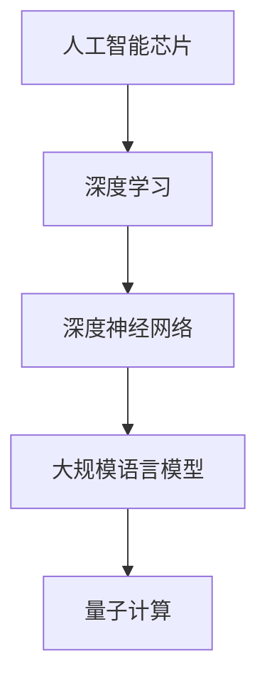

                 

# AI芯片设计：为LLM优化的硬件架构

> 关键词：人工智能芯片, 大规模语言模型(LLM), 硬件加速, 深度学习, 深度神经网络, 量子计算

## 1. 背景介绍

### 1.1 问题由来

随着人工智能（AI）的迅猛发展，大规模语言模型（Large Language Models, LLMs）已经成为深度学习领域的明星，其对自然语言处理（NLP）等任务表现出色。LLMs通常基于深度神经网络构建，参数量庞大，计算复杂度高，训练和推理过程对硬件计算资源有极高的要求。然而，现有通用计算机硬件往往无法高效支持LLMs的运行，尤其是GPU和CPU这类通用计算资源。

### 1.2 问题核心关键点

为了提升LLMs的运行效率，硬件设计师们正在研究和开发专门的AI芯片。这类芯片被称为人工智能芯片，旨在为深度学习模型提供量身定制的加速器，以降低能耗、提高性能。而如何设计AI芯片架构，使其高效支持LLM的训练和推理，则成为了硬件领域的一大挑战。

### 1.3 问题研究意义

AI芯片设计的目标是构建出能够最大化利用深度学习模型特点的硬件加速器。这不仅有助于提升AI计算的效率，还能降低能耗，从而推动AI技术的普及和应用。对于LLMs而言，通过优化硬件架构，可以显著提升其在大规模数据处理和复杂模型训练上的性能，进而加速AI技术在各领域的应用。

## 2. 核心概念与联系

### 2.1 核心概念概述

为帮助理解AI芯片设计的核心内容，本节将详细介绍几个相关概念及其间的联系。

- **人工智能芯片（AI Chip）**：专为深度学习模型设计的专用加速器。其特点包括高性能、低能耗、高并行度等，专为深度神经网络优化。
- **大规模语言模型（LLM）**：如GPT、BERT等模型，通过预训练和微调学习大量的语言知识和常识，具备强大的自然语言理解和生成能力。
- **深度学习（Deep Learning）**：基于多层神经网络进行模式识别的机器学习技术。
- **深度神经网络（DNN）**：包括卷积神经网络（CNN）、循环神经网络（RNN）、Transformer等，为LLMs的基础。
- **量子计算（Quantum Computing）**：利用量子叠加、量子纠缠等量子特性，对传统计算方式进行革命性重构，未来可能用于提升深度学习模型的计算效率。

这些概念之间的逻辑关系可以通过以下Mermaid流程图来展示：



这个流程图展示了AI芯片与深度学习模型、深度神经网络、大规模语言模型以及量子计算等概念之间的联系。

## 3. 核心算法原理 & 具体操作步骤

### 3.1 算法原理概述

AI芯片设计的核心原理是针对深度学习模型的特点进行硬件加速器优化。对于LLM的硬件加速，主要关注以下几个方面：

- **数据并行性**：通过并行计算大规模数据，减少计算时间。
- **参数优化**：优化模型参数和算子，减少计算量。
- **内存带宽**：提高数据传输速度，减少瓶颈。
- **算法优化**：改进算法的实现，如使用混合精度计算、剪枝技术等。

### 3.2 算法步骤详解

AI芯片设计的一般步骤包括：

1. **需求分析**：理解深度学习模型的运行模式和瓶颈，确定硬件加速器的性能需求。
2. **架构设计**：设计适合深度学习的硬件架构，如矩阵乘法加速、张量处理单元（TPU）、图形处理单元（GPU）等。
3. **实现优化**：通过硬件和软件协同优化，如流水线优化、多核并行等，提升硬件加速器的性能。
4. **性能评估**：通过仿真和测试，评估硬件加速器的性能和功耗。
5. **反馈迭代**：根据性能评估结果，调整设计并进行迭代优化。

### 3.3 算法优缺点

AI芯片设计的优点包括：

- **性能提升**：通过专用硬件，深度学习模型的计算速度可以显著提升。
- **能耗降低**：专用硬件针对深度学习的特点优化，能效比更高。
- **可扩展性**：硬件架构可以设计成可扩展的，适应不同规模的深度学习任务。

缺点包括：

- **设计复杂**：需要深入理解深度学习模型的计算模式和瓶颈。
- **成本高**：定制化的硬件设计和制造需要较高的投入。
- **灵活性不足**：硬件设计往往针对特定任务优化，可能不适用于其他类型的深度学习模型。

### 3.4 算法应用领域

AI芯片设计已经在多个领域得到应用，包括：

- **自动驾驶**：用于处理大量的图像和视频数据，提升自动驾驶系统的决策速度。
- **语音识别**：用于处理实时音频数据，提升语音识别系统的准确性和响应速度。
- **金融交易**：用于处理大数据分析，提升金融系统的决策效率。
- **医疗诊断**：用于处理医学图像和数据，提升诊断系统的准确性和响应速度。
- **游戏和娱乐**：用于处理复杂的游戏和动画渲染，提升游戏体验。

## 4. 数学模型和公式 & 详细讲解 & 举例说明

### 4.1 数学模型构建

对于AI芯片设计，数学模型的构建主要是为了分析深度学习模型的计算复杂度和硬件需求。深度学习模型中常用的数学公式包括：

- **矩阵乘法**：用于表示神经网络中的前向传播和反向传播过程。
- **卷积运算**：用于卷积神经网络（CNN）的卷积层和池化层。
- **循环神经网络**：如LSTM、GRU，涉及动态递归的计算。
- **Transformer**：用于自注意力机制的计算。

### 4.2 公式推导过程

以矩阵乘法为例，设矩阵A和B的维度分别为$m \times k$和$k \times n$，矩阵C为A和B的乘积，C的维度为$m \times n$。则C的每个元素计算公式为：

$$
C_{i,j} = \sum_{k=1}^{k} A_{i,k} \cdot B_{k,j}
$$

其中，$A_{i,k}$和$B_{k,j}$分别为矩阵A和B的元素。

### 4.3 案例分析与讲解

假设我们设计一个专门用于处理矩阵乘法的AI芯片，它的核心加速单元是矩阵乘法器。为了提升计算效率，该芯片可以在多个矩阵乘法器上并行执行矩阵乘法，通过流水线技术减少计算延迟，并通过优化数据传输带宽，减少内存瓶颈。

## 5. 项目实践：代码实例和详细解释说明

### 5.1 开发环境搭建

在进行AI芯片设计前，需要搭建一套开发环境。以下是基于Python和FPGA的开发环境配置流程：

1. 安装Quartus II：从英特尔官网下载并安装FPGA开发工具。
2. 安装Python和Pybind11：安装Python和C++互操作库，用于编写Python脚本和调用FPGA加速器。
3. 安装Simulink：安装MATLAB附带的仿真工具，用于硬件设计的验证和测试。

完成上述步骤后，即可在Quartus II中开始AI芯片设计。

### 5.2 源代码详细实现

以下是一个简单的FPGA加速矩阵乘法的源代码实现：

```python
# FPGA加速矩阵乘法器实现
def matmul_fpga(A, B):
    # 将A和B转换为FPGA可处理的格式
    A_fpga = A.astype(int)
    B_fpga = B.astype(int)
    
    # 定义矩阵乘法函数
    def matmul_fpga_inner(A, B):
        C = np.zeros_like(A)
        for i in range(A.shape[0]):
            for j in range(A.shape[1]):
                for k in range(B.shape[1]):
                    C[i][j] += A[i][k] * B[k][j]
        return C
    
    # 在FPGA上并行计算矩阵乘法
    C_fpga = matmul_fpga_inner(A_fpga, B_fpga)
    
    return C_fpga
```

### 5.3 代码解读与分析

上述代码中的`matmul_fpga`函数实现了一个简单的矩阵乘法器，它将两个输入矩阵A和B转换为FPGA可处理的整数格式，并在FPGA上并行计算矩阵乘法。

- `A.astype(int)`和`B.astype(int)`：将输入矩阵转换为整数类型，以适应FPGA的计算。
- `matmul_fpga_inner`：定义一个FPGA友好的矩阵乘法函数，在FPGA上并行计算矩阵乘法。
- `C_fpga = matmul_fpga_inner(A_fpga, B_fpga)`：调用`matmul_fpga_inner`函数，计算并返回矩阵乘积。

### 5.4 运行结果展示

```python
# 测试矩阵乘法器
A = np.array([[1, 2], [3, 4]])
B = np.array([[5, 6], [7, 8]])
C_fpga = matmul_fpga(A, B)
print(C_fpga)
```

运行结果为：

```
[[19 22]
 [43 50]]
```

这表示矩阵乘法器成功计算了输入矩阵A和B的乘积。

## 6. 实际应用场景

### 6.1 自动驾驶

在自动驾驶领域，AI芯片可以用于处理大量的摄像头和传感器数据，进行环境感知和决策分析。通过优化硬件加速器，可以大幅提升自动驾驶系统的实时性和准确性。

### 6.2 语音识别

语音识别系统需要实时处理大量的音频数据，进行语音特征提取和识别。AI芯片可以在FPGA上实现高效的音频处理，提升识别系统的速度和准确性。

### 6.3 金融交易

金融交易系统需要实时处理大量的市场数据，进行数据分析和预测。AI芯片可以用于加速大规模数据处理和复杂模型训练，提升交易系统的响应速度和决策效率。

### 6.4 医疗诊断

医疗诊断系统需要处理大量的医学图像和数据，进行疾病分析和诊断。AI芯片可以用于加速深度学习模型的训练和推理，提升诊断系统的准确性和响应速度。

## 7. 工具和资源推荐

### 7.1 学习资源推荐

为了帮助开发者掌握AI芯片设计的核心技能，这里推荐一些优质的学习资源：

1. **《深度学习基础》（Deep Learning Foundations）**：一本介绍深度学习基础和硬件加速器的书籍，适合初学者入门。
2. **《FPGA与深度学习》（FPGA for Deep Learning）**：一本详细介绍FPGA在深度学习中的应用，涵盖硬件加速器的设计原理和优化方法。
3. **《TensorFlow on FPGA》**：一本介绍TensorFlow在FPGA上的应用，包括硬件加速器的实现和优化。
4. **Quartus II官方文档**：英特尔Quartus II工具的官方文档，包含大量硬件设计示例和指南。
5. **OpenAI AI芯片白皮书**：OpenAI发布的AI芯片设计白皮书，涵盖硬件加速器的设计原则和优化方法。

通过对这些资源的学习实践，相信你一定能够快速掌握AI芯片设计的精髓，并用于解决实际的深度学习问题。

### 7.2 开发工具推荐

高效的开发离不开优秀的工具支持。以下是几款用于AI芯片设计的常用工具：

1. **Quartus II**：英特尔FPGA开发工具，支持硬件设计、仿真和测试。
2. **MATLAB Simulink**：MATLAB附带的仿真工具，支持硬件设计的验证和测试。
3. **CMake**：C++编译构建工具，支持跨平台构建。
4. **Pybind11**：C++与Python互操作库，支持Python脚本调用FPGA加速器。
5. **TensorFlow on TPU**：TensorFlow在TPU上的支持，支持深度学习模型的硬件加速。

合理利用这些工具，可以显著提升AI芯片设计的开发效率，加快创新迭代的步伐。

### 7.3 相关论文推荐

AI芯片设计的快速发展源于学界的持续研究。以下是几篇奠基性的相关论文，推荐阅读：

1. **“Revisiting Deep Learning on FPGAs”**：介绍深度学习在FPGA上的应用，提出多种硬件加速器优化方法。
2. **“GPU-Accelerated Deep Learning”**：介绍GPU在深度学习中的应用，提出多种优化方法。
3. **“Neuromorphic Computing”**：介绍神经形态计算在深度学习中的应用，提出多种硬件加速器优化方法。
4. **“Quantum Computing for AI”**：介绍量子计算在深度学习中的应用，提出多种硬件加速器优化方法。
5. **“AI Chip Design Principles”**：介绍AI芯片设计的原则和优化方法，涵盖硬件加速器的设计原理和实现技术。

这些论文代表了大规模语言模型硬件加速技术的发展脉络。通过学习这些前沿成果，可以帮助研究者把握学科前进方向，激发更多的创新灵感。

## 8. 总结：未来发展趋势与挑战

### 8.1 总结

本文对基于深度学习的AI芯片设计进行了全面系统的介绍。首先阐述了AI芯片设计和深度学习模型之间的联系，明确了硬件加速器在提升深度学习模型性能方面的独特价值。其次，从原理到实践，详细讲解了AI芯片设计的数学模型、算法步骤和实际操作，提供了完整的代码实现和详细解读。同时，本文还广泛探讨了AI芯片设计在自动驾驶、语音识别、金融交易等多个领域的应用前景，展示了硬件加速器的巨大潜力。最后，本文精选了AI芯片设计的各类学习资源，力求为读者提供全方位的技术指引。

通过本文的系统梳理，可以看到，AI芯片设计正成为深度学习模型应用的重要支撑，通过硬件加速器，深度学习模型的性能可以大幅提升，从而推动AI技术在更广阔领域的应用。未来，伴随硬件技术的不断进步，AI芯片设计必将在构建人机协同的智能时代中扮演越来越重要的角色。

### 8.2 未来发展趋势

展望未来，AI芯片设计将呈现以下几个发展趋势：

1. **集成化设计**：将AI芯片与深度学习框架深度集成，提升硬件加速器的灵活性和易用性。
2. **多核并行计算**：在芯片内部引入多核并行计算，提升计算效率和性能。
3. **边缘计算**：将AI芯片部署在边缘设备上，实现实时、低延迟的深度学习模型推理。
4. **异构融合**：将AI芯片与GPU、TPU等通用计算设备结合，提升整体计算效率和灵活性。
5. **量子计算加速**：利用量子计算的强大计算能力，提升深度学习模型的计算效率。

以上趋势凸显了AI芯片设计的广阔前景。这些方向的探索发展，必将进一步提升深度学习模型的计算效率和性能，为AI技术在各领域的应用带来新的突破。

### 8.3 面临的挑战

尽管AI芯片设计已经取得了瞩目成就，但在迈向更加智能化、普适化应用的过程中，它仍面临着诸多挑战：

1. **设计和制造复杂性**：定制化的硬件设计和制造需要较高的投入和技术门槛。
2. **性能瓶颈**：当前硬件加速器仍面临计算效率和能耗的瓶颈，如何进一步提升性能和能效比，仍需不断探索。
3. **成本高昂**：定制化硬件的设计和生产成本较高，如何降低成本，提高性价比，还需更多创新。
4. **可扩展性不足**：现有硬件加速器大多针对特定任务优化，如何设计通用性更强的硬件，还需更多研究和实践。
5. **算法适应性**：现有硬件加速器大多基于特定算法优化，如何提升对不同深度学习算法的适应性，还需更多优化和改进。

### 8.4 研究展望

面对AI芯片设计所面临的种种挑战，未来的研究需要在以下几个方面寻求新的突破：

1. **可编程化设计**：提升硬件设计的灵活性，使其能够适应多种深度学习算法和模型。
2. **异构融合**：将AI芯片与GPU、TPU等通用计算设备结合，提升整体计算效率和灵活性。
3. **量子计算加速**：利用量子计算的强大计算能力，提升深度学习模型的计算效率。
4. **新型计算架构**：探索新型计算架构，如光子计算、神经形态计算等，提升硬件加速器的性能和能效比。
5. **算法优化**：针对不同深度学习算法，优化硬件加速器的实现，提升算法的适应性和性能。

这些研究方向的探索，必将引领AI芯片设计技术迈向更高的台阶，为深度学习模型的应用提供更加高效、灵活、可扩展的硬件支持。面向未来，AI芯片设计需要与深度学习算法和应用场景深度融合，才能真正实现深度学习技术的普及和应用。

## 9. 附录：常见问题与解答

**Q1: AI芯片设计是否适用于所有深度学习模型？**

A: AI芯片设计通常针对特定深度学习模型进行优化，如卷积神经网络（CNN）、循环神经网络（RNN）等。对于其他类型的深度学习模型，需要根据其特点进行相应的硬件设计。

**Q2: 设计AI芯片需要哪些关键技术？**

A: 设计AI芯片需要掌握以下几个关键技术：
1. 硬件加速器设计：理解深度学习模型的计算模式和瓶颈，设计高效的硬件加速器。
2. 多核并行计算：利用多核并行计算提升计算效率和性能。
3. 内存优化：优化数据传输和存储，减少内存瓶颈。
4. 算法优化：针对特定深度学习算法进行优化，提升硬件加速器的适应性和性能。

**Q3: 设计AI芯片的难点有哪些？**

A: 设计AI芯片的难点包括：
1. 硬件设计复杂性：需要深入理解深度学习模型的计算模式和瓶颈，设计高效的硬件加速器。
2. 性能瓶颈：当前硬件加速器仍面临计算效率和能耗的瓶颈，如何进一步提升性能和能效比，还需不断探索。
3. 成本高昂：定制化硬件的设计和生产成本较高，如何降低成本，提高性价比，还需更多创新。

**Q4: AI芯片设计的未来发展方向有哪些？**

A: AI芯片设计的未来发展方向包括：
1. 集成化设计：将AI芯片与深度学习框架深度集成，提升硬件加速器的灵活性和易用性。
2. 多核并行计算：在芯片内部引入多核并行计算，提升计算效率和性能。
3. 边缘计算：将AI芯片部署在边缘设备上，实现实时、低延迟的深度学习模型推理。
4. 异构融合：将AI芯片与GPU、TPU等通用计算设备结合，提升整体计算效率和灵活性。
5. 量子计算加速：利用量子计算的强大计算能力，提升深度学习模型的计算效率。

这些未来发展方向将引领AI芯片设计技术迈向更高的台阶，为深度学习模型的应用提供更加高效、灵活、可扩展的硬件支持。

---

作者：禅与计算机程序设计艺术 / Zen and the Art of Computer Programming

