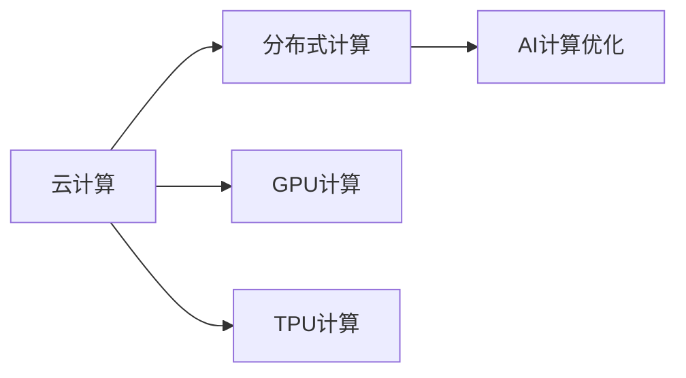

                 

# AI计算变化中的新机遇

## 1. 背景介绍

随着人工智能(AI)技术的迅猛发展，计算能力正成为制约AI应用的关键瓶颈。在早期，计算资源的短缺限制了AI技术的发展，甚至一度成为无法跨越的鸿沟。然而，随着时间的推移，AI计算资源的发展却迎来了一片光明的前景。本文将从多个角度探讨AI计算的最新变化及其带来的新机遇。

## 2. 核心概念与联系

### 2.1 核心概念概述

在深入讨论之前，我们需要了解一些核心概念，以便更好地理解AI计算的发展历程和未来方向：

- **AI计算：** 指在人工智能开发和应用过程中，所需计算资源的调配、管理和优化。包括硬件基础设施、软件工具、算法优化等多个方面。

- **云计算：** 通过网络将计算资源虚拟化，提供按需、弹性的计算服务。云计算的兴起极大地降低了AI应用的计算门槛。

- **分布式计算：** 通过多台计算设备协同工作，提高计算速度和处理能力。分布式计算是大规模AI训练和推理任务的基础。

- **GPU计算：** 利用图形处理器(GPU)进行高性能计算。GPU计算能力使得AI训练速度大大提升。

- **TPU计算：** 由Google开发的特制AI加速器，专门用于深度学习计算。TPU计算提供了极致的计算性能，特别适合大规模模型训练。

这些概念之间相互关联，共同构成了AI计算的基础架构。云计算提供了弹性的计算资源，分布式计算和GPU/TPU计算提升了计算性能，而AI计算优化则进一步提高了资源的利用效率。

### 2.2 核心概念原理和架构的 Mermaid 流程图



## 3. 核心算法原理 & 具体操作步骤

### 3.1 算法原理概述

AI计算的核心在于高效利用各种计算资源，最大化地提升模型的训练和推理性能。这不仅涉及到硬件设备的选择和配置，还涉及到算法层面的优化和调整。在AI计算的框架下，算法和计算资源的协同优化成为提升模型性能的关键。

### 3.2 算法步骤详解

AI计算的优化步骤主要包括以下几个方面：

1. **选择合适的硬件平台：** 根据任务特点，选择适合的计算资源，如GPU、TPU等。
2. **设计高效的计算图：** 通过优化计算图结构，减少冗余计算，提高计算效率。
3. **选择合适的算法和模型：** 选择能够高效利用计算资源的算法和模型，如卷积神经网络(CNN)、递归神经网络(RNN)、Transformer等。
4. **利用自动微分技术：** 自动化地计算梯度，提高模型训练效率。
5. **应用分布式计算：** 将大规模模型分布在多台设备上并行计算，加速模型训练。
6. **进行超参数调优：** 通过网格搜索、贝叶斯优化等方法，寻找最优的超参数组合。

### 3.3 算法优缺点

AI计算的优势主要体现在以下几个方面：

- **高性能：** 通过分布式计算和高效的计算图设计，大幅提升模型训练和推理速度。
- **弹性：** 云计算提供了按需、弹性的计算资源，可以根据任务需求动态调整计算资源。
- **可扩展性：** 分布式计算和GPU/TPU计算支持大规模模型的训练和推理，具有很好的可扩展性。

然而，AI计算也存在一些不足之处：

- **成本高：** 特别是GPU和TPU计算，所需的硬件设备成本较高。
- **复杂度高：** 分布式计算和硬件优化需要深入的计算机知识和经验。
- **数据迁移：** 大规模模型训练需要大量数据，数据迁移和存储成本较高。

### 3.4 算法应用领域

AI计算的应用领域非常广泛，涵盖了AI开发和应用的各个方面，主要包括：

- **图像识别：** 如物体检测、人脸识别、图像分割等。
- **自然语言处理：** 如机器翻译、文本分类、语音识别等。
- **推荐系统：** 如电商推荐、视频推荐、广告推荐等。
- **自动驾驶：** 如环境感知、路径规划、行为预测等。
- **医疗健康：** 如影像分析、疾病预测、个性化治疗等。
- **金融风控：** 如信用评估、风险控制、欺诈检测等。
- **智慧城市：** 如智能交通、环境监测、公共安全等。

这些领域对计算资源的需求不同，但AI计算都能为其提供高效、可靠的支持。

## 4. 数学模型和公式 & 详细讲解 & 举例说明

### 4.1 数学模型构建

在AI计算中，数学模型扮演着重要的角色。模型的好坏直接决定了AI应用的性能。以下是一些常见的数学模型及其构建方式：

- **线性回归模型：** 用于预测连续型变量，模型公式为：$$y = \beta_0 + \beta_1x_1 + \beta_2x_2 + \cdots + \beta_nx_n$$。
- **逻辑回归模型：** 用于分类问题，模型公式为：$$P(y=1|x) = \sigma(\beta_0 + \beta_1x_1 + \beta_2x_2 + \cdots + \beta_nx_n)$$。
- **卷积神经网络(CNN)：** 用于图像识别，模型包含卷积层、池化层和全连接层，结构复杂但效果显著。
- **递归神经网络(RNN)：** 用于序列数据处理，模型通过时间序列数据进行训练，能够捕捉数据的动态特征。
- **Transformer模型：** 用于自然语言处理，模型通过自注意力机制进行编码和解码，效果优越。

### 4.2 公式推导过程

以逻辑回归模型为例，其推导过程如下：

假设我们有一个线性回归模型：$$y = \beta_0 + \beta_1x_1 + \beta_2x_2 + \cdots + \beta_nx_n$$，其中 $y$ 是输出变量，$x_i$ 是输入变量，$\beta_i$ 是权重。

为了使模型最小化预测误差，我们引入损失函数 $J(\beta)$：

$$J(\beta) = \frac{1}{2m}\sum_{i=1}^m(y_i - \hat{y_i})^2$$

其中 $m$ 是样本数量，$\hat{y_i}$ 是模型的预测值。

对 $J(\beta)$ 求导，得到：

$$\frac{\partial J(\beta)}{\partial \beta_j} = -\frac{1}{m}\sum_{i=1}^m(y_i - \hat{y_i})x_{ij}$$

通过反向传播算法，更新模型参数 $\beta_j$，即可实现模型的训练。

### 4.3 案例分析与讲解

以卷积神经网络(CNN)为例，其核心在于通过卷积操作提取图像特征。以LeNet模型为例，其结构如下：

```python
import torch.nn as nn
import torch.nn.functional as F

class LeNet(nn.Module):
    def __init__(self):
        super(LeNet, self).__init__()
        self.conv1 = nn.Conv2d(1, 6, 5)
        self.pool = nn.MaxPool2d(2, 2)
        self.conv2 = nn.Conv2d(6, 16, 5)
        self.fc1 = nn.Linear(16 * 5 * 5, 120)
        self.fc2 = nn.Linear(120, 84)
        self.fc3 = nn.Linear(84, 10)

    def forward(self, x):
        x = F.relu(self.conv1(x))
        x = self.pool(x)
        x = F.relu(self.conv2(x))
        x = self.pool(x)
        x = x.view(-1, 16 * 5 * 5)
        x = F.relu(self.fc1(x))
        x = F.relu(self.fc2(x))
        x = self.fc3(x)
        return F.log_softmax(x, dim=1)

model = LeNet()
```

在训练过程中，我们采用随机梯度下降(SGD)优化算法，代码如下：

```python
import torch.optim as optim

criterion = nn.CrossEntropyLoss()
optimizer = optim.SGD(model.parameters(), lr=0.001, momentum=0.9)
```

通过以上模型和优化器的设计，我们可以对图像进行高效处理和分类。

## 5. 项目实践：代码实例和详细解释说明

### 5.1 开发环境搭建

为了进行AI计算的实践，我们需要搭建一个开发环境。以下是搭建环境的步骤：

1. 安装Python：从官网下载最新版本的Python，并确保环境变量配置正确。
2. 安装TensorFlow：通过pip安装TensorFlow，代码如下：

```bash
pip install tensorflow
```

3. 安装PyTorch：通过pip安装PyTorch，代码如下：

```bash
pip install torch torchvision torchaudio
```

4. 安装Keras：通过pip安装Keras，代码如下：

```bash
pip install keras
```

完成以上步骤后，即可在Python中使用TensorFlow、PyTorch和Keras进行AI计算的实践。

### 5.2 源代码详细实现

以下是使用PyTorch实现图像分类任务的代码示例：

```python
import torch
import torch.nn as nn
import torch.optim as optim
from torchvision import datasets, transforms

# 定义模型
class Net(nn.Module):
    def __init__(self):
        super(Net, self).__init__()
        self.conv1 = nn.Conv2d(1, 10, kernel_size=5)
        self.conv2 = nn.Conv2d(10, 20, kernel_size=5)
        self.conv2_drop = nn.Dropout2d()
        self.fc1 = nn.Linear(320, 50)
        self.fc2 = nn.Linear(50, 10)
        self.softmax = nn.Softmax(dim=1)

    def forward(self, x):
        x = F.relu(F.max_pool2d(self.conv1(x), 2))
        x = F.relu(F.max_pool2d(self.conv2_drop(self.conv2(x)), 2))
        x = x.view(-1, 320)
        x = F.relu(self.fc1(x))
        x = F.dropout(x, training=self.training)
        x = self.fc2(x)
        x = self.softmax(x)
        return x

# 定义数据集
train_loader = torch.utils.data.DataLoader(
    datasets.MNIST('data/', train=True, download=True, transform=transforms.ToTensor()),
    batch_size=64, shuffle=True)

test_loader = torch.utils.data.DataLoader(
    datasets.MNIST('data/', train=False, transform=transforms.ToTensor()),
    batch_size=64, shuffle=True)

# 定义优化器
optimizer = optim.SGD(model.parameters(), lr=0.01)

# 定义损失函数
criterion = nn.CrossEntropyLoss()

# 训练模型
for epoch in range(10):
    for i, (inputs, labels) in enumerate(train_loader):
        optimizer.zero_grad()
        outputs = model(inputs)
        loss = criterion(outputs, labels)
        loss.backward()
        optimizer.step()
```

### 5.3 代码解读与分析

在以上代码中，我们定义了一个简单的卷积神经网络模型，用于图像分类任务。

**Net类**：
- `__init__`方法：初始化模型的各个层。
- `forward`方法：定义前向传播过程。

**数据集**：
- 使用PyTorch内置的MNIST数据集。
- 通过`ToTensor`函数将图像转换为张量格式，方便模型处理。

**优化器**：
- 使用随机梯度下降(SGD)优化器。

**损失函数**：
- 使用交叉熵损失函数。

**训练过程**：
- 在每个epoch内，对训练集进行迭代训练。
- 通过前向传播计算损失函数，反向传播更新模型参数。
- 使用优化器更新模型权重。

### 5.4 运行结果展示

在训练完成后，我们可以对测试集进行评估，计算模型的准确率：

```python
correct = 0
total = 0
with torch.no_grad():
    for inputs, labels in test_loader:
        outputs = model(inputs)
        _, predicted = torch.max(outputs.data, 1)
        total += labels.size(0)
        correct += (predicted == labels).sum().item()

print('Accuracy of the network on the 10000 test images: %d %%' % (
    100 * correct / total))
```

通过以上步骤，我们可以使用PyTorch搭建并训练一个简单的图像分类模型，展示了AI计算的实际应用。

## 6. 实际应用场景

### 6.1 智能推荐系统

智能推荐系统是AI计算的重要应用场景之一。通过分析用户的历史行为数据，推荐系统可以预测用户的兴趣，从而提供个性化的产品推荐。

在实践中，推荐系统通常采用深度学习模型进行训练。以协同过滤模型为例，其基本思想是通过分析用户和物品的相似度，进行推荐。以下是使用TensorFlow实现协同过滤模型的代码示例：

```python
import tensorflow as tf
from tensorflow.keras.layers import Input, Embedding, Dot, Dense

# 定义输入层
user_input = Input(shape=(1,))
item_input = Input(shape=(1,))

# 定义嵌入层
user_embedding = Embedding(input_dim=1000, output_dim=16)(user_input)
item_embedding = Embedding(input_dim=1000, output_dim=16)(item_input)

# 定义点积层
dot_product = Dot(axes=1)([user_embedding, item_embedding])

# 定义输出层
output = Dense(1, activation='sigmoid')(dot_product)

# 定义模型
model = tf.keras.Model(inputs=[user_input, item_input], outputs=output)

# 编译模型
model.compile(optimizer='adam', loss='binary_crossentropy', metrics=['accuracy'])

# 训练模型
model.fit(x=[user_input_train, item_input_train], y=user_labels_train, epochs=10, batch_size=32)
```

在以上代码中，我们定义了输入层、嵌入层、点积层和输出层，使用Adam优化器进行训练，并计算模型的准确率。

### 6.2 智能交通系统

智能交通系统通过实时分析交通数据，优化交通流量，提升道路通行效率。AI计算在智能交通系统中扮演着重要角色，主要用于交通预测、路径规划、交通监控等任务。

以交通预测为例，我们可以使用RNN模型进行预测。以下是使用TensorFlow实现交通预测的代码示例：

```python
import tensorflow as tf
from tensorflow.keras.layers import LSTM, Dense

# 定义模型
model = tf.keras.Sequential([
    LSTM(128, input_shape=(sequence_length, 1)),
    Dense(1)
])

# 编译模型
model.compile(optimizer='adam', loss='mse')

# 训练模型
model.fit(x=traffic_data_train, y=traffic_data_train_labels, epochs=10, batch_size=32)
```

在以上代码中，我们定义了一个LSTM模型，用于交通流量预测。通过实时采集交通数据，训练模型进行预测，可以显著提升交通系统的智能化水平。

### 6.3 医疗影像诊断

医疗影像诊断是AI计算的另一个重要应用场景。通过分析医疗影像数据，AI系统可以辅助医生进行疾病诊断，提高诊断准确率。

以X光影像诊断为例，我们可以使用卷积神经网络(CNN)进行训练。以下是使用TensorFlow实现X光影像诊断的代码示例：

```python
import tensorflow as tf
from tensorflow.keras.layers import Conv2D, MaxPooling2D, Flatten, Dense

# 定义模型
model = tf.keras.Sequential([
    Conv2D(32, (3, 3), activation='relu', input_shape=(image_height, image_width, 3)),
    MaxPooling2D((2, 2)),
    Conv2D(64, (3, 3), activation='relu'),
    MaxPooling2D((2, 2)),
    Conv2D(128, (3, 3), activation='relu'),
    MaxPooling2D((2, 2)),
    Flatten(),
    Dense(128, activation='relu'),
    Dense(1, activation='sigmoid')
])

# 编译模型
model.compile(optimizer='adam', loss='binary_crossentropy', metrics=['accuracy'])

# 训练模型
model.fit(x=xray_data_train, y=xray_labels_train, epochs=10, batch_size=32)
```

在以上代码中，我们定义了一个包含卷积层、池化层和全连接层的CNN模型，用于X光影像诊断。通过训练模型，可以显著提升影像诊断的准确率，辅助医生进行疾病诊断。

### 6.4 未来应用展望

随着AI计算的不断发展，未来AI计算将带来更多新的应用场景，包括但不限于以下几个方面：

- **自动驾驶：** AI计算在自动驾驶领域的应用将更加广泛，通过实时分析环境数据，智能决策，提升驾驶安全性和舒适性。
- **智慧城市：** AI计算将广泛应用于智慧城市的各个领域，如智能交通、环境监测、公共安全等，提升城市的智能化水平。
- **金融风控：** AI计算在金融风控中的应用将更加深入，通过分析交易数据，预测风险，提高金融系统的稳定性。
- **智慧医疗：** AI计算在智慧医疗中的应用将更加普及，通过分析医疗影像、电子病历等数据，辅助医生进行疾病诊断和个性化治疗。
- **工业制造：** AI计算在工业制造中的应用将更加广泛，通过分析生产数据，优化生产流程，提升生产效率和质量。

未来，AI计算将成为推动各行各业智能化转型的重要力量，带来更多新的机遇和挑战。

## 7. 工具和资源推荐

### 7.1 学习资源推荐

为了帮助开发者系统掌握AI计算的理论基础和实践技巧，以下是一些优质的学习资源：

- **《深度学习》课程：** 斯坦福大学的深度学习课程，涵盖了深度学习的基础理论、算法和实践，是AI计算学习的经典教材。
- **《TensorFlow官方文档》：** TensorFlow的官方文档，提供了丰富的API和示例代码，适合深入学习和实践。
- **《PyTorch官方文档》：** PyTorch的官方文档，提供了丰富的API和示例代码，适合深入学习和实践。
- **Kaggle平台：** Kaggle是全球最大的数据科学竞赛平台，提供了大量的数据集和竞赛，适合实践和提升。

通过以上资源的学习实践，相信你一定能够快速掌握AI计算的精髓，并用于解决实际的AI问题。

### 7.2 开发工具推荐

以下是几款常用的AI计算开发工具：

- **TensorFlow：** 由Google开发的深度学习框架，提供丰富的API和工具，支持分布式计算和GPU加速。
- **PyTorch：** Facebook开发的深度学习框架，提供动态计算图和灵活的API，适合研究和实践。
- **Keras：** 基于TensorFlow和Theano的高级API，提供简单易用的API接口，适合快速开发和实验。
- **MXNet：** 由Apache开发的深度学习框架，支持多种语言和平台，适合分布式计算和资源优化。
- **TensorBoard：** TensorFlow配套的可视化工具，可以实时监测模型训练状态，提供丰富的图表展示。
- **Weights & Biases：** 用于模型训练和实验跟踪的工具，可以记录和可视化模型训练过程中的各项指标，适合调优和迭代。

合理利用这些工具，可以显著提升AI计算的开发效率，加快创新迭代的步伐。

### 7.3 相关论文推荐

以下是一些经典的AI计算论文，推荐阅读：

- **《ImageNet Classification with Deep Convolutional Neural Networks》：** AlexNet论文，提出了卷积神经网络(CNN)，并取得了显著的分类效果。
- **《Deep Residual Learning for Image Recognition》：** ResNet论文，提出了残差网络，解决了深度神经网络的退化问题。
- **《Attention is All You Need》：** Transformer论文，提出了Transformer模型，提升了自然语言处理的效果。
- **《Learning Deep Architectures for AI》：** Hinton的深度学习综述，介绍了深度学习的理论和应用。
- **《Deep Learning with PyTorch》：** 由Deep Learning Specialization提供的PyTorch教程，系统介绍了PyTorch的使用方法和实践技巧。

这些论文代表了大数据、分布式计算、深度学习等技术的发展脉络，值得深入学习。

## 8. 总结：未来发展趋势与挑战

### 8.1 研究成果总结

AI计算的发展离不开学界的不断探索和实践。以下是一些重要的研究成果：

- **分布式计算：** 通过多台计算设备协同工作，提高了计算效率，支持大规模模型的训练和推理。
- **GPU/TPU计算：** 利用图形处理器(GPU)和专门用于深度学习的加速器(TPU)，大幅提升了计算速度。
- **自动微分技术：** 通过自动微分技术，实现了深度学习模型的高效计算。
- **超参数调优：** 通过网格搜索、贝叶斯优化等方法，找到了最优的超参数组合，提高了模型性能。
- **知识图谱：** 通过知识图谱的引入，增强了AI计算的知识整合能力。

这些成果为AI计算的发展奠定了坚实的基础，推动了AI技术在各个领域的应用。

### 8.2 未来发展趋势

AI计算的未来发展趋势主要包括以下几个方面：

- **模型越来越大：** 未来的大模型将拥有更高的计算能力和更丰富的知识表示，提升模型的泛化性能。
- **计算资源越来越廉价：** 随着硬件技术的进步和云计算的普及，计算资源将越来越便宜，降低了AI应用的门槛。
- **算法越来越高效：** 未来将涌现更多高效的算法和模型，提升AI计算的效率和效果。
- **数据越来越丰富：** 数据驱动是AI计算的核心，未来将有更多高质量的数据供模型训练，提升模型的性能。
- **应用越来越广泛：** AI计算的应用领域将不断扩展，带来更多新的机会和挑战。

这些趋势将推动AI计算技术的不断发展，为AI技术的应用带来更多新的可能。

### 8.3 面临的挑战

尽管AI计算已经取得了显著的进展，但在迈向智能化应用的过程中，仍面临诸多挑战：

- **计算资源成本高：** 尤其是GPU和TPU计算，所需的硬件设备成本较高，限制了AI计算的普及。
- **算法复杂度高：** 分布式计算和硬件优化需要深入的计算机知识和经验，增加了开发的难度。
- **数据隐私和安全：** AI计算依赖大量的数据，数据隐私和安全问题不容忽视。
- **模型可解释性：** 许多AI模型是"黑盒"系统，难以解释其内部工作机制和决策逻辑，影响模型的应用和推广。
- **计算资源瓶颈：** 大规模模型训练需要大量计算资源，资源瓶颈限制了模型的规模和复杂度。

这些挑战需要学界和产业界共同努力，寻求解决方案，才能推动AI计算技术的健康发展。

### 8.4 研究展望

未来AI计算的研究方向包括：

- **分布式计算的优化：** 研究更高效的分布式计算框架，提升计算效率和资源利用率。
- **硬件加速器的优化：** 开发更高效、更通用的硬件加速器，支持更广泛的AI应用。
- **模型压缩和量化：** 研究模型压缩和量化技术，减少模型规模，提高计算效率。
- **知识图谱与AI的结合：** 探索知识图谱与AI计算的融合，增强模型的知识整合能力。
- **可解释AI技术：** 研究可解释AI技术，增强模型的可解释性和可信度。
- **联邦学习：** 研究联邦学习技术，保护数据隐私，同时提升模型的性能。

这些研究方向将推动AI计算技术的不断进步，为AI技术的普及和应用提供坚实的技术基础。

## 9. 附录：常见问题与解答

**Q1：AI计算对硬件设备的要求是什么？**

A: AI计算对硬件设备的要求较高，特别是GPU和TPU计算。CPU的计算能力有限，无法满足大规模深度学习模型的需求。GPU和TPU加速器提供极高的计算性能，适合大规模模型的训练和推理。

**Q2：AI计算的优势和劣势是什么？**

A: AI计算的优势在于高性能、弹性、可扩展性，适用于大规模模型的训练和推理。但劣势在于成本高、算法复杂、数据隐私和安全问题。

**Q3：AI计算的应用场景有哪些？**

A: AI计算的应用场景非常广泛，包括智能推荐、智能交通、医疗影像诊断、自动驾驶、智慧城市等。

**Q4：如何进行AI计算的优化？**

A: AI计算的优化主要涉及硬件选择、模型设计、算法优化和数据处理等多个方面。选择合适的硬件设备，设计高效的计算图，优化算法和模型，进行数据增强等，都是优化AI计算的关键步骤。

**Q5：AI计算的未来发展方向是什么？**

A: AI计算的未来发展方向包括模型规模增大、计算资源廉价、算法高效、数据丰富、应用广泛等。同时，研究分布式计算的优化、硬件加速器的优化、模型压缩和量化、知识图谱与AI的结合、可解释AI技术、联邦学习等，将进一步推动AI计算技术的发展。

通过以上系统的梳理，我们全面了解了AI计算的最新变化及其带来的新机遇。AI计算技术的不断进步，将为AI技术在各行各业的应用带来更多新的可能，推动人类社会的智能化转型。

---

作者：禅与计算机程序设计艺术 / Zen and the Art of Computer Programming

