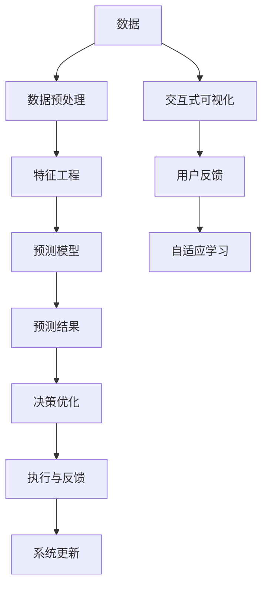

                 

# AI辅助决策系统:提高决策质量与速度

> 关键词：AI辅助决策, 决策支持系统, 预测模型, 数据分析, 自动化决策, 预测分析

## 1. 背景介绍

### 1.1 问题由来

在当前这个信息爆炸的时代，企业决策者面临的决策环境越来越复杂，需要处理的变量成千上万，其中一些变量可能只在事后才显现其重要性。传统上，决策者依靠自身的经验和直觉来做出决策，但这些决策过程往往主观性强、成本高、易受外界因素干扰。为了克服这些挑战，越来越多的企业开始引入人工智能技术，特别是AI辅助决策系统，以提高决策质量与速度。

### 1.2 问题核心关键点

AI辅助决策系统的核心关键点包括：

- **数据驱动决策**：利用AI技术从大量数据中提取有价值的信息，帮助决策者理解和预测未来的发展趋势。
- **预测模型**：基于历史数据和机器学习算法，构建预测模型来预测未来事件。
- **自动化决策**：通过AI自动化决策流程，快速生成多种决策方案，供决策者选择。
- **交互式决策支持**：与决策者进行交互，根据决策者的偏好和反馈调整预测结果和建议。
- **实时更新**：随着环境的变化，实时更新模型和数据，确保决策建议的及时性。

## 2. 核心概念与联系

### 2.1 核心概念概述

为了更好地理解AI辅助决策系统的原理和架构，本节将介绍几个密切相关的核心概念：

- **决策支持系统（Decision Support System, DSS）**：一种辅助决策者进行决策的工具，通过计算机化的技术帮助决策者处理复杂的问题。
- **预测模型**：利用机器学习、深度学习等技术，基于历史数据和特征构建的预测模型，用于预测未来的趋势或事件。
- **数据挖掘**：从大量数据中发现隐藏的模式、关系和知识的过程。
- **自动化决策**：通过AI自动化的决策过程，减少人工干预，提高决策效率。
- **交互式可视化**：将决策数据和预测结果以图表、仪表盘等形式呈现，供决策者直观理解。
- **自适应学习**：AI系统通过反馈和调整不断学习和优化，适应环境变化。

这些核心概念之间的逻辑关系可以通过以下Mermaid流程图来展示：



这个流程图展示了数据到决策的整个流程：

1. 原始数据通过数据预处理和特征工程转换为机器可用的格式。
2. 利用这些特征构建预测模型，进行预测。
3. 将预测结果反馈给决策者，优化决策方案。
4. 将优化后的决策执行到实际应用中，并收集反馈数据进行系统更新。
5. 同时，交互式可视化和用户反馈也会实时影响预测模型的调整。

## 3. 核心算法原理 & 具体操作步骤

### 3.1 算法原理概述

AI辅助决策系统的核心算法原理基于统计学、机器学习、深度学习等方法，结合业务知识构建预测模型。以下是一个简化的工作流程：

1. **数据收集**：收集与决策相关的历史数据和实时数据。
2. **数据清洗**：清洗和处理数据，去除噪声和异常值，确保数据质量。
3. **特征工程**：提取和构建特征，包括数值特征、文本特征等，用于模型训练。
4. **模型训练**：利用机器学习算法，如线性回归、决策树、随机森林、神经网络等，训练预测模型。
5. **预测评估**：评估模型的预测效果，确保其准确性和可靠性。
6. **决策优化**：基于预测结果，生成多种决策方案，供决策者选择。
7. **模型更新**：根据最新的数据和反馈，实时更新预测模型，保持其有效性。

### 3.2 算法步骤详解

下面将详细介绍AI辅助决策系统的工作流程：

**Step 1: 数据收集与预处理**

1. **数据来源**：决策所需数据可能来自内部系统、外部API、社交媒体等，需确保数据来源可靠、数据格式一致。
2. **数据清洗**：清洗数据以去除噪声和异常值，包括缺失值处理、重复值去除等。
3. **数据整合**：将不同来源的数据整合到一个统一的数据库中。
4. **数据标注**：对部分数据进行标注，用于监督学习模型的训练。

**Step 2: 特征工程**

1. **特征提取**：从原始数据中提取有意义的特征，包括数值特征、文本特征等。
2. **特征选择**：选择对预测结果有较大影响的特征，去除冗余特征。
3. **特征编码**：将特征转换为机器学习算法可用的格式，如独热编码、标准缩放等。

**Step 3: 模型训练与评估**

1. **模型选择**：选择合适的预测模型，如线性回归、决策树、随机森林、深度学习等。
2. **模型训练**：利用历史数据和特征训练模型，生成预测模型。
3. **模型评估**：通过交叉验证、混淆矩阵、AUC等指标评估模型预测效果。
4. **模型调优**：根据评估结果，调整模型参数，提高预测准确性。

**Step 4: 决策生成与优化**

1. **决策方案生成**：根据预测结果，生成多种决策方案。
2. **方案评估**：评估各方案的优劣，包括经济效益、风险等。
3. **方案选择**：根据决策者的偏好和反馈，选择最佳方案。
4. **方案执行**：将最佳方案执行到实际业务中，并监控执行效果。

**Step 5: 模型更新与优化**

1. **数据更新**：定期更新历史数据和实时数据。
2. **模型更新**：根据最新的数据和反馈，实时更新预测模型，保持其有效性。
3. **模型监控**：监控模型的性能，确保其稳定性。

### 3.3 算法优缺点

AI辅助决策系统的优点包括：

1. **提升决策效率**：利用AI自动化决策流程，快速生成多种决策方案。
2. **降低决策成本**：减少人工干预，降低决策成本。
3. **提高决策质量**：基于大量数据和预测模型，提高决策的科学性和准确性。
4. **实时更新**：通过实时数据和反馈，及时调整预测模型。
5. **自适应学习**：根据环境变化，自动调整预测模型，提高适应性。

缺点包括：

1. **数据质量要求高**：需要高质量、完整、可靠的数据，才能保证预测模型的准确性。
2. **模型复杂度高**：预测模型的构建和训练过程复杂，需要较高的技术门槛。
3. **解释性不足**：部分预测模型如深度学习模型，其决策过程难以解释。
4. **依赖技术**：依赖先进的技术工具和算法，技术门槛较高。
5. **初期投入大**：开发和部署AI辅助决策系统需要较高的初期投入。

### 3.4 算法应用领域

AI辅助决策系统在多个领域都有广泛应用，例如：

- **金融投资**：利用历史数据和市场预测模型，辅助决策者进行投资组合优化、风险管理等。
- **企业战略**：通过数据分析和预测，帮助企业制定战略规划、市场拓展等。
- **医疗健康**：利用患者历史数据和预测模型，辅助医生进行诊断和治疗方案选择。
- **供应链管理**：通过数据分析和预测，优化库存管理、需求预测等。
- **零售电商**：利用客户历史行为数据和预测模型，进行个性化推荐、库存管理等。
- **政府决策**：通过数据分析和预测，辅助政府制定政策、优化资源配置等。

## 4. 数学模型和公式 & 详细讲解 & 举例说明

### 4.1 数学模型构建

假设决策任务为预测某产品的未来销售量，数学模型可以表示为：

$$
Y = f(X)
$$

其中 $Y$ 表示销售量，$X$ 表示影响销售量的各种特征。我们可以构建一个多元线性回归模型来预测未来销售量：

$$
Y = \beta_0 + \beta_1X_1 + \beta_2X_2 + \cdots + \beta_nX_n
$$

### 4.2 公式推导过程

设 $D = \{(X_i, Y_i)\}_{i=1}^n$ 为训练集，其中 $X_i = (X_{i1}, X_{i2}, \cdots, X_{in})$，$Y_i$ 为实际销售量。

1. **模型参数估计**：利用最小二乘法估计模型参数 $\beta_0, \beta_1, \cdots, \beta_n$。

   $$
   \hat{\beta} = \arg\min_{\beta} \sum_{i=1}^n (Y_i - f(X_i))^2
   $$

2. **模型预测**：根据估计的参数，预测未来销售量。

   $$
   \hat{Y} = f(X) = \hat{\beta}_0 + \hat{\beta}_1X_1 + \hat{\beta}_2X_2 + \cdots + \hat{\beta}_nX_n
   $$

### 4.3 案例分析与讲解

以某电商平台的销售额预测为例：

1. **数据收集**：收集电商平台的用户历史购买数据，包括用户ID、商品ID、购买金额、购买时间等。
2. **数据预处理**：清洗数据，去除缺失值和异常值，并进行特征工程，提取用户特征、商品特征等。
3. **模型训练**：利用线性回归模型训练预测模型，预测未来销售额。
4. **模型评估**：通过R²、MAE等指标评估模型预测效果。
5. **决策优化**：根据模型预测结果，生成不同的营销策略方案，评估各方案的优劣，选择最佳方案。
6. **模型更新**：定期更新历史数据和实时数据，重新训练模型，保持其有效性。

## 5. 项目实践：代码实例和详细解释说明

### 5.1 开发环境搭建

在项目实践之前，我们需要准备好开发环境。以下是使用Python进行机器学习开发的环境配置流程：

1. **安装Anaconda**：从官网下载并安装Anaconda，用于创建独立的Python环境。
   ```bash
   conda create -n my_env python=3.7
   conda activate my_env
   ```

2. **安装相关库**：安装Python的科学计算库，如NumPy、Pandas、Scikit-learn、Matplotlib等。
   ```bash
   conda install numpy pandas scikit-learn matplotlib jupyter notebook
   ```

3. **安装TensorFlow和Keras**：安装深度学习框架和高级API。
   ```bash
   pip install tensorflow keras
   ```

### 5.2 源代码详细实现

下面以线性回归模型为例，给出使用Python和TensorFlow进行销售额预测的代码实现。

```python
import tensorflow as tf
import numpy as np
import pandas as pd

# 加载数据
data = pd.read_csv('sales_data.csv')

# 数据预处理
X = data[['user_id', 'item_id', 'price', 'time_of_day']]
Y = data['sales_volume']

# 特征标准化
X_scaled = (X - X.mean()) / X.std()

# 构建模型
model = tf.keras.Sequential([
    tf.keras.layers.Dense(64, activation='relu', input_shape=(X_scaled.shape[1],)),
    tf.keras.layers.Dense(64, activation='relu'),
    tf.keras.layers.Dense(1)
])

# 编译模型
model.compile(optimizer=tf.keras.optimizers.Adam(learning_rate=0.001),
              loss='mse',
              metrics=['mae'])

# 训练模型
model.fit(X_scaled, Y, epochs=100, batch_size=32)

# 评估模型
test_X = pd.read_csv('test_data.csv')[['user_id', 'item_id', 'price', 'time_of_day']]
test_X_scaled = (test_X - X.mean()) / X.std()
Y_pred = model.predict(test_X_scaled)
```

### 5.3 代码解读与分析

在上述代码中，我们首先加载了电商平台的销售数据，并进行了数据预处理，包括特征标准化。然后构建了一个简单的神经网络模型，用于预测未来的销售量。模型包含两个隐藏层和一个输出层，使用了ReLU激活函数。

在模型编译时，我们使用了Adam优化器和均方误差损失函数。在训练模型时，我们使用了100个epoch，批次大小为32。在评估模型时，我们使用了测试集数据，并计算了预测值和真实值之间的MAE指标。

## 6. 实际应用场景

### 6.1 金融投资

在金融投资领域，AI辅助决策系统可以应用于投资组合优化、市场预测、风险管理等方面。通过分析历史交易数据和市场数据，构建预测模型，辅助决策者制定投资策略，优化投资组合，降低风险。

### 6.2 企业战略

在企业战略制定中，AI辅助决策系统可以用于市场分析、竞争对手分析、客户行为分析等，帮助企业制定有效的战略规划和市场拓展方案。

### 6.3 医疗健康

在医疗健康领域，AI辅助决策系统可以应用于疾病预测、治疗方案选择、患者管理等方面。通过分析患者历史数据和实时数据，构建预测模型，辅助医生进行诊断和治疗方案选择。

### 6.4 供应链管理

在供应链管理中，AI辅助决策系统可以用于库存管理、需求预测、物流优化等方面。通过分析历史订单数据和市场数据，构建预测模型，优化库存管理，提高供应链效率。

### 6.5 零售电商

在零售电商领域，AI辅助决策系统可以用于个性化推荐、库存管理、营销策略优化等方面。通过分析用户历史行为数据和实时数据，构建预测模型，提供个性化的推荐和营销策略。

### 6.6 政府决策

在政府决策中，AI辅助决策系统可以用于政策制定、资源配置、公共安全等方面。通过分析历史数据和实时数据，构建预测模型，辅助政府制定政策，优化资源配置。

## 7. 工具和资源推荐

### 7.1 学习资源推荐

为了帮助开发者系统掌握AI辅助决策系统的理论基础和实践技巧，这里推荐一些优质的学习资源：

1. **《机器学习》（周志华）**：全面介绍机器学习的基本概念、算法和应用。
2. **《深度学习》（Ian Goodfellow）**：详细讲解深度学习的基本原理和实践应用。
3. **《Python机器学习》（Sebastian Raschka）**：介绍Python在机器学习中的应用，包括数据处理、模型训练等。
4. **Kaggle**：数据科学和机器学习竞赛平台，提供丰富的数据集和开源项目，供开发者学习和实践。
5. **Coursera**：提供各种机器学习和AI课程，涵盖入门到高级内容。

通过对这些资源的学习实践，相信你一定能够快速掌握AI辅助决策系统的精髓，并用于解决实际的业务问题。

### 7.2 开发工具推荐

高效的开发离不开优秀的工具支持。以下是几款用于AI辅助决策系统开发的常用工具：

1. **Jupyter Notebook**：交互式编程环境，支持Python、R等多种语言，适合数据科学和机器学习项目。
2. **TensorFlow**：谷歌主导的深度学习框架，支持多种硬件加速，适合大规模模型训练和推理。
3. **Keras**：高级API，简化深度学习模型的构建和训练。
4. **Scikit-learn**：Python科学计算库，提供各种机器学习算法和工具。
5. **Pandas**：数据处理和分析库，支持多种数据格式和操作。
6. **PyTorch**：Facebook主导的深度学习框架，支持动态计算图和GPU加速。

合理利用这些工具，可以显著提升AI辅助决策系统的开发效率，加快创新迭代的步伐。

### 7.3 相关论文推荐

AI辅助决策系统的研究源于学界的持续研究。以下是几篇奠基性的相关论文，推荐阅读：

1. **《支持向量机》（Cortes and Vapnik）**：介绍了支持向量机算法，用于分类和回归问题。
2. **《随机森林》（Breiman）**：介绍了随机森林算法，用于处理高维数据和复杂特征。
3. **《深度学习》（Hinton et al.）**：介绍了深度神经网络算法，用于大规模数据处理和复杂特征学习。
4. **《集成学习》（Dietterich）**：介绍了集成学习方法，用于提高模型泛化能力和鲁棒性。
5. **《神经网络与深度学习》（Goodfellow et al.）**：全面讲解神经网络和深度学习的原理和应用。

这些论文代表了大数据和AI辅助决策技术的发展脉络。通过学习这些前沿成果，可以帮助研究者把握学科前进方向，激发更多的创新灵感。

## 8. 总结：未来发展趋势与挑战

### 8.1 总结

本文对AI辅助决策系统的原理和实现进行了全面系统的介绍。首先阐述了AI辅助决策系统的背景和核心概念，明确了其在提高决策质量和速度方面的独特价值。其次，从原理到实践，详细讲解了AI辅助决策系统的数学模型和具体步骤，给出了系统开发的完整代码实现。同时，本文还广泛探讨了AI辅助决策系统在多个领域的应用前景，展示了其在现实世界中的巨大潜力。

### 8.2 未来发展趋势

展望未来，AI辅助决策系统将呈现以下几个发展趋势：

1. **数据驱动决策**：利用AI技术从大量数据中提取有价值的信息，提高决策的科学性和准确性。
2. **自动化决策**：通过AI自动化决策流程，减少人工干预，提高决策效率。
3. **实时更新**：随着环境的变化，实时更新预测模型，保持其有效性。
4. **自适应学习**：根据环境变化，自动调整预测模型，提高适应性。
5. **多模态数据融合**：结合视觉、语音、文本等多种数据，提高预测模型的准确性。
6. **解释性增强**：开发可解释性强的模型，提供决策过程的透明度和可解释性。

这些趋势将进一步提升AI辅助决策系统的性能和应用范围，为决策者提供更高效、更可靠的决策支持。

### 8.3 面临的挑战

尽管AI辅助决策系统已经取得了显著成果，但在实际应用中仍面临诸多挑战：

1. **数据质量问题**：需要高质量、完整、可靠的数据，才能保证预测模型的准确性。
2. **模型复杂度高**：构建和训练预测模型需要较高的技术门槛。
3. **解释性不足**：部分预测模型如深度学习模型，其决策过程难以解释。
4. **技术门槛高**：需要具备较高的技术水平和专业知识。
5. **初期投入大**：开发和部署AI辅助决策系统需要较高的初期投入。
6. **隐私和安全**：需要保护用户隐私，确保数据安全和模型透明。

### 8.4 研究展望

面对AI辅助决策系统面临的挑战，未来的研究需要在以下几个方面寻求新的突破：

1. **数据治理**：建立数据质量保证机制，提高数据质量和可靠性。
2. **模型解释性**：开发可解释性强的模型，提供决策过程的透明度和可解释性。
3. **技术简化**：简化模型构建和训练流程，降低技术门槛。
4. **自动化优化**：开发自动化优化工具，提高模型构建和训练效率。
5. **多模态融合**：结合视觉、语音、文本等多种数据，提高预测模型的准确性。
6. **隐私保护**：保护用户隐私，确保数据安全和模型透明。

这些研究方向的探索，将引领AI辅助决策系统迈向更高的台阶，为决策者提供更高效、更可靠的决策支持。

## 9. 附录：常见问题与解答

**Q1：如何选择合适的机器学习算法？**

A: 选择合适的机器学习算法需要考虑以下几个方面：
1. **数据类型**：根据数据类型（数值型、分类型、文本型等）选择适合的算法。
2. **问题类型**：根据问题类型（回归、分类、聚类等）选择适合的算法。
3. **数据规模**：对于大规模数据，选择可以处理高维数据和并行计算的算法。
4. **模型复杂度**：对于复杂模型，选择具有较高泛化能力和鲁棒性的算法。
5. **可解释性**：对于需要解释的模型，选择可解释性强的算法。

**Q2：模型训练过程中如何设置超参数？**

A: 模型训练过程中，超参数的设置通常采用网格搜索或随机搜索的方式。通过在一定范围内设置多个超参数组合，进行交叉验证，选择最优的超参数组合。常用的超参数包括学习率、批次大小、迭代次数、正则化系数等。

**Q3：模型部署过程中需要注意哪些问题？**

A: 模型部署过程中需要注意以下几个问题：
1. **模型优化**：在部署之前，需要对模型进行优化，如模型裁剪、量化等，以提高模型效率。
2. **模型版本管理**：对模型进行版本管理，确保不同版本的模型可以被正确部署和使用。
3. **环境配置**：在部署环境中，需要配置好硬件和软件环境，确保模型能够正常运行。
4. **监控告警**：实时监控模型的性能，设置异常告警阈值，确保系统稳定运行。

**Q4：如何保证模型的稳定性和鲁棒性？**

A: 保证模型的稳定性和鲁棒性需要注意以下几个方面：
1. **数据治理**：建立数据质量保证机制，提高数据质量和可靠性。
2. **模型解释性**：开发可解释性强的模型，提供决策过程的透明度和可解释性。
3. **模型集成**：集成多个模型，提高模型的泛化能力和鲁棒性。
4. **模型监控**：实时监控模型的性能，及时发现和解决模型问题。
5. **模型更新**：定期更新模型，适应环境变化。

**Q5：如何提高模型的可解释性？**

A: 提高模型的可解释性可以从以下几个方面入手：
1. **特征工程**：通过特征工程，选择对模型预测有较大影响的特征。
2. **模型解释工具**：使用模型解释工具，如SHAP、LIME等，提供模型决策的解释。
3. **可视化技术**：使用可视化技术，如热力图、决策树等，展示模型的决策过程。
4. **业务知识**：结合业务知识，解释模型的预测结果。

这些研究方向的探索，将引领AI辅助决策系统迈向更高的台阶，为决策者提供更高效、更可靠的决策支持。

---

作者：禅与计算机程序设计艺术 / Zen and the Art of Computer Programming

