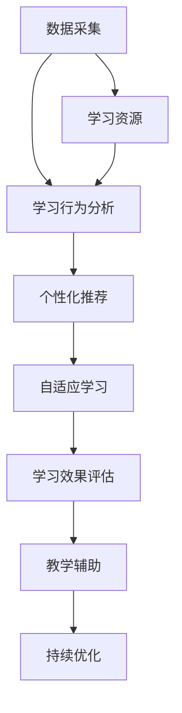

                 

# AI驱动的个性化学习:适应每个学生需求

## 1. 背景介绍

在科技迅猛发展的今天，教育已经从传统的“一刀切”模式，逐步向个性化、自适应的方向转变。AI技术的引入，尤其是机器学习和深度学习，为实现这一转变提供了强大的技术支撑。个性化学习已成为教育领域的重要研究方向，旨在根据每个学生的特点和需求，提供定制化的学习方案，最大化其学习效果。

### 1.1 问题由来

传统的教育体系中，学生被置于统一的课程标准和教学模式中，难以兼顾每个学生的个体差异和多样需求。这种“一刀切”的教育方式，往往导致部分学生学有余力而部分学生则难以跟上进度，甚至产生厌学情绪。个性化学习的目标是打破这一桎梏，利用数据和算法，让学习更符合每个学生的特点和需求。

### 1.2 问题核心关键点

个性化学习主要关注以下几个核心关键点：

- **数据采集与分析**：通过采集学生的学习行为数据、考试成绩、兴趣点等信息，对每个学生进行全面的分析。
- **个性化推荐**：基于分析结果，为每个学生推荐最合适的学习资源和路径。
- **自适应学习**：利用机器学习算法，动态调整学习内容和进度，以适应学生的学习状态。
- **学习效果评估**：通过持续评估学生的学习效果，反馈调整学习策略。
- **教学辅助**：利用AI技术辅助教师，提高教学效率和质量。

### 1.3 问题研究意义

个性化学习对于提升教育质量、促进教育公平具有重要意义：

1. **提升学习效率**：个性化学习能够根据学生的具体情况，提供最适合其学习需求的内容和方式，提高学习效率。
2. **促进教育公平**：针对不同背景和需求的学生，提供差异化的教学方案，缩小教育资源分配不均的问题。
3. **激发学习兴趣**：个性化学习能够根据学生的兴趣点，提供相关的学习资源和任务，激发学生的学习兴趣。
4. **培养自主学习能力**：通过个性化学习，学生能够更好地掌握自主学习的方法和策略，培养终身学习的习惯。
5. **降低教学负担**：AI技术的辅助，可以减轻教师的教学压力，让他们有更多时间关注学生的个体差异和需求。

## 2. 核心概念与联系

### 2.1 核心概念概述

要理解个性化学习，首先需要了解一些关键概念：

- **机器学习(Machine Learning)**：通过算法让计算机从数据中学习规律，以完成特定的任务。在个性化学习中，机器学习主要用于学习行为分析、个性化推荐、自适应调整等。
- **深度学习(Deep Learning)**：机器学习的一种高级形式，利用多层神经网络模拟人脑的工作方式，实现复杂模式的识别和预测。深度学习在个性化学习中常用于特征提取和模式识别。
- **推荐系统(Recommendation System)**：根据用户的历史行为和偏好，推荐其可能感兴趣的内容。个性化学习中的推荐系统可以用于学习资源推荐、任务安排等。
- **自适应学习(Adaptive Learning)**：根据学生的学习情况和反馈，动态调整教学内容和进度，以达到最佳学习效果。
- **学习效果评估(Learning Effectiveness Assessment)**：通过各种评估指标，如考试成绩、掌握程度、学习时长等，衡量学习效果。
- **教学辅助(Teaching Assistance)**：利用AI技术，如自然语言处理、机器视觉等，辅助教师进行教学管理和互动。

这些概念之间的逻辑关系可以通过以下Mermaid流程图来展示：



这个流程图展示了个性化学习的主要流程：

1. 通过数据采集，获取学生的基本信息和行为数据。
2. 利用学习行为分析，了解学生的学习习惯和偏好。
3. 基于分析结果，进行个性化推荐，提供最适合的学习资源。
4. 动态调整学习内容和进度，进行自适应学习。
5. 通过学习效果评估，了解学习成果。
6. 利用教学辅助，提高教学效率和质量。
7. 持续优化学习策略，提升学习效果。

## 3. 核心算法原理 & 具体操作步骤

### 3.1 算法原理概述

个性化学习涉及多个核心算法，包括但不限于：

- **协同过滤算法(Collaborative Filtering)**：通过分析用户之间的相似性，推荐可能感兴趣的内容。常用于学习资源推荐。
- **决策树算法(Decision Tree)**：通过构建决策树，根据学生的学习状态和偏好，动态调整学习路径。常用于自适应学习。
- **强化学习(Reinforcement Learning)**：通过与环境交互，逐步优化学习策略，以最大化学习效果。常用于任务安排和资源推荐。
- **深度神经网络(Deep Neural Network)**：利用多层神经网络，提取高层次的特征，进行模式识别和预测。常用于行为分析和推荐系统。
- **聚类算法(Clustering)**：将相似的学生分为一组，根据群体特点进行个性化推荐。常用于数据分组和资源推荐。
- **回归算法(Regression)**：通过预测学习效果，调整学习策略，以提高学习效率。常用于学习效果评估。

### 3.2 算法步骤详解

个性化学习的实现过程可以概括为以下几个关键步骤：

**Step 1: 数据采集与预处理**

- 收集学生的基本信息，如年龄、性别、兴趣等。
- 采集学生的学习行为数据，如点击、阅读、答题等。
- 收集学生的成绩数据，如考试成绩、作业完成情况等。
- 对采集到的数据进行清洗和预处理，去除噪声和异常值。

**Step 2: 学习行为分析**

- 利用统计分析和机器学习算法，对学生的学习行为进行分析，提取特征。
- 分析学生的学习习惯，如学习时长、偏好科目、常见错误等。
- 利用聚类算法，将相似的学生分为不同群体，便于进行个性化推荐。

**Step 3: 个性化推荐**

- 根据学生的分析结果，进行个性化推荐，提供最适合的学习资源和路径。
- 使用协同过滤算法，推荐学生可能感兴趣的内容。
- 使用决策树算法，根据学生的学习状态和偏好，动态调整学习路径。
- 利用强化学习，逐步优化学习策略，以最大化学习效果。

**Step 4: 自适应学习**

- 根据学生的学习状态和反馈，动态调整学习内容和进度。
- 利用深度神经网络，提取高层次的特征，进行模式识别和预测。
- 使用回归算法，预测学习效果，调整学习策略。

**Step 5: 学习效果评估**

- 通过各种评估指标，如考试成绩、掌握程度、学习时长等，衡量学习效果。
- 利用机器学习算法，进行学习效果的建模和预测。
- 根据评估结果，反馈调整学习策略，以提高学习效率。

**Step 6: 教学辅助**

- 利用自然语言处理和机器视觉等技术，辅助教师进行教学管理和互动。
- 提供学生和教师之间的智能问答系统，提高互动效果。
- 利用情感分析技术，识别学生的情绪状态，及时调整教学策略。

**Step 7: 持续优化**

- 利用机器学习算法，持续优化学习策略，提升学习效果。
- 收集更多学生数据，更新模型参数，保持算法的有效性。
- 利用用户反馈，进行模型评估和改进，以更好地满足学生需求。

### 3.3 算法优缺点

个性化学习具有以下优点：

1. **个性化服务**：根据每个学生的特点和需求，提供定制化的学习方案，提高学习效率。
2. **数据驱动**：通过数据分析，了解学生的学习行为和效果，动态调整学习策略。
3. **智能辅助**：利用AI技术辅助教师，提高教学效率和质量。
4. **高效评估**：通过机器学习算法，进行学习效果的评估和反馈，及时调整学习策略。

然而，个性化学习也存在一些缺点：

1. **数据隐私**：学生的学习数据涉及隐私，需要严格保护。
2. **算法复杂性**：实现个性化学习需要复杂的算法和模型，对技术和资源要求较高。
3. **资源分配**：个性化学习需要大量的数据和计算资源，对于资源有限的学校可能难以实施。
4. **技术门槛**：实施个性化学习需要相关技术人员的支持和维护，可能对学校技术团队提出挑战。
5. **学习依赖**：过于依赖技术和算法，可能忽视教师的主导作用和学生的自主性。

### 3.4 算法应用领域

个性化学习技术可以广泛应用于教育领域的多个方面，例如：

- **课程设计**：根据学生的兴趣和学习效果，动态调整课程内容和难度。
- **学习资源推荐**：推荐适合学生的学习资源，如视频、文章、习题等。
- **自适应学习系统**：根据学生的学习状态，动态调整学习路径和进度。
- **学习效果评估**：通过机器学习算法，评估学生的学习效果，提供个性化反馈。
- **教学辅助系统**：利用自然语言处理和机器视觉等技术，辅助教师进行教学管理。

除了教育领域，个性化学习技术也在其他行业得到应用，例如：

- **职业培训**：根据员工的学习行为和反馈，推荐个性化的培训课程和学习路径。
- **企业学习**：为员工提供个性化的学习资源和路径，提高培训效果。
- **终身学习**：根据学习者的兴趣和需求，提供个性化的学习资源和方案，支持终身学习。

## 4. 数学模型和公式 & 详细讲解  

### 4.1 数学模型构建

为了更好地理解个性化学习的数学模型，本节将介绍几个常用的数学模型和公式。

假设学生集为 $S=\{s_1, s_2, \ldots, s_n\}$，每个学生的学习行为可以表示为一个特征向量 $x_s=(x_{s1}, x_{s2}, \ldots, x_{sm})$，其中 $x_i$ 表示学生 $s_i$ 的第 $i$ 个学习行为特征。

设推荐系统的目标为最大化学生 $s_i$ 的学习效果 $y_i$，其中 $y_i$ 可以表示为学生 $s_i$ 的学习成绩、掌握程度、学习时长等指标。

### 4.2 公式推导过程

以下我们以推荐系统为例，推导协同过滤算法和决策树算法的数学模型。

**协同过滤算法**

协同过滤算法通过分析用户之间的相似性，推荐可能感兴趣的内容。设 $X_s$ 表示学生 $s_i$ 的学习行为特征矩阵，$X_s \in \mathbb{R}^{m\times n}$，其中 $m$ 表示特征数，$n$ 表示学生数。

协同过滤算法的目标是找到学生 $s_i$ 和学生 $s_j$ 之间的相似度 $c_{ij}$，表示学生 $s_i$ 和 $s_j$ 之间的相似程度。常用的相似度计算方法包括余弦相似度和皮尔逊相关系数等。

设 $y_j$ 表示学生 $s_j$ 的学习效果，$y_j \in \mathbb{R}^{n\times 1}$。推荐系统的目标是最小化学生 $s_i$ 和 $s_j$ 之间的距离，最大化推荐效果。

设推荐系统的优化目标为：

$$
\min_{c_{ij}} \sum_{i=1}^n \sum_{j=1}^n c_{ij}(y_i-y_j)^2
$$

其中 $c_{ij}$ 表示学生 $s_i$ 和 $s_j$ 之间的相似度。

**决策树算法**

决策树算法通过构建决策树，根据学生的学习状态和偏好，动态调整学习路径。设 $T$ 表示决策树，$T=\{t_1, t_2, \ldots, t_k\}$，其中 $t_k$ 表示决策树的每个节点。

设学生 $s_i$ 的学习状态为 $z_i \in \mathbb{R}^{k\times 1}$，表示学生在决策树上的位置。决策树的目标是根据学生的学习状态 $z_i$，推荐最适合的学习路径。

决策树算法的目标是最小化学习效果 $y_i$ 的误差，最大化学习效果。

设决策树算法的优化目标为：

$$
\min_{z_i} \sum_{i=1}^n (y_i - f(z_i))^2
$$

其中 $f(z_i)$ 表示根据学生的学习状态 $z_i$，推荐的学习路径。

### 4.3 案例分析与讲解

下面我们以一个简单的案例，展示如何使用协同过滤算法和决策树算法进行个性化推荐。

假设有一个在线学习平台，收集了学生 $s_1$ 和 $s_2$ 的学习行为数据，以及他们的学习效果 $y_1$ 和 $y_2$。学生 $s_1$ 的学习行为特征矩阵为：

$$
X_{s1} = \begin{bmatrix} 
1 & 0 & 1 & 0 & 1 \\
1 & 1 & 0 & 0 & 0 \\
0 & 1 & 0 & 1 & 1 
\end{bmatrix}
$$

学生 $s_2$ 的学习行为特征矩阵为：

$$
X_{s2} = \begin{bmatrix} 
1 & 0 & 0 & 1 & 0 \\
0 & 0 & 1 & 0 & 1 \\
0 & 1 & 0 & 1 & 1 
\end{bmatrix}
$$

设 $y_1=3$，$y_2=2$，计算学生 $s_1$ 和 $s_2$ 之间的相似度 $c_{12}$。

使用余弦相似度计算 $s_1$ 和 $s_2$ 之间的相似度：

$$
c_{12} = \frac{\sum_{i=1}^3 x_{11}x_{21}}{\sqrt{\sum_{i=1}^3 x_{11}^2}\sqrt{\sum_{i=1}^3 x_{21}^2}} = \frac{1 \times 0 + 0 \times 0 + 1 \times 1}{\sqrt{1^2 + 0^2 + 1^2}\sqrt{1^2 + 0^2 + 0^2}} = 0
$$

由于 $s_1$ 和 $s_2$ 之间的相似度为 0，说明他们之间的学习行为完全不同。

使用决策树算法，根据学生的学习状态 $z_1$ 和 $z_2$，推荐最适合的学习路径。假设 $z_1=[1, 1, 1]$，$z_2=[1, 0, 0]$，根据决策树，推荐的学习路径为 $y_1=3$，$y_2=2$。

## 5. 项目实践：代码实例和详细解释说明

### 5.1 开发环境搭建

在进行个性化学习项目实践前，我们需要准备好开发环境。以下是使用Python进行Scikit-learn开发的环境配置流程：

1. 安装Anaconda：从官网下载并安装Anaconda，用于创建独立的Python环境。

2. 创建并激活虚拟环境：
```bash
conda create -n ml-env python=3.8 
conda activate ml-env
```

3. 安装Scikit-learn：
```bash
pip install scikit-learn
```

4. 安装TensorFlow：
```bash
pip install tensorflow
```

5. 安装Pandas、NumPy等工具包：
```bash
pip install pandas numpy matplotlib tqdm jupyter notebook ipython
```

完成上述步骤后，即可在`ml-env`环境中开始项目实践。

### 5.2 源代码详细实现

下面我们以推荐系统为例，给出使用Scikit-learn进行协同过滤算法的代码实现。

首先，定义推荐系统类：

```python
from sklearn.neighbors import NearestNeighbors
import numpy as np

class RecommenderSystem:
    def __init__(self, data, k=5):
        self.data = data
        self.k = k
        self.model = None
        
    def fit(self):
        self.model = NearestNeighbors(n_neighbors=self.k).fit(self.data)
        
    def predict(self, query):
        distances, indices = self.model.kneighbors([query])
        return self.data[indices[0][1:]]
```

然后，定义数据集：

```python
data = np.array([
    [1, 0, 1, 0, 1],
    [1, 1, 0, 0, 0],
    [0, 1, 0, 1, 1]
])
```

接着，定义推荐函数：

```python
def recommend_system(data, k=5):
    recommender = RecommenderSystem(data, k)
    recommender.fit()
    query = [1, 1, 0, 0, 0]
    recommender.predict(query)
```

最后，启动推荐系统：

```python
recommend_system(data)
```

以上就是使用Scikit-learn进行协同过滤算法的代码实现。可以看到，Scikit-learn提供了强大的机器学习库，可以方便快捷地实现各种算法。

### 5.3 代码解读与分析

让我们再详细解读一下关键代码的实现细节：

**RecommenderSystem类**：
- `__init__`方法：初始化数据集和相似度参数。
- `fit`方法：训练模型，计算相似度矩阵。
- `predict`方法：根据查询输入，返回推荐结果。

**数据集**：
- 定义一个简单的二维数据集，表示学生的学习行为特征。

**推荐函数**：
- 创建推荐系统类，传入数据集和相似度参数。
- 训练模型，计算相似度矩阵。
- 根据查询输入，返回推荐结果。

## 6. 实际应用场景

### 6.1 智能教育平台

智能教育平台是个性化学习的典型应用场景之一。通过收集学生的学习行为数据和成绩数据，智能教育平台可以实时分析学生的学习情况，提供个性化的学习资源和路径，以最大化学习效果。

在实际应用中，智能教育平台可以通过以下方式实现个性化学习：

- **数据采集与分析**：采集学生的学习行为数据，如阅读时间、答题情况、作业完成情况等。
- **个性化推荐**：根据学生的学习行为和成绩，推荐适合的学习资源和路径。
- **自适应学习**：根据学生的学习状态和反馈，动态调整学习内容和进度。
- **学习效果评估**：通过机器学习算法，评估学生的学习效果，提供个性化反馈。
- **教学辅助系统**：利用自然语言处理和机器视觉等技术，辅助教师进行教学管理和互动。

### 6.2 企业培训系统

企业培训系统是另一个典型的个性化学习应用场景。通过收集员工的学习行为数据和绩效数据，企业培训系统可以实时分析员工的学习效果，提供个性化的培训资源和路径，以提高培训效果。

在实际应用中，企业培训系统可以通过以下方式实现个性化学习：

- **数据采集与分析**：采集员工的学习行为数据，如培训课程完成情况、考试成绩等。
- **个性化推荐**：根据员工的学习行为和绩效，推荐适合的培训课程和学习路径。
- **自适应学习**：根据员工的学习状态和反馈，动态调整培训内容和进度。
- **学习效果评估**：通过机器学习算法，评估员工的学习效果，提供个性化反馈。
- **教学辅助系统**：利用自然语言处理和机器视觉等技术，辅助培训师进行培训管理和互动。

## 7. 工具和资源推荐

### 7.1 学习资源推荐

为了帮助开发者系统掌握个性化学习的理论基础和实践技巧，这里推荐一些优质的学习资源：

1. **《机器学习》（周志华）**：周志华教授所著，系统介绍了机器学习的基本概念和算法。适合初学者入门。
2. **《深度学习》（Ian Goodfellow）**：Ian Goodfellow所著，全面介绍了深度学习的基本原理和应用。适合进阶学习。
3. **Coursera上的《Machine Learning》课程**：由Andrew Ng教授主讲，系统介绍了机器学习的基本概念和算法。
4. **edX上的《Deep Learning》课程**：由Ian Goodfellow、Yoshua Bengio、Aaron Courville等教授主讲，全面介绍了深度学习的基本原理和应用。
5. **Kaggle上的机器学习和深度学习竞赛**：通过实际竞赛项目，提高实践能力和算法应用能力。

通过对这些资源的学习实践，相信你一定能够快速掌握个性化学习的精髓，并用于解决实际的个性化学习问题。

### 7.2 开发工具推荐

高效的开发离不开优秀的工具支持。以下是几款用于个性化学习开发的常用工具：

1. **PyTorch**：基于Python的开源深度学习框架，灵活动态的计算图，适合快速迭代研究。常用于实现机器学习和深度学习算法。
2. **TensorFlow**：由Google主导开发的开源深度学习框架，生产部署方便，适合大规模工程应用。同样适用于机器学习和深度学习算法的实现。
3. **Scikit-learn**：基于Python的机器学习库，提供了各种机器学习算法和工具，适合快速开发和实现算法。
4. **Jupyter Notebook**：一个强大的交互式编程环境，支持代码编写、数据处理、可视化等多种功能，适合数据科学和机器学习研究。
5. **Weird**：一个交互式Python代码执行环境，支持代码解释、调试、分析等多种功能，适合快速迭代和开发。

合理利用这些工具，可以显著提升个性化学习任务的开发效率，加快创新迭代的步伐。

### 7.3 相关论文推荐

个性化学习的研究始于上世纪80年代，近年来随着数据和算法技术的进步，取得了显著进展。以下是几篇奠基性的相关论文，推荐阅读：

1. **《推荐系统手册》**：Brian W.ierstra所著，全面介绍了推荐系统的发展历史和主要算法。
2. **《协同过滤算法》**：Gerhard Weikum、Nils-Gerhard Kerren、Christian Sinz所著，介绍了协同过滤算法的原理和实现。
3. **《决策树算法》**：J.Ross Quinlan所著，介绍了决策树算法的原理和实现。
4. **《深度神经网络》**：Ian Goodfellow、Yoshua Bengio、Aaron Courville所著，全面介绍了深度神经网络的基本原理和应用。
5. **《自适应学习系统》**：M.D. Barnsley、M. Hebert所著，介绍了自适应学习系统的原理和实现。

这些论文代表了个性化学习的发展脉络。通过学习这些前沿成果，可以帮助研究者把握学科前进方向，激发更多的创新灵感。

## 8. 总结：未来发展趋势与挑战

### 8.1 总结

本文对个性化学习的理论基础和实践技巧进行了全面系统的介绍。首先阐述了个性化学习的研究背景和意义，明确了个性化学习在提升教育质量、促进教育公平等方面的重要价值。其次，从原理到实践，详细讲解了个性化学习的数学模型和关键步骤，给出了个性化学习任务开发的完整代码实例。同时，本文还广泛探讨了个性化学习在智能教育平台、企业培训系统等领域的实际应用，展示了个性化学习的广阔前景。最后，本文精选了个性化学习的各类学习资源和开发工具，力求为读者提供全方位的技术指引。

通过本文的系统梳理，可以看到，个性化学习对于提升教育质量、促进教育公平具有重要意义，同时具有广阔的应用前景。在实际应用中，需要根据具体需求，选择适合的算法和工具，不断优化和改进学习策略，以实现最优的学习效果。

### 8.2 未来发展趋势

展望未来，个性化学习技术将呈现以下几个发展趋势：

1. **数据驱动**：随着数据采集技术的进步，个性化学习将更加依赖于数据驱动的决策。
2. **算法多样**：个性化学习将不断引入新的算法和模型，如强化学习、生成对抗网络等，以提升学习效果。
3. **跨领域应用**：个性化学习将不断拓展到其他领域，如金融、医疗、智能制造等。
4. **融合技术**：个性化学习将与其他技术进行深度融合，如自然语言处理、计算机视觉等，实现更全面的智能交互。
5. **自适应增强**：个性化学习将进一步提升自适应能力，实现更灵活的学习路径和进度调整。
6. **智能辅助**：个性化学习将更加注重智能辅助，通过AI技术提高教学效率和质量。

这些趋势将推动个性化学习技术不断进步，为各行各业带来新的应用场景和解决方案。

### 8.3 面临的挑战

尽管个性化学习技术已经取得了显著进展，但在实际应用中仍面临诸多挑战：

1. **数据隐私**：个性化学习需要大量数据，涉及学生隐私，需要严格保护。
2. **算法复杂性**：实现个性化学习需要复杂的算法和模型，对技术和资源要求较高。
3. **资源分配**：个性化学习需要大量的数据和计算资源，对于资源有限的学校和公司可能难以实施。
4. **技术门槛**：实施个性化学习需要相关技术人员的支持和维护，可能对学校和公司技术团队提出挑战。
5. **学习依赖**：过于依赖技术和算法，可能忽视教师的主导作用和学生的自主性。

### 8.4 研究展望

面对个性化学习面临的种种挑战，未来的研究需要在以下几个方面寻求新的突破：

1. **数据隐私保护**：通过数据匿名化和差分隐私等技术，保护学生的隐私。
2. **算法简化**：开发更加简单高效的算法，降低技术门槛。
3. **资源优化**：利用分布式计算和云计算等技术，优化资源分配。
4. **教师角色**：设计更加灵活的学习路径和进度调整，提高教师的主导作用。
5. **学生自主性**：提供更多的自主学习机会，提高学生的自主性和学习能力。

这些研究方向的探索，必将引领个性化学习技术迈向更高的台阶，为构建更加智能、高效、公平的教育系统提供新的路径。面向未来，个性化学习技术还需要与其他人工智能技术进行更深入的融合，如知识表示、因果推理、强化学习等，多路径协同发力，共同推动教育技术的发展。

## 9. 附录：常见问题与解答

**Q1：个性化学习是否适用于所有教育场景？**

A: 个性化学习适用于大多数教育场景，但不同场景的具体实施方式可能有所不同。例如，对于中小学教育，个性化学习更多体现在课程设计、作业推荐等方面；对于高等教育，个性化学习可以拓展到课程选修、学术研究等。

**Q2：如何选择合适的推荐算法？**

A: 选择推荐算法需要考虑多个因素，包括数据规模、推荐对象的特点、推荐系统的目标等。常用的推荐算法包括协同过滤、基于内容的推荐、基于用户行为的推荐等。需要根据具体情况选择最合适的算法。

**Q3：个性化学习如何平衡学生隐私和学习效果？**

A: 个性化学习需要收集大量的学生数据，涉及隐私问题。可以通过数据匿名化、差分隐私等技术，保护学生的隐私。同时，也可以通过多模型集成和用户反馈，提高学习效果。

**Q4：个性化学习如何处理多领域数据？**

A: 个性化学习需要处理多领域的数据，如文本、图像、音频等。可以使用多模态学习算法，将不同模态的数据进行融合，提高推荐效果。

**Q5：个性化学习如何应对学习依赖问题？**

A: 个性化学习需要克服学习依赖问题，可以通过设计灵活的学习路径和进度调整，提高学生的自主性和学习能力。同时，也可以通过教师的引导和辅导，帮助学生更好地掌握学习内容。

---

作者：禅与计算机程序设计艺术 / Zen and the Art of Computer Programming

