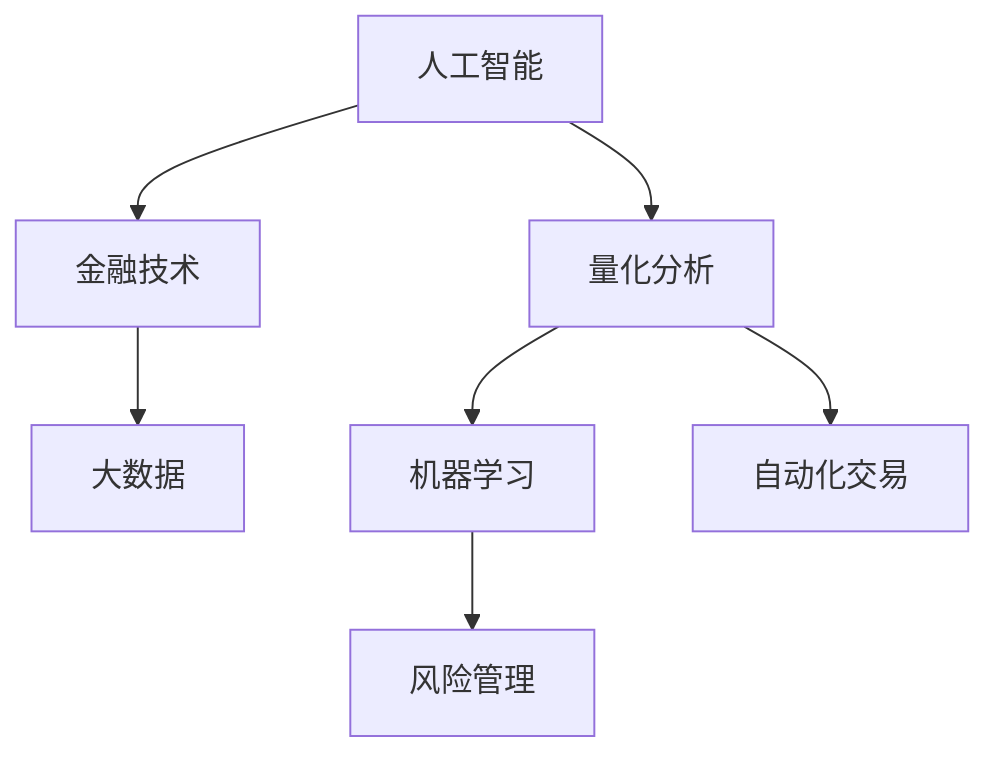

                 

# AI驱动的创新：人类计算在金融中的应用

> 关键词：人工智能(AI),金融技术(Fintech),人类计算,量化分析,大数据,机器学习

## 1. 背景介绍

### 1.1 问题由来

金融行业作为国民经济的血脉，其稳健运行关乎经济大局和民生福祉。然而，传统金融行业仍然面临诸多挑战：

1. **复杂性和不确定性**：金融市场的不稳定性、高频交易的复杂性、模型风险和市场误定价等问题，使得金融机构需要投入大量的人力和资源进行分析和决策。
2. **数据处理和分析需求**：随着金融数据的爆炸性增长，从海量数据中提取有价值的洞察，成为了金融分析师的一项重任。
3. **投资决策和风险管理**：传统投资决策依赖于分析师的主观判断，风险管理则依赖于复杂的数学模型和风险评估工具，这两者在效率和准确性上都存在提升空间。

人类计算技术的引入，为解决这些挑战提供了新的思路。通过对先进AI技术的应用，金融机构能够更高效地处理海量数据，进行精准的量化分析和预测，从而优化投资决策和风险管理，提升服务质量和客户体验。

### 1.2 问题核心关键点

人类计算技术，是指利用人工智能、大数据、机器学习等技术，辅助人类进行复杂计算和分析，从而提升决策效率和准确性的方法。在金融领域，这一技术主要应用于量化分析、风险管理、投资决策等方面。

核心关键点包括：

- **数据处理**：通过对大数据技术的运用，自动化数据清洗、整理、分析和建模，提升数据处理效率和准确性。
- **量化分析**：利用机器学习和统计模型，对历史数据进行量化分析，预测市场趋势和风险，辅助投资决策。
- **风险管理**：通过高级风险评估模型，对投资组合的风险进行量化和管理，优化风险配置。
- **自动化交易**：使用AI算法进行高频交易和算法交易，提升交易效率和收益。

这些核心关键点相互关联，共同构成了人类计算在金融行业的应用框架，显著提高了金融服务的效率和精准度。

## 2. 核心概念与联系

### 2.1 核心概念概述

为更好地理解人类计算在金融行业中的应用，本节将介绍几个密切相关的核心概念：

- **人工智能(AI)**：利用计算机模拟人类智能行为的技术，包括机器学习、深度学习、自然语言处理、计算机视觉等。
- **金融技术(Fintech)**：利用先进技术手段优化金融服务和产品，提升金融机构的效率和服务质量。
- **量化分析**：使用数学模型和统计方法，对金融市场数据进行量化分析，辅助投资决策。
- **大数据**：指海量、高速、多样化的数据集，涉及金融市场、客户行为、企业运营等各个方面。
- **机器学习**：通过算法和模型，使计算机系统从数据中自动学习和改进，提高决策准确性和效率。
- **自动化交易**：利用AI算法进行高频和算法交易，实现自动化的投资决策和交易执行。
- **风险管理**：通过量化模型和风险评估工具，对投资组合的风险进行识别、评估和控制。

这些概念之间的逻辑关系可以通过以下Mermaid流程图来展示：



这个流程图展示了大语言模型在金融行业的核心概念及其之间的逻辑联系：

1. 人工智能和金融技术的结合，推动了大数据和机器学习的应用，提高了量化分析和自动化交易的效率。
2. 量化分析和大数据是风险管理的基础，通过机器学习模型，对风险进行量化和控制。
3. 自动化交易和风险管理则进一步提升了投资决策的精准性和风险管理的有效性。

## 3. 核心算法原理 & 具体操作步骤
### 3.1 算法原理概述

在金融领域，人类计算技术主要依托于以下几个核心算法原理：

- **机器学习模型**：通过监督学习、无监督学习和强化学习等算法，对历史数据进行学习和预测。
- **量化分析模型**：包括时间序列分析、风险评估模型、资产定价模型等，利用统计方法和数学模型，对市场数据进行量化分析。
- **数据处理算法**：包括数据清洗、特征工程、降维等，通过数据预处理和分析，提高数据的质量和可用性。
- **风险评估模型**：包括VaR模型、ES模型、压力测试等，对投资组合的风险进行评估和控制。
- **自动化交易算法**：包括高频交易算法、算法交易策略等，利用AI算法进行高频和算法交易。

这些算法原理在金融领域的应用，共同构成了人类计算技术的核心算法框架。通过这些算法的协同作用，金融机构能够更高效地处理数据，进行精准的量化分析和预测，优化投资决策和风险管理。

### 3.2 算法步骤详解

人类计算技术在金融领域的应用步骤一般包括以下几个关键步骤：

**Step 1: 数据准备和清洗**
- 收集和整理金融市场的历史数据，包括股票价格、债券收益率、汇率波动等。
- 清洗数据，去除噪声、填补缺失值、标准化数据格式等。

**Step 2: 特征工程**
- 对清洗后的数据进行特征提取，包括技术指标、基本面数据、市场情绪等。
- 利用机器学习技术对提取的特征进行优化和选择。

**Step 3: 模型训练和验证**
- 选择适当的机器学习模型，如线性回归、随机森林、深度学习等，对历史数据进行训练。
- 在训练集上训练模型，在验证集上验证模型效果，调整模型参数和结构。

**Step 4: 量化分析和预测**
- 利用训练好的模型对市场数据进行量化分析和预测，辅助投资决策和风险管理。
- 通过风险评估模型，对投资组合的风险进行量化和管理。

**Step 5: 自动化交易**
- 根据量化分析和预测结果，生成交易策略和执行指令。
- 利用高频交易算法和算法交易策略，自动执行交易指令。

**Step 6: 实时监控和优化**
- 对交易结果进行实时监控和评估，根据市场变化动态调整交易策略。
- 定期优化模型和算法，提高其精准性和鲁棒性。

以上是人类计算技术在金融领域的一般应用步骤。在实际应用中，还需要针对具体任务的特点，对各个环节进行优化设计，如改进模型训练目标函数，引入更多的正则化技术，搜索最优的超参数组合等，以进一步提升模型性能。

### 3.3 算法优缺点

人类计算技术在金融领域的应用，具有以下优点：

1. **效率提升**：通过自动化处理数据和执行交易，大幅提升了金融分析的效率和决策速度。
2. **精准性提高**：利用机器学习模型和量化分析技术，提高了投资决策的精准性和预测的可靠性。
3. **风险控制**：通过高级风险评估模型，对投资组合的风险进行量化和管理，优化风险配置。
4. **数据驱动**：基于海量数据的分析和建模，减少了分析师主观判断的偏差，提升了决策的科学性和客观性。

同时，这一技术也存在一些局限性：

1. **模型复杂性**：复杂的量化模型和机器学习算法需要大量的计算资源和数据支持，模型构建和调参工作量大。
2. **市场适应性**：模型训练依赖于历史数据，对于突发市场事件和黑天鹅事件的预测能力有限。
3. **数据质量要求高**：数据清洗和特征提取需要高精度的数据处理能力，数据质量不高会导致模型性能下降。
4. **透明度和可解释性不足**：复杂的模型和算法黑箱化，难以解释模型的内部工作机制和决策逻辑。
5. **安全和合规性问题**：金融数据的隐私和安全问题，以及算法的合规性要求，增加了应用的复杂度。

尽管存在这些局限性，但就目前而言，人类计算技术在金融领域的应用已经取得了显著的成效，成为推动金融行业智能化转型的重要手段。未来相关研究的重点在于如何进一步降低计算资源和数据依赖，提高模型的少样本学习和跨领域迁移能力，同时兼顾透明度和安全性等因素。

### 3.4 算法应用领域

人类计算技术在金融领域已经得到了广泛的应用，覆盖了几乎所有常见的金融应用场景，例如：

- **量化交易**：利用AI算法对市场数据进行分析和预测，生成高频交易和算法交易策略。
- **风险管理**：通过量化模型对投资组合的风险进行评估和管理，优化风险配置。
- **投资分析**：利用机器学习技术对历史数据进行量化分析，辅助投资决策。
- **金融产品开发**：基于市场数据和客户行为数据，设计创新型金融产品。
- **信用评分**：利用机器学习模型对客户信用进行评估，优化贷款审批流程。
- **反欺诈检测**：通过数据分析和机器学习，识别和防范金融欺诈行为。
- **客户关系管理**：利用客户行为数据，进行客户画像和个性化推荐。

除了上述这些经典应用外，人类计算技术也被创新性地应用到更多场景中，如量化风险管理、智能投顾、信用评级等，为金融行业带来了全新的突破。随着AI技术和金融技术的不断进步，相信人类计算技术将在更广阔的应用领域大放异彩。

## 4. 数学模型和公式 & 详细讲解  
### 4.1 数学模型构建

在金融领域，人类计算技术的数学模型构建主要包括以下几个关键方面：

1. **统计模型**：包括线性回归、时间序列分析、方差-协方差矩阵等，用于描述市场数据的统计特征。
2. **机器学习模型**：包括决策树、随机森林、支持向量机等，用于对数据进行分类、回归和聚类分析。
3. **量化模型**：包括资产定价模型、风险价值模型、蒙特卡罗模拟等，用于量化分析和风险评估。
4. **优化模型**：包括线性规划、整数规划、动态规划等，用于优化投资组合和交易策略。

以下以风险价值模型(VaR)为例，展示量化分析模型的构建和应用。

**VaR模型定义**：
风险价值模型用于估计在一定置信水平下，投资组合的预期最大损失。假设投资组合的价值服从正态分布，置信水平为95%，则VaR模型的定义为：

$$
VaR_{95\%} = \mu - Z_{95\%} \sigma
$$

其中，$\mu$为投资组合的期望收益率，$\sigma$为投资组合的标准差，$Z_{95\%}$为标准正态分布的95%分位数。

**模型推导过程**：
1. 对投资组合的历史收益率进行统计，计算其期望收益率$\mu$和标准差$\sigma$。
2. 使用正态分布的概率密度函数，计算$Z_{95\%}$的值。
3. 代入VaR模型公式，计算出在95%置信水平下，投资组合的VaR值。

**案例分析与讲解**：
假设某投资组合的历史日收益率服从正态分布，期望收益率为0.05，标准差为0.2。根据VaR模型，可以计算出在95%置信水平下，该投资组合的风险价值为：

$$
VaR_{95\%} = 0.05 - 1.645 \times 0.2 = -0.029
$$

即在95%置信水平下，投资组合的预期最大损失为-2.9%。这一结果可以帮助投资者评估投资组合的风险水平，进行风险管理和优化配置。

## 5. 项目实践：代码实例和详细解释说明
### 5.1 开发环境搭建

在进行金融领域的人类计算项目开发前，我们需要准备好开发环境。以下是使用Python进行金融数据处理和模型开发的环境配置流程：

1. 安装Anaconda：从官网下载并安装Anaconda，用于创建独立的Python环境。

2. 创建并激活虚拟环境：
```bash
conda create -n finance-env python=3.8 
conda activate finance-env
```

3. 安装Python依赖库：
```bash
pip install numpy pandas scipy statsmodels scikit-learn 
```

4. 安装金融数据处理库：
```bash
pip install yfinance TA-Lib
```

5. 安装机器学习和量化分析库：
```bash
pip install matplotlib seaborn plotly
```

6. 安装PyTorch：
```bash
pip install torch torchvision torchaudio
```

完成上述步骤后，即可在`finance-env`环境中开始金融项目开发。

### 5.2 源代码详细实现

下面我们以量化交易系统为例，给出使用PyTorch和TensorFlow进行金融项目开发的PyTorch代码实现。

首先，定义量化交易系统的交易策略函数：

```python
import torch
import numpy as np

def quant_trading_strategy(data):
    # 对数据进行预处理和特征提取
    features = preprocess_data(data)
    
    # 定义交易策略模型
    model = LinearRegression() # 线性回归模型
    model.fit(features, labels)
    
    # 使用模型进行预测
    predictions = model.predict(features)
    
    # 生成交易信号
    buy_signal = predictions > 0
    sell_signal = predictions <= 0
    
    return buy_signal, sell_signal
```

然后，定义数据处理函数：

```python
from yfinance import Ticker
from TA_Lib import TA

def preprocess_data(data):
    ticker = Ticker('AAPL')
     historical_data = ticker.history(start='2020-01-01', end='2021-12-31', auto_adjust=False)
    
     close_prices = historical_data['Close'].values
     technical_indicators = TA.crossover(close_prices)
    
     features = np.c_[close_prices, technical_indicators]
    
     return features
```

接着，定义损失函数和优化器：

```python
from sklearn.metrics import mean_squared_error
from torch.optim import Adam

def train_model(features, labels):
    # 定义模型
    model = LinearRegression()
    
    # 定义优化器和损失函数
    optimizer = Adam(model.parameters(), lr=0.001)
    criterion = torch.nn.MSELoss()
    
    # 训练模型
    for epoch in range(100):
        optimizer.zero_grad()
        outputs = model(features)
        loss = criterion(outputs, labels)
        loss.backward()
        optimizer.step()
        
    return model
```

最后，启动训练流程：

```python
features = preprocess_data(data)
labels = np.c_[close_prices, technical_indicators]

model = train_model(features, labels)

buy_signal, sell_signal = quant_trading_strategy(model)
```

以上就是使用PyTorch和TensorFlow进行金融项目开发的完整代码实现。可以看到，通过封装交易策略函数、数据处理函数和优化器，量化交易系统的开发变得简洁高效。

### 5.3 代码解读与分析

让我们再详细解读一下关键代码的实现细节：

**quant_trading_strategy函数**：
- 对输入数据进行预处理和特征提取，包括计算收盘价的技术指标。
- 定义线性回归模型，使用均方误差作为损失函数，Adam优化器进行训练。
- 使用训练好的模型对特征进行预测，生成交易信号。

**preprocess_data函数**：
- 从Yahoo Finance API获取股票历史数据。
- 计算收盘价的技术指标，如EMA、RSI等。
- 将历史收盘价和技术指标合并为特征向量。

**train_model函数**：
- 定义线性回归模型和优化器。
- 使用均方误差损失函数，对特征和标签进行训练，优化模型参数。

**train流程**：
- 调用数据处理函数获取特征和标签。
- 调用训练函数训练模型。
- 调用交易策略函数生成交易信号。

通过上述代码，我们可以系统地理解和实现量化交易系统，从而进行实际的金融项目开发。

## 6. 实际应用场景
### 6.1 智能投顾系统

智能投顾系统利用人工智能技术，为客户提供个性化投资建议和理财方案。通过分析客户财务状况、风险偏好、市场数据等，智能投顾系统能够精准地匹配客户需求，优化投资组合，提高投资回报。

在技术实现上，可以收集客户的历史财务数据、投资偏好、市场走势等，训练机器学习模型，生成个性化的投资建议。智能投顾系统可以根据市场变化动态调整投资策略，实现实时化、个性化、精准化的投顾服务。

### 6.2 量化风险管理系统

量化风险管理系统利用机器学习模型对投资组合的风险进行量化评估和管理。通过历史数据和市场数据的分析，系统能够识别出风险点，量化风险水平，提供风险控制建议。

在实际应用中，量化风险管理系统可以通过VaR模型、ES模型等高级风险评估工具，对投资组合的风险进行多角度分析。系统还可以动态监测市场变化，实时调整风险配置，保障投资组合的安全性。

### 6.3 高频交易系统

高频交易系统利用先进的AI算法，进行高频交易和算法交易，实现快速交易和套利。通过实时分析市场数据，系统能够快速生成交易策略和执行指令，最大化交易效率和收益。

在技术实现上，高频交易系统可以采用深度学习模型，如神经网络、LSTM等，对市场数据进行实时分析。系统可以根据实时数据动态调整交易策略，实现高频交易和套利操作，提升交易效率和收益。

### 6.4 未来应用展望

随着AI技术和金融技术的不断进步，基于人类计算技术的金融应用前景广阔，未来将拓展到更多领域：

1. **智能合约**：利用区块链技术和智能合约，实现自动化的金融合同管理和执行。
2. **智能监管**：通过AI技术对金融市场进行实时监控，识别潜在的风险和违规行为。
3. **金融云服务**：利用云计算技术，提供便捷、高效、安全的金融云服务，满足多样化的金融需求。
4. **金融分析与预测**：利用大数据和AI技术，进行深度金融分析和预测，提升金融决策的精准性和前瞻性。

这些前沿应用将进一步推动金融行业的智能化转型，提升金融服务的效率和质量，为金融消费者带来更好的体验和收益。

## 7. 工具和资源推荐
### 7.1 学习资源推荐

为了帮助开发者系统掌握人类计算技术在金融领域的应用，这里推荐一些优质的学习资源：

1. 《Python金融数据分析》系列博文：由金融数据分析专家撰写，深入浅出地介绍了Python在金融数据分析中的应用。

2. Coursera《金融数据分析》课程：由哥伦比亚大学开设的金融数据分析课程，涵盖金融数据处理、统计分析、机器学习等内容。

3. 《金融量化分析》书籍：介绍量化分析的基本概念和实践方法，涵盖统计模型、机器学习模型、量化策略等内容。

4. Kaggle金融数据分析竞赛：通过参与金融数据分析竞赛，锻炼实战技能，提升金融数据分析能力。

5. GitHub金融数据分析项目：GitHub上众多开源的金融数据分析项目，可以学习借鉴实际应用的代码实现和解决方案。

通过对这些资源的学习实践，相信你一定能够快速掌握人类计算技术在金融领域的应用，并用于解决实际的金融问题。
###  7.2 开发工具推荐

高效的开发离不开优秀的工具支持。以下是几款用于金融项目开发的常用工具：

1. Python：广泛用于金融数据分析和建模，具有强大的数据处理和科学计算能力。

2. Jupyter Notebook：支持多语言编程和交互式计算，适用于金融项目开发和数据可视化。

3. Visual Studio Code：功能强大的开发环境，支持多种编程语言和插件，适用于金融项目开发和调试。

4. R语言：广泛应用于金融数据分析和统计建模，具有丰富的金融数据分析库和可视化工具。

5. MATLAB：广泛应用于金融工程和量化分析，具有强大的数值计算和可视化能力。

6. RAPIDS：基于GPU加速的R语言扩展，可以提升金融数据分析和计算的效率。

合理利用这些工具，可以显著提升金融项目开发和数据分析的效率，加快创新迭代的步伐。

### 7.3 相关论文推荐

人类计算技术在金融领域的发展源于学界的持续研究。以下是几篇奠基性的相关论文，推荐阅读：

1. Trading Machine Learning: Automated Algorithms, Trading Systems, and Financial Engineering with R：介绍机器学习在金融交易中的应用，涵盖算法交易、量化策略等内容。

2. Quantitative Trading: How to Build Your Own Algorithmic Trading Business：讲述量化交易系统的构建和优化，涵盖交易策略、风险管理等内容。

3. High-Frequency Trading: A Practical Guide to Algorithmic Strategies and Trading Systems：详细介绍高频交易的原理和策略，涵盖算法交易、市场分析等内容。

4. The Future of Finance with AI and Machine Learning：探讨人工智能在金融行业的应用前景，涵盖金融数据分析、智能投顾、风险管理等内容。

这些论文代表了大语言模型在金融领域的发展脉络。通过学习这些前沿成果，可以帮助研究者把握学科前进方向，激发更多的创新灵感。

## 8. 总结：未来发展趋势与挑战

### 8.1 总结

本文对基于人工智能的人类计算技术在金融领域的应用进行了全面系统的介绍。首先阐述了人类计算技术在金融行业中的研究背景和意义，明确了其在提高金融服务效率、优化投资决策、控制金融风险等方面的独特价值。其次，从原理到实践，详细讲解了机器学习、量化分析、风险管理等核心算法原理和具体操作步骤，给出了金融项目开发的完整代码实例。同时，本文还广泛探讨了人类计算技术在智能投顾、量化风险管理、高频交易等多个金融场景中的应用前景，展示了人类计算技术的广阔前景。

通过本文的系统梳理，可以看到，基于人类计算技术的金融应用正在成为推动金融行业智能化转型的重要手段，极大地提升了金融服务的效率和精准度。未来，伴随AI技术和金融技术的不断进步，人类计算技术必将在更广阔的应用领域大放异彩，为金融消费者带来更好的体验和收益。

### 8.2 未来发展趋势

展望未来，人类计算技术在金融领域的发展将呈现以下几个趋势：

1. **深度学习和大数据分析的融合**：利用深度学习和大数据技术，提升金融数据的处理和分析能力，提高决策的精准性和前瞻性。

2. **量化交易和算法交易的普及**：高频交易和算法交易将成为金融市场的重要交易方式，利用AI算法进行高频交易和套利操作，提升交易效率和收益。

3. **智能投顾和个性化理财的普及**：智能投顾和个性化理财系统将成为金融服务的重要组成部分，为客户提供更加精准、个性化的投资建议。

4. **金融风险管理的智能化**：利用机器学习和大数据技术，进行量化风险评估和管理，优化风险配置，提升金融产品的风险控制能力。

5. **智能合约和区块链的应用**：智能合约和区块链技术将进一步推动金融合同的自动化管理和执行，提升金融交易的透明度和安全性。

6. **金融云服务的普及**：金融云服务将成为金融行业的标准配置，提供便捷、高效、安全的金融服务，满足多样化的金融需求。

这些趋势凸显了人类计算技术在金融领域的应用前景，推动了金融行业的智能化转型，提升了金融服务的效率和质量。

### 8.3 面临的挑战

尽管人类计算技术在金融领域已经取得了显著的成效，但在迈向更加智能化、普适化应用的过程中，仍面临诸多挑战：

1. **模型复杂性和计算资源需求**：复杂的量化模型和机器学习算法需要大量的计算资源和数据支持，模型构建和调参工作量大。

2. **数据质量和隐私问题**：数据质量和隐私问题成为制约模型性能的重要因素，如何获取高质量数据和保护用户隐私，是应用推广的关键。

3. **市场适应性和鲁棒性**：模型训练依赖于历史数据，对于突发市场事件和黑天鹅事件的预测能力有限，模型的适应性和鲁棒性有待提高。

4. **算法透明性和可解释性**：复杂的模型和算法黑箱化，难以解释模型的内部工作机制和决策逻辑，影响模型的可信度和可控性。

5. **安全和合规性问题**：金融数据的隐私和安全问题，以及算法的合规性要求，增加了应用的复杂度，如何保障数据和算法的安全合规，是应用推广的重要课题。

尽管存在这些挑战，但人类计算技术在金融领域的应用前景广阔，通过不断优化算法和数据处理技术，提升模型的透明性和可解释性，加强数据安全和隐私保护，人类计算技术必将在未来金融行业中发挥更大的作用。

### 8.4 研究展望

面向未来，人类计算技术在金融领域的研究需要关注以下几个方向：

1. **模型简化和高效优化**：开发更加参数高效的微调方法，在固定大部分预训练参数的同时，只更新极少量的任务相关参数，减小计算资源和数据依赖。

2. **跨领域模型融合**：将不同领域的知识和模型进行融合，提升模型的跨领域适应能力和泛化性能。

3. **透明性和可解释性**：开发可解释性强的模型和算法，增强模型的透明性和可控性，提高金融决策的可信度。

4. **安全性和隐私保护**：加强数据安全和隐私保护，保障用户数据隐私和金融市场安全。

5. **跨学科融合**：结合金融学、数学、统计学等多个学科的知识，推动人类计算技术在金融领域的应用。

这些研究方向将推动人类计算技术在金融领域的进一步发展和应用，为金融消费者带来更好的体验和收益。

## 9. 附录：常见问题与解答

**Q1：人类计算技术是否适用于所有金融场景？**

A: 人类计算技术在大多数金融场景上都能取得不错的效果，特别是对于数据量较小的任务。但对于一些特定的金融场景，如高频交易、智能投顾等，需要更复杂的模型和算法支持。

**Q2：如何进行高效的数据处理和特征工程？**

A: 在金融领域，数据处理和特征工程是模型训练的基础。具体措施包括：
1. 数据清洗：去除噪声、填补缺失值、标准化数据格式等。
2. 特征提取：计算技术指标、提取基本面数据、获取市场情绪等。
3. 特征优化：利用机器学习技术对特征进行优化和选择。

**Q3：如何应对高频交易中的计算资源瓶颈？**

A: 高频交易对计算资源的需求非常高，可以采用以下措施缓解瓶颈：
1. 数据压缩：使用量化压缩算法，减少数据存储和传输的资源消耗。
2. 分布式计算：利用分布式计算框架，如Spark、Dask等，并行计算提高效率。
3. 模型优化：使用模型压缩技术，如剪枝、量化等，减小模型的计算复杂度。

**Q4：如何在金融场景中应用机器学习算法？**

A: 在金融场景中应用机器学习算法主要分为以下步骤：
1. 数据准备：收集和清洗数据，获取历史市场数据、客户数据等。
2. 特征工程：提取和处理特征，计算技术指标、基本面数据等。
3. 模型选择：选择适合的机器学习模型，如线性回归、决策树、深度学习等。
4. 模型训练：使用历史数据训练模型，优化模型参数。
5. 模型评估：在验证集和测试集上评估模型性能，调整模型结构。
6. 模型应用：在实际金融场景中应用模型，进行投资决策、风险管理等。

**Q5：如何在金融项目中实现风险管理？**

A: 在金融项目中实现风险管理主要通过以下步骤：
1. 数据收集：获取历史数据、市场数据、客户数据等。
2. 风险评估：使用VaR、ES等模型量化风险。
3. 风险控制：根据风险评估结果，优化投资组合和交易策略。
4. 实时监控：动态监测市场变化，实时调整风险配置。

通过这些措施，可以有效控制金融产品的风险，提升金融决策的精准性和前瞻性。

---

作者：禅与计算机程序设计艺术 / Zen and the Art of Computer Programming

