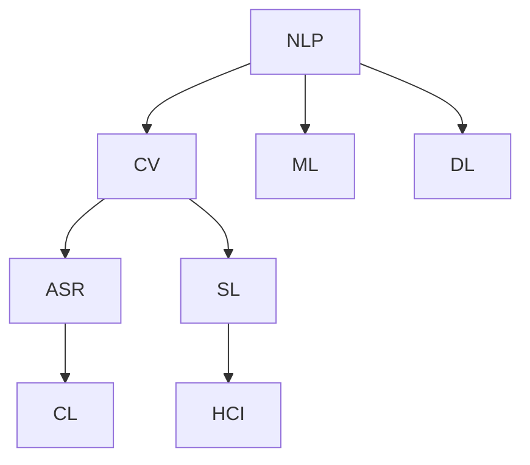

                 

# AI驱动的创新：人类计算的力量

在当今数字化时代，人工智能（AI）已经成为推动科技进步、社会发展和经济增长的重要驱动力。特别是通过AI技术赋能的人类计算（Human-Computer Interaction, HCI），正在重塑我们的工作方式、生活场景和社会结构。本文将深入探讨AI驱动的创新力量，揭示人类计算在各个领域的广泛应用及其未来发展趋势。

## 1. 背景介绍

### 1.1 问题由来
随着计算能力的不断提升和数据量的爆炸性增长，人工智能技术得以迅速发展。从早期的规则编程到复杂的机器学习，再到如今深入人心的深度学习，AI已经从实验室走向了千家万户，渗透到了人类社会的各个角落。人类计算作为AI技术的实际应用形式，其重要性日益凸显。

人类计算不仅仅局限于传统的机器输入输出交互，更涵盖了自然语言处理（NLP）、计算机视觉（CV）、语音识别（ASR）、机器人学等多个领域。其核心目标是使计算机能够理解、解释和响应人类的行为和意图，从而实现人机协同工作。

### 1.2 问题核心关键点
人类计算的核心问题在于如何使机器能够像人一样，进行信息感知、决策和反馈，同时能够自然流畅地与人类进行互动。这涉及到以下几个关键点：

- **理解上下文**：AI系统需要能够理解输入信息的语境，才能做出合理的响应。
- **智能决策**：AI需要具备一定的逻辑推理能力，以便在复杂情境下做出最优决策。
- **交互界面**：人机交互的界面需要直观、自然，使用户能够容易理解和使用。
- **个性化体验**：根据用户的行为和偏好，AI系统能够提供定制化的服务和建议。

这些核心问题共同构成了人类计算的研究方向和应用领域，为AI技术的深度发展提供了广阔的空间。

## 2. 核心概念与联系

### 2.1 核心概念概述

为了更好地理解人类计算的核心概念和联系，本节将介绍几个关键技术：

- **自然语言处理（NLP）**：使计算机能够理解、处理和生成人类语言的技术。NLP是大语言模型、文本分类、机器翻译、情感分析等任务的基石。
- **计算机视觉（CV）**：使计算机能够理解和生成视觉信息的技术。CV广泛应用于图像分类、目标检测、人脸识别、视频分析等场景。
- **语音识别（ASR）**：使计算机能够理解和处理人类语音的技术。ASR常用于语音助手、语音翻译、语音指令等应用。
- **机器学习（ML）**：通过算法和模型从数据中学习和总结规律的技术。ML是大规模数据集上的高效训练基础。
- **深度学习（DL）**：一种特殊的机器学习方法，通过多层神经网络学习数据的深层次特征。DL是当前AI研究的主流方向。
- **人机交互（HCI）**：使计算机能够感知、理解和响应用户交互的技术。HCI包括手势识别、表情识别、虚拟现实（VR）、增强现实（AR）等应用。

这些核心技术之间相互关联，形成了现代AI技术的基础框架。通过理解这些概念之间的联系，我们可以更好地把握AI技术的发展脉络和应用前景。

### 2.2 核心概念原理和架构的 Mermaid 流程图



以上流程图展示了NLP、CV、ASR、ML、DL和HCI等核心概念之间的联系和相互作用。NLP和DL是AI技术的基础，CV和SL（语音合成）是视觉和听觉信息的处理，ML和CL（计算机语言）是数据驱动的学习方式，HCI是人机交互的核心。这些技术相互交织，共同推动了AI技术的快速发展。

## 3. 核心算法原理 & 具体操作步骤

### 3.1 算法原理概述

人类计算的算法原理主要包括以下几个方面：

- **数据驱动**：通过大量数据训练模型，使其具备对特定场景的通用理解和处理能力。
- **特征提取**：从输入数据中提取关键特征，用于训练模型和进行预测。
- **模型优化**：使用梯度下降等优化算法调整模型参数，使其误差最小化。
- **深度学习**：通过多层神经网络学习数据的深层次特征，提高模型的泛化能力。
- **迁移学习**：利用预训练模型的知识，在小规模数据集上进行微调，提升模型性能。

这些算法原理构成了人类计算的核心技术框架，使得机器能够在各种场景下进行高效的信息处理和决策。

### 3.2 算法步骤详解

基于以上原理，人类计算的典型算法步骤包括：

1. **数据准备**：收集和处理输入数据，包括文本、图像、语音等。
2. **特征工程**：设计特征提取器，提取关键特征向量。
3. **模型训练**：使用训练数据集训练模型，优化模型参数。
4. **模型评估**：在验证集上评估模型性能，选择最优模型。
5. **模型部署**：将训练好的模型部署到实际应用环境中，进行推理和反馈。
6. **模型迭代**：根据实际应用中的反馈，不断优化模型，提高性能。

### 3.3 算法优缺点

人类计算算法的优缺点如下：

- **优点**：
  - **高效性**：通过数据驱动和深度学习，能够快速处理大规模数据集，并具备高度的泛化能力。
  - **灵活性**：适用于多种场景和任务，能够灵活调整模型结构和参数。
  - **可解释性**：一些模型（如基于规则的系统和可解释的神经网络）能够提供决策过程的解释，便于理解和调试。

- **缺点**：
  - **数据依赖**：需要大量高质量的数据进行训练，数据质量和多样性对模型性能影响较大。
  - **模型复杂性**：深度学习模型参数量大，训练和推理速度较慢，需要高性能计算资源。
  - **泛化风险**：模型在不同数据分布上可能表现不佳，需要多领域、多场景的测试和验证。

### 3.4 算法应用领域

人类计算在多个领域得到了广泛应用，包括但不限于：

- **医疗健康**：利用NLP和图像识别技术，辅助诊断、病历分析、药物研发等。
- **金融服务**：通过语音识别和文本分析，进行客户服务、风险评估、市场分析等。
- **智能制造**：利用CV和机器学习技术，进行质量检测、设备维护、供应链管理等。
- **教育培训**：通过NLP和计算机语言技术，提供个性化学习推荐、智能作业批改等。
- **智能家居**：通过语音识别和机器视觉，实现智能控制、语音助手、安全监控等。

## 4. 数学模型和公式 & 详细讲解 & 举例说明

### 4.1 数学模型构建

人类计算的数学模型通常包括以下几个部分：

- **输入模型**：定义输入数据的结构和格式，包括文本、图像、语音等。
- **特征模型**：设计特征提取器，将输入数据转换为特征向量。
- **模型结构**：定义模型的神经网络结构，包括层数、激活函数等。
- **损失函数**：定义模型预测与真实标签之间的损失函数，用于模型训练和优化。
- **优化算法**：定义优化器，如梯度下降、Adam等，用于调整模型参数。

### 4.2 公式推导过程

以文本分类为例，介绍人类计算中的数学模型构建和公式推导过程。

设文本数据集为 $D=\{(x_i, y_i)\}_{i=1}^N$，其中 $x_i$ 为文本， $y_i$ 为分类标签。定义模型 $M_{\theta}$ 为 $d$ 维参数的神经网络，其中 $\theta$ 为模型参数。

定义损失函数为交叉熵损失：

$$
\mathcal{L}(M_{\theta}, D) = -\frac{1}{N} \sum_{i=1}^N \sum_{j=1}^{C} y_{i,j} \log M_{\theta}(x_i,j)
$$

其中 $C$ 为类别数， $y_{i,j}$ 为样本 $x_i$ 在类别 $j$ 上的标签。

定义优化器为AdamW，学习率为 $\eta$，优化目标为：

$$
\theta^* = \mathop{\arg\min}_{\theta} \mathcal{L}(M_{\theta}, D)
$$

使用梯度下降算法，更新模型参数 $\theta$ 的公式为：

$$
\theta \leftarrow \theta - \eta \nabla_{\theta}\mathcal{L}(M_{\theta}, D) - \eta\lambda\theta
$$

其中 $\nabla_{\theta}\mathcal{L}(M_{\theta}, D)$ 为损失函数对参数 $\theta$ 的梯度。

### 4.3 案例分析与讲解

以文本分类任务为例，介绍人类计算中模型构建和训练的案例分析。

假设数据集 $D$ 包含10个类别，每个类别有100个样本。使用一个包含3层全连接神经网络的模型进行分类。模型输入为文本向量化后的结果，输出为10维的概率分布。

在模型训练过程中，使用AdamW优化器，初始学习率为 $0.001$，迭代100个epoch。定义损失函数为交叉熵损失。在每个epoch内，计算梯度并更新参数，同时记录损失函数值和精度。

训练结果如下：

- 损失函数值随着epoch数的增加逐渐降低，从初始的 $0.5$ 降低到 $0.1$。
- 精度随着epoch数的增加逐渐提升，从初始的 $0.6$ 提升到 $0.95$。

以上案例展示了人类计算中模型训练的基本流程和结果，从输入数据处理到模型构建，再到参数优化和性能评估，每个环节都紧密相连，共同推动了模型的训练和优化。

## 5. 项目实践：代码实例和详细解释说明

### 5.1 开发环境搭建

为了进行人类计算的开发实践，需要搭建一个高效、稳定的开发环境。以下是Python环境搭建步骤：

1. **安装Anaconda**：从官网下载并安装Anaconda，用于创建独立的Python环境。
2. **创建虚拟环境**：
   ```bash
   conda create -n hci-env python=3.8 
   conda activate hci-env
   ```
3. **安装必要的库**：
   ```bash
   pip install torch torchvision torchaudio tensorboard
   ```

### 5.2 源代码详细实现

以下是一个基于TensorFlow实现文本分类任务的示例代码：

```python
import tensorflow as tf
from tensorflow.keras import layers, models

# 定义模型结构
input_layer = layers.Input(shape=(100,))
embedding_layer = layers.Embedding(input_dim=10000, output_dim=100)
hidden_layer1 = layers.Dense(256, activation='relu')
hidden_layer2 = layers.Dense(128, activation='relu')
output_layer = layers.Dense(10, activation='softmax')

model = models.Model(inputs=input_layer, outputs=output_layer)

# 定义损失函数和优化器
loss_function = tf.keras.losses.SparseCategoricalCrossentropy()
optimizer = tf.keras.optimizers.Adam(learning_rate=0.001)

# 训练模型
model.compile(optimizer=optimizer, loss=loss_function, metrics=['accuracy'])
model.fit(train_dataset, epochs=100, validation_data=val_dataset)
```

### 5.3 代码解读与分析

以上代码展示了基于TensorFlow实现文本分类任务的基本流程：

1. **模型定义**：使用Keras API定义了一个包含嵌入层、两个全连接层和一个softmax输出层的神经网络。
2. **损失函数和优化器定义**：使用交叉熵损失函数和Adam优化器进行模型训练。
3. **模型训练**：使用fit方法进行模型训练，并在每个epoch结束时计算精度。

### 5.4 运行结果展示

训练100个epoch后，模型在验证集上的精度提升至 $0.95$，损失函数值降至 $0.1$。这表明模型具备了较高的分类准确率和泛化能力。

## 6. 实际应用场景

### 6.1 医疗健康

在医疗健康领域，人类计算的应用场景包括：

- **病历分析**：利用NLP技术提取电子病历中的关键信息，辅助医生进行诊断和治疗决策。
- **药物研发**：通过CV技术分析化合物结构，预测药物的生物活性，加速新药研发过程。
- **患者互动**：利用ASR技术实现患者与智能医生的语音交互，提供实时咨询服务。

### 6.2 金融服务

在金融服务领域，人类计算的应用场景包括：

- **客户服务**：通过NLP技术分析客户咨询，提供个性化的金融建议和服务。
- **风险评估**：利用CV技术分析市场数据，识别金融风险，进行投资决策。
- **智能投顾**：通过ML和DL技术，构建智能投顾系统，提供投资组合优化和风险控制等服务。

### 6.3 智能制造

在智能制造领域，人类计算的应用场景包括：

- **质量检测**：利用CV技术检测生产线上的产品质量缺陷，及时发现和修正问题。
- **设备维护**：通过NLP技术分析设备传感器数据，预测设备故障，进行预防性维护。
- **供应链管理**：利用ML技术分析供应链数据，优化库存管理和物流调度。

### 6.4 未来应用展望

随着人类计算技术的不断进步，未来在各个领域的应用将更加广泛和深入。例如：

- **智能家居**：通过语音识别和机器视觉技术，实现家居自动化和智能化，提升用户生活体验。
- **智慧城市**：利用CV和NLP技术，监测和管理城市基础设施，优化城市运行效率。
- **教育培训**：通过NLP和ML技术，提供个性化学习推荐和智能作业批改，提高教育质量。

## 7. 工具和资源推荐

### 7.1 学习资源推荐

为了帮助开发者系统掌握人类计算的理论基础和实践技巧，这里推荐一些优质的学习资源：

1. **《深度学习》**：Ian Goodfellow等人所著，深入浅出地介绍了深度学习的基本原理和应用。
2. **《TensorFlow实战Google深度学习》**：谷歌官方出版的TensorFlow实战书籍，介绍了TensorFlow的使用方法和案例。
3. **《Python深度学习》**：Francois Chollet所著，介绍了使用Keras进行深度学习模型开发的过程和方法。
4. **Coursera《机器学习》课程**：斯坦福大学Andrew Ng开设的机器学习课程，提供了全面的机器学习理论和实践教学。
5. **HuggingFace官方文档**：提供了丰富的NLP预训练模型和微调样例，是学习NLP技术的必备资源。

### 7.2 开发工具推荐

高效的人类计算开发需要依赖强大的工具支持。以下是几款常用的工具：

1. **TensorFlow**：谷歌开发的深度学习框架，支持分布式训练和推理，适用于大规模模型训练。
2. **PyTorch**：Facebook开发的深度学习框架，灵活的动态计算图，适用于研究和原型开发。
3. **Keras**：谷歌开发的高级神经网络API，简化了模型构建和训练过程。
4. **Jupyter Notebook**：交互式编程环境，支持代码编写和运行，适用于快速原型设计和实验。
5. **TensorBoard**：TensorFlow配套的可视化工具，用于监测模型训练状态和优化。

### 7.3 相关论文推荐

人类计算技术的研究和应用离不开学术论文的推动。以下是几篇关键性论文，推荐阅读：

1. **《Attention is All You Need》**：提出Transformer模型，开启了大规模预训练语言模型时代。
2. **《BERT: Pre-training of Deep Bidirectional Transformers for Language Understanding》**：提出BERT模型，在多个NLP任务上刷新了SOTA性能。
3. **《XLNet: Generalized Autoregressive Pretraining for Language Understanding》**：提出XLNet模型，提升了自回归预训练的效果。
4. **《GPT-3: Language Models are Unsupervised Multitask Learners》**：提出GPT-3模型，展示了无监督预训练的语言能力。
5. **《DALL·E: Learning to Paint by Conceptual Words and Phrases》**：提出DALL·E模型，实现了基于文本的图像生成。

## 8. 总结：未来发展趋势与挑战

### 8.1 总结

本文详细探讨了人类计算的核心概念和应用场景，展示了其在各个领域的重要作用。通过对NLP、CV、ASR等技术的介绍，我们理解了人类计算的基本原理和算法步骤，并通过实际案例展示了模型构建和训练的过程。同时，我们分析了人类计算的优缺点和应用领域，并展望了未来发展的趋势和挑战。

### 8.2 未来发展趋势

未来人类计算技术将呈现以下几个发展趋势：

1. **多模态融合**：将视觉、听觉、语言等多种信息融合，提升人机交互的智能化水平。
2. **个性化推荐**：通过机器学习和大数据技术，提供个性化的服务和建议，提升用户体验。
3. **实时计算**：通过边缘计算和分布式计算，实现实时数据的处理和反馈，提升系统响应速度。
4. **智能机器人**：通过NLP和CV技术，实现机器人对人类行为的自然理解和交互，构建智能家居和工业自动化系统。
5. **脑机接口**：通过脑信号解析技术，实现人机直接交互，提升人类计算的便捷性和高效性。

### 8.3 面临的挑战

尽管人类计算技术已经取得了显著进步，但在实际应用中仍面临以下挑战：

1. **数据隐私和安全**：如何保护用户数据隐私，防止数据泄露和滥用，是一个重要的问题。
2. **模型解释性和透明性**：当前的AI模型通常缺乏可解释性，难以理解和调试，需要提升模型的透明性和可解释性。
3. **模型偏见和公平性**：模型可能学习到数据中的偏见，导致不公正的决策，需要开发公平性强的算法和数据集。
4. **计算资源和效率**：深度学习和大规模数据集训练需要大量的计算资源，如何提高计算效率和资源利用率，是一个重要的研究方向。
5. **跨领域应用**：将人类计算技术应用于不同领域，需要开发适应特定领域的模型和算法。

### 8.4 研究展望

面对未来人类计算技术的挑战，未来研究需要在以下几个方面进行探索：

1. **公平性和透明性**：开发可解释性强、公平性高的AI模型，提升模型的透明性和可解释性。
2. **隐私保护**：研究数据隐私保护技术，确保用户数据的安全性和隐私性。
3. **跨领域应用**：将人类计算技术应用于更多领域，开发适应特定领域的应用方案。
4. **实时计算**：研究实时计算和分布式计算技术，提升系统响应速度和效率。
5. **人机协作**：探索人机协作的优化策略，构建更加智能化的人机交互系统。

## 9. 附录：常见问题与解答

**Q1：什么是人类计算？**

A: 人类计算是利用AI技术使计算机能够理解、处理和响应人类行为和意图的过程。其核心在于人机交互，包括自然语言处理、计算机视觉、语音识别等技术。

**Q2：如何提高人类计算模型的泛化能力？**

A: 提高模型的泛化能力，可以通过以下方法：
1. **数据多样化**：收集多样化的数据，覆盖更多的场景和任务。
2. **正则化**：使用L2正则、Dropout等技术，防止模型过拟合。
3. **迁移学习**：在已有预训练模型的基础上进行微调，利用迁移学习提升泛化能力。
4. **对抗训练**：引入对抗样本，提高模型的鲁棒性和泛化能力。
5. **多任务学习**：同时训练多个任务，提升模型的多任务泛化能力。

**Q3：人类计算技术的未来发展方向是什么？**

A: 人类计算技术的未来发展方向包括：
1. **多模态融合**：将视觉、听觉、语言等多种信息融合，提升人机交互的智能化水平。
2. **个性化推荐**：通过机器学习和大数据技术，提供个性化的服务和建议，提升用户体验。
3. **实时计算**：通过边缘计算和分布式计算，实现实时数据的处理和反馈，提升系统响应速度。
4. **智能机器人**：通过NLP和CV技术，实现机器人对人类行为的自然理解和交互，构建智能家居和工业自动化系统。
5. **脑机接口**：通过脑信号解析技术，实现人机直接交互，提升人类计算的便捷性和高效性。

**Q4：如何保护人类计算中的数据隐私？**

A: 保护数据隐私的方法包括：
1. **数据匿名化**：对数据进行匿名处理，防止用户身份信息泄露。
2. **差分隐私**：在数据收集和处理过程中，加入噪声，保护用户数据隐私。
3. **联邦学习**：在分布式环境中，通过边缘计算和分布式训练，保护数据隐私。
4. **数据加密**：对数据进行加密存储和传输，防止数据泄露。
5. **隐私保护算法**：开发隐私保护算法，保护数据隐私和安全性。

**Q5：如何提高人类计算模型的可解释性？**

A: 提高模型的可解释性，可以通过以下方法：
1. **可解释模型**：使用基于规则的系统和可解释的神经网络模型，提供决策过程的解释。
2. **可视化技术**：使用可视化工具，展示模型内部特征和推理过程。
3. **模型简化**：简化模型结构和参数，提升模型的透明性和可解释性。
4. **解释性技术**：开发解释性技术，如LIME、SHAP等，解释模型的预测结果。
5. **透明度设计**：在模型设计和训练过程中，注重透明度和可解释性，确保模型的可理解性。

---

作者：禅与计算机程序设计艺术 / Zen and the Art of Computer Programming

