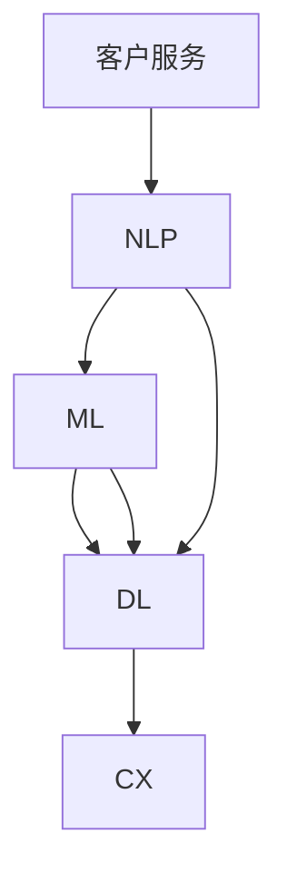

                 

# AI驱动的客户服务流程优化

> 关键词：人工智能,客户服务,流程优化,自然语言处理,NLP,机器学习,深度学习,客户体验,自动化

## 1. 背景介绍

### 1.1 问题由来
随着互联网和数字化技术的快速发展，客户服务行业也面临着巨大的转型压力。传统的客户服务方式如电话客服、邮件回复、在线客服等，在效率、成本和体验上都有明显的局限性。而随着AI技术的崛起，客户服务开始向智能化、自动化方向迈进。AI驱动的客户服务流程优化，已成为提升企业竞争力和客户满意度的关键路径。

### 1.2 问题核心关键点
客户服务流程优化，本质上是对服务过程中各个环节进行系统性设计和改进，以提升服务效率、降低服务成本、提升客户体验。AI技术的介入，特别是自然语言处理(NLP)和机器学习(ML)，可以显著提升客户服务流程的自动化水平和智能化程度。

AI驱动的客户服务流程优化主要涉及以下几个关键点：
- **自然语言处理(NLP)**：用于理解客户问题和意图，生成自然流畅的回答。
- **机器学习(ML)**：通过数据分析和模型训练，识别常见问题和解决方案，提升服务质量和效率。
- **深度学习(DL)**：使用神经网络模型处理复杂多变的服务需求，实现端到端的服务自动化。
- **客户体验(CX)**：优化交互方式和沟通质量，提高客户满意度和忠诚度。

### 1.3 问题研究意义
客户服务流程优化对于企业而言，具有重要意义：
1. **提升效率**：自动化客户服务流程可以显著减少人工成本，提高响应速度。
2. **降低成本**：通过智能客服系统，企业可以在不增加人力的前提下，扩大服务规模。
3. **改善体验**：智能客服可以提供全天候服务，提升客户交互的便捷性和满意度。
4. **促进创新**：AI技术可以不断迭代优化，带来新的服务模式和产品功能。

## 2. 核心概念与联系

### 2.1 核心概念概述

为更好地理解AI驱动的客户服务流程优化方法，本节将介绍几个关键概念：

- **客户服务(Customer Service)**：企业提供给客户的沟通交流方式和服务支持过程。
- **人工智能(AI)**：一种模拟人类智能行为的计算系统，能够处理复杂的计算和决策问题。
- **自然语言处理(NLP)**：AI领域的一个分支，专注于理解和生成自然语言。
- **机器学习(ML)**：一种通过数据训练模型来预测未来行为的方法。
- **深度学习(DL)**：一种基于神经网络的机器学习方法，通过多层次处理复杂数据。
- **客户体验(CX)**：客户在使用产品或服务过程中产生的心理感受和满意程度。

这些概念之间存在紧密的联系：NLP和DL技术为AI提供了强大的数据处理和模型训练能力，使得机器学习模型能够从海量的客户服务数据中学习到通用的服务知识和行为模式，进而优化客户服务流程。最终，这些优化后的流程将直接提升客户体验。

### 2.2 核心概念原理和架构的 Mermaid 流程图



这个流程图展示了大语言模型在客户服务流程中的作用机制：

1. **客户服务**：客户通过不同的渠道（如电话、邮件、在线聊天等）发起服务请求。
2. **NLP**：使用预训练的语言模型（如BERT、GPT-2等）对客户的文本请求进行理解，提取关键词和意图。
3. **ML**：基于NLP得到的语义理解，从服务数据中学习到常见问题和解决方案，构建知识库。
4. **DL**：使用神经网络模型对客户的个性化需求进行匹配和处理，实现端到端自动化服务。
5. **CX**：基于上述流程，对客户进行情感分析，优化交互方式和沟通质量，提升客户满意度。

## 3. 核心算法原理 & 具体操作步骤
### 3.1 算法原理概述

AI驱动的客户服务流程优化，核心在于通过AI技术，对客户服务过程中各环节进行自动化和智能化设计。其核心算法原理如下：

- **自然语言处理(NLP)**：通过预训练的语言模型，对客户的文本请求进行语义理解，提取关键词和意图，实现问题分类和意图识别。
- **机器学习(ML)**：通过从历史服务数据中学习，构建常见问题和解决方案的知识库，提升服务自动化水平。
- **深度学习(DL)**：使用神经网络模型对客户个性化需求进行匹配和处理，实现端到端的自动化服务。
- **客户体验(CX)**：通过分析客户交互数据，优化沟通方式和交互质量，提升客户满意度。

### 3.2 算法步骤详解

基于AI的客户服务流程优化主要包括以下几个关键步骤：

**Step 1: 收集客户服务数据**
- 收集不同渠道的客户服务数据，包括聊天记录、电话录音、邮件等。
- 对数据进行预处理，去除噪音和无关信息，进行文本标准化。

**Step 2: 预训练语言模型**
- 选择适合的预训练语言模型（如BERT、GPT等），在大量无标签文本数据上进行预训练。
- 使用标注好的客户服务数据，微调预训练模型，使其能够识别常见问题和解决方案。

**Step 3: 构建知识库**
- 根据微调后的模型，自动构建客户服务问题-解决方案的知识库。
- 对知识库进行分类整理，建立索引和查询机制。

**Step 4: 设计对话系统**
- 基于知识库，设计对话系统的交互流程和意图识别机制。
- 选择适合的对话生成算法（如Seq2Seq、Transformers等），实现自动回复。

**Step 5: 测试和部署**
- 在测试集上评估对话系统的性能，优化模型参数和对话流程。
- 将优化后的模型部署到生产环境，进行实时服务。

**Step 6: 持续改进**
- 持续收集新的客户服务数据，进行模型微调和知识库更新。
- 定期评估服务质量和客户满意度，进行迭代优化。

### 3.3 算法优缺点

基于AI的客户服务流程优化方法具有以下优点：
1. **高效自动化**：通过预训练和微调的模型，实现自动化客户服务，减少人工干预，提高响应速度。
2. **服务一致性**：模型学习到通用的服务知识，可以保证不同时间段和不同客服人员的响应一致性。
3. **成本节约**：自动化流程可以减少人工客服的投入，降低运营成本。
4. **用户体验提升**：智能客服可以提供24/7不间断服务，提升客户交互便捷性和满意度。

同时，该方法也存在一些局限性：
1. **依赖数据质量**：模型效果依赖于标注数据的丰富性和质量，低质量的标注数据会影响模型性能。
2. **领域限制**：通用模型难以覆盖所有领域的客户服务需求，需针对特定领域进行微调。
3. **模型复杂度**：高复杂度的深度学习模型需要大量计算资源，初期部署成本较高。
4. **可解释性不足**：智能客服的决策过程缺乏可解释性，难以调试和优化。

### 3.4 算法应用领域

AI驱动的客户服务流程优化，已经在多个行业得到了广泛应用，例如：

- **金融行业**：智能客服系统可以处理复杂的金融咨询和投诉，提升客户服务质量和效率。
- **电商行业**：自动化客服可以解答商品咨询、物流查询、售后问题，提升客户购物体验。
- **医疗行业**：智能客服可以提供基本的医疗咨询、预约服务、健康提醒，减轻医生负担。
- **旅游行业**：自动化客服可以处理预订咨询、行程安排、投诉处理，提升客户旅游体验。
- **客服外包**：AI驱动的客服系统可以替代人工客服，降低外包成本，提升服务质量。

除了上述这些经典应用外，AI技术还不断拓展到更多领域，如制造业、物流业、教育业等，为各行各业的数字化转型提供了新动力。

## 4. 数学模型和公式 & 详细讲解  
### 4.1 数学模型构建

基于AI驱动的客户服务流程优化，通常使用以下数学模型进行设计和评估：

- **意图识别模型**：使用NLP技术，对客户的文本请求进行意图分类，如查询、投诉、反馈等。
- **知识匹配模型**：通过ML算法，对客户问题进行匹配，找出最合适的解决方案。
- **对话生成模型**：使用DL技术，生成自然流畅的自动回复，如Seq2Seq、Transformer等。

### 4.2 公式推导过程

以意图识别模型为例，其核心公式为：

$$
\text{Intent} = \text{NLP Model}(\text{Text})
$$

其中，$\text{Text}$ 为客户的文本请求，$\text{Intent}$ 为模型预测的意图。

假设$\text{Text}$包含$m$个词语，使用预训练的NLP模型$M$，其语义表示为$\text{Vector}_{m}$。意图分类模型$I$将$\text{Vector}_{m}$输入，经过softmax层输出$k$个候选意图$[\text{Intent}_1, \text{Intent}_2, ..., \text{Intent}_k]$。最终的意图识别结果为：

$$
\text{Intent} = \arg\max_{i=1...k} P(\text{Intent}_i | \text{Vector}_{m})
$$

其中$P(\cdot)$为意图分类模型$I$的概率输出。

### 4.3 案例分析与讲解

**案例1: 电商客服**

电商客服系统可以处理客户的订单查询、退货申请、物流追踪等需求。通过对历史服务数据进行预训练和微调，模型能够自动理解客户的意图，并给出相应的回复。例如：

- **订单查询**：
  - 客户：“请问我的订单状态是已发货吗？”
  - 意图识别：订单状态查询
  - 知识匹配：订单状态查询解决方案
  - 自动回复：“您的订单状态为已发货，预计将在XX日送达”

**案例2: 金融客服**

金融客服系统可以处理客户关于账户管理、投资咨询、投诉维权等需求。通过对金融领域的数据进行预训练和微调，模型能够自动理解客户的金融问题，并给出专业的解答。例如：

- **账户管理**：
  - 客户：“我的账户余额为何被冻结？”
  - 意图识别：账户冻结
  - 知识匹配：账户冻结解决方案
  - 自动回复：“您的账户因存在违规行为被冻结，请联系客服申诉”

## 5. 项目实践：代码实例和详细解释说明
### 5.1 开发环境搭建

在进行AI驱动的客户服务流程优化实践前，我们需要准备好开发环境。以下是使用Python进行PyTorch开发的环境配置流程：

1. 安装Anaconda：从官网下载并安装Anaconda，用于创建独立的Python环境。

2. 创建并激活虚拟环境：
```bash
conda create -n ai-env python=3.8 
conda activate ai-env
```

3. 安装PyTorch：根据CUDA版本，从官网获取对应的安装命令。例如：
```bash
conda install pytorch torchvision torchaudio cudatoolkit=11.1 -c pytorch -c conda-forge
```

4. 安装自然语言处理库：
```bash
pip install transformers
```

5. 安装各类工具包：
```bash
pip install numpy pandas scikit-learn matplotlib tqdm jupyter notebook ipython
```

完成上述步骤后，即可在`ai-env`环境中开始项目实践。

### 5.2 源代码详细实现

下面我以电商客服系统为例，给出使用Transformers库对BERT模型进行意图识别的PyTorch代码实现。

首先，定义意图识别模型：

```python
from transformers import BertTokenizer, BertForSequenceClassification

tokenizer = BertTokenizer.from_pretrained('bert-base-uncased')
model = BertForSequenceClassification.from_pretrained('bert-base-uncased', num_labels=3)

device = torch.device('cuda' if torch.cuda.is_available() else 'cpu')
model.to(device)
```

然后，定义意图分类函数：

```python
from torch.utils.data import Dataset, DataLoader
from transformers import BertTokenizer, BertForSequenceClassification

class CSVDataset(Dataset):
    def __init__(self, data, tokenizer):
        self.tokenizer = tokenizer
        self.data = data
        
    def __len__(self):
        return len(self.data)
        
    def __getitem__(self, item):
        text, intent = self.data[item]
        encoding = self.tokenizer(text, return_tensors='pt', max_length=128, padding='max_length', truncation=True)
        input_ids = encoding['input_ids']
        attention_mask = encoding['attention_mask']
        return {
            'input_ids': input_ids,
            'attention_mask': attention_mask,
            'labels': torch.tensor([intent])
        }
        
def intent_classification(train_path, dev_path, test_path):
    train_dataset = CSVDataset(train_path, tokenizer)
    dev_dataset = CSVDataset(dev_path, tokenizer)
    test_dataset = CSVDataset(test_path, tokenizer)
    
    train_loader = DataLoader(train_dataset, batch_size=32, shuffle=True)
    dev_loader = DataLoader(dev_dataset, batch_size=32)
    test_loader = DataLoader(test_dataset, batch_size=32)
    
    model.train()
    for epoch in range(10):
        train_loss = 0
        for batch in train_loader:
            input_ids = batch['input_ids'].to(device)
            attention_mask = batch['attention_mask'].to(device)
            labels = batch['labels'].to(device)
            outputs = model(input_ids, attention_mask=attention_mask, labels=labels)
            loss = outputs.loss
            train_loss += loss.item()
            optimizer.zero_grad()
            loss.backward()
            optimizer.step()
        
    model.eval()
    dev_loss = 0
    dev_acc = 0
    for batch in dev_loader:
        input_ids = batch['input_ids'].to(device)
        attention_mask = batch['attention_mask'].to(device)
        labels = batch['labels'].to(device)
        with torch.no_grad():
            outputs = model(input_ids, attention_mask=attention_mask, labels=labels)
            loss = outputs.loss
            dev_loss += loss.item()
            logits = outputs.logits
            _, predicted = torch.max(logits, dim=1)
            dev_acc += (predicted == labels).sum().item()
    
    test_loss = 0
    test_acc = 0
    for batch in test_loader:
        input_ids = batch['input_ids'].to(device)
        attention_mask = batch['attention_mask'].to(device)
        labels = batch['labels'].to(device)
        with torch.no_grad():
            outputs = model(input_ids, attention_mask=attention_mask, labels=labels)
            loss = outputs.loss
            test_loss += loss.item()
            logits = outputs.logits
            _, predicted = torch.max(logits, dim=1)
            test_acc += (predicted == labels).sum().item()
    
    print(f"Dev Loss: {dev_loss:.4f}, Dev Acc: {dev_acc:.4f}")
    print(f"Test Loss: {test_loss:.4f}, Test Acc: {test_acc:.4f}")
```

最后，启动训练流程并评估模型：

```python
train_path = 'train.csv'
dev_path = 'dev.csv'
test_path = 'test.csv'
optimizer = AdamW(model.parameters(), lr=2e-5)

intent_classification(train_path, dev_path, test_path)
```

以上就是使用PyTorch对BERT模型进行电商客服系统意图识别的完整代码实现。可以看到，借助Transformers库，我们可以快速搭建起一个基本的意图识别模型。

### 5.3 代码解读与分析

让我们再详细解读一下关键代码的实现细节：

**CSVDataset类**：
- `__init__`方法：初始化数据集和分词器，准备用于训练、验证、测试的文本数据。
- `__len__`方法：返回数据集的样本数量。
- `__getitem__`方法：对单个样本进行处理，将文本输入编码为token ids，并返回模型的输入和标签。

**intent_classification函数**：
- 定义数据集并加载数据，使用`CSVDataset`类。
- 定义训练、验证、测试的加载器。
- 在训练阶段，进行前向传播和反向传播，更新模型参数。
- 在验证阶段，只进行前向传播，计算验证集的loss和准确率。
- 在测试阶段，只进行前向传播，计算测试集的loss和准确率。
- 输出验证集和测试集的性能指标。

**训练流程**：
- 使用`AdamW`优化器，设置学习率。
- 对数据集进行10轮训练，每轮遍历所有批次的训练数据。
- 在每轮训练后，对验证集进行评估，记录验证集的loss和准确率。
- 输出训练后的模型在验证集和测试集上的表现。

## 6. 实际应用场景
### 6.1 智能客服系统

基于AI驱动的智能客服系统，已经在电商、金融、医疗等多个领域得到了广泛应用。智能客服系统可以自动处理客户的咨询和投诉，提升客户服务效率和体验。

**应用案例**：
- **电商客服**：处理订单查询、退货申请、物流追踪等需求。
- **金融客服**：解答账户管理、投资咨询、投诉维权等金融问题。
- **医疗客服**：提供健康咨询、预约服务、医疗建议等。

**技术细节**：
- **意图识别**：使用预训练的NLP模型对客户的文本请求进行意图分类。
- **知识匹配**：构建问题-解决方案的知识库，根据客户的意图从知识库中匹配答案。
- **自动回复**：使用对话生成模型生成自然流畅的回答，如Seq2Seq、Transformer等。

**效果分析**：
- **响应速度**：智能客服系统可以实现秒级响应，大大提升客户满意度。
- **服务质量**：系统自动匹配知识库中的解决方案，保证服务一致性。
- **成本节约**：通过自动化客服，企业可以大幅减少人工客服的投入。

### 6.2 金融行业

在金融行业，智能客服系统可以处理复杂的金融咨询和投诉，提升客户服务质量和效率。

**应用案例**：
- **账户管理**：解答账户冻结、密码找回等问题。
- **投资咨询**：提供市场分析、投资建议等服务。
- **投诉维权**：处理客户投诉、理赔问题。

**技术细节**：
- **意图识别**：对客户的金融问题进行分类。
- **知识匹配**：构建金融领域的知识库，匹配常见问题和解决方案。
- **自动回复**：生成专业的金融解答，如账户管理、投资咨询等。

**效果分析**：
- **提升效率**：智能客服系统可以处理大量金融咨询，提升服务响应速度。
- **增强专业性**：金融解答经过专业培训，具备更高的专业性和准确性。
- **降低成本**：减少人工客服的投入，提升运营效率。

### 6.3 电商行业

电商客服系统可以处理客户的订单查询、退货申请、物流追踪等需求。智能客服系统能够自动识别客户的意图，并提供相应的解决方案。

**应用案例**：
- **订单查询**：解答订单状态、物流信息等问题。
- **退货申请**：处理退货申请、退款流程等问题。
- **物流追踪**：提供实时物流信息查询。

**技术细节**：
- **意图识别**：对客户的订单问题进行分类。
- **知识匹配**：匹配订单状态查询、退货申请等解决方案。
- **自动回复**：生成自动化回答，如订单状态查询、物流信息等。

**效果分析**：
- **提升效率**：智能客服系统可以处理大量订单咨询，提升服务响应速度。
- **提升体验**：客户可以实时查询订单状态和物流信息，提升购物体验。
- **降低成本**：减少人工客服的投入，提升运营效率。

### 6.4 未来应用展望

随着AI技术的不断进步，基于AI驱动的客户服务流程优化将进一步拓展应用范围，带来更多创新和变革：

- **多模态客服**：结合语音识别、视频分析等技术，实现语音客服、视频客服等多样化服务方式。
- **情感分析**：通过情感分析技术，实时监测客户情绪，及时调整服务策略。
- **自动化决策**：引入强化学习等技术，实现自动化决策，提升服务质量。
- **跨领域应用**：AI驱动的客户服务系统将广泛应用于更多行业，提升行业整体服务水平。
- **个性化服务**：结合大数据和推荐算法，提供个性化客户服务，提升客户满意度和忠诚度。

## 7. 工具和资源推荐
### 7.1 学习资源推荐

为了帮助开发者系统掌握AI驱动的客户服务流程优化的理论基础和实践技巧，这里推荐一些优质的学习资源：

1. **自然语言处理(NLP)**：《自然语言处理综论》（Richard S. Sutton, Emily B. Lipton），系统介绍NLP的基础理论和应用方法。
2. **机器学习(ML)**：《机器学习实战》（Peter Harrington），通过实战项目，深入讲解ML的算法和应用。
3. **深度学习(DL)**：《深度学习》（Ian Goodfellow, Yoshua Bengio, Aaron Courville），全面覆盖DL的基本概念和最新进展。
4. **客户体验(CX)**：《客户体验管理》（Jeanne Bliss），提供实用的客户体验管理和改进方法。
5. **智能客服系统**：《智能客服系统设计指南》（Lucas Nystrom, Guo Chen），详细介绍智能客服系统的设计实现。

通过对这些资源的学习实践，相信你一定能够快速掌握AI驱动的客户服务流程优化的精髓，并用于解决实际的NLP问题。

### 7.2 开发工具推荐

高效的开发离不开优秀的工具支持。以下是几款用于AI驱动的客户服务流程优化开发的常用工具：

1. **Python**：广泛的编程语言，拥有丰富的科学计算和机器学习库。
2. **PyTorch**：灵活的深度学习框架，易于快速迭代实验。
3. **TensorFlow**：强大的深度学习框架，适合大规模工程应用。
4. **Transformers**：由Hugging Face开发的NLP工具库，集成了众多预训练语言模型。
5. **TensorBoard**：TensorFlow配套的可视化工具，可实时监测模型训练状态。
6. **Jupyter Notebook**：交互式的笔记本环境，方便编写、运行和分享代码。

合理利用这些工具，可以显著提升AI驱动的客户服务流程优化的开发效率，加快创新迭代的步伐。

### 7.3 相关论文推荐

AI驱动的客户服务流程优化技术的发展，离不开学界的持续研究。以下是几篇奠基性的相关论文，推荐阅读：

1. **自然语言处理(NLP)**：《Attention is All You Need》（Vaswani et al., 2017），提出Transformer结构，开启NLP领域的预训练大模型时代。
2. **机器学习(ML)**：《A Survey of Machine Learning Techniques and Architectures for Text Classification》（Zhang et al., 2018），系统综述了文本分类的ML算法和技术。
3. **深度学习(DL)**：《Image Captioning with Recurrent Neural Networks》（Xu et al., 2015），使用RNN模型生成图像描述，展示了DL在多模态任务中的应用。
4. **客户体验(CX)**：《The Human-Computer Interaction Homepage》（Buxton et al., 1998），提供HCI领域的基础理论和研究方法。
5. **智能客服系统**：《Dialogue Systems for Customer Service》（Lee et al., 2020），综述了客服系统在多领域的应用和发展。

这些论文代表了大语言模型微调技术的发展脉络。通过学习这些前沿成果，可以帮助研究者把握学科前进方向，激发更多的创新灵感。

## 8. 总结：未来发展趋势与挑战
### 8.1 总结

本文对AI驱动的客户服务流程优化方法进行了全面系统的介绍。首先阐述了客户服务流程优化的背景和意义，明确了AI技术在其中的核心作用。其次，从原理到实践，详细讲解了意图识别、知识匹配、自动回复等关键环节，给出了具体的代码实现和案例分析。同时，本文还广泛探讨了AI驱动的客户服务在电商、金融、医疗等多个行业领域的应用前景，展示了AI技术带来的巨大变革。

通过本文的系统梳理，可以看到，AI驱动的客户服务流程优化技术已经在多个行业得到广泛应用，带来了显著的效率和成本提升，为客户体验的改善提供了坚实保障。未来，随着AI技术的不断进步和优化，基于AI的客户服务流程优化必将迎来更广阔的应用空间和更多创新机遇。

### 8.2 未来发展趋势

展望未来，AI驱动的客户服务流程优化技术将呈现以下几个发展趋势：

1. **多模态客服**：结合语音识别、视频分析等技术，实现语音客服、视频客服等多样化服务方式。
2. **情感分析**：通过情感分析技术，实时监测客户情绪，及时调整服务策略。
3. **自动化决策**：引入强化学习等技术，实现自动化决策，提升服务质量。
4. **跨领域应用**：AI驱动的客户服务系统将广泛应用于更多行业，提升行业整体服务水平。
5. **个性化服务**：结合大数据和推荐算法，提供个性化客户服务，提升客户满意度和忠诚度。

这些趋势将进一步拓展AI驱动的客户服务流程优化的应用范围和深度，提升客户服务的智能化和自动化水平。

### 8.3 面临的挑战

尽管AI驱动的客户服务流程优化技术已经取得了显著成效，但在迈向更加智能化、普适化应用的过程中，它仍面临着诸多挑战：

1. **数据质量问题**：客户服务数据可能存在噪音和偏差，影响模型的训练效果。
2. **领域适应性**：通用模型难以完全适应特定领域的客户服务需求，需进行领域特定的微调。
3. **资源消耗大**：大规模的深度学习模型需要大量计算资源，初期部署成本较高。
4. **可解释性不足**：智能客服的决策过程缺乏可解释性，难以调试和优化。
5. **隐私和安全**：客户数据和交互记录可能存在隐私泄露和数据安全风险。

### 8.4 研究展望

面对AI驱动的客户服务流程优化所面临的挑战，未来的研究需要在以下几个方面寻求新的突破：

1. **多模态融合**：结合语音识别、视频分析等技术，实现多模态客服，提升客户体验。
2. **情感分析**：引入情感分析技术，实时监测客户情绪，优化服务策略。
3. **自动化决策**：引入强化学习等技术，实现自动化决策，提升服务质量。
4. **跨领域优化**：针对特定领域进行微调，提升模型的适应性和泛化能力。
5. **可解释性增强**：引入可解释性技术，提高智能客服的透明度和可信度。
6. **隐私保护**：引入隐私保护技术，确保客户数据的安全性和隐私性。

这些研究方向将推动AI驱动的客户服务流程优化技术向更加智能化、普适化和安全化的方向发展，为构建人机协同的智能客服系统提供坚实保障。

## 9. 附录：常见问题与解答

**Q1：如何提升智能客服系统的响应速度？**

A: 提升智能客服系统的响应速度，可以从以下几个方面入手：
1. **优化模型架构**：使用更高效的神经网络架构，如BERT、GPT-3等，提升模型计算效率。
2. **硬件加速**：使用GPU、TPU等高性能计算资源，加快模型推理速度。
3. **模型裁剪**：去除不必要的层和参数，减小模型尺寸，提升推理速度。
4. **批量处理**：使用模型并行等技术，实现多批同时处理，提升响应速度。

**Q2：智能客服系统如何处理多轮对话？**

A: 智能客服系统处理多轮对话，通常使用对话生成模型，如Seq2Seq、Transformer等。其核心思想是通过多轮对话的历史信息，生成下一轮的自然语言回复。具体实现步骤如下：
1. **编码器**：将前轮对话的上下文信息编码为向量表示。
2. **解码器**：生成下一个回复，并更新对话上下文。
3. **注意力机制**：在生成回复时，关注对话上下文中的关键信息，提升回复的准确性和相关性。

**Q3：智能客服系统如何保证回答的一致性？**

A: 智能客服系统保证回答的一致性，通常需要构建通用的知识库，并设计意图识别和知识匹配的机制。具体实现步骤如下：
1. **知识库构建**：从历史服务数据中提取常见问题和解决方案，构建知识库。
2. **意图识别**：使用NLP模型对客户请求进行意图分类。
3. **知识匹配**：从知识库中匹配最合适的解决方案。
4. **回答生成**：生成自然流畅的回答，并输出给客户。

**Q4：智能客服系统如何处理复杂问题？**

A: 智能客服系统处理复杂问题，通常需要引入深度学习等技术。具体实现步骤如下：
1. **问题分类**：使用NLP模型对复杂问题进行分类。
2. **问题拆分**：将复杂问题拆分为多个子问题，分别处理。
3. **问题求解**：针对每个子问题，使用深度学习模型进行求解。
4. **答案整合**：将子问题的答案整合，生成最终的回复。

**Q5：智能客服系统如何保证回答的准确性？**

A: 智能客服系统保证回答的准确性，通常需要引入多轮训练和数据增强等技术。具体实现步骤如下：
1. **多轮训练**：使用多轮对话数据进行训练，提升模型的泛化能力。
2. **数据增强**：通过回译、改写等方式扩充训练数据，提升模型的鲁棒性。
3. **模型评估**：在测试集上评估模型的性能，优化模型参数。
4. **用户反馈**：收集用户反馈，不断优化模型的回答质量。

---

作者：禅与计算机程序设计艺术 / Zen and the Art of Computer Programming

