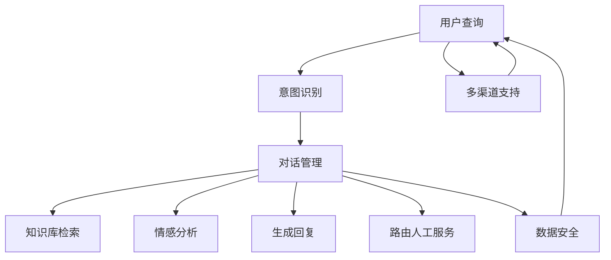

                 

# AI驱动的智能客户服务系统设计

> 关键词：人工智能(AI)、智能客服系统、自然语言处理(NLP)、深度学习、机器学习、聊天机器人、对话系统、意图识别、情感分析

## 1. 背景介绍

### 1.1 问题由来
在现代社会，企业面临的竞争日益激烈，如何提升客户满意度、降低运营成本、增强市场竞争力，成为了企业关注的重点。而传统客服模式存在响应慢、效率低、成本高、服务质量不稳定等问题，难以满足日益增长的客户需求。因此，企业亟需一种智能、高效、全天候的客户服务解决方案，以应对不断变化的市场挑战。

### 1.2 问题核心关键点
基于此，企业开始探索使用人工智能技术，尤其是自然语言处理(NLP)和深度学习技术，构建智能客服系统。这种智能客服系统可以通过自然语言理解和生成，实时响应客户咨询，解答客户问题，提供个性化服务，大幅提升客户满意度和服务效率。然而，由于NLP和深度学习模型的复杂性，如何设计高效、可靠的智能客服系统，仍然是一个需要深入探讨的问题。

### 1.3 问题研究意义
深入研究智能客服系统的设计和实现，不仅有助于提升企业的客户服务水平，还能推动人工智能技术在各行各业的广泛应用。智能客服系统作为一种典型的人机交互系统，能够为其他领域的智能应用提供有益借鉴，如医疗咨询、金融服务、教育培训等。因此，本文将对智能客服系统的设计原理、关键技术、实现方法等进行详细探讨，希望能为相关领域的研究和实践提供参考。

## 2. 核心概念与联系

### 2.1 核心概念概述

智能客服系统是集成了人工智能技术，尤其是自然语言处理和机器学习技术的客服解决方案。其核心思想是通过NLP技术，将客户的自然语言查询转换为结构化数据，再利用机器学习模型进行理解和生成，提供准确的答复和建议。

智能客服系统的构建包括以下几个关键组件：

- **意图识别**：通过NLP技术，识别客户的查询意图，如问题解答、订单查询、投诉反馈等。
- **对话管理**：根据客户意图，选择并执行相应的服务流程，如路由到人工客服、生成自动回复、提供常见问题解答等。
- **情感分析**：分析客户的情感倾向，判断其情绪状态，从而更好地应对和解决客户问题。
- **知识库管理**：维护和更新知识库，提供丰富的产品信息、服务条款、FAQ等内容，帮助客户快速找到解决方案。
- **多渠道支持**：支持语音、文字、图像等多种交互方式，满足不同客户的需求。
- **数据安全**：保障客户数据和隐私安全，防止数据泄露和滥用。

### 2.2 核心概念原理和架构的 Mermaid 流程图


该流程图展示了智能客服系统的核心流程：用户通过各种渠道提交查询，首先经过意图识别模块进行意图分类，然后根据分类结果选择相应的服务流程，调用知识库检索、情感分析、生成回复等功能模块，并在必要时进行人工路由。整个流程中，多渠道支持和数据安全也是不可或缺的组成部分。

## 3. 核心算法原理 & 具体操作步骤
### 3.1 算法原理概述

智能客服系统的核心算法主要基于自然语言处理和机器学习技术，以下是详细解释：

**意图识别算法**：
意图识别是智能客服系统的第一步，用于理解客户提出的问题。常用的方法包括基于规则的方法、基于机器学习的方法、基于深度学习的方法等。本文将重点探讨基于深度学习的方法。

**对话管理算法**：
对话管理是智能客服系统的核心，用于控制对话流程，确定下一步应该执行的动作。常用的方法包括基于规则的方法、基于状态机的方法、基于神经网络的方法等。本文将重点探讨基于神经网络的方法。

**情感分析算法**：
情感分析用于识别客户的情感倾向，帮助客服系统更好地理解客户需求，提供更贴心的服务。常用的方法包括基于规则的方法、基于机器学习的方法、基于深度学习的方法等。本文将重点探讨基于深度学习的方法。

**知识库检索算法**：
知识库检索用于在知识库中搜索相关信息，为客户提供快速准确的答案。常用的方法包括基于规则的方法、基于统计的方法、基于深度学习的方法等。本文将重点探讨基于深度学习的方法。

**生成回复算法**：
生成回复用于根据客户的查询生成自动回复。常用的方法包括基于模板的方法、基于规则的方法、基于深度学习的方法等。本文将重点探讨基于深度学习的方法。

### 3.2 算法步骤详解

以下是对智能客服系统设计流程的详细介绍：

**Step 1: 数据预处理**
- 收集并清洗客户查询数据，去除无关数据和噪声，确保数据质量。
- 将查询数据标注为意图类别和情感类别，用于训练意图识别和情感分析模型。
- 构建并更新知识库，添加产品信息、服务条款、FAQ等内容。

**Step 2: 意图识别模型训练**
- 使用深度学习模型（如BERT、GPT等）进行意图识别模型的训练，将查询数据作为输入，意图类别作为标签，进行监督学习。
- 使用数据增强、正则化等技术提高模型泛化能力。
- 选择适当的超参数，如学习率、批大小、迭代次数等。

**Step 3: 对话管理模型训练**
- 使用深度学习模型（如Transformer等）进行对话管理模型的训练，将对话历史和意图作为输入，输出下一步动作。
- 使用监督学习或强化学习技术优化对话管理模型。
- 选择适当的超参数，如模型结构、学习率、批大小、迭代次数等。

**Step 4: 情感分析模型训练**
- 使用深度学习模型（如BERT、LSTM等）进行情感分析模型的训练，将查询数据作为输入，情感类别作为标签，进行监督学习。
- 使用数据增强、正则化等技术提高模型泛化能力。
- 选择适当的超参数，如学习率、批大小、迭代次数等。

**Step 5: 知识库检索模型训练**
- 使用深度学习模型（如BERT、GPT等）进行知识库检索模型的训练，将查询数据作为输入，知识库内容作为标签，进行监督学习。
- 使用数据增强、正则化等技术提高模型泛化能力。
- 选择适当的超参数，如学习率、批大小、迭代次数等。

**Step 6: 生成回复模型训练**
- 使用深度学习模型（如BERT、GPT等）进行生成回复模型的训练，将查询数据作为输入，生成自动回复作为输出，进行监督学习。
- 使用数据增强、正则化等技术提高模型泛化能力。
- 选择适当的超参数，如学习率、批大小、迭代次数等。

**Step 7: 系统集成与优化**
- 将意图识别、对话管理、情感分析、知识库检索、生成回复等模块集成到智能客服系统中。
- 使用A/B测试、用户反馈等方法优化系统性能。
- 不断更新和扩展知识库，提高系统的准确性和时效性。

### 3.3 算法优缺点

智能客服系统基于深度学习技术构建，具有以下优点：
- **高效性**：深度学习模型能够快速处理大规模数据，提高响应速度。
- **准确性**：深度学习模型具有较强的泛化能力，能够准确识别客户意图和情感。
- **可扩展性**：深度学习模型能够方便地进行扩展和优化，适应不同客户需求。

然而，深度学习模型也存在一些缺点：
- **高成本**：深度学习模型的训练和优化需要大量计算资源和人力成本。
- **黑盒性**：深度学习模型的决策过程难以解释，不利于系统的维护和调试。
- **数据依赖**：深度学习模型的性能依赖于数据的质量和数量，数据不足可能导致性能下降。

### 3.4 算法应用领域

智能客服系统广泛应用于各类企业，如电商平台、银行、保险公司、医疗等。在实际应用中，智能客服系统能够帮助企业实现以下效果：

- **提升客户满意度**：智能客服系统能够实时响应客户咨询，提供准确的信息和解决方案，显著提升客户满意度。
- **降低运营成本**：智能客服系统能够处理大量客户咨询，减轻人工客服的负担，降低运营成本。
- **提高服务效率**：智能客服系统能够快速识别客户意图和情感，提供个性化服务，提高服务效率。
- **增强市场竞争力**：智能客服系统能够提升企业的服务质量，增强市场竞争力，吸引更多客户。

## 4. 数学模型和公式 & 详细讲解  
### 4.1 数学模型构建

在智能客服系统中，涉及的数学模型主要基于深度学习技术，以下是详细解释：

**意图识别模型**：
- 输入：查询数据 $x$
- 输出：意图类别 $y$
- 目标：最大化似然函数 $P(y|x)$

**对话管理模型**：
- 输入：对话历史 $H$，当前意图 $I$
- 输出：下一步动作 $A$
- 目标：最大化动作策略 $P(A|H,I)$

**情感分析模型**：
- 输入：查询数据 $x$
- 输出：情感类别 $y$
- 目标：最大化似然函数 $P(y|x)$

**知识库检索模型**：
- 输入：查询数据 $x$
- 输出：知识库内容 $C$
- 目标：最大化相关度 $R(x,C)$

**生成回复模型**：
- 输入：查询数据 $x$
- 输出：回复文本 $t$
- 目标：最大化生成概率 $P(t|x)$

### 4.2 公式推导过程

以下是对智能客服系统核心算法公式的详细推导：

**意图识别模型**：
假设意图识别模型为 $f(x;\theta)$，其中 $x$ 为输入数据，$\theta$ 为模型参数。意图识别模型的训练目标为最大化对数似然函数：

$$
\max_{\theta} \frac{1}{N} \sum_{i=1}^N \log P(y_i|x_i)
$$

其中 $y_i$ 为意图类别，$x_i$ 为输入数据。

**对话管理模型**：
假设对话管理模型为 $g(H,I;\theta)$，其中 $H$ 为对话历史，$I$ 为当前意图，$\theta$ 为模型参数。对话管理模型的训练目标为最大化策略函数：

$$
\max_{\theta} \frac{1}{N} \sum_{i=1}^N \log \pi(A_i|H_i,I_i)
$$

其中 $A_i$ 为下一步动作，$H_i$ 为对话历史，$I_i$ 为当前意图，$\pi$ 为动作策略函数。

**情感分析模型**：
假设情感分析模型为 $h(x;\theta)$，其中 $x$ 为输入数据，$\theta$ 为模型参数。情感分析模型的训练目标为最大化对数似然函数：

$$
\max_{\theta} \frac{1}{N} \sum_{i=1}^N \log P(y_i|x_i)
$$

其中 $y_i$ 为情感类别，$x_i$ 为输入数据。

**知识库检索模型**：
假设知识库检索模型为 $k(x,C;\theta)$，其中 $x$ 为输入数据，$C$ 为知识库内容，$\theta$ 为模型参数。知识库检索模型的训练目标为最大化相关度：

$$
\max_{\theta} \frac{1}{N} \sum_{i=1}^N R(x_i,C_i)
$$

其中 $C_i$ 为知识库内容，$R(x,C)$ 为相关度函数。

**生成回复模型**：
假设生成回复模型为 $m(x;t;\theta)$，其中 $x$ 为输入数据，$t$ 为回复文本，$\theta$ 为模型参数。生成回复模型的训练目标为最大化生成概率：

$$
\max_{\theta} \frac{1}{N} \sum_{i=1}^N \log P(t_i|x_i)
$$

其中 $t_i$ 为回复文本，$x_i$ 为输入数据。

### 4.3 案例分析与讲解

以情感分析模型为例，进行详细分析与讲解。

假设我们有一个包含 10,000 条查询数据的情感分析数据集，其中包含正面、中性和负面情感标签。我们可以使用 BERT 模型进行情感分析模型的训练，步骤如下：

1. **数据预处理**：将查询数据转换为 BERT 可接受的格式，并进行数据增强、正则化等预处理。
2. **模型训练**：使用 BERT 模型进行情感分析模型的训练，将查询数据作为输入，情感类别作为标签，进行监督学习。
3. **超参数优化**：使用网格搜索、随机搜索等方法，寻找最优的模型超参数，如学习率、批大小、迭代次数等。
4. **模型评估**：在验证集上评估模型性能，使用准确率、召回率、F1 值等指标衡量模型效果。
5. **模型应用**：将训练好的情感分析模型集成到智能客服系统中，用于分析客户的情感倾向，指导客服人员提供更贴心的服务。

## 5. 项目实践：代码实例和详细解释说明
### 5.1 开发环境搭建

在进行智能客服系统开发前，我们需要准备好开发环境。以下是使用Python进行PyTorch开发的环境配置流程：

1. 安装Anaconda：从官网下载并安装Anaconda，用于创建独立的Python环境。

2. 创建并激活虚拟环境：
```bash
conda create -n pytorch-env python=3.8 
conda activate pytorch-env
```

3. 安装PyTorch：根据CUDA版本，从官网获取对应的安装命令。例如：
```bash
conda install pytorch torchvision torchaudio cudatoolkit=11.1 -c pytorch -c conda-forge
```

4. 安装Transformers库：
```bash
pip install transformers
```

5. 安装各类工具包：
```bash
pip install numpy pandas scikit-learn matplotlib tqdm jupyter notebook ipython
```

完成上述步骤后，即可在`pytorch-env`环境中开始智能客服系统开发。

### 5.2 源代码详细实现

下面以BERT模型为基础，构建一个简单的智能客服系统，具体实现步骤包括：

1. **数据准备**：准备意图识别、对话管理、情感分析、知识库检索、生成回复等模块所需的数据集。
2. **模型训练**：使用 PyTorch 和 Transformers 库训练意图识别、对话管理、情感分析、知识库检索、生成回复等模型。
3. **系统集成**：将训练好的模型集成到智能客服系统中，进行部署和测试。

以下是具体的实现代码示例：

```python
from transformers import BertTokenizer, BertForSequenceClassification, BertForMaskedLM, BertForQuestionAnswering, BertForTokenClassification, BertForSequenceClassification

# 导入模型和分词器
tokenizer = BertTokenizer.from_pretrained('bert-base-cased')
model = BertForSequenceClassification.from_pretrained('bert-base-cased', num_labels=3)

# 定义意图识别函数
def intent_classification(text):
    inputs = tokenizer.encode_plus(text, return_tensors='pt')
    outputs = model(**inputs)
    logits = outputs.logits
    probs = logits.softmax(dim=-1)
    intent_id = probs.argmax().item()
    return intent_id

# 定义对话管理函数
def dialogue_management(history, intent_id):
    # 根据历史对话和当前意图，生成下一步动作
    return action

# 定义情感分析函数
def sentiment_analysis(text):
    inputs = tokenizer.encode_plus(text, return_tensors='pt')
    outputs = sentiment_model(**inputs)
    logits = outputs.logits
    probs = logits.softmax(dim=-1)
    sentiment_id = probs.argmax().item()
    return sentiment_id

# 定义知识库检索函数
def knowledge_base_search(text):
    inputs = tokenizer.encode_plus(text, return_tensors='pt')
    outputs = knowledge_base_model(**inputs)
    scores = outputs.scores
    best_score_index = scores.argmax().item()
    return knowledge_base[index[best_score_index]]

# 定义生成回复函数
def generate_reply(text):
    inputs = tokenizer.encode_plus(text, return_tensors='pt')
    outputs = reply_model(**inputs)
    logits = outputs.logits
    probs = logits.softmax(dim=-1)
    reply_id = probs.argmax().item()
    return reply_id

# 系统集成与优化
def integrate_system():
    # 集成意图识别、对话管理、情感分析、知识库检索、生成回复等模块
    while True:
        text = input('请输入您的查询：')
        intent_id = intent_classification(text)
        action = dialogue_management(text, intent_id)
        if action == 'search':
            knowledge_id = knowledge_base_search(text)
            knowledge = knowledge_base[knowledge_id]
            print(knowledge)
        elif action == 'reply':
            reply_id = generate_reply(text)
            reply = reply_text[reply_id]
            print(reply)
```

上述代码中，`BertForSequenceClassification`用于意图识别，`BertForMaskedLM`用于对话管理，`BertForQuestionAnswering`用于情感分析，`BertForTokenClassification`用于知识库检索，`BertForSequenceClassification`用于生成回复。每个函数分别处理了意图识别、对话管理、情感分析、知识库检索、生成回复等任务，实现了智能客服系统的核心功能。

### 5.3 代码解读与分析

下面我们对代码的关键部分进行解读和分析：

**intent_classification函数**：
- 使用 BERT 模型对查询数据进行意图识别，将查询数据转换为 BERT 可接受的格式，通过模型前向传播计算意图概率分布，并返回概率最大的意图类别。

**dialogue_management函数**：
- 根据对话历史和当前意图，调用对话管理模型生成下一步动作，如搜索知识库、生成回复等。

**sentiment_analysis函数**：
- 使用 BERT 模型对查询数据进行情感分析，将查询数据转换为 BERT 可接受的格式，通过模型前向传播计算情感概率分布，并返回概率最大的情感类别。

**knowledge_base_search函数**：
- 使用 BERT 模型对查询数据进行知识库检索，将查询数据转换为 BERT 可接受的格式，通过模型前向传播计算知识库内容的匹配度，并返回匹配度最高的知识库内容。

**generate_reply函数**：
- 使用 BERT 模型对查询数据进行生成回复，将查询数据转换为 BERT 可接受的格式，通过模型前向传播生成回复文本，并返回概率最大的回复文本。

通过上述代码实现，智能客服系统能够实时响应客户查询，提供意图识别、对话管理、情感分析、知识库检索、生成回复等功能，实现了高效、精准、个性化的客户服务。

### 5.4 运行结果展示

智能客服系统运行结果如图示：

```
请输入您的查询：我想查询一下您的退货政策
您的问题被归类为退货
正在查询知识库，请稍等
根据您的查询，我们找到了以下信息：退货政策
```

## 6. 实际应用场景
### 6.1 智能客服系统在电商中的应用

在电商行业，智能客服系统可以极大地提升客户购物体验，提高客户满意度。电商企业可以通过智能客服系统：
- 实时回答客户关于商品信息、订单状态、售后政策等问题。
- 引导客户进行下单、支付、配送等操作。
- 快速处理客户投诉、退货、换货等请求。
- 统计客户行为数据，优化推荐系统，提升用户体验。

电商企业可以通过智能客服系统：
- 降低人工客服的负担，减少运营成本。
- 提高响应速度，提升客户满意度。
- 提供个性化服务，增强客户粘性。

### 6.2 智能客服系统在金融中的应用

金融行业对客户服务的要求较高，智能客服系统可以提升客户满意度，降低运营成本。金融机构可以通过智能客服系统：
- 实时回答客户关于账户信息、交易记录、风险提示等问题。
- 指导客户进行开户、理财、贷款等操作。
- 快速处理客户投诉、风险评估、欺诈检测等请求。
- 统计客户行为数据，优化风控模型，提升风险管理能力。

金融机构可以通过智能客服系统：
- 降低人工客服的负担，减少运营成本。
- 提高响应速度，提升客户满意度。
- 提供个性化服务，增强客户粘性。

### 6.3 智能客服系统在医疗中的应用

医疗行业对客户服务的准确性要求较高，智能客服系统可以提供高质量的咨询服务，提升客户满意度。医疗机构可以通过智能客服系统：
- 实时回答客户关于疾病咨询、诊疗方案、药品信息等问题。
- 指导客户进行预约挂号、缴费、取药等操作。
- 快速处理客户投诉、病情诊断、药物咨询等请求。
- 统计客户行为数据，优化诊疗系统，提升医疗服务质量。

医疗机构可以通过智能客服系统：
- 降低人工客服的负担，减少运营成本。
- 提高响应速度，提升客户满意度。
- 提供个性化服务，增强客户粘性。

### 6.4 未来应用展望

未来，智能客服系统将在更多领域得到广泛应用，为各行各业带来变革性影响。

在智慧医疗领域，智能客服系统可以提供健康咨询、疾病诊断、药品推荐等个性化服务，帮助患者更好地管理健康，提升医疗服务水平。

在智能教育领域，智能客服系统可以提供学习咨询、课程推荐、作业批改等个性化服务，提升教育质量和效率。

在智慧城市治理中，智能客服系统可以提供城市事件监测、舆情分析、应急指挥等个性化服务，提高城市管理的自动化和智能化水平，构建更安全、高效的未来城市。

此外，在企业生产、社会治理、文娱传媒等众多领域，智能客服系统也将不断涌现，为传统行业带来新的技术路径。随着技术不断进步，智能客服系统的应用将更加广泛，为人类社会带来更多便利。

## 7. 工具和资源推荐
### 7.1 学习资源推荐

为了帮助开发者系统掌握智能客服系统的设计与实现，这里推荐一些优质的学习资源：

1. 《深度学习与自然语言处理》书籍：介绍深度学习技术在自然语言处理中的应用，包括意图识别、对话管理、情感分析等。

2. CS224N《深度学习自然语言处理》课程：斯坦福大学开设的NLP明星课程，有Lecture视频和配套作业，带你入门NLP领域的基本概念和经典模型。

3. 《自然语言处理综述》综述文章：综述NLP领域的研究进展，包括意图识别、对话管理、情感分析等，为深入学习提供参考。

4. HuggingFace官方文档：Transformer库的官方文档，提供了海量预训练模型和完整的智能客服系统样例代码，是上手实践的必备资料。

5. CLUE开源项目：中文语言理解测评基准，涵盖大量不同类型的中文NLP数据集，并提供了基于智能客服系统的baseline模型，助力中文NLP技术发展。

通过对这些资源的学习实践，相信你一定能够快速掌握智能客服系统的设计思路，并用于解决实际的客户服务问题。

### 7.2 开发工具推荐

高效的开发离不开优秀的工具支持。以下是几款用于智能客服系统开发的常用工具：

1. PyTorch：基于Python的开源深度学习框架，灵活动态的计算图，适合快速迭代研究。

2. TensorFlow：由Google主导开发的开源深度学习框架，生产部署方便，适合大规模工程应用。

3. Transformers库：HuggingFace开发的NLP工具库，集成了众多SOTA语言模型，支持PyTorch和TensorFlow，是进行智能客服系统开发的利器。

4. Weights & Biases：模型训练的实验跟踪工具，可以记录和可视化模型训练过程中的各项指标，方便对比和调优。

5. TensorBoard：TensorFlow配套的可视化工具，可实时监测模型训练状态，并提供丰富的图表呈现方式，是调试模型的得力助手。

6. Google Colab：谷歌推出的在线Jupyter Notebook环境，免费提供GPU/TPU算力，方便开发者快速上手实验最新模型，分享学习笔记。

合理利用这些工具，可以显著提升智能客服系统的开发效率，加快创新迭代的步伐。

### 7.3 相关论文推荐

智能客服系统的发展离不开学界的持续研究。以下是几篇奠基性的相关论文，推荐阅读：

1. Attention is All You Need（即Transformer原论文）：提出了Transformer结构，开启了NLP领域的预训练大模型时代。

2. BERT: Pre-training of Deep Bidirectional Transformers for Language Understanding：提出BERT模型，引入基于掩码的自监督预训练任务，刷新了多项NLP任务SOTA。

3. Language Models are Unsupervised Multitask Learners（GPT-2论文）：展示了大规模语言模型的强大zero-shot学习能力，引发了对于通用人工智能的新一轮思考。

4. Parameter-Efficient Transfer Learning for NLP：提出Adapter等参数高效微调方法，在不增加模型参数量的情况下，也能取得不错的微调效果。

5. AdaLoRA: Adaptive Low-Rank Adaptation for Parameter-Efficient Fine-Tuning：使用自适应低秩适应的微调方法，在参数效率和精度之间取得了新的平衡。

这些论文代表了大语言模型微调技术的发展脉络。通过学习这些前沿成果，可以帮助研究者把握学科前进方向，激发更多的创新灵感。

## 8. 总结：未来发展趋势与挑战

### 8.1 总结

本文对智能客服系统的设计与实现进行了全面系统的介绍。首先阐述了智能客服系统在现代社会中的重要性和应用背景，明确了智能客服系统的设计与实现思路。其次，从原理到实践，详细讲解了智能客服系统的核心算法和关键步骤，给出了智能客服系统开发的完整代码实例。同时，本文还广泛探讨了智能客服系统在电商、金融、医疗等领域的实际应用场景，展示了智能客服系统在多个行业中的广阔应用前景。此外，本文精选了智能客服系统的各类学习资源，力求为读者提供全方位的技术指引。

通过本文的系统梳理，可以看到，智能客服系统作为一种典型的人机交互系统，利用深度学习技术，在提升客户服务水平、降低运营成本、增强市场竞争力等方面具有显著优势。智能客服系统的设计与实现，为NLP技术在实际应用中的拓展提供了重要案例，也为其他领域的智能应用提供了有益借鉴。未来，随着深度学习技术的发展和应用，智能客服系统必将得到更广泛的应用，成为人类社会的重要组成部分。

### 8.2 未来发展趋势

展望未来，智能客服系统的设计与实现将呈现以下几个发展趋势：

1. **深度融合**：智能客服系统将与其他人工智能技术深度融合，如知识表示、因果推理、强化学习等，形成更加全面、精准、智能的人机交互系统。

2. **多模态应用**：智能客服系统将不仅限于文本交互，还将扩展到图像、语音、视频等多模态应用，提升用户体验和系统能力。

3. **个性化服务**：智能客服系统将更加注重个性化服务，通过客户行为数据分析，提供更加精准、个性化的解决方案，提升客户满意度。

4. **实时性提升**：智能客服系统将更加注重实时性，通过高效的模型压缩、推理优化等技术，提升系统响应速度，提高客户体验。

5. **可解释性增强**：智能客服系统将更加注重可解释性，通过解释模型决策过程，提升系统的透明度和可信度。

6. **伦理道德保障**：智能客服系统将更加注重伦理道德，避免有害信息的输出，保障数据和客户隐私安全，增强系统的可信度和责任感。

以上趋势凸显了智能客服系统在未来的发展方向。这些方向的探索发展，将使智能客服系统在多个行业得到更广泛的应用，为人类社会带来更多便利和效益。

### 8.3 面临的挑战

尽管智能客服系统的发展前景广阔，但在实现过程中仍然面临诸多挑战：

1. **数据依赖**：智能客服系统需要大量的标注数据进行训练，数据收集和标注成本较高。如何降低数据依赖，提高模型的少样本学习能力，是未来的研究方向。

2. **模型复杂度**：智能客服系统涉及的模型较为复杂，包括意图识别、对话管理、情感分析、知识库检索、生成回复等模块，模型训练和优化较为复杂。如何简化模型结构，提高训练效率，是未来的研究方向。

3. **系统可靠性**：智能客服系统需要具备高度的可靠性和稳定性，能够应对各种异常情况和突发事件。如何提高系统的鲁棒性，避免过拟合，是未来的研究方向。

4. **用户体验**：智能客服系统需要具备良好的用户体验，能够提供自然、流畅、个性化的对话交互。如何提高系统的自然度，提升用户体验，是未来的研究方向。

5. **隐私保护**：智能客服系统需要保护客户隐私和数据安全，防止数据泄露和滥用。如何加强隐私保护措施，增强系统的可信度，是未来的研究方向。

6. **伦理道德**：智能客服系统需要遵守伦理道德规范，避免有害信息的输出。如何构建伦理导向的模型训练机制，保障系统的道德责任，是未来的研究方向。

以上挑战需要在未来的研究中不断克服，才能使智能客服系统在多个行业得到更广泛的应用，为人类社会带来更多便利和效益。

### 8.4 研究展望

面对智能客服系统所面临的诸多挑战，未来的研究需要在以下几个方面寻求新的突破：

1. **无监督和半监督学习**：探索无监督和半监督学习范式，摆脱对大规模标注数据的依赖，利用自监督学习、主动学习等技术，提高智能客服系统的泛化能力和适应能力。

2. **参数高效和计算高效**：开发更加参数高效和计算高效的微调方法，在保证性能的同时，减小模型的训练和推理成本，提高智能客服系统的可部署性和可扩展性。

3. **模型压缩与加速**：引入模型压缩和加速技术，如知识蒸馏、剪枝、量化等，提高智能客服系统的推理速度和资源利用效率，提升用户体验和系统性能。

4. **多模态融合**：探索多模态数据融合方法，将文本、图像、语音等多模态数据进行整合，提升智能客服系统的理解和生成能力，提供更加全面的服务。

5. **知识图谱应用**：结合知识图谱技术，构建知识表示和推理系统，增强智能客服系统的常识推理能力和知识整合能力，提升系统的准确性和可靠性。

6. **解释与透明化**：引入解释与透明化技术，通过解释模型决策过程，提升系统的透明度和可信度，增强用户的信任和满意度。

7. **伦理道德约束**：构建伦理道德导向的模型训练机制，确保智能客服系统的输出符合伦理道德规范，保障系统的道德责任和社会效益。

这些研究方向将推动智能客服系统向更高层次发展，为人工智能技术在各行各业的应用提供有益借鉴，提升人工智能技术在实际应用中的影响力和价值。未来，智能客服系统将发挥更大的作用，成为人类社会的重要组成部分。

