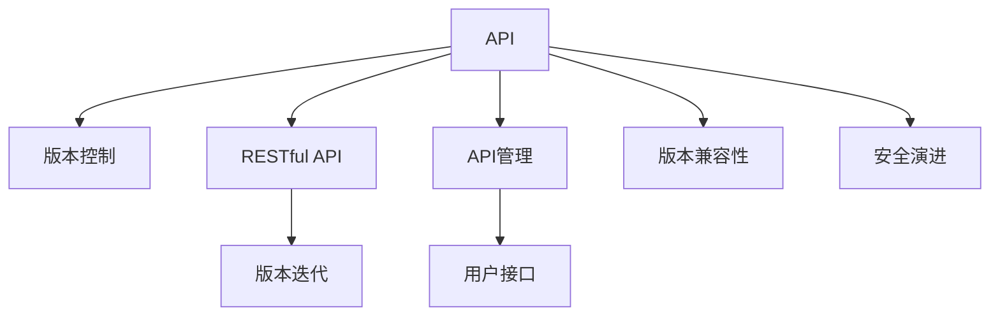

                 

# API 版本控制的基本原则

> 关键词：API, 版本控制, RESTful, REST, 版本迭代, API管理, 用户接口, 版本兼容性, 安全演进

## 1. 背景介绍

### 1.1 问题由来
在当今的软件开发中，API（应用程序接口）的使用越来越普遍。随着系统的复杂度不断增加，API的版本管理变得越来越困难。新的特性需要不断添加到现有API中，但这些改动可能会影响到依赖该API的其他系统和应用。因此，有效的API版本控制显得尤为重要。

### 1.2 问题核心关键点
API版本控制旨在确保在添加新特性时，不会破坏现有API的兼容性，同时保证API的演进能够满足业务需求。好的API版本控制不仅能够提高API的稳定性和可靠性，还能促进系统的持续发展。

### 1.3 问题研究意义
良好的API版本控制能够减少开发和维护成本，提高系统的可扩展性和灵活性，提升用户体验。API的版本控制策略直接影响着API的生命周期和演进路径，是构建高质量API的关键因素。

## 2. 核心概念与联系

### 2.1 核心概念概述

- **API（应用程序接口）**：定义了应用程序之间如何进行交互的规则。API可以是简单的接口，也可以是复杂的协议，它将应用程序的各个部分解耦，使得它们可以独立地进行开发、测试和部署。
- **版本控制**：管理软件或数据集合的变更历史记录，以及记录每次变更的具体内容、作者和日期等。
- **RESTful API**：基于REST（Representational State Transfer）架构风格设计的API，通过HTTP协议进行通信，支持资源的操作（获取、创建、更新、删除）。
- **REST**：一种架构风格，基于资源的表述状态转移，通过HTTP协议定义了系统的架构和接口设计原则。
- **版本迭代**：在API演进过程中，不断添加新功能或改进现有功能的过程。
- **API管理**：集中管理API的生命周期，包括API的创建、发布、监控、更新和废弃等。
- **用户接口**：用户与系统交互的界面，包括Web界面、移动端应用、命令行工具等。
- **版本兼容性**：新版本的API能够与旧版本兼容，避免现有依赖的API被破坏。
- **安全演进**：在API版本迭代过程中，确保API的安全性不断提升，避免安全漏洞被利用。

这些核心概念之间的逻辑关系可以通过以下Mermaid流程图来展示：



这个流程图展示了API版本控制的关键概念及其之间的关系：

1. API通过版本控制进行管理，确保其演进的规范性和可追溯性。
2. RESTful API是API的一种设计风格，遵循REST原则，强调资源和操作的分离。
3. 版本迭代是API演进的基础，通过不断添加新功能和改进现有功能，提高API的实用性。
4. API管理集中管理API的生命周期，保证API的一致性和可用性。
5. 用户接口是API与用户交互的界面，不同的用户接口可以提供不同的交互体验。
6. 版本兼容性确保新版本的API能够与旧版本兼容，避免现有依赖的API被破坏。
7. 安全演进在API版本迭代过程中，确保API的安全性不断提升。

## 3. 核心算法原理 & 具体操作步骤
### 3.1 算法原理概述

API版本控制的核心思想是，在API演进过程中，通过合理的设计和工具，确保新特性与旧版本的兼容性，同时保证API的安全性和可靠性。具体来说，API版本控制遵循以下基本原则：

- **版本命名规范**：为每个API版本分配唯一的版本标识符，便于识别和追溯。
- **版本兼容性**：新版本的API应尽量与旧版本兼容，避免破坏现有依赖。
- **版本演进策略**：基于业务需求和用户反馈，设计合理的API版本迭代策略。
- **版本文档更新**：及时更新API文档，记录每个版本的变更内容，帮助用户理解API的演进历程。
- **版本监控与评估**：通过监控API的使用情况，评估API的性能和安全性，及时发现和解决问题。

### 3.2 算法步骤详解

API版本控制的实施过程包括以下几个关键步骤：

**Step 1: 设计API版本命名规范**
- 确定API版本的基本格式，如`v1`, `v2`, `v3`等。
- 定义版本变更的规则，如版本号增加表示重大变更，增加`-alpha`表示测试版本等。

**Step 2: 设计版本兼容性策略**
- 在添加新特性时，保留旧版本的API接口，确保新特性不会破坏现有依赖。
- 对于无法兼容的变更，提供兼容模式或迁移指南，帮助用户平滑过渡。

**Step 3: 设计版本演进策略**
- 基于业务需求和用户反馈，设计合理的API版本迭代策略。
- 制定API演进的路线图，明确每个版本的目标和变更内容。

**Step 4: 更新API文档**
- 记录每个版本的变更内容，更新API文档。
- 提供变更日志和示例代码，帮助用户快速适应新的API版本。

**Step 5: 监控与评估**
- 通过监控API的使用情况，评估API的性能和安全性。
- 收集用户反馈，根据反馈调整API的演进策略。

**Step 6: 发布与更新**
- 按照预定的策略发布新版本的API。
- 定期发布更新，改进API的性能和安全性。

### 3.3 算法优缺点

API版本控制的优势在于：
- 确保API的演进稳定和可控。
- 减少API变更对现有系统的影响。
- 提高API的兼容性和用户满意度。

然而，API版本控制也存在一些局限性：
- 版本管理复杂，容易增加维护成本。
- 新特性的引入可能会影响API的性能。
- 需要大量的文档维护工作。

### 3.4 算法应用领域

API版本控制在以下领域得到了广泛应用：

- **Web应用**：提供RESTful API，供第三方应用调用。
- **移动应用**：通过API实现后端服务与客户端的交互。
- **企业级应用**：提供标准化的API接口，支持企业内部系统的集成和协作。
- **云服务**：通过API提供云资源的访问和管理功能。
- **物联网**：提供API接口，实现设备之间的通信和数据交换。

## 4. 数学模型和公式 & 详细讲解 & 举例说明

### 4.1 数学模型构建

API版本控制的过程可以通过数学模型进行描述。假设API有$n$个版本，每个版本$i$的API接口有$m_i$个，则整个API系统的接口总数为$M=\sum_{i=1}^n m_i$。设$S_i$表示第$i$个版本的API接口的变更集合，则API系统的总变更集合为$S=\bigcup_{i=1}^n S_i$。

API版本控制的数学模型可以表示为：

$$
M = \sum_{i=1}^n m_i
$$

$$
S = \bigcup_{i=1}^n S_i
$$

### 4.2 公式推导过程

为了简化问题，我们假设API系统只由两个版本组成，即$v1$和$v2$。设$v1$有$m_1$个接口，$v2$有$m_2$个接口。对于接口$i$，如果在新版本中进行了变更，则$S_1$中包含$i$，否则$S_2$中包含$i$。则API系统的总变更集合$S$可以表示为：

$$
S = S_1 \cup S_2
$$

### 4.3 案例分析与讲解

假设某API系统有`user`和`product`两个模块，`user`模块有10个接口，`product`模块有5个接口。在版本$v1$中，所有接口都未变更。在版本$v2$中，新增了`create_user`接口，同时将`get_product`接口的返回值类型从`Product`改为了`NewProduct`。则API系统的总变更集合为：

$$
S = \{create_user\} \cup \{get_product\}
$$

新版本的API接口数为$M=15$，总变更集合$S=\{create_user, get_product\}$。

## 5. 项目实践：代码实例和详细解释说明
### 5.1 开发环境搭建

在进行API版本控制的实践前，我们需要准备好开发环境。以下是使用Python进行Flask开发的环境配置流程：

1. 安装Anaconda：从官网下载并安装Anaconda，用于创建独立的Python环境。

2. 创建并激活虚拟环境：
```bash
conda create -n flask-env python=3.8 
conda activate flask-env
```

3. 安装Flask：
```bash
pip install flask
```

4. 安装Flask-RESTful：
```bash
pip install flask-restful
```

5. 安装Flask-Testing：
```bash
pip install flask-testing
```

完成上述步骤后，即可在`flask-env`环境中开始API版本控制的实践。

### 5.2 源代码详细实现

下面以一个简单的用户信息管理API为例，展示如何使用Flask-RESTful进行API版本控制。

```python
from flask import Flask, jsonify, request
from flask_restful import Api, Resource
import time

app = Flask(__name__)
api = Api(app)

class Version1(Resource):
    def get(self):
        return jsonify({'message': 'Welcome to Version 1'})

    def post(self):
        user_data = request.json
        user_data['timestamp'] = time.time()
        return jsonify(user_data), 201

class Version2(Resource):
    def get(self):
        return jsonify({'message': 'Welcome to Version 2'})

    def post(self):
        user_data = request.json
        user_data['timestamp'] = time.time()
        return jsonify(user_data), 201

api.add_resource(Version1, '/v1')
api.add_resource(Version2, '/v2')
```

在上述代码中，我们定义了两个版本的API接口，`Version1`和`Version2`。这两个接口都提供了获取和创建用户信息的功能，但具体实现不同。`Version1`返回硬编码的消息，`Version2`则将请求中的用户数据加上时间戳后返回。

### 5.3 代码解读与分析

让我们再详细解读一下关键代码的实现细节：

**Flask框架**：
- `Flask`：基于Python的Web应用框架，提供了简单易用的API和路由管理功能。
- `Flask-RESTful`：基于Flask的RESTful API开发框架，简化了RESTful API的开发过程。

**版本资源**：
- `Resource`：Flask-RESTful提供的API资源类，用于封装API接口的实现。
- `get`和`post`方法：分别对应HTTP GET和POST请求的处理。
- `request.json`：用于获取请求中的JSON数据。

**路由定义**：
- `api.add_resource()`：将`Version1`和`Version2`分别绑定到`/v1`和`/v2`路由上，确保每个版本有独立的API接口。

**API响应**：
- `jsonify`：将Python对象转换为JSON格式，返回给客户端。
- `201`：HTTP状态码，表示资源被成功创建。

### 5.4 运行结果展示

启动API服务，访问`http://localhost:5000/v1`和`http://localhost:5000/v2`，可以看到不同的API响应。这证明了API版本控制的成功实现。

```bash
$ flask run
* Running on http://127.0.0.1:5000/ (Press CTRL+C to quit)
```

## 6. 实际应用场景

### 6.1 电商API版本控制

在电商平台上，API版本控制可以确保用户数据的隐私和安全。例如，当平台添加新的支付接口时，需要保证旧版本的支付接口仍然可用，同时提供新版本的兼容模式，帮助用户平滑过渡。

### 6.2 医疗API版本控制

医疗领域的API版本控制需要考虑数据的隐私和安全。例如，当添加新的健康数据接口时，需要确保旧版本的数据接口仍然可用，同时提供数据的加密和匿名化处理，保护用户隐私。

### 6.3 金融API版本控制

金融领域的API版本控制需要考虑交易数据的实时性和准确性。例如，当添加新的交易接口时，需要确保旧版本的数据接口仍然可用，同时提供数据的高频更新和异常处理机制，确保交易数据的实时性和准确性。

### 6.4 未来应用展望

随着API版本控制技术的发展，API的演进将更加灵活和高效。未来API版本控制将朝着以下方向发展：

1. **自动化工具**：开发更加智能化的API版本管理工具，自动检测变更，生成文档和测试用例。
2. **跨平台支持**：支持跨平台API版本控制，兼容多种编程语言和框架。
3. **微服务架构**：在微服务架构中，实现更加细粒度的API版本管理，满足不同的业务需求。
4. **安全性增强**：引入更多的安全机制，如API密钥、限流、防攻击等，确保API的安全性。
5. **性能优化**：优化API的响应速度和吞吐量，提高系统的性能和可用性。
6. **用户体验提升**：提供更加友好的API文档和测试工具，提升开发和测试效率。

这些趋势将使得API版本控制更加高效和可靠，为API的演进提供坚实的技术基础。

## 7. 工具和资源推荐

### 7.1 学习资源推荐

为了帮助开发者系统掌握API版本控制的理论基础和实践技巧，这里推荐一些优质的学习资源：

1. **《RESTful Web APIs》（书籍）**：详细介绍了RESTful API的设计和实现，是理解API版本控制的基础。
2. **《API Design Guide》（书籍）**：提供了API设计的最佳实践，涵盖版本控制、性能优化、安全性等。
3. **《Flask RESTful API Development》（书籍）**：介绍如何使用Flask和Flask-RESTful开发RESTful API，包括版本控制和文档生成等。
4. **《API Evolution: Versioning and Scaling Your APIs》（博客）**：详细介绍了API版本控制的演进策略和实践技巧。
5. **《API Versioning: Best Practices and Examples》（博客）**：提供了API版本控制的常见问题和最佳实践，帮助开发者规避常见错误。

通过对这些资源的学习实践，相信你一定能够快速掌握API版本控制的精髓，并用于解决实际的API问题。

### 7.2 开发工具推荐

高效的开发离不开优秀的工具支持。以下是几款用于API版本控制开发的常用工具：

1. **Postman**：功能强大的API开发和测试工具，支持API的开发、测试和版本管理。
2. **Swagger**：提供API文档生成和自动测试功能，帮助开发者更好地理解和管理API。
3. **Apiary**：提供了API管理平台，支持API的版本控制、文档生成和测试等。
4. **Resty API Management**：基于REST的API管理平台，提供API的版本控制、监控和性能优化等。
5. **RapidAPI**：提供了API的发布和管理平台，支持API的版本控制和监控等。

合理利用这些工具，可以显著提升API版本控制的开发效率，加快创新迭代的步伐。

### 7.3 相关论文推荐

API版本控制在以下领域得到了广泛的研究。以下是几篇奠基性的相关论文，推荐阅读：

1. **《REST API Versioning》（论文）**：详细介绍了REST API的版本控制策略和实现方法。
2. **《API Versioning: A Survey and Systematic Review》（论文）**：综述了API版本控制的研究进展和实际应用。
3. **《Evolution of APIs: Versioning and Scaling Your APIs》（论文）**：介绍了API演进的挑战和解决方案，包括版本控制和安全性等。
4. **《API Versioning: A Comprehensive Survey》（论文）**：综述了API版本控制的最新进展和未来趋势。
5. **《API Versioning Strategies and Techniques》（论文）**：详细介绍了API版本控制的多种策略和技巧，帮助开发者选择合适的方案。

这些论文代表了大语言模型微调技术的发展脉络。通过学习这些前沿成果，可以帮助研究者把握学科前进方向，激发更多的创新灵感。

## 8. 总结：未来发展趋势与挑战

### 8.1 总结

本文对API版本控制的基本原则进行了全面系统的介绍。首先阐述了API版本控制的研究背景和意义，明确了版本控制在API演进中的重要作用。其次，从原理到实践，详细讲解了API版本控制的数学模型和操作步骤，给出了API版本控制的完整代码实现。同时，本文还广泛探讨了API版本控制在电商、医疗、金融等领域的实际应用，展示了API版本控制的广泛应用场景。最后，本文精选了API版本控制的学习资源、开发工具和相关论文，力求为开发者提供全方位的技术指引。

通过本文的系统梳理，可以看到，API版本控制是构建高质量API的关键技术之一。良好的API版本控制能够确保API的稳定性和兼容性，减少API变更对现有系统的影响，提高API的性能和安全性。API的版本控制策略直接影响着API的生命周期和演进路径，是构建高质量API的关键因素。

### 8.2 未来发展趋势

展望未来，API版本控制将呈现以下几个发展趋势：

1. **自动化工具**：开发更加智能化的API版本管理工具，自动检测变更，生成文档和测试用例。
2. **跨平台支持**：支持跨平台API版本控制，兼容多种编程语言和框架。
3. **微服务架构**：在微服务架构中，实现更加细粒度的API版本管理，满足不同的业务需求。
4. **安全性增强**：引入更多的安全机制，如API密钥、限流、防攻击等，确保API的安全性。
5. **性能优化**：优化API的响应速度和吞吐量，提高系统的性能和可用性。
6. **用户体验提升**：提供更加友好的API文档和测试工具，提升开发和测试效率。

这些趋势将使得API版本控制更加高效和可靠，为API的演进提供坚实的技术基础。

### 8.3 面临的挑战

尽管API版本控制技术已经取得了一定的进展，但在迈向更加智能化、普适化应用的过程中，它仍面临着诸多挑战：

1. **版本管理复杂**：随着API数量的增加，版本管理的复杂度不断上升，增加了维护成本。
2. **新特性引入困难**：添加新特性可能会影响现有API的性能，导致兼容性和稳定性问题。
3. **文档维护工作量大**：每次API版本变更都需要更新文档，增加了文档维护的复杂度和工作量。
4. **安全性难以保障**：API版本控制过程中，需要引入更多的安全机制，防止API被滥用。
5. **性能优化难度大**：API版本控制需要考虑多个版本的同时存在，优化性能难度较大。

### 8.4 研究展望

面对API版本控制所面临的挑战，未来的研究需要在以下几个方面寻求新的突破：

1. **引入自动化工具**：开发更加智能化的API版本管理工具，自动检测变更，生成文档和测试用例。
2. **跨平台支持**：支持跨平台API版本控制，兼容多种编程语言和框架。
3. **微服务架构**：在微服务架构中，实现更加细粒度的API版本管理，满足不同的业务需求。
4. **安全性增强**：引入更多的安全机制，如API密钥、限流、防攻击等，确保API的安全性。
5. **性能优化**：优化API的响应速度和吞吐量，提高系统的性能和可用性。
6. **用户体验提升**：提供更加友好的API文档和测试工具，提升开发和测试效率。

这些研究方向将使得API版本控制更加高效和可靠，为API的演进提供坚实的技术基础。

## 9. 附录：常见问题与解答

**Q1：API版本控制是否适用于所有API？**

A: API版本控制适用于绝大多数API，包括RESTful API、GraphQL API等。然而，对于某些实时性要求极高的API，如IoT设备的API，版本控制的复杂度可能较高。

**Q2：如何设计合理的API版本迭代策略？**

A: 设计合理的API版本迭代策略需要考虑业务需求、用户反馈、技术可行性等因素。建议定期召开团队会议，讨论API变更的优先级和影响范围，制定详细的变更计划。

**Q3：API版本控制是否影响API的性能？**

A: 合理的API版本控制不会影响API的性能。然而，如果API的版本变更频繁且管理不当，可能会导致性能下降。建议在API变更前进行性能测试，确保变更不会影响API的性能。

**Q4：API版本控制的实施过程中需要注意哪些问题？**

A: 实施API版本控制需要注意以下问题：
1. 版本命名规范：为每个API版本分配唯一的版本标识符，便于识别和追溯。
2. 版本兼容性：确保新版本的API能够与旧版本兼容，避免破坏现有依赖。
3. 版本文档更新：及时更新API文档，记录每个版本的变更内容，帮助用户理解API的演进历程。
4. 版本监控与评估：通过监控API的使用情况，评估API的性能和安全性，及时发现和解决问题。

通过合理设计和实施API版本控制，可以确保API的稳定性和兼容性，减少API变更对现有系统的影响，提高API的性能和安全性。

---

作者：禅与计算机程序设计艺术 / Zen and the Art of Computer Programming

