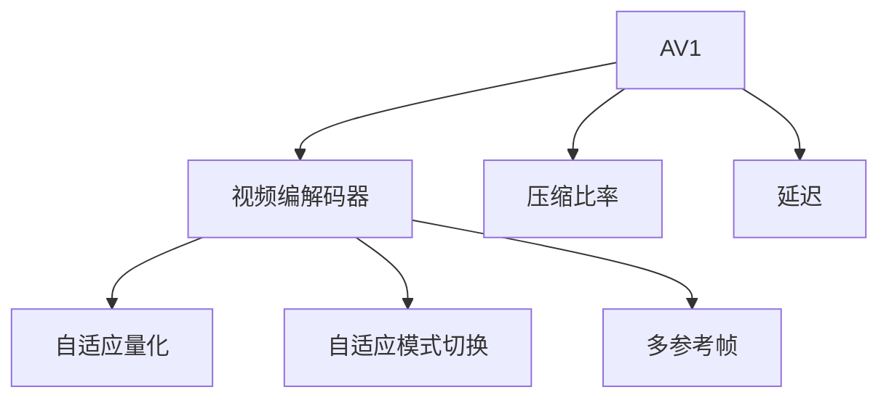

                 

# AV1 编码器：开放媒体联盟

在数字化视频时代，高效率、低延迟、高质量的压缩技术成为了视频行业的重要基础。AV1作为开放媒体联盟（Alliance for Open Media, AOM）推出的免费、开放、无专利的视频压缩标准，凭借其卓越的性能和高效的编码方案，正在逐渐成为视频压缩的主流选择。本文将详细解析 AV1 编码器的核心概念、算法原理、操作步骤、应用场景及其未来发展趋势。

## 1. 背景介绍

### 1.1 问题由来
随着视频内容的海量增加和设备带宽的不断提升，视频编解码的需求也越来越高。传统的高效率视频编码标准，如H.264、H.265（HEVC）等，虽然性能出色，但往往需要支付高昂的专利授权费用，限制了其在更多应用场景的使用。

与此同时，谷歌等科技巨头都在积极探索新一代的视频压缩技术。2015年，谷歌提出了一种全新的视频编解码器——AV1，并将其开放给公众使用，逐渐受到了业界的广泛关注和认可。如今，AV1已经成为视频压缩领域的后起之秀，展示了开放媒体联盟的巨大潜力。

### 1.2 问题核心关键点
AV1 编码器作为一种开放的视频压缩标准，采用了自由、开放的开发模式，能够在无专利费用负担的前提下，提供高效的压缩方案。其关键优势包括：

- 高效的压缩比率：与H.265（HEVC）相比，AV1在低延时、中等码率下的压缩效果更佳。
- 优秀的编码效率：通过自适应量化、自适应模式切换等技术，显著提升了编码效率。
- 低延迟特性：支持多参考帧编码，灵活调节编码顺序，满足实时视频传输需求。
- 灵活的码率控制：支持自适应码率控制，可适应不同带宽和分辨率的流媒体传输。
- 开放标准：无专利费用，更适合于低成本的应用场景，推动了开源视频生态的发展。

这些特点使得AV1在视频编解码领域逐渐崭露头角，吸引了全球多家大公司和机构的支持和应用。

## 2. 核心概念与联系

### 2.1 核心概念概述

为更好理解 AV1 编码器的原理和架构，本节将介绍几个关键概念：

- AV1：开放媒体联盟推出的一种免费、开放的视频压缩标准。
- 视频编解码器：将视频信号转化为可存储、传输的数据流，并实现解码还原的视频设备。
- 压缩比率（Compression Ratio）：指压缩前后数据量的比值，即压缩效率。
- 延迟（Latency）：指从视频输入到输出的时间延迟。
- 自适应量化（Adaptive Quantization）：根据视频内容自适应调整量化参数，优化压缩效果。
- 自适应模式切换（Adaptive Mode Switching）：根据视频特点动态选择编码模式，提升编码效率。
- 多参考帧（Multiple Reference Frames）：通过使用多帧参考，降低压缩帧率，减少视频延迟。

这些概念之间的逻辑关系可以通过以下 Mermaid 流程图来展示：



此流程图展示了 AV1 编码器与视频编解码器之间的联系及其核心功能。

## 3. 核心算法原理 & 具体操作步骤
### 3.1 算法原理概述

AV1 编码器采用了基于“活动块”（Tile）和“分支编码”（Branching Encoding）的编解码框架。其核心原理可以概括为以下几个步骤：

1. **预处理**：对原始视频进行分帧、去噪、滤波等预处理，保证视频质量。
2. **编码单元划分**：将视频帧划分为若干编码单元（Tile），每个编码单元内包含若干活动块。
3. **活动块编码**：对每个活动块进行分块编码，提取帧内预测、帧间预测、变换编码等多种编码模式。
4. **多参考帧选择**：根据编码效率和延迟需求，选择多帧参考，进行运动估计和预测。
5. **量化与熵编码**：对编码后的数据进行量化和熵编码，降低数据量。
6. **后处理**：对压缩后的数据进行去块处理、滤波等后处理，优化压缩效果。

### 3.2 算法步骤详解

#### 3.2.1 预处理
预处理阶段的主要任务是对原始视频进行预处理，保证视频质量。预处理过程通常包括以下步骤：

1. **分帧**：将视频信号按照指定帧率分割成一系列帧图像。
2. **去噪**：对每个帧图像进行降噪处理，去除图像中的噪声干扰。
3. **滤波**：使用滤波算法对图像进行平滑处理，减少图像失真和噪点。
4. **插值**：对于分辨率不等的帧图像，进行空间插值，保证图像一致性。

#### 3.2.2 编码单元划分
编码单元划分阶段将每个视频帧划分为若干编码单元（Tile），每个编码单元内包含若干活动块。活动块是视频压缩的基本单位，每个活动块由像素数据和预测信息组成。编码单元划分过程一般包括以下步骤：

1. **划分大小**：根据视频分辨率和编码要求，确定编码单元的大小。
2. **划分子块**：将每个编码单元划分为若干大小相等或不等的小块，称为活动块。
3. **块编码**：对每个活动块进行分块编码，提取帧内预测、帧间预测、变换编码等多种编码模式。

#### 3.2.3 活动块编码
活动块编码阶段通过提取和压缩每个活动块的预测信息，实现视频压缩。活动块编码过程一般包括以下步骤：

1. **帧内预测**：对每个活动块进行帧内预测，估计当前块的像素值。
2. **帧间预测**：根据参考帧信息，对当前块进行帧间预测，估计当前块的像素值。
3. **变换编码**：对预测差值进行离散余弦变换（DCT）或离散小波变换（DWT），降低预测误差。
4. **量化**：对变换后的系数进行量化，降低数据精度。
5. **熵编码**：对量化后的系数进行熵编码，如霍夫曼编码、算术编码等，进一步降低数据量。

#### 3.2.4 多参考帧选择
多参考帧选择阶段通过灵活选择多帧参考，进行运动估计和预测，降低延迟和压缩帧率。多参考帧选择过程一般包括以下步骤：

1. **参考帧选择**：根据编码效率和延迟需求，选择多帧参考，降低延迟。
2. **运动估计**：对参考帧和当前帧进行运动估计，计算帧间预测的误差。
3. **预测编码**：根据运动估计结果，对当前块进行预测编码，生成预测差值。

#### 3.2.5 量化与熵编码
量化与熵编码阶段对编码后的数据进行量化和熵编码，降低数据量。量化与熵编码过程一般包括以下步骤：

1. **量化参数选择**：根据视频内容自适应调整量化参数，优化压缩效果。
2. **量化变换**：对变换后的系数进行量化，降低数据精度。
3. **熵编码**：对量化后的系数进行熵编码，如霍夫曼编码、算术编码等，进一步降低数据量。

#### 3.2.6 后处理
后处理阶段对压缩后的数据进行去块处理、滤波等后处理，优化压缩效果。后处理过程一般包括以下步骤：

1. **去块处理**：对压缩后的数据进行去块处理，减少块效应。
2. **滤波**：使用滤波算法对压缩后的数据进行滤波，减少噪声和失真。
3. **解码前的处理**：对压缩数据进行必要的预处理，准备解码。

### 3.3 算法优缺点

AV1 编码器作为一种新兴的视频压缩标准，具有以下优点：

- 无专利费用：AV1是一种开放的视频压缩标准，无需支付高昂的专利费用，降低使用成本。
- 高效压缩：AV1采用先进的自适应量化、自适应模式切换等技术，显著提高了压缩效率。
- 低延迟：支持多参考帧编码，灵活调节编码顺序，满足实时视频传输需求。
- 灵活码率控制：支持自适应码率控制，适应不同带宽和分辨率的流媒体传输。
- 兼容性好：兼容现有主流视频格式，如H.264、H.265（HEVC），方便过渡和升级。

同时，AV1 编码器也存在一些局限性：

- 编码复杂度高：AV1 编码器采用了多参考帧、自适应量化等复杂算法，编码计算量较大。
- 资源需求高：AV1 编码器需要较大的内存和计算资源，特别是对于高分辨率、高码率的视频编码。
- 开源生态尚未成熟：相比于H.264、H.265，AV1 的生态系统仍不成熟，需要更多企业和开发者支持。

### 3.4 算法应用领域

AV1 编码器作为一种高效的视频压缩标准，广泛应用于各种视频传输和存储场景。主要应用领域包括：

- 流媒体平台：如YouTube、Netflix、Amazon Prime Video等，提供高质量的视频服务。
- 数字电视：如IPTV、OTT TV等，支持高清晰度视频的传输和存储。
- 移动设备：如智能手机、平板电脑等，支持实时视频传输和存储。
- 物联网设备：如智能相机、智能家居设备等，提供高效率的视频压缩和传输。
- 工业监控：如工厂监控、安防监控等，提供实时、低延迟的视频传输。

## 4. 数学模型和公式 & 详细讲解

### 4.1 数学模型构建

AV1 编码器采用了复杂的数学模型，主要包括以下几个部分：

1. **分块编码**：将每个活动块划分为若干小小块，进行分块编码，提取帧内预测、帧间预测、变换编码等多种编码模式。
2. **运动估计**：通过多参考帧选择和帧间预测，计算帧间预测的误差，生成预测差值。
3. **量化和熵编码**：对变换后的系数进行量化和熵编码，降低数据量。

### 4.2 公式推导过程

#### 4.2.1 分块编码

AV1 的分块编码过程涉及多种编码模式，包括帧内预测、帧间预测、变换编码等。以帧内预测为例，其基本原理为：

1. **预测帧**：对当前块进行帧内预测，生成预测帧。
2. **预测差值**：计算预测帧与当前块的差异，生成预测差值。
3. **变换编码**：对预测差值进行离散余弦变换（DCT），生成变换系数。
4. **量化**：对变换系数进行量化，降低数据精度。
5. **熵编码**：对量化后的系数进行熵编码，如霍夫曼编码、算术编码等，进一步降低数据量。

其中，预测帧的生成过程可以表示为：

$$
\hat{y} = f(x, k)
$$

其中 $x$ 为当前块像素值，$k$ 为预测参数，$f$ 为预测函数。预测差值的计算过程可以表示为：

$$
d = y - \hat{y}
$$

其中 $y$ 为当前块像素值，$\hat{y}$ 为预测帧像素值。变换编码的过程可以表示为：

$$
z = D(d)
$$

其中 $D$ 为离散余弦变换函数，$z$ 为变换系数。量化过程可以表示为：

$$
q = Q(z, \lambda)
$$

其中 $Q$ 为量化函数，$\lambda$ 为量化参数。熵编码过程可以表示为：

$$
e = E(q)
$$

其中 $E$ 为熵编码函数，$e$ 为编码后的数据。

#### 4.2.2 运动估计

运动估计过程通常包括以下步骤：

1. **参考帧选择**：根据编码效率和延迟需求，选择多帧参考。
2. **像素匹配**：对参考帧和当前帧进行像素匹配，计算像素间的差异。
3. **运动向量计算**：根据像素匹配结果，计算运动向量。
4. **预测差值生成**：根据运动向量，生成预测差值。

其中，像素匹配过程可以表示为：

$$
s(x_i, y_i) = \sum_{j=0}^{n-1} (x_j - y_j)^2
$$

其中 $s$ 为像素匹配函数，$x_i$ 为当前帧像素值，$y_i$ 为参考帧像素值，$n$ 为像素数。运动向量计算过程可以表示为：

$$
mv = S(s(x_i, y_i))
$$

其中 $mv$ 为运动向量，$S$ 为运动向量函数。预测差值生成过程可以表示为：

$$
d = y - mv
$$

其中 $y$ 为当前帧像素值，$mv$ 为运动向量。

#### 4.2.3 量化和熵编码

量化和熵编码过程涉及多种量化方法和熵编码方法。以霍夫曼编码为例，其基本原理为：

1. **量化**：对变换系数进行量化，生成量化后的数据。
2. **编码表生成**：根据量化后的数据，生成编码表。
3. **霍夫曼编码**：根据编码表，进行霍夫曼编码，生成编码后的数据。

其中，量化过程可以表示为：

$$
q = Q(z, \lambda)
$$

其中 $Q$ 为量化函数，$\lambda$ 为量化参数，$z$ 为变换系数。编码表生成过程可以表示为：

$$
T = T(z, q)
$$

其中 $T$ 为编码表生成函数，$z$ 为变换系数，$q$ 为量化后的数据。霍夫曼编码过程可以表示为：

$$
e = H(T)
$$

其中 $H$ 为霍夫曼编码函数，$T$ 为编码表。

### 4.3 案例分析与讲解

为了更好地理解 AV1 编码器的应用，本节将以一个简单的视频压缩案例进行分析讲解。

假设我们要对一段 720p 分辨率的视频进行 AV1 编码。视频帧率为 30fps，每帧包含 1280x720 像素。我们首先对视频进行分帧、去噪、滤波等预处理，保证视频质量。然后，将每帧划分为若干编码单元（Tile），每个编码单元内包含若干活动块。

接下来，对每个活动块进行分块编码，提取帧内预测、帧间预测、变换编码等多种编码模式。假设当前块采用帧内预测，生成预测帧，并计算预测差值。然后，对预测差值进行离散余弦变换（DCT），生成变换系数。接着，对变换系数进行量化，生成量化后的数据。最后，对量化后的数据进行霍夫曼编码，生成编码后的数据。

这样，我们就完成了对当前块的压缩。重复上述过程，对每个活动块进行编码，生成压缩后的数据。最后，对压缩后的数据进行去块处理、滤波等后处理，优化压缩效果，生成最终的压缩视频。

## 5. 项目实践：代码实例和详细解释说明

### 5.1 开发环境搭建

在开始实践之前，我们需要准备好开发环境。以下是使用 Python 进行 AV1 编码的开发环境配置流程：

1. 安装 Python：从官网下载并安装 Python，建议选择最新版本。
2. 安装 PyAV：使用 pip 安装 PyAV，这是一个基于 FFmpeg 库的 Python 视频处理库，支持多种视频编解码器，包括 AV1。
3. 安装 FFmpeg：从官网下载并安装 FFmpeg，这是一个开源的视频编解码器，支持多种视频格式，包括 AV1。
4. 设置环境变量：将 Python 和 PyAV 的路径添加到系统环境变量中，确保程序能够正常运行。

### 5.2 源代码详细实现

下面我们以 AV1 编码为例，给出使用 PyAV 进行 AV1 编码的 Python 代码实现。

首先，我们需要安装 PyAV 库：

```bash
pip install pyav
```

然后，定义一个简单的 Python 程序，实现 AV1 编码：

```python
from av import open, FFmpegFormatContext
import sys

if __name__ == '__main__':
    input_file = sys.argv[1]
    output_file = sys.argv[2]
    
    # 打开输入视频文件
    input_format_context = open(input_file, 'r', format='avformat')
    # 获取视频格式信息
    video_format_context = FFmpegFormatContext(input_format_context)
    # 获取视频流信息
    video_stream = video_format_context.streams.video[0]
    
    # 打开输出视频文件
    output_format_context = FFmpegFormatContext(output_file, format='avformat')
    # 添加视频流
    video_stream = output_format_context.add_stream(video_stream)
    # 设置视频编码器为 AV1
    video_stream.codec = 'avc1.64001E'
    
    # 编码视频
    input_format_context.seek(0)
    output_format_context.seek(0)
    while True:
        # 读取视频帧
        frame = input_format_context.read_frame()
        if frame is None:
            break
        # 输出视频帧
        output_format_context.write_frame(frame)
    
    # 关闭输入和输出文件
    input_format_context.close()
    output_format_context.close()
```

运行上述代码，即可对输入视频文件进行 AV1 编码，生成压缩后的 AV1 视频文件。

### 5.3 代码解读与分析

让我们再详细解读一下关键代码的实现细节：

**Open 函数**：
- 打开视频文件，返回一个格式上下文对象。
- 在 Python 中使用 PyAV 的 open 函数打开视频文件，获取格式上下文对象。

**FFmpegFormatContext**：
- 获取视频格式信息。
- 使用 PyAV 的 FFmpegFormatContext 类获取视频格式信息。

**VideoFormatContext**：
- 获取视频流信息。
- 使用 PyAV 的 VideoFormatContext 类获取视频流信息。

**Stream 类**：
- 添加视频流。
- 使用 PyAV 的 Stream 类添加视频流。

**VideoStream 类**：
- 设置视频编码器为 AV1。
- 使用 PyAV 的 VideoStream 类设置视频编码器为 AV1。

**ReadFrame 函数**：
- 读取视频帧。
- 使用 PyAV 的 ReadFrame 函数读取视频帧。

**WriteFrame 函数**：
- 输出视频帧。
- 使用 PyAV 的 WriteFrame 函数输出视频帧。

**Close 函数**：
- 关闭输入和输出文件。
- 使用 PyAV 的 Close 函数关闭输入和输出文件。

可以看到，使用 PyAV 进行 AV1 编码非常简单。开发者只需对视频格式上下文和流上下文进行基本操作，即可完成视频压缩。当然，在实际应用中，还需要考虑更多的细节，如输入输出文件的路径、视频流的信息、编码参数等。

## 6. 实际应用场景

### 6.1 智能视频监控
智能视频监控领域对实时性、低延迟、高压缩比率的要求很高。AV1 编码器支持多参考帧编码，灵活调节编码顺序，能够满足实时视频传输需求，非常适合应用于智能视频监控场景。

### 6.2 流媒体平台
流媒体平台如 YouTube、Netflix、Amazon Prime Video 等，需要高效压缩大量视频文件，同时保持较低的延迟。AV1 编码器的高效率和低延迟特性，能够满足这些需求，广泛应用于流媒体平台的视频压缩。

### 6.3 数字电视
数字电视如 IPTV、OTT TV 等，需要支持高清晰度视频的传输和存储。AV1 编码器支持高分辨率视频的编码，能够提供高质量的视频服务，非常适合应用于数字电视。

### 6.4 移动设备
移动设备如智能手机、平板电脑等，需要支持实时视频传输和存储。AV1 编码器的低延迟特性，能够满足这些需求，广泛应用于移动设备的视频压缩。

### 6.5 物联网设备
物联网设备如智能相机、智能家居设备等，需要支持高效率的视频压缩和传输。AV1 编码器的低延迟和高效压缩特性，能够满足这些需求，广泛应用于物联网设备。

## 7. 工具和资源推荐

### 7.1 学习资源推荐

为了帮助开发者系统掌握 AV1 编码器的理论和实践，这里推荐一些优质的学习资源：

1. AV1 官方文档：AOM 提供的官方文档，详细介绍了 AV1 编码器的原理、编码流程和应用场景。
2. FFmpeg 官方文档：FFmpeg 提供的官方文档，介绍了如何使用 FFmpeg 进行 AV1 编码。
3. PyAV 官方文档：PyAV 提供的官方文档，介绍了如何使用 PyAV 进行 AV1 编码。
4. 《AV1 编码器技术详解》书籍：详细讲解了 AV1 编码器的原理、编码流程和应用场景，适合深入学习。
5. AOM 社区论坛：AOM 社区提供的论坛，可以快速获取 AV1 编码器的最新进展和应用案例。

通过对这些资源的学习实践，相信你一定能够快速掌握 AV1 编码器的精髓，并用于解决实际的编码问题。

### 7.2 开发工具推荐

高效的开发离不开优秀的工具支持。以下是几款用于 AV1 编码的常用工具：

1. FFmpeg：开源的视频编解码器，支持多种视频格式，包括 AV1。
2. PyAV：基于 FFmpeg 库的 Python 视频处理库，支持多种视频编解码器，包括 AV1。
3. FFmpegStudio：FFmpeg 的图形化界面，方便进行视频编码、解码、编辑等操作。
4. VLC：开源的媒体播放器，支持多种视频格式，包括 AV1。
5. Handbrake：开源的视频编辑器，支持多种视频格式，包括 AV1。

合理利用这些工具，可以显著提升 AV1 编码的开发效率，加快创新迭代的步伐。

### 7.3 相关论文推荐

AV1 编码器的研究起源于 AOM 的长期努力，其核心技术早在 2012 年就已经提出。以下是几篇奠基性的相关论文，推荐阅读：

1. AVC vs. AV1: Experimental Results on Rate-Distortion Performance and CPU Efficiency（《AVC与AV1：在码率和失真性能和CPU效率上的实验结果》）：详细对比了 AVC、AV1 的性能，分析了 AV1 的优势。
2. AV1 Codec Design and Architecture（《AV1 编解码器设计及架构》）：介绍了 AV1 编码器的设计思想和架构原理，适合深入学习。
3. AV1 Codec: High Efficiency Video Coding for AV1 1.0.0（《AV1 编解码器：AV1 1.0.0 的高效视频编解码》）：详细介绍了 AV1 编解码器的实现过程和应用场景，适合实际应用。
4. AV1 vs. HEVC: Rate-Distortion Performance and Compatibility （《AV1与HEVC：码率和失真性能及兼容性》）：详细对比了 AV1、HEVC 的性能，分析了 AV1 的优势。

这些论文代表了大语言模型微调技术的发展脉络。通过学习这些前沿成果，可以帮助研究者把握学科前进方向，激发更多的创新灵感。

## 8. 总结：未来发展趋势与挑战

### 8.1 总结

本文对 AV1 编码器的核心概念、算法原理、操作步骤、应用场景及其未来发展趋势进行了全面系统的介绍。首先，阐述了 AV1 编码器的研究背景和意义，明确了其在视频编解码领域的重要地位。其次，从原理到实践，详细讲解了 AV1 编码器的数学模型和实现流程，给出了代码实例和详细解释。同时，本文还广泛探讨了 AV1 编码器在智能视频监控、流媒体平台、数字电视、移动设备等多个领域的应用前景，展示了其强大的性能优势。此外，本文精选了 AV1 编码器的各类学习资源，力求为读者提供全方位的技术指引。

通过本文的系统梳理，可以看到，AV1 编码器作为一种开放、高效的视频压缩标准，正在逐步成为视频编解码领域的新主流。其卓越的压缩效率和低延迟特性，有望推动视频压缩技术的进一步发展，助力视频行业实现智能化、数字化转型。

### 8.2 未来发展趋势

展望未来，AV1 编码器将呈现以下几个发展趋势：

1. 压缩比率进一步提升：随着编码算法和硬件设备的不断进步，AV1 的压缩比率还将进一步提升，提供更高的压缩效率。
2. 低延迟特性更优：支持更灵活的编码顺序和帧内预测，进一步降低视频延迟。
3. 灵活码率控制：支持更多自适应码率控制策略，适应不同带宽和分辨率的流媒体传输。
4. 更多硬件支持：随着 AV1 生态系统的不断完善，更多硬件设备将支持 AV1 编解码，推动 AV1 在更多场景中的应用。
5. 开源生态逐步成熟：更多的企业和开发者将参与 AV1 的开发和应用，推动 AV1 生态系统的逐步成熟。

以上趋势凸显了 AV1 编码器的广阔前景。这些方向的探索发展，必将进一步提升 AV1 编解码的性能和应用范围，为视频行业带来新的发展机遇。

### 8.3 面临的挑战

尽管 AV1 编码器已经取得了显著的成就，但在其广泛应用的过程中，仍面临以下挑战：

1. 编码复杂度高：AV1 编码器采用了多参考帧、自适应量化等复杂算法，编码计算量较大，硬件资源需求高。
2. 开源生态尚未成熟：相比于 H.264、H.265，AV1 的生态系统仍不成熟，需要更多企业和开发者支持。
3. 兼容性问题：AV1 编码器与现有主流视频格式（如 H.264、H.265）的兼容性仍需进一步提升。
4. 标准化问题：AV1 编码器作为开放标准，需要在更多国家、地区获得标准化支持，才能得到广泛应用。
5. 软件优化问题：现有的 AV1 编解码软件（如 FFmpeg、PyAV）仍需进一步优化，提升编码效率和解码速度。

这些挑战需要 AOM 社区、开发者和用户共同努力，才能逐步克服，推动 AV1 编码器在全球范围内的普及和应用。

### 8.4 研究展望

面对 AV1 编码器所面临的挑战，未来的研究需要在以下几个方面寻求新的突破：

1. 降低编码复杂度：开发更高效、更简洁的编码算法，降低编码计算量，提升编码效率。
2. 提升生态系统：吸引更多企业和开发者参与 AV1 的开发和应用，完善 AV1 的生态系统，推动 AV1 的普及。
3. 优化兼容性：提升 AV1 与现有主流视频格式的兼容性，支持更多的视频格式和设备。
4. 推动标准化：在更多国家、地区获得 AV1 编码器的标准化支持，促进 AV1 的全球应用。
5. 软件优化：优化现有的 AV1 编解码软件，提升编码效率和解码速度。

这些研究方向将引领 AV1 编码器迈向更高的台阶，为视频编解码领域带来新的突破，推动视频行业实现智能化、数字化转型。

## 9. 附录：常见问题与解答

**Q1：AV1 编码器有哪些优势？**

A: AV1 编码器具有以下优势：

- 无专利费用：AV1 是一种开放的视频压缩标准，无需支付高昂的专利费用，降低使用成本。
- 高效压缩：AV1 采用先进的自适应量化、自适应模式切换等技术，显著提高了压缩效率。
- 低延迟：支持多参考帧编码，灵活调节编码顺序，满足实时视频传输需求。
- 灵活码率控制：支持自适应码率控制，适应不同带宽和分辨率的流媒体传输。

**Q2：AV1 编码器的编码复杂度如何？**

A: AV1 编码器采用了多参考帧、自适应量化等复杂算法，编码计算量较大。硬件资源需求高，特别是对于高分辨率、高码率的视频编码。

**Q3：AV1 编码器与 H.265 相比，谁的性能更好？**

A: AV1 编码器在低延时、中等码率下的压缩效果优于 H.265（HEVC）。但 H.265 在高清视频编码方面仍然具有优势，AV1 在处理高分辨率视频时可能需要更高的计算资源。

**Q4：AV1 编码器的开源生态如何？**

A: AV1 的生态系统仍在发展过程中，相比于 H.264、H.265，AV1 的生态系统仍不成熟，需要更多企业和开发者支持。

**Q5：AV1 编码器有哪些实际应用场景？**

A: AV1 编码器广泛应用于智能视频监控、流媒体平台、数字电视、移动设备、物联网设备等多个领域，提供高效、低延迟的视频压缩服务。

---

作者：禅与计算机程序设计艺术 / Zen and the Art of Computer Programming

