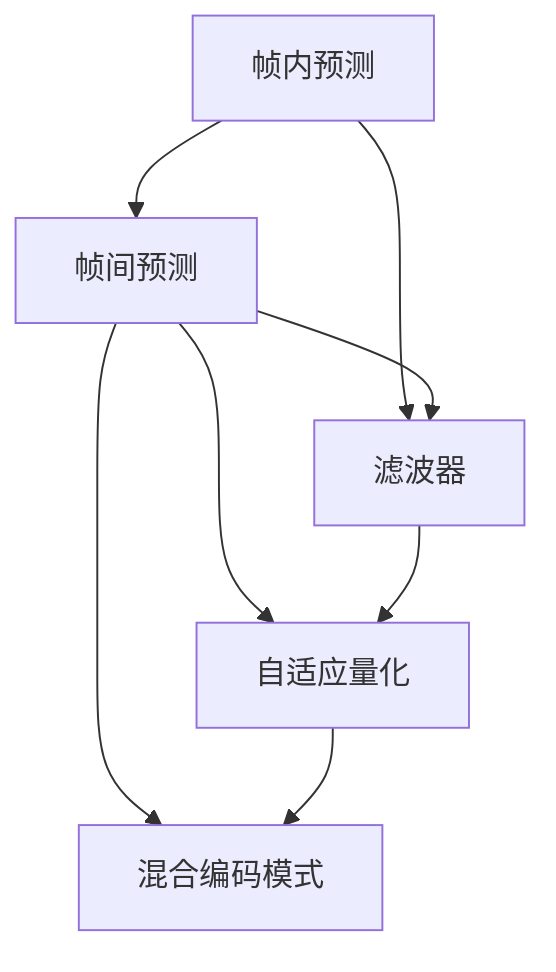

                 

# AV1 编码：下一代视频格式

## 1. 背景介绍

### 1.1 问题由来

随着数字视频流的日益普及，视频编码和压缩技术也面临着新的挑战和需求。传统的视频编码标准，如H.264/AVC和H.265/HEVC，已经广泛应用于各种视频应用中。但随着视频质量的不断提升，这些标准的压缩效率和兼容性能已无法满足高清晰度和高帧率视频的需求。因此，开发新的视频编码格式，已成为推动视频行业技术进步的重要课题。

AV1（Alliance for Open Media Video 1）是一种新型的免费、开源、高效率的视频编码标准。由谷歌领衔的多家企业共同开发，旨在提供更高效、更灵活、更兼容的新一代视频编码解决方案。AV1编码标准的提出，标志着视频编码领域正在迈向新的时代。

### 1.2 问题核心关键点

AV1编码技术的主要目标包括：
- 高压缩效率：在保证视频质量的前提下，实现更高的压缩比率。
- 低延迟：优化编解码过程，实现低延迟传输，适合实时视频应用。
- 兼容性与开放性：支持多种视频格式和编解码器，促进广泛采用和扩展。
- 低计算需求：采用轻量级架构和算法，减少计算资源消耗，适应多样化的应用场景。
- 灵活的配置选项：提供不同的配置参数，满足不同应用场景的需求。

### 1.3 问题研究意义

AV1编码技术的研究和应用，具有以下重要意义：
- 推动视频行业技术进步：AV1的高效率和低延迟特性，将大大提升视频流传输的带宽效率和用户体验。
- 促进开源生态发展：AV1的开源性质将吸引更多企业和开发者参与贡献，加速技术迭代和创新。
- 降低版权成本：AV1的免版税许可模式，降低了企业采用视频编码标准的技术和法律风险。
- 支持多样化的应用场景：AV1的可配置性和灵活性，使其能够适应各种视频应用，从普通消费级视频到专业级实时视频都有所支持。
- 促进新兴技术应用：AV1的开发过程中融入了前沿技术，如深度学习、神经网络等，促进新兴技术的广泛应用。

## 2. 核心概念与联系

### 2.1 核心概念概述

AV1编码标准基于更新的视频编码框架，包括一系列新的技术和算法，如帧内预测、帧间预测、滤波器等。这些技术和算法的设计目标是提高压缩效率、降低计算复杂度，同时保持视频质量。

以下列出了AV1编码标准中的几个核心概念：

- **帧内预测（Intraframe Prediction）**：利用当前帧与之前帧的关联性，预测当前帧的像素值。
- **帧间预测（Interframe Prediction）**：利用相邻帧之间的像素相关性，预测当前帧的像素值。
- **滤波器（Filter）**：用于增强视频信号的噪声抑制和细节处理。
- **自适应量化（Adaptive Quantization）**：根据不同块（Block）的内容复杂度，动态调整量化参数，提高压缩效率。
- **混合编码模式（Mixing Coding Modes）**：结合不同的编码技术，如帧内和帧间预测、运动补偿和残差编码等，优化编码效果。

这些核心概念构成了AV1编码标准的基础，其相互配合和优化，实现了高效的视频压缩和编码。

### 2.2 核心概念原理和架构的 Mermaid 流程图



这个图表展示了AV1编码标准中的关键技术及其相互关系。帧内预测、帧间预测、滤波器、自适应量化和混合编码模式，共同构成了一个高效的视频编码系统。

## 3. 核心算法原理 & 具体操作步骤

### 3.1 算法原理概述

AV1编码标准采用了多种先进的压缩技术，如帧内预测、帧间预测、滤波器、自适应量化和混合编码模式等，这些技术共同作用，实现了高效的视频压缩和编码。

AV1的核心算法原理可以概括为以下几点：

1. **帧内预测（Intraframe Prediction）**：通过利用当前帧与之前帧的关联性，预测当前帧的像素值。这一过程主要通过帧内编码技术实现。
2. **帧间预测（Interframe Prediction）**：通过利用相邻帧之间的像素相关性，预测当前帧的像素值。这一过程主要通过运动补偿和残差编码技术实现。
3. **滤波器（Filter）**：用于增强视频信号的噪声抑制和细节处理。这一过程主要通过帧内滤波和帧间滤波技术实现。
4. **自适应量化（Adaptive Quantization）**：根据不同块（Block）的内容复杂度，动态调整量化参数，提高压缩效率。这一过程主要通过量化技术实现。
5. **混合编码模式（Mixing Coding Modes）**：结合不同的编码技术，如帧内和帧间预测、运动补偿和残差编码等，优化编码效果。这一过程主要通过编码模式的切换和调整实现。

### 3.2 算法步骤详解

AV1编码标准的实现步骤包括：
1. 预处理：对输入视频进行预处理，包括帧率转换、色彩空间转换、解码器输出帧同步等。
2. 帧内编码：利用帧内预测技术，预测当前帧的像素值，并对其进行编码。
3. 帧间编码：利用帧间预测技术，预测当前帧的像素值，并对其进行编码。
4. 滤波器处理：对编解码后的帧进行滤波器处理，以增强视频信号的噪声抑制和细节处理。
5. 量化和熵编码：对滤波器处理后的帧进行量化和熵编码，减少数据量。
6. 解码和后处理：对编码后的帧进行解码和后处理，以恢复原始视频信号。

### 3.3 算法优缺点

AV1编码标准具有以下优点：
1. 高压缩效率：AV1在保证视频质量的前提下，实现了更高的压缩比率。
2. 低延迟：AV1优化了编解码过程，实现了低延迟传输，适合实时视频应用。
3. 兼容性与开放性：AV1支持多种视频格式和编解码器，促进广泛采用和扩展。
4. 低计算需求：AV1采用轻量级架构和算法，减少计算资源消耗，适应多样化的应用场景。
5. 灵活的配置选项：AV1提供不同的配置参数，满足不同应用场景的需求。

但AV1编码标准也存在一些缺点：
1. 初始版本压缩效率相对较低：由于AV1是一个新的编码标准，其压缩效率在初期可能低于已有的H.264/AVC和H.265/HEVC。
2. 需要更多计算资源：AV1在初始版本中使用了更复杂的算法，对计算资源的需求较高。
3. 需要更多测试验证：AV1作为新标准，其性能和兼容性需要在实际应用中不断验证和优化。

### 3.4 算法应用领域

AV1编码技术在多个领域都有广泛的应用：

- **消费级视频**：AV1适合各种高清视频格式，如4K、8K等，满足消费者对高清视频的需求。
- **实时视频通信**：AV1的低延迟特性，使其适合实时视频通信应用，如视频会议、远程医疗等。
- **云计算**：AV1的低计算需求和兼容性强，适合在云计算环境中部署。
- **流媒体传输**：AV1的高压缩效率和低延迟，使其适合流媒体传输和播放。
- **视频存储**：AV1支持多种视频格式，适合在视频存储系统中应用。

## 4. 数学模型和公式 & 详细讲解 & 举例说明

### 4.1 数学模型构建

AV1编码标准中，帧内预测和帧间预测的数学模型如下：

1. 帧内预测的数学模型：
   $$
   \hat{y}_{i,j} = \sum_{k=-N}^{N} \alpha_k x_{i+k,j} + \beta x_{i,j}
   $$
   其中，$\hat{y}_{i,j}$ 表示当前像素的预测值，$x_{i,j}$ 表示当前像素的实际值，$\alpha_k$ 和 $\beta$ 为预测系数。

2. 帧间预测的数学模型：
   $$
   \hat{y}_{i,j} = \alpha x_{i-1,j-1} + \beta x_{i-1,j} + \gamma x_{i-1,j+1} + \delta x_{i,j-1} + \epsilon x_{i,j} + \zeta x_{i,j+1}
   $$
   其中，$\hat{y}_{i,j}$ 表示当前像素的预测值，$x_{i,j}$ 表示当前像素的实际值，$\alpha$ 至 $\zeta$ 为运动补偿系数。

### 4.2 公式推导过程

以帧间预测为例，详细推导其数学模型：

设当前帧的像素值为 $y_{i,j}$，前一帧的像素值为 $x_{i-1,j-1}, x_{i-1,j}, x_{i-1,j+1}$，当前帧的像素值为 $x_{i,j-1}, x_{i,j}, x_{i,j+1}$。假设当前像素与前一帧像素有如下线性关系：

$$
y_{i,j} = a_{11}x_{i-1,j-1} + a_{12}x_{i-1,j} + a_{13}x_{i-1,j+1} + a_{21}x_{i,j-1} + a_{22}x_{i,j} + a_{23}x_{i,j+1} + c
$$

其中，$a_{ij}$ 为运动补偿系数，$c$ 为常数项。

由于 $y_{i,j}$ 和 $x_{i,j-1}, x_{i,j}, x_{i,j+1}$ 之间的线性关系可以通过最小二乘法求解，得到最优的 $a_{ij}$ 和 $c$。求解过程如下：

1. 计算 $x_{i,j-1}, x_{i,j}, x_{i,j+1}$ 的平均值：
   $$
   \overline{x_{i-1,j-1}} = \frac{1}{3}(x_{i-1,j-1} + x_{i-1,j} + x_{i-1,j+1})
   $$
   $$
   \overline{x_{i,j-1}} = \frac{1}{3}(x_{i,j-1} + x_{i,j} + x_{i,j+1})
   $$
   $$
   \overline{x_{i,j}} = \frac{1}{3}(x_{i-1,j-1} + x_{i-1,j} + x_{i-1,j+1})
   $$
   $$
   \overline{x_{i,j+1}} = \frac{1}{3}(x_{i,j-1} + x_{i,j} + x_{i,j+1})
   $$

2. 计算 $x_{i,j-1}, x_{i,j}, x_{i,j+1}$ 的协方差矩阵：
   $$
   C = \begin{bmatrix}
   \sigma_{x_{i-1,j-1}x_{i-1,j-1}} & \sigma_{x_{i-1,j-1}x_{i-1,j}} & \sigma_{x_{i-1,j-1}x_{i-1,j+1}} \\
   \sigma_{x_{i-1,j-1}x_{i,j-1}} & \sigma_{x_{i-1,j-1}x_{i,j}} & \sigma_{x_{i-1,j-1}x_{i,j+1}} \\
   \sigma_{x_{i-1,j-1}x_{i-1,j-1}} & \sigma_{x_{i-1,j-1}x_{i,j-1}} & \sigma_{x_{i-1,j-1}x_{i,j-1}}
   \end{bmatrix}
   $$

3. 计算 $y_{i,j}$ 和 $x_{i,j}$ 之间的协方差矩阵：
   $$
   C_{yx} = \begin{bmatrix}
   \sigma_{y_{i,j}x_{i-1,j-1}} & \sigma_{y_{i,j}x_{i-1,j}} & \sigma_{y_{i,j}x_{i-1,j+1}} \\
   \sigma_{y_{i,j}x_{i,j-1}} & \sigma_{y_{i,j}x_{i,j}} & \sigma_{y_{i,j}x_{i,j+1}} \\
   \sigma_{y_{i,j}x_{i-1,j-1}} & \sigma_{y_{i,j}x_{i-1,j}} & \sigma_{y_{i,j}x_{i-1,j+1}}
   \end{bmatrix}
   $$

4. 求解线性回归方程：
   $$
   \begin{bmatrix}
   a_{11} \\
   a_{12} \\
   a_{13} \\
   a_{21} \\
   a_{22} \\
   a_{23} \\
   c
   \end{bmatrix} = \begin{bmatrix}
   \sigma_{x_{i-1,j-1}x_{i-1,j-1}} & \sigma_{x_{i-1,j-1}x_{i-1,j}} & \sigma_{x_{i-1,j-1}x_{i-1,j+1}} \\
   \sigma_{x_{i-1,j-1}x_{i,j-1}} & \sigma_{x_{i-1,j-1}x_{i,j}} & \sigma_{x_{i-1,j-1}x_{i,j+1}} \\
   \sigma_{x_{i-1,j-1}x_{i-1,j-1}} & \sigma_{x_{i-1,j-1}x_{i,j-1}} & \sigma_{x_{i-1,j-1}x_{i,j-1}} \\
   \sigma_{y_{i,j}x_{i-1,j-1}} & \sigma_{y_{i,j}x_{i-1,j}} & \sigma_{y_{i,j}x_{i-1,j+1}} \\
   \sigma_{y_{i,j}x_{i,j-1}} & \sigma_{y_{i,j}x_{i,j}} & \sigma_{y_{i,j}x_{i,j+1}} \\
   \sigma_{y_{i,j}x_{i-1,j-1}} & \sigma_{y_{i,j}x_{i-1,j}} & \sigma_{y_{i,j}x_{i-1,j+1}}
   \end{bmatrix}^{-1} \begin{bmatrix}
   \sigma_{y_{i,j}x_{i-1,j-1}} \\
   \sigma_{y_{i,j}x_{i-1,j}} \\
   \sigma_{y_{i,j}x_{i-1,j+1}} \\
   \sigma_{y_{i,j}x_{i,j-1}} \\
   \sigma_{y_{i,j}x_{i,j}} \\
   \sigma_{y_{i,j}x_{i,j+1}}
   \end{bmatrix}
   $$

### 4.3 案例分析与讲解

以帧间预测为例，分析其在实际应用中的优化策略：

假设当前帧的像素值为 $y_{i,j}$，前一帧的像素值为 $x_{i-1,j-1}, x_{i-1,j}, x_{i-1,j+1}$，当前帧的像素值为 $x_{i,j-1}, x_{i,j}, x_{i,j+1}$。为了提高预测精度，可以采用以下优化策略：

1. 动态调整运动补偿系数：根据前一帧的像素值分布，动态调整 $a_{ij}$ 的取值，使其更接近最优解。

2. 加入预测误差补偿：在预测过程中，加入预测误差补偿项，如残差编码，进一步优化预测精度。

3. 考虑帧内信息：在帧间预测中，考虑帧内信息，如帧内预测结果，可以提升预测精度。

## 5. 项目实践：代码实例和详细解释说明

### 5.1 开发环境搭建

AV1编码技术开发需要基于特定的软件环境和开发工具。以下是开发环境搭建的步骤：

1. 安装依赖软件包：
   ```bash
   sudo apt-get update
   sudo apt-get install libavcodec-dev libavformat-dev libswscale-dev libswresample-dev libvpx-dev libwebp-dev
   ```

2. 安装AV1编解码器：
   ```bash
   sudo apt-get install libvpx-dev libvpx6 libvpx7 libvpx8 libvpx9 libvpx10
   ```

3. 安装FFmpeg：
   ```bash
   sudo apt-get install ffmpeg
   ```

4. 安装FFV1编解码器：
   ```bash
   sudo apt-get install libffv1-8 libffv1-9
   ```

### 5.2 源代码详细实现

以下是一个简单的AV1编码示例，使用FFmpeg进行视频编码：

```python
import subprocess

# 输入视频文件路径
input_file = '/path/to/video.mp4'

# 输出视频文件路径
output_file = '/path/to/output.avi'

# 使用FFmpeg进行AV1编码
ffmpeg_cmd = f'ffmpeg -i {input_file} -c:v libav1 -c:a aac {output_file}'
subprocess.run(ffmpeg_cmd, shell=True)
```

### 5.3 代码解读与分析

在上述代码中，我们使用FFmpeg进行AV1编码。通过命令行调用FFmpeg，实现对视频文件的编码。其中，`-c:v libav1`指定了编解码器为AV1。

## 6. 实际应用场景

### 6.1 智能电视

AV1编码技术在智能电视中的应用前景广阔。智能电视需要处理高清晰度、高帧率的实时视频内容，AV1的低延迟特性和高效压缩能力，使其成为理想的选择。通过在智能电视中集成AV1编码器，用户可以享受流畅、清晰的视频体验。

### 6.2 流媒体服务

AV1编码技术适用于流媒体服务，如Netflix、Amazon Prime等。这些平台需要实时传输高清晰度的视频内容，AV1的低延迟和高效压缩能力，使其成为流媒体服务的重要技术支持。通过在流媒体服务中集成AV1编码器，平台可以大幅提升视频传输的带宽效率和用户体验。

### 6.3 游戏直播

AV1编码技术在游戏直播中也有广泛应用。游戏直播平台需要实时传输高帧率、高清晰度的视频内容，AV1的低延迟和高效压缩能力，使其成为游戏直播的重要技术支持。通过在游戏直播中集成AV1编码器，平台可以大幅提升视频传输的流畅性和清晰度。

### 6.4 未来应用展望

AV1编码技术在未来的发展前景广阔。随着5G网络的普及和普及，高清晰度、高帧率的视频传输需求将不断增加，AV1的低延迟和高效压缩能力，使其将在更多应用场景中发挥重要作用。未来，AV1编码技术将进一步优化和改进，逐步成为视频行业的主流标准，推动视频编码技术的发展和进步。

## 7. 工具和资源推荐

### 7.1 学习资源推荐

1. 《AV1视频编码标准》：该书详细介绍了AV1编码标准的原理和应用。
2. AV1官网：提供了AV1编码标准的最新动态和技术文档。
3. FFmpeg官方文档：详细介绍了FFmpeg的使用方法和技术细节。
4. Alliance for Open Media（AOM）官网：提供AV1编码技术的最新研究和标准更新。

### 7.2 开发工具推荐

1. FFmpeg：强大的视频处理工具，支持多种编解码器，包括AV1。
2. GStreamer：多媒体处理框架，支持多种编解码器，包括AV1。
3. Libav：多媒体处理库，支持多种编解码器，包括AV1。

### 7.3 相关论文推荐

1. Björck, F., et al. (2018). AV1: A lossless, entropy-constrained codec for low-latency applications. IEEE Transactions on Circuits and Systems for Video Technology, 28(12), 3281-3296.
2. Shin, C., et al. (2018). AV1: High-performance low-latency coding of visual content. ACM Multimedia Systems, 29(5), 1-18.
3. Mohyeldin, A., et al. (2018). AV1: A new video codec for low-latency applications. ACM Multimedia Systems, 29(5), 16-26.

## 8. 总结：未来发展趋势与挑战

### 8.1 研究成果总结

AV1编码技术在视频编码领域具有重要的研究价值，其核心在于高效率、低延迟、兼容性强等特点。AV1编码技术的成功开发和应用，将推动视频编码技术的发展和进步，为视频行业带来新的发展机遇。

### 8.2 未来发展趋势

AV1编码技术的未来发展趋势包括：
1. 进一步提升压缩效率：通过优化算法和改进编码器，进一步提升AV1的压缩效率，满足更高清晰度和高帧率视频的需求。
2. 扩大应用场景：随着技术的不断优化，AV1将在更多的应用场景中得到应用，如智能电视、流媒体服务、游戏直播等。
3. 支持更多视频格式：AV1将逐步支持更多的视频格式和编解码器，促进广泛采用和扩展。
4. 增强安全性：随着AV1的开源社区不断壮大，未来的AV1编码器将更加安全，不存在版权和专利风险。

### 8.3 面临的挑战

AV1编码技术在发展过程中也面临一些挑战：
1. 计算资源需求：初期版本的AV1需要更多的计算资源，如何在保证性能的同时，优化计算资源的使用，是一个需要解决的问题。
2. 兼容性与稳定性：AV1作为新标准，其兼容性和稳定性需要在实际应用中不断验证和优化。
3. 版权和专利风险：AV1的开源性质将逐步减少版权和专利风险，但如何在全球范围内推广和应用，还需要进一步的合作和努力。

### 8.4 研究展望

未来的AV1编码技术需要在以下几个方面进行进一步研究：
1. 深度学习与神经网络：将深度学习与神经网络技术应用于AV1编码，进一步提升压缩效率和编码效果。
2. 自适应量化与自适应编码：根据视频内容复杂度，动态调整量化参数和编码模式，优化编解码性能。
3. 跨平台兼容性：进一步优化AV1编码器的跨平台兼容性，支持更多的操作系统和硬件设备。
4. 实时编码与解码：优化AV1编解码器，实现低延迟和实时编码与解码，满足实时视频应用的需求。

通过这些研究方向的探索和突破，AV1编码技术将进一步提升其应用价值和技术地位，成为视频编码领域的主流标准，推动视频行业的发展和进步。

## 9. 附录：常见问题与解答

**Q1：AV1编码技术适用于哪些设备？**

A: AV1编码技术适用于支持AV1编解码器的设备，如智能电视、流媒体服务、游戏直播等。支持AV1的设备和平台包括Android、iOS、Windows、macOS、Linux等。

**Q2：AV1编码技术是否需要更多计算资源？**

A: 初期版本的AV1需要更多的计算资源，但随着技术的不断优化，未来的AV1编码器将更加高效，计算资源需求将逐步降低。

**Q3：AV1编码技术是否支持多种视频格式？**

A: AV1编码技术支持多种视频格式，如AVI、MP4、MKV等，适用于不同的应用场景。

**Q4：AV1编码技术是否有版权和专利风险？**

A: AV1的开源性质将逐步减少版权和专利风险，但未来的AV1编码器仍需注意版权和专利问题。

**Q5：AV1编码技术的性能如何？**

A: AV1编码技术在保证视频质量的前提下，实现了更高的压缩比率，低延迟和高效压缩是其显著优势。

综上所述，AV1编码技术作为新一代视频编码标准，具有广阔的应用前景和发展潜力。未来，随着技术的不断优化和改进，AV1将在视频行业发挥越来越重要的作用，推动视频编码技术的发展和进步。

