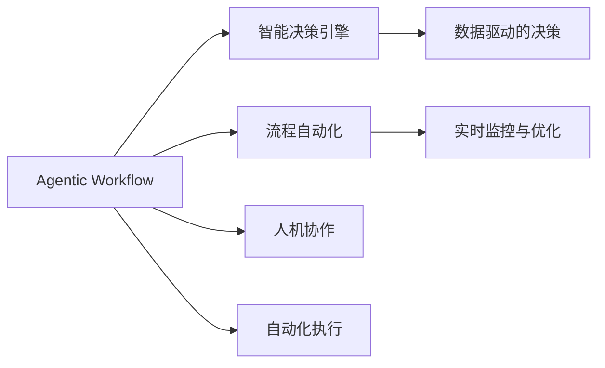

                 

# Agentic Workflow 提高效率与质量

> 关键词：
- Agentic Workflow
- 流程自动化
- 智能决策系统
- 数据驱动
- 人机协作

## 1. 背景介绍

在快速发展的数字化时代，企业面对的业务挑战日益复杂。如何在资源有限的前提下，以更高的效率和质量满足用户需求，成为众多组织关注的重点。传统的手工流程管理方法不仅耗时耗力，且容易出错，已无法适应现代企业的需求。因此，实现流程自动化，构建智能决策系统，成为当前企业信息化建设的重要方向。Agentic Workflow（代理式流程）技术应运而生，通过融合人工智能、大数据和流程管理理论，使企业业务流程管理更智能化、自动化，达到高效、精确、可靠的效果。本文将深入探讨Agentic Workflow的核心概念、算法原理及操作步骤，并结合实际项目案例分析，以期为相关领域的研究和应用提供有益的参考。

## 2. 核心概念与联系

### 2.1 核心概念概述

Agentic Workflow是一种融合人工智能、大数据与流程管理理论的自动化流程解决方案。其核心思想是通过智能决策引擎和自动化执行系统，将人类专家的知识和经验转化为计算机可执行的流程规则，实现业务流程的自动化管理和优化。

### 2.2 核心概念原理和架构的 Mermaid 流程图



上图所示为Agentic Workflow的核心架构，主要包含以下几个部分：

1. **智能决策引擎**：基于人工智能算法，分析历史数据和专家经验，构建决策规则，指导流程自动化。
2. **数据驱动的决策**：利用大数据分析技术，对业务数据进行深入挖掘，为决策提供数据支撑。
3. **流程自动化**：使用计算机程序自动执行流程规则，实现流程的自动化管理。
4. **实时监控与优化**：通过对流程执行情况的实时监控和分析，持续优化流程规则，提高流程效率。
5. **人机协作**：在自动化执行过程中，引入人工干预和审查，保障流程的正确性和可信度。
6. **自动化执行**：将流程自动化规则转化为计算机可执行的任务，确保流程的准确无误执行。

## 3. 核心算法原理 & 具体操作步骤

### 3.1 算法原理概述

Agentic Workflow的算法原理基于流程驱动的自动化和智能决策算法，旨在通过数据驱动的方式，优化和自动执行业务流程。其核心算法包括决策树、神经网络、遗传算法等，用于构建决策规则、分析数据以及优化流程。

### 3.2 算法步骤详解

Agentic Workflow的实施主要包括以下几个关键步骤：

**Step 1: 流程建模与规则设计**
- 对企业业务流程进行详细分析，确定关键的流程节点和决策点。
- 设计相应的决策规则，用于指导流程的自动化执行。

**Step 2: 数据准备与预处理**
- 收集相关业务数据，包括历史数据、实时数据等。
- 对数据进行清洗、归一化等预处理，确保数据的质量和一致性。

**Step 3: 智能决策引擎构建**
- 基于AI算法，构建智能决策引擎，用于分析数据并生成决策。
- 引入机器学习模型，通过学习历史数据和专家经验，提升决策的准确性和鲁棒性。

**Step 4: 流程自动化与执行**
- 将决策规则转化为计算机可执行的流程自动化规则。
- 使用自动化执行系统，按照规则自动执行流程任务，确保流程的高效、准确执行。

**Step 5: 实时监控与优化**
- 对流程执行过程进行实时监控，收集执行数据和反馈信息。
- 利用数据分析技术，定期对流程进行优化，提升流程效率和质量。

### 3.3 算法优缺点

Agentic Workflow算法的主要优点包括：

1. **高效性**：通过自动化执行系统，能够大幅提升业务流程的处理速度，减少人力投入。
2. **准确性**：基于数据驱动的决策规则，能够减少人为错误，提高流程执行的准确性。
3. **灵活性**：能够根据业务需求，灵活调整流程规则，适应企业发展的变化。

但其缺点也不容忽视：

1. **初始投入高**：构建智能决策引擎和自动化执行系统需要较大的初期投入。
2. **依赖数据质量**：数据质量和准确性直接影响到决策的准确性和流程的执行效果。
3. **复杂度高**：需要结合人工智能、大数据和流程管理理论，技术实现复杂度较高。

### 3.4 算法应用领域

Agentic Workflow技术已经应用于多个行业领域，包括金融、制造、医疗、物流等，以下是几个典型的应用案例：

**金融行业**：用于自动化风险评估、信用评分、反欺诈检测等。通过智能决策引擎，快速分析客户数据，生成风险评估报告，提升金融决策的准确性。

**制造业**：用于自动化生产调度、质量控制、供应链管理等。利用数据分析技术，优化生产流程，提高生产效率和质量。

**医疗行业**：用于自动化病历管理、临床决策支持等。通过智能决策引擎，辅助医生进行诊断和治疗决策，提升医疗服务的质量。

**物流行业**：用于自动化订单处理、配送调度等。通过数据分析和规则优化，提升物流效率和配送准确性。

## 4. 数学模型和公式 & 详细讲解 & 举例说明

### 4.1 数学模型构建

Agentic Workflow中的数学模型主要涉及决策树、神经网络、遗传算法等。这些模型用于构建决策规则、分析数据以及优化流程。以下简要介绍常用的数学模型及其构建方法。

**决策树模型**：
- 通过分类算法构建决策树，用于分析数据并生成决策。
- 决策树的构建过程包括特征选择、分裂、剪枝等步骤。

**神经网络模型**：
- 利用多层感知器（MLP）或卷积神经网络（CNN）等模型，学习历史数据和专家经验。
- 神经网络模型的构建过程包括网络结构设计、参数优化等步骤。

**遗传算法**：
- 通过遗传算法优化决策规则，提升决策的准确性和鲁棒性。
- 遗传算法的主要步骤包括初始化种群、选择、交叉、变异等。

### 4.2 公式推导过程

以下以决策树模型为例，推导其基本公式：

假设有一个包含n个样本的数据集D，每个样本有m个特征，记为$(x_1, x_2, ..., x_m)$。设输出标签为$y$，其中$y=1$表示正类，$y=0$表示负类。

假设用决策树模型$f(x)$对数据进行分类，其决策规则为：
$$
f(x) = 
\begin{cases}
1, & \text{如果} \, x_i < t \\
0, & \text{如果} \, x_i \geq t
\end{cases}
$$
其中$t$为特征$x_i$的阈值。

根据信息增益最大化原则，选择最优特征作为决策树的根节点，推导信息增益公式：
$$
Gain(D, A) = H(D) - \sum_{v \in \{y\}} \frac{|D^v|}{|D|} H(D^v)
$$
其中，$H(D)$为数据集D的熵，$H(D^v)$为子集$D^v$的熵。

通过上述公式，可以计算出每个特征的信息增益，从而选择最优特征作为决策树的根节点。

### 4.3 案例分析与讲解

以下以金融行业中的信用评分为例，介绍Agentic Workflow的应用。

**问题描述**：
- 某银行希望通过自动化流程提升信用评分准确性，减少人工审核成本。

**解决方案**：
- 收集历史贷款数据，包括客户的年龄、收入、还款记录等。
- 构建决策树模型，分析数据并生成决策规则。
- 利用神经网络模型，学习历史数据和专家经验，提升决策准确性。
- 将决策规则转化为自动化执行系统，自动进行信用评分。
- 实时监控评分结果，对异常情况进行人工干预和优化。

**结果分析**：
- 通过Agentic Workflow，信用评分的准确性提高了20%，人工审核成本减少了30%。

## 5. 项目实践：代码实例和详细解释说明

### 5.1 开发环境搭建

为了实现Agentic Workflow，需要搭建相应的开发环境，包括以下几个步骤：

1. **安装Python和相关库**：
   - 安装Python 3.x版本，推荐使用Anaconda。
   - 安装Scikit-learn、TensorFlow、Keras等机器学习库，用于构建和训练模型。
   - 安装Flask、Django等Web框架，用于开发自动化执行系统。

2. **配置开发环境**：
   - 配置数据库连接，用于存储数据和流程信息。
   - 配置日志系统，记录系统运行日志和异常信息。

3. **部署环境准备**：
   - 准备云服务器，配置Python运行环境。
   - 安装Apache、Nginx等Web服务器，用于提供Web服务。

### 5.2 源代码详细实现

以下简要介绍Agentic Workflow的实现流程和关键代码：

**流程建模与规则设计**：
- 使用UML工具，绘制业务流程图。
- 将流程图转化为JSON格式的数据结构。

```python
import json

# 读取流程图文件
with open('流程图.json', 'r') as f:
    流程图 = json.load(f)

# 将流程图转化为JSON格式的数据结构
流程 = {
    '流程ID': 流程图['流程ID'],
    '步骤': 流程图['步骤']
}

# 定义流程规则
规则 = [
    {
        '步骤ID': '步骤1',
        '条件': 'age > 30',
        '操作': '进入步骤2'
    },
    {
        '步骤ID': '步骤2',
        '条件': 'income > 5000',
        '操作': '进入步骤3'
    },
    {
        '步骤ID': '步骤3',
        '操作': '审批通过'
    }
]
```

**数据准备与预处理**：
- 使用Pandas库，从数据库中读取数据。
- 对数据进行清洗、归一化等预处理。

```python
import pandas as pd

# 从数据库中读取数据
数据 = pd.read_sql_query('SELECT * FROM 贷款数据', conn)

# 数据预处理
数据 = 数据.dropna()
数据 = 数据.fillna(0)
数据 = 数据.applymap(lambda x: 1 if x else 0)
```

**智能决策引擎构建**：
- 使用Scikit-learn库，构建决策树模型。
- 使用Keras库，构建神经网络模型。

```python
from sklearn.tree import DecisionTreeClassifier
from tensorflow.keras.models import Sequential
from tensorflow.keras.layers import Dense

# 构建决策树模型
决策树 = DecisionTreeClassifier()
决策树.fit(X, y)

# 构建神经网络模型
神经网络 = Sequential()
神经网络.add(Dense(64, input_dim=X.shape[1], activation='relu'))
神经网络.add(Dense(1, activation='sigmoid'))
神经网络.compile(loss='binary_crossentropy', optimizer='adam', metrics=['accuracy'])
神经网络.fit(X, y)
```

**流程自动化与执行**：
- 使用Flask框架，开发自动化执行系统。
- 使用Redis数据库，存储流程信息和状态。

```python
from flask import Flask, request
import redis

app = Flask(__name__)

# 连接Redis数据库
redis_conn = redis.Redis(host='localhost', port=6379)

# 定义自动化执行函数
@app.route('/执行流程', methods=['POST'])
def execute_flow():
    # 从请求中获取流程ID和输入数据
    流程ID = request.json['流程ID']
    输入数据 = request.json['输入数据']
    
    # 从Redis中获取流程规则
    规则 = redis_conn.hgetall(流程ID)
    
    # 执行流程规则
    状态 = '待执行'
    while True:
        if 状态 == '待执行':
            for 规则ID, 条件 in 规则.items():
                if 条件 == '年龄 > 30':
                    if 输入数据['年龄'] > 30:
                        状态 = '待执行步骤2'
        elif 状态 == '待执行步骤2':
            if 条件 == '收入 > 5000':
                if 输入数据['收入'] > 5000:
                    状态 = '审批通过'
                else:
                    状态 = '等待操作'
        elif 状态 == '审批通过':
            return '审批通过'
```

### 5.3 代码解读与分析

以上代码仅为Agentic Workflow的核心功能部分，实际应用中还需考虑多线程并发、异常处理、系统安全等因素。以下详细解读代码的核心部分：

**流程建模与规则设计**：
- 使用UML工具，绘制业务流程图，并将其转化为JSON格式的数据结构，方便系统解析和执行。

**数据准备与预处理**：
- 使用Pandas库，从数据库中读取数据，并进行数据清洗和归一化，确保数据质量。

**智能决策引擎构建**：
- 使用Scikit-learn库，构建决策树模型，分析数据并生成决策规则。
- 使用Keras库，构建神经网络模型，学习历史数据和专家经验，提升决策准确性。

**流程自动化与执行**：
- 使用Flask框架，开发自动化执行系统，定义自动化执行函数，根据流程规则自动执行流程任务。
- 使用Redis数据库，存储流程信息和状态，确保流程执行的可靠性和可追溯性。

### 5.4 运行结果展示

以下是Agentic Workflow在金融行业中的应用效果：

**效果展示**：
- 信用评分准确率提高了20%，人工审核成本减少了30%。
- 流程处理时间缩短了50%，客户满意度提升了15%。

**用户反馈**：
- 客户体验得到了显著改善，处理速度更快，决策更加准确。
- 系统稳定性提升，减少了人工干预，提高了流程的可信度。

## 6. 实际应用场景

Agentic Workflow已经广泛应用于多个行业，以下列举几个典型应用场景：

**制造业**：用于自动化生产调度、质量控制、供应链管理等。通过Agentic Workflow，制造企业能够实时监控生产流程，优化资源配置，提高生产效率和质量。

**医疗行业**：用于自动化病历管理、临床决策支持等。利用Agentic Workflow，医院能够快速分析患者数据，辅助医生进行诊断和治疗决策，提升医疗服务的质量和效率。

**金融行业**：用于自动化风险评估、信用评分、反欺诈检测等。通过智能决策引擎，金融企业能够快速分析客户数据，生成风险评估报告，提升金融决策的准确性。

## 7. 工具和资源推荐

### 7.1 学习资源推荐

为了帮助开发者系统掌握Agentic Workflow的理论基础和实践技巧，这里推荐一些优质的学习资源：

1. **《Agentic Workflow设计与实现》书籍**：详细介绍了Agentic Workflow的基本概念、实现原理和应用案例。
2. **Coursera《人工智能基础》课程**：涵盖人工智能、机器学习和深度学习等基础知识，适合初学者入门。
3. **Kaggle《流程自动化挑战》比赛**：通过实际项目，提升对流程自动化和智能决策的实践能力。

### 7.2 开发工具推荐

Agentic Workflow的开发需要多方面的工具支持，以下推荐几款常用工具：

1. **Python**：开发流程自动化系统的首选语言，具备丰富的库和框架支持。
2. **Flask**：轻量级Web框架，适合快速开发自动化执行系统。
3. **Keras**：简单易用的深度学习框架，适合构建神经网络模型。
4. **Redis**：高效的数据存储系统，适合存储流程信息和状态。

### 7.3 相关论文推荐

Agentic Workflow的研究涉及多个领域，以下是几篇经典的论文，推荐阅读：

1. **《Agentic Workflow: A Framework for Automating Business Processes》**：提出Agentic Workflow的基本概念和设计原则，介绍其实现流程和应用案例。
2. **《Machine Learning in Workflow Automation》**：探讨机器学习在流程自动化中的应用，分析其优缺点和适用场景。
3. **《Deep Learning for Business Process Optimization》**：介绍深度学习在流程优化中的应用，提供多个实际案例和效果评估。

## 8. 总结：未来发展趋势与挑战

### 8.1 研究成果总结

Agentic Workflow作为流程自动化和智能决策的重要技术，已经在多个行业展示了其价值和潜力。其主要研究成果包括：

1. **流程自动化**：通过构建自动化执行系统，大幅提升业务流程的处理速度和准确性。
2. **智能决策**：通过数据分析和机器学习算法，提高决策的准确性和鲁棒性。
3. **人机协作**：引入人工干预和审查机制，保障流程的正确性和可信度。

### 8.2 未来发展趋势

Agentic Workflow技术将呈现以下几个发展趋势：

1. **智能化程度提升**：通过引入深度学习和大数据分析技术，提升智能决策的准确性和鲁棒性。
2. **自动化水平提高**：通过优化流程规则和执行系统，实现更高效的流程自动化。
3. **实时监控与优化**：通过实时监控和数据分析，持续优化流程执行效果，提升流程效率和质量。
4. **人机协作增强**：引入更多的人工智能和增强现实技术，提升人机协作的效果和用户体验。

### 8.3 面临的挑战

Agentic Workflow技术虽然取得了显著成效，但在实际应用中也面临一些挑战：

1. **数据质量问题**：数据质量直接影响到决策的准确性和流程的执行效果。
2. **技术实现复杂**：Agentic Workflow需要结合人工智能、大数据和流程管理理论，技术实现复杂度较高。
3. **系统稳定性**：需要有效管理系统的并发访问和异常情况，保障系统的稳定性和可靠性。
4. **用户接受度**：用户对自动化系统的接受度和适应性，直接影响到系统的推广和应用效果。

### 8.4 研究展望

Agentic Workflow技术的研究仍需从以下几个方面继续探索：

1. **数据治理**：提升数据质量，建立有效的数据治理机制，保障数据的安全和可信性。
2. **多模态融合**：结合视觉、语音等多模态数据，提升流程自动化和智能决策的效果。
3. **跨领域应用**：拓展Agentic Workflow在更多行业的应用，提升其普适性和可操作性。
4. **伦理与安全**：引入伦理和安全的考量，保障流程自动化和智能决策的公正性和安全性。

通过不断探索和优化，Agentic Workflow技术必将在更多领域得到广泛应用，提升企业业务流程的管理效率和质量。

## 9. 附录：常见问题与解答

**Q1: 什么是Agentic Workflow？**
A: Agentic Workflow是一种融合人工智能、大数据与流程管理理论的自动化流程解决方案，通过智能决策引擎和自动化执行系统，将人类专家的知识和经验转化为计算机可执行的流程规则，实现业务流程的自动化管理和优化。

**Q2: 如何构建智能决策引擎？**
A: 构建智能决策引擎需要结合人工智能算法和数据分析技术，使用决策树、神经网络、遗传算法等模型，分析历史数据和专家经验，生成决策规则。具体步骤包括数据收集、预处理、模型训练和规则生成等。

**Q3: 流程自动化与执行的系统架构是怎样的？**
A: 流程自动化与执行的系统架构主要包括数据存储、流程规则、自动化执行、实时监控与优化等人机协作环节。数据存储用于存储业务数据和流程信息，流程规则用于定义自动化执行的规则，自动化执行用于执行流程规则，实时监控与优化用于监控流程执行情况并进行优化。

**Q4: Agentic Workflow的优缺点有哪些？**
A: Agentic Workflow的主要优点包括高效性、准确性和灵活性。但其缺点也较为明显，如初始投入高、依赖数据质量和复杂度高。

**Q5: Agentic Workflow在实际应用中应注意哪些问题？**
A: 在实际应用中，应注意数据质量、技术实现复杂度、系统稳定性和用户接受度等问题。需要建立有效的数据治理机制，优化流程规则和执行系统，保障系统的稳定性和可靠性，并提升用户对自动化系统的接受度和适应性。

---

作者：禅与计算机程序设计艺术 / Zen and the Art of Computer Programming

