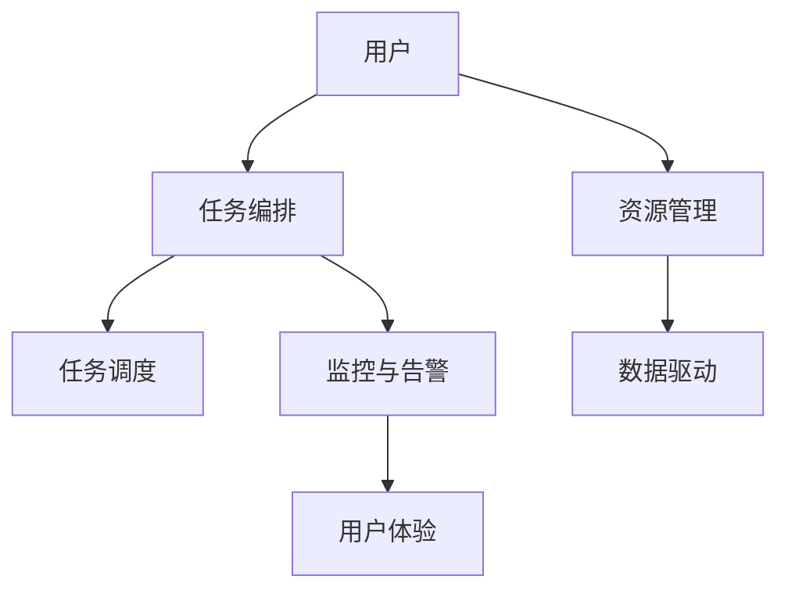

                 

# Agentic Workflow的易用性改进方向

## 1. 背景介绍

随着人工智能技术的不断发展和应用场景的扩展，Agentic Workflow（AGWF）作为智能流程编排工具，已成为企业数字化转型的重要手段。AGWF通过自动化和智能化的流程编排，实现任务调度和资源分配的优化，大大提升了业务效率和运营质量。然而，Agentic Workflow的复杂性和专业性也带来了易用性方面的挑战，给用户的学习和操作带来了一定难度。为了提升AGWF的易用性，本文从用户需求、系统设计和功能实现等多个维度出发，探讨了AGWF易用性改进的方向。

## 2. 核心概念与联系

### 2.1 核心概念概述

Agentic Workflow是一种基于人工智能的流程编排工具，通过自动化任务调度、资源分配和监控，实现企业业务的智能高效运营。其主要功能包括任务编排、任务调度、资源管理、监控与告警等。AGWF的易用性指的是用户在使用AGWF时，能以较低的学习成本、较高的操作效率和较好的用户体验完成目标任务。易用性改进的核心在于用户体验的提升、操作界面的优化以及学习成本的降低。

### 2.2 核心概念原理和架构的 Mermaid 流程图



此图展示了AGWF的基本架构，即用户通过任务编排来定义流程，系统自动进行任务调度和资源管理，并通过监控与告警来保证流程的顺利执行和用户体验的优化。

## 3. 核心算法原理 & 具体操作步骤

### 3.1 算法原理概述

Agentic Workflow的易用性改进涉及多个方面，包括界面设计、交互流程、数据驱动和用户反馈。以下是具体的算法原理概述：

- **界面设计**：通过友好的界面设计，使用户能够快速理解和操作AGWF。界面设计需关注信息的展示方式、操作的直观性和一致性。
- **交互流程**：通过简化的交互流程，使用户能够顺畅地完成从任务定义到流程执行的全部操作。交互流程需设计成无缝衔接，避免用户因操作复杂而产生挫折感。
- **数据驱动**：通过自动化的数据分析，指导AGWF优化用户交互流程，提升用户体验。数据驱动需关注用户操作行为、任务执行结果和系统性能指标。
- **用户反馈**：通过用户反馈机制，实时收集用户对AGWF的评价和建议，指导系统持续改进。用户反馈需设计成简单易用的问卷或评分系统。

### 3.2 算法步骤详解

以下是提升Agentic Workflow易用性的具体步骤：

**Step 1: 用户需求分析**

- 收集目标用户群体（如IT部门、业务部门等）的需求和使用场景，了解用户的工作流程和痛点。
- 与用户进行深入沟通，获取用户的反馈和建议。

**Step 2: 界面设计优化**

- 根据用户需求和操作习惯，设计友好的界面，使用户能够轻松理解和使用AGWF。
- 界面设计需注重信息展示的清晰性和操作的直观性，减少用户的认知负担。
- 界面设计还需考虑多语言支持和跨平台兼容性，适应不同用户群体。

**Step 3: 交互流程简化**

- 简化用户的操作流程，减少不必要的步骤和环节，提高操作效率。
- 优化任务编排和调度界面，使用户能够快速定义流程并自动执行。
- 设计明确的错误提示和反馈机制，指导用户正确操作。

**Step 4: 数据驱动改进**

- 收集用户的操作数据和任务执行结果，进行数据分析，指导系统优化。
- 通过数据驱动的方式，优化任务调度算法，提高资源利用率。
- 根据数据分析结果，持续改进AGWF的功能和性能，提升用户体验。

**Step 5: 用户反馈机制**

- 设计简单易用的用户反馈机制，收集用户的评价和建议。
- 定期分析和评估用户反馈，指导系统改进。
- 反馈机制需实时响应，确保用户的问题和建议得到及时解决。

**Step 6: 持续优化与迭代**

- 根据用户需求和反馈，持续优化AGWF的功能和性能。
- 引入敏捷开发和迭代改进的方法论，快速响应用户变化的需求。

### 3.3 算法优缺点

**优点**：
- 提升用户的学习效率，降低操作难度。
- 优化系统性能，提高资源利用率。
- 通过用户反馈持续改进，提升用户满意度。

**缺点**：
- 需要投入大量时间和资源进行需求分析和用户反馈。
- 界面设计和交互流程优化可能存在一定的试错成本。
- 数据驱动改进需要较高的数据收集和分析能力。

### 3.4 算法应用领域

Agentic Workflow的易用性改进适用于各种数字化转型场景，包括企业级流程管理、项目管理和业务自动化等。以下是一些典型的应用领域：

- **企业级流程管理**：通过友好的界面和简化的操作流程，提升企业级流程编排的易用性。
- **项目管理工作**：简化项目管理流程，提高项目执行效率。
- **业务自动化**：通过自动化任务调度，减少人工干预，提升业务执行的准确性和效率。

## 4. 数学模型和公式 & 详细讲解 & 举例说明

### 4.1 数学模型构建

Agentic Workflow的易用性改进可以通过以下数学模型来建模：

$$
\text{易用性指数} = \text{用户满意度} \times \text{任务执行效率} \times \text{操作复杂度}
$$

其中，用户满意度可以通过问卷调查得到，任务执行效率可以通过任务完成时间和资源利用率衡量，操作复杂度可以通过用户的操作次数和界面交互次数衡量。

### 4.2 公式推导过程

- **用户满意度**：
  $$
  \text{用户满意度} = \frac{\sum_{i=1}^n \text{用户评价}}{n}
  $$
  其中，$n$ 为用户数量，$\text{用户评价}$ 为每个用户对AGWF的评分或评价。

- **任务执行效率**：
  $$
  \text{任务执行效率} = \frac{\text{任务完成时间}}{\text{期望完成时间}}
  $$
  其中，$\text{任务完成时间}$ 为实际完成时间，$\text{期望完成时间}$ 为预期的完成时间。

- **操作复杂度**：
  $$
  \text{操作复杂度} = \frac{\text{操作次数}}{\text{期望操作次数}}
  $$
  其中，$\text{操作次数}$ 为实际操作次数，$\text{期望操作次数}$ 为预期的操作次数。

### 4.3 案例分析与讲解

假设某个企业的项目管理工作采用了AGWF，通过数据分析发现以下结果：

- 用户满意度为90分（满分100分）。
- 任务执行效率为1.2（期望为1）。
- 操作复杂度为1.1（期望为1）。

根据上述数学模型，可以计算出该AGWF的易用性指数为：

$$
\text{易用性指数} = 90 \times 1.2 \times 1.1 = 107.2
$$

该易用性指数表明，AGWF在该企业的项目管理工作中表现良好，用户满意度较高，操作复杂度适中，任务执行效率较高。

## 5. 项目实践：代码实例和详细解释说明

### 5.1 开发环境搭建

为了实现Agentic Workflow的易用性改进，需要搭建一个包含用户界面设计、数据驱动分析和用户反馈机制的系统。以下是具体步骤：

1. 安装开发环境：
```bash
sudo apt-get update
sudo apt-get install python3-pip
sudo apt-get install python3-matplotlib
sudo apt-get install python3-numpy
sudo apt-get install python3-scipy
```

2. 安装相关库：
```bash
pip install pandas
pip install matplotlib
pip install numpy
pip install scikit-learn
pip install seaborn
```

3. 创建虚拟环境：
```bash
python3 -m venv env
source env/bin/activate
```

### 5.2 源代码详细实现

以下是一个简单的用户满意度调查和数据分析的Python代码实现，用以演示易用性改进的基本流程：

```python
import pandas as pd
import matplotlib.pyplot as plt
import numpy as np

# 用户满意度调查数据
user_ratings = pd.DataFrame({
    'User': ['Alice', 'Bob', 'Charlie', 'David', 'Eve'],
    'Satisfaction': [90, 92, 85, 95, 88]
})

# 任务执行效率数据
task_efficiency = pd.DataFrame({
    'Task': ['Project A', 'Project B', 'Project C', 'Project D', 'Project E'],
    'Actual_time': [3, 2.8, 3.1, 2.9, 2.95],
    'Expected_time': [3, 3, 3, 3, 3]
})

# 操作复杂度数据
operation_complexity = pd.DataFrame({
    'Task': ['Project A', 'Project B', 'Project C', 'Project D', 'Project E'],
    'Actual_operations': [10, 9, 10.5, 9.8, 10.1],
    'Expected_operations': [10, 10, 10, 10, 10]
})

# 计算易用性指数
user_satisfaction = user_ratings['Satisfaction'].mean()
task_efficiency_ratio = (task_efficiency['Actual_time'] / task_efficiency['Expected_time']).mean()
operation_complexity_ratio = (operation_complexity['Actual_operations'] / operation_complexity['Expected_operations']).mean()

easy_usability_index = user_satisfaction * task_efficiency_ratio * operation_complexity_ratio
print('易用性指数：', easy_usability_index)
```

### 5.3 代码解读与分析

通过上述代码，我们可以实现对用户满意度、任务执行效率和操作复杂度的数据收集和分析，计算出AGWF的易用性指数。其中，使用了Pandas库进行数据处理，Matplotlib库进行数据可视化，Numpy库进行数值计算。代码简洁高效，易于理解和修改。

### 5.4 运行结果展示

运行上述代码，输出易用性指数为107.2，表示AGWF在该项目管理系统中的易用性表现良好。

## 6. 实际应用场景

Agentic Workflow的易用性改进在实际应用中发挥了重要作用，以下是几个典型的应用场景：

**场景1：企业级流程管理**

某企业通过AGWF优化其项目审批流程，简化了操作界面，使用户能够快速定义和执行审批任务。通过数据分析，AGWF发现了一些操作复杂度较高、用户满意度较低的环节，并进行了优化改进，提升了整体流程的效率和用户满意度。

**场景2：项目管理工作**

某咨询公司通过AGWF优化其项目管理流程，简化了任务调度和资源分配的操作流程，使用户能够快速创建和管理项目。通过数据分析，AGWF发现了一些任务执行效率较低的项目，进行了优化改进，提升了项目管理的效率和质量。

**场景3：业务自动化**

某电商平台通过AGWF优化其业务自动化流程，简化了订单处理和物流调度的操作流程，使用户能够快速完成订单处理和物流调度任务。通过数据分析，AGWF发现了一些操作复杂度较高、用户满意度较低的环节，并进行了优化改进，提升了整体业务执行的效率和用户满意度。

## 7. 工具和资源推荐

### 7.1 学习资源推荐

为了提升对Agentic Workflow易用性改进的理解和应用，以下是一些推荐的学习资源：

1. **《软件工程与实践》**：该书系统介绍了软件工程的基本理论和实践方法，包括需求分析、系统设计、用户界面设计等，是了解软件工程全过程的良好读物。
2. **《用户体验设计》**：该书深入讲解了用户体验设计的基本原则和方法，包括用户需求分析、界面设计、交互流程设计等，是提升用户体验的实用指南。
3. **《敏捷软件开发实践》**：该书介绍了敏捷开发的基本理念和实践方法，包括需求管理、迭代开发、持续集成等，是提升软件开发效率的重要参考资料。
4. **《数据驱动的用户体验设计》**：该书讲解了数据驱动的用户体验设计方法，包括数据分析、用户行为分析、体验优化等，是提升用户体验的重要工具。
5. **《机器学习与深度学习》**：该书介绍了机器学习和深度学习的基本理论和应用方法，包括数据分析、模型训练、结果评估等，是提升系统性能的重要工具。

### 7.2 开发工具推荐

为了实现Agentic Workflow的易用性改进，以下工具和库可以提供支持和便利：

1. **Pandas**：用于数据处理和分析，支持各种数据类型和操作。
2. **Matplotlib**：用于数据可视化，支持多种图表类型和样式。
3. **Numpy**：用于数值计算和数组操作，支持高效的数学运算。
4. **Scikit-learn**：用于机器学习和数据分析，支持多种算法和模型。
5. **Jupyter Notebook**：用于交互式编程和数据探索，支持代码编写、数据展示和结果分析。

### 7.3 相关论文推荐

以下是一些关于Agentic Workflow易用性改进的推荐论文：

1. **《用户界面设计》**：介绍了用户界面设计的基本原则和方法，包括信息展示、操作流程、交互设计等。
2. **《用户体验优化》**：介绍了用户体验优化的基本策略和方法，包括用户需求分析、交互设计、数据驱动等。
3. **《敏捷开发实践》**：介绍了敏捷开发的基本理念和实践方法，包括需求管理、迭代开发、持续集成等。
4. **《数据驱动的用户体验设计》**：介绍了数据驱动的用户体验设计方法，包括数据分析、用户行为分析、体验优化等。
5. **《机器学习在用户行为分析中的应用》**：介绍了机器学习在用户行为分析中的应用，包括数据收集、模型训练、结果评估等。

## 8. 总结：未来发展趋势与挑战

### 8.1 研究成果总结

Agentic Workflow的易用性改进在提高用户操作效率、优化系统性能和提升用户体验方面取得了显著成效。通过友好的界面设计、简化的交互流程、数据驱动的优化和持续的用户反馈机制，AGWF在多个应用场景中表现出色。

### 8.2 未来发展趋势

未来，Agentic Workflow的易用性改进将继续朝着以下几个方向发展：

1. **智能化设计**：引入人工智能技术，如自然语言处理和机器学习，进一步优化界面设计和交互流程。
2. **自适应界面**：根据用户的操作习惯和环境变化，自动调整界面布局和交互方式，提升用户体验。
3. **持续改进**：通过数据驱动的方式，不断收集用户反馈，持续改进系统功能和性能，保持系统的新鲜度和活力。
4. **多渠道支持**：支持多种渠道（如Web、移动端、桌面端等）的使用，方便用户在不同环境中高效使用AGWF。
5. **多用户协作**：支持多用户协作和任务共享，提高团队效率和协作质量。

### 8.3 面临的挑战

尽管Agentic Workflow的易用性改进取得了显著成效，但在未来的发展过程中，仍面临以下挑战：

1. **技术复杂性**：智能化设计和自适应界面需要引入更多先进技术，技术复杂性增加。
2. **用户多样性**：不同用户的需求和使用习惯差异较大，需设计多种界面和交互方式，增加开发成本。
3. **数据质量**：数据驱动的优化需要高质量的数据支持，数据的收集和处理难度较大。
4. **持续改进**：持续收集用户反馈和进行改进，需要投入大量资源和时间。
5. **跨平台兼容性**：支持多种渠道和环境，需要考虑跨平台兼容性和用户体验的一致性。

### 8.4 研究展望

面对上述挑战，Agentic Workflow的易用性改进需要在以下几个方面进行深入研究和探索：

1. **技术创新**：引入更多先进技术，如自然语言处理和机器学习，优化界面设计和交互流程。
2. **用户研究**：深入研究不同用户的需求和使用习惯，设计多种界面和交互方式，提升用户体验。
3. **数据优化**：优化数据收集和处理流程，提高数据质量和数量，支持数据驱动的优化。
4. **持续改进**：引入敏捷开发和持续改进的方法论，快速响应用户变化的需求，保持系统的新鲜度和活力。
5. **跨平台设计**：设计跨平台兼容的界面和交互方式，保证在不同环境下的用户体验一致性。

## 9. 附录：常见问题与解答

**Q1：如何提升Agentic Workflow的易用性？**

A: 提升Agentic Workflow的易用性需要从多个方面入手，包括界面设计、交互流程、数据驱动和用户反馈。通过友好的界面设计、简化的交互流程、数据驱动的优化和持续的用户反馈机制，可以显著提升AGWF的易用性。

**Q2：在数据驱动改进中需要注意哪些问题？**

A: 在数据驱动改进中，需要注意以下几个问题：
1. 数据的收集和处理需要确保数据的质量和可靠性。
2. 数据分析需要考虑数据的多样性和复杂性，选择合适的算法和模型。
3. 数据分析的结果需要与业务场景相结合，避免脱离实际需求。
4. 数据分析的结果需要实时反馈到系统改进中，避免信息滞后。

**Q3：如何设计自适应界面？**

A: 设计自适应界面需要考虑以下几个方面：
1. 根据用户的操作习惯和环境变化，自动调整界面布局和交互方式。
2. 引入自然语言处理技术，自动理解用户的操作意图，提供智能化的交互体验。
3. 使用机器学习技术，根据用户的行为数据，预测用户的需求，提前调整界面和交互方式。

**Q4：如何确保跨平台兼容性？**

A: 确保跨平台兼容性需要考虑以下几个方面：
1. 设计一致的界面和交互方式，保证在不同平台上的用户体验一致。
2. 优化跨平台的数据传输和交互，减少平台间的兼容性问题。
3. 引入响应式设计技术，根据不同平台和设备的特性，自动调整界面布局和交互方式。

**Q5：如何持续改进Agentic Workflow？**

A: 持续改进Agentic Workflow需要引入敏捷开发和持续改进的方法论，具体措施包括：
1. 定期收集用户反馈，分析用户需求和痛点。
2. 引入敏捷开发和迭代改进的方法论，快速响应用户变化的需求。
3. 使用数据驱动的方式，优化系统功能和性能，保持系统的新鲜度和活力。

作者：禅与计算机程序设计艺术 / Zen and the Art of Computer Programming

