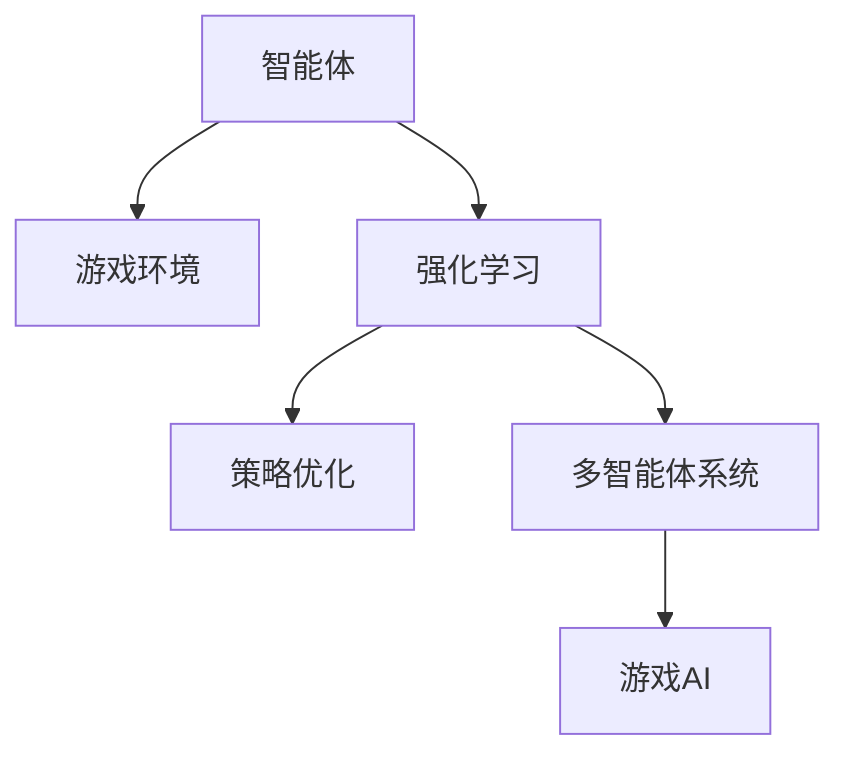

                 

# Agent与游戏体验的改变

> 关键词：Agent, 游戏体验, 强化学习, 智能决策, 游戏AI, 机器学习, 策略优化, 多智能体系统

## 1. 背景介绍

### 1.1 问题由来
随着人工智能技术的迅猛发展，智能体(Agent)在各领域的应用日益广泛。特别是在游戏中，智能体通过学习环境反馈，做出最优决策，为玩家带来真实、丰富、沉浸式的游戏体验。从早期的简单智能体，到如今的深度强化学习(AI)算法，智能体的进化带来了游戏体验的革命性改变。

然而，现有智能体的设计往往局限于单一任务或预设规则，难以适应复杂多变的真实游戏场景。此外，智能体在应对紧急情况、处理意外事件时，缺乏足够的鲁棒性和适应性。如何通过智能体提升游戏体验，成为当前AI游戏开发中的核心问题。

### 1.2 问题核心关键点
1. **智能体设计**：如何选择合适的人工智能算法，设计高效的智能体，适应游戏环境的多样性。
2. **游戏环境建模**：如何建立精准的环境模型，捕捉游戏中的不确定性、多样性和动态变化。
3. **智能体策略优化**：如何通过强化学习等方法，优化智能体的决策策略，提升游戏体验。
4. **多智能体系统**：如何在复杂的多智能体系统中，实现智能体的协作和竞争，增强游戏多样性。
5. **玩家感知**：如何设计智能体的行为和交互逻辑，让玩家感受到智能体的真实性、智慧性，而非机械性。
6. **安全性**：如何确保智能体在处理高风险情况时的安全性和稳定性，避免不可预见的风险。

### 1.3 问题研究意义
探索基于智能体的游戏体验提升方法，对于提升游戏AI的智能化水平，打造更加丰富、有趣、真实的游戏体验，具有重要意义：

1. **降低开发成本**：智能体的引入，可以大大降低游戏开发中的物理模拟和行为逻辑编程成本，提高开发效率。
2. **增强游戏体验**：智能体能够根据玩家行为和环境变化实时调整决策，提供动态、逼真的游戏体验。
3. **创新游戏设计**：智能体的多样性和互动性，为游戏设计提供更多可能性，推动游戏设计的创新。
4. **提升可玩性**：智能体在复杂环境和随机事件下的适应能力，使得游戏更具挑战性和可玩性。
5. **带动产业发展**：智能体技术在教育、模拟训练、体育竞技等领域的应用，将推动AI游戏技术的产业化进程。

## 2. 核心概念与联系

### 2.1 核心概念概述

为更好地理解智能体在游戏中的作用，本节将介绍几个密切相关的核心概念：

- **智能体(Agent)**：在人工智能和游戏领域，智能体指的是能够感知环境、做出决策并执行行动的实体。在游戏中，智能体通常指非玩家角色(NPC)。
- **游戏环境**：游戏环境是指游戏中的物理世界和虚拟角色，包括游戏地图、角色属性、交互动作等。智能体通过感知环境状态，做出相应的策略决策。
- **强化学习(Reinforcement Learning, RL)**：一种机器学习方法，通过与环境的交互，不断调整策略，最大化累积奖励。在游戏环境中，智能体的策略优化通常通过强化学习实现。
- **多智能体系统(Multi-agent System)**：由多个智能体组成的系统，每个智能体具有独立的感知、决策和执行能力。多智能体系统可以用于模拟真实世界中的复杂交互和合作。
- **游戏AI**：指游戏中用于提升游戏智能和游戏体验的人工智能技术，包括但不限于游戏环境建模、智能体决策、自然语言处理等。

这些核心概念之间的逻辑关系可以通过以下Mermaid流程图来展示：



这个流程图展示了这个智能体系统的工作原理：

1. 智能体通过感知游戏环境，获取状态信息。
2. 利用强化学习优化决策策略，最大化累积奖励。
3. 在多智能体系统中，智能体互相协作或竞争，实现复杂的交互逻辑。
4. 游戏AI综合环境建模、策略优化等多项技术，提升游戏的智能化水平。

## 3. 核心算法原理 & 具体操作步骤
### 3.1 算法原理概述

基于智能体的游戏体验优化，本质上是一个智能决策优化问题。其核心思想是：通过设计合适的智能体算法，让智能体在复杂多变的游戏环境中，做出最优的决策，从而提升游戏体验。

形式化地，设智能体 $A$ 在环境 $\mathcal{E}$ 中，通过观测 $\mathcal{O}_t$ 和行动 $\mathcal{A}_t$ 与环境交互，获得状态 $\mathcal{S}_t$ 和奖励 $\mathcal{R}_t$。其目标是通过学习，最大化长期累积奖励 $J(A)$。即：

$$
J(A) = \mathop{\max}_{\pi} \mathbb{E}[\sum_{t=1}^{\infty} \gamma^{t-1} \mathcal{R}_t]
$$

其中，$\pi$ 为策略函数，$\gamma$ 为折扣因子，表示长期奖励的重要性权重。

通过强化学习等优化方法，智能体能够在大量游戏经验中，逐步学习到最优的策略函数 $\pi$，从而实现智能体的决策优化。

### 3.2 算法步骤详解

基于智能体的游戏体验优化一般包括以下几个关键步骤：

**Step 1: 选择智能体算法**

- 根据游戏场景的特点，选择合适的强化学习算法。如Q-learning、SARSA、Deep Q-Network (DQN)、Deep Deterministic Policy Gradient (DDPG)、Actor-Critic等。

**Step 2: 环境建模**

- 设计游戏环境的数学模型，捕捉游戏状态和奖励的关系。常见的游戏环境建模方法包括马尔科夫决策过程(MDP)、不完全信息游戏、随机图模型等。

**Step 3: 设计策略函数**

- 根据游戏场景的需求，设计策略函数 $\pi$。对于离散动作空间，可以使用策略梯度方法；对于连续动作空间，可以使用深度学习网络，如神经网络等。

**Step 4: 收集训练数据**

- 在游戏中收集智能体的交互数据，作为模型训练的样本。

**Step 5: 训练和评估**

- 使用训练数据集，在指定的损失函数下训练智能体模型。在验证集上评估模型性能，选择最优策略函数。

**Step 6: 集成和部署**

- 将训练好的智能体模型集成到游戏引擎中，进行实时测试。在正式部署前，对智能体进行优化和微调。

### 3.3 算法优缺点

基于智能体的游戏体验优化方法具有以下优点：

1. 适应性强。智能体能够根据游戏环境的变化，动态调整策略，适应多变的游戏场景。
2. 体验丰富。通过优化策略，智能体能够提供更真实、智能、互动的游戏体验，增加游戏的趣味性。
3. 高效开发。智能体的引入，减少了游戏编程工作量，提高了开发效率。
4. 智能进化。智能体在大量游戏经验中不断学习，逐步提升游戏智能水平。

同时，该方法也存在一些局限性：

1. 算法复杂度高。智能体算法设计复杂，对游戏开发者的技术要求较高。
2. 资源消耗大。智能体运行需要大量计算资源，影响游戏性能。
3. 可解释性差。智能体的决策过程缺乏可解释性，玩家难以理解其行为。
4. 鲁棒性不足。智能体在处理异常情况和不可预见事件时，可能表现欠佳。

尽管存在这些局限性，但基于智能体的游戏体验优化方法仍是一种极具潜力的技术手段。未来相关研究的重点在于如何进一步简化智能体算法，降低计算成本，提升智能体的可解释性和鲁棒性。

### 3.4 算法应用领域

基于智能体的游戏体验优化方法，在游戏开发中已经得到了广泛应用，覆盖了几乎所有类型游戏：

- **动作游戏**：如《我的世界》《堡垒之夜》等，智能体可以增强游戏世界的互动性和挑战性。
- **策略游戏**：如《星际争霸》《炉石传说》等，智能体用于对战或辅助决策，提升游戏平衡性。
- **冒险游戏**：如《塞尔达传说》《生化危机》等，智能体用于解谜或辅助玩家完成主线任务。
- **角色扮演游戏**：如《巫师3》《上古卷轴》等，智能体用于角色交互和剧情推进。
- **体育竞技游戏**：如《FIFA》《足球经理》等，智能体用于对抗或辅助训练。
- **模拟游戏**：如《模拟城市》《模拟联合国》等，智能体用于模拟城市运作或政治决策。

除了传统游戏外，智能体技术还被创新性地应用到更多场景中，如智能家居、自动驾驶、军事模拟等，为游戏技术带来新的应用方向。随着智能体技术的不断进步，相信智能体技术将在更多领域中发挥重要作用。

## 4. 数学模型和公式 & 详细讲解
### 4.1 数学模型构建

本节将使用数学语言对基于智能体的游戏体验优化过程进行更加严格的刻画。

设智能体 $A$ 在环境 $\mathcal{E}$ 中，通过观测 $\mathcal{O}_t$ 和行动 $\mathcal{A}_t$ 与环境交互，获得状态 $\mathcal{S}_t$ 和奖励 $\mathcal{R}_t$。设智能体的状态空间为 $\mathcal{S}$，动作空间为 $\mathcal{A}$，策略函数为 $\pi$，环境奖励为 $\mathcal{R}$，折扣因子为 $\gamma$。

智能体的策略优化目标是最小化累积奖励方差：

$$
\mathop{\min}_{\pi} \mathbb{E}[\sum_{t=1}^{\infty} \gamma^{t-1} (\mathcal{R}_t + \gamma \mathbb{E}[\mathcal{R}_{t+1}])
$$

### 4.2 公式推导过程

以下我们以Q-learning为例，推导强化学习中的Q值更新公式。

设智能体在状态 $s$ 下，采取动作 $a$ 的Q值为 $Q(s,a)$，则在状态 $s$ 下采取动作 $a$ 的奖励为 $R(s,a)$，后续状态为 $s'$，采取动作 $a'$ 的Q值为 $Q(s',a')$。Q-learning的更新公式为：

$$
Q(s,a) \leftarrow Q(s,a) + \alpha [R(s,a) + \gamma \max_{a'} Q(s',a') - Q(s,a)]
$$

其中 $\alpha$ 为学习率。

在每个状态下，智能体通过比较动作 $a$ 和 $a'$ 的Q值，选择最优动作进行更新。这个过程通过不断迭代，逐步优化Q值，使得智能体能够做出最优的策略决策。

### 4.3 案例分析与讲解

**案例：智能体在《俄罗斯方块》游戏中的应用**

在《俄罗斯方块》游戏中，玩家需要不断旋转、移动、放置方块，以消除成行或成列的方块。玩家需要不断调整方块的旋转角度和放置位置，以获得尽可能多的分数。智能体的目标是通过学习，自动旋转和放置方块，最大化分数。

**Q-learning在《俄罗斯方块》中的应用**

1. **状态定义**：将游戏状态定义为当前网格的状态，包括每个位置的方块种类、位置等信息。

2. **动作定义**：将动作定义为旋转角度（左、右、上、下）和放置位置，用向量表示。

3. **奖励设计**：每次放置成功消除一行或一列方块时，给予正向奖励；每次放置失败或游戏结束时，给予负向奖励。

4. **模型训练**：使用Q-learning算法训练智能体，每次游戏结束时，更新Q值，迭代优化策略。

通过Q-learning训练的智能体，能够在《俄罗斯方块》游戏中实现自动旋转和放置方块，最大化游戏分数。在实际应用中，Q-learning还可以与其他智能体算法相结合，如深度强化学习，进一步提升智能体的性能。

## 5. 项目实践：代码实例和详细解释说明
### 5.1 开发环境搭建

在进行智能体实践前，我们需要准备好开发环境。以下是使用Python进行PyTorch开发的环境配置流程：

1. 安装Anaconda：从官网下载并安装Anaconda，用于创建独立的Python环境。

2. 创建并激活虚拟环境：
```bash
conda create -n pytorch-env python=3.8 
conda activate pytorch-env
```

3. 安装PyTorch：根据CUDA版本，从官网获取对应的安装命令。例如：
```bash
conda install pytorch torchvision torchaudio cudatoolkit=11.1 -c pytorch -c conda-forge
```

4. 安装TensorFlow：
```bash
pip install tensorflow
```

5. 安装各类工具包：
```bash
pip install numpy pandas scikit-learn matplotlib tqdm jupyter notebook ipython
```

完成上述步骤后，即可在`pytorch-env`环境中开始智能体实践。

### 5.2 源代码详细实现

下面我们以智能体在《俄罗斯方块》游戏中的应用为例，给出使用PyTorch进行Q-learning算法的PyTorch代码实现。

首先，定义游戏状态和动作空间：

```python
import torch
import numpy as np

# 定义状态和动作空间
state_size = 4 * 4 * 4  # 状态为4x4x4网格
action_size = 4  # 动作为左、右、上、下
```

然后，定义智能体和奖励函数：

```python
class QLearningAgent:
    def __init__(self, state_size, action_size):
        self.state_size = state_size
        self.action_size = action_size
        
        # 初始化Q值表
        self.q_table = np.zeros((state_size, action_size))
        
        # 学习率
        self.learning_rate = 0.1
        
        # 折扣因子
        self.gamma = 0.9
        
        # 探索率
        self.epsilon = 0.1
        
        # 当前状态
        self.current_state = None
        
        # 当前奖励
        self.current_reward = 0
        
        # 累计奖励
        self.total_reward = 0
        
        # 探索次数
        self.explore_count = 0
        
        # 学习次数
        self.learning_count = 0
        
    def choose_action(self, state):
        if np.random.uniform() < self.epsilon:
            return np.random.choice(self.action_size)
        else:
            return np.argmax(self.q_table[state])
    
    def learn(self, state, action, reward, next_state, done):
        # 更新Q值
        q = self.q_table[state, action]
        q_next = np.max(self.q_table[next_state])
        self.q_table[state, action] += self.learning_rate * (reward + self.gamma * q_next - q)
        
        # 更新累计奖励和探索次数
        self.total_reward += reward
        self.explore_count += 1
        
        # 更新学习次数
        self.learning_count += 1
```

最后，定义训练函数：

```python
def train(env, agent, episodes):
    state = env.reset()
    
    for episode in range(episodes):
        done = False
        while not done:
            action = agent.choose_action(state)
            
            next_state, reward, done, _ = env.step(action)
            agent.learn(state, action, reward, next_state, done)
            
            state = next_state
        
        print(f"Episode {episode+1}, reward: {agent.total_reward}, explore count: {agent.explore_count}, learn count: {agent.learning_count}")
        agent.learning_count = 0
        agent.explore_count = 0
```

可以看到，使用PyTorch进行Q-learning训练智能体的代码实现非常简单，只需要定义智能体和训练函数即可。

### 5.3 代码解读与分析

让我们再详细解读一下关键代码的实现细节：

**QLearningAgent类**：
- `__init__`方法：初始化智能体的状态、动作、Q值表、学习率、折扣因子、探索率等关键参数。
- `choose_action`方法：根据探索率和当前Q值表，选择动作。在探索阶段，随机选择动作；在利用阶段，选择Q值最大的动作。
- `learn`方法：根据状态、动作、奖励、下一个状态和是否结束，更新Q值表。
- `total_reward`属性：用于存储累计奖励。
- `explore_count`和`learning_count`属性：分别用于记录探索次数和训练次数，帮助调试和优化智能体。

**训练函数**：
- 在游戏环境中重置状态。
- 对于每个episode，选择动作，更新Q值表，迭代学习。
- 在每个episode结束后，打印当前episode的累计奖励、探索次数和训练次数。

可以看到，使用PyTorch进行Q-learning训练智能体的代码实现非常简单，只需要定义智能体和训练函数即可。

当然，实际的游戏环境中可能存在更加复杂的状态和动作空间，需要在定义状态和动作时进行更深入的设计和处理。

## 6. 实际应用场景
### 6.1 智能体在《星际争霸》中的应用

《星际争霸》是一款策略游戏，玩家需要通过采集资源、建筑设施、战斗等操作，完成各种任务。智能体在游戏中扮演敌对角色，自主决策行动，给玩家带来复杂多变的战斗体验。

**智能体在《星际争霸》中的应用**

1. **状态定义**：将游戏状态定义为当前游戏地图、资源采集、战斗等情况。

2. **动作定义**：将动作定义为建造单位、生产资源、移动等操作。

3. **奖励设计**：每次建造成功、战斗胜利时，给予正向奖励；每次建造失败、战斗失败时，给予负向奖励。

4. **模型训练**：使用强化学习算法训练智能体，在大量游戏经验中优化策略。

通过训练，智能体能够在《星际争霸》游戏中实现自主决策和行动，与玩家进行复杂的多方交互，提升游戏的趣味性和挑战性。

### 6.2 智能体在《使命召唤》中的应用

《使命召唤》是一款第一人称射击游戏，玩家需要在多种场景中进行战术对抗。智能体在游戏中扮演敌方角色，通过学习游戏环境，调整策略，与玩家进行对抗。

**智能体在《使命召唤》中的应用**

1. **状态定义**：将游戏状态定义为当前地图、敌人位置、武器装备等情况。

2. **动作定义**：将动作定义为移动、攻击、防御等操作。

3. **奖励设计**：每次击中目标时，给予正向奖励；每次被击中或死亡时，给予负向奖励。

4. **模型训练**：使用深度强化学习算法训练智能体，在大量游戏经验中优化策略。

通过训练，智能体能够在《使命召唤》游戏中实现高度真实的战术对抗，提升游戏的沉浸感和挑战性。

### 6.3 智能体在《模拟城市》中的应用

《模拟城市》是一款模拟城市管理和建设的策略游戏，玩家需要通过建设道路、住宅、商业设施等，管理城市的发展。智能体在游戏中扮演城市规划者，通过学习城市发展规律，调整策略，进行城市建设和管理。

**智能体在《模拟城市》中的应用**

1. **状态定义**：将游戏状态定义为当前城市建设、资源供应、环境变化等情况。

2. **动作定义**：将动作定义为建设道路、住宅、商业设施等操作。

3. **奖励设计**：每次建设成功时，给予正向奖励；每次建设失败时，给予负向奖励。

4. **模型训练**：使用强化学习算法训练智能体，在大量游戏经验中优化策略。

通过训练，智能体能够在《模拟城市》游戏中实现自主的城市建设和规划，提升游戏的决策复杂性和管理深度。

### 6.4 未来应用展望

随着智能体技术的不断进步，基于智能体的游戏体验优化将覆盖更多场景，为游戏设计带来新的灵感：

1. **沉浸式体验**：智能体能够根据玩家行为和环境变化，实时调整策略，提供动态、逼真的游戏体验。
2. **社交互动**：智能体在多智能体系统中，能够进行复杂的交互和协作，提供丰富的社交互动内容。
3. **创新玩法**：智能体在复杂环境和随机事件下的适应能力，使得游戏玩法更加多样化。
4. **实时对战**：智能体能够在多个玩家和环境交互中，实现实时对战和战术对抗，提升游戏的紧张感和刺激度。
5. **自适应难度**：智能体能够根据玩家水平，调整游戏难度，提供个性化和挑战性的游戏体验。

未来，智能体技术将在游戏设计中发挥更大作用，带来更加丰富、真实、智能的游戏体验。

## 7. 工具和资源推荐
### 7.1 学习资源推荐

为了帮助开发者系统掌握智能体的设计与优化技术，这里推荐一些优质的学习资源：

1. 《Reinforcement Learning: An Introduction》书籍：由Richard S. Sutton和Andrew G. Barto撰写，全面介绍了强化学习的理论基础和实际应用。
2. Coursera《Reinforcement Learning Specialization》课程：由DeepMind和密歇根大学联合开设的强化学习系列课程，深入浅出地讲解了强化学习的各个方面。
3. OpenAI Gym：一个开源的游戏环境框架，提供大量测试和训练环境，方便开发者快速实验。
4. DeepMind AlphaGo论文：DeepMind公司发布的AlphaGo击败人类围棋冠军的论文，展示了强化学习在游戏领域的巨大潜力。
5. PyTorch官方文档：PyTorch官方文档提供了丰富的API和示例代码，帮助开发者快速上手智能体开发。

通过对这些资源的学习实践，相信你一定能够快速掌握智能体设计的精髓，并用于解决实际的NLP问题。

### 7.2 开发工具推荐

高效的开发离不开优秀的工具支持。以下是几款用于智能体开发常用的工具：

1. PyTorch：基于Python的开源深度学习框架，灵活动态的计算图，适合快速迭代研究。大部分智能体算法都有PyTorch版本的实现。

2. TensorFlow：由Google主导开发的开源深度学习框架，生产部署方便，适合大规模工程应用。同样有丰富的智能体算法资源。

3. OpenAI Gym：一个开源的游戏环境框架，提供大量测试和训练环境，方便开发者快速实验。

4. TensorBoard：TensorFlow配套的可视化工具，可实时监测智能体的训练状态，并提供丰富的图表呈现方式，是调试智能体的得力助手。

5. Weights & Biases：模型训练的实验跟踪工具，可以记录和可视化智能体的训练过程中的各项指标，方便对比和调优。

6. Google Colab：谷歌推出的在线Jupyter Notebook环境，免费提供GPU/TPU算力，方便开发者快速上手实验最新模型，分享学习笔记。

合理利用这些工具，可以显著提升智能体微调任务的开发效率，加快创新迭代的步伐。

### 7.3 相关论文推荐

智能体技术的发展源于学界的持续研究。以下是几篇奠基性的相关论文，推荐阅读：

1. Q-learning：由James Mark C. Williams于1992年提出的基于值函数的强化学习算法。

2. DeepMind AlphaGo：DeepMind公司发布的AlphaGo击败人类围棋冠军的论文，展示了强化学习在游戏领域的巨大潜力。

3. Multi-Agent Systems: A Gentle Introduction：由Walter Kintchilov于2010年出版的介绍多智能体系统的经典书籍。

4. Distributed Deep Reinforcement Learning: An Overview of Models and Challenges：由Jérome Duran于2018年发表的综述论文，全面介绍了分布式强化学习算法。

5. Deep Reinforcement Learning for Multi-Agent Systems: A Tutorial for Algorithms and Applications：由Wim van Damme于2019年发表的综述论文，深入浅出地讲解了多智能体系统中的深度强化学习算法。

这些论文代表了大语言模型微调技术的发展脉络。通过学习这些前沿成果，可以帮助研究者把握学科前进方向，激发更多的创新灵感。

## 8. 总结：未来发展趋势与挑战

### 8.1 总结

本文对基于智能体的游戏体验优化方法进行了全面系统的介绍。首先阐述了智能体在游戏中的作用和设计思路，明确了智能体算法的核心思想。其次，从原理到实践，详细讲解了强化学习的数学模型和关键步骤，给出了智能体微调任务开发的完整代码实例。同时，本文还广泛探讨了智能体在《俄罗斯方块》《星际争霸》《使命召唤》《模拟城市》等多款游戏中的应用前景，展示了智能体微调方法的巨大潜力。此外，本文精选了智能体技术的各类学习资源，力求为读者提供全方位的技术指引。

通过本文的系统梳理，可以看到，基于智能体的游戏体验优化方法正在成为NLP领域的重要范式，极大地拓展了智能体的应用边界，催生了更多的落地场景。得益于强化学习等技术的不断进步，智能体的智能化水平和决策能力正在不断提升，未来必将在游戏设计中扮演越来越重要的角色。

### 8.2 未来发展趋势

展望未来，智能体技术将呈现以下几个发展趋势：

1. **多智能体系统**：多智能体系统在智能体游戏中的应用将不断扩展，智能体之间的协作和竞争将为游戏设计带来更多可能性。
2. **深度强化学习**：深度强化学习算法的引入，将提升智能体的智能化水平，使其能够适应更加复杂和动态的游戏环境。
3. **跨域交互**：智能体将在游戏与其他领域的跨域交互中，提供新的应用方向，如虚拟助手、机器人控制等。
4. **实时对战**：智能体在实时对战场景中的应用，将提升游戏的紧张感和刺激度，增加游戏挑战性。
5. **自适应难度**：智能体能够根据玩家水平，调整游戏难度，提供个性化和挑战性的游戏体验。
6. **智能体微调**：智能体的微调方法将更加多样化，如深度神经网络、遗传算法等，优化智能体性能。

这些趋势将使智能体技术在游戏设计和开发中发挥更大的作用，带来更加丰富、真实、智能的游戏体验。

### 8.3 面临的挑战

尽管智能体技术已经取得了不小的进展，但在迈向更加智能化、普适化应用的过程中，仍面临一些挑战：

1. **算法复杂度高**：智能体算法设计复杂，对游戏开发者的技术要求较高。
2. **计算资源消耗大**：智能体运行需要大量计算资源，影响游戏性能。
3. **可解释性差**：智能体的决策过程缺乏可解释性，玩家难以理解其行为。
4. **鲁棒性不足**：智能体在处理异常情况和不可预见事件时，可能表现欠佳。
5. **安全性有待保障**：智能体在处理高风险情况时的安全性和稳定性，还需要进一步提升。
6. **玩家感知**：如何设计智能体的行为和交互逻辑，让玩家感受到智能体的真实性、智慧性，而非机械性。

尽管存在这些挑战，但智能体技术在游戏设计和开发中仍具有巨大的潜力。通过不断优化和改进算法，提升智能体的可解释性和鲁棒性，相信智能体技术将在游戏设计和开发中发挥更加重要的作用。

### 8.4 研究展望

面向未来，智能体技术的研究需要在以下几个方面寻求新的突破：

1. **融合多模态信息**：将视觉、听觉、触觉等多模态信息融合到智能体设计中，提升智能体的感知能力。
2. **深度强化学习**：引入深度神经网络，提升智能体的决策能力和适应性。
3. **分布式学习**：引入分布式算法，提升智能体的学习效率和系统扩展性。
4. **多智能体协同**：研究多智能体系统的协作和竞争，提升智能体的多样性和互动性。
5. **自适应学习**：研究智能体的自适应学习能力，提升智能体的鲁棒性和适应性。
6. **模型压缩**：研究智能体模型的压缩技术，提升智能体的推理效率和计算效率。

这些研究方向的探索，必将引领智能体技术迈向更高的台阶，为游戏设计和开发带来新的思路和方法。随着智能体技术的不断进步，相信智能体技术将在更多领域中发挥重要作用。

## 9. 附录：常见问题与解答

**Q1：智能体如何适应游戏环境的变化？**

A: 智能体通常通过强化学习算法，在大量游戏经验中学习到环境变化的概率分布和最优策略。具体而言，智能体在训练过程中，不断探索环境状态和动作空间，学习状态与动作之间的映射关系。在测试阶段，智能体根据环境状态，选择最有可能导致正向奖励的动作，逐步优化策略，适应环境变化。

**Q2：智能体的决策过程如何优化？**

A: 智能体的决策过程通常通过强化学习算法进行优化。常见的强化学习算法包括Q-learning、SARSA、Deep Q-Network (DQN)、Deep Deterministic Policy Gradient (DDPG)、Actor-Critic等。在训练过程中，智能体不断收集环境反馈，调整Q值或策略函数，使得智能体能够逐步优化决策，适应复杂的任务需求。

**Q3：智能体在多智能体系统中如何协作和竞争？**

A: 多智能体系统中的智能体通常通过分布式强化学习算法进行协作和竞争。常见的多智能体算法包括Multi-Agent Q-learning、Deep Multi-Agent Learning (DML)、Decentralized Multi-Agent Learning (DML)等。在多智能体系统中，智能体之间通过共享环境状态和奖励，实现协作或竞争，共同优化策略。

**Q4：智能体在面对高风险情况时的安全性如何保障？**

A: 智能体在面对高风险情况时，通常采用安全约束和风险管理方法进行保障。常见的安全约束方法包括状态限制、动作限制、安全距离等。常见的风险管理方法包括风险感知、风险预测、风险规避等。通过这些方法，可以保障智能体在处理高风险情况时的安全性和稳定性。

**Q5：智能体的决策过程如何解释？**

A: 智能体的决策过程通常缺乏可解释性，难以通过简单的符号逻辑进行解释。为了提升智能体的可解释性，可以引入知识图谱、规则库等先验知识，对智能体的决策进行约束和解释。同时，通过可视化工具，展示智能体的决策过程和推理逻辑，帮助玩家和开发者理解智能体的行为。

这些研究方向的探索，必将引领智能体技术迈向更高的台阶，为游戏设计和开发带来新的思路和方法。随着智能体技术的不断进步，相信智能体技术将在更多领域中发挥重要作用。

