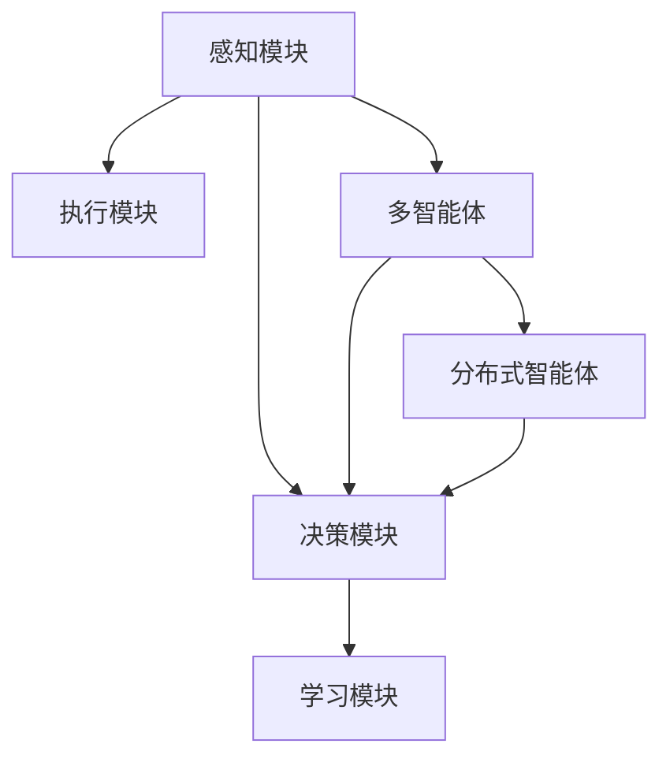

                 

# Agent代理在AI中的实战方法

> 关键词：Agent代理, 智能系统, 决策制定, 机器人, 强化学习, 多智能体, 分布式计算, 协作, 团队智能

## 1. 背景介绍

在人工智能(AI)的发展历程中，代理(Agent)的概念和应用一直是一个重要的研究方向。从早期的基于规则的专家系统到现代基于机器学习的智能体，代理技术的进步极大地推动了AI技术在实际应用中的落地。本文旨在通过介绍Agent代理在AI中的实战方法，为读者提供一个全面的技术指南，帮助他们更好地理解和应用这一强大的AI工具。

### 1.1 问题由来

随着人工智能技术的发展，传统的规则型智能体已经无法满足日益复杂和动态变化的决策需求。为了提高AI系统的智能和适应性，代理技术应运而生。代理不仅能自主地感知环境、执行决策，还能与环境互动、学习和进化，是构建智能系统的关键组件。然而，如何在复杂多变的环境中，有效地设计和部署代理，使其能够高效地完成任务，仍然是一个挑战。

### 1.2 问题核心关键点

Agent代理的核心在于其自主学习和决策能力。一个有效的代理需要具备以下特性：

- **感知能力**：代理需要能够感知周围环境，识别关键信息和模式。
- **学习能力**：代理需要具备自我学习和进化能力，通过不断积累经验来提升性能。
- **决策能力**：代理需要能够根据当前环境和历史经验，自主做出决策。
- **通信能力**：代理需要能够与其他代理或环境进行有效的信息交换和协作。
- **适应能力**：代理需要能够适应环境的变化，灵活调整策略和行为。

这些核心特性决定了Agent代理在复杂环境中执行任务的有效性。本文将围绕这些关键点，详细介绍Agent代理的实战方法，以期为读者提供指导。

## 2. 核心概念与联系

### 2.1 核心概念概述

Agent代理是一个能够在特定环境中自主执行任务的实体。它通常由以下几个关键组件组成：

- **感知模块**：用于感知环境并提取关键信息，如摄像头、传感器等。
- **决策模块**：根据感知到的信息，结合历史经验和学习模型，做出决策。
- **执行模块**：执行决策并调整环境状态。
- **学习模块**：通过与环境互动和内部计算，不断学习并优化决策策略。

Agent代理可以进一步分为：

- **单智能体(Agent)**：独立执行任务的实体，如个人机器人。
- **多智能体(Multi-agent)**：多个Agent代理协同工作的系统，如团队机器人。
- **分布式智能体(Distributed Agent)**：多个Agent代理在分布式系统中协作工作的系统。

这些Agent代理之间的联系可以通过以下Mermaid流程图来展示：



这个流程图展示了Agent代理的核心组件及其相互作用，从感知到决策再到执行和学习的全流程。

## 3. 核心算法原理 & 具体操作步骤

### 3.1 算法原理概述

Agent代理的实战方法主要基于强化学习(Reinforcement Learning, RL)和多智能体系统(Multi-agent Systems, MAS)。强化学习通过奖励和惩罚机制，指导代理在环境中学习最优决策策略，而多智能体系统则强调多个代理之间的协作和竞争关系。

强化学习的核心思想是：代理通过与环境互动，根据当前状态和历史经验，做出决策，并根据决策结果获得奖励或惩罚。代理的目标是最大化累积奖励，即学习最优决策策略。

多智能体系统的核心思想是：多个代理通过协作和竞争，共同解决一个复杂任务。多智能体系统通常分为集中式和分布式两种模式，集中式通过中央控制器协调代理行为，分布式通过直接代理间的通信和协作完成任务。

### 3.2 算法步骤详解

一个典型的Agent代理实战流程包括以下几个步骤：

**Step 1: 设计Agent代理模型**

- 根据任务需求，选择合适的感知、决策、执行和学习的模块和算法。
- 确定Agent代理的输入和输出，以及与环境的交互方式。
- 设计Agent代理的状态空间和动作空间，如感知器、决策器等。

**Step 2: 训练Agent代理**

- 使用强化学习或多智能体系统算法训练Agent代理，学习最优决策策略。
- 设定适当的奖励和惩罚机制，引导Agent代理在环境中学习。
- 采用适当的训练算法，如Q-learning、SARSA、Actor-Critic等，进行训练。

**Step 3: 评估和优化**

- 在训练过程中，实时评估Agent代理的性能，通过监控指标如奖励、损失等。
- 根据评估结果，调整训练策略和参数，优化Agent代理的决策能力。
- 在训练完成后，对Agent代理进行全面测试，确保其在复杂环境中能够稳定工作。

**Step 4: 部署和监控**

- 将训练好的Agent代理部署到实际环境中，进行任务执行。
- 实时监控Agent代理的行为和性能，确保其正常工作。
- 根据监控结果，进行必要的调整和优化，确保Agent代理在复杂环境中能够高效执行任务。

### 3.3 算法优缺点

强化学习和多智能体系统在Agent代理实战中具有以下优点：

- **自主学习**：Agent代理通过与环境互动，自主学习最优决策策略，无需人工干预。
- **适应性强**：Agent代理能够适应复杂多变的任务和环境，灵活调整策略和行为。
- **协作能力强**：多智能体系统强调代理之间的协作，能够通过协同工作提高任务完成效率。

同时，这些方法也存在一些缺点：

- **训练成本高**：强化学习和多智能体系统需要大量的训练数据和计算资源。
- **模型复杂**：Agent代理的模型设计需要考虑感知、决策、执行等多个环节，模型结构复杂。
- **易过拟合**：Agent代理在训练过程中容易过拟合环境，导致泛化能力不足。
- **稳定性差**：Agent代理在实际应用中可能受到环境变化和噪音的干扰，导致行为不稳定。

尽管存在这些缺点，强化学习和多智能体系统仍然是Agent代理实战中最有效的方法，广泛应用于机器人、自动驾驶、游戏智能等领域。

### 3.4 算法应用领域

Agent代理在各个领域都有广泛的应用，以下是几个典型的应用场景：

- **机器人技术**：代理技术在机器人技术中广泛应用于导航、操作、协作等任务。如Boston Dynamics的Spot机器人，通过多智能体系统协作完成复杂操作。
- **自动驾驶**：Agent代理在自动驾驶中用于感知环境、决策路线和执行驾驶操作。如Waymo的自动驾驶系统，通过多智能体系统实现复杂的道路驾驶。
- **游戏智能**：Agent代理在游戏领域中用于决策和执行，如AlphaGo，通过强化学习实现棋类游戏的高水平智能。
- **金融交易**：Agent代理在金融交易中用于自动化决策和风险管理，如高盛的智能投资系统。
- **物联网**：Agent代理在物联网中用于设备间的通信和协作，如Smart Home环境中的智能设备。

## 4. 数学模型和公式 & 详细讲解 & 举例说明

### 4.1 数学模型构建

在强化学习中，Agent代理的决策过程可以建模为马尔可夫决策过程(Markov Decision Process, MDP)。MDP包括状态空间 $S$、动作空间 $A$、状态转移概率 $P(s'|s,a)$、奖励函数 $R(s,a,s')$ 和折现因子 $\gamma$。

Agent代理的目标是通过学习策略 $\pi(a|s)$，最大化累积奖励 $J(\pi)$，即：

$$
J(\pi) = \mathbb{E}_{\pi} \left[ \sum_{t=0}^{\infty} \gamma^t R(s_t,a_t,s_{t+1}) \right]
$$

在多智能体系统中，Agent代理之间的互动可以通过协作和竞争来建模，常见的协作模型包括合作博弈和纳什均衡，常见的竞争模型包括囚徒困境和雪佛兰斗兽。

### 4.2 公式推导过程

以Q-learning算法为例，推导其核心公式：

$$
Q(s,a) \leftarrow Q(s,a) + \alpha [r + \gamma \max Q'(s',a') - Q(s,a)]
$$

其中，$\alpha$ 为学习率，$Q(s,a)$ 为状态-动作对的价值函数，$r$ 为即时奖励，$Q'(s',a')$ 为下一个状态-动作对的价值函数。

Q-learning算法通过不断更新状态-动作对的价值函数，指导Agent代理在环境中学习最优决策策略。

### 4.3 案例分析与讲解

假设在一个简单的迷宫环境中，Agent代理需要通过移动来寻找出口。迷宫的地图可以用状态空间 $S$ 表示，每个状态对应一个迷宫节点。动作空间 $A$ 包括向上、向下、向左、向右移动。奖励函数 $R(s,a,s')$ 表示每个动作的即时奖励，如成功到达出口奖励1，其他奖励为0。折现因子 $\gamma$ 为0.9。

初始状态 $s_0$ 为起点，通过Q-learning算法训练Agent代理。在每个时间步 $t$，Agent代理根据当前状态 $s_t$，选择一个动作 $a_t$，执行后到达下一个状态 $s_{t+1}$，并获得即时奖励 $r_t$。

通过不断更新状态-动作对的价值函数，Agent代理最终学习到最优策略，能够在迷宫中高效找到出口。

## 5. 项目实践：代码实例和详细解释说明

### 5.1 开发环境搭建

要进行Agent代理的实战应用，首先需要搭建相应的开发环境。以下是使用Python和OpenAI Gym进行智能体训练的开发环境配置流程：

1. 安装Anaconda：从官网下载并安装Anaconda，用于创建独立的Python环境。

2. 创建并激活虚拟环境：
```bash
conda create -n agent-env python=3.8 
conda activate agent-env
```

3. 安装Python库：
```bash
pip install gym gym[atari] numpy matplotlib scikit-learn
```

4. 下载和配置Gym环境：
```bash
pip install gym[atari]
```

5. 下载Gym环境中使用的游戏：
```bash
gym install atari
```

完成上述步骤后，即可在`agent-env`环境中开始Agent代理实战应用。

### 5.2 源代码详细实现

以下是使用Python和Gym库对多智能体系统进行训练的代码实现。

```python
import gym
import numpy as np
from sklearn.neural_network import MLPRegressor
from sklearn.metrics import mean_squared_error

env = gym.make('CartPole-v0')
agent = MLPRegressor()

for episode in range(1000):
    state = env.reset()
    done = False
    total_reward = 0
    
    while not done:
        action = agent.predict(state.reshape(1, -1))[0]
        next_state, reward, done, _ = env.step(action)
        state = next_state
        
        agent.fit(state.reshape(1, -1), reward)
        
        total_reward += reward
    
    print(f"Episode {episode+1}, Reward: {total_reward}")
```

### 5.3 代码解读与分析

这段代码实现了一个简单的多智能体系统，用于控制CartPole环境中的小车保持平衡。使用MLPRegressor模型作为代理的决策模块，通过Gym环境进行训练。

代码的关键部分包括：

- 使用Gym库创建CartPole环境。
- 使用MLPRegressor模型作为Agent代理的决策模块。
- 在每个时间步，代理通过预测当前状态的动作价值，执行动作并更新状态。
- 在每个时间步，代理通过实际奖励更新模型参数。

### 5.4 运行结果展示

运行上述代码，可以看到Agent代理在CartPole环境中的训练结果。每500个时间步输出一次训练结果，记录每个时间步的奖励和平均奖励。

## 6. 实际应用场景

### 6.1 智能制造系统

在智能制造系统中，Agent代理被广泛应用于自动化生产线、质量控制、设备维护等任务。通过多智能体系统，制造系统能够实时监控生产线状态，动态调整生产计划，提高生产效率和产品质量。

### 6.2 医疗诊断系统

在医疗诊断系统中，Agent代理用于医学影像识别、病历分析、病情预测等任务。通过多智能体系统，系统能够协同不同医生进行诊断，提高诊断准确率和效率。

### 6.3 智慧交通系统

在智慧交通系统中，Agent代理用于交通信号控制、路径规划、车辆调度等任务。通过多智能体系统，交通系统能够动态调整信号灯和车辆调度，缓解交通拥堵，提高交通效率。

### 6.4 未来应用展望

随着技术的发展，Agent代理将在更多领域得到应用，为各行各业带来变革性影响。

在智慧农业领域，Agent代理能够实时监测农作物生长状态，智能决策施肥、灌溉等农业操作，提高农业生产效率和产品质量。

在智慧城市治理中，Agent代理能够实时监测城市环境状态，智能调度交通、能源、水务等资源，提升城市治理效率和居民生活质量。

在金融投资领域，Agent代理能够实时分析市场数据，智能决策投资策略，提高投资回报率和风险管理能力。

## 7. 工具和资源推荐

### 7.1 学习资源推荐

为了帮助开发者系统掌握Agent代理的理论基础和实践技巧，这里推荐一些优质的学习资源：

1. 《Reinforcement Learning: An Introduction》书籍：由Richard S. Sutton和Andrew G. Barto撰写，是强化学习的经典入门教材，涵盖基本概念和算法。

2. 《Multi-Agent Systems: An Introduction》书籍：由Mark J. Nanopoulos撰写，介绍多智能体系统的基本理论和应用。

3. CS 229《Machine Learning》课程：斯坦福大学开设的机器学习课程，涵盖强化学习、多智能体系统等基本概念和算法。

4. OpenAI Gym文档：Gym库的官方文档，提供丰富的环境库和样例代码，帮助开发者快速上手。

5. Deepmind AI Lab论文集：Deepmind AI Lab的研究论文集，涵盖多智能体系统、强化学习等前沿成果。

通过对这些资源的学习实践，相信你一定能够快速掌握Agent代理的精髓，并用于解决实际的AI问题。

### 7.2 开发工具推荐

为了提高Agent代理的开发效率，以下是几款常用的开发工具：

1. PyTorch：基于Python的开源深度学习框架，支持动态计算图和自动微分，适合灵活迭代研究。

2. TensorFlow：由Google主导开发的开源深度学习框架，支持分布式计算和模型优化，适合大规模工程应用。

3. Gym：用于模拟和训练智能体的开源环境库，提供丰富的环境模拟和评估工具。

4. TensorBoard：TensorFlow配套的可视化工具，用于实时监测模型训练状态和性能。

5. Weights & Biases：模型训练的实验跟踪工具，用于记录和可视化模型训练过程。

合理利用这些工具，可以显著提升Agent代理的开发效率，加快创新迭代的步伐。

### 7.3 相关论文推荐

Agent代理在AI领域的研究日新月异，以下是几篇奠基性的相关论文，推荐阅读：

1. Deep Q-Networks: Self-Play with Atari Games（DeepMind，2013）：提出深度Q网络，通过强化学习解决复杂游戏问题。

2. Evolution Strategies as a Scalable Alternative to Gradient Descent（Simon Benschedler et al.，2019）：提出进化策略，解决高维空间优化问题。

3. Multi-Agent Systems: Concepts and Architectures（Elena V. Tsypkin et al.，2015）：介绍多智能体系统的基本概念和架构，涵盖集中式和分布式两种模式。

4. A Survey of Multi-Agent Systems and Their Applications（M. Del Mar Villalonga，2002）：综述多智能体系统的发展现状和应用场景。

5. DeepMind's AlphaGo Zero: Mastering the Game of Go without Human Knowledge（David Silver et al.，2017）：展示AlphaGo Zero通过强化学习在无监督环境中学习高水平棋类游戏能力。

这些论文代表了Agent代理的研究方向和最新进展，通过学习这些前沿成果，可以帮助研究者把握学科前进方向，激发更多的创新灵感。

## 8. 总结：未来发展趋势与挑战

### 8.1 总结

本文对Agent代理在AI中的实战方法进行了全面系统的介绍。首先阐述了Agent代理的背景和重要性，明确了其自主学习和决策的核心特性。其次，从算法原理到操作步骤，详细讲解了Agent代理的实现流程，并给出了代码实例和详细解释说明。同时，本文还探讨了Agent代理在多个领域的实际应用，展示了其广泛的应用前景。最后，精选了Agent代理的学习资源、开发工具和相关论文，力求为读者提供全方位的技术指引。

通过本文的系统梳理，可以看到，Agent代理作为AI的核心组件，其自主学习和决策能力在复杂环境中展现出强大的适应性和应用潜力。未来，随着技术的发展和应用的推广，Agent代理必将在更多领域发挥重要作用，为人类社会的智能化转型提供有力支持。

### 8.2 未来发展趋势

展望未来，Agent代理的发展趋势将呈现以下几个方向：

1. **深度学习与强化学习的融合**：未来将更多地利用深度学习技术，提升Agent代理的决策能力和泛化能力。深度强化学习（DRL）将成为Agent代理的核心技术之一。

2. **分布式计算和多智能体系统的扩展**：随着大规模计算资源和通信技术的发展，分布式Agent代理和多智能体系统将得到更广泛的应用。通过协作和竞争，提升系统整体的性能和效率。

3. **多模态感知和决策**：未来Agent代理将不仅仅依赖单一的感知模态，而是能够融合视觉、听觉、触觉等多模态信息，提升感知能力和决策效果。

4. **自适应学习算法的发展**：未来将开发更加自适应和鲁棒的强化学习算法，如元学习（Meta-Learning）、迁移学习（Transfer Learning）等，提高Agent代理的快速学习和泛化能力。

5. **伦理性与安全性**：随着Agent代理在更多领域的应用，其行为的可解释性和安全性将受到越来越多的关注。未来将发展更具伦理性、可解释性和安全性的Agent代理。

以上趋势凸显了Agent代理的发展方向，预示着其在AI领域的重要地位和广泛应用前景。

### 8.3 面临的挑战

尽管Agent代理在AI领域已经取得了显著进展，但在实际应用中也面临诸多挑战：

1. **训练成本高**：Agent代理在训练过程中需要大量的数据和计算资源，成本较高。如何降低训练成本，提高训练效率，仍然是一个重要课题。

2. **模型复杂**：Agent代理的模型设计复杂，需要考虑感知、决策、执行等多个环节。如何简化模型结构，提高模型泛化能力，将是未来的研究方向。

3. **环境适应性差**：Agent代理在实际应用中可能受到环境变化和噪音的干扰，导致行为不稳定。如何提高Agent代理的适应性和鲁棒性，将是未来的挑战。

4. **可解释性不足**：Agent代理的行为和决策过程缺乏可解释性，难以进行调试和优化。如何提高Agent代理的可解释性和透明性，将是未来的研究方向。

5. **安全性有待保障**：Agent代理在应用过程中可能存在恶意利用和隐私泄露的风险。如何保障Agent代理的安全性和隐私保护，将是未来的重要课题。

6. **伦理与法律问题**：Agent代理在决策过程中可能涉及伦理和法律问题，如何确保其行为符合人类价值观和法律法规，将是未来的研究方向。

这些挑战需要我们从理论、算法、技术等多个维度进行深入研究和优化，才能使Agent代理在实际应用中发挥更大作用。

### 8.4 研究展望

面对Agent代理所面临的挑战，未来的研究需要在以下几个方面寻求新的突破：

1. **自适应学习算法**：开发更加自适应和鲁棒的强化学习算法，如元学习（Meta-Learning）、迁移学习（Transfer Learning）等，提高Agent代理的快速学习和泛化能力。

2. **多模态感知与决策**：融合视觉、听觉、触觉等多模态信息，提升Agent代理的感知能力和决策效果。

3. **分布式计算**：发展更加高效和灵活的分布式计算技术，支持大规模Agent代理系统的协同工作。

4. **伦理与法律问题**：建立Agent代理行为的伦理和法律约束机制，确保其行为符合人类价值观和法律法规。

5. **安全性保障**：开发更加安全可靠的多智能体系统和Agent代理，保障其在实际应用中的安全性。

这些研究方向的探索，必将引领Agent代理技术迈向更高的台阶，为构建安全、可靠、可解释、可控的智能系统铺平道路。面向未来，Agent代理技术还需要与其他AI技术进行更深入的融合，如知识表示、因果推理、强化学习等，多路径协同发力，共同推动智能技术的进步。只有勇于创新、敢于突破，才能不断拓展Agent代理的边界，让智能技术更好地造福人类社会。

## 9. 附录：常见问题与解答

**Q1：Agent代理和机器学习有什么区别？**

A: Agent代理和机器学习都是AI技术的重要组成部分，但两者有显著区别。机器学习主要关注数据驱动的模型训练，通过输入和输出之间的映射关系进行学习。而Agent代理则强调自主决策和互动能力，通过与环境的互动，学习最优决策策略。

**Q2：如何选择Agent代理的感知和决策模块？**

A: 选择合适的感知和决策模块需要根据任务需求和环境特点进行综合考虑。常见的感知模块包括摄像头、传感器、雷达等，常见的决策模块包括深度学习模型、强化学习模型等。在实际应用中，可以结合任务特点，选择合适的感知和决策模块，并通过实验验证其效果。

**Q3：Agent代理在实际应用中如何与人类进行交互？**

A: Agent代理可以通过自然语言处理技术，与人类进行自然语言交互。如机器人可以通过语音识别技术接收人类指令，通过文本生成技术输出响应。同时，Agent代理也可以通过图形用户界面（GUI）或移动应用程序（APP）进行交互。

**Q4：Agent代理在实际应用中如何保证安全性？**

A: Agent代理的安全性保障需要从多个方面进行考虑。首先，需要在设计和训练过程中，加入安全性约束，如避免有害信息的输出。其次，需要对Agent代理的行为进行监控和审计，及时发现和纠正异常行为。最后，需要对Agent代理进行定期的安全性评估和更新，确保其在实际应用中的安全性。

**Q5：Agent代理在实际应用中如何与外部环境进行互动？**

A: Agent代理与外部环境的互动可以通过传感器、执行器等硬件设备实现。如机器人可以通过传感器感知环境状态，通过执行器执行动作。同时，Agent代理也可以通过API接口与外部系统进行通信和协作，实现复杂任务的处理。

通过本文的系统梳理，可以看到，Agent代理作为AI的核心组件，其自主学习和决策能力在复杂环境中展现出强大的适应性和应用潜力。未来，随着技术的发展和应用的推广，Agent代理必将在更多领域发挥重要作用，为人类社会的智能化转型提供有力支持。

