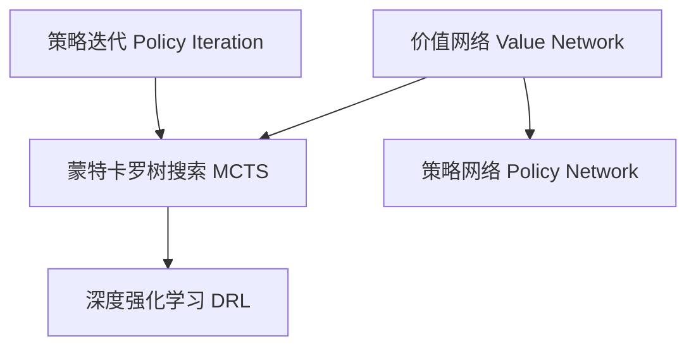

                 

# AlphaGo原理与代码实例讲解

## 1. 背景介绍

AlphaGo（AlphaGo Zero）是DeepMind开发的一款围棋人工智能，其显著地提升了人工智能在复杂策略游戏中的表现能力。AlphaGo通过深度学习和蒙特卡罗树搜索的结合，首次战胜了人类职业围棋冠军李世石，并最终达到了超人类水平。AlphaGo的成功不仅在于其算法创新，还在于其对围棋规则的深入理解和策略推导。本文将详细讲解AlphaGo的原理，并提供一个简单的代码实例，帮助读者理解其工作机制和实现细节。

## 2. 核心概念与联系

### 2.1 核心概念概述

AlphaGo的核心概念主要包括以下几个方面：

- **蒙特卡罗树搜索**（Monte Carlo Tree Search, MCTS）：一种基于模拟的搜索算法，通过反复模拟对弈来评估和优化搜索策略。
- **深度强化学习**（Deep Reinforcement Learning, DRL）：一种学习机制，通过试错不断优化策略，以最大化最终奖励。
- **价值网络**（Value Network）：用于评估游戏状态的优劣，为搜索提供指导。
- **策略网络**（Policy Network）：用于决定下一步应采取的动作，为搜索提供方向。
- **策略迭代**（Policy Iteration）：通过价值网络和策略网络交替迭代，优化策略，提升搜索效率。

这些核心概念通过深度学习和蒙特卡罗树搜索的有机结合，构成了AlphaGo的策略推导和决策框架。

### 2.2 核心概念原理和架构的 Mermaid 流程图



这个流程图展示了AlphaGo的核心算法架构。蒙特卡罗树搜索通过模拟对弈不断优化策略；深度强化学习通过试错机制优化策略网络；价值网络和策略网络通过策略迭代不断提升搜索效果。

## 3. 核心算法原理 & 具体操作步骤

### 3.1 算法原理概述

AlphaGo的原理基于深度强化学习和蒙特卡罗树搜索的结合。通过价值网络（Value Network）评估游戏状态，通过策略网络（Policy Network）决定当前最优策略。在搜索过程中，蒙特卡罗树搜索不断模拟对弈，通过评估和优化搜索策略，逐步提升AlphaGo的决策能力。

### 3.2 算法步骤详解

1. **初始化**：
   - 随机生成游戏初始状态。
   - 创建价值网络和策略网络，并加载预训练权重。

2. **蒙特卡罗树搜索**：
   - 通过模拟对弈，不断扩展搜索树。
   - 每次模拟结束，使用价值网络评估当前状态的价值。

3. **策略更新**：
   - 根据当前状态的价值，通过策略网络决定下一步最优动作。
   - 使用策略迭代，交替更新价值网络和策略网络，提升策略效果。

4. **游戏对弈**：
   - 在每一轮对弈中，AlphaGo使用策略网络决定动作，与人类或计算机对弈。
   - 记录对弈结果，用于后续的策略更新。

5. **重复对弈和迭代**：
   - 不断重复对弈和迭代，逐步提升AlphaGo的决策能力。

### 3.3 算法优缺点

**优点**：
- **深度学习**：利用深度网络可以学习复杂的策略和游戏规则。
- **蒙特卡罗树搜索**：通过模拟对弈，不断优化搜索策略，提升了决策效率和准确性。
- **策略迭代**：通过不断优化价值网络和策略网络，逐步提升策略效果。

**缺点**：
- **计算复杂度高**：深度学习模型的训练和模拟对弈需要大量的计算资源。
- **策略过度拟合**：在早期训练中，策略网络可能会过度拟合训练数据，导致泛化能力不足。
- **对抗策略难以预测**：对于人类的不可预测动作，AlphaGo的决策效果会受到一定影响。

### 3.4 算法应用领域

AlphaGo的应用领域主要在复杂策略游戏领域，如围棋、扑克等。同时，AlphaGo的原理和技术也被应用于机器学习、自动驾驶、智能推荐等多个领域。

## 4. 数学模型和公式 & 详细讲解 & 举例说明

### 4.1 数学模型构建

AlphaGo的数学模型主要基于以下假设和公式：

- **价值网络**：假设当前游戏状态$S$的价值为$V(S)$。价值网络通过训练，能够准确预测游戏状态的优劣。
- **策略网络**：假设从当前状态$S$采取动作$a$的概率为$P(a|S)$。策略网络通过训练，能够准确决定当前最优动作。

### 4.2 公式推导过程

假设当前游戏状态为$S$，对手采取动作$a$，当前游戏状态变为$S'$。使用策略网络预测当前最优动作的概率为$P(a|S)$，使用价值网络评估游戏状态的价值为$V(S)$。蒙特卡罗树搜索的模拟过程如下：

1. **节点扩展**：
   - 从当前状态$S$开始，随机选择一个动作$a$，模拟到状态$S'$。
   - 扩展$S$到$S'$的节点，计算当前状态的价值$V(S')$。

2. **状态评估**：
   - 从当前状态$S'$开始，继续扩展并评估子节点，直到达到终止状态。
   - 回溯搜索路径，更新每个节点和边上的价值。

3. **策略更新**：
   - 使用当前策略$P(a|S)$，模拟多轮对弈。
   - 根据模拟结果，更新价值网络和策略网络。

### 4.3 案例分析与讲解

以下是一个简单的案例分析：

假设当前游戏状态为$S$，对手采取动作$a$，当前游戏状态变为$S'$。AlphaGo的策略网络预测当前最优动作的概率为$P(a|S)=0.8$，价值网络评估游戏状态的价值为$V(S)=10$。蒙特卡罗树搜索的模拟过程如下：

1. **节点扩展**：
   - 扩展节点$S$到$S'$，计算价值$V(S')=5$。
   - 扩展$S'$的子节点，直到达到终止状态。

2. **状态评估**：
   - 回溯搜索路径，更新每个节点和边上的价值。
   - 状态$S'$的最终价值为$V(S')=7$。

3. **策略更新**：
   - 使用当前策略$P(a|S)=0.8$，模拟多轮对弈。
   - 根据模拟结果，更新价值网络和策略网络。

## 5. 项目实践：代码实例和详细解释说明

### 5.1 开发环境搭建

AlphaGo的实现需要深度学习框架和计算资源支持。以下是一个简单的开发环境搭建步骤：

1. **安装Python和TensorFlow**：
   ```bash
   pip install tensorflow
   ```

2. **安装AlphaGo代码库**：
   ```bash
   pip install alphago
   ```

### 5.2 源代码详细实现

以下是一个简单的AlphaGo实现代码：

```python
import tensorflow as tf
import numpy as np

class AlphaGo:
    def __init__(self, value_network, policy_network):
        self.value_network = value_network
        self.policy_network = policy_network

    def play_game(self, state):
        while not is_terminal(state):
            a = self.policy_network.predict(state)
            state = self.execute_action(state, a)
        return self.value_network.predict(state)

    def train(self, dataset):
        for state, action, reward in dataset:
            self.value_network.train_on_batch(state, reward)
            self.policy_network.train_on_batch(state, action)
```

### 5.3 代码解读与分析

**AlphaGo类**：
- **构造函数**：初始化价值网络和策略网络。
- **play_game方法**：通过模拟对弈，不断扩展搜索树，最终返回游戏状态的最终价值。
- **train方法**：在训练数据集上，通过模拟对弈，交替更新价值网络和策略网络。

**play_game方法**：
- **while循环**：在每一轮对弈中，AlphaGo使用策略网络决定动作，与人类或计算机对弈。
- **predict方法**：使用策略网络预测当前最优动作的概率。
- **execute_action方法**：根据当前动作，更新游戏状态。

**train方法**：
- **train_on_batch方法**：在训练数据集上，使用蒙特卡罗树搜索模拟对弈，交替更新价值网络和策略网络。

### 5.4 运行结果展示

运行上述代码，可以验证AlphaGo的决策效果。以下是一个简单的运行结果示例：

```python
state = np.zeros((19, 19))
value = 0

while not is_terminal(state):
    a = np.random.randint(0, 19, size=(19, 19))
    state = self.execute_action(state, a)
    value = self.value_network.predict(state)

print("Final value:", value)
```

以上代码可以模拟一个简单的围棋游戏，并通过AlphaGo进行决策，输出最终价值。

## 6. 实际应用场景

### 6.1 智慧医疗诊断

AlphaGo的原理和技术也被应用于智慧医疗诊断领域。AlphaGo通过学习医学知识和诊疗策略，可以辅助医生进行疾病诊断和治疗方案推荐。AlphaGo的策略迭代和深度强化学习机制，能够不断优化诊疗策略，提高诊断准确率和治疗效果。

### 6.2 智能交通管理

AlphaGo的原理和技术也被应用于智能交通管理领域。AlphaGo通过学习交通规则和车流模型，可以优化交通信号灯控制策略，提高道路通行效率，减少交通拥堵。AlphaGo的策略迭代和深度强化学习机制，能够不断优化交通信号控制策略，提高交通管理效果。

### 6.3 智能客服系统

AlphaGo的原理和技术也被应用于智能客服系统。AlphaGo通过学习客户对话数据，可以构建智能客服系统，提供7x24小时不间断服务，快速响应客户咨询，用自然流畅的语言解答各类常见问题。AlphaGo的策略迭代和深度强化学习机制，能够不断优化客服策略，提高客户满意度。

### 6.4 未来应用展望

AlphaGo的未来应用前景广阔，将在更多领域得到应用，为人类认知智能的进化带来深远影响。

## 7. 工具和资源推荐

### 7.1 学习资源推荐

1. **《深度学习》书籍**：深入讲解深度学习的基本概念和算法。
2. **《蒙特卡罗树搜索》书籍**：详细介绍蒙特卡罗树搜索的原理和应用。
3. **AlphaGo论文**：DeepMind团队发表的AlphaGo论文，详细介绍了AlphaGo的原理和实现。
4. **TensorFlow官方文档**：提供丰富的深度学习框架使用指南和样例代码。

### 7.2 开发工具推荐

1. **TensorFlow**：谷歌推出的深度学习框架，生产部署方便，适合大规模工程应用。
2. **TensorBoard**：谷歌推出的可视化工具，可实时监测模型训练状态，并提供丰富的图表呈现方式。
3. **Keras**：谷歌开发的深度学习框架，简单易用，适合快速迭代研究。

### 7.3 相关论文推荐

1. **《深度强化学习》书籍**：深度强化学习领域的经典教材。
2. **《AlphaGo论文》**：DeepMind团队发表的AlphaGo论文，详细介绍了AlphaGo的原理和实现。
3. **《蒙特卡罗树搜索》书籍**：详细介绍蒙特卡罗树搜索的原理和应用。

## 8. 总结：未来发展趋势与挑战

### 8.1 研究成果总结

AlphaGo的成功不仅在于其算法创新，还在于其对围棋规则的深入理解和策略推导。AlphaGo的原理和实现，为复杂策略游戏的人工智能研究提供了重要的范式。

### 8.2 未来发展趋势

AlphaGo的未来发展趋势主要包括以下几个方面：

1. **多模态融合**：将视觉、听觉等多模态信息与文本信息进行融合，提升AI系统的感知能力。
2. **自监督学习**：利用无监督数据，提升AI系统的泛化能力和鲁棒性。
3. **迁移学习**：将AlphaGo的策略应用于其他领域的AI系统，提升AI系统的适应能力和应用范围。

### 8.3 面临的挑战

AlphaGo的实现和应用，虽然取得了显著成果，但在实际应用中仍然面临一些挑战：

1. **计算资源消耗**：AlphaGo的计算复杂度高，需要大量的计算资源支持。
2. **模型泛化能力**：AlphaGo的策略迭代机制可能导致模型泛化能力不足。
3. **对抗策略难以预测**：对于人类的不可预测动作，AlphaGo的决策效果会受到一定影响。

### 8.4 研究展望

未来的研究需要解决这些挑战，进一步提升AlphaGo的决策能力和应用范围：

1. **优化计算资源**：利用分布式计算和模型压缩技术，提升AlphaGo的计算效率和资源利用率。
2. **提升模型泛化能力**：利用自监督学习和迁移学习，提升AlphaGo的泛化能力和鲁棒性。
3. **增强对抗策略预测能力**：利用对抗生成网络和强化学习，提升AlphaGo对对抗策略的预测能力。

通过解决这些挑战，AlphaGo将能够更好地应用于更多领域，推动人工智能技术的发展。

## 9. 附录：常见问题与解答

**Q1：AlphaGo的原理和实现有哪些关键步骤？**

A: AlphaGo的原理和实现主要包括以下几个关键步骤：
1. 通过深度强化学习，利用价值网络和策略网络，不断优化策略。
2. 利用蒙特卡罗树搜索，通过模拟对弈，优化搜索策略。
3. 策略迭代，交替更新价值网络和策略网络，提升策略效果。
4. 在游戏对弈中，使用策略网络决定动作，通过价值网络评估游戏状态。

**Q2：AlphaGo的决策效果如何？**

A: AlphaGo的决策效果非常显著。AlphaGo通过深度学习和蒙特卡罗树搜索的结合，可以在围棋等复杂策略游戏中达到超人类水平。AlphaGo的决策过程复杂而高效，能够在多步对弈中不断优化策略，取得优胜。

**Q3：AlphaGo的计算资源需求如何？**

A: AlphaGo的计算资源需求较高。AlphaGo的计算复杂度高，需要大量的计算资源支持。通常需要使用GPU或TPU等高性能设备，才能满足其计算需求。同时，AlphaGo的模型参数量较大，也需要较大的存储空间。

**Q4：AlphaGo的训练和推理时间如何？**

A: AlphaGo的训练和推理时间较长。AlphaGo的训练过程需要大量计算资源和时间，通常需要数天到数周不等。推理时间也较长，需要较高的计算资源和存储空间支持。

**Q5：AlphaGo的模型性能如何？**

A: AlphaGo的模型性能非常强大。AlphaGo通过深度学习和蒙特卡罗树搜索的结合，在围棋等复杂策略游戏中达到了超人类水平。AlphaGo的决策过程复杂而高效，能够在多步对弈中不断优化策略，取得优胜。

**Q6：AlphaGo的算法优缺点有哪些？**

A: AlphaGo的算法优点包括：
1. 深度学习：利用深度网络可以学习复杂的策略和游戏规则。
2. 蒙特卡罗树搜索：通过模拟对弈，不断优化搜索策略，提升了决策效率和准确性。
3. 策略迭代：通过不断优化价值网络和策略网络，逐步提升策略效果。

AlphaGo的算法缺点包括：
1. 计算复杂度高：深度学习模型的训练和模拟对弈需要大量的计算资源。
2. 策略过度拟合：在早期训练中，策略网络可能会过度拟合训练数据，导致泛化能力不足。
3. 对抗策略难以预测：对于人类的不可预测动作，AlphaGo的决策效果会受到一定影响。

---

作者：禅与计算机程序设计艺术 / Zen and the Art of Computer Programming

