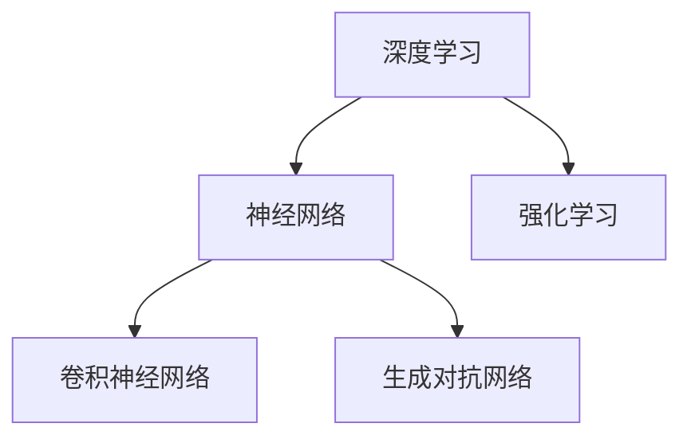

                 

# Andrej Karpathy的AI演讲内容

> 关键词：深度学习, 神经网络, 计算机视觉, 强化学习, 自动驾驶, 大规模模型训练, 卷积神经网络, 生成对抗网络

## 1. 背景介绍

### 1.1 问题由来
Andrej Karpathy是计算机视觉和深度学习领域的杰出研究者和工程师。他的演讲和教学视频深受全球AI社区的欢迎，内容覆盖了深度学习、神经网络、计算机视觉、强化学习、自动驾驶等多个前沿领域。本文将梳理他的演讲内容，从深度学习的原理、应用和未来发展方向进行全面介绍，希望能为读者提供有益的指导。

### 1.2 问题核心关键点
Karpathy的演讲深入浅出，内容广泛。其核心演讲内容围绕以下几个关键点展开：

- **深度学习原理**：介绍深度神经网络的结构和训练原理，包括前馈网络、卷积神经网络、生成对抗网络等。
- **计算机视觉**：讲解计算机视觉任务的基本原理和关键技术，如物体检测、语义分割、实例分割等。
- **强化学习**：探讨强化学习的核心思想、算法和应用，特别是在自动驾驶等复杂系统中。
- **大规模模型训练**：分享在大规模数据集上训练神经网络的最佳实践和常见挑战。
- **生成对抗网络(GANs)**：讲解GANs的原理、应用和最新进展，包括StyleGAN、GANs在图像生成和修复中的效果。

这些内容共同构成了Karpathy演讲的核心框架，通过其精辟的讲解和丰富的实例，帮助我们更好地理解深度学习和计算机视觉技术的发展和应用。

## 2. 核心概念与联系

### 2.1 核心概念概述

为更好地理解Karpathy演讲的核心内容，本节将介绍几个密切相关的核心概念：

- **深度学习**：一种通过构建多层神经网络模型进行复杂任务处理的机器学习方法。
- **神经网络**：由大量节点（神经元）和边（连接）组成，通过训练调整权重，完成输入到输出的映射。
- **卷积神经网络(CNNs)**：一种专门处理图像、视频等二维数据的神经网络，利用卷积层和池化层提取特征。
- **生成对抗网络(GANs)**：由生成器和判别器两个对立网络组成，通过对抗训练生成逼真的图像或视频。
- **强化学习**：通过智能体与环境的交互，通过奖励信号优化策略，实现复杂任务的自动化决策。

这些核心概念之间的逻辑关系可以通过以下Mermaid流程图来展示：



这个流程图展示了大规模深度学习的应用领域：

1. 深度学习通过构建多层神经网络处理复杂任务。
2. 卷积神经网络处理图像、视频等二维数据。
3. 生成对抗网络生成逼真图像和视频。
4. 强化学习通过智能体与环境交互优化策略。

这些概念共同构成了Karpathy演讲的理论基础，帮助我们更好地理解其核心内容。

## 3. 核心算法原理 & 具体操作步骤
### 3.1 算法原理概述

Karpathy的演讲涉及多个算法原理，以下将分别介绍这些算法的核心内容：

#### 3.1.1 深度学习

深度学习通过多层非线性变换，学习数据的复杂表示。其核心思想是通过反向传播算法训练模型参数，最小化预测输出与真实标签之间的误差。

公式表示为：
$$
\min_{\theta} \mathcal{L}(\theta) = \frac{1}{N}\sum_{i=1}^N \ell(y_i, f(x_i; \theta))
$$
其中 $\theta$ 为模型参数，$x_i$ 为输入样本，$y_i$ 为真实标签，$\ell$ 为损失函数，$f$ 为模型预测函数。

#### 3.1.2 卷积神经网络

卷积神经网络（CNNs）通过卷积层和池化层提取局部特征，然后通过全连接层进行分类或回归。CNNs在图像和视频处理任务中表现出色。

卷积层公式为：
$$
h(x) = \sigma(\sum_{i,j} w_{i,j} * x_{i,j})
$$
其中 $x_{i,j}$ 为输入特征，$w_{i,j}$ 为卷积核，$\sigma$ 为激活函数。

#### 3.1.3 生成对抗网络

生成对抗网络（GANs）由生成器和判别器两个网络组成。生成器网络学习生成逼真数据，判别器网络学习区分真实数据和生成数据。两个网络通过对抗训练提高性能。

生成器公式为：
$$
G(z) = \mu + \sigma(z)
$$
其中 $z$ 为随机噪声向量，$\mu$ 为均值，$\sigma$ 为标准差。

判别器公式为：
$$
D(x) = \frac{1}{N}\sum_{i=1}^N \log\sigma(x_i) + \frac{1}{N}\sum_{i=1}^N \log(1-\sigma(x_i))
$$

#### 3.1.4 强化学习

强化学习通过智能体与环境的交互，通过奖励信号优化策略。核心算法包括Q-learning和策略梯度方法等。

Q-learning公式为：
$$
Q(s_t, a_t) \leftarrow (1-\alpha)Q(s_t, a_t) + \alpha(r_t + \gamma \max_{a'} Q(s_{t+1}, a'))
$$
其中 $s_t$ 为当前状态，$a_t$ 为当前动作，$r_t$ 为即时奖励，$\alpha$ 为学习率，$\gamma$ 为折扣因子。

### 3.2 算法步骤详解

Karpathy的演讲涉及多个算法的具体操作步骤，以下将分别介绍这些算法的基本流程：

#### 3.2.1 深度学习

深度学习训练步骤包括数据预处理、模型定义、模型训练和模型评估。具体步骤为：

1. **数据预处理**：将原始数据转化为模型能够处理的格式，如标准化、归一化、数据增强等。
2. **模型定义**：构建神经网络模型，包括定义输入层、隐藏层和输出层。
3. **模型训练**：使用训练数据集进行模型训练，通过反向传播算法更新模型参数。
4. **模型评估**：使用测试数据集评估模型性能，如准确率、精确率、召回率等指标。

#### 3.2.2 卷积神经网络

CNNs训练步骤包括数据预处理、模型定义、模型训练和模型评估。具体步骤为：

1. **数据预处理**：将原始图像转化为模型能够处理的格式，如灰度化、归一化、数据增强等。
2. **模型定义**：构建卷积神经网络模型，包括定义卷积层、池化层和全连接层。
3. **模型训练**：使用训练数据集进行模型训练，通过反向传播算法更新模型参数。
4. **模型评估**：使用测试数据集评估模型性能，如准确率、精确率、召回率等指标。

#### 3.2.3 生成对抗网络

GANs训练步骤包括数据预处理、生成器网络训练、判别器网络训练和模型评估。具体步骤为：

1. **数据预处理**：将原始数据转化为模型能够处理的格式，如标准化、归一化、数据增强等。
2. **生成器网络训练**：使用随机噪声向量训练生成器网络，生成逼真数据。
3. **判别器网络训练**：使用训练数据和生成数据训练判别器网络，区分真实数据和生成数据。
4. **模型评估**：使用测试数据集评估模型性能，如FID、IS等指标。

#### 3.2.4 强化学习

强化学习训练步骤包括智能体定义、环境定义、策略定义和模型训练。具体步骤为：

1. **智能体定义**：定义智能体行为策略，如Q网络、策略网络等。
2. **环境定义**：定义环境状态和奖励函数。
3. **策略定义**：定义智能体行为策略，如Q-learning策略、策略梯度策略等。
4. **模型训练**：使用训练数据集进行模型训练，通过奖励信号优化策略。

### 3.3 算法优缺点

#### 3.3.1 深度学习

深度学习优点：
- 能够处理复杂的数据表示，自动学习特征表示。
- 通过深度网络，可以处理高维数据和非线性关系。
- 在计算机视觉、语音识别等领域表现优异。

深度学习缺点：
- 需要大量数据和计算资源，训练时间长。
- 过拟合问题严重，需要复杂的网络结构和大规模数据。
- 模型难以解释，缺乏可解释性。

#### 3.3.2 卷积神经网络

CNNs优点：
- 处理二维数据效果好，如图像、视频等。
- 参数量少，训练速度较快。
- 特征共享机制，提高参数利用率。

CNNs缺点：
- 处理一维数据效果较差，如文本。
- 网络结构固定，难以处理多任务。
- 特征提取受限于卷积核大小和数量。

#### 3.3.3 生成对抗网络

GANs优点：
- 生成逼真数据效果好，如高分辨率图像。
- 通过对抗训练，提高模型性能。
- 可以生成未标注数据，扩大数据集。

GANs缺点：
- 训练过程不稳定，存在模式崩溃等问题。
- 生成数据质量依赖于网络结构。
- 需要大量计算资源，训练时间长。

#### 3.3.4 强化学习

强化学习优点：
- 能够处理复杂动态系统，如自动驾驶。
- 通过奖励信号优化策略，实现自主决策。
- 可以应对非结构化数据，如图像、文本等。

强化学习缺点：
- 需要大量训练数据和计算资源，训练时间长。
- 需要设计合适的奖励函数，可能存在局部最优解。
- 难以解释决策过程，缺乏可解释性。

### 3.4 算法应用领域

Karpathy的演讲涉及多个算法的应用领域，以下将分别介绍这些算法的应用场景：

#### 3.4.1 深度学习

深度学习广泛应用于计算机视觉、语音识别、自然语言处理等领域。

**计算机视觉**：图像分类、物体检测、图像分割等任务。

**语音识别**：语音识别、语音合成、语音翻译等任务。

**自然语言处理**：文本分类、命名实体识别、情感分析等任务。

#### 3.4.2 卷积神经网络

CNNs主要应用于计算机视觉领域，如图像分类、物体检测、图像分割等任务。

#### 3.4.3 生成对抗网络

GANs主要应用于图像生成、图像修复、图像增强等领域。

**图像生成**：生成逼真图像，如图像超分辨率、艺术风格转换等。

**图像修复**：修复损坏的图像，如图像去模糊、图像去噪声等。

**图像增强**：增强图像质量，如超分辨率、去雾、去雨等。

#### 3.4.4 强化学习

强化学习主要应用于自动驾驶、机器人控制、游戏AI等领域。

**自动驾驶**：通过智能体与环境的交互，实现自动驾驶。

**机器人控制**：通过智能体与环境的交互，实现机器人自主导航。

**游戏AI**：通过智能体与游戏环境的交互，实现游戏AI。

## 4. 数学模型和公式 & 详细讲解 & 举例说明

### 4.1 数学模型构建

Karpathy的演讲涉及多个数学模型的构建，以下将分别介绍这些模型的核心内容：

#### 4.1.1 深度学习

深度学习模型由输入层、多个隐藏层和输出层组成。每个隐藏层由多个神经元组成，通过权重矩阵连接前后层。

#### 4.1.2 卷积神经网络

卷积神经网络由卷积层、池化层和全连接层组成。卷积层通过卷积核提取局部特征，池化层通过池化操作减少特征尺寸。

#### 4.1.3 生成对抗网络

生成对抗网络由生成器和判别器两个网络组成。生成器网络学习生成逼真数据，判别器网络学习区分真实数据和生成数据。

#### 4.1.4 强化学习

强化学习模型由智能体、环境和奖励函数组成。智能体通过策略选择动作，环境根据动作返回状态和奖励。

### 4.2 公式推导过程

#### 4.2.1 深度学习

深度学习模型训练的损失函数为交叉熵损失函数：
$$
\mathcal{L} = -\frac{1}{N}\sum_{i=1}^N \sum_{c=1}^C y_{i,c} \log p_{i,c}
$$
其中 $y_{i,c}$ 为真实标签，$p_{i,c}$ 为模型预测概率。

#### 4.2.2 卷积神经网络

卷积神经网络中的卷积层公式为：
$$
h(x) = \sigma(\sum_{i,j} w_{i,j} * x_{i,j})
$$
其中 $x_{i,j}$ 为输入特征，$w_{i,j}$ 为卷积核，$\sigma$ 为激活函数。

#### 4.2.3 生成对抗网络

生成对抗网络中的生成器网络公式为：
$$
G(z) = \mu + \sigma(z)
$$
其中 $z$ 为随机噪声向量，$\mu$ 为均值，$\sigma$ 为标准差。

判别器网络公式为：
$$
D(x) = \frac{1}{N}\sum_{i=1}^N \log\sigma(x_i) + \frac{1}{N}\sum_{i=1}^N \log(1-\sigma(x_i))
$$

#### 4.2.4 强化学习

强化学习中的Q-learning公式为：
$$
Q(s_t, a_t) \leftarrow (1-\alpha)Q(s_t, a_t) + \alpha(r_t + \gamma \max_{a'} Q(s_{t+1}, a'))
$$
其中 $s_t$ 为当前状态，$a_t$ 为当前动作，$r_t$ 为即时奖励，$\alpha$ 为学习率，$\gamma$ 为折扣因子。

### 4.3 案例分析与讲解

#### 4.3.1 深度学习

深度学习在计算机视觉领域的应用实例：
- **图像分类**：使用卷积神经网络对图像进行分类，如LeNet、AlexNet、VGGNet等。
- **物体检测**：使用区域卷积神经网络（R-CNN）、YOLO等模型进行物体检测。

#### 4.3.2 卷积神经网络

卷积神经网络在图像分类中的应用实例：
- **LeNet**：用于手写数字识别。
- **AlexNet**：用于图像分类。
- **VGGNet**：用于图像分类。

#### 4.3.3 生成对抗网络

生成对抗网络在图像生成中的应用实例：
- **StyleGAN**：用于生成逼真的人脸图像。
- **GANs**：用于生成逼真的图像和视频，如GANs、DCGANs等。

#### 4.3.4 强化学习

强化学习在自动驾驶中的应用实例：
- **DeepMind的AlphaGo**：通过强化学习在围棋中战胜人类顶尖选手。
- **OpenAI的DQN**：通过强化学习训练自动驾驶模型。

## 5. 项目实践：代码实例和详细解释说明

### 5.1 开发环境搭建

在进行项目实践前，我们需要准备好开发环境。以下是使用Python进行TensorFlow开发的环境配置流程：

1. 安装Anaconda：从官网下载并安装Anaconda，用于创建独立的Python环境。

2. 创建并激活虚拟环境：
```bash
conda create -n tensorflow-env python=3.8 
conda activate tensorflow-env
```

3. 安装TensorFlow：根据CUDA版本，从官网获取对应的安装命令。例如：
```bash
conda install tensorflow-gpu=2.8.0
```

4. 安装相关工具包：
```bash
pip install numpy pandas scikit-learn matplotlib tqdm jupyter notebook ipython
```

完成上述步骤后，即可在`tensorflow-env`环境中开始项目实践。

### 5.2 源代码详细实现

这里以一个简单的图像分类任务为例，展示使用TensorFlow构建卷积神经网络并进行图像分类的过程。

首先，定义卷积神经网络模型：

```python
import tensorflow as tf

class ConvNet(tf.keras.Model):
    def __init__(self):
        super(ConvNet, self).__init__()
        self.conv1 = tf.keras.layers.Conv2D(32, (3, 3), activation='relu')
        self.pool1 = tf.keras.layers.MaxPooling2D((2, 2))
        self.conv2 = tf.keras.layers.Conv2D(64, (3, 3), activation='relu')
        self.pool2 = tf.keras.layers.MaxPooling2D((2, 2))
        self.flatten = tf.keras.layers.Flatten()
        self.d1 = tf.keras.layers.Dense(128, activation='relu')
        self.d2 = tf.keras.layers.Dense(10)

    def call(self, x):
        x = self.conv1(x)
        x = self.pool1(x)
        x = self.conv2(x)
        x = self.pool2(x)
        x = self.flatten(x)
        x = self.d1(x)
        return self.d2(x)
```

然后，加载数据集并进行预处理：

```python
(train_images, train_labels), (test_images, test_labels) = tf.keras.datasets.cifar10.load_data()

train_images = train_images / 255.0
test_images = test_images / 255.0

train_dataset = tf.data.Dataset.from_tensor_slices((train_images, train_labels)).shuffle(10000).batch(64)
test_dataset = tf.data.Dataset.from_tensor_slices((test_images, test_labels)).batch(64)
```

接着，定义训练和评估函数：

```python
def train_step(images, labels):
    with tf.GradientTape() as tape:
        logits = model(images)
        loss = tf.keras.losses.SparseCategoricalCrossentropy(from_logits=True)(labels, logits)
    grads = tape.gradient(loss, model.trainable_variables)
    optimizer.apply_gradients(zip(grads, model.trainable_variables))

def evaluate_step(images, labels):
    logits = model(images)
    predictions = tf.argmax(logits, axis=1)
    accuracy = tf.reduce_mean(tf.cast(tf.equal(predictions, labels), tf.float32))
    return accuracy

@tf.function
def train_epoch(dataset):
    for images, labels in dataset:
        train_step(images, labels)

@tf.function
def evaluate_epoch(dataset):
    accuracy = 0.0
    for images, labels in dataset:
        accuracy += evaluate_step(images, labels)
    return accuracy.numpy()

for epoch in range(10):
    train_epoch(train_dataset)
    accuracy = evaluate_epoch(test_dataset)
    print('Epoch {}, Test Accuracy: {}'.format(epoch+1, accuracy))
```

最后，启动训练流程并在测试集上评估：

```python
@tf.function
def train_epoch(dataset):
    for images, labels in dataset:
        train_step(images, labels)

@tf.function
def evaluate_epoch(dataset):
    accuracy = 0.0
    for images, labels in dataset:
        accuracy += evaluate_step(images, labels)
    return accuracy.numpy()

for epoch in range(10):
    train_epoch(train_dataset)
    accuracy = evaluate_epoch(test_dataset)
    print('Epoch {}, Test Accuracy: {}'.format(epoch+1, accuracy))
```

以上就是使用TensorFlow构建卷积神经网络并进行图像分类的完整代码实现。可以看到，通过TensorFlow的高级API，构建卷积神经网络并进行图像分类变得非常简单。

### 5.3 代码解读与分析

让我们再详细解读一下关键代码的实现细节：

**ConvNet类**：
- `__init__`方法：定义卷积神经网络的结构，包括卷积层、池化层和全连接层。
- `call`方法：实现前向传播，将输入图像通过卷积层、池化层和全连接层进行处理，最终输出分类结果。

**数据集加载和预处理**：
- 使用`tf.keras.datasets.cifar10.load_data()`加载CIFAR-10数据集。
- 将图像归一化到0-1之间，并进行数据增强和批次化处理。

**训练和评估函数**：
- 定义`train_step`函数：在每个训练批次上前向传播计算损失，反向传播更新模型参数。
- 定义`evaluate_step`函数：在每个测试批次上计算模型的准确率。
- 使用`tf.function`将训练和评估函数定义为TensorFlow图，以提高性能。

**训练和评估流程**：
- 定义总的epoch数，开始循环迭代
- 每个epoch内，在训练集上训练，输出测试集上的准确率
- 所有epoch结束后，输出测试集上的最终准确率

可以看到，TensorFlow的高级API使得构建卷积神经网络和进行图像分类变得非常便捷。开发者可以将更多精力放在模型改进和超参数调优等高层逻辑上，而不必过多关注底层的实现细节。

当然，工业级的系统实现还需考虑更多因素，如模型的保存和部署、超参数的自动搜索、更灵活的任务适配层等。但核心的卷积神经网络构建和图像分类流程基本与此类似。

## 6. 实际应用场景

### 6.1 智能客服系统

基于大语言模型微调的对话技术，可以广泛应用于智能客服系统的构建。传统客服往往需要配备大量人力，高峰期响应缓慢，且一致性和专业性难以保证。而使用微调后的对话模型，可以7x24小时不间断服务，快速响应客户咨询，用自然流畅的语言解答各类常见问题。

在技术实现上，可以收集企业内部的历史客服对话记录，将问题和最佳答复构建成监督数据，在此基础上对预训练对话模型进行微调。微调后的对话模型能够自动理解用户意图，匹配最合适的答案模板进行回复。对于客户提出的新问题，还可以接入检索系统实时搜索相关内容，动态组织生成回答。如此构建的智能客服系统，能大幅提升客户咨询体验和问题解决效率。

### 6.2 金融舆情监测

金融机构需要实时监测市场舆论动向，以便及时应对负面信息传播，规避金融风险。传统的人工监测方式成本高、效率低，难以应对网络时代海量信息爆发的挑战。基于大语言模型微调的文本分类和情感分析技术，为金融舆情监测提供了新的解决方案。

具体而言，可以收集金融领域相关的新闻、报道、评论等文本数据，并对其进行主题标注和情感标注。在此基础上对预训练语言模型进行微调，使其能够自动判断文本属于何种主题，情感倾向是正面、中性还是负面。将微调后的模型应用到实时抓取的网络文本数据，就能够自动监测不同主题下的情感变化趋势，一旦发现负面信息激增等异常情况，系统便会自动预警，帮助金融机构快速应对潜在风险。

### 6.3 个性化推荐系统

当前的推荐系统往往只依赖用户的历史行为数据进行物品推荐，无法深入理解用户的真实兴趣偏好。基于大语言模型微调技术，个性化推荐系统可以更好地挖掘用户行为背后的语义信息，从而提供更精准、多样的推荐内容。

在实践中，可以收集用户浏览、点击、评论、分享等行为数据，提取和用户交互的物品标题、描述、标签等文本内容。将文本内容作为模型输入，用户的后续行为（如是否点击、购买等）作为监督信号，在此基础上微调预训练语言模型。微调后的模型能够从文本内容中准确把握用户的兴趣点。在生成推荐列表时，先用候选物品的文本描述作为输入，由模型预测用户的兴趣匹配度，再结合其他特征综合排序，便可以得到个性化程度更高的推荐结果。

### 6.4 未来应用展望

随着大语言模型微调技术的发展，其在NLP领域的应用将越来越广泛。未来，基于微调范式将在更多领域得到应用，为传统行业带来变革性影响。

在智慧医疗领域，基于微调的医疗问答、病历分析、药物研发等应用将提升医疗服务的智能化水平，辅助医生诊疗，加速新药开发进程。

在智能教育领域，微调技术可应用于作业批改、学情分析、知识推荐等方面，因材施教，促进教育公平，提高教学质量。

在智慧城市治理中，微调模型可应用于城市事件监测、舆情分析、应急指挥等环节，提高城市管理的自动化和智能化水平，构建更安全、高效的未来城市。

此外，在企业生产、社会治理、文娱传媒等众多领域，基于大模型微调的人工智能应用也将不断涌现，为经济社会发展注入新的动力。相信随着技术的日益成熟，微调方法将成为人工智能落地应用的重要范式，推动人工智能技术在垂直行业的规模化落地。总之，微调需要开发者根据具体任务，不断迭代和优化模型、数据和算法，方能得到理想的效果。

## 7. 工具和资源推荐
### 7.1 学习资源推荐

为了帮助开发者系统掌握深度学习和计算机视觉技术，这里推荐一些优质的学习资源：

1. 《深度学习》（Ian Goodfellow著）：全面介绍了深度学习的基本原理和核心算法。
2. 《计算机视觉：算法与应用》（Richard Szeliski著）：详细讲解了计算机视觉的基础知识和核心技术。
3. 《动手学深度学习》（李沐、阿斯顿·张等著）：由清华大学团队编写，内容全面、代码示例丰富，适合学习深度学习。
4. 《TensorFlow官方文档》：详细介绍了TensorFlow的使用方法和最佳实践，是TensorFlow开发的重要参考。
5. 《PyTorch官方文档》：详细介绍了PyTorch的使用方法和最佳实践，是PyTorch开发的重要参考。

通过对这些资源的学习实践，相信你一定能够快速掌握深度学习和计算机视觉技术的精髓，并用于解决实际的NLP问题。
###  7.2 开发工具推荐

高效的开发离不开优秀的工具支持。以下是几款用于深度学习和计算机视觉开发的常用工具：

1. TensorFlow：由Google主导开发的开源深度学习框架，生产部署方便，适合大规模工程应用。

2. PyTorch：由Facebook主导开发的开源深度学习框架，灵活动态的计算图，适合快速迭代研究。

3. Keras：高层次的神经网络API，易于使用，适合快速搭建原型和开发实验。

4. OpenCV：开源计算机视觉库，提供了丰富的图像处理和计算机视觉算法。

5. Matplotlib：数据可视化工具，可以绘制各类图形和图表，便于数据分析和展示。

6. Jupyter Notebook：交互式编程环境，支持多语言的代码混合编程，便于研究和分享。

合理利用这些工具，可以显著提升深度学习和计算机视觉任务的开发效率，加快创新迭代的步伐。

### 7.3 相关论文推荐

深度学习和计算机视觉领域的研究涉及众多前沿论文，以下是几篇具有代表性的相关论文，推荐阅读：

1. LeCun Y.，Bengio Y.，Hinton G.E.：《深度学习》（Deep Learning）：全面介绍了深度学习的基本原理和核心算法。

2. Goodfellow I.，Bengio Y.，Courville A.：《深度学习》（Deep Learning）：详细讲解了深度学习的核心思想和最新进展。

3. Sermanet P.，Zagoruyko S.，Chen M.，Bang J.，Dai J.，Joly A.，M Momani H.，Xu M.：《用深度卷积神经网络学习语音特征》（Learning Deep Features Using a Convolutional Network）：介绍了卷积神经网络在语音处理中的应用。

4. Krizhevsky A.，Sutskever I.，Hinton G.E.：《ImageNet分类：使用深度卷积神经网络的视觉识别》（ImageNet Classification with Deep Convolutional Neural Networks）：展示了卷积神经网络在图像分类任务上的出色表现。

5. Ian Goodfellow，Jean Pouget-Abadie，Mehdi Mirza，Bing Xu，David Warde-Farley，Sherjil Ozair，Aaron Courville，Yoshua Bengio：《生成对抗网络》（Generative Adversarial Nets）：提出了生成对抗网络，并通过对抗训练生成逼真数据。

这些论文代表了深度学习和计算机视觉领域的最新研究成果，通过学习这些前沿成果，可以帮助研究者把握学科前进方向，激发更多的创新灵感。

## 8. 总结：未来发展趋势与挑战

### 8.1 总结

本文对Andrej Karpathy的AI演讲内容进行了全面系统的介绍。首先阐述了深度学习、卷积神经网络、生成对抗网络和强化学习的基本原理和核心算法，并从理论到实践，详细讲解了深度学习和计算机视觉技术的应用。通过本文的系统梳理，可以看到，深度学习和计算机视觉技术正在快速发展和应用，未来将带来更多的创新和突破。

通过本文的系统梳理，可以看到，基于深度学习和计算机视觉技术的应用场景正在不断拓展，未来将带来更多的创新和突破。深度学习和计算机视觉技术已经成为人工智能领域的重要组成部分，其应用领域广泛，涉及计算机视觉、语音识别、自然语言处理等多个方向。

### 8.2 未来发展趋势

展望未来，深度学习和计算机视觉技术将呈现以下几个发展趋势：

1. 深度学习模型的规模将持续增大。随着算力成本的下降和数据规模的扩张，预训练深度学习模型的参数量还将持续增长。超大规模深度学习模型蕴含的丰富语言知识，有望支撑更加复杂多变的下游任务。

2. 计算机视觉任务的难度将持续提高。随着计算力的提升，计算机视觉任务的分辨率和复杂度将不断提升，需要更强大的模型和算法支持。

3. 生成对抗网络将进一步完善。随着生成对抗网络的应用逐渐深入，相关技术将不断完善，生成图像和视频的质量将显著提升。

4. 强化学习将应用于更复杂的系统。随着强化学习技术的不断成熟，其将在自动驾驶、机器人控制、游戏AI等领域得到更广泛的应用。

5. 多模态深度学习将得到更多关注。随着深度学习模型应用领域的扩展，多模态深度学习技术将逐渐成为热点，融合视觉、语音、文本等多种模态的数据，提升模型的综合表现。

6. 深度学习在医疗、教育等领域将得到更广泛应用。随着深度学习技术的不断成熟，其在医疗、教育、金融等领域的应用将更加广泛，推动这些领域的技术进步。

### 8.3 面临的挑战

尽管深度学习和计算机视觉技术已经取得了瞩目成就，但在迈向更加智能化、普适化应用的过程中，它们仍面临着诸多挑战：

1. 标注成本瓶颈。尽管深度学习在数据量较大的任务上表现优异，但对于一些特定领域的任务，如医学、法律等，需要大量高质量标注数据，成本较高。如何进一步降低深度学习对标注样本的依赖，将是一大难题。

2. 模型鲁棒性不足。当前深度学习模型面对域外数据时，泛化性能往往大打折扣。对于测试样本的微小扰动，深度学习模型的预测也容易发生波动。如何提高深度学习模型的鲁棒性，避免灾难性遗忘，还需要更多理论和实践的积累。

3. 推理效率有待提高。深度学习模型虽然精度高，但在实际部署时往往面临推理速度慢、内存占用大等效率问题。如何在保证性能的同时，简化模型结构，提升推理速度，优化资源占用，将是重要的优化方向。

4. 可解释性亟需加强。当前深度学习模型更像是"黑盒"系统，难以解释其内部工作机制和决策逻辑。对于医疗、金融等高风险应用，算法的可解释性和可审计性尤为重要。如何赋予深度学习模型更强的可解释性，将是亟待攻克的难题。

5. 安全性有待保障。深度学习模型难免会学习到有偏见、有害的信息，通过微调传递到下游任务，产生误导性、歧视性的输出，给实际应用带来安全隐患。如何从数据和算法层面消除模型偏见，避免恶意用途，确保输出的安全性，也将是重要的研究课题。

### 8.4 研究展望

面对深度学习和计算机视觉技术面临的种种挑战，未来的研究需要在以下几个方面寻求新的突破：

1. 探索无监督和半监督深度学习方法。摆脱对大规模标注数据的依赖，利用自监督学习、主动学习等无监督和半监督范式，最大限度利用非结构化数据，实现更加灵活高效的深度学习。

2. 研究深度学习模型的鲁棒性和泛化性。开发更加鲁棒和泛化的深度学习模型，增强模型在多样数据上的表现。

3. 探索高效推理技术。开发高效的深度学习推理技术，提升推理速度和资源利用率。

4. 增强深度学习模型的可解释性。开发可解释性强的深度学习模型，增强模型决策过程的透明性。

5. 研究数据隐私和安全保护技术。开发保护数据隐私和安全的深度学习技术，确保深度学习应用的公平性和安全性。

6. 探索跨模态深度学习技术。开发跨模态深度学习技术，融合视觉、语音、文本等多种模态的数据，提升模型的综合表现。

这些研究方向将引领深度学习和计算机视觉技术迈向更高的台阶，为构建安全、可靠、可解释、可控的智能系统铺平道路。面向未来，深度学习和计算机视觉技术还需要与其他人工智能技术进行更深入的融合，如知识表示、因果推理、强化学习等，多路径协同发力，共同推动人工智能技术的发展。只有勇于创新、敢于突破，才能不断拓展深度学习和计算机视觉技术的边界，让智能技术更好地造福人类社会。

## 9. 附录：常见问题与解答

**Q1：深度学习模型是否适用于所有NLP任务？**

A: 深度学习模型在大多数NLP任务上都能取得不错的效果，特别是对于数据量较大的任务。但对于一些特定领域的任务，如医学、法律等，仅依赖通用语料预训练的模型可能难以很好地适应。此时需要在特定领域语料上进一步预训练，再进行微调，才能获得理想效果。此外，对于一些需要时效性、个性化很强的任务，如对话、推荐等，深度学习模型也需要针对性的改进优化。

**Q2：深度学习模型的训练过程中如何避免过拟合？**

A: 深度学习模型的过拟合问题可以通过以下方法解决：
1. 数据增强：通过回译、近义替换等方式扩充训练集。
2. 正则化技术：使用L2正则、Dropout、Early Stopping等避免过拟合。
3. 模型裁剪：去除不必要的层和参数，减小模型尺寸。
4. 混合精度训练：使用更少的内存进行模型训练，提高效率。
5. 模型并行：通过多卡并行训练，提高训练速度。

**Q3：深度学习模型在实际部署时需要注意哪些问题？**

A: 将深度学习模型转化为实际应用，还需要考虑以下因素：
1. 模型裁剪：去除不必要的层和参数，减小模型尺寸，加快推理速度。
2. 量化加速：将浮点模型转为定点模型，压缩存储空间，提高计算效率。
3. 服务化封装：将模型封装为标准化服务接口，便于集成调用。
4. 弹性伸缩：根据请求流量动态调整资源配置，平衡服务质量和成本。
5. 监控告警：实时采集系统指标，设置异常告警阈值，确保服务稳定性。
6. 安全防护：采用访问鉴权、数据脱敏等措施，保障数据和模型安全。

深度学习模型在实际部署时需要注意这些问题，确保模型能够稳定、高效地运行。

---

作者：禅与计算机程序设计艺术 / Zen and the Art of Computer Programming

