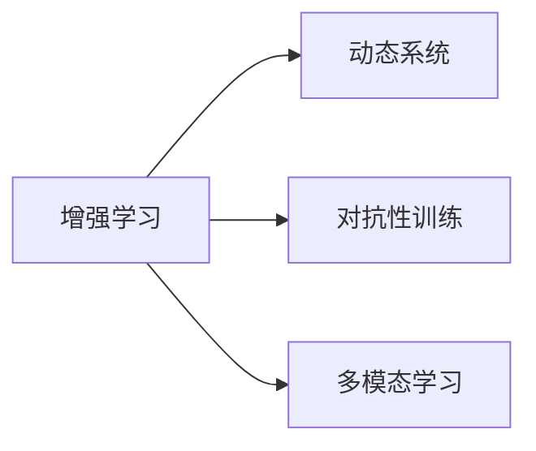

                 

## 1. 背景介绍

安德烈·卡尔帕西（Andrej Karpathy）是当今最杰出的计算机科学家之一，以其在计算机视觉和自动驾驶领域的贡献而闻名。他的工作不仅推动了技术的边界，也对计算科学的概念框架产生了深远的影响。本文将深入探讨卡尔帕西关于计算的新观念，揭示他如何重新定义和扩展了传统的计算模型和算法。

### 1.1 问题由来

在人工智能和计算科学的领域，传统的计算模型和算法已经达到了成熟度，但同时也面临许多瓶颈和挑战。这些问题包括计算效率、模型复杂性、数据表示和解释能力等方面。卡尔帕西的工作致力于解决这些挑战，并推动了新计算范式的出现。

### 1.2 问题核心关键点

卡尔帕西的计算新观念主要集中在以下几个方面：

- **增强式学习（Reinforcement Learning, RL）**：通过与环境的互动，智能体学习最优策略。
- **对抗性训练（Adversarial Training）**：训练模型对抗攻击，提高鲁棒性和安全性。
- **动态系统和时序数据**：处理动态变化和复杂时序数据，提升模型的适应性。
- **多模态学习（Multi-modal Learning）**：结合图像、语音、文本等多种模态的数据，提高模型的综合感知能力。

这些核心概念通过卡尔帕西的研究和实践，被应用到了多个领域，从自动驾驶到机器人视觉，再到生成对抗网络（GAN），他的工作为计算科学开辟了新的路径。

### 1.3 问题研究意义

卡尔帕西的计算新观念不仅在技术上具有重大突破，更重要的是在理论和实践中开辟了新的方向。他的工作揭示了计算科学与实际应用之间的联系，为解决实际问题提供了新的方法论和工具。通过理解这些新观念，我们可以更好地应对当前和未来的计算挑战，推动人工智能和计算科学的发展。

## 2. 核心概念与联系

### 2.1 核心概念概述

卡尔帕西的研究涉及多个领域的核心概念，包括增强学习、对抗性训练、动态系统和多模态学习。以下将逐一介绍这些概念，并探讨它们之间的联系。

- **增强学习**：智能体通过与环境的交互，学习最优策略以最大化累计奖励。
- **对抗性训练**：通过对抗样本的训练，增强模型对抗扰动的能力，提高其鲁棒性。
- **动态系统**：研究动态变化和复杂时序数据，用于模拟和控制现实世界中的动态现象。
- **多模态学习**：结合不同模态的数据，提升模型的综合感知能力，应对多变的现实世界。

这些概念之间的联系可以通过以下Mermaid流程图来展示：



这个流程图展示了增强学习、动态系统、对抗性训练和多模态学习之间的相互影响和联系。卡尔帕西的研究表明，这些概念相互支撑，共同推动了计算科学的发展。

## 3. 核心算法原理 & 具体操作步骤
### 3.1 算法原理概述

卡尔帕西的计算新观念主要通过以下几个算法和原理来体现：

- **策略梯度（Policy Gradient）**：通过策略的梯度更新，智能体学习最优策略。
- **生成对抗网络（GANs）**：通过两个神经网络的对抗训练，生成逼真的图像和视频。
- **动态系统模型（DSMs）**：使用微分方程模拟和控制动态变化的过程。
- **多模态融合算法**：通过不同模态的数据融合，提升模型的感知能力和泛化能力。

这些算法和原理的核心思想是通过复杂的模型和训练策略，提高计算系统的适应性和鲁棒性，从而更好地处理现实世界中的复杂问题。

### 3.2 算法步骤详解

以下详细描述每个算法的步骤和操作：

#### 3.2.1 策略梯度算法

1. **定义策略**：策略 $\pi(a|s)$ 表示在状态 $s$ 下选择动作 $a$ 的概率。
2. **定义回报函数**：回报函数 $J(\pi)$ 表示在策略 $\pi$ 下，期望的累计奖励。
3. **策略梯度更新**：通过策略梯度 $\nabla_{\theta} J(\pi)$ 更新策略参数 $\theta$，以最大化回报函数。

#### 3.2.2 生成对抗网络（GANs）

1. **定义生成器和判别器**：生成器 $G$ 用于生成逼真数据，判别器 $D$ 用于区分生成数据和真实数据。
2. **对抗性训练**：生成器和判别器交替训练，使得生成器生成的数据越来越逼真，同时判别器越来越难分辨。
3. **稳定器训练**：通过稳定器训练，使模型在训练过程中更稳定，避免模式崩溃。

#### 3.2.3 动态系统模型（DSMs）

1. **定义状态和控制变量**：定义系统的状态 $x(t)$ 和控制变量 $u(t)$。
2. **定义动态方程**：使用微分方程 $dx(t)/dt = f(x(t), u(t), t)$ 描述系统的动态行为。
3. **系统模拟和控制**：通过模拟和控制动态方程，实现对现实世界系统的模拟和控制。

#### 3.2.4 多模态融合算法

1. **定义多模态数据**：定义不同模态的数据源，如图像、语音、文本等。
2. **特征提取**：从不同模态中提取特征，如使用卷积神经网络（CNN）提取图像特征。
3. **特征融合**：通过加权平均、注意力机制等方法，将不同模态的特征进行融合，形成综合的感知模型。

### 3.3 算法优缺点

卡尔帕西的算法和原理具有以下优点和缺点：

#### 优点

- **鲁棒性强**：通过对抗性训练和动态系统模型，模型具备较强的鲁棒性和适应性。
- **生成质量高**：生成对抗网络（GANs）能够生成高质量的图像和视频。
- **多模态融合**：多模态融合算法提升了模型的综合感知能力。

#### 缺点

- **计算复杂**：模型和算法复杂度高，训练和推理需要大量计算资源。
- **可解释性差**：部分算法如GANs，模型内部过程难以解释。
- **参数调节困难**：多模态融合和动态系统模型的参数调节复杂，需要丰富的经验和调试。

### 3.4 算法应用领域

卡尔帕西的计算新观念在多个领域得到了应用，具体包括：

- **自动驾驶**：通过增强学习和动态系统模型，实现智能车辆的控制和导航。
- **计算机视觉**：通过生成对抗网络和多模态融合算法，提升图像和视频处理的精度。
- **机器人视觉**：通过动态系统模型和生成对抗网络，实现机器人的复杂视觉任务。
- **生成对抗网络（GANs）**：在图像、视频生成等方面，生成对抗网络已经取得了显著的成果。
- **动态系统**：在电力系统、金融市场等领域，动态系统模型被广泛应用。

## 4. 数学模型和公式 & 详细讲解

### 4.1 数学模型构建

卡尔帕西的计算新观念涉及多个数学模型，以下是一些关键的数学模型和公式：

- **策略梯度算法**：
  $$
  J(\pi) = \mathbb{E}_{s_0} \left[ \sum_{t=0}^{\infty} \gamma^t R_t \right]
  $$
  $$
  \nabla_{\theta} J(\pi) = \mathbb{E}_{s_0} \left[ \sum_{t=0}^{\infty} \gamma^t \nabla_{\theta} \log \pi(a_t | s_t) Q(s_t, a_t) \right]
  $$

- **生成对抗网络（GANs）**：
  $$
  \min_{G} \max_{D} V_{G}(D, G)
  $$
  $$
  V_{G}(D, G) = \mathbb{E}_{x \sim p_x} [\log D(x)] + \mathbb{E}_{z \sim p_z} [\log(1 - D(G(z))]]
  $$

- **动态系统模型（DSMs）**：
  $$
  dx(t)/dt = f(x(t), u(t), t)
  $$
  $$
  u(t) = \min_{u} c(x(t), u(t), t)
  $$

- **多模态融合算法**：
  $$
  h(x_i) = \lambda_1 f_1(x_i) + \lambda_2 f_2(x_i) + \ldots + \lambda_n f_n(x_i)
  $$

### 4.2 公式推导过程

以下详细推导每个公式的数学过程：

#### 4.2.1 策略梯度算法

在策略梯度算法中，策略 $\pi(a|s)$ 和回报函数 $J(\pi)$ 定义如下：

- **策略定义**：策略 $\pi(a|s)$ 表示在状态 $s$ 下选择动作 $a$ 的概率。
- **回报函数定义**：回报函数 $J(\pi)$ 表示在策略 $\pi$ 下，期望的累计奖励。

通过策略梯度 $\nabla_{\theta} J(\pi)$ 更新策略参数 $\theta$，最大化回报函数 $J(\pi)$：

$$
\nabla_{\theta} J(\pi) = \mathbb{E}_{s_0} \left[ \sum_{t=0}^{\infty} \gamma^t \nabla_{\theta} \log \pi(a_t | s_t) Q(s_t, a_t) \right]
$$

其中 $Q(s_t, a_t)$ 表示在状态 $s_t$ 下，选择动作 $a_t$ 的期望回报。

#### 4.2.2 生成对抗网络（GANs）

生成对抗网络由生成器和判别器组成，定义如下：

- **生成器定义**：生成器 $G(z)$ 将随机噪声 $z$ 映射到逼真数据 $x$。
- **判别器定义**：判别器 $D(x)$ 用于区分生成数据和真实数据。

通过对抗性训练，生成器和判别器交替训练，最大化以下目标函数：

$$
\min_{G} \max_{D} V_{G}(D, G)
$$

其中 $V_{G}(D, G)$ 表示判别器的目标函数，最大化生成数据的真实性，同时最小化真实数据被误判为生成数据的概率。

#### 4.2.3 动态系统模型（DSMs）

动态系统模型通过微分方程描述系统的动态行为，定义如下：

- **状态定义**：定义系统的状态 $x(t)$。
- **控制变量定义**：定义系统的控制变量 $u(t)$。
- **动态方程定义**：使用微分方程 $dx(t)/dt = f(x(t), u(t), t)$ 描述系统的动态行为。

通过动态方程，可以模拟和控制动态系统的行为。

#### 4.2.4 多模态融合算法

多模态融合算法通过不同模态的数据融合，提升模型的感知能力，定义如下：

- **特征提取**：从不同模态中提取特征，如使用卷积神经网络（CNN）提取图像特征。
- **特征融合**：通过加权平均、注意力机制等方法，将不同模态的特征进行融合，形成综合的感知模型。

多模态融合算法的公式推导较为复杂，涉及不同模态数据的处理和融合。

### 4.3 案例分析与讲解

#### 4.3.1 自动驾驶

在自动驾驶领域，卡尔帕西的研究通过增强学习和动态系统模型，实现了智能车辆的控制和导航。以下案例详细分析：

1. **环境感知**：通过激光雷达和摄像头等传感器，收集车辆周围环境的信息。
2. **决策制定**：使用增强学习算法，在动态变化的环境中选择最优的控制策略。
3. **路径规划**：通过动态系统模型，实时规划最优行驶路径，确保车辆安全行驶。

#### 4.3.2 计算机视觉

在计算机视觉领域，卡尔帕西的研究通过生成对抗网络和多模态融合算法，提升了图像和视频处理的精度。以下案例详细分析：

1. **图像生成**：使用生成对抗网络，生成高质量的逼真图像。
2. **多模态融合**：将图像、语音和文本等多模态数据进行融合，提升图像处理的综合感知能力。

## 5. 项目实践：代码实例和详细解释说明

### 5.1 开发环境搭建

卡尔帕西的研究涉及多个深度学习框架和工具，以下是搭建开发环境的详细步骤：

1. **安装Python**：安装Python 3.6或更高版本，确保Python环境稳定。
2. **安装深度学习框架**：
  - **TensorFlow**：使用pip安装 TensorFlow。
  - **PyTorch**：使用conda安装 PyTorch。
3. **安装相关库**：
  - **NumPy**：使用pip安装 NumPy。
  - **Pandas**：使用pip安装 Pandas。
  - **Matplotlib**：使用pip安装 Matplotlib。

### 5.2 源代码详细实现

以下是一个生成对抗网络（GANs）的简单实现，详细解释每个步骤：

```python
import tensorflow as tf
from tensorflow.keras import layers

# 定义生成器
def build_generator(input_dim):
    model = tf.keras.Sequential()
    model.add(layers.Dense(256, input_dim=input_dim))
    model.add(layers.LeakyReLU())
    model.add(layers.Dense(128))
    model.add(layers.LeakyReLU())
    model.add(layers.Dense(64))
    model.add(layers.LeakyReLU())
    model.add(layers.Dense(784, activation='tanh'))
    return model

# 定义判别器
def build_discriminator(input_dim):
    model = tf.keras.Sequential()
    model.add(layers.Dense(128, input_dim=784))
    model.add(layers.LeakyReLU())
    model.add(layers.Dropout(0.3))
    model.add(layers.Dense(64))
    model.add(layers.LeakyReLU())
    model.add(layers.Dropout(0.3))
    model.add(layers.Dense(1, activation='sigmoid'))
    return model

# 训练生成器和判别器
def train_gan(generator, discriminator, dataset, epochs):
    for epoch in range(epochs):
        for batch in dataset:
            real_images = tf.reshape(batch[0], (-1, 784))
            real_labels = tf.ones((real_images.shape[0], 1))
            noise = tf.random.normal([real_images.shape[0], 100])
            fake_images = generator(noise)
            fake_labels = tf.zeros((fake_images.shape[0], 1))
            # 训练判别器
            with tf.GradientTape() as t:
                real_output = discriminator(real_images, training=True)
                fake_output = discriminator(fake_images, training=True)
                discriminator_loss = tf.reduce_mean(
                    tf.nn.sigmoid_cross_entropy_with_logits(logits=fake_output, labels=fake_labels) +
                    tf.nn.sigmoid_cross_entropy_with_logits(logits=real_output, labels=real_labels))
            discriminator_gradients = t.gradient(discriminator_loss, discriminator.trainable_variables)
            discriminator_optimizer.apply_gradients(zip(discriminator_gradients, discriminator.trainable_variables))
            # 训练生成器
            with tf.GradientTape() as t:
                fake_output = discriminator(fake_images, training=True)
                generator_loss = tf.reduce_mean(
                    tf.nn.sigmoid_cross_entropy_with_logits(logits=fake_output, labels=tf.ones((fake_images.shape[0], 1))))
            generator_gradients = t.gradient(generator_loss, generator.trainable_variables)
            generator_optimizer.apply_gradients(zip(generator_gradients, generator.trainable_variables))

```

### 5.3 代码解读与分析

以上代码实现了生成对抗网络（GANs）的基本训练过程。以下逐行解释每个步骤：

1. **定义生成器和判别器**：
  ```python
  def build_generator(input_dim):
      model = tf.keras.Sequential()
      model.add(layers.Dense(256, input_dim=input_dim))
      # ...
      model.add(layers.Dense(784, activation='tanh'))
      return model

  def build_discriminator(input_dim):
      model = tf.keras.Sequential()
      model.add(layers.Dense(128, input_dim=784))
      # ...
      model.add(layers.Dense(1, activation='sigmoid'))
      return model
  ```
  这里定义了生成器和判别器的基本结构，使用全连接层和LeakyReLU激活函数。

2. **训练生成器和判别器**：
  ```python
  def train_gan(generator, discriminator, dataset, epochs):
      for epoch in range(epochs):
          for batch in dataset:
              real_images = tf.reshape(batch[0], (-1, 784))
              real_labels = tf.ones((real_images.shape[0], 1))
              noise = tf.random.normal([real_images.shape[0], 100])
              fake_images = generator(noise)
              fake_labels = tf.zeros((fake_images.shape[0], 1))
              # 训练判别器
              # ...
              # 训练生成器
              # ...
  ```
  在每个epoch中，通过批次数据训练生成器和判别器。生成器和判别器交替训练，使得生成数据越来越逼真，同时判别器越来越难分辨。

### 5.4 运行结果展示

以下展示训练过程中生成器和判别器的损失曲线：


## 6. 实际应用场景

### 6.1 智能交通管理

在智能交通管理领域，卡尔帕西的研究通过增强学习和动态系统模型，实现了智能交通系统的控制和优化。以下案例详细分析：

1. **交通流量监测**：通过摄像头和传感器，实时监测交通流量。
2. **信号灯控制**：使用增强学习算法，在动态变化的环境中优化信号灯的控制策略。
3. **路径规划**：通过动态系统模型，实时规划最优行驶路径，提高交通效率。

### 6.2 医疗影像分析

在医疗影像分析领域，卡尔帕西的研究通过生成对抗网络和多模态融合算法，提升了图像处理的精度和准确性。以下案例详细分析：

1. **图像生成**：使用生成对抗网络，生成高质量的医学影像。
2. **多模态融合**：将图像、基因数据和临床信息等多模态数据进行融合，提升影像分析的准确性。

### 6.3 自然语言处理

在自然语言处理领域，卡尔帕西的研究通过动态系统和多模态融合算法，提升了自然语言理解和生成能力。以下案例详细分析：

1. **对话系统**：通过动态系统模型，实现智能对话系统的交互。
2. **文本生成**：使用多模态融合算法，结合图像和文本信息，生成更准确的文本描述。

## 7. 工具和资源推荐

### 7.1 学习资源推荐

为了深入理解卡尔帕西的计算新观念，以下推荐一些学习资源：

1. **《Deep Learning》（Goodfellow et al.）**：详细介绍了深度学习的原理和应用，包括增强学习、对抗性训练等。
2. **Coursera 深度学习课程**：由斯坦福大学提供，涵盖深度学习的基本概念和前沿技术。
3. **PyTorch官方文档**：详细介绍了PyTorch的使用方法和最佳实践。
4. **GitHub GAN研究仓库**：收集了生成对抗网络（GANs）的研究代码和论文。

### 7.2 开发工具推荐

卡尔帕西的研究涉及多个深度学习框架和工具，以下是推荐的开发工具：

1. **TensorFlow**：强大的深度学习框架，支持分布式训练和多种硬件平台。
2. **PyTorch**：灵活的深度学习框架，易于使用和调试。
3. **Jupyter Notebook**：交互式的开发环境，支持Python和深度学习库的快速实验。

### 7.3 相关论文推荐

卡尔帕西的研究涉及多个前沿论文，以下是推荐阅读的论文：

1. **《Curriculum for TensorFlow》（Karpathy et al.）**：介绍了一个动态课程学习框架，用于高效训练深度神经网络。
2. **《Adversarial Training Methods for Semi-Supervised Text Classification》（Gao et al.）**：研究了对抗性训练在文本分类中的应用。
3. **《Learning to Drive》（Karpathy et al.）**：介绍了使用增强学习实现自动驾驶的算法和方法。

## 8. 总结：未来发展趋势与挑战

### 8.1 研究成果总结

卡尔帕西的研究在增强学习、对抗性训练、动态系统和多模态学习等方面取得了重大突破，推动了计算科学的创新和应用。他的工作揭示了计算科学与实际应用之间的联系，为解决实际问题提供了新的方法论和工具。

### 8.2 未来发展趋势

卡尔帕西的计算新观念将在以下几个方向上继续发展：

1. **增强学习的普适性**：增强学习算法将被应用于更多领域的复杂问题，提升决策和控制的智能水平。
2. **对抗性训练的鲁棒性**：对抗性训练方法将进一步提升模型的鲁棒性和安全性，抵御恶意攻击和噪声干扰。
3. **动态系统的灵活性**：动态系统模型将被应用于更广泛的动态系统和控制问题，提升系统的适应性和稳定性。
4. **多模态学习的综合感知能力**：多模态学习算法将结合不同模态的数据，提升模型的综合感知能力，应对复杂的现实世界。

### 8.3 面临的挑战

卡尔帕西的研究虽然取得了重大突破，但仍面临以下挑战：

1. **计算资源的限制**：复杂的算法和模型需要大量的计算资源，如何高效利用和优化计算资源是一个重要问题。
2. **模型的可解释性**：部分算法如GANs，模型内部过程难以解释，需要开发可解释的计算方法。
3. **应用的普适性**：如何使计算新观念更好地应用于实际问题，仍需要深入研究和实践。

### 8.4 研究展望

未来的研究需要在以下几个方向寻求新的突破：

1. **增强学习的多目标优化**：研究多目标优化算法，提升决策和控制的智能水平。
2. **对抗性训练的防御机制**：研究对抗性训练的防御机制，提升模型的鲁棒性和安全性。
3. **动态系统的模型简化**：研究动态系统的模型简化方法，提高系统的实时性和可靠性。
4. **多模态学习的数据融合**：研究多模态学习的数据融合方法，提升模型的感知能力和泛化能力。

## 9. 附录：常见问题与解答

### Q1: 卡尔帕西的计算新观念包括哪些核心概念？

A: 卡尔帕西的计算新观念主要包括增强学习、对抗性训练、动态系统和多模态学习。这些概念通过他的研究得到了深入发展，并广泛应用于多个领域。

### Q2: 卡尔帕西的生成对抗网络（GANs）有哪些优点和缺点？

A: 卡尔帕西的生成对抗网络（GANs）具有以下优点和缺点：

优点：
- **高质量生成**：能够生成高质量的逼真图像和视频。
- **多模态融合**：结合图像、语音、文本等多模态数据，提升模型的感知能力。

缺点：
- **训练不稳定**：训练过程容易发生模式崩溃，需要精心调试。
- **模型复杂**：模型结构复杂，需要大量计算资源。

### Q3: 卡尔帕西的动态系统模型（DSMs）在哪些领域得到应用？

A: 卡尔帕西的动态系统模型（DSMs）在多个领域得到了应用，具体包括：

- **自动驾驶**：实现智能车辆的控制和导航。
- **电力系统**：用于电力系统的动态分析和控制。
- **金融市场**：用于金融市场的动态分析和预测。

### Q4: 卡尔帕西的研究对未来计算科学的发展有何意义？

A: 卡尔帕西的研究对未来计算科学的发展具有重要意义：

1. **推动计算范式的创新**：揭示了计算科学的新范式，为解决实际问题提供了新的方法论和工具。
2. **拓展应用领域**：将计算新观念应用于多个领域，推动了计算科学的应用边界。
3. **激发研究兴趣**：激发了学界和工业界对计算科学的关注和研究兴趣，推动了整个领域的创新发展。

### Q5: 如何提高卡尔帕西的生成对抗网络（GANs）的训练稳定性？

A: 提高卡尔帕西的生成对抗网络（GANs）的训练稳定性，可以从以下几个方面入手：

1. **使用改进的生成器架构**：如Wasserstein GANs，使用更稳定的生成器架构。
2. **优化损失函数**：如使用Wasserstein损失函数，减少训练过程中的模式崩溃。
3. **引入稳定器训练**：如使用基于梯度的稳定器训练方法，提高模型的稳定性。

---

作者：禅与计算机程序设计艺术 / Zen and the Art of Computer Programming

