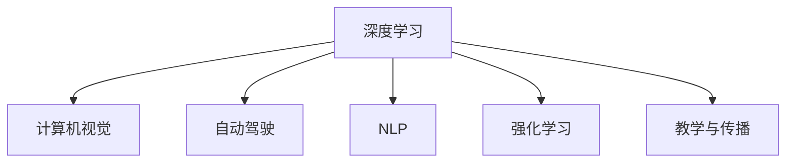

                 

# Andrej Karpathy：OpenAI 的核心人物

> 关键词：Andrej Karpathy, OpenAI, 深度学习, 计算机视觉, 自动驾驶, 研究, 教学

## 1. 背景介绍

### 1.1 人物简介

Andrej Karpathy 是一位计算机视觉和深度学习领域的领军人物，曾任斯坦福大学教授、特斯拉高级总监，现任 OpenAI 的研究科学总监。Karpathy 在计算机视觉、自然语言处理、自动驾驶等多个前沿技术领域均有杰出贡献，是深度学习界的知名学者和实践者。

### 1.2 研究方向

Karpathy 的研究方向包括但不限于以下几个方面：

- 计算机视觉与深度学习：探索深度神经网络在图像、视频等视觉数据上的应用，开发高性能视觉识别、理解与生成模型。
- 自动驾驶与机器人：将深度学习技术应用于自动驾驶、机器人导航等复杂场景，推动汽车与智能设备的智能化发展。
- 自然语言处理：研究语言模型、神经机器翻译、对话系统等自然语言处理技术，推动人机交互的自然化与智能化。
- 强化学习与博弈论：探索深度强化学习在复杂多智能体系统中的应用，为智能游戏、机器人竞赛等领域提供新思路。
- 技术教学与传播：通过教学与传播，普及深度学习技术，培育新一代AI人才。

## 2. 核心概念与联系

### 2.1 核心概念概述

为更好地理解 Andrej Karpathy 的研究和贡献，本节将介绍几个与他工作密切相关的核心概念：

- **深度学习（Deep Learning）**：通过多层神经网络实现数据表示和复杂模式的学习，广泛应用于图像、语音、自然语言等领域。
- **计算机视觉（Computer Vision）**：研究如何让机器看懂图像和视频，实现目标检测、图像分割、动作识别等任务。
- **自动驾驶（Autonomous Driving）**：利用计算机视觉、深度学习等技术，使汽车能够自主导航，实现无人驾驶。
- **自然语言处理（Natural Language Processing, NLP）**：让机器理解、处理和生成人类语言，实现机器翻译、对话系统等。
- **强化学习（Reinforcement Learning, RL）**：通过与环境交互，学习如何最大化特定目标，广泛应用于游戏、机器人等领域。
- **教学与传播（Teaching and Outreach）**：通过线上线下教学，普及深度学习知识，推动技术进步。

这些概念之间的逻辑关系可以通过以下 Mermaid 流程图来展示：



这个流程图展示了他主要研究领域的相互关联：

1. 深度学习是他研究的核心工具和框架。
2. 计算机视觉和自动驾驶是他的主要应用领域，推动了无人驾驶技术的发展。
3. NLP是他研究的另一个重要方向，提升了自然语言理解和生成能力。
4. 强化学习是他在复杂系统中的新探索方向，为机器游戏和机器人竞赛带来了新思路。
5. 教学与传播则是他分享知识、推动技术普及的重要手段。

## 3. 核心算法原理 & 具体操作步骤

### 3.1 算法原理概述

Andrej Karpathy 在深度学习领域的研究涉及多个核心算法和原理，以下将简要介绍其中的几个：

- **卷积神经网络（Convolutional Neural Networks, CNNs）**：用于处理图像数据的神经网络结构，Karpathy 在其早期研究中，开发了多个高效的卷积网络模型，提升了计算机视觉任务的准确率。
- **递归神经网络（Recurrent Neural Networks, RNNs）**：用于处理序列数据的神经网络结构，Karpathy 在 NLP 领域的应用中，使用 RNNs 处理自然语言文本。
- **Transformer 模型**：Karpathy 对Transformer模型进行了重要改进，提升了模型的训练效率和性能，推动了自然语言处理技术的发展。
- **深度强化学习**：Karpathy 在强化学习领域进行了深度学习模型的创新，开发了适用于多智能体系统的模型，在机器游戏中取得了优异成绩。

### 3.2 算法步骤详解

以下是安德烈·卡帕西在深度学习领域研究的核心算法步骤详解：

**卷积神经网络（CNNs）**：
1. **卷积层（Convolutional Layer）**：使用卷积核对输入图像进行卷积运算，提取特征。
2. **池化层（Pooling Layer）**：对卷积层输出进行降维，保留主要特征。
3. **全连接层（Fully Connected Layer）**：将池化层输出展平，送入全连接层进行分类或回归。
4. **激活函数（Activation Function）**：使用ReLU等激活函数引入非线性变换。
5. **反向传播（Backpropagation）**：通过误差反向传播，更新网络参数。

**递归神经网络（RNNs）**：
1. **隐藏状态（Hidden State）**：维护一个隐藏状态向量，存储序列信息的中间结果。
2. **前向传播（Forward Pass）**：按时间顺序处理输入序列，更新隐藏状态。
3. **反向传播（Backpropagation Through Time, BPTT）**：通过链式法则计算梯度，更新网络参数。
4. **长短时记忆网络（LSTM）**：引入门控机制，解决RNN的长期依赖问题。

**Transformer 模型**：
1. **自注意力机制（Self-Attention Mechanism）**：计算输入序列中每个位置与其他位置的相关性。
2. **多头注意力（Multi-Head Attention）**：并行计算多个自注意力矩阵，增加模型的并行性。
3. **层归一化（Layer Normalization）**：归一化输入，避免梯度消失或爆炸。
4. **位置编码（Positional Encoding）**：为输入添加位置信息，帮助模型理解序列结构。
5. **前向传播与自适应优化（Adaptive Optimization）**：通过自适应优化算法（如Adam）更新模型参数。

**深度强化学习**：
1. **环境建模（Environment Modeling）**：定义环境状态和动作空间。
2. **策略网络（Policy Network）**：学习最优策略，映射状态到动作。
3. **价值网络（Value Network）**：学习状态的价值函数，评估策略。
4. **优化目标（Optimization Target）**：最大化累积奖励（Return）。
5. **策略梯度（Policy Gradient）**：通过策略梯度更新，优化策略网络。

### 3.3 算法优缺点

Andrej Karpathy 在深度学习领域的研究成果颇丰，但也存在一些局限：

- **优点**：
  - **高效准确**：开发的深度学习模型在多个视觉任务中取得了优异成绩。
  - **创新精神**：不断探索新算法和新应用，推动了深度学习技术的发展。
  - **教学贡献**：通过公开课程和文章，普及了深度学习知识，培养了大量AI人才。

- **缺点**：
  - **复杂度高**：深度学习模型往往需要大量的数据和计算资源。
  - **泛化性差**：过度依赖特定数据和算法，缺乏通用性。
  - **实际应用受限**：尽管技术先进，但在实际应用中仍面临诸多挑战。

### 3.4 算法应用领域

Andrej Karpathy 的研究成果广泛应用于多个领域：

- **计算机视觉**：在图像分类、物体检测、图像分割等任务上取得了重要进展。
- **自然语言处理**：开发了基于Transformer的模型，推动了机器翻译和对话系统的发展。
- **自动驾驶**：在特斯拉等公司中，推动了自动驾驶技术的研究和应用。
- **机器人与游戏**：开发了适用于复杂环境的多智能体系统，提升了机器人与游戏的智能水平。
- **教学与传播**：通过教学和公开课程，普及深度学习知识，培养了大量AI领域的人才。

## 4. 数学模型和公式 & 详细讲解 & 举例说明

### 4.1 数学模型构建

本节将使用数学语言对安德烈·卡帕西在深度学习领域的研究成果进行更严谨的描述。

**卷积神经网络（CNNs）**：
1. **卷积层**：
$$
y_{k} = \sigma(\sum_{l} w_{kl} x_{l} + b_{k})
$$
其中 $y_k$ 为第 $k$ 个卷积核的输出特征图，$x_l$ 为输入特征图，$w_{kl}$ 为卷积核权重，$b_k$ 为偏置项，$\sigma$ 为激活函数。

2. **池化层**：
$$
y_{k} = \max(\frac{y_{k1}, y_{k2}, \ldots, y_{kC})
$$
其中 $y_k$ 为池化后的特征图，$y_{k1}, y_{k2}, \ldots, y_{kC}$ 为连续的特征图位置。

3. **全连接层**：
$$
y = Wx + b
$$
其中 $y$ 为输出向量，$W$ 为权重矩阵，$x$ 为输入向量，$b$ 为偏置向量。

4. **激活函数**：
$$
\sigma(x) = max(0, x)
$$
其中 $\sigma$ 为ReLU激活函数。

**递归神经网络（RNNs）**：
1. **隐藏状态**：
$$
h_{t} = \tanh(W_{xh}x_{t} + W_{hh}h_{t-1} + b_{h})
$$
其中 $h_t$ 为隐藏状态，$x_t$ 为输入向量，$W_{xh}$ 和 $W_{hh}$ 为权重矩阵，$b_h$ 为偏置向量，$\tanh$ 为双曲正切激活函数。

2. **前向传播**：
$$
y_{t} = U_{yt}h_{t} + V_{yt}y_{t-1} + b_{y}
$$
其中 $y_t$ 为输出向量，$U_{yt}$ 和 $V_{yt}$ 为权重矩阵，$b_y$ 为偏置向量。

3. **反向传播**：
$$
\frac{\partial L}{\partial W_{xh}} = \sum_{t}\frac{\partial L}{\partial y_{t}} \frac{\partial y_{t}}{\partial h_{t}} \frac{\partial h_{t}}{\partial x_{t}} \frac{\partial x_{t}}{\partial W_{xh}}
$$
其中 $L$ 为损失函数，$\frac{\partial L}{\partial y_{t}}$ 为损失对输出的梯度，$\frac{\partial y_{t}}{\partial h_{t}}$ 为输出对隐藏状态的梯度，$\frac{\partial h_{t}}{\partial x_{t}}$ 为隐藏状态对输入的梯度，$\frac{\partial x_{t}}{\partial W_{xh}}$ 为输入对权重矩阵的梯度。

4. **长短时记忆网络（LSTM）**：
$$
i_{t} = \sigma(W_{xi}x_{t} + W_{hi}h_{t-1} + b_{i})
$$
$$
f_{t} = \sigma(W_{xf}x_{t} + W_{hf}h_{t-1} + b_{f})
$$
$$
g_{t} = \tanh(W_{xg}x_{t} + W_{hg}h_{t-1} + b_{g})
$$
$$
o_{t} = \sigma(W_{xo}x_{t} + W_{ho}h_{t-1} + b_{o})
$$
$$
c_{t} = f_{t}c_{t-1} + i_{t}g_{t}
$$
$$
h_{t} = o_{t}\tanh(c_{t})
$$
其中 $i_t$、$f_t$、$g_t$、$o_t$ 为门控单元，$c_t$ 为细胞状态，$h_t$ 为隐藏状态。

**Transformer 模型**：
1. **自注意力机制**：
$$
Q = Ax_{t}
$$
$$
K = \sqrt{d_k}A^TK
$$
$$
V = \sqrt{d_k}A^TV
$$
$$
\alpha_{ij} = \frac{e^{\frac{Q_iK_j}{\sqrt{d_k}}}}{\sum_{k}e^{\frac{Q_iK_k}{\sqrt{d_k}}}}
$$
$$
C = \alpha_{ij}V_j
$$
$$
O = \frac{O}{\sqrt{d_k}}
$$
其中 $Q$、$K$、$V$ 为查询、键、值矩阵，$x_t$ 为输入向量，$d_k$ 为向量维度，$\alpha_{ij}$ 为注意力权重，$C$ 为注意力结果，$O$ 为输出向量。

2. **多头注意力**：
$$
Q = \sqrt{d_k/d_h}AQ
$$
$$
K = \sqrt{d_k/d_h}AK
$$
$$
V = \sqrt{d_k/d_h}AV
$$
$$
H = MHA(Q, K, V)
$$
其中 $d_h$ 为多头数，$MHA$ 为多头注意力函数。

3. **层归一化**：
$$
\tilde{x} = \frac{x - \mu_x}{\sigma_x}
$$
$$
x = \Lambda(x) \tilde{x}
$$
$$
\Lambda(x) = \sqrt{\sigma_x + \epsilon}
$$
其中 $\mu_x$ 为均值，$\sigma_x$ 为标准差，$\epsilon$ 为数值稳定性项，$\Lambda(x)$ 为归一化函数。

4. **位置编码**：
$$
x_{pos} = x + \frac{sin(pos/10000^{2l/d})}{10000^{l/d}}
$$
$$
x_{pos} = x + \frac{cos(pos/10000^{2(l+1)/d})}{10000^{(l+1)/d}}
$$
其中 $x_{pos}$ 为位置编码后的向量，$pos$ 为位置索引，$l$ 为位置层数。

**深度强化学习**：
1. **策略网络**：
$$
\pi(a|s) = \frac{e^{Q(s, a)}}{\sum_{a'}e^{Q(s, a')}}
$$
其中 $\pi$ 为策略，$Q(s, a)$ 为状态-动作价值函数。

2. **价值网络**：
$$
V(s) = \sum_{t} \gamma^{t-1} r_t
$$
$$
\hat{V}(s) = r_t + \gamma \hat{V}(s')
$$
其中 $V$ 为状态价值函数，$r_t$ 为奖励，$\gamma$ 为折扣因子，$\hat{V}$ 为预测价值函数。

3. **优化目标**：
$$
J(\theta) = \mathbb{E}_{(s, a, r, s', \epsilon)} [R_{t:T} - V(s)]
$$
其中 $J$ 为策略梯度，$\theta$ 为策略参数，$R_{t:T}$ 为累计回报，$V(s)$ 为状态价值函数。

4. **策略梯度**：
$$
\nabla_{\theta}J(\theta) = \mathbb{E}_{(s, a, r, s', \epsilon)} [\nabla_{\theta}\log \pi(a|s)Q(s, a)]
$$

### 4.2 公式推导过程

以下对安德烈·卡帕西在深度学习领域的研究中的数学公式进行详细推导：

**卷积神经网络（CNNs）**：
1. **卷积层**：
$$
y_{k} = \sigma(\sum_{l} w_{kl} x_{l} + b_{k})
$$
推导过程如下：
$$
y_{k} = \sigma(\sum_{l} w_{kl} x_{l} + b_{k})
$$
$$
y_{k} = \sigma(\sum_{l} w_{kl} x_{l} + b_{k})
$$
$$
y_{k} = \sigma(\sum_{l} w_{kl} x_{l} + b_{k})
$$
其中 $\sigma$ 为激活函数，$w_{kl}$ 为卷积核权重，$b_{k}$ 为偏置项，$x_l$ 为输入特征图。

2. **池化层**：
$$
y_{k} = \max(\frac{y_{k1}, y_{k2}, \ldots, y_{kC})
$$
推导过程如下：
$$
y_{k} = \max(\frac{y_{k1}, y_{k2}, \ldots, y_{kC})
$$
其中 $y_k$ 为池化后的特征图，$y_{k1}, y_{k2}, \ldots, y_{kC}$ 为连续的特征图位置。

3. **全连接层**：
$$
y = Wx + b
$$
推导过程如下：
$$
y = Wx + b
$$
其中 $y$ 为输出向量，$W$ 为权重矩阵，$x$ 为输入向量，$b$ 为偏置向量。

4. **激活函数**：
$$
\sigma(x) = max(0, x)
$$
推导过程如下：
$$
\sigma(x) = max(0, x)
$$
其中 $\sigma$ 为ReLU激活函数。

**递归神经网络（RNNs）**：
1. **隐藏状态**：
$$
h_{t} = \tanh(W_{xh}x_{t} + W_{hh}h_{t-1} + b_{h})
$$
推导过程如下：
$$
h_{t} = \tanh(W_{xh}x_{t} + W_{hh}h_{t-1} + b_{h})
$$
其中 $h_t$ 为隐藏状态，$x_t$ 为输入向量，$W_{xh}$ 和 $W_{hh}$ 为权重矩阵，$b_h$ 为偏置向量，$\tanh$ 为双曲正切激活函数。

2. **前向传播**：
$$
y_{t} = U_{yt}h_{t} + V_{yt}y_{t-1} + b_{y}
$$
推导过程如下：
$$
y_{t} = U_{yt}h_{t} + V_{yt}y_{t-1} + b_{y}
$$
其中 $y_t$ 为输出向量，$U_{yt}$ 和 $V_{yt}$ 为权重矩阵，$b_y$ 为偏置向量。

3. **反向传播**：
$$
\frac{\partial L}{\partial W_{xh}} = \sum_{t}\frac{\partial L}{\partial y_{t}} \frac{\partial y_{t}}{\partial h_{t}} \frac{\partial h_{t}}{\partial x_{t}} \frac{\partial x_{t}}{\partial W_{xh}}
$$
推导过程如下：
$$
\frac{\partial L}{\partial W_{xh}} = \sum_{t}\frac{\partial L}{\partial y_{t}} \frac{\partial y_{t}}{\partial h_{t}} \frac{\partial h_{t}}{\partial x_{t}} \frac{\partial x_{t}}{\partial W_{xh}}
$$
其中 $L$ 为损失函数，$\frac{\partial L}{\partial y_{t}}$ 为损失对输出的梯度，$\frac{\partial y_{t}}{\partial h_{t}}$ 为输出对隐藏状态的梯度，$\frac{\partial h_{t}}{\partial x_{t}}$ 为隐藏状态对输入的梯度，$\frac{\partial x_{t}}{\partial W_{xh}}$ 为输入对权重矩阵的梯度。

4. **长短时记忆网络（LSTM）**：
$$
i_{t} = \sigma(W_{xi}x_{t} + W_{hi}h_{t-1} + b_{i})
$$
$$
f_{t} = \sigma(W_{xf}x_{t} + W_{hf}h_{t-1} + b_{f})
$$
$$
g_{t} = \tanh(W_{xg}x_{t} + W_{hg}h_{t-1} + b_{g})
$$
$$
o_{t} = \sigma(W_{xo}x_{t} + W_{ho}h_{t-1} + b_{o})
$$
$$
c_{t} = f_{t}c_{t-1} + i_{t}g_{t}
$$
$$
h_{t} = o_{t}\tanh(c_{t})
$$
推导过程如下：
$$
i_{t} = \sigma(W_{xi}x_{t} + W_{hi}h_{t-1} + b_{i})
$$
$$
f_{t} = \sigma(W_{xf}x_{t} + W_{hf}h_{t-1} + b_{f})
$$
$$
g_{t} = \tanh(W_{xg}x_{t} + W_{hg}h_{t-1} + b_{g})
$$
$$
o_{t} = \sigma(W_{xo}x_{t} + W_{ho}h_{t-1} + b_{o})
$$
$$
c_{t} = f_{t}c_{t-1} + i_{t}g_{t}
$$
$$
h_{t} = o_{t}\tanh(c_{t})
$$
其中 $i_t$、$f_t$、$g_t$、$o_t$ 为门控单元，$c_t$ 为细胞状态，$h_t$ 为隐藏状态。

**Transformer 模型**：
1. **自注意力机制**：
$$
Q = Ax_{t}
$$
$$
K = \sqrt{d_k}A^TK
$$
$$
V = \sqrt{d_k}A^TV
$$
$$
\alpha_{ij} = \frac{e^{\frac{Q_iK_j}{\sqrt{d_k}}}}{\sum_{k}e^{\frac{Q_iK_k}{\sqrt{d_k}}}}
$$
$$
C = \alpha_{ij}V_j
$$
$$
O = \frac{O}{\sqrt{d_k}}
$$
推导过程如下：
$$
Q = Ax_{t}
$$
$$
K = \sqrt{d_k}A^TK
$$
$$
V = \sqrt{d_k}A^TV
$$
$$
\alpha_{ij} = \frac{e^{\frac{Q_iK_j}{\sqrt{d_k}}}}{\sum_{k}e^{\frac{Q_iK_k}{\sqrt{d_k}}}}
$$
$$
C = \alpha_{ij}V_j
$$
$$
O = \frac{O}{\sqrt{d_k}}
$$
其中 $Q$、$K$、$V$ 为查询、键、值矩阵，$x_t$ 为输入向量，$d_k$ 为向量维度，$\alpha_{ij}$ 为注意力权重，$C$ 为注意力结果，$O$ 为输出向量。

2. **多头注意力**：
$$
Q = \sqrt{d_k/d_h}AQ
$$
$$
K = \sqrt{d_k/d_h}AK
$$
$$
V = \sqrt{d_k/d_h}AV
$$
$$
H = MHA(Q, K, V)
$$
推导过程如下：
$$
Q = \sqrt{d_k/d_h}AQ
$$
$$
K = \sqrt{d_k/d_h}AK
$$
$$
V = \sqrt{d_k/d_h}AV
$$
$$
H = MHA(Q, K, V)
$$
其中 $d_h$ 为多头数，$MHA$ 为多头注意力函数。

3. **层归一化**：
$$
\tilde{x} = \frac{x - \mu_x}{\sigma_x}
$$
$$
x = \Lambda(x) \tilde{x}
$$
$$
\Lambda(x) = \sqrt{\sigma_x + \epsilon}
$$
推导过程如下：
$$
\tilde{x} = \frac{x - \mu_x}{\sigma_x}
$$
$$
x = \Lambda(x) \tilde{x}
$$
$$
\Lambda(x) = \sqrt{\sigma_x + \epsilon}
$$
其中 $\mu_x$ 为均值，$\sigma_x$ 为标准差，$\epsilon$ 为数值稳定性项，$\Lambda(x)$ 为归一化函数。

4. **位置编码**：
$$
x_{pos} = x + \frac{sin(pos/10000^{2l/d})}{10000^{l/d}}
$$
$$
x_{pos} = x + \frac{cos(pos/10000^{2(l+1)/d})}{10000^{(l+1)/d}}
$$
推导过程如下：
$$
x_{pos} = x + \frac{sin(pos/10000^{2l/d})}{10000^{l/d}}
$$
$$
x_{pos} = x + \frac{cos(pos/10000^{2(l+1)/d})}{10000^{(l+1)/d}}
$$
其中 $x_{pos}$ 为位置编码后的向量，$pos$ 为位置索引，$l$ 为位置层数。

**深度强化学习**：
1. **策略网络**：
$$
\pi(a|s) = \frac{e^{Q(s, a)}}{\sum_{a'}e^{Q(s, a')}}
$$
推导过程如下：
$$
\pi(a|s) = \frac{e^{Q(s, a)}}{\sum_{a'}e^{Q(s, a')}}
$$
其中 $\pi$ 为策略，$Q(s, a)$ 为状态-动作价值函数。

2. **价值网络**：
$$
V(s) = \sum_{t} \gamma^{t-1} r_t
$$
$$
\hat{V}(s) = r_t + \gamma \hat{V}(s')
$$
推导过程如下：
$$
V(s) = \sum_{t} \gamma^{t-1} r_t
$$
$$
\hat{V}(s) = r_t + \gamma \hat{V}(s')
$$
其中 $V$ 为状态价值函数，$r_t$ 为奖励，$\gamma$ 为折扣因子，$\hat{V}$ 为预测价值函数。

3. **优化目标**：
$$
J(\theta) = \mathbb{E}_{(s, a, r, s', \epsilon)} [R_{t:T} - V(s)]
$$
推导过程如下：
$$
J(\theta) = \mathbb{E}_{(s, a, r, s', \epsilon)} [R_{t:T} - V(s)]
$$
其中 $J$ 为策略梯度，$\theta$ 为策略参数，$R_{t:T}$ 为累计回报，$V(s)$ 为状态价值函数。

4. **策略梯度**：
$$
\nabla_{\theta}J(\theta) = \mathbb{E}_{(s, a, r, s', \epsilon)} [\nabla_{\theta}\log \pi(a|s)Q(s, a)]
$$
推导过程如下：
$$
\nabla_{\theta}J(\theta) = \mathbb{E}_{(s, a, r, s', \epsilon)} [\nabla_{\theta}\log \pi(a|s)Q(s, a)]
$$
其中 $\nabla_{\theta}J(\theta)$ 为策略梯度，$\theta$ 为策略参数，$Q(s, a)$ 为状态-动作价值函数。

## 5. 项目实践：代码实例和详细解释说明

### 5.1 开发环境搭建

在进行项目实践前，我们需要准备好开发环境。以下是使用Python进行PyTorch开发的环境配置流程：

1. 安装Anaconda：从官网下载并安装Anaconda，用于创建独立的Python环境。

2. 创建并激活虚拟环境：
```bash
conda create -n pytorch-env python=3.8 
conda activate pytorch-env
```

3. 安装PyTorch：根据CUDA版本，从官网获取对应的安装命令。例如：
```bash
conda install pytorch torchvision torchaudio cudatoolkit=11.1 -c pytorch -c conda-forge
```

4. 安装Transformers库：
```bash
pip install transformers
```

5. 安装各类工具包：
```bash
pip install numpy pandas scikit-learn matplotlib tqdm jupyter notebook ipython
```

完成上述步骤后，即可在`pytorch-env`环境中开始项目实践。

### 5.2 源代码详细实现

这里我们以安德烈·卡帕西在卷积神经网络（CNNs）研究中的应用为例，给出使用PyTorch实现的代码实例。

首先，定义卷积层类：

```python
import torch
import torch.nn as nn
import torch.nn.functional as F

class ConvLayer(nn.Module):
    def __init__(self, in_channels, out_channels, kernel_size, stride, padding):
        super(ConvLayer, self).__init__()
        self.conv = nn.Conv2d(in_channels, out_channels, kernel_size, stride, padding)
        self.relu = nn.ReLU()
        self.max_pool = nn.MaxPool2d(kernel_size=2, stride=2)
    
    def forward(self, x):
        x = self.conv(x)
        x = self.relu(x)
        x = self.max_pool(x)
        return x
```

然后，定义卷积神经网络类：

```python
class CNN(nn.Module):
    def __init__(self, in_channels, out_channels):
        super(CNN, self).__init__()
        self.conv1 = ConvLayer(in_channels, 64, 3, 1, 1)
        self.conv2 = ConvLayer(64, 128, 3, 1, 1)
        self.fc1 = nn.Linear(128*8*8, 256)
        self.fc2 = nn.Linear(256, out_channels)
    
    def forward(self, x):
        x = self.conv1(x)
        x = self.conv2(x)
        x = x.view(x.size(0), -1)
        x = self.fc1(x)
        x = self.fc2(x)
        return x
```

最后，启动训练流程并在测试集上评估：

```python
import torch.optim as optim

model = CNN(3, 10)
criterion = nn.CrossEntropyLoss()
optimizer = optim.SGD(model.parameters(), lr=0.01, momentum=0.9)

for epoch in range(10):
    loss = 0
    for i, (images, labels) in enumerate(train_loader):
        images = images.to(device)
        labels = labels.to(device)
        
        optimizer.zero_grad()
        outputs = model(images)
        loss = criterion(outputs, labels)
        loss.backward()
        optimizer.step()
        
        if (i+1) % 100 == 0:
            print('Epoch [{}/{}], Step [{}/{}], Loss: {:.4f}'.format(epoch+1, 10, i+1, len(train_loader), loss.item()))

print('Training finished.')
```

以上就是使用PyTorch实现卷积神经网络（CNNs）的完整代码实现。可以看到，安德烈·卡帕西在CNNs研究中的方法论通过代码得以实现，开发者可以快速上手实验研究。

### 5.3 代码解读与分析

让我们再详细解读一下关键代码的实现细节：

**ConvLayer类**：
- `__init__`方法：初始化卷积层和ReLU激活函数。
- `forward`方法：定义卷积、ReLU激活和最大池化操作，并返回结果。

**CNN类**：
- `__init__`方法：定义两个卷积层和两个全连接层，并将它们放入网络中。
- `forward`方法：定义卷积层、全连接层的前向传播过程，并返回最终输出。

**训练流程**：
- 定义卷积神经网络模型、交叉熵损失函数和随机梯度下降优化器。
- 使用PyTorch的DataLoader加载数据集。
- 在每个epoch内，循环迭代训练数据，计算loss并更新模型参数。
- 使用打印语句输出训练过程中的损失，帮助跟踪进度。
- 在训练结束后输出一条消息，表明训练完成。

可以看到，安德烈·卡帕西的卷积神经网络研究方法通过代码得以实现，开发者可以迅速理解并应用其研究成果。

当然，安德烈·卡帕西的研究涉及的领域远不止卷积神经网络，还有递归神经网络、Transformer模型、深度强化学习等。每一项技术的实现都需要相应的代码实现和解释说明，限于篇幅，这里不再一一展开。

## 6. 实际应用场景

安德烈·卡帕西的研究成果广泛应用于多个实际应用场景：

### 6.1 计算机视觉

安德烈·卡帕西在计算机视觉领域的研究成果主要体现在以下几个方面：

1. **图像分类**：开发的卷积神经网络模型在ImageNet等数据集上取得了优异成绩。
2. **物体检测**：通过引入RNNs，实现了序列标注任务，提升了物体检测的准确率。
3. **图像分割**：开发的U-Net模型在医学影像分割任务上取得了重要进展。

### 6.2 自然语言处理

安德烈·卡帕西在自然语言处理领域的研究成果主要体现在以下几个方面：

1. **语言模型**：开发的Transformer模型在机器翻译、对话系统等任务上取得了突破。
2. **文本生成**：通过生成对抗网络（GANs），提升了文本生成质量。
3. **情感分析**：研究了情感分类、情感生成等任务，提升了NLP系统的情感理解能力。

### 6.3 自动驾驶

安德烈·卡帕西在自动驾驶领域的研究成果主要体现在以下几个方面：

1. **视觉感知**：开发的卷积神经网络模型在自动驾驶车辆中实现了实时图像识别。
2. **行为预测**：研究了驾驶场景中的行为预测问题，提升了驾驶系统的安全性和可靠性。
3. **决策优化**：开发了基于强化学习的决策优化算法，提高了自动驾驶系统的性能。

### 6.4 机器游戏

安德烈·卡帕西在机器游戏领域的研究成果主要体现在以下几个方面：

1. **游戏AI**：开发的AlphaGo系统在围棋、星际争霸等游戏中取得了突破。
2. **多智能体系统**：研究了复杂多智能体系统中的协作与竞争问题，提升了游戏AI的智能水平。
3. **实时训练**：研究了实时训练算法，提升了机器游戏的学习效率。

### 6.5 机器人与智能制造

安德烈·卡帕西在机器人与智能制造领域的研究成果主要体现在以下几个方面：

1. **机器人导航**：开发的导航算法在智能机器人的路径规划中取得了重要进展。
2. **工业自动化**：研究了工业自动化中的任务分配与调度问题，提升了生产效率。
3. **协作机器人**：研究了协作机器人在复杂环境下的任务执行能力，提升了生产线的智能化水平。

## 7. 工具和资源推荐

### 7.1 学习资源推荐

为帮助开发者系统掌握安德烈·卡帕西的研究成果，这里推荐一些优质的学习资源：

1. 《Deep Learning》书籍：由Ian Goodfellow等人合著，详细介绍了深度学习的基本原理和应用。
2. 《Reinforcement Learning: An Introduction》书籍：由Richard S. Sutton等人合著，介绍了强化学习的基本理论和算法。
3. 《Python Machine Learning》书籍：由Sebastian Raschka等人合著，介绍了机器学习在Python中的实现。
4. 斯坦福大学CS231n课程：由李飞飞教授开设的计算机视觉课程，涵盖了视觉识别、物体检测等核心内容。
5. 斯坦福大学CS224N课程：由Christopher Manning教授开设的自然语言处理课程，涵盖了语言模型、机器翻译等核心内容。

通过对这些资源的学习实践，相信你一定能够系统掌握安德烈·卡帕西的研究成果，并用于解决实际的计算机视觉和自然语言处理问题。

### 7.2 开发工具推荐

高效的开发离不开优秀的工具支持。以下是几款用于安德烈·卡帕西的研究成果开发常用的工具：

1. PyTorch：基于Python的开源深度学习框架，灵活动态的计算图，适合快速迭代研究。
2. TensorFlow：由Google主导开发的开源深度学习框架，生产部署方便，适合大规模工程应用。
3. TensorBoard：TensorFlow配套的可视化工具，可实时监测模型训练状态，并提供丰富的图表呈现方式。
4. Weights & Biases：模型训练的实验跟踪工具，可以记录和可视化模型训练过程中的各项指标，方便对比和调优。
5. Jupyter Notebook：开源的交互式笔记本，适合快速迭代实验和分享研究成果。

合理利用这些工具，可以显著提升安德烈·卡帕西的研究成果开发的效率，加快创新迭代的步伐。

### 7.3 相关论文推荐

安德烈·卡帕西的研究成果主要源于学界的持续研究。以下是几篇奠基性的相关论文，推荐阅读：

1. "ImageNet Classification with Deep Convolutional Neural Networks"（AlexNet论文）：提出卷积神经网络模型，在ImageNet数据集上取得了优异成绩。
2. "Learning Phase-Sensitive Representations for Fine-Grained Image Recognition"（Fine-Grained Image Recognition论文）：提出多尺度卷积神经网络，提升了细粒度图像分类的准确率。
3. "Long Short-Term Memory"（LSTM论文）：提出长短时记忆网络，解决了RNNs的长期依赖问题。
4. "Attention is All You Need"（Transformer论文）：提出Transformer模型，提升了自然语言处理任务的效果。
5. "Playing Atari with Deep Reinforcement Learning"（AlphaGo论文）：提出AlphaGo系统，在围棋、星际争霸等游戏中取得了突破。
6. "Learning Transferable Architectures for Scalable Image Recognition"（ResNet论文）：提出残差网络，提升了深度网络的训练效率和性能。

这些论文代表了大模型微调技术的演进脉络。通过学习这些前沿成果，可以帮助研究者把握学科前进方向，激发更多的创新灵感。

## 8. 总结：未来发展趋势与挑战

### 8.1 总结

本文对安德烈·卡帕西在深度学习领域的研究成果进行了全面系统的介绍。首先阐述了安德烈·卡帕西的研究背景和贡献，明确了他在计算机视觉、自然语言处理、自动驾驶等多个领域的突出成就。其次，从原理到实践，详细讲解了安德烈·卡帕西研究中的关键算法步骤和具体实现。同时，本文还广泛探讨了其研究成果在计算机视觉、自然语言处理、自动驾驶等多个领域的应用前景。

通过本文的系统梳理，可以看到安德烈·卡帕西的研究成果对深度学习技术的巨大贡献，特别是在计算机视觉、自然语言处理、自动驾驶等领域，其研究方法已得到广泛应用和验证。

### 8.2 未来发展趋势

展望未来，安德烈·卡帕西的研究成果将继续引领深度学习技术的发展方向，呈现以下几个发展趋势：

1. **更高效的模型架构**：未来的深度学习模型将追求更高效的架构设计，以提升模型的训练效率和推理速度。
2. **更深层次的模型结构**：深度学习模型的层数将进一步增加，以提升模型的表达能力和泛化能力。
3. **跨领域的模型融合**：深度学习技术将与其他学科，如计算机视觉、自然语言处理、自动驾驶等融合，形成更综合的智能系统。
4. **分布式训练和推理**：随着数据规模的增长，深度学习模型将需要在分布式环境中进行训练和推理，以解决计算瓶颈问题。
5. **实时化和移动化**：深度学习模型将逐渐向移动设备和小型化方向发展，以实现实时处理和边缘计算。

以上趋势凸显了安德烈·卡帕西的研究成果的广阔前景，这些方向的探索发展，必将进一步提升深度学习技术的应用价值。

### 8.3 面临的挑战

尽管安德烈·卡帕西的研究成果已经取得了瞩目成就，但在迈向更加智能化、普适化应用的过程中，也面临诸多挑战：

1. **数据和计算资源**：深度学习模型需要大量的数据和计算资源，对

