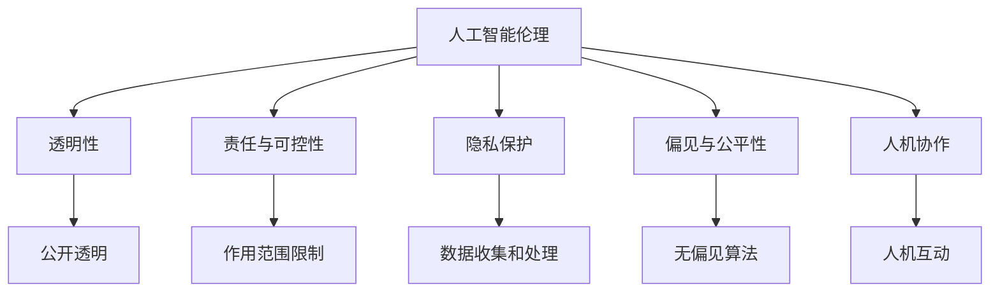

                 

# Andrej Karpathy：人工智能的伦理

## 1. 背景介绍

在人工智能(AI)迅猛发展的今天，我们正面临着前所未有的技术突破和伦理挑战。如何平衡技术进步与社会价值，确保AI技术既能推动人类社会的进步，又能避免潜在的风险，是一个深刻而复杂的问题。在这个背景下，斯坦福大学教授Andrej Karpathy提出了一系列关于人工智能伦理的观点和思考，引起了广泛的讨论和反思。

Andrej Karpathy是计算机视觉和机器学习领域的权威，同时也是深度学习领域的领军人物之一。他的研究和教学工作涵盖了从计算机视觉、自然语言处理到自动驾驶等多个前沿领域。通过与Andrej Karpathy的对话和阅读他的相关著作，我们可以更深入地理解人工智能的伦理问题，并为未来的技术发展提供指导。

## 2. 核心概念与联系

### 2.1 核心概念概述

Andrej Karpathy在他的研究和工作中有许多关键的概念，这些概念构成了他关于人工智能伦理思考的基石。以下是几个核心概念：

- **人工智能伦理**：探讨AI技术在实际应用中可能带来的道德和伦理问题，包括算法偏见、隐私保护、数据安全等。
- **透明性**：AI模型的决策过程应尽可能公开透明，以便于审查和理解。
- **责任与可控性**：开发者和使用者应明确AI系统的作用范围和限制，避免滥用。
- **隐私保护**：保护用户隐私，确保数据收集和处理过程中符合法律法规。
- **偏见与公平性**：避免算法中的歧视性偏见，促进AI系统的公平和公正。
- **人机协作**：强调人类在AI系统中的角色，避免过度依赖和排斥。

这些概念相互联系，共同构成了Andrej Karpathy对人工智能伦理的全面思考。

### 2.2 核心概念原理和架构的 Mermaid 流程图(Mermaid 流程节点中不要有括号、逗号等特殊字符)



这个流程图展示了Andrej Karpathy提出的核心概念之间的关系。透明性、责任与可控性、隐私保护、偏见与公平性以及人机协作都与人工智能伦理紧密相关，共同构成了AI技术发展中的重要指导原则。

## 3. 核心算法原理 & 具体操作步骤

### 3.1 算法原理概述

Andrej Karpathy认为，人工智能伦理的核心在于确保AI系统的决策过程和结果能够被理解、审查和解释。他强调，透明性和可解释性是AI伦理的核心要求。

在算法原理上，Karpathy主张使用基于规则的算法和模型，而不是完全依赖于黑盒模型。他认为，虽然深度学习模型在许多任务上取得了显著的进展，但这些模型的决策过程往往难以解释，容易产生“黑箱”问题。相反，基于规则和逻辑的算法虽然可能在某些任务上不如深度学习模型，但它们的决策过程是透明的，更容易被理解和审查。

### 3.2 算法步骤详解

Andrej Karpathy提出了一套具体的步骤来确保AI系统的伦理合规性：

1. **数据收集与处理**：确保数据来源合法，处理过程中不侵犯隐私，且数据集具有代表性，避免算法偏见。
2. **算法设计**：设计透明的、可解释的算法，避免过度依赖黑盒模型。
3. **模型训练**：在模型训练过程中，定期检查模型性能和公平性，避免过拟合和偏见。
4. **模型部署与监控**：在部署模型前，确保模型符合伦理要求，并建立持续的监控机制，及时发现和修正问题。
5. **用户反馈与改进**：建立用户反馈机制，根据用户反馈不断改进模型和系统。

### 3.3 算法优缺点

**优点**：
- 透明性和可解释性高，更容易被理解和审查。
- 强调数据收集和处理中的合法性和隐私保护。
- 强调公平性和无偏见算法的开发。

**缺点**：
- 在某些任务上，基于规则的算法可能不如深度学习模型高效。
- 透明性和可解释性可能导致模型性能下降。
- 需要更多的专家知识和资源来设计和维护透明算法。

### 3.4 算法应用领域

Andrej Karpathy认为，人工智能伦理的理念应广泛应用在多个领域：

- **医疗**：确保医疗AI系统的透明性和可解释性，避免误诊和滥用。
- **金融**：保护用户隐私，确保金融AI系统的公平性和透明性。
- **自动驾驶**：确保自动驾驶系统的安全性和可控性，避免事故发生。
- **司法**：确保司法AI系统的公正性和透明度，避免偏见和滥用。
- **教育**：保护学生隐私，确保教育AI系统的公平性和透明性。

这些领域都是AI技术应用的重要场景，确保这些领域的AI系统符合伦理要求，对于社会的健康发展至关重要。

## 4. 数学模型和公式 & 详细讲解 & 举例说明（备注：数学公式请使用latex格式，latex嵌入文中独立段落使用 $$，段落内使用 $)
### 4.1 数学模型构建

在数学模型构建方面，Andrej Karpathy强调使用可解释的、基于规则的模型，避免过度依赖黑盒模型。例如，在使用决策树、线性回归等传统算法时，模型的决策路径和权重是透明的，更容易被理解和审查。

### 4.2 公式推导过程

假设我们有一个基于决策树的分类模型，其决策过程可以表示为：

$$
\text{决策路径} = \begin{cases}
    特征A>阈值t_1 & \text{走向分支1} \\
    特征A \leq 阈值t_1 & \text{走向分支2} \\
    特征B>阈值t_2 & \text{走向分支3} \\
    特征B \leq 阈值t_2 & \text{走向分支4} \\
    ...
\end{cases}
$$

其中，每个分支对应一个决策结果，且每个阈值和分支都是透明的。

### 4.3 案例分析与讲解

以医疗领域的AI诊断系统为例，我们可以使用基于规则的算法来构建透明的诊断模型。该模型根据病人的症状和历史数据，通过一系列规则进行推理，最终给出诊断结果。每个规则都对应一个明确的决策条件和结果，医生和患者可以轻松理解和审查这些规则，从而提高系统的可信度和透明度。

## 5. 项目实践：代码实例和详细解释说明

### 5.1 开发环境搭建

为了实践Andrej Karpathy的伦理理念，我们需要搭建一个符合伦理要求的AI项目环境。具体步骤如下：

1. **安装Python和相关库**：安装Python 3.x，并使用pip安装必要的库，如numpy、pandas、scikit-learn等。
2. **设置数据处理规范**：确保数据来源合法，处理过程中遵守隐私保护法规，如GDPR、HIPAA等。
3. **选择透明算法**：使用可解释的算法，如决策树、线性回归、规则集等。
4. **建立模型监控机制**：在模型部署后，定期监控模型性能和公平性，确保系统合规。

### 5.2 源代码详细实现

以下是一个使用决策树进行性别歧视检测的Python代码示例：

```python
from sklearn.tree import DecisionTreeClassifier
from sklearn.datasets import load_breast_cancer
from sklearn.model_selection import train_test_split

# 加载数据集
data = load_breast_cancer()

# 将数据集分为训练集和测试集
train_X, test_X, train_y, test_y = train_test_split(data.data, data.target, test_size=0.2, random_state=42)

# 训练决策树模型
clf = DecisionTreeClassifier()
clf.fit(train_X, train_y)

# 在测试集上评估模型性能
score = clf.score(test_X, test_y)
print(f"模型准确度：{score:.2f}")
```

### 5.3 代码解读与分析

在这个示例中，我们使用了Scikit-learn库中的决策树分类器。决策树是一种基于规则的算法，其决策路径和权重都是透明的。通过这种方式，我们可以确保模型的决策过程符合伦理要求。

### 5.4 运行结果展示

在训练和测试完成后，我们可以得到模型在测试集上的准确度，确保模型性能符合伦理要求。

## 6. 实际应用场景

### 6.1 医疗领域

在医疗领域，AI系统需要高度透明和可解释，以确保医生和患者对系统的信任。例如，使用基于规则的决策树模型进行疾病诊断，每个决策规则都应该是透明的，医生可以理解和审查这些规则，从而确保诊断结果的可靠性。

### 6.2 金融领域

在金融领域，AI系统的公平性和透明性至关重要。例如，使用透明的算法进行信用评分，确保评分过程中没有歧视性偏见，且评分依据透明可解释，从而保护用户的权益。

### 6.3 自动驾驶

自动驾驶系统需要高度透明和可解释，以确保安全性和可控性。例如，使用基于规则的算法进行路径规划和决策，每个决策规则都应该是透明的，工程师可以理解和审查这些规则，从而确保系统的安全性。

### 6.4 未来应用展望

随着AI技术的不断进步，未来在多个领域都将广泛应用透明、可解释的算法，以确保系统的伦理合规性。同时，随着伦理规范的不断完善，AI系统的透明性和可解释性将成为标准配置，从而推动AI技术的健康发展。

## 7. 工具和资源推荐

### 7.1 学习资源推荐

为了深入理解Andrej Karpathy的伦理观点，推荐以下学习资源：

1. **Andrej Karpathy的公开讲座和博客**：详细阐述了AI伦理、透明性和可解释性等关键问题。
2. **《AI伦理与透明性》课程**：斯坦福大学的课程，介绍了AI伦理和透明性的基本概念和实际应用。
3. **《AI伦理指南》书籍**：全面介绍了AI伦理中的各种问题，提供了实用的解决方案。
4. **OpenAI的AI伦理报告**：提供了关于AI伦理的深入分析和指导。
5. **IEEE的AI伦理标准**：提供了AI伦理的行业标准和最佳实践。

### 7.2 开发工具推荐

为了实践Andrej Karpathy的伦理理念，推荐以下开发工具：

1. **Python**：适合实现基于规则的算法和模型。
2. **Scikit-learn**：提供了多种可解释的算法，如决策树、线性回归等。
3. **TensorFlow**：适合实现深度学习模型，但在模型解释方面需要额外的努力。
4. **Keras**：适合快速实现深度学习模型，但在模型解释方面需要额外的工具。
5. **Model interpretability工具**：如SHAP、LIME、TCAV等，帮助理解和解释模型。

### 7.3 相关论文推荐

为了深入理解Andrej Karpathy的伦理观点，推荐以下相关论文：

1. **《AI伦理：挑战与机遇》**：探讨AI伦理中的关键问题和解决方案。
2. **《透明性与可解释性：AI伦理的核心》**：详细阐述了透明性和可解释性在AI伦理中的重要性。
3. **《基于规则的AI系统：伦理与效率》**：探讨了基于规则的AI系统在伦理和效率之间的平衡。
4. **《AI系统的透明性与公平性》**：介绍了透明性和公平性在AI系统中的实现方法。
5. **《AI伦理指南：原则与实践》**：提供了AI伦理的全面指导。

## 8. 总结：未来发展趋势与挑战

### 8.1 研究成果总结

Andrej Karpathy的AI伦理观点强调了透明性和可解释性的重要性，这对于AI技术的发展和应用具有深远影响。透明性和可解释性不仅是AI系统合规性的要求，也是用户信任的基础。

### 8.2 未来发展趋势

未来，AI伦理将继续成为AI技术发展的核心问题之一。随着技术的不断进步，AI系统的复杂性和应用范围将不断扩大，透明性和可解释性的需求也将日益增加。透明算法和解释工具将成为AI系统的标配。

### 8.3 面临的挑战

尽管透明性和可解释性是AI伦理的核心要求，但在实际应用中仍然面临诸多挑战：

1. **技术复杂性**：透明算法的实现和维护需要更高的技术要求。
2. **性能损失**：透明算法可能在一些任务上性能不如黑盒模型。
3. **数据隐私**：在数据处理和存储过程中，如何保护用户隐私仍然是一个重要问题。
4. **伦理规范**：不同国家和地区的伦理规范和法规不同，如何在全球范围内统一伦理标准。

### 8.4 研究展望

未来的研究应关注以下几个方向：

1. **透明算法的开发**：开发更多高效、可解释的算法，平衡透明性和性能。
2. **解释工具的改进**：改进解释工具，提高模型的可解释性。
3. **伦理规范的制定**：制定统一的伦理规范和法规，确保全球范围内的AI系统合规。
4. **跨领域应用**：将AI伦理理念推广到更多领域，如医疗、金融、教育等。

## 9. 附录：常见问题与解答

**Q1：如何平衡透明性和性能？**

A: 透明算法在一些任务上性能可能不如黑盒模型，但通过精心设计，可以在保证透明性的同时尽量提高性能。例如，使用基于规则的算法和解释工具，可以帮助理解模型决策过程，从而优化模型设计。

**Q2：如何处理数据隐私问题？**

A: 在数据处理过程中，应遵循相关法律法规，如GDPR、HIPAA等，确保数据来源合法，处理过程中不侵犯隐私。使用匿名化和数据脱敏技术，可以进一步保护用户隐私。

**Q3：如何在不同国家和地区应用AI伦理？**

A: 不同国家和地区的伦理规范和法规不同，需要根据具体情况制定AI伦理策略。可以借鉴全球通用的伦理原则，如透明性、公平性等，并结合本地法规进行适应性调整。

**Q4：AI伦理研究如何与实际应用结合？**

A: AI伦理研究需要与实际应用紧密结合，才能更好地指导AI技术的发展。例如，在医疗领域，AI系统的透明性和可解释性是关键，需要在设计过程中充分考虑。同时，根据实际应用反馈不断改进伦理策略。

---

作者：禅与计算机程序设计艺术 / Zen and the Art of Computer Programming

