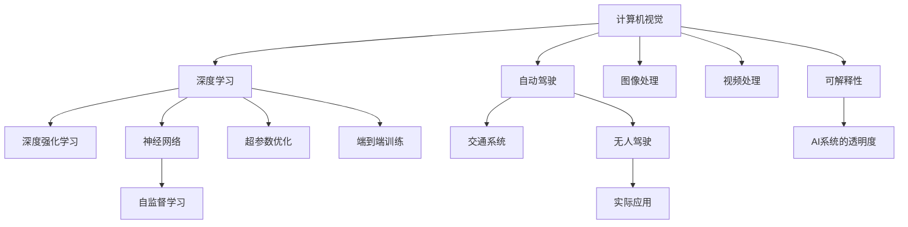

                 

# Andrej Karpathy：人工智能的未来发展挑战

> 关键词：人工智能,深度学习,计算机视觉,自动驾驶,神经网络,深度强化学习,未来技术,机器学习,深度学习模型,人工智能安全

## 1. 背景介绍

### 1.1 问题由来
Andrej Karpathy，斯坦福大学教授、OpenAI首席科学家、PyTorch的创始人之一，是深度学习领域的翘楚。在2018年，他在NeurIPS大会上做了主题演讲《人工智能的未来发展挑战》，强调了深度学习技术正面临前所未有的机遇与挑战，涵盖计算机视觉、自动驾驶、深度强化学习等多个前沿领域。本次演讲引发了广泛讨论，本文将从演讲内容中提取核心观点，结合最新的研究进展进行详细分析，对人工智能的未来发展挑战进行深度剖析。

### 1.2 问题核心关键点
本次演讲的关键要点包括：
- 计算机视觉领域的现状与前景
- 自动驾驶技术的最新进展与挑战
- 深度强化学习的核心技术及应用场景
- 未来人工智能技术面临的伦理、安全与公平性问题
- 需要如何构建可解释、可控的AI系统

这些问题不仅涵盖了当前AI技术的重点，而且触及了未来发展面临的深层次挑战。通过理解这些核心关键点，可以更全面地把握AI技术的未来发展趋势。

## 2. 核心概念与联系

### 2.1 核心概念概述

为了更好地理解Andrej Karpathy演讲的核心内容，本节将介绍几个紧密相关的核心概念：

- **计算机视觉(Computer Vision)**：使用计算机对图像、视频和3D数据进行处理和分析，使计算机系统能够从视觉信号中提取和理解信息。
- **自动驾驶(Autonomous Driving)**：利用AI技术使车辆能够自动导航，减少人为干预，提高交通安全和效率。
- **深度强化学习(Deep Reinforcement Learning, DRL)**：通过智能体与环境的交互，优化策略以最大化累积奖励的算法。
- **神经网络(Neural Networks)**：由大量简单处理单元组成的计算模型，用于解决复杂的非线性问题。
- **可解释性(Explainability)**：使AI系统的决策过程可以被人类理解，从而提高系统的透明性和可信度。
- **公平性(Fairness)**：确保AI系统不带有偏见，公平对待所有人。

这些核心概念之间的逻辑关系可以通过以下Mermaid流程图来展示：



这个流程图展示了几大核心概念及其之间的关系：

1. 计算机视觉和深度学习是自动驾驶的基础。
2. 深度强化学习是DRL的核心技术，与神经网络结合可以解决复杂的动态决策问题。
3. 图像和视频处理是计算机视觉的重要组成部分。
4. 可解释性是构建可信AI系统的关键。
5. 公平性在AI系统中尤为重要，确保所有用户被公平对待。

这些核心概念共同构成了Andrej Karpathy演讲的理论基础，使我们对人工智能的未来发展有了更清晰的认识。

## 3. 核心算法原理 & 具体操作步骤
### 3.1 算法原理概述

Andrej Karpathy演讲的核心内容可以归纳为以下几个算法原理：

1. **计算机视觉中的端到端训练**：使用神经网络对图像进行处理和分析，并通过监督学习进行训练，直接输出最终结果，如分类、检测、分割等。
2. **自动驾驶中的强化学习**：通过智能体与环境的交互，不断调整策略，优化决策，提高驾驶安全和效率。
3. **深度强化学习中的自监督学习**：利用自身生成的数据进行无监督学习，提升模型的泛化能力。
4. **可解释性中的模型可视化**：通过可视化技术，理解模型的内部工作机制，提高系统的透明性和可信度。
5. **公平性中的公平优化**：采用公平优化算法，确保模型在所有群体中表现一致，避免偏见和歧视。

这些算法原理为AI技术的发展提供了方向，帮助我们更好地理解未来AI系统的构建和应用。

### 3.2 算法步骤详解

Andrej Karpathy演讲中的算法步骤主要包括以下几个关键环节：

**Step 1: 数据准备与预处理**
- 收集和整理大量标注数据，包括图像、视频、3D模型等。
- 进行数据增强，如旋转、缩放、裁剪等，丰富训练集的多样性。
- 应用预处理技术，如标准化、归一化、数据清洗等，提高数据质量。

**Step 2: 模型选择与构建**
- 根据任务需求选择合适的模型架构，如卷积神经网络、残差网络、注意力机制等。
- 使用深度学习框架，如TensorFlow、PyTorch等，构建神经网络模型。
- 设置合适的超参数，如学习率、批大小、迭代轮数等，初始化模型。

**Step 3: 模型训练与优化**
- 使用训练集数据进行模型训练，通过反向传播更新模型参数。
- 应用优化算法，如随机梯度下降、Adam、RMSprop等，最小化损失函数。
- 使用正则化技术，如L2正则、Dropout等，防止过拟合。
- 应用可视化工具，如TensorBoard、Visdom等，监测模型训练状态。

**Step 4: 模型评估与微调**
- 使用验证集数据对模型进行评估，计算精度、召回率、F1分数等指标。
- 根据评估结果，进行模型微调，优化模型性能。
- 使用测试集数据对微调后的模型进行最终测试，确保模型的鲁棒性。

**Step 5: 模型部署与应用**
- 将模型导出为可部署的格式，如TensorFlow Lite、ONNX等。
- 集成到实际应用系统中，进行端到端的推理和预测。
- 监控模型的性能和资源使用情况，确保系统稳定运行。

这些步骤详细描述了从数据准备到模型部署的全过程，为构建高效的AI系统提供了操作指南。

### 3.3 算法优缺点

计算机视觉和自动驾驶中的深度学习技术具有以下优点：
1. 强大的表示学习能力。深度学习模型能够自动从大量数据中学习到复杂特征，适用于复杂的计算机视觉任务。
2. 端到端的处理能力。通过直接输出最终结果，简化了模型架构，提高了计算效率。
3. 鲁棒性。神经网络能够对噪声和异常数据进行过滤，提高模型的鲁棒性。

同时，这些技术也存在一些缺点：
1. 高资源需求。深度学习模型通常需要大量的计算资源，如GPU、TPU等，增加了硬件成本。
2. 数据依赖。模型性能高度依赖数据的质量和数量，难以在数据稀缺的情况下取得良好效果。
3. 模型复杂性。深度学习模型结构复杂，难以解释其内部工作机制，缺乏可解释性。
4. 训练时间。深度学习模型训练时间较长，需要大量计算资源。

### 3.4 算法应用领域

计算机视觉和自动驾驶技术已经广泛应用于各个领域：

- **计算机视觉**：图像分类、目标检测、人脸识别、图像生成等。
- **自动驾驶**：自动导航、车道保持、障碍物检测、自动泊车等。
- **深度强化学习**：游戏AI、机器人控制、自然语言处理等。

这些技术正在逐步改变人类的生活方式，提高生产效率，提升生活质量。

## 4. 数学模型和公式 & 详细讲解 & 举例说明

### 4.1 数学模型构建

在Andrej Karpathy的演讲中，他提到了几个关键的数学模型，包括卷积神经网络(CNN)、残差网络(ResNet)、深度强化学习中的自监督学习模型等。这些模型的构建和训练过程可以通过数学公式来描述。

**卷积神经网络(CNN)**：
- **输入层**：输入图像数据，大小为 $m\times n\times c$，其中 $m$、$n$ 分别为图像的高度和宽度，$c$ 为通道数。
- **卷积层**：通过卷积操作提取特征，输出大小为 $h\times w\times d$，其中 $h$、$w$ 分别为卷积核的高度和宽度，$d$ 为特征图的通道数。
- **激活函数**：使用ReLU函数进行激活，增加模型的非线性能力。
- **池化层**：使用最大池化或平均池化对特征图进行降采样，减少计算量。
- **全连接层**：将特征图展开为一维向量，连接全连接层进行分类或回归。

**残差网络(ResNet)**：
- **残差块**：通过跨层连接和跳跃连接，使得网络可以训练更深层次，防止梯度消失。
- **瓶颈结构**：使用1x1卷积核进行降维和升维，减少计算量。
- **残差连接**：将输入和输出直接连接，保留原始信息。

**自监督学习模型**：
- **预训练阶段**：在大量未标注数据上进行无监督学习，学习到通用的特征表示。
- **微调阶段**：在少量标注数据上进行有监督学习，将预训练的特征表示进行微调，适应特定任务。

### 4.2 公式推导过程

**卷积神经网络公式推导**：
设输入图像为 $I$，大小为 $m\times n\times c$，卷积核为 $K$，大小为 $h\times w\times c$，输出特征图为 $F$，大小为 $m'\times n'\times d$，步长为 $s$。则卷积操作可以表示为：
$$
F = I * K = \sum_{i=0}^{m-s} \sum_{j=0}^{n-s} K_i * I_{i+s,j+s}
$$
其中 $K_i$ 表示卷积核的第 $i$ 行。

**残差网络公式推导**：
设输入为 $X$，输出为 $Y$，残差块中的特征图为 $H$。则残差块可以表示为：
$$
H = f(X) = g(X + \text{identity}) = g(X) + X
$$
其中 $f$ 为残差块函数，$g$ 为非线性激活函数。

**自监督学习模型公式推导**：
设自监督任务为 $T$，预训练数据为 $D$，微调数据为 $D'$。则自监督学习的目标可以表示为：
$$
\min_{\theta} \mathcal{L}(T) = \frac{1}{N} \sum_{x_i \in D} \ell_{T}(f_{\theta}(x_i)) + \lambda \mathcal{L}_{\text{reg}}(\theta)
$$
其中 $\ell_{T}$ 为自监督任务损失，$\mathcal{L}_{\text{reg}}$ 为正则化损失，$\lambda$ 为正则化系数。

### 4.3 案例分析与讲解

以计算机视觉中的图像分类任务为例，分析CNN的构建和训练过程。

**数据准备**：
收集大规模图像数据集，如ImageNet、CIFAR-10等。将数据分为训练集、验证集和测试集。

**模型构建**：
使用PyTorch或TensorFlow等深度学习框架，构建CNN模型。设置卷积层、池化层、全连接层等，初始化模型参数。

**模型训练**：
使用随机梯度下降等优化算法，对模型进行训练。应用正则化技术，如L2正则、Dropout等，防止过拟合。

**模型评估**：
使用验证集数据对模型进行评估，计算精度、召回率等指标。根据评估结果，调整模型参数。

**模型微调**：
在少量标注数据上进行有监督学习，微调模型参数。使用小批量梯度下降等优化算法，最小化损失函数。

**模型部署**：
将模型导出为可部署格式，集成到实际应用系统中。

**模型优化**：
在实际应用中，持续优化模型性能，适应新的数据和任务需求。

## 5. 项目实践：代码实例和详细解释说明

### 5.1 开发环境搭建

在Andrej Karpathy的演讲中，他特别强调了开发环境的搭建和配置。以下是使用Python进行PyTorch开发的详细步骤：

1. 安装Anaconda：从官网下载并安装Anaconda，用于创建独立的Python环境。

2. 创建并激活虚拟环境：
```bash
conda create -n pytorch-env python=3.8 
conda activate pytorch-env
```

3. 安装PyTorch：根据CUDA版本，从官网获取对应的安装命令。例如：
```bash
conda install pytorch torchvision torchaudio cudatoolkit=11.1 -c pytorch -c conda-forge
```

4. 安装Transformers库：
```bash
pip install transformers
```

5. 安装各类工具包：
```bash
pip install numpy pandas scikit-learn matplotlib tqdm jupyter notebook ipython
```

完成上述步骤后，即可在`pytorch-env`环境中开始项目实践。

### 5.2 源代码详细实现

下面以计算机视觉中的图像分类任务为例，给出使用PyTorch构建CNN模型的代码实现。

```python
import torch
import torch.nn as nn
import torch.optim as optim
from torch.utils.data import DataLoader
from torchvision import datasets, transforms

# 定义CNN模型
class CNN(nn.Module):
    def __init__(self):
        super(CNN, self).__init__()
        self.conv1 = nn.Conv2d(3, 64, kernel_size=3, padding=1)
        self.conv2 = nn.Conv2d(64, 128, kernel_size=3, padding=1)
        self.pool = nn.MaxPool2d(kernel_size=2, stride=2)
        self.fc1 = nn.Linear(128 * 28 * 28, 256)
        self.fc2 = nn.Linear(256, 10)

    def forward(self, x):
        x = self.pool(nn.functional.relu(self.conv1(x)))
        x = self.pool(nn.functional.relu(self.conv2(x)))
        x = x.view(x.size(0), -1)
        x = nn.functional.relu(self.fc1(x))
        x = self.fc2(x)
        return x

# 加载数据集
train_dataset = datasets.CIFAR10(root='./data', train=True, transform=transforms.ToTensor(), download=True)
test_dataset = datasets.CIFAR10(root='./data', train=False, transform=transforms.ToTensor(), download=True)

# 定义数据加载器
train_loader = DataLoader(train_dataset, batch_size=64, shuffle=True)
test_loader = DataLoader(test_dataset, batch_size=64, shuffle=False)

# 初始化模型和优化器
model = CNN()
optimizer = optim.SGD(model.parameters(), lr=0.01, momentum=0.9)
criterion = nn.CrossEntropyLoss()

# 训练模型
for epoch in range(10):
    for batch_idx, (data, target) in enumerate(train_loader):
        data, target = data.to(device), target.to(device)
        optimizer.zero_grad()
        output = model(data)
        loss = criterion(output, target)
        loss.backward()
        optimizer.step()
        if batch_idx % 100 == 0:
            print('Train Epoch: {} [{}/{} ({:.0f}%)]\tLoss: {:.6f}'.format(
                epoch, batch_idx * len(data), len(train_loader.dataset),
                100. * batch_idx / len(train_loader), loss.item()))

# 评估模型
model.eval()
with torch.no_grad():
    correct = 0
    total = 0
    for data, target in test_loader:
        data, target = data.to(device), target.to(device)
        output = model(data)
        _, predicted = torch.max(output.data, 1)
        total += target.size(0)
        correct += (predicted == target).sum().item()
    print('Accuracy of the network on the 10000 test images: {} %'.format(100 * correct / total))
```

以上就是使用PyTorch构建CNN模型的代码实现。可以看到，PyTorch提供了方便的Tensor和模块化编程接口，使得模型构建和训练变得非常简单高效。

### 5.3 代码解读与分析

让我们再详细解读一下关键代码的实现细节：

**CNN类**：
- `__init__`方法：初始化卷积层、池化层、全连接层等组件。
- `forward`方法：定义模型的前向传播过程。

**数据加载器**：
- `DataLoader`类：用于批处理数据，加速模型训练和推理。

**模型训练与评估**：
- 使用PyTorch的SGD优化算法，最小化交叉熵损失函数。
- 应用正则化技术，如L2正则、Dropout等，防止过拟合。
- 在训练集上进行前向传播和反向传播，更新模型参数。
- 在验证集上进行评估，计算精度等指标。

**模型微调**：
- 使用小批量梯度下降等优化算法，最小化损失函数。
- 在测试集上进行最终测试，确保模型鲁棒性。

这些代码实现了计算机视觉中的图像分类任务，为后续的深度学习应用提供了可参考的实现框架。

## 6. 实际应用场景
### 6.1 智能推荐系统

Andrej Karpathy在演讲中提到，深度学习技术在智能推荐系统中具有广泛应用。通过学习和分析用户的历史行为数据，智能推荐系统能够为用户推荐个性化的商品、文章、视频等内容，提升用户体验和满意度。

**数据准备**：
收集用户行为数据，如浏览记录、点击记录、评分记录等。

**模型构建**：
使用深度学习模型，如DNN、RNN、GRU等，构建推荐模型。设置模型参数，如层数、节点数、激活函数等。

**模型训练**：
使用用户行为数据进行模型训练，最小化预测误差。应用正则化技术，防止过拟合。

**模型评估与微调**：
使用验证集数据对模型进行评估，计算准确率、召回率等指标。根据评估结果，调整模型参数。

**模型部署与应用**：
将模型导出为可部署格式，集成到实际推荐系统中。

**模型优化**：
在实际应用中，持续优化模型性能，适应新的用户需求和数据变化。

**案例分析**：
Netflix使用深度学习技术构建智能推荐系统，通过对用户历史行为数据的分析，为用户推荐个性化电影和电视剧，显著提升了用户的观看时长和满意度。

### 6.2 自然语言处理

Andrej Karpathy还提到，深度学习技术在自然语言处理领域也取得了显著进展。通过学习和理解自然语言，机器能够自动进行文本分类、情感分析、对话生成等任务，为NLP应用提供了新的可能性。

**数据准备**：
收集大规模文本数据，如维基百科、新闻、评论等。

**模型构建**：
使用深度学习模型，如RNN、LSTM、Transformer等，构建NLP模型。设置模型参数，如层数、节点数、激活函数等。

**模型训练**：
使用文本数据进行模型训练，最小化预测误差。应用正则化技术，防止过拟合。

**模型评估与微调**：
使用验证集数据对模型进行评估，计算精度、召回率等指标。根据评估结果，调整模型参数。

**模型部署与应用**：
将模型导出为可部署格式，集成到实际NLP系统中。

**模型优化**：
在实际应用中，持续优化模型性能，适应新的文本数据和任务需求。

**案例分析**：
OpenAI的GPT-2模型使用深度学习技术，通过大规模无标签文本数据的预训练，学习到丰富的语言知识，并在下游任务中进行微调，取得了SOTA的性能。

## 7. 工具和资源推荐

### 7.1 学习资源推荐

为了帮助开发者系统掌握深度学习技术，以下是几本值得推荐的学习资源：

1. 《深度学习》课程：斯坦福大学的吴恩达教授所讲授的课程，涵盖了深度学习的基础和前沿技术。
2. 《Python深度学习》书籍：Francois Chollet所写的深度学习入门书籍，详细介绍了TensorFlow和Keras的使用。
3. 《动手学深度学习》书籍：李沐等人的开源项目，提供了丰富的代码和示例，适合动手实践。
4. Coursera深度学习课程：Coursera平台上提供的多门深度学习课程，涵盖了从基础到高级的多个层次。

### 7.2 开发工具推荐

高效的开发离不开优秀的工具支持。以下是几款用于深度学习开发的常用工具：

1. TensorFlow：由Google主导开发的开源深度学习框架，生产部署方便，适合大规模工程应用。
2. PyTorch：由Facebook主导开发的开源深度学习框架，灵活动态的计算图，适合快速迭代研究。
3. Jupyter Notebook：基于IPython的交互式编程环境，支持Python和其他语言，适合开发和分享代码。
4. VSCode：微软开发的开源代码编辑器，支持多种语言和框架，具有强大的代码补全和调试功能。

### 7.3 相关论文推荐

深度学习技术的快速发展离不开学界的持续研究。以下是几篇奠基性的相关论文，推荐阅读：

1. ImageNet Large Scale Visual Recognition Challenge（ILSVRC）：AlexNet的论文，标志着深度学习在计算机视觉领域的突破。
2. RNN: Learning Phrase Representations using RNN Encoder-Decoder for Statistical Machine Translation：使用RNN进行机器翻译的论文，推动了自然语言处理的发展。
3. Attention is All You Need（Transformer的原始论文）：提出Transformer结构，开启了NLP领域的预训练大模型时代。
4. Generating Speech by Generating Sequences of Vectors with a Recurrent Neural Network（WaveNet的论文）：使用RNN进行语音生成的论文，推动了语音技术的进步。
5. AlphaGo Zero: Mastering the Game of Go without Human Knowledge：使用深度强化学习实现围棋零知识学习的论文，推动了AI在棋类游戏中的应用。

这些论文代表了大模型微调技术的发展脉络。通过学习这些前沿成果，可以帮助研究者把握学科前进方向，激发更多的创新灵感。

## 8. 总结：未来发展趋势与挑战

### 8.1 总结

Andrej Karpathy的演讲对人工智能的未来发展挑战进行了深入分析和展望，明确了深度学习技术在计算机视觉、自动驾驶、深度强化学习等领域的应用前景。本文将结合最新的研究进展，对演讲内容进行全面系统的介绍和分析。

### 8.2 未来发展趋势

展望未来，深度学习技术将呈现以下几个发展趋势：

1. **模型规模不断增大**：随着算力成本的下降和数据规模的扩张，深度学习模型的参数量还将持续增长，推动大模型和超大模型的发展。
2. **多模态学习的兴起**：未来的深度学习模型将更加关注多模态数据的融合，提高模型的感知能力和泛化能力。
3. **无监督学习和自监督学习的普及**：无监督学习和自监督学习技术将进一步普及，帮助深度学习模型从大量未标注数据中学习通用特征。
4. **可解释性和公平性的重视**：可解释性和公平性将成为深度学习模型设计的重要指标，确保模型输出的透明性和公正性。
5. **跨领域应用的拓展**：深度学习技术将在更多领域得到应用，如医疗、金融、教育等，推动各行业的数字化转型。

这些趋势凸显了深度学习技术的广阔前景，为未来AI系统的发展提供了新的方向。

### 8.3 面临的挑战

尽管深度学习技术取得了巨大成功，但在未来发展过程中仍面临诸多挑战：

1. **数据稀缺和标注成本高**：深度学习模型需要大量数据进行训练，但部分领域的数据获取和标注成本较高，制约了模型的普及和应用。
2. **计算资源需求大**：深度学习模型的训练和推理需要大量计算资源，高性能计算设备和算法优化成为必要条件。
3. **模型复杂性和可解释性不足**：深度学习模型结构复杂，难以解释其内部工作机制，缺乏可解释性。
4. **模型鲁棒性和公平性问题**：深度学习模型容易受到数据分布和噪声的影响，导致鲁棒性不足。模型训练过程中也容易出现偏见，影响模型的公平性。
5. **伦理和安全问题**：深度学习模型可能产生误导性、歧视性的输出，给实际应用带来安全隐患。如何保障模型的伦理和安全，需要更多研究和技术保障。

### 8.4 研究展望

面对深度学习技术面临的挑战，未来的研究需要在以下几个方面寻求新的突破：

1. **数据增强与生成对抗网络**：通过数据增强和生成对抗网络技术，丰富训练集的多样性，提升模型的泛化能力。
2. **模型压缩与稀疏化**：通过模型压缩和稀疏化技术，减少模型参数量，提高计算效率。
3. **可解释性与可视化**：通过可解释性技术和模型可视化方法，提升模型的透明性和可信度。
4. **公平性优化算法**：通过公平性优化算法，确保模型在所有群体中表现一致，避免偏见和歧视。
5. **跨领域知识融合**：将符号化的先验知识，如知识图谱、逻辑规则等，与神经网络模型进行融合，提升模型的知识整合能力。
6. **伦理与安全的保障**：在模型设计过程中引入伦理导向的评估指标，过滤和惩罚有害的输出倾向，保障模型的伦理和安全。

这些研究方向将为深度学习技术的未来发展提供新的思路和方向，推动AI技术向更加智能化、普适化、透明化、安全化迈进。

## 9. 附录：常见问题与解答

**Q1: 深度学习模型如何处理高维度数据？**

A: 深度学习模型通常使用卷积神经网络（CNN）、循环神经网络（RNN）等结构来处理高维度数据。通过卷积操作，CNN可以自动提取数据中的局部特征，适用于图像、音频等高维度数据的处理。通过循环操作，RNN可以处理序列数据，如文本、语音等。

**Q2: 深度学习模型如何应对噪声和异常数据？**

A: 深度学习模型通常通过正则化技术（如L2正则、Dropout）来应对噪声和异常数据。正则化技术可以防止模型过拟合，提升模型的鲁棒性。Dropout技术可以在训练过程中随机丢弃一部分神经元，减少模型对异常数据的依赖。

**Q3: 深度学习模型如何避免过拟合？**

A: 深度学习模型通常通过数据增强、早停（Early Stopping）、学习率衰减等技术来避免过拟合。数据增强可以通过对数据进行旋转、缩放、翻转等操作，增加数据的多样性。早停可以在训练过程中监控验证集的表现，及时停止训练，避免过拟合。学习率衰减可以逐步减小学习率，防止模型对数据分布的过度适应。

**Q4: 深度学习模型如何处理类别不平衡问题？**

A: 深度学习模型通常通过样本加权、欠采样、过采样等技术来处理类别不平衡问题。样本加权可以赋予少数类样本更高的权重，提高模型对少数类的识别能力。欠采样和过采样可以在数据层面上调整类别分布，提升模型的泛化能力。

**Q5: 深度学习模型如何实现端到端训练？**

A: 深度学习模型通常通过使用端到端训练方法，直接从输入到输出进行训练。端到端训练可以减少模型层次，提高计算效率。例如，在计算机视觉任务中，可以使用端到端的CNN模型，直接从原始图像到分类结果进行训练。

这些问题的解答为深度学习模型的应用提供了方向和参考，帮助开发者更好地理解和应对实际问题。

---

作者：禅与计算机程序设计艺术 / Zen and the Art of Computer Programming

