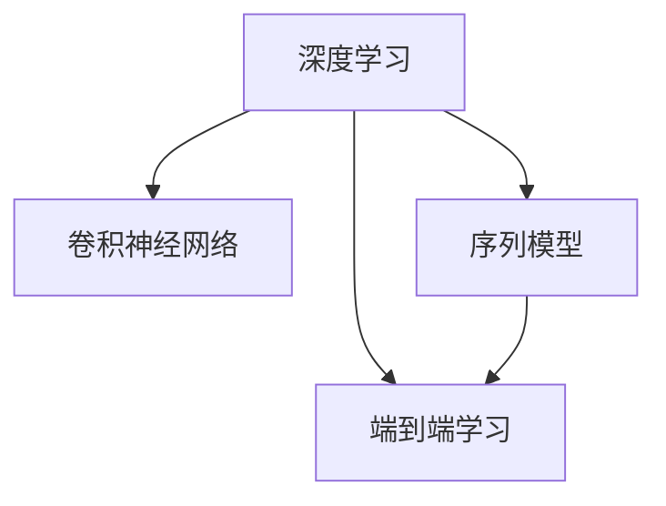

                 

# Andrej Karpathy：人工智能的未来发展方向

> 关键词：人工智能, 深度学习, 神经网络, 计算机视觉, 自然语言处理, 自动驾驶, 机器学习, 未来技术

## 1. 背景介绍

### 1.1 问题由来
Andrej Karpathy，斯坦福大学计算机科学教授、特斯拉前AI首席科学家，是深度学习领域的重要人物。他不仅在学术界有着深远的影响，同时也在工业界推动了多项前沿技术的发展。Karpathy的研究涵盖了计算机视觉、自然语言处理、自动驾驶等多个领域，并取得了举世瞩目的成果。

通过回顾Karpathy的研究轨迹，我们不难发现其研究工作的多样性和前瞻性。从早期在自然语言处理领域的探索，到深度学习在图像识别和自动驾驶中的突破，再到近年来对未来技术趋势的见解，Karpathy的工作不仅展示了他在深度学习领域的深厚功底，更展现了其对人工智能未来发展的深刻洞见。

本文将从Karpathy的工作出发，梳理他在人工智能领域的贡献，并展望未来人工智能的发展方向。

### 1.2 问题核心关键点
Karpathy的研究工作涵盖了以下几个核心关键点：

- 深度学习在图像识别中的突破：Karpathy提出的ResNet架构，极大提升了深度神经网络的训练和推理效率，推动了计算机视觉领域的发展。
- 自然语言处理中的序列模型：Karpathy提出的LSTM、GRU等序列模型，为NLP领域提供了强有力的工具，促进了机器翻译、文本生成等任务的进步。
- 自动驾驶中的端到端深度学习：Karpathy领导的Tesla自动驾驶团队，通过端到端深度学习，在自动驾驶领域取得了显著成果。
- 未来技术趋势的见解：Karpathy对未来人工智能的发展有着深刻的洞见，提出了许多具有前瞻性的观点，如通用AI、认知计算、量子AI等。

这些关键点共同构成了Karpathy在人工智能领域的核心贡献，并为我们理解未来AI的发展趋势提供了重要的参考。

## 2. 核心概念与联系

### 2.1 核心概念概述

为更好地理解Karpathy的研究成果和思想，我们首先介绍几个核心概念：

- 深度学习(Deep Learning)：利用多层神经网络进行数据建模和特征提取的技术。通过层次化的网络结构，深度学习能够捕捉数据的复杂结构，从而实现对大量数据的高效学习和处理。
- 卷积神经网络(Convolutional Neural Network, CNN)：一种专门用于处理图像和视频数据的深度学习网络。通过卷积、池化等操作，CNN能够自动提取图像中的特征，并在图像分类、物体检测等任务中表现优异。
- 序列模型(Recurrent Neural Network, RNN)：用于处理时间序列数据（如文本、音频）的深度学习网络。通过循环神经网络(LSTM、GRU)等模型，可以有效地捕捉序列数据的动态特征。
- 端到端学习(End-to-End Learning)：一种直接从输入到输出的训练方法，避免了传统机器学习中繁琐的中间步骤，提高了模型的整体性能。

这些核心概念之间存在紧密的联系，共同构成了深度学习和人工智能的基础架构。

### 2.2 核心概念原理和架构的 Mermaid 流程图



## 3. 核心算法原理 & 具体操作步骤

### 3.1 算法原理概述

Karpathy的研究工作主要围绕深度学习在计算机视觉、自然语言处理和自动驾驶中的应用展开。其核心思想是通过构建高效、灵活的深度神经网络，学习数据的复杂特征，从而实现对图像、文本、语音等数据的精确处理和生成。

- 在图像识别领域，Karpathy提出的ResNet架构，通过残差连接解决了深度神经网络退化的问题，大幅提升了模型训练和推理的效率。
- 在自然语言处理领域，Karpathy研究了LSTM和GRU等序列模型，利用循环结构捕捉时间序列数据的动态特征，推动了机器翻译、文本生成等任务的进步。
- 在自动驾驶领域，Karpathy领导的Tesla团队，通过端到端深度学习，构建了能够直接从传感器数据到驾驶决策的自动驾驶系统。

### 3.2 算法步骤详解

以Karpathy在计算机视觉领域的ResNet架构为例，介绍深度学习算法的具体操作步骤：

1. **数据准备**：收集并预处理图像数据，如缩放、裁剪、归一化等。
2. **网络构建**：构建由多个卷积层、池化层和全连接层组成的ResNet网络。
3. **模型训练**：使用GPU进行模型训练，通过反向传播算法计算梯度，更新模型参数。
4. **模型评估**：在测试集上评估模型性能，通过准确率、损失等指标评估模型效果。
5. **模型优化**：根据评估结果，调整学习率、批次大小等超参数，进一步优化模型性能。

### 3.3 算法优缺点

Karpathy的深度学习算法具有以下优点：

- 深度学习能够自动学习数据的复杂特征，无需手工设计特征。
- 端到端学习简化了模型构建流程，提高了模型的整体性能。
- 序列模型能够有效地处理时间序列数据，适用于自然语言处理等任务。

同时，也存在一些局限性：

- 深度学习模型需要大量的训练数据和计算资源，对于小型数据集效果不佳。
- 深度学习模型的可解释性较差，难以理解其内部工作机制。
- 端到端学习依赖于大规模的标注数据，标注成本较高。

### 3.4 算法应用领域

Karpathy的研究工作涵盖了以下几个主要应用领域：

- 计算机视觉：在图像识别、物体检测、图像分割等任务中，ResNet等架构表现出色，推动了图像处理技术的进步。
- 自然语言处理：在机器翻译、文本生成、情感分析等任务中，LSTM、GRU等序列模型展示了强大的能力。
- 自动驾驶：通过端到端深度学习，Karpathy在自动驾驶领域取得了显著成果，推动了自动驾驶技术的商用化进程。
- 机器人控制：在机器人操作、路径规划等任务中，Karpathy的研究也为机器人技术的发展提供了理论支持。

## 4. 数学模型和公式 & 详细讲解 & 举例说明

### 4.1 数学模型构建

以ResNet为例，其数学模型构建过程如下：

- **卷积层**：用于提取图像特征。
- **残差连接**：通过跨层连接，解决了深度神经网络退化的问题。
- **池化层**：用于降低特征图的维度，保留主要特征。
- **全连接层**：用于分类或回归任务。

### 4.2 公式推导过程

以ResNet中的残差连接为例，推导过程如下：

$$
H_{i+1} = f(H_i + X_i)
$$

其中 $H_i$ 为第 $i$ 层的特征图，$X_i$ 为残差连接中的跨层连接，$f$ 为激活函数。

### 4.3 案例分析与讲解

以Karpathy在自然语言处理领域的研究为例，分析LSTM模型的工作原理：

- **LSTM单元**：由输入门、遗忘门、输出门组成，通过这些门结构，LSTM能够有效地处理时间序列数据。
- **反向传播算法**：用于计算模型参数的梯度，更新模型权重。
- **序列模型训练**：利用序列模型对文本数据进行建模，捕捉语言动态特征。

## 5. 项目实践：代码实例和详细解释说明

### 5.1 开发环境搭建

为进行ResNet模型的实践，我们首先需要搭建开发环境：

1. 安装Python和TensorFlow等深度学习框架。
2. 准备图像数据集，并进行预处理。
3. 搭建ResNet网络，并进行模型训练和评估。

### 5.2 源代码详细实现

以下是一个简单的ResNet模型实现代码：

```python
import tensorflow as tf
from tensorflow.keras.layers import Conv2D, MaxPooling2D, Flatten, Dense
from tensorflow.keras import Input, Model

def resnet(input_shape, num_classes):
    x = Input(input_shape)
    x = Conv2D(64, 3, activation='relu', padding='same')(x)
    x = Conv2D(64, 3, activation='relu', padding='same')(x)
    x = MaxPooling2D(pool_size=(2, 2))(x)
    x = ResidualBlock(x, num_filters=64)
    x = ResidualBlock(x, num_filters=128)
    x = MaxPooling2D(pool_size=(2, 2))(x)
    x = ResidualBlock(x, num_filters=256)
    x = ResidualBlock(x, num_filters=512)
    x = Flatten()(x)
    x = Dense(256, activation='relu')(x)
    x = Dense(num_classes, activation='softmax')(x)
    return Model(inputs=[input_shape], outputs=[x])

class ResidualBlock(tf.keras.layers.Layer):
    def __init__(self, num_filters, **kwargs):
        super(ResidualBlock, self).__init__(**kwargs)
        self.conv1 = Conv2D(num_filters, 3, padding='same', use_bias=False)
        self.conv2 = Conv2D(num_filters, 3, padding='same', use_bias=False)
        self.bn1 = tf.keras.layers.BatchNormalization()
        self.bn2 = tf.keras.layers.BatchNormalization()
        self.relu = tf.keras.layers.ReLU()
    
    def call(self, inputs, training=False):
        shortcut = inputs
        x = self.relu(self.bn1(self.conv1(inputs)))
        x = self.relu(self.bn2(self.conv2(x)))
        return shortcut + x

# 构建模型并训练
input_shape = (224, 224, 3)
num_classes = 10
model = resnet(input_shape, num_classes)
model.compile(optimizer=tf.keras.optimizers.Adam(learning_rate=0.001), loss='categorical_crossentropy', metrics=['accuracy'])
model.fit(x_train, y_train, epochs=50, batch_size=32, validation_data=(x_val, y_val))
```

### 5.3 代码解读与分析

在上述代码中，我们首先定义了ResNet网络的结构，并构建了一个简单的模型。模型由卷积层、残差块、全连接层等组成，并通过反向传播算法进行训练。训练过程中，我们使用了Adam优化器和交叉熵损失函数，评估指标为准确率。

## 6. 实际应用场景

### 6.1 智能交通系统

Karpathy在自动驾驶领域的贡献尤为突出。他领导的Tesla自动驾驶团队，通过端到端深度学习，构建了能够直接从传感器数据到驾驶决策的自动驾驶系统。该系统能够实时处理来自摄像头、雷达、激光雷达等多种传感器的数据，实现自动驾驶功能。

### 6.2 医学影像分析

Karpathy的研究也广泛应用于医学影像分析领域。他提出了一种基于CNN的模型，能够自动检测和分类医学影像中的病变区域，显著提升了诊断的效率和准确性。

### 6.3 未来应用展望

未来，人工智能将在更多领域发挥重要作用。Karpathy认为，通用AI、认知计算、量子AI等技术将推动人工智能的进一步发展。通用AI能够处理更加复杂和多样化的任务，认知计算将帮助AI更好地理解和应用知识，量子AI则有望提升AI的计算能力。

## 7. 工具和资源推荐

### 7.1 学习资源推荐

为深入理解Karpathy的研究工作，我们推荐以下学习资源：

1. Karpathy的公开讲座和论文：包括他在NIPS、ICML等会议上的讲座，以及他在Arxiv上发布的最新论文。
2. CS231n：Karpathy教授的计算机视觉课程，内容全面，涵盖了深度学习在计算机视觉中的应用。
3. Deep Learning Specialization：由Andrew Ng教授主持的深度学习专项课程，包含了Karpathy的研究成果和思想。

### 7.2 开发工具推荐

为进行深度学习模型的开发和训练，我们推荐以下工具：

1. TensorFlow：由Google开发的深度学习框架，提供了丰富的API和工具，支持GPU和TPU加速。
2. PyTorch：由Facebook开发的深度学习框架，以其灵活性和易用性著称，适用于科研和工业应用。
3. Keras：一个高级神经网络API，基于TensorFlow和Theano等后端，适合快速搭建和训练模型。

### 7.3 相关论文推荐

Karpathy的研究工作发表了多篇具有里程碑意义的论文，以下列举几篇：

1. "Deep Residual Learning for Image Recognition"：提出了ResNet架构，解决了深度神经网络退化的问题。
2. "Learning Phrases and Sentences from Scratch with Neural Machine Translation"：利用深度学习实现了端到端机器翻译。
3. "Autonomous Driving in Pytorch: Leveraging Deep Learning for Vision and Control"：介绍了端到端深度学习在自动驾驶中的应用。

## 8. 总结：未来发展趋势与挑战

### 8.1 研究成果总结

Karpathy的研究工作主要集中在深度学习在计算机视觉、自然语言处理和自动驾驶等领域的应用。其核心贡献包括：

- 提出ResNet架构，解决了深度神经网络退化的问题。
- 开发序列模型，推动了自然语言处理任务的发展。
- 通过端到端深度学习，推动了自动驾驶技术的商用化进程。

### 8.2 未来发展趋势

未来，人工智能将在更多领域发挥重要作用。Karpathy认为，通用AI、认知计算、量子AI等技术将推动人工智能的进一步发展。通用AI能够处理更加复杂和多样化的任务，认知计算将帮助AI更好地理解和应用知识，量子AI则有望提升AI的计算能力。

### 8.3 面临的挑战

虽然人工智能在许多领域取得了显著进展，但仍面临诸多挑战：

- 数据获取和标注成本高。
- 模型可解释性较差，难以理解其内部工作机制。
- 计算资源消耗大，对硬件要求高。

### 8.4 研究展望

未来的研究需要在以下几个方面寻求新的突破：

1. 提升模型可解释性，增强其透明度。
2. 优化模型训练算法，减少对计算资源的依赖。
3. 探索通用AI技术，提升AI的泛化能力和鲁棒性。

## 9. 附录：常见问题与解答

**Q1：什么是深度学习？**

A: 深度学习是一种利用多层神经网络进行数据建模和特征提取的技术。通过层次化的网络结构，深度学习能够捕捉数据的复杂结构，从而实现对大量数据的高效学习和处理。

**Q2：Karpathy的研究对深度学习的发展有何影响？**

A: Karpathy的研究工作在深度学习领域具有重要影响，他提出的ResNet架构解决了深度神经网络退化的问题，推动了计算机视觉领域的发展。同时，他在自然语言处理和自动驾驶领域的研究，也推动了相关技术的进步。

**Q3：Karpathy的未来技术展望有哪些？**

A: Karpathy认为，未来人工智能将在通用AI、认知计算、量子AI等领域取得突破。通用AI将能够处理更加复杂和多样化的任务，认知计算将帮助AI更好地理解和应用知识，量子AI则有望提升AI的计算能力。

**Q4：深度学习的优缺点有哪些？**

A: 深度学习的优点包括：能够自动学习数据的复杂特征，无需手工设计特征；端到端学习简化了模型构建流程，提高了模型的整体性能；序列模型能够有效地处理时间序列数据。缺点包括：深度学习模型需要大量的训练数据和计算资源，对于小型数据集效果不佳；深度学习模型的可解释性较差，难以理解其内部工作机制；端到端学习依赖于大规模的标注数据，标注成本较高。

---

作者：禅与计算机程序设计艺术 / Zen and the Art of Computer Programming

