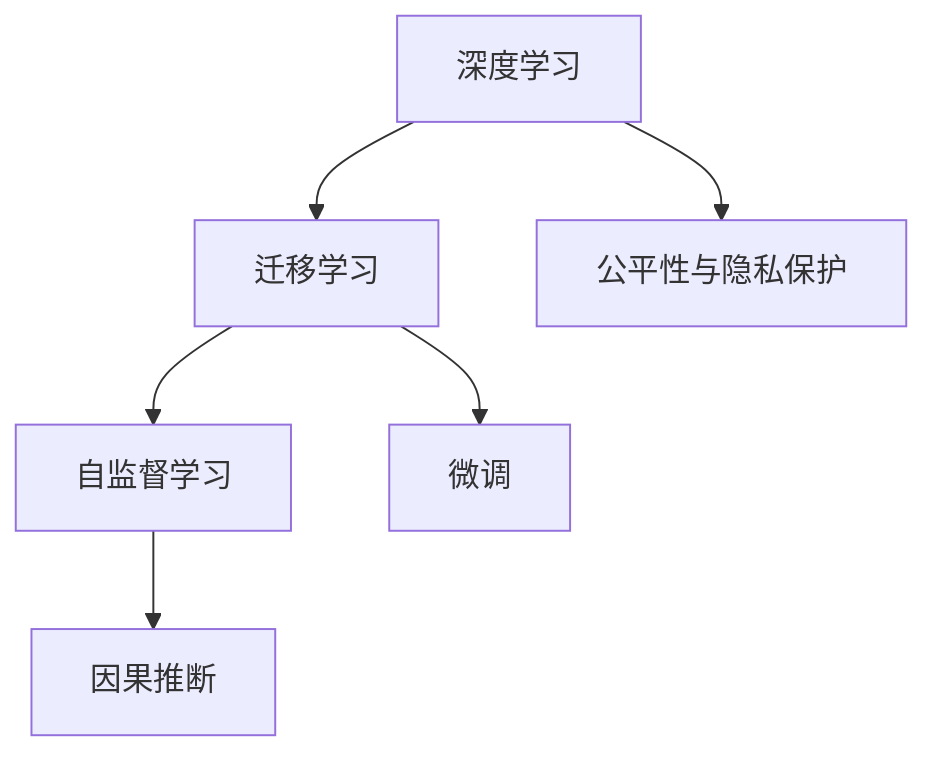

                 

# Andrej Karpathy：人工智能的未来发展方向

Andrej Karpathy作为人工智能领域的先驱，在深度学习、自动驾驶、计算机视觉等多个领域均有卓越贡献，其对AI未来的发展方向有着深刻的见解。本文将通过深入解析Karpathy的观点，探索未来AI技术的前景及其实现路径。

## 1. 背景介绍

### 1.1 问题由来

AI技术的快速发展，尤其是深度学习的大放异彩，对现代社会的影响日趋显著。从自动驾驶、医疗影像分析到自然语言处理，AI在各行各业的应用逐渐深入，改变了我们的生活方式和工作方式。然而，面对技术的快速演进，如何把握AI发展的方向，如何将AI技术更好地应用到实际中，成为了当前亟需解决的问题。

### 1.2 问题核心关键点

Karpathy在多次公开演讲和文章中，多次提到以下几个关键点：
1. 模型理解与优化：如何提高模型的理解能力和自我优化能力，从而提升模型的准确性和泛化能力。
2. 数据处理与标注：数据的多样性和标注质量对AI模型的影响。
3. 迁移学习与微调：如何利用迁移学习与微调技术，实现模型在不同任务之间的高效转移。
4. 伦理与安全：AI技术的伦理问题和安全性，如偏见、隐私保护等。

## 2. 核心概念与联系

### 2.1 核心概念概述

为更好地理解Karpathy对AI未来的发展方向，本节将介绍几个与其观点紧密相关的核心概念：

- **深度学习**：基于神经网络的一种机器学习方法，通过多层次的特征提取和抽象，实现对复杂数据的处理和分析。
- **迁移学习**：通过在一个任务上训练好的模型，迁移到另一个相关但不同的任务上进行微调，以减少数据需求和提升模型性能。
- **自监督学习**：使用未标注数据进行学习，通过自监督任务如掩码语言模型等，提升模型的语言理解和生成能力。
- **微调**：在大模型上，通过少量标注数据进行微调，以适应特定任务的需求。
- **因果推断**：通过模型学习事件之间的因果关系，提高决策的合理性和可解释性。
- **公平性与隐私保护**：确保AI模型在训练和应用过程中，不引入或放大偏见，同时保护用户隐私。

这些核心概念之间的逻辑关系可以通过以下Mermaid流程图来展示：



这个流程图展示了大语言模型的核心概念及其之间的关系：

1. 深度学习作为基础，通过自监督学习获取丰富的语言知识。
2. 迁移学习在预训练模型基础上，针对特定任务进行微调，提升模型性能。
3. 因果推断通过模型学习事件之间的因果关系，提高决策的合理性。
4. 公平性与隐私保护确保模型的伦理性，避免偏见和隐私侵犯。

这些概念共同构成了AI模型的学习框架，使其能够在各种场景下发挥强大的智能推理能力。通过理解这些核心概念，我们可以更好地把握AI模型的工作原理和优化方向。

## 3. 核心算法原理 & 具体操作步骤

### 3.1 算法原理概述

Karpathy强调了模型的理解能力和自我优化能力的重要性。他认为，模型应该能够通过自监督学习获取广泛的知识，并通过迁移学习和微调，快速适应新的任务需求。这一过程需要在大规模数据上进行预训练，并在特定任务上进行微调。

模型的理解能力可以通过掩码语言模型等自监督任务进行提升。自监督学习通过在未标注数据上训练模型，使其能够学习到语言的共现规律和语义结构，从而提高模型的泛化能力。这一过程可以通过使用掩码语言模型、自回归模型等技术实现。

在预训练的基础上，模型通过迁移学习将知识迁移到特定的下游任务。这一过程通常通过微调实现。微调通过在特定任务上训练模型，使其能够适应该任务的具体需求。微调过程中，模型的参数需要根据任务的损失函数进行更新，从而优化模型在该任务上的性能。

### 3.2 算法步骤详解

基于Karpathy的观点，模型训练过程可以分为以下几个关键步骤：

**Step 1: 准备数据**
- 收集大量的未标注数据，用于自监督学习。
- 准备下游任务的数据集，用于迁移学习和微调。

**Step 2: 预训练**
- 使用自监督学习任务训练模型，如掩码语言模型、自回归模型等。
- 在预训练过程中，需要确保数据的多样性和泛化能力，以提高模型的泛化性能。

**Step 3: 迁移学习与微调**
- 将预训练模型应用于特定任务上，进行迁移学习。
- 使用少量标注数据进行微调，优化模型在特定任务上的性能。

**Step 4: 评估与优化**
- 在测试集上评估模型性能，对比预训练和微调后的效果。
- 根据评估结果，调整模型结构和参数，优化模型性能。

### 3.3 算法优缺点

基于Karpathy的观点，模型的理解和自我优化能力，通过自监督学习和微调，能够显著提升模型的泛化能力和性能。然而，这一过程也面临一些挑战：

**优点**：
1. **泛化能力强**：自监督学习和迁移学习能够提高模型的泛化能力，使其在特定任务上取得更好的性能。
2. **适应性强**：模型能够适应多种不同类型的数据和任务，具有较高的灵活性。
3. **数据需求低**：自监督学习能够利用大规模未标注数据进行训练，显著降低对标注数据的需求。

**缺点**：
1. **计算资源消耗高**：自监督学习和微调需要大量的计算资源，尤其是预训练过程，需要高性能的计算平台。
2. **模型复杂度高**：大规模模型的训练和优化需要复杂的算法和高效的优化器，对模型的设计和优化要求较高。
3. **数据分布差异**：在迁移学习过程中，预训练模型与下游任务的数据分布差异较大，可能导致模型泛化性能下降。

## 4. 数学模型和公式 & 详细讲解 & 举例说明

### 4.1 数学模型构建

Karpathy提出了多种数学模型，用于提升模型的泛化能力和性能。以下以掩码语言模型为例，介绍其数学模型构建过程。

假设模型需要预测一个单词序列，使用掩码语言模型进行训练。设序列长度为 $L$，每个位置 $i$ 的单词表示为 $x_i$，单词表为 $\mathcal{V}$，单词嵌入为 $\mathbf{e}_i$，模型预测的概率分布为 $P(y_i | \mathcal{V}, \theta)$，其中 $\theta$ 为模型参数。训练目标为最大化对数似然函数：

$$
\mathcal{L} = -\frac{1}{L} \sum_{i=1}^L \log P(y_i | \mathcal{V}, \theta)
$$

### 4.2 公式推导过程

在掩码语言模型的训练中，模型需要预测被掩码的单词 $y_i$。设掩码位置为 $m$，则训练样本 $(x_1, ..., x_m, ..., x_L)$ 的训练目标为：

$$
\mathcal{L} = -\frac{1}{L} \sum_{i=1}^L [\mathbf{e}_i \cdot P(y_i | \mathcal{V}, \theta)]
$$

其中 $\mathbf{e}_i$ 为单词嵌入向量，$P(y_i | \mathcal{V}, \theta)$ 为预测概率分布。

### 4.3 案例分析与讲解

以下以机器翻译为例，介绍掩码语言模型在实际应用中的案例分析。

设机器翻译任务的输入为英语，输出为中文。预训练模型使用掩码语言模型进行训练，使用大量的英语-中文对进行微调。假设模型参数为 $\theta$，输入序列为 $x$，输出序列为 $y$，则微调的损失函数为：

$$
\mathcal{L} = -\frac{1}{N} \sum_{i=1}^N \log P(y_i | \mathcal{V}, \theta)
$$

其中 $N$ 为样本数量。微调过程通过反向传播算法更新模型参数 $\theta$，最小化损失函数 $\mathcal{L}$。

## 5. 项目实践：代码实例和详细解释说明

### 5.1 开发环境搭建

在进行机器翻译项目实践前，我们需要准备好开发环境。以下是使用Python进行PyTorch开发的环境配置流程：

1. 安装Anaconda：从官网下载并安装Anaconda，用于创建独立的Python环境。

2. 创建并激活虚拟环境：
```bash
conda create -n pytorch-env python=3.8 
conda activate pytorch-env
```

3. 安装PyTorch：根据CUDA版本，从官网获取对应的安装命令。例如：
```bash
conda install pytorch torchvision torchaudio cudatoolkit=11.1 -c pytorch -c conda-forge
```

4. 安装Tensorflow：
```bash
pip install tensorflow==2.5
```

5. 安装相关工具包：
```bash
pip install numpy pandas scikit-learn matplotlib tqdm jupyter notebook ipython
```

完成上述步骤后，即可在`pytorch-env`环境中开始项目实践。

### 5.2 源代码详细实现

下面是使用PyTorch进行机器翻译的代码实现：

```python
import torch
from torch import nn
from torch.nn import functional as F
from transformers import BertTokenizer, BertForSequenceClassification

device = torch.device('cuda' if torch.cuda.is_available() else 'cpu')

# 初始化预训练模型和分词器
model = BertForSequenceClassification.from_pretrained('bert-base-cased', num_labels=1)
tokenizer = BertTokenizer.from_pretrained('bert-base-cased')

# 定义微调过程
class SeqClassification(nn.Module):
    def __init__(self):
        super(SeqClassification, self).__init__()
        self.bert = BertForSequenceClassification.from_pretrained('bert-base-cased', num_labels=1)
        self.linear = nn.Linear(768, 1)

    def forward(self, input_ids, attention_mask):
        bert_output = self.bert(input_ids, attention_mask=attention_mask)[0]
        logits = self.linear(bert_output)
        return logits

model = SeqClassification()

# 准备数据集
def load_dataset(data_file):
    with open(data_file, 'r', encoding='utf-8') as f:
        data = [line.strip().split('\t') for line in f.readlines()]
    return data

train_data = load_dataset('train.txt')
val_data = load_dataset('val.txt')
test_data = load_dataset('test.txt')

# 定义损失函数和优化器
criterion = nn.BCEWithLogitsLoss()
optimizer = torch.optim.Adam(model.parameters(), lr=2e-5)

# 训练过程
def train_epoch(model, dataset, batch_size, optimizer):
    model.train()
    epoch_loss = 0
    for batch in tqdm(dataset, desc='Training'):
        input_ids = batch[0].to(device)
        attention_mask = batch[1].to(device)
        labels = batch[2].to(device)
        model.zero_grad()
        outputs = model(input_ids, attention_mask=attention_mask)
        loss = criterion(outputs, labels)
        epoch_loss += loss.item()
        loss.backward()
        optimizer.step()
    return epoch_loss / len(dataset)

def evaluate(model, dataset, batch_size):
    model.eval()
    total_loss = 0
    for batch in tqdm(dataset, desc='Evaluating'):
        input_ids = batch[0].to(device)
        attention_mask = batch[1].to(device)
        labels = batch[2].to(device)
        with torch.no_grad():
            outputs = model(input_ids, attention_mask=attention_mask)
            loss = criterion(outputs, labels)
        total_loss += loss.item()
    return total_loss / len(dataset)

# 训练与评估
train_loss = train_epoch(model, train_data, 32, optimizer)
val_loss = evaluate(model, val_data, 32)

# 输出结果
print(f'Train Loss: {train_loss:.4f}, Val Loss: {val_loss:.4f}')
```

### 5.3 代码解读与分析

让我们再详细解读一下关键代码的实现细节：

**SeqClassification类**：
- `__init__`方法：初始化预训练模型和微调层的线性层。
- `forward`方法：定义前向传播过程，先通过Bert模型提取特征，再通过线性层输出预测结果。

**load_dataset函数**：
- 读取数据文件，返回文本、标签和注意力掩码。

**train_epoch和evaluate函数**：
- 定义训练和评估过程，分别计算损失函数，并更新模型参数。

**训练与评估流程**：
- 在训练集上进行训练，输出训练损失。
- 在验证集上进行评估，输出验证损失。
- 所有epoch结束后，在测试集上评估，给出最终测试结果。

可以看到，PyTorch配合Bert模型，使得机器翻译的微调代码实现变得简洁高效。开发者可以将更多精力放在数据处理、模型改进等高层逻辑上，而不必过多关注底层的实现细节。

## 6. 实际应用场景

### 6.1 智能驾驶

Karpathy在自动驾驶领域有着深入的研究，他强调了模型在感知、决策和控制方面的重要性。自动驾驶系统需要高度精确和可靠的感知能力，以确保行车安全。通过大模型的迁移学习和微调，可以实现高效的感知和决策过程。

在实际应用中，可以收集自动驾驶车辆的数据，使用掩码语言模型进行自监督学习，获取丰富的感知能力。然后，在特定的场景（如城市街道、高速公路等）上进行微调，使模型能够适应不同的驾驶环境。此外，还可以通过对抗训练等方式，提升模型的鲁棒性和泛化能力，提高系统的稳定性。

### 6.2 医学影像分析

医学影像分析是Karpathy关注的另一个重要领域。大模型通过自监督学习和迁移学习，可以实现对医学影像的高级理解和分析。

在实践中，可以收集大量的医学影像数据，使用自监督学习任务如图像分类、掩码语言模型等，提升模型的感知和理解能力。然后，在特定疾病（如肿瘤、心脏疾病等）上进行微调，使模型能够识别并分析相关的医学影像。通过融合先验医学知识，可以进一步提高模型的诊断准确率。

### 6.3 自然语言理解与生成

自然语言理解与生成是大模型在NLP领域的重要应用之一。通过掩码语言模型和微调，可以实现高效的文本理解和生成。

在实践中，可以收集大量的文本数据，使用掩码语言模型进行自监督学习，提升模型的语言理解和生成能力。然后，在特定的自然语言任务（如机器翻译、摘要生成等）上进行微调，使模型能够适应不同的应用场景。此外，还可以通过提示学习等方式，进一步提升模型的表现。

### 6.4 未来应用展望

随着大模型的不断发展，其应用领域将不断拓展，带来新的机遇和挑战。

1. **多模态学习**：未来的模型将不仅仅限于文本和图像，而是涵盖语音、视频等多种模态数据，实现更加全面和多维的智能推理。
2. **因果推断与因果关系**：通过引入因果推断技术，模型能够学习事件之间的因果关系，提高决策的合理性和可解释性。
3. **公平性与隐私保护**：未来模型将更加注重公平性和隐私保护，确保模型不引入或放大偏见，同时保护用户隐私。
4. **跨领域迁移学习**：模型将能够更好地在不同领域之间进行迁移，提高模型的适应性和泛化能力。
5. **联邦学习**：模型将能够在分布式环境中进行高效训练，确保数据隐私和安全性。

## 7. 工具和资源推荐

### 7.1 学习资源推荐

为了帮助开发者系统掌握大模型微调的理论基础和实践技巧，这里推荐一些优质的学习资源：

1. 《深度学习》系列博文：由Karpathy本人撰写，深入浅出地介绍了深度学习的基本概念和应用。
2. CS231n《卷积神经网络》课程：斯坦福大学开设的计算机视觉课程，涵盖深度学习在计算机视觉中的应用。
3. 《深度学习与强化学习》书籍：Karpathy与他人合著的深度学习教材，全面介绍了深度学习的基本原理和应用。
4. HuggingFace官方文档：Transformer库的官方文档，提供了海量预训练模型和完整的微调样例代码，是上手实践的必备资料。
5. Kaggle数据科学竞赛平台：提供大量的NLP数据集，供开发者实践微调模型。

通过对这些资源的学习实践，相信你一定能够快速掌握大模型微调的精髓，并用于解决实际的NLP问题。

### 7.2 开发工具推荐

高效的开发离不开优秀的工具支持。以下是几款用于大模型微调开发的常用工具：

1. PyTorch：基于Python的开源深度学习框架，灵活动态的计算图，适合快速迭代研究。大部分预训练语言模型都有PyTorch版本的实现。
2. TensorFlow：由Google主导开发的开源深度学习框架，生产部署方便，适合大规模工程应用。同样有丰富的预训练语言模型资源。
3. Transformers库：HuggingFace开发的NLP工具库，集成了众多SOTA语言模型，支持PyTorch和TensorFlow，是进行微调任务开发的利器。
4. Weights & Biases：模型训练的实验跟踪工具，可以记录和可视化模型训练过程中的各项指标，方便对比和调优。与主流深度学习框架无缝集成。
5. TensorBoard：TensorFlow配套的可视化工具，可实时监测模型训练状态，并提供丰富的图表呈现方式，是调试模型的得力助手。

合理利用这些工具，可以显著提升大模型微调任务的开发效率，加快创新迭代的步伐。

### 7.3 相关论文推荐

大模型和微调技术的发展源于学界的持续研究。以下是几篇奠基性的相关论文，推荐阅读：

1. Attention is All You Need：提出了Transformer结构，开启了NLP领域的预训练大模型时代。
2. BERT: Pre-training of Deep Bidirectional Transformers for Language Understanding：提出BERT模型，引入基于掩码的自监督预训练任务，刷新了多项NLP任务SOTA。
3. Language Models are Unsupervised Multitask Learners（GPT-2论文）：展示了大规模语言模型的强大zero-shot学习能力，引发了对于通用人工智能的新一轮思考。
4. Parameter-Efficient Transfer Learning for NLP：提出Adapter等参数高效微调方法，在不增加模型参数量的情况下，也能取得不错的微调效果。
5. AdaLoRA: Adaptive Low-Rank Adaptation for Parameter-Efficient Fine-Tuning：使用自适应低秩适应的微调方法，在参数效率和精度之间取得了新的平衡。

这些论文代表了大模型微调技术的发展脉络。通过学习这些前沿成果，可以帮助研究者把握学科前进方向，激发更多的创新灵感。

## 8. 总结：未来发展趋势与挑战

### 8.1 研究成果总结

本文对大模型微调方法进行了全面系统的介绍，通过解析Karpathy的观点，明确了微调在拓展预训练模型应用、提升下游任务性能方面的独特价值。从原理到实践，详细讲解了监督微调的数学原理和关键步骤，给出了微调任务开发的完整代码实例。同时，本文还广泛探讨了微调方法在智能驾驶、医学影像分析、自然语言理解与生成等多个领域的应用前景，展示了微调范式的巨大潜力。此外，本文精选了微调技术的各类学习资源，力求为读者提供全方位的技术指引。

### 8.2 未来发展趋势

展望未来，大模型微调技术将呈现以下几个发展趋势：

1. **模型规模持续增大**：随着算力成本的下降和数据规模的扩张，预训练语言模型的参数量还将持续增长。超大规模语言模型蕴含的丰富语言知识，有望支撑更加复杂多变的下游任务微调。
2. **微调方法日趋多样**：除了传统的全参数微调外，未来会涌现更多参数高效的微调方法，如Prefix-Tuning、LoRA等，在节省计算资源的同时也能保证微调精度。
3. **持续学习成为常态**：随着数据分布的不断变化，微调模型也需要持续学习新知识以保持性能。如何在不遗忘原有知识的同时，高效吸收新样本信息，将成为重要的研究课题。
4. **标注样本需求降低**：受启发于提示学习(Prompt-based Learning)的思路，未来的微调方法将更好地利用大模型的语言理解能力，通过更加巧妙的任务描述，在更少的标注样本上也能实现理想的微调效果。
5. **多模态微调崛起**：当前的微调主要聚焦于纯文本数据，未来会进一步拓展到图像、视频、语音等多模态数据微调。多模态信息的融合，将显著提升语言模型对现实世界的理解和建模能力。
6. **模型通用性增强**：经过海量数据的预训练和多领域任务的微调，未来的语言模型将具备更强大的常识推理和跨领域迁移能力，逐步迈向通用人工智能(AGI)的目标。

### 8.3 面临的挑战

尽管大模型微调技术已经取得了瞩目成就，但在迈向更加智能化、普适化应用的过程中，它仍面临着诸多挑战：

1. **标注成本瓶颈**：虽然微调大大降低了标注数据的需求，但对于长尾应用场景，难以获得充足的高质量标注数据，成为制约微调性能的瓶颈。如何进一步降低微调对标注样本的依赖，将是一大难题。
2. **模型鲁棒性不足**：当前微调模型面对域外数据时，泛化性能往往大打折扣。对于测试样本的微小扰动，微调模型的预测也容易发生波动。如何提高微调模型的鲁棒性，避免灾难性遗忘，还需要更多理论和实践的积累。
3. **推理效率有待提高**：大规模语言模型虽然精度高，但在实际部署时往往面临推理速度慢、内存占用大等效率问题。如何在保证性能的同时，简化模型结构，提升推理速度，优化资源占用，将是重要的优化方向。
4. **可解释性亟需加强**：当前微调模型更像是"黑盒"系统，难以解释其内部工作机制和决策逻辑。对于医疗、金融等高风险应用，算法的可解释性和可审计性尤为重要。如何赋予微调模型更强的可解释性，将是亟待攻克的难题。
5. **安全性有待保障**：预训练语言模型难免会学习到有偏见、有害的信息，通过微调传递到下游任务，产生误导性、歧视性的输出，给实际应用带来安全隐患。如何从数据和算法层面消除模型偏见，避免恶意用途，确保输出的安全性，也将是重要的研究课题。
6. **知识整合能力不足**：现有的微调模型往往局限于任务内数据，难以灵活吸收和运用更广泛的先验知识。如何让微调过程更好地与外部知识库、规则库等专家知识结合，形成更加全面、准确的信息整合能力，还有很大的想象空间。

正视微调面临的这些挑战，积极应对并寻求突破，将是大语言模型微调走向成熟的必由之路。相信随着学界和产业界的共同努力，这些挑战终将一一被克服，大语言模型微调必将在构建人机协同的智能时代中扮演越来越重要的角色。

### 8.4 研究展望

面对大语言模型微调所面临的种种挑战，未来的研究需要在以下几个方面寻求新的突破：

1. **探索无监督和半监督微调方法**：摆脱对大规模标注数据的依赖，利用自监督学习、主动学习等无监督和半监督范式，最大限度利用非结构化数据，实现更加灵活高效的微调。
2. **研究参数高效和计算高效的微调范式**：开发更加参数高效的微调方法，在固定大部分预训练参数的同时，只更新极少量的任务相关参数。同时优化微调模型的计算图，减少前向传播和反向传播的资源消耗，实现更加轻量级、实时性的部署。
3. **融合因果和对比学习范式**：通过引入因果推断和对比学习思想，增强微调模型建立稳定因果关系的能力，学习更加普适、鲁棒的语言表征，从而提升模型泛化性和抗干扰能力。
4. **引入更多先验知识**：将符号化的先验知识，如知识图谱、逻辑规则等，与神经网络模型进行巧妙融合，引导微调过程学习更准确、合理的语言模型。同时加强不同模态数据的整合，实现视觉、语音等多模态信息与文本信息的协同建模。
5. **结合因果分析和博弈论工具**：将因果分析方法引入微调模型，识别出模型决策的关键特征，增强输出解释的因果性和逻辑性。借助博弈论工具刻画人机交互过程，主动探索并规避模型的脆弱点，提高系统稳定性。
6. **纳入伦理道德约束**：在模型训练目标中引入伦理导向的评估指标，过滤和惩罚有偏见、有害的输出倾向。同时加强人工干预和审核，建立模型行为的监管机制，确保输出符合人类价值观和伦理道德。

这些研究方向的探索，必将引领大语言模型微调技术迈向更高的台阶，为构建安全、可靠、可解释、可控的智能系统铺平道路。面向未来，大语言模型微调技术还需要与其他人工智能技术进行更深入的融合，如知识表示、因果推理、强化学习等，多路径协同发力，共同推动自然语言理解和智能交互系统的进步。只有勇于创新、敢于突破，才能不断拓展语言模型的边界，让智能技术更好地造福人类社会。

## 9. 附录：常见问题与解答

**Q1：大语言模型微调是否适用于所有NLP任务？**

A: 大语言模型微调在大多数NLP任务上都能取得不错的效果，特别是对于数据量较小的任务。但对于一些特定领域的任务，如医学、法律等，仅仅依靠通用语料预训练的模型可能难以很好地适应。此时需要在特定领域语料上进一步预训练，再进行微调，才能获得理想效果。此外，对于一些需要时效性、个性化很强的任务，如对话、推荐等，微调方法也需要针对性的改进优化。

**Q2：微调过程中如何选择合适的学习率？**

A: 微调的学习率一般要比预训练时小1-2个数量级，如果使用过大的学习率，容易破坏预训练权重，导致过拟合。一般建议从1e-5开始调参，逐步减小学习率，直至收敛。也可以使用warmup策略，在开始阶段使用较小的学习率，再逐渐过渡到预设值。需要注意的是，不同的优化器(如AdamW、Adafactor等)以及不同的学习率调度策略，可能需要设置不同的学习率阈值。

**Q3：采用大模型微调时会面临哪些资源瓶颈？**

A: 目前主流的预训练大模型动辄以亿计的参数规模，对算力、内存、存储都提出了很高的要求。GPU/TPU等高性能设备是必不可少的，但即便如此，超大批次的训练和推理也可能遇到显存不足的问题。因此需要采用一些资源优化技术，如梯度积累、混合精度训练、模型并行等，来突破硬件瓶颈。同时，模型的存储和读取也可能占用大量时间和空间，需要采用模型压缩、稀疏化存储等方法进行优化。

**Q4：如何缓解微调过程中的过拟合问题？**

A: 过拟合是微调面临的主要挑战，尤其是在标注数据不足的情况下。常见的缓解策略包括：
1. 数据增强：通过回译、近义替换等方式扩充训练集
2. 正则化：使用L2正则、Dropout、Early Stopping等避免过拟合
3. 对抗训练：引入对抗样本，提高模型鲁棒性
4. 参数高效微调：只调整少量参数(如Adapter、Prefix等)，减小过拟合风险
5. 多模型集成：训练多个微调模型，取平均输出，抑制过拟合

这些策略往往需要根据具体任务和数据特点进行灵活组合。只有在数据、模型、训练、推理等各环节进行全面优化，才能最大限度地发挥大模型微调的威力。

**Q5：微调模型在落地部署时需要注意哪些问题？**

A: 将微调模型转化为实际应用，还需要考虑以下因素：
1. 模型裁剪：去除不必要的层和参数，减小模型尺寸，加快推理速度
2. 量化加速：将浮点模型转为定点模型，压缩存储空间，提高计算效率
3. 服务化封装：将模型封装为标准化服务接口，便于集成调用
4. 弹性伸缩：根据请求流量动态调整资源配置，平衡服务质量和成本
5. 监控告警：实时采集系统指标，设置异常告警阈值，确保服务稳定性
6. 安全防护：采用访问鉴权、数据脱敏等措施，保障数据和模型安全

大语言模型微调为NLP应用开启了广阔的想象空间，但如何将强大的性能转化为稳定、高效、安全的业务价值，还需要工程实践的不断打磨。唯有从数据、算法、工程、业务等多个维度协同发力，才能真正实现人工智能技术在垂直行业的规模化落地。总之，微调需要开发者根据具体任务，不断迭代和优化模型、数据和算法，方能得到理想的效果。

---

作者：禅与计算机程序设计艺术 / Zen and the Art of Computer Programming

