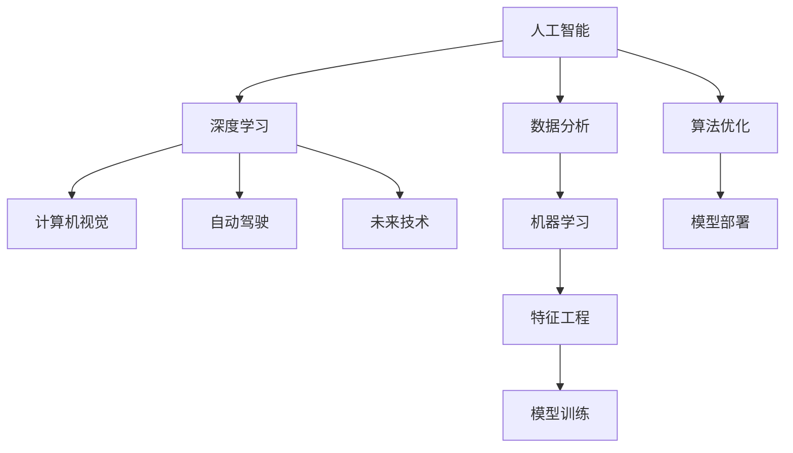

                 

# Andrej Karpathy：人工智能的未来发展机遇

> 关键词：人工智能，深度学习，计算机视觉，自动驾驶，未来技术，深度神经网络

## 1. 背景介绍

在过去的十年中，人工智能(AI)技术以惊人的速度发展，深刻改变了我们的生活方式。如今，AI已经成为了一个广泛应用的热门话题，几乎在各个领域都有它的身影。其中，深度学习(DL)作为AI的核心技术之一，极大地推动了AI的进步。在众多深度学习专家中，Andrej Karpathy无疑是其中的佼佼者。他不仅在学术界有着深厚的造诣，同时在工业界也积累了丰富的经验，对于人工智能的未来发展有着独到的见解。本文将深入探讨Andrej Karpathy对于人工智能未来发展的思考和观点。

## 2. 核心概念与联系

### 2.1 核心概念概述

为了更全面地理解Andrej Karpathy的观点，我们首先需要了解一些核心概念。

- **人工智能(AI)**：通过计算机程序模拟人类智能，实现信息处理、判断、推理、学习、问题解决、感知、语言理解等任务。

- **深度学习(DL)**：一种模拟人脑神经网络结构的机器学习技术，通过多层非线性变换，从数据中提取高级特征，解决复杂的模式识别和预测问题。

- **计算机视觉(CV)**：让计算机理解图像和视频中的视觉内容，实现对象检测、图像分割、场景理解等任务。

- **自动驾驶(Autonomous Driving)**：利用AI技术，使车辆能够在没有人类干预的情况下进行导航、决策和操作。

- **未来技术**：包括量子计算、脑机接口、全息通信等前沿技术，旨在解决现有的技术瓶颈，推动技术创新和应用。

### 2.2 核心概念原理和架构的 Mermaid 流程图



这个流程图展示了人工智能的核心组件及其相互关系。可以看出，深度学习是连接计算机视觉、自动驾驶和未来技术的重要桥梁，而数据分析、特征工程和模型训练则是深度学习的基础。

## 3. 核心算法原理 & 具体操作步骤

### 3.1 算法原理概述

Andrej Karpathy认为，深度学习之所以能够取得如此成功，是因为它能够自动地从大量数据中学习特征，从而解决了传统机器学习难以处理的非线性、高维数据问题。在实际应用中，深度学习通常分为训练和推理两个阶段。训练阶段通过大量标注数据，优化模型参数，使模型能够准确地进行预测；推理阶段则是将训练好的模型应用于新的数据集，进行实时或批处理预测。

### 3.2 算法步骤详解

以下是一个基于深度学习的计算机视觉任务（如图像分类）的算法步骤：

1. **数据准备**：收集并标注大量图像数据，通常需要数千甚至数万张图片，涵盖不同类别。

2. **模型选择**：选择合适的深度学习模型（如卷积神经网络CNN），并设置适当的超参数（如学习率、批大小、迭代次数）。

3. **模型训练**：将数据集分为训练集、验证集和测试集，使用训练集对模型进行迭代优化，每次迭代使用验证集评估模型性能，并调整超参数。

4. **模型测试**：在测试集上对训练好的模型进行测试，评估模型性能，并对比训练集和验证集的结果。

5. **模型部署**：将训练好的模型部署到实际应用场景中，进行实时或批处理预测。

### 3.3 算法优缺点

深度学习的优点在于：
- 能够自动学习特征，无需手工设计；
- 处理高维数据和复杂模式能力强；
- 通过大规模数据训练，能够实现高性能预测。

然而，深度学习也存在一些缺点：
- 需要大量标注数据，标注成本高；
- 模型复杂，训练时间长；
- 对数据分布变化敏感，容易过拟合。

### 3.4 算法应用领域

深度学习技术已经被广泛应用于多个领域，如计算机视觉、自然语言处理、自动驾驶、医疗健康、金融科技等。Andrej Karpathy本人也在这个领域做出了许多创新性的贡献，例如在自动驾驶、计算机视觉和深度学习框架的优化等方面。

## 4. 数学模型和公式 & 详细讲解 & 举例说明

### 4.1 数学模型构建

假设有一个图像分类任务，我们使用卷积神经网络(CNN)作为模型。输入是一个$m \times n \times c$的图像，其中$m$和$n$是图像的高和宽，$c$是图像的通道数。模型的输出是一个$k$维向量，其中$k$是类别的数量。我们的目标是最小化分类误差。

### 4.2 公式推导过程

以分类任务为例，假设我们有$N$个训练样本$(x_i, y_i)$，其中$x_i$是第$i$个样本的图像，$y_i$是标签。我们使用交叉熵损失函数作为优化目标。

设模型的参数为$\theta$，定义损失函数$L(\theta)$如下：
$$
L(\theta) = -\frac{1}{N}\sum_{i=1}^N \log p(y_i \mid x_i; \theta)
$$
其中$p(y_i \mid x_i; \theta)$是模型在输入$x_i$下，输出为类别$y_i$的概率。

我们的目标是最小化$L(\theta)$，即求解$\theta$：
$$
\theta^* = \mathop{\arg\min}_{\theta} L(\theta)
$$

### 4.3 案例分析与讲解

以Andrej Karpathy团队开发的自动驾驶模型为例。该模型使用了卷积神经网络来检测道路上的车辆和行人，并使用循环神经网络(RNN)进行路径规划和决策。在训练过程中，他们使用大规模的自动驾驶数据集进行训练，并使用交叉熵损失函数进行优化。通过这种方式，模型能够准确地识别道路上的对象，并在不同的驾驶场景中做出正确的决策。

## 5. 项目实践：代码实例和详细解释说明

### 5.1 开发环境搭建

在开始编写代码之前，我们需要准备相应的开发环境。以下是使用Python和PyTorch搭建深度学习项目环境的步骤：

1. 安装Anaconda：从官网下载并安装Anaconda，用于创建独立的Python环境。

2. 创建并激活虚拟环境：
```bash
conda create -n dl-env python=3.8 
conda activate dl-env
```

3. 安装PyTorch：根据CUDA版本，从官网获取对应的安装命令。例如：
```bash
conda install pytorch torchvision torchaudio cudatoolkit=11.1 -c pytorch -c conda-forge
```

4. 安装Tensorboard：
```bash
pip install tensorboard
```

5. 安装其他必要库：
```bash
pip install numpy scipy matplotlib tqdm
```

### 5.2 源代码详细实现

以下是一个基于PyTorch的图像分类模型的代码实现：

```python
import torch
import torch.nn as nn
import torchvision.transforms as transforms
from torchvision import datasets

# 定义卷积神经网络
class CNN(nn.Module):
    def __init__(self):
        super(CNN, self).__init__()
        self.conv1 = nn.Conv2d(3, 32, kernel_size=3, padding=1)
        self.relu1 = nn.ReLU()
        self.maxpool1 = nn.MaxPool2d(kernel_size=2, stride=2)
        self.conv2 = nn.Conv2d(32, 64, kernel_size=3, padding=1)
        self.relu2 = nn.ReLU()
        self.maxpool2 = nn.MaxPool2d(kernel_size=2, stride=2)
        self.fc1 = nn.Linear(7*7*64, 1024)
        self.relu3 = nn.ReLU()
        self.dropout = nn.Dropout(p=0.5)
        self.fc2 = nn.Linear(1024, 10)
    
    def forward(self, x):
        x = self.conv1(x)
        x = self.relu1(x)
        x = self.maxpool1(x)
        x = self.conv2(x)
        x = self.relu2(x)
        x = self.maxpool2(x)
        x = x.view(-1, 7*7*64)
        x = self.fc1(x)
        x = self.relu3(x)
        x = self.dropout(x)
        x = self.fc2(x)
        return x

# 加载数据集
train_dataset = datasets.CIFAR10(root='data', train=True, download=True, transform=transforms.ToTensor())
test_dataset = datasets.CIFAR10(root='data', train=False, download=True, transform=transforms.ToTensor())

# 定义模型和优化器
model = CNN()
optimizer = torch.optim.Adam(model.parameters(), lr=0.001)

# 定义训练函数
def train_epoch(model, train_dataset, optimizer, criterion):
    model.train()
    for batch_idx, (data, target) in enumerate(train_loader):
        data, target = data.to(device), target.to(device)
        optimizer.zero_grad()
        output = model(data)
        loss = criterion(output, target)
        loss.backward()
        optimizer.step()
        if batch_idx % 100 == 0:
            print('Train Epoch: {} [{}/{} ({:.0f}%)]\tLoss: {:.6f}'.format(
                epoch, batch_idx * len(data), len(train_loader.dataset),
                100. * batch_idx / len(train_loader), loss.item()))

# 定义评估函数
def evaluate(model, test_dataset):
    model.eval()
    test_loss = 0
    correct = 0
    with torch.no_grad():
        for data, target in test_loader:
            data, target = data.to(device), target.to(device)
            output = model(data)
            test_loss += criterion(output, target).item()
            pred = output.argmax(dim=1, keepdim=True)
            correct += pred.eq(target.view_as(pred)).sum().item()

    test_loss /= len(test_loader.dataset)
    print('Test set: Average loss: {:.4f}, Accuracy: {}/{} ({:.0f}%)'.format(
        test_loss, correct, len(test_loader.dataset),
        100. * correct / len(test_loader.dataset)))

# 启动训练流程并在测试集上评估
epochs = 10
batch_size = 256

for epoch in range(epochs):
    train_epoch(model, train_dataset, optimizer, criterion)
    evaluate(model, test_dataset)
```

### 5.3 代码解读与分析

让我们再详细解读一下关键代码的实现细节：

**CNN模型定义**：
- `__init__`方法：初始化卷积层、激活函数、池化层和全连接层等基本组件。
- `forward`方法：定义模型前向传播过程。

**数据集加载**：
- `CIFAR10`数据集加载：使用`datasets.CIFAR10`加载CIFAR-10数据集，并进行归一化处理。
- `transforms.ToTensor()`：将图像转换为张量形式。

**模型和优化器定义**：
- 使用`nn.Conv2d`定义卷积层，`nn.ReLU`定义激活函数，`nn.MaxPool2d`定义池化层，`nn.Linear`定义全连接层。
- 使用`torch.optim.Adam`定义优化器，设置学习率。

**训练函数定义**：
- 使用`train_loader`加载训练数据，迭代训练数据，计算损失并更新模型参数。

**评估函数定义**：
- 使用`test_loader`加载测试数据，计算测试损失和精度，并输出评估结果。

**训练流程**：
- 定义总的epoch数和batch size，开始循环迭代
- 每个epoch内，先进行训练，再评估测试集性能
- 所有epoch结束后，输出最终的测试结果

可以看到，PyTorch的简洁易用的特性使得深度学习模型的实现变得非常简单，开发者可以将更多精力放在数据处理、模型改进等高层逻辑上，而不必过多关注底层的实现细节。

## 6. 实际应用场景

### 6.1 自动驾驶

自动驾驶技术是深度学习在实际应用中的典型案例之一。自动驾驶系统需要处理大量的传感器数据（如摄像头、雷达、激光雷达等），并从中提取出道路、车辆、行人等对象的信息。Andrej Karpathy所在的公司Uber在这方面做了大量研究工作，推出了多个自动驾驶演示系统。

在实际应用中，深度学习模型被用于对象检测、路径规划和决策等环节。例如，使用卷积神经网络进行对象检测，使用循环神经网络进行路径规划和决策，使用强化学习进行行为优化。这些技术的应用，使得自动驾驶技术取得了显著的进展。

### 6.2 计算机视觉

计算机视觉技术也是深度学习的重要应用领域之一。Andrej Karpathy在这方面的研究涉及图像分类、目标检测、图像分割等多个方面。

在图像分类任务中，使用卷积神经网络对图像进行特征提取和分类。在目标检测任务中，使用区域卷积神经网络(R-CNN)或YOLO等算法进行对象定位和分类。在图像分割任务中，使用全卷积神经网络(FCN)进行像素级别的图像分割。这些技术的应用，使得计算机视觉系统能够处理复杂的视觉任务，并取得优异的性能。

### 6.3 医疗影像分析

在医疗影像分析方面，深度学习模型被用于图像分类、分割、配准等任务。例如，使用卷积神经网络对医学影像进行分类和分割，使用U-Net网络进行图像分割，使用Dice系数和交叉熵损失函数进行优化。这些技术的应用，使得医疗影像分析系统能够辅助医生进行诊断和治疗，提高医疗服务的效率和质量。

### 6.4 未来应用展望

Andrej Karpathy认为，未来人工智能技术的发展方向包括量子计算、脑机接口、全息通信等前沿技术。这些技术将解决现有的技术瓶颈，推动技术创新和应用。

- **量子计算**：使用量子计算机处理复杂的数据处理和优化问题，提升计算效率和性能。
- **脑机接口**：使用脑机接口技术实现人机交互，推动医疗、教育、娱乐等领域的创新应用。
- **全息通信**：使用全息通信技术实现高速、低延迟的信息传输，提升网络传输效率和可靠性。

这些前沿技术的应用，将进一步推动人工智能技术的发展，带来更多的创新和应用场景。

## 7. 工具和资源推荐

### 7.1 学习资源推荐

为了帮助开发者系统掌握深度学习技术，这里推荐一些优质的学习资源：

1. **Deep Learning Specialization**：由Andrew Ng教授主持的深度学习课程，涵盖深度学习的理论和实践，适合初学者和进阶者。

2. **CS231n**：斯坦福大学的计算机视觉课程，涵盖图像分类、目标检测、图像分割等多个方面，是学习计算机视觉的重要资源。

3. **PyTorch官方文档**：PyTorch的官方文档，提供了全面的API和示例代码，是学习和实践深度学习的重要参考。

4. **Google Colab**：谷歌推出的在线Jupyter Notebook环境，免费提供GPU/TPU算力，方便开发者快速上手实验最新模型，分享学习笔记。

5. **Kaggle**：数据科学竞赛平台，提供了大量的数据集和比赛项目，适合学习和实践深度学习。

通过这些资源的学习实践，相信你一定能够快速掌握深度学习技术的精髓，并用于解决实际的AI问题。

### 7.2 开发工具推荐

深度学习模型的开发离不开优秀的工具支持。以下是几款用于深度学习开发常用的工具：

1. **PyTorch**：基于Python的开源深度学习框架，灵活动态的计算图，适合快速迭代研究。

2. **TensorFlow**：由Google主导开发的开源深度学习框架，生产部署方便，适合大规模工程应用。

3. **Keras**：基于Python的深度学习库，提供了简单易用的API，适合初学者和快速原型开发。

4. **JAX**：谷歌开发的张量计算库，支持自动微分和高效计算，适合高性能计算和分布式训练。

5. **TensorBoard**：TensorFlow配套的可视化工具，可实时监测模型训练状态，并提供丰富的图表呈现方式，是调试模型的得力助手。

合理利用这些工具，可以显著提升深度学习模型的开发效率，加快创新迭代的步伐。

### 7.3 相关论文推荐

深度学习技术的发展离不开学界的持续研究。以下是几篇奠基性的相关论文，推荐阅读：

1. **ImageNet Classification with Deep Convolutional Neural Networks**：AlexNet论文，提出了卷积神经网络(CNN)，奠定了深度学习在计算机视觉领域的地位。

2. **Deep Residual Learning for Image Recognition**：ResNet论文，提出了残差网络(RNN)，缓解了深度神经网络的退化问题，提升了模型性能。

3. **Visual Geometry Algebra for Real-time Shape-from-Color and Applications**：使用几何代数方法进行立体视觉处理，提高了立体视觉的计算效率和精度。

4. **Fully Convolutional Networks for Semantic Segmentation**：使用全卷积神经网络(FCN)进行图像分割，取得了优异的性能。

5. **Towards End-to-End Speech Recognition with Recurrent Neural Networks**：使用循环神经网络(RNN)进行语音识别，提升了语音识别的准确率和实时性。

这些论文代表了大深度学习技术的发展脉络。通过学习这些前沿成果，可以帮助研究者把握学科前进方向，激发更多的创新灵感。

## 8. 总结：未来发展趋势与挑战

### 8.1 研究成果总结

Andrej Karpathy的研究成果涵盖了深度学习在计算机视觉、自动驾驶、医疗影像分析等多个领域的应用。他在深度学习框架的优化、自动驾驶系统的设计和计算机视觉算法的创新方面做出了重要贡献。

### 8.2 未来发展趋势

未来深度学习技术的发展方向包括：

1. **更高效更轻量级的模型**：深度学习模型将会朝着更高效更轻量级方向发展，以适应移动设备和小型硬件。

2. **端到端学习**：深度学习技术将进一步融合其他技术，实现端到端的自动化学习，减少中间步骤的干预。

3. **跨领域知识整合**：深度学习模型将能够更好地整合跨领域的知识，提升模型泛化能力和应用范围。

4. **隐私保护和安全性**：深度学习技术将更加注重隐私保护和安全性，防止模型被滥用。

5. **可解释性和透明度**：深度学习模型的决策过程将更加可解释和透明，便于理解和调试。

### 8.3 面临的挑战

尽管深度学习技术已经取得了显著的进展，但仍然面临诸多挑战：

1. **数据依赖性强**：深度学习模型需要大量的标注数据，数据获取和标注成本高。

2. **模型复杂度高**：深度学习模型的复杂度增加，训练和推理成本也相应增加。

3. **模型泛化能力差**：深度学习模型对数据分布变化敏感，容易过拟合。

4. **计算资源需求高**：深度学习模型的计算需求高，需要高性能硬件支持。

5. **安全性问题**：深度学习模型容易受到攻击，例如对抗样本攻击、模型微调攻击等。

### 8.4 研究展望

未来深度学习技术的研究方向包括：

1. **更轻量级的模型**：探索更轻量级的模型架构，提升模型的计算效率和性能。

2. **端到端学习**：研究跨领域的端到端学习，提高模型的泛化能力和应用范围。

3. **跨领域知识整合**：探索跨领域的知识融合方法，提高模型的性能和应用范围。

4. **隐私保护和安全性**：研究隐私保护和安全性方法，防止模型被滥用。

5. **可解释性和透明度**：研究可解释性和透明度的提升方法，便于理解和调试。

总之，深度学习技术在未来的发展中将会面临更多挑战，但通过持续的研究和探索，相信将能够克服这些挑战，推动技术不断进步。

## 9. 附录：常见问题与解答

**Q1: 深度学习与传统机器学习有什么区别？**

A: 深度学习与传统机器学习最大的区别在于，深度学习能够自动地从数据中学习特征，而传统机器学习需要手工设计特征。

**Q2: 深度学习有哪些应用场景？**

A: 深度学习技术已经被广泛应用于计算机视觉、自然语言处理、自动驾驶、医疗影像分析等多个领域。

**Q3: 深度学习需要多少标注数据？**

A: 深度学习需要大量的标注数据，但随着技术的进步，一些无监督学习和半监督学习的方法也在逐渐发展，减少对标注数据的依赖。

**Q4: 深度学习是否需要高性能硬件？**

A: 是的，深度学习模型通常需要高性能的GPU或TPU硬件进行训练和推理。

**Q5: 深度学习的未来发展方向是什么？**

A: 深度学习的未来发展方向包括更高效更轻量级的模型、端到端学习、跨领域知识整合、隐私保护和安全性、可解释性和透明度等。

总之，深度学习技术在未来的发展中将会面临更多挑战，但通过持续的研究和探索，相信将能够克服这些挑战，推动技术不断进步。

