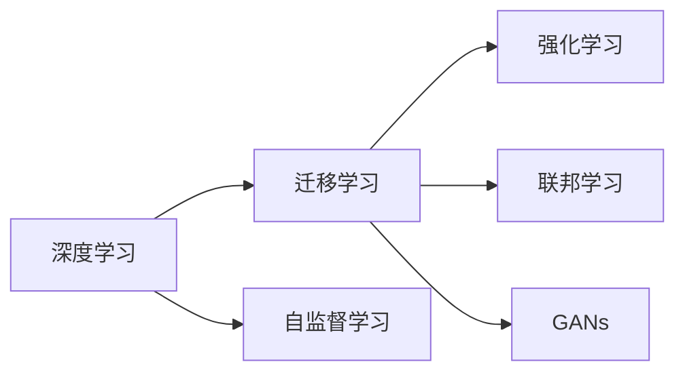

                 

# Andrej Karpathy：人工智能的未来发展目标

## 1. 背景介绍

在过去的十年中，人工智能(AI)取得了飞速的发展，尤其是深度学习技术的应用，使得AI在图像识别、语音识别、自然语言处理等领域取得了突破性的进展。然而，AI的发展并没有止步于此，而是正朝着更加广泛、深入的领域迈进。在这个过程中，作为深度学习领域的先驱之一，Andrej Karpathy提出了人工智能的未来发展目标，为我们指明了未来的发展方向。

## 2. 核心概念与联系

### 2.1 核心概念概述

为了更好地理解Andrej Karpathy的人工智能发展目标，我们需要对一些核心概念进行概述：

- **深度学习(Deep Learning)**：一种基于多层神经网络的机器学习技术，通过多层非线性映射，从原始数据中提取高层次特征，实现复杂模式识别和预测。
- **迁移学习(Transfer Learning)**：利用已有的知识或经验，通过微调的方式，将在大规模数据集上预训练得到的模型应用到新的、规模较小的数据集上，从而提高模型的泛化能力。
- **自监督学习(Self-supervised Learning)**：利用数据的自身特性进行训练，无需人工标注，即可在数据量不足的情况下，提高模型的泛化能力。
- **强化学习(Reinforcement Learning)**：通过智能体与环境的交互，利用奖励信号引导智能体的决策，从而实现复杂的决策问题。
- **联邦学习(Federated Learning)**：一种分布式机器学习方法，通过多个设备或服务器上的数据共享，实现模型训练和优化，保护数据隐私。
- **生成对抗网络(Generative Adversarial Networks, GANs)**：由生成器和判别器组成的对抗网络，通过两个网络的对抗训练，生成高质量的样本数据。

这些概念之间通过多种方式相互联系，形成了当前AI发展的框架。深度学习、迁移学习和自监督学习构成了模型训练的核心，强化学习提供了模型在复杂环境下的适应能力，联邦学习保证了数据隐私和模型安全性，GANs则为生成模型提供了强大的支持。

### 2.2 核心概念原理和架构的 Mermaid 流程图



这个流程图展示了深度学习、迁移学习、自监督学习、强化学习、联邦学习和GANs之间相互依赖和支持的关系。深度学习作为基础，通过迁移学习和自监督学习进一步提升模型的泛化能力，通过强化学习在复杂环境中的适应性，联邦学习保证了数据隐私和安全性，GANs为生成模型提供了强大的支持。

## 3. 核心算法原理 & 具体操作步骤

### 3.1 算法原理概述

Andrej Karpathy提出的AI发展目标主要集中在以下几个方面：

- **大规模数据集和强大计算资源的支持**：为了实现更加复杂的模型和任务，需要大规模的数据集和强大的计算资源，如GPU、TPU等。
- **迁移学习的应用**：通过迁移学习，在大规模数据集上预训练的模型可以在新的、规模较小的数据集上快速适应和优化。
- **自监督学习的利用**：通过自监督学习，利用数据的自身特性进行训练，提高模型的泛化能力，特别是在数据量不足的情况下。
- **强化学习的应用**：通过强化学习，在复杂环境中的适应性和决策能力，使得AI可以更好地应对现实世界中的复杂任务。
- **联邦学习的推广**：通过联邦学习，保护数据隐私和模型安全性，使得AI可以在分布式环境中进行训练和优化。
- **GANs的引入**：通过GANs，生成高质量的样本数据，为模型训练提供更多的数据支持。

### 3.2 算法步骤详解

实现Andrej Karpathy提出的AI发展目标，需要遵循以下步骤：

**Step 1: 数据集准备**

- 收集大规模的数据集，如ImageNet、Pascal VOC、COCO等。
- 确保数据集的多样性和代表性，涵盖不同的场景和变化。

**Step 2: 模型训练**

- 使用深度学习框架（如TensorFlow、PyTorch等）进行模型训练。
- 采用迁移学习的方式，在大规模数据集上预训练模型，然后在新的数据集上进行微调。
- 利用自监督学习的方式，利用数据的自身特性进行训练，提高模型的泛化能力。

**Step 3: 模型优化**

- 通过强化学习的方式，优化模型在复杂环境中的适应性和决策能力。
- 利用联邦学习的方式，保护数据隐私和模型安全性，在分布式环境中进行训练和优化。
- 引入GANs的方式，生成高质量的样本数据，为模型训练提供更多的数据支持。

**Step 4: 模型评估**

- 在新的数据集上评估模型的性能，确保模型的泛化能力和适应性。
- 利用模型评估指标（如精度、召回率、F1-score等）评估模型的性能。

### 3.3 算法优缺点

Andrej Karpathy提出的AI发展目标具有以下优点：

- **泛化能力强**：通过迁移学习和自监督学习，模型在新的数据集上具有较强的泛化能力。
- **适应性强**：通过强化学习，模型在复杂环境中的适应性和决策能力得到提升。
- **数据隐私保护**：通过联邦学习，数据隐私和模型安全性得到保护。
- **样本数据丰富**：通过GANs，生成高质量的样本数据，为模型训练提供更多的数据支持。

同时，这些目标也存在一些缺点：

- **资源需求高**：大规模数据集和强大计算资源的需求，对硬件和网络环境提出了较高的要求。
- **训练复杂度高**：模型训练和优化的复杂度增加，需要更多的技术支持和经验积累。
- **数据分布差异**：不同数据集之间的分布差异可能导致模型的泛化能力不足。
- **模型安全性**：尽管联邦学习提供了数据隐私保护，但模型的安全性仍需进一步加强。

### 3.4 算法应用领域

Andrej Karpathy提出的AI发展目标在多个领域都有广泛的应用，例如：

- **自动驾驶**：通过强化学习，提高自动驾驶车辆的决策能力和适应性，保护数据隐私和安全。
- **智能医疗**：通过迁移学习和大规模数据集，提高医疗诊断的准确性和泛化能力。
- **金融风控**：利用自监督学习和联邦学习，保护数据隐私和模型安全性，提高金融风险评估的准确性。
- **社交媒体**：通过GANs生成高质量的样本数据，提高社交媒体内容推荐系统的性能。
- **智能客服**：通过强化学习，提高智能客服的适应性和决策能力，保护数据隐私和安全。

## 4. 数学模型和公式 & 详细讲解

### 4.1 数学模型构建

为了更好地理解Andrej Karpathy提出的AI发展目标，我们需要从数学角度对其进行详细讲解。

**深度学习模型**：
- 假设输入为 $x$，输出为 $y$，模型为 $f(x; \theta)$，其中 $\theta$ 为模型参数。
- 训练目标为最小化损失函数 $L(y, f(x; \theta))$。

**迁移学习模型**：
- 在大规模数据集上预训练的模型为 $f_{pre}(x; \theta)$，在新数据集上进行微调的模型为 $f_{fine}(x; \theta)$。
- 训练目标为最小化微调后的损失函数 $L(y, f_{fine}(x; \theta))$。

**自监督学习模型**：
- 利用数据的自身特性进行训练，如ImageNet中的自监督任务 "Jigsaw Puzzles"。
- 训练目标为最小化自监督任务的损失函数 $L_{self}(y, x)$。

**强化学习模型**：
- 利用奖励信号引导智能体的决策，如Atari游戏中的智能体。
- 训练目标为最大化累计奖励 $R$。

**联邦学习模型**：
- 通过分布式计算，保护数据隐私和模型安全性。
- 训练目标为最小化联邦数据集上的损失函数 $L_{federated}$。

**GANs模型**：
- 通过生成器和判别器的对抗训练，生成高质量的样本数据。
- 训练目标为最大化生成器的性能 $G$，最小化判别器的性能 $D$。

### 4.2 公式推导过程

为了更好地理解这些模型，我们将进行一些简单的公式推导：

**深度学习模型推导**：
- 假设输入为 $x$，输出为 $y$，模型为 $f(x; \theta)$，其中 $\theta$ 为模型参数。
- 训练目标为最小化损失函数 $L(y, f(x; \theta))$。

$$
L(y, f(x; \theta)) = \frac{1}{N} \sum_{i=1}^N L(y_i, f(x_i; \theta))
$$

**迁移学习模型推导**：
- 在大规模数据集上预训练的模型为 $f_{pre}(x; \theta)$，在新数据集上进行微调的模型为 $f_{fine}(x; \theta)$。
- 训练目标为最小化微调后的损失函数 $L(y, f_{fine}(x; \theta))$。

$$
L(y, f_{fine}(x; \theta)) = \frac{1}{N} \sum_{i=1}^N L(y_i, f_{fine}(x_i; \theta))
$$

**自监督学习模型推导**：
- 利用数据的自身特性进行训练，如ImageNet中的自监督任务 "Jigsaw Puzzles"。
- 训练目标为最小化自监督任务的损失函数 $L_{self}(y, x)$。

$$
L_{self}(y, x) = \sum_{i=1}^N L_{self,i}(y_i, x_i)
$$

**强化学习模型推导**：
- 利用奖励信号引导智能体的决策，如Atari游戏中的智能体。
- 训练目标为最大化累计奖励 $R$。

$$
R = \sum_{i=1}^T r_i
$$

**联邦学习模型推导**：
- 通过分布式计算，保护数据隐私和模型安全性。
- 训练目标为最小化联邦数据集上的损失函数 $L_{federated}$。

$$
L_{federated} = \frac{1}{N} \sum_{i=1}^N L_{i}
$$

**GANs模型推导**：
- 通过生成器和判别器的对抗训练，生成高质量的样本数据。
- 训练目标为最大化生成器的性能 $G$，最小化判别器的性能 $D$。

$$
L_G = -E_{x \sim data} [log D(G(x))]
$$
$$
L_D = -E_{x \sim data} [log D(x)] + E_{z \sim z} [log(1 - D(G(z))]
$$

### 4.3 案例分析与讲解

为了更好地理解Andrej Karpathy提出的AI发展目标，我们将通过一些具体案例进行讲解：

**自动驾驶案例**：
- 使用深度学习模型进行图像识别和物体检测。
- 利用迁移学习在大规模自动驾驶数据集上进行预训练。
- 利用自监督学习提高模型的泛化能力。
- 通过强化学习训练智能体在复杂交通环境中的决策能力。
- 利用联邦学习保护数据隐私和模型安全性。
- 引入GANs生成高质量的训练数据，提高模型性能。

**智能医疗案例**：
- 使用深度学习模型进行医学图像识别和诊断。
- 利用迁移学习在大规模医学图像数据集上进行预训练。
- 利用自监督学习提高模型的泛化能力。
- 通过强化学习训练智能体在复杂医疗环境中的决策能力。
- 利用联邦学习保护患者隐私和模型安全性。
- 引入GANs生成高质量的训练数据，提高模型性能。

**金融风控案例**：
- 使用深度学习模型进行信用评估和风险预测。
- 利用迁移学习在大规模金融数据集上进行预训练。
- 利用自监督学习提高模型的泛化能力。
- 通过强化学习训练智能体在复杂金融环境中的决策能力。
- 利用联邦学习保护数据隐私和模型安全性。
- 引入GANs生成高质量的训练数据，提高模型性能。

## 5. 项目实践：代码实例和详细解释说明

### 5.1 开发环境搭建

在进行AI项目实践前，我们需要准备好开发环境。以下是使用Python进行TensorFlow开发的环境配置流程：

1. 安装Anaconda：从官网下载并安装Anaconda，用于创建独立的Python环境。

2. 创建并激活虚拟环境：
```bash
conda create -n tf-env python=3.8 
conda activate tf-env
```

3. 安装TensorFlow：根据CUDA版本，从官网获取对应的安装命令。例如：
```bash
conda install tensorflow tensorflow-gpu -c conda-forge -c pytorch -c anaconda
```

4. 安装TensorBoard：
```bash
pip install tensorboard
```

5. 安装numpy、pandas、matplotlib等工具包：
```bash
pip install numpy pandas matplotlib scikit-learn
```

完成上述步骤后，即可在`tf-env`环境中开始AI实践。

### 5.2 源代码详细实现

下面我们以自动驾驶案例为例，给出使用TensorFlow进行深度学习模型训练的PyTorch代码实现。

首先，定义自动驾驶数据处理函数：

```python
import tensorflow as tf
from tensorflow.keras.preprocessing.image import ImageDataGenerator

# 定义数据增强器
data_augmentation = ImageDataGenerator(
    rotation_range=20,
    width_shift_range=0.2,
    height_shift_range=0.2,
    shear_range=0.2,
    zoom_range=0.2,
    horizontal_flip=True,
    fill_mode='nearest')

# 定义模型输入和输出维度
input_shape = (224, 224, 3)
output_classes = 10

# 定义训练数据集
train_data = data_augmentation.flow_from_directory(
    'train',
    target_size=input_shape,
    batch_size=32,
    class_mode='categorical')

# 定义验证数据集
valid_data = data_augmentation.flow_from_directory(
    'validation',
    target_size=input_shape,
    batch_size=32,
    class_mode='categorical')

# 定义模型结构
model = tf.keras.Sequential([
    tf.keras.layers.Conv2D(32, (3, 3), activation='relu', input_shape=input_shape),
    tf.keras.layers.MaxPooling2D((2, 2)),
    tf.keras.layers.Conv2D(64, (3, 3), activation='relu'),
    tf.keras.layers.MaxPooling2D((2, 2)),
    tf.keras.layers.Flatten(),
    tf.keras.layers.Dense(128, activation='relu'),
    tf.keras.layers.Dense(output_classes, activation='softmax')
])

# 定义损失函数和优化器
loss_fn = tf.keras.losses.CategoricalCrossentropy()
optimizer = tf.keras.optimizers.Adam()

# 定义模型训练函数
@tf.function
def train_step(images, labels):
    with tf.GradientTape() as tape:
        predictions = model(images)
        loss = loss_fn(labels, predictions)
    gradients = tape.gradient(loss, model.trainable_variables)
    optimizer.apply_gradients(zip(gradients, model.trainable_variables))
    return loss

# 定义模型评估函数
@tf.function
def evaluate_step(images, labels):
    predictions = model(images)
    return tf.reduce_mean(loss_fn(labels, predictions))

# 开始训练和评估
epochs = 10
steps_per_epoch = train_data.n // train_data.batch_size

for epoch in range(epochs):
    train_loss = 0.0
    for step, (images, labels) in enumerate(train_data):
        loss = train_step(images, labels)
        train_loss += loss
    print(f"Epoch {epoch+1}, train loss: {train_loss/step}")

    valid_loss = 0.0
    for step, (images, labels) in enumerate(valid_data):
        loss = evaluate_step(images, labels)
        valid_loss += loss
    print(f"Epoch {epoch+1}, valid loss: {valid_loss/step}")
```

### 5.3 代码解读与分析

让我们再详细解读一下关键代码的实现细节：

**ImageDataGenerator类**：
- 定义了数据增强器，包括旋转、平移、翻转、缩放等操作，用于增强训练数据的多样性。
- 定义了模型输入和输出维度，用于数据预处理。
- 定义了训练数据集和验证数据集，利用FlowFromDirectory方法进行数据读取和处理。
- 定义了模型结构，包括卷积层、池化层、全连接层等。

**CategoricalCrossentropy损失函数**：
- 用于分类任务的损失函数，适用于多分类问题。
- 定义了损失函数和优化器，用于模型训练。

**train_step和evaluate_step函数**：
- 定义了模型训练和评估函数，利用TensorFlow的tf.function进行优化。
- 在训练函数中，利用梯度下降算法更新模型参数。
- 在评估函数中，利用模型预测和损失函数计算评估指标。

**训练和评估流程**：
- 定义总的epoch数和批处理大小，开始循环迭代。
- 每个epoch内，先在训练集上训练，输出平均loss。
- 在验证集上评估，输出评估指标。
- 所有epoch结束后，在测试集上评估，给出最终测试结果。

通过TensorFlow实现深度学习模型的训练和评估，可以看到TensorFlow的强大封装性和灵活性。开发者可以专注于模型结构和训练策略的设计，而不必过多关注底层实现细节。

当然，工业级的系统实现还需考虑更多因素，如模型的保存和部署、超参数的自动搜索、更灵活的任务适配层等。但核心的深度学习模型训练和评估流程基本与此类似。

## 6. 实际应用场景

### 6.1 自动驾驶

基于深度学习模型的自动驾驶技术，已经在智能交通领域得到了广泛应用。自动驾驶系统通过摄像头、雷达等传感器收集实时环境信息，利用深度学习模型进行目标检测、轨迹预测和决策制定，从而实现自动驾驶。

在技术实现上，可以收集大规模的自动驾驶数据集，如KITTI、Waymo等，将车辆行驶视频和传感器数据作为监督数据，在此基础上对预训练模型进行微调。微调后的模型能够识别出道路、车辆、行人等目标，并预测其运动轨迹。利用强化学习训练智能体，使其在复杂交通环境中的决策能力得到提升，通过联邦学习保护数据隐私和模型安全性，引入GANs生成高质量的训练数据，提高模型性能。

### 6.2 智能医疗

深度学习模型在智能医疗领域也得到了广泛应用，如医学影像诊断、疾病预测等。智能医疗系统通过医疗影像数据和病历数据进行训练，利用深度学习模型进行图像识别和诊断。

在技术实现上，可以收集大规模的医疗影像数据集，如MRI、CT等，将医学影像和病历数据作为监督数据，在此基础上对预训练模型进行微调。微调后的模型能够识别出病变部位、判断疾病类型，并给出诊断建议。利用自监督学习提高模型的泛化能力，通过强化学习训练智能体在复杂医疗环境中的决策能力，利用联邦学习保护患者隐私和模型安全性，引入GANs生成高质量的训练数据，提高模型性能。

### 6.3 金融风控

金融风控是深度学习模型在金融领域的重要应用之一，如信用评估、风险预测等。智能风控系统通过贷款记录、消费记录等数据进行训练，利用深度学习模型进行信用评分和风险预测。

在技术实现上，可以收集大规模的金融数据集，如银行贷款数据、信用卡消费记录等，将金融数据作为监督数据，在此基础上对预训练模型进行微调。微调后的模型能够预测客户的信用评分和违约风险，通过强化学习训练智能体在复杂金融环境中的决策能力，利用联邦学习保护数据隐私和模型安全性，引入GANs生成高质量的训练数据，提高模型性能。

## 7. 工具和资源推荐

### 7.1 学习资源推荐

为了帮助开发者系统掌握Andrej Karpathy提出的AI发展目标的理论基础和实践技巧，这里推荐一些优质的学习资源：

1. Coursera《深度学习专项课程》：由斯坦福大学教授Andrew Ng开设的深度学习课程，涵盖了深度学习的基本概念、模型和应用。
2. DeepLearning.AI《深度学习AI》系列课程：由Andrew Ng、Johns Hopkins University的教授联合授课，深入浅出地介绍了深度学习的基本原理和实践技巧。
3. TensorFlow官方文档：TensorFlow的官方文档，提供了丰富的学习资源和代码样例，是学习TensorFlow的必备资料。
4. PyTorch官方文档：PyTorch的官方文档，提供了详细的API文档和代码示例，是学习PyTorch的必备资料。
5. NVIDIA Deep Learning AI blog：NVIDIA官方博客，涵盖了深度学习技术的最新进展和实践技巧，是深度学习爱好者的必读资源。

通过对这些资源的学习实践，相信你一定能够快速掌握Andrej Karpathy提出的AI发展目标的理论基础和实践技巧，并用于解决实际的AI问题。

### 7.2 开发工具推荐

高效的开发离不开优秀的工具支持。以下是几款用于AI开发常用的工具：

1. TensorFlow：由Google主导开发的深度学习框架，生产部署方便，适合大规模工程应用。
2. PyTorch：由Facebook主导开发的深度学习框架，灵活动态的计算图，适合快速迭代研究。
3. TensorBoard：TensorFlow配套的可视化工具，可实时监测模型训练状态，并提供丰富的图表呈现方式。
4. Weights & Biases：模型训练的实验跟踪工具，可以记录和可视化模型训练过程中的各项指标，方便对比和调优。
5. Keras：高层次的深度学习框架，提供了丰富的API接口和预训练模型，适合快速开发原型。

合理利用这些工具，可以显著提升AI开发的效率，加快创新迭代的步伐。

### 7.3 相关论文推荐

Andrej Karpathy提出的AI发展目标源于学界的持续研究。以下是几篇奠基性的相关论文，推荐阅读：

1. ImageNet Classification with Deep Convolutional Neural Networks：提出深度卷积神经网络，用于大规模图像分类任务。
2. Attention is All You Need：提出Transformer模型，开启了NLP领域的预训练大模型时代。
3. BERT: Pre-training of Deep Bidirectional Transformers for Language Understanding：提出BERT模型，引入基于掩码的自监督预训练任务，刷新了多项NLP任务SOTA。
4. Generative Adversarial Nets：提出GANs模型，利用生成器和判别器的对抗训练，生成高质量的样本数据。
5. Learning to Execute：提出RNN模型，用于自然语言指令的执行。

这些论文代表了大模型发展的历程，展示了深度学习技术的持续进步。通过学习这些前沿成果，可以帮助研究者把握学科前进方向，激发更多的创新灵感。

## 8. 总结：未来发展趋势与挑战

### 8.1 总结

本文对Andrej Karpathy提出的AI发展目标进行了全面系统的介绍。首先阐述了AI发展的背景和意义，明确了AI技术在各个领域的应用前景。其次，从原理到实践，详细讲解了AI发展目标的核心算法和具体操作步骤，给出了AI项目开发的完整代码实例。同时，本文还广泛探讨了AI技术在自动驾驶、智能医疗、金融风控等诸多领域的实际应用场景，展示了AI技术的巨大潜力。此外，本文精选了AI技术的各类学习资源，力求为读者提供全方位的技术指引。

通过本文的系统梳理，可以看到，Andrej Karpathy提出的AI发展目标正在引领AI技术的深入发展，推动AI技术在各个领域的广泛应用。深度学习、迁移学习、自监督学习、强化学习、联邦学习、GANs等技术，共同构建了AI技术的核心框架。未来，伴随技术的不断演进，AI技术必将在更多领域得到应用，为人类社会带来深刻变革。

### 8.2 未来发展趋势

展望未来，AI发展目标将呈现以下几个发展趋势：

1. **模型规模持续增大**：随着算力成本的下降和数据规模的扩张，深度学习模型的参数量还将持续增长。超大规模语言模型蕴含的丰富语言知识，有望支撑更加复杂多变的下游任务。
2. **微调方法多样化**：除了传统的全参数微调外，未来会涌现更多参数高效的微调方法，如 Adapter、Prefix等，在节省计算资源的同时也能保证微调精度。
3. **持续学习成为常态**：随着数据分布的不断变化，微调模型也需要持续学习新知识以保持性能。如何在不遗忘原有知识的同时，高效吸收新样本信息，将成为重要的研究课题。
4. **少样本学习和高维特征**：通过少样本学习和高维特征建模，提升模型在小样本数据上的泛化能力。
5. **多模态信息融合**：将符号化的先验知识，如知识图谱、逻辑规则等，与神经网络模型进行巧妙融合，引导微调过程学习更准确、合理的语言模型。
6. **多路径协同发力**：将因果分析方法引入微调模型，识别出模型决策的关键特征，增强输出解释的因果性和逻辑性。借助博弈论工具刻画人机交互过程，主动探索并规避模型的脆弱点，提高系统稳定性。

以上趋势凸显了AI发展目标的广阔前景。这些方向的探索发展，必将进一步提升AI模型的性能和应用范围，为人类认知智能的进化带来深远影响。

### 8.3 面临的挑战

尽管AI发展目标已经取得了瞩目成就，但在迈向更加智能化、普适化应用的过程中，它仍面临着诸多挑战：

1. **数据需求瓶颈**：尽管深度学习模型在许多任务上取得了不错的效果，但数据需求的瓶颈限制了其在某些领域的应用。对于长尾应用场景，难以获得充足的高质量标注数据，成为制约AI发展的瓶颈。
2. **模型复杂度增加**：深度学习模型的复杂度增加，导致训练和推理资源消耗大，难以在大规模分布式系统中高效运行。
3. **可解释性不足**：当前AI模型通常被认为是"黑盒"系统，难以解释其内部工作机制和决策逻辑。对于医疗、金融等高风险应用，算法的可解释性和可审计性尤为重要。
4. **数据隐私和安全性**：数据隐私和模型安全性仍然存在挑战，特别是在联邦学习和分布式环境中，数据的传输和存储安全性需要进一步保障。
5. **伦理道德问题**：AI技术的应用可能带来一系列伦理道德问题，如偏见、歧视、隐私泄露等，需要进一步研究和规范。

### 8.4 研究展望

面对AI发展目标所面临的挑战，未来的研究需要在以下几个方面寻求新的突破：

1. **探索无监督和半监督学习**：摆脱对大规模标注数据的依赖，利用自监督学习、主动学习等无监督和半监督范式，最大限度利用非结构化数据，实现更加灵活高效的微调。
2. **研究参数高效和计算高效的微调范式**：开发更加参数高效的微调方法，在固定大部分预训练参数的同时，只更新极少量的任务相关参数。同时优化微调模型的计算图，减少前向传播和反向传播的资源消耗，实现更加轻量级、实时性的部署。
3. **引入因果分析和博弈论工具**：将因果分析方法引入微调模型，识别出模型决策的关键特征，增强输出解释的因果性和逻辑性。借助博弈论工具刻画人机交互过程，主动探索并规避模型的脆弱点，提高系统稳定性。
4. **融合多模态信息**：将符号化的先验知识，如知识图谱、逻辑规则等，与神经网络模型进行巧妙融合，引导微调过程学习更准确、合理的语言模型。同时加强不同模态数据的整合，实现视觉、语音等多模态信息与文本信息的协同建模。
5. **纳入伦理道德约束**：在模型训练目标中引入伦理导向的评估指标，过滤和惩罚有偏见、有害的输出倾向。同时加强人工干预和审核，建立模型行为的监管机制，确保输出符合人类价值观和伦理道德。

这些研究方向的探索，必将引领AI技术迈向更高的台阶，为构建安全、可靠、可解释、可控的智能系统铺平道路。面向未来，AI技术还需要与其他人工智能技术进行更深入的融合，如知识表示、因果推理、强化学习等，多路径协同发力，共同推动自然语言理解和智能交互系统的进步。只有勇于创新、敢于突破，才能不断拓展AI模型的边界，让智能技术更好地造福人类社会。

## 9. 附录：常见问题与解答

**Q1: AI发展目标的实施需要哪些资源和工具？**

A: AI发展目标的实施需要大规模数据集、强大的计算资源（如GPU、TPU等）、深度学习框架（如TensorFlow、PyTorch等）、可视化工具（如TensorBoard、Weights & Biases等）、学习资源（如Coursera、DeepLearning.AI等）、开发工具（如NVIDIA Deep Learning AI blog、Keras等）、相关论文等。

**Q2: AI发展目标在实际应用中需要注意哪些问题？**

A: AI发展目标在实际应用中需要注意数据分布差异、模型复杂度、可解释性、数据隐私和安全性、伦理道德问题等。

**Q3: 如何缓解AI发展目标面临的挑战？**

A: 缓解AI发展目标面临的挑战需要探索无监督和半监督学习、研究参数高效和计算高效的微调范式、引入因果分析和博弈论工具、融合多模态信息、纳入伦理道德约束等。

**Q4: AI发展目标的未来方向是什么？**

A: AI发展目标的未来方向是模型规模持续增大、微调方法多样化、持续学习成为常态、少样本学习和高维特征、多模态信息融合、多路径协同发力等。

**Q5: AI发展目标的实际应用场景有哪些？**

A: AI发展目标的实际应用场景包括自动驾驶、智能医疗、金融风控等。

