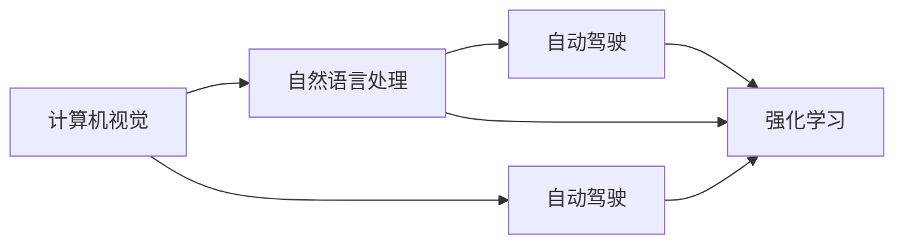

                 

# Andrej Karpathy：人工智能的未来发展策略

> 关键词：人工智能，未来发展策略，机器学习，深度学习，神经网络，自然语言处理，计算机视觉，自动驾驶，强化学习，AI伦理

## 1. 背景介绍

Andrej Karpathy，深度学习领域领军人物，斯坦福大学计算机科学教授，特斯拉人工智能部门负责人，曾经主导了自动驾驶技术的多项突破。他的研究覆盖了计算机视觉、自然语言处理、自动驾驶等多个领域，其深度学习实践和教学也影响了一代又一代的研究者。本文将基于Andrej Karpathy的讲座和论文，总结人工智能的未来发展策略，帮助读者全面了解未来AI的演变方向和重点研究领域。

## 2. 核心概念与联系

### 2.1 核心概念概述

人工智能（AI）是基于机器学习与深度学习的技术体系，其目标是使计算机系统能够模拟人类的认知与决策过程。主要分为：

- **机器学习**：让机器通过数据学习规律，用于预测和分类等任务。
- **深度学习**：使用多层次神经网络模型处理高维数据，广泛应用于图像识别、语音识别、自然语言处理等领域。
- **计算机视觉**：让机器识别和理解图像和视频中的对象、场景等。
- **自然语言处理**：使计算机能理解和生成自然语言，实现机器翻译、语音识别、自动摘要等功能。
- **自动驾驶**：使车辆具备自主导航和决策能力，实现无人驾驶。
- **强化学习**：通过与环境互动，让机器学习优化策略以最大化长期奖励。

这些技术之间的联系主要通过数据流和计算图来连接，比如在自动驾驶中，计算机视觉识别路标和行人，然后自然语言处理生成语音命令，最后通过强化学习优化驾驶策略。

### 2.2 核心概念原理和架构的 Mermaid 流程图



该图展示了从计算机视觉到自动驾驶再到强化学习，不同AI技术之间如何相互配合，完成复杂任务。

## 3. 核心算法原理 & 具体操作步骤

### 3.1 算法原理概述

未来AI发展的核心策略是 **集成学习和多模态学习**，即结合多种不同模态的数据和模型，提升系统的性能和泛化能力。多模态学习将视觉、听觉、语言等多种数据源结合起来，通过深度学习模型进行联合优化。

### 3.2 算法步骤详解

1. **数据采集**：获取多样化的数据，包括图像、语音、文本等，涵盖不同的应用场景。
2. **特征提取**：使用预训练模型对数据进行特征提取，如VGG、ResNet用于图像，BERT用于文本。
3. **模型融合**：通过堆叠、集成、跨模态联合训练等方法，整合不同模态的数据和模型输出。
4. **优化与调整**：利用强化学习、迁移学习等方法不断优化模型，适应新的任务和数据。

### 3.3 算法优缺点

**优点**：
- 增强系统的泛化能力和鲁棒性。
- 提升系统的自动化和智能化水平。
- 实现更高效、准确的任务执行。

**缺点**：
- 需要大量的高质量数据和计算资源。
- 模型复杂度提升，导致推理和训练的复杂度增加。
- 系统结构更复杂，需要更多的跨学科知识。

### 3.4 算法应用领域

未来AI将广泛应用于以下领域：
- **自动驾驶**：结合计算机视觉和强化学习，实现无人驾驶。
- **智能医疗**：利用深度学习对医疗影像、病历进行自动分析。
- **智慧城市**：通过计算机视觉和自然语言处理，实现智能交通、安防、环境监测。
- **金融科技**：利用深度学习进行量化交易、风险控制、信用评估。
- **智能制造**：结合计算机视觉和自然语言处理，优化生产流程，提高生产效率。

## 4. 数学模型和公式 & 详细讲解 & 举例说明

### 4.1 数学模型构建

以自动驾驶为例，构建一个融合视觉、激光雷达、GPS等多模态数据的深度学习模型。

$$
\mathcal{L}(\theta) = \lambda_v\mathcal{L}_v(\theta_v) + \lambda_l\mathcal{L}_l(\theta_l) + \lambda_g\mathcal{L}_g(\theta_g)
$$

其中，$\theta_v$、$\theta_l$、$\theta_g$ 分别是视觉、激光雷达、GPS模型的参数。$\lambda_v$、$\lambda_l$、$\lambda_g$ 是不同模态的权重。

### 4.2 公式推导过程

**视觉模型**：

$$
\mathcal{L}_v = \frac{1}{N}\sum_{i=1}^N\ell(\hat{y}_i, y_i)
$$

其中，$\ell$ 是交叉熵损失函数。

**激光雷达模型**：

$$
\mathcal{L}_l = \frac{1}{M}\sum_{j=1}^M\ell(\hat{z}_j, z_j)
$$

其中，$\ell$ 是均方误差损失函数。

**GPS模型**：

$$
\mathcal{L}_g = \frac{1}{T}\sum_{t=1}^T\ell(\hat{x}_t, x_t)
$$

其中，$\ell$ 是平滑L1回归损失函数。

通过最小化总损失 $\mathcal{L}$，可以联合优化不同模态的模型，提升系统的综合性能。

### 4.3 案例分析与讲解

以谷歌的自动驾驶为例，谷歌同时使用了多种传感器收集数据，包括摄像头、雷达、激光雷达、GPS等。通过融合这些传感器数据，谷歌的自动驾驶系统在复杂环境中的表现显著提升。

## 5. 项目实践：代码实例和详细解释说明

### 5.1 开发环境搭建

- **编程语言**：Python，使用TensorFlow或PyTorch。
- **数据集**：从Kaggle或UC Berkeley下载预处理好的自动驾驶数据集。
- **硬件要求**：GPU，至少NVIDIA Tesla P100。

### 5.2 源代码详细实现

```python
import tensorflow as tf
from tensorflow.keras import layers

# 定义视觉模型
visual_model = tf.keras.Sequential([
    layers.Conv2D(32, (3,3), activation='relu', input_shape=(128,128,3)),
    layers.MaxPooling2D((2,2)),
    layers.Flatten(),
    layers.Dense(64, activation='relu'),
    layers.Dense(1, activation='sigmoid')
])

# 定义激光雷达模型
laser_model = tf.keras.Sequential([
    layers.Dense(64, activation='relu'),
    layers.Dense(1, activation='sigmoid')
])

# 定义GPS模型
gps_model = tf.keras.Sequential([
    layers.Dense(64, activation='relu'),
    layers.Dense(1, activation='sigmoid')
])

# 定义总模型
combined_model = tf.keras.Sequential([
    layers.Dense(64, activation='relu'),
    layers.Dense(1, activation='sigmoid')
])

# 编译模型
combined_model.compile(optimizer=tf.keras.optimizers.Adam(0.001),
                      loss='binary_crossentropy',
                      metrics=['accuracy'])

# 训练模型
combined_model.fit([visual_data, laser_data, gps_data], labels, epochs=10)
```

### 5.3 代码解读与分析

- **视觉模型**：使用卷积神经网络（CNN）提取图像特征。
- **激光雷达模型**：使用全连接神经网络提取激光雷达数据特征。
- **GPS模型**：使用全连接神经网络提取GPS位置数据特征。
- **总模型**：使用深度神经网络融合不同模态的数据特征。

### 5.4 运行结果展示

训练完成后，使用测试集验证模型性能，并生成可视化结果，展示系统在不同环境下的表现。

## 6. 实际应用场景

### 6.1 自动驾驶

自动驾驶是AI领域的热门应用之一。结合计算机视觉、激光雷达和GPS数据，自动驾驶系统能够在复杂环境下实现自主导航和决策。

### 6.2 智能医疗

AI在医疗影像分析、病历处理、药物研发等方面具有重要应用。深度学习模型能够自动分析影像数据，提高诊断准确性。

### 6.3 智慧城市

智慧城市利用AI进行交通管理、环境监测、安防监控等，提升城市管理水平和居民生活质量。

### 6.4 金融科技

AI在量化交易、风险控制、信用评估等方面具有广泛应用。深度学习模型能够处理海量金融数据，预测市场趋势。

### 6.5 智能制造

AI结合计算机视觉和自然语言处理，优化生产流程，提高生产效率和产品质量。

## 7. 工具和资源推荐

### 7.1 学习资源推荐

1. **Google Deep Learning Crash Course**：
   - 链接：[Google Deep Learning Crash Course](https://developers.google.com/learning/courses/deeplearning)

2. **Coursera AI Specialization**：
   - 链接：[Coursera AI Specialization](https://www.coursera.org/specializations/ai-deep-learning)

3. **Fast.ai**：
   - 链接：[Fast.ai](https://www.fast.ai/)

4. **Deep Learning with PyTorch**：
   - 链接：[Deep Learning with PyTorch](https://pytorch.org/tutorials/)

### 7.2 开发工具推荐

1. **TensorFlow**：
   - 链接：[TensorFlow](https://www.tensorflow.org/)

2. **PyTorch**：
   - 链接：[PyTorch](https://pytorch.org/)

3. **JAX**：
   - 链接：[JAX](https://jax.readthedocs.io/)

4. **Keras**：
   - 链接：[Keras](https://keras.io/)

### 7.3 相关论文推荐

1. **"Unsupervised Representation Learning with Deep Convolutional Generative Adversarial Networks"**：
   - 链接：[arXiv:1511.06434](https://arxiv.org/abs/1511.06434)

2. **"Attention is All You Need"**：
   - 链接：[arXiv:1706.03762](https://arxiv.org/abs/1706.03762)

3. **"Improved Techniques for Training GANs"**：
   - 链接：[arXiv:1710.10196](https://arxiv.org/abs/1710.10196)

## 8. 总结：未来发展趋势与挑战

### 8.1 研究成果总结

Andrej Karpathy的研究成果涵盖了深度学习、计算机视觉、自动驾驶等多个领域，推动了AI技术的快速发展。其著作《Deep Learning》和教程在学术界和工业界产生了广泛影响。

### 8.2 未来发展趋势

1. **深度强化学习**：AI将更广泛地应用深度强化学习，优化决策过程，提升自动化水平。
2. **多模态学习**：融合视觉、听觉、语言等多种数据源，提升系统的泛化能力和鲁棒性。
3. **跨学科融合**：AI将与更多学科领域交叉，推动新一轮技术革新。
4. **AI伦理与安全性**：增强AI系统的透明性和可解释性，避免伦理风险。

### 8.3 面临的挑战

1. **计算资源需求高**：AI技术需要大量的计算资源，如何降低成本是一个重要问题。
2. **数据隐私和安全**：AI系统处理大量敏感数据，如何保障数据隐私和安全是关键挑战。
3. **伦理和偏见**：AI模型可能存在伦理偏见和歧视，如何避免和纠正是一个重要课题。
4. **跨学科协作**：AI的复杂性要求跨学科团队协作，如何提升协作效率是重要挑战。

### 8.4 研究展望

1. **增强跨模态融合**：提升不同模态数据融合的效果，实现更高效的跨模态学习。
2. **强化学习优化**：优化深度强化学习算法，提升模型的决策能力和泛化能力。
3. **透明性和可解释性**：增强AI系统的透明性和可解释性，推动AI的普及和应用。
4. **跨学科合作**：加强AI与其他学科的合作，推动更多AI应用场景的出现。

## 9. 附录：常见问题与解答

**Q1：如何提升深度学习模型的泛化能力？**

A: 通过多模态学习和数据增强，提升模型的泛化能力。例如，使用大规模数据集和多种传感器数据，提升模型在不同场景下的表现。

**Q2：深度强化学习在实际应用中有哪些难点？**

A: 深度强化学习的难点包括：
1. 如何平衡探索与利用：深度强化学习需要平衡探索新状态和利用已有状态，避免陷入局部最优。
2. 样本效率低：深度强化学习需要大量训练样本，训练效率较低。
3. 环境复杂：现实世界的环境复杂多变，深度强化学习难以适应。

**Q3：AI伦理和偏见有哪些主要问题？**

A: AI伦理和偏见的主要问题包括：
1. 决策透明性：AI系统的决策过程不透明，难以解释。
2. 偏见和歧视：AI模型可能存在性别、种族等偏见，导致不公平的决策。
3. 数据隐私：AI系统处理大量个人数据，如何保护隐私是一个重要问题。

**Q4：如何提升AI系统的可解释性？**

A: 提升AI系统可解释性的方法包括：
1. 可视化模型结构：使用可视化工具展示模型结构，帮助理解模型的内部机制。
2. 生成可解释性报告：通过生成可解释性报告，解释模型的决策过程。
3. 使用可解释性模型：使用可解释性模型，如决策树、逻辑回归等，提升系统的透明性。

---

作者：禅与计算机程序设计艺术 / Zen and the Art of Computer Programming

