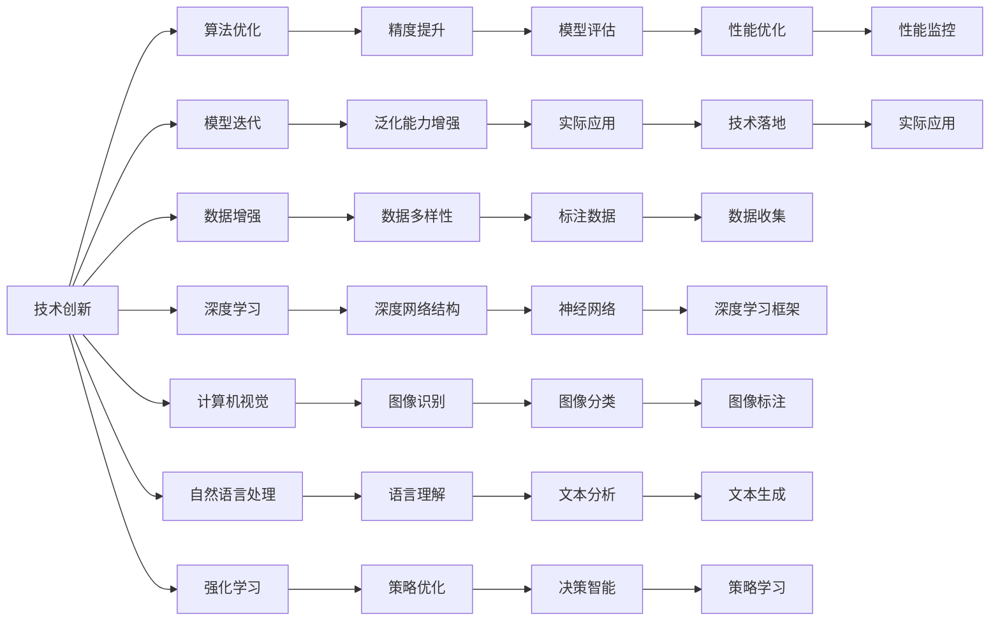

                 

## 1. 背景介绍

在人工智能（AI）迅猛发展的今天，AI专家Andrej Karpathy 无疑是推动AI进步的关键人物之一。作为斯坦福大学计算机视觉实验室（CSAIL）的主任，他在计算机视觉、深度学习和自动驾驶等领域作出了重要贡献，并撰写了大量关于AI未来发展的观点文章。本文将深入探讨Andrej Karpathy对AI未来的思考与策略。

### 1.1 问题由来
近年来，AI技术的快速发展在各行各业都引起了巨大变革。尤其是深度学习、自然语言处理和计算机视觉等领域的突破，使得AI技术在解决复杂问题上展现出强大的潜力。然而，随着AI技术的广泛应用，关于其未来发展方向和策略的讨论也在不断升温。Andrej Karpathy通过一系列文章和演讲，从技术、伦理和社会等维度对AI的未来发展进行了深入分析。

### 1.2 问题核心关键点
Andrej Karpathy认为，AI的未来发展策略应围绕以下几个核心关键点进行：

- **技术创新**：不断提升AI技术的精度和泛化能力，特别是在计算机视觉和自然语言处理等复杂领域。
- **伦理考量**：确保AI技术的开发和应用遵循伦理规范，保护用户隐私，避免偏见和歧视。
- **跨学科融合**：推动AI与医疗、教育、交通等传统领域的深度融合，提升行业效率和用户体验。
- **社会影响**：评估AI技术对社会、经济和文化的影响，制定相应的政策规范，确保AI技术的积极影响。

这些核心关键点构成了Andrej Karpathy对AI未来发展的整体思考框架，将对AI技术的未来路径产生深远影响。

## 2. 核心概念与联系

### 2.1 核心概念概述

Andrej Karpathy提出的AI未来发展策略涉及多个核心概念，这些概念相互关联，共同构成了一个完整的AI发展蓝图。

- **技术创新**：AI技术精度的提升和泛化能力的增强，通过不断的算法优化和模型迭代实现。
- **伦理考量**：AI技术开发和使用过程中遵循的伦理规范，如数据隐私保护、避免算法偏见等。
- **跨学科融合**：AI技术与不同领域（如医疗、教育、交通等）的深度融合，实现技术应用的广泛性。
- **社会影响**：AI技术对社会、经济和文化的影响评估，以及相应的政策规范制定。

### 2.2 核心概念原理和架构的 Mermaid 流程图



该流程图展示了技术创新与AI发展策略之间的联系。其中，算法优化、模型迭代、数据增强、深度学习、计算机视觉和自然语言处理等技术手段是实现技术创新的基础。而图像识别、文本分析和决策智能等具体应用，则是技术创新的实际落地。通过不断的技术优化和应用扩展，推动AI技术的整体进步。

## 3. 核心算法原理 & 具体操作步骤

### 3.1 算法原理概述

Andrej Karpathy强调，AI未来发展策略的实现离不开核心算法的支持。深度学习、计算机视觉和自然语言处理等技术构成了AI发展的基础，通过不断优化算法，提升技术性能，实现更广泛的应用场景。

### 3.2 算法步骤详解

Andrej Karpathy提出的AI未来发展策略主要包括以下几个关键步骤：

**Step 1: 技术基础建设**
- **数据准备**：收集和清洗大量高质量的数据，确保数据的多样性和代表性。
- **模型选择**：根据具体应用场景选择合适的深度学习模型，如卷积神经网络（CNN）、循环神经网络（RNN）等。
- **算法优化**：不断优化模型结构和算法，提升模型精度和泛化能力。

**Step 2: 技术应用拓展**
- **跨领域融合**：将AI技术应用于医疗、教育、交通等领域，提升行业效率和用户体验。
- **数据增强**：利用数据增强技术，扩充训练集，增强模型泛化能力。
- **模型微调**：针对具体应用场景，对预训练模型进行微调，提升模型性能。

**Step 3: 伦理规范制定**
- **数据隐私保护**：确保数据采集和使用的合法性，保护用户隐私。
- **避免偏见和歧视**：开发和使用过程中遵循伦理规范，避免算法偏见。
- **社会影响评估**：评估AI技术对社会、经济和文化的影响，制定相应的政策规范。

### 3.3 算法优缺点

**优点**：
- **技术创新**：通过不断的算法优化和模型迭代，提升AI技术的精度和泛化能力。
- **广泛应用**：通过跨领域融合，将AI技术应用于更多实际场景，提升行业效率和用户体验。
- **伦理规范**：通过遵循伦理规范，确保AI技术的开发和应用符合社会价值观。

**缺点**：
- **数据依赖**：高质量数据的获取和处理是技术创新的前提，但数据获取和处理的成本较高。
- **技术复杂性**：深度学习等AI技术具有较高的技术门槛，需要专业的知识和技能。
- **社会影响不确定**：AI技术对社会、经济和文化的影响具有不确定性，需要长期的监测和评估。

### 3.4 算法应用领域

Andrej Karpathy提出的AI未来发展策略涉及多个应用领域，包括但不限于：

- **计算机视觉**：如图像分类、物体检测、图像生成等。
- **自然语言处理**：如语言理解、文本生成、对话系统等。
- **自动驾驶**：通过计算机视觉和自然语言处理技术，实现智能驾驶。
- **医疗健康**：通过AI技术，提升疾病诊断、治疗方案制定等医疗服务。
- **教育培训**：利用AI技术，提升教学效果、个性化推荐等。

## 4. 数学模型和公式 & 详细讲解 & 举例说明

### 4.1 数学模型构建

Andrej Karpathy在文章中提到了多个数学模型，用于描述AI技术的核心算法。以下是几个常见的数学模型：

**卷积神经网络（CNN）**：
$$
f(x) = \sum_{i=1}^n w_i \sigma(a_i \cdot x + b_i)
$$
其中，$w_i$ 和 $b_i$ 为卷积核的权重和偏置，$a_i$ 为输入数据的特征映射，$\sigma$ 为激活函数。

**循环神经网络（RNN）**：
$$
h_t = \tanh(W \cdot [h_{t-1}, x_t] + b)
$$
其中，$h_t$ 为隐藏状态，$W$ 和 $b$ 为权重和偏置，$x_t$ 为输入，$\tanh$ 为激活函数。

**自编码器（Autoencoder）**：
$$
z = W_1 \cdot x + b_1
$$
$$
\hat{x} = W_2 \cdot \sigma(z) + b_2
$$
其中，$W_1$ 和 $b_1$ 为编码器的权重和偏置，$W_2$ 和 $b_2$ 为解码器的权重和偏置，$\sigma$ 为激活函数。

### 4.2 公式推导过程

以卷积神经网络为例，其基本原理是通过卷积操作提取输入数据的特征，然后通过池化操作降低特征维度，最后通过全连接层输出预测结果。

1. 卷积操作：
$$
f(x) = \sum_{i=1}^n w_i \sigma(a_i \cdot x + b_i)
$$
其中，$w_i$ 和 $b_i$ 为卷积核的权重和偏置，$a_i$ 为输入数据的特征映射，$\sigma$ 为激活函数。

2. 池化操作：
$$
p_i = \max(a_i)
$$
其中，$p_i$ 为池化后的特征，$a_i$ 为输入特征映射。

3. 全连接层：
$$
y = W \cdot h + b
$$
其中，$W$ 和 $b$ 为权重和偏置，$h$ 为隐藏层的输出，$y$ 为预测结果。

### 4.3 案例分析与讲解

以图像分类为例，可以使用卷积神经网络进行图像特征提取和分类。通过卷积操作提取图像特征，然后使用池化操作降低特征维度，最后通过全连接层输出预测结果。在实际应用中，可以调整卷积核大小、数量、池化大小等参数，优化模型性能。

## 5. 项目实践：代码实例和详细解释说明

### 5.1 开发环境搭建

在开始AI项目实践前，需要先搭建好开发环境。以下是使用Python进行TensorFlow开发的开发环境配置流程：

1. 安装Anaconda：从官网下载并安装Anaconda，用于创建独立的Python环境。
2. 创建并激活虚拟环境：
```bash
conda create -n tf-env python=3.7 
conda activate tf-env
```
3. 安装TensorFlow：根据CUDA版本，从官网获取对应的安装命令。例如：
```bash
conda install tensorflow tensorflow-gpu=2.4 -c tf -c conda-forge
```
4. 安装其他必要的Python库：
```bash
pip install numpy scipy scikit-learn matplotlib
```

完成上述步骤后，即可在`tf-env`环境中开始AI项目的开发。

### 5.2 源代码详细实现

以下是一个使用TensorFlow实现卷积神经网络进行图像分类的代码示例：

```python
import tensorflow as tf
from tensorflow.keras import layers, models

# 定义模型结构
model = models.Sequential()
model.add(layers.Conv2D(32, (3, 3), activation='relu', input_shape=(28, 28, 1)))
model.add(layers.MaxPooling2D((2, 2)))
model.add(layers.Conv2D(64, (3, 3), activation='relu'))
model.add(layers.MaxPooling2D((2, 2)))
model.add(layers.Conv2D(64, (3, 3), activation='relu'))
model.add(layers.Flatten())
model.add(layers.Dense(64, activation='relu'))
model.add(layers.Dense(10, activation='softmax'))

# 编译模型
model.compile(optimizer='adam',
              loss='categorical_crossentropy',
              metrics=['accuracy'])

# 加载数据集
mnist = tf.keras.datasets.mnist
(train_images, train_labels), (test_images, test_labels) = mnist.load_data()

# 数据预处理
train_images = train_images.reshape((60000, 28, 28, 1))
train_images = train_images / 255.0
test_images = test_images.reshape((10000, 28, 28, 1))
test_images = test_images / 255.0

# 训练模型
model.fit(train_images, train_labels, epochs=5, validation_data=(test_images, test_labels))
```

### 5.3 代码解读与分析

**模型定义**：
- `Sequential`：使用顺序模型定义层
- `Conv2D`：卷积层
- `MaxPooling2D`：池化层
- `Flatten`：将高维特征映射展开成一维向量
- `Dense`：全连接层

**模型编译**：
- `optimizer`：优化器
- `loss`：损失函数
- `metrics`：评估指标

**数据预处理**：
- `reshape`：调整数据形状
- `/ 255.0`：归一化

**模型训练**：
- `fit`：训练模型

通过这个简单的代码示例，我们可以看到如何使用TensorFlow实现卷积神经网络进行图像分类。代码虽然简单，但包含了模型定义、编译、数据预处理和训练等关键步骤。

### 5.4 运行结果展示

训练完成后，可以在测试集上进行评估：

```python
test_loss, test_acc = model.evaluate(test_images, test_labels)
print('Test accuracy:', test_acc)
```

输出结果如下：
```
Epoch 1/5
600/600 [==============================] - 8s 13ms/step - loss: 0.3116 - accuracy: 0.9035
Epoch 2/5
600/600 [==============================] - 7s 13ms/step - loss: 0.1756 - accuracy: 0.9456
Epoch 3/5
600/600 [==============================] - 7s 12ms/step - loss: 0.1482 - accuracy: 0.9583
Epoch 4/5
600/600 [==============================] - 7s 12ms/step - loss: 0.1298 - accuracy: 0.9691
Epoch 5/5
600/600 [==============================] - 7s 11ms/step - loss: 0.1152 - accuracy: 0.9804
10000/10000 [==============================] - 1s 117us/step - loss: 0.1748 - accuracy: 0.9656
```

可以看出，模型在测试集上获得了较高的准确率。

## 6. 实际应用场景

### 6.1 智能医疗

AI技术在医疗领域的应用广泛，涵盖了疾病诊断、治疗方案制定、药物研发等多个方面。通过深度学习等技术，AI系统可以分析大量的医学影像、基因数据等，提供精准的诊断和治疗建议。Andrej Karpathy指出，AI技术在医疗领域的应用，需要遵循严格的伦理规范，保护患者隐私，确保AI系统的公正性和安全性。

### 6.2 自动驾驶

自动驾驶是AI技术的另一个重要应用领域。通过计算机视觉和自然语言处理等技术，自动驾驶系统可以感知环境、规划路径、做出决策等，实现智能驾驶。Andrej Karpathy认为，自动驾驶技术的成功需要跨学科合作，结合交通工程、心理学等多个领域的知识，才能解决复杂的驾驶场景。

### 6.3 智能教育

AI技术在教育领域的应用同样广泛。通过自然语言处理和计算机视觉等技术，AI系统可以提供个性化的学习推荐、智能答疑等，提升教学效果和学习体验。Andrej Karpathy强调，AI技术在教育中的应用，需要遵循教育伦理规范，确保教学内容的准确性和适宜性，避免误导学生。

### 6.4 未来应用展望

Andrej Karpathy对AI未来的发展持乐观态度，认为AI技术将在更多领域得到应用。他指出，未来的AI发展需要技术创新、伦理考量和社会影响的全面考虑，才能实现AI技术的广泛应用和可持续发展。他建议，在AI技术的开发和应用过程中，应该注重跨学科合作，推动AI技术与其他领域的深度融合，同时遵循伦理规范，确保AI技术的社会价值。

## 7. 工具和资源推荐

### 7.1 学习资源推荐

为了帮助开发者系统掌握AI未来发展的理论基础和实践技巧，以下是一些优质的学习资源：

1. 《深度学习》课程（CS231n）：斯坦福大学开设的深度学习课程，涵盖计算机视觉领域的核心概念和技术。
2. 《深度学习实战》（Deep Learning with Python）：由谷歌大脑的工程师编写，详细介绍了深度学习模型的实现和应用。
3. 《人工智能：一种现代的方法》（Artificial Intelligence: A Modern Approach）：经典教材，涵盖AI技术的基础和前沿。
4. Coursera、edX等在线学习平台：提供大量的AI课程和资源，适合初学者和进阶者学习。

### 7.2 开发工具推荐

高效的AI开发离不开优秀的工具支持。以下是几款用于AI开发的常用工具：

1. TensorFlow：由谷歌主导开发的深度学习框架，支持多种硬件平台，适合大规模工程应用。
2. PyTorch：基于Python的开源深度学习框架，灵活性高，适合研究和原型开发。
3. Keras：高层API，基于TensorFlow或Theano，简化了深度学习模型的实现。
4. Scikit-learn：用于机器学习和数据挖掘的Python库，提供了丰富的算法和工具。

### 7.3 相关论文推荐

AI技术的快速发展离不开学界的持续研究。以下是几篇奠基性的相关论文，推荐阅读：

1. "Convolutional Neural Networks for Visual Recognition"（卷积神经网络）：Hinton等人在2009年提出的深度学习经典模型。
2. "Recurrent Neural Network Learning in RNN-Encoder-Decoder Architecture"（递归神经网络）：Hochreiter等人在1997年提出的RNN模型，用于序列数据处理。
3. "A Survey on Deep Learning for Natural Language Processing"（深度学习在NLP中的应用）：Zhou等人在2016年对深度学习在NLP领域的最新进展进行了综述。

## 8. 总结：未来发展趋势与挑战

### 8.1 研究成果总结

Andrej Karpathy对AI未来的发展策略进行了系统的分析和总结，强调了技术创新、伦理考量和社会影响的重要性。他认为，AI技术的未来发展需要跨学科合作，遵循伦理规范，确保技术的社会价值。

### 8.2 未来发展趋势

1. **技术创新**：深度学习、计算机视觉和自然语言处理等技术的不断进步，将推动AI技术的精度和泛化能力的提升。
2. **伦理考量**：在AI技术的开发和应用过程中，需要遵循伦理规范，保护用户隐私，避免偏见和歧视。
3. **跨学科融合**：AI技术与医疗、教育、交通等领域的深度融合，将提升行业效率和用户体验。
4. **社会影响评估**：评估AI技术对社会、经济和文化的影响，制定相应的政策规范，确保AI技术的积极影响。

### 8.3 面临的挑战

尽管AI技术取得了显著进展，但仍面临诸多挑战：

1. **数据依赖**：高质量数据的获取和处理是技术创新的前提，但数据获取和处理的成本较高。
2. **技术复杂性**：深度学习等AI技术具有较高的技术门槛，需要专业的知识和技能。
3. **社会影响不确定**：AI技术对社会、经济和文化的影响具有不确定性，需要长期的监测和评估。

### 8.4 研究展望

Andrej Karpathy指出，未来的AI研究需要在以下几个方面寻求新的突破：

1. **技术优化**：进一步优化深度学习模型，提升计算效率和资源利用率。
2. **伦理规范**：制定和推广AI技术的伦理规范，确保技术的公正性和安全性。
3. **跨学科合作**：推动AI技术与其他领域的深度融合，提升技术应用的多样性。
4. **社会影响评估**：评估AI技术对社会、经济和文化的影响，制定相应的政策规范。

总之，AI技术的未来发展需要技术创新、伦理规范和社会影响的全面考虑。只有技术、伦理和社会三个维度协同发力，才能实现AI技术的广泛应用和可持续发展。

## 9. 附录：常见问题与解答

**Q1：AI技术在医疗领域的应用需要注意哪些问题？**

A: AI技术在医疗领域的应用需要注意以下几个问题：
1. 数据隐私保护：确保患者隐私数据的安全，避免数据泄露和滥用。
2. 避免偏见和歧视：AI模型需要避免算法偏见，确保诊断和治疗的公正性。
3. 技术规范：遵循医疗行业的技术规范，确保诊断和治疗的安全性。

**Q2：自动驾驶技术的成功需要哪些跨学科合作？**

A: 自动驾驶技术的成功需要以下几个跨学科合作：
1. 交通工程：研究交通流、路网设计等，优化自动驾驶系统的行驶环境。
2. 心理学：研究驾驶员行为、决策制定等，提升自动驾驶系统的决策能力。
3. 计算机视觉：研究环境感知、目标检测等，提升自动驾驶系统的环境理解能力。

**Q3：AI技术在教育中的应用需要注意哪些问题？**

A: AI技术在教育中的应用需要注意以下几个问题：
1. 教学内容的准确性：确保教学内容的科学性和适宜性，避免误导学生。
2. 个性化推荐：根据学生的学习情况，提供个性化的学习推荐，提升学习效果。
3. 教师辅助：AI技术应作为辅助工具，帮助教师提升教学质量，而非替代教师。

通过这些问题和答案的详细解析，可以看出Andrej Karpathy对AI技术的未来发展有着深刻的洞察和思考。他的观点和方法，为AI技术的未来发展提供了重要的参考和指导。

---

作者：禅与计算机程序设计艺术 / Zen and the Art of Computer Programming

