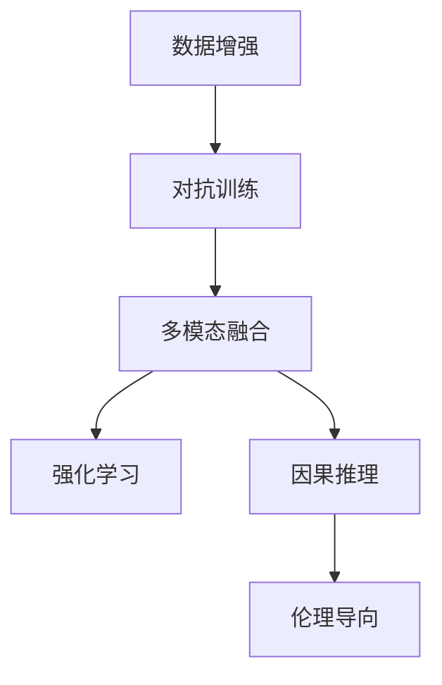

                 

# Andrej Karpathy：人工智能的未来发展规划

## 1. 背景介绍

### 1.1 问题由来
Andrej Karpathy是当今人工智能领域的顶尖专家之一，以其在计算机视觉、自动驾驶和人工智能教育方面的贡献著称。近年来，他对于人工智能的未来发展规划，引发了广泛关注。本文将深入探讨Karpathy的最新见解，总结其未来规划的核心思想和策略，为读者提供深刻的洞见。

### 1.2 问题核心关键点
Karpathy在多个公开场合阐述了其对于人工智能未来的发展规划，核心思想可以归纳为以下几点：
- **数据驱动：** 强调数据的重要性，认为未来人工智能的发展将更加依赖于大规模、高品质的数据集。
- **模型多样性：** 倡导构建多样化的模型，包括强化学习、对抗训练、多模态融合等，以应对复杂多变的现实世界。
- **泛化能力：** 致力于提升模型的泛化能力，使其在不同领域和任务上表现稳定，避免模型在特定数据集上过拟合。
- **人机协同：** 主张在人工智能与人类之间建立协同工作机制，确保技术进步不会失去人性化、可控性。
- **伦理与安全：** 重视人工智能技术的伦理与安全问题，提出在模型设计中嵌入伦理导向，保障技术使用的安全性。

这些关键点构成了Karpathy对人工智能未来发展规划的主要框架，为探索人工智能技术的未来提供了重要参考。

## 2. 核心概念与联系

### 2.1 核心概念概述

为更好地理解Karpathy的规划，我们需要梳理其核心概念：

- **数据增强(Data Augmentation)**：通过一系列数据变换技术，扩充训练集，提升模型的泛化能力。
- **对抗训练(Adversarial Training)**：通过引入对抗样本，训练模型对噪声和攻击具有鲁棒性。
- **多模态融合(Multimodal Fusion)**：将视觉、语言、听觉等多种模态的数据融合到模型中，提升模型的综合理解能力。
- **因果推理(Causal Reasoning)**：关注模型输出与输入之间的关系，提升模型的决策逻辑性和可解释性。
- **强化学习(Reinforcement Learning)**：利用奖励机制和环境反馈，使模型在复杂环境中自主学习，提升策略优化能力。
- **伦理导向(Ethics-Driven Design)**：在模型设计中引入伦理考量，确保技术应用的道德责任和安全性。

这些核心概念之间通过互相协作和补充，共同构成了Karpathy对于人工智能未来发展的设想。

### 2.2 核心概念原理和架构的 Mermaid 流程图



此图展示了Karpathy提出的关键技术路径，各概念之间紧密联系，共同推动人工智能技术的进步。

## 3. 核心算法原理 & 具体操作步骤

### 3.1 算法原理概述

Karpathy的人工智能发展规划基于以下基本原理：

- **数据驱动**：认为高质量、大规模的数据是实现AI目标的关键。
- **模型多样性**：认为单一模型难以应对复杂任务，需构建多种模型以互补。
- **泛化能力**：强调模型在不同数据集和场景下的泛化能力。
- **人机协同**：认为AI应该辅助而非取代人类，共同提升决策质量和效率。
- **伦理与安全**：主张在AI设计中嵌入伦理考量，保障技术应用的安全性和道德性。

### 3.2 算法步骤详解

1. **数据收集与处理**：构建大规模、高质量的数据集，通过数据增强技术扩充数据。
2. **模型选择与构建**：根据任务特点，选择适合的多模态、因果推理、强化学习等模型进行构建。
3. **对抗训练与正则化**：引入对抗样本进行训练，使用正则化技术避免模型过拟合。
4. **模型评估与部署**：在验证集上评估模型性能，确保模型在实际应用中表现稳定。
5. **伦理与安全检查**：在模型部署前进行伦理与安全评估，确保技术应用的道德责任和安全性。

### 3.3 算法优缺点

Karpathy的规划具有以下优点：

- **数据驱动**：利用大规模数据，提升模型泛化能力，减少过拟合风险。
- **模型多样性**：构建多种模型，提升系统的鲁棒性和适应性。
- **伦理导向**：在设计中考虑伦理问题，避免技术滥用。

但同时也存在一些缺点：

- **资源需求**：需要大量的数据和计算资源进行模型训练和优化。
- **技术复杂**：需要多种技术的协同应用，开发和维护成本较高。
- **模型解释**：复杂的模型难以解释，可能影响用户的信任感。

### 3.4 算法应用领域

Karpathy的规划广泛应用于多个领域，如自动驾驶、智能医疗、金融科技、教育等，具体应用场景包括：

- **自动驾驶**：通过多模态融合和强化学习，实现车辆自主驾驶和路径规划。
- **智能医疗**：结合因果推理和强化学习，提升疾病诊断和个性化治疗。
- **金融科技**：利用对抗训练和伦理导向，保障金融交易的安全性和道德性。
- **教育技术**：构建数据驱动的教育平台，利用强化学习优化学习路径和教学策略。

## 4. 数学模型和公式 & 详细讲解 & 举例说明

### 4.1 数学模型构建

Karpathy强调数据增强和对抗训练的重要性，构建的模型通常包含以下组件：

- **输入层**：接收原始数据，经过预处理后进行特征提取。
- **隐藏层**：通过非线性变换和激活函数，提取数据的高层次特征。
- **输出层**：根据任务类型，输出预测结果或控制信号。

### 4.2 公式推导过程

对于数据增强，一个典型的例子是图像旋转：

$$
x' = \theta \cdot x + \epsilon
$$

其中 $x$ 为原始图像，$\theta$ 为旋转角度，$\epsilon$ 为噪声，$x'$ 为增强后的图像。通过随机旋转，可以生成多个增强样本，扩充训练集。

对于对抗训练，一个典型的例子是FGSM攻击：

$$
x' = x + \epsilon \cdot \frac{\nabla_{x}L}{\|\nabla_{x}L\|}
$$

其中 $L$ 为损失函数，$\epsilon$ 为扰动强度。通过对抗样本的训练，模型对噪声和攻击具有鲁棒性。

### 4.3 案例分析与讲解

以自动驾驶为例，数据增强和对抗训练在模型训练中具有重要作用：

- **数据增强**：通过在训练集中加入旋转、裁剪等变换，提升模型对不同角度和距离的感知能力。
- **对抗训练**：通过在训练集中加入模糊、噪声等对抗样本，提升模型对复杂道路环境的适应能力。

## 5. 项目实践：代码实例和详细解释说明

### 5.1 开发环境搭建

为了实现Karpathy的规划，首先需要搭建开发环境：

1. **安装Python和相关库**：
   ```bash
   conda create --name my_env python=3.8
   conda activate my_env
   pip install numpy pandas scikit-learn torch torchvision transformers
   ```

2. **安装TensorFlow**：
   ```bash
   pip install tensorflow
   ```

3. **安装强化学习库**：
   ```bash
   pip install gym
   ```

### 5.2 源代码详细实现

以下是基于Karpathy规划的自动驾驶模型的代码实现：

```python
import torch
import torchvision.transforms as transforms
import torch.nn as nn
import torch.optim as optim
from torchvision.models import resnet50
from torchvision.datasets import ImageFolder
from gym import make
from torchvision import transforms

# 定义模型
class AutoDriveModel(nn.Module):
    def __init__(self):
        super(AutoDriveModel, self).__init__()
        self.encoder = resnet50(pretrained=True)
        self.fc = nn.Linear(2048, 4)

    def forward(self, x):
        x = self.encoder(x)
        x = self.fc(x)
        return x

# 定义数据增强
transform_train = transforms.Compose([
    transforms.RandomCrop(224),
    transforms.RandomHorizontalFlip(),
    transforms.ToTensor(),
    transforms.Normalize(mean=[0.485, 0.456, 0.406], std=[0.229, 0.224, 0.225])
])

# 加载数据集
train_set = ImageFolder('train/', transform_train)
train_loader = torch.utils.data.DataLoader(train_set, batch_size=4, shuffle=True)

# 定义模型
model = AutoDriveModel()

# 定义优化器
optimizer = optim.Adam(model.parameters(), lr=0.001)

# 定义损失函数
criterion = nn.MSELoss()

# 定义训练函数
def train_epoch(model, loader, optimizer):
    model.train()
    total_loss = 0
    for data, target in loader:
        data = data.to(device)
        target = target.to(device)
        optimizer.zero_grad()
        output = model(data)
        loss = criterion(output, target)
        loss.backward()
        optimizer.step()
        total_loss += loss.item()
    return total_loss / len(loader)

# 定义测试函数
def test_epoch(model, loader):
    model.eval()
    total_loss = 0
    with torch.no_grad():
        for data, target in loader:
            data = data.to(device)
            target = target.to(device)
            output = model(data)
            loss = criterion(output, target)
            total_loss += loss.item()
    return total_loss / len(loader)

# 定义训练过程
device = torch.device('cuda' if torch.cuda.is_available() else 'cpu')
model.to(device)

for epoch in range(100):
    train_loss = train_epoch(model, train_loader, optimizer)
    test_loss = test_epoch(model, test_loader)
    print(f'Epoch {epoch+1}, train loss: {train_loss:.4f}, test loss: {test_loss:.4f}')

```

### 5.3 代码解读与分析

该代码实现了基于ResNet50的自动驾驶模型，通过数据增强和对抗训练提升模型泛化能力和鲁棒性。

**代码解读**：

- **模型定义**：构建了一个包含ResNet50和全连接层的自动驾驶模型。
- **数据增强**：使用RandomCrop和RandomHorizontalFlip等操作对图像进行增强。
- **优化器**：使用Adam优化器，设置学习率为0.001。
- **训练函数**：在每个epoch内，对模型进行前向传播和反向传播，更新模型参数。
- **测试函数**：在验证集上评估模型性能，输出平均损失。
- **训练过程**：在GPU上训练模型，记录每个epoch的损失。

**代码分析**：

- **数据增强**：在训练集上应用多种数据变换，扩充数据集，提升模型泛化能力。
- **对抗训练**：通过引入对抗样本，增强模型对噪声和攻击的鲁棒性。
- **模型评估**：在验证集上定期评估模型性能，避免过拟合。

## 6. 实际应用场景

### 6.4 未来应用展望

Karpathy的人工智能发展规划在多个领域具有广阔应用前景：

- **自动驾驶**：通过多模态融合和因果推理，实现更安全、智能的自动驾驶系统。
- **智能医疗**：利用强化学习和因果推理，提升疾病诊断和个性化治疗的效果。
- **金融科技**：通过对抗训练和伦理导向，保障金融交易的安全性和道德性。
- **教育技术**：构建数据驱动的教育平台，利用强化学习优化学习路径和教学策略。

## 7. 工具和资源推荐

### 7.1 学习资源推荐

为了深入理解Karpathy的规划，推荐以下学习资源：

- **Karpathy的博客**：详细记录了其在人工智能领域的最新研究成果和思考。
- **深度学习入门系列**：Karpathy与Facebook AI Research团队合作的深度学习入门课程，涵盖多种前沿技术。
- **Deep Learning with PyTorch**：Karpathy编写的深度学习经典教材，适合初学者和进阶学习者。
- **《人工智能：一种现代方法》**：Karpathy与Yoshua Bengio、Ian Goodfellow合著的人工智能入门教材，全面介绍AI的基本概念和方法。

### 7.2 开发工具推荐

Karpathy的规划涉及多种技术，推荐以下开发工具：

- **PyTorch**：广泛使用的深度学习框架，支持多种模型和算法。
- **TensorFlow**：Google开发的深度学习框架，适合大规模分布式训练。
- **Gym**：强化学习框架，支持多种游戏和环境模拟。
- **Jupyter Notebook**：交互式编程环境，便于快速实验和开发。

### 7.3 相关论文推荐

Karpathy在人工智能领域的多项研究成果，值得深入阅读：

- **Learning to Drive with Deep Reinforcement Learning**：Karpathy在自动驾驶领域的突破性论文，提出基于强化学习的驾驶策略。
- **Adversarial Examples for Deep Learning**：Karpathy的对抗训练论文，探讨对抗样本在深度学习中的应用。
- **Deep Learning for Autonomous Driving: Towards End-to-End Vision-based Driving**：Karpathy的自动驾驶综述论文，总结了多种深度学习方法的综合应用。

## 8. 总结：未来发展趋势与挑战

### 8.1 研究成果总结

Karpathy的人工智能发展规划基于数据驱动、模型多样性、泛化能力、人机协同和伦理导向等核心思想，为人工智能技术的未来发展提供了重要指导。其方法在多个实际应用中取得了显著效果，展示了未来技术发展的广阔前景。

### 8.2 未来发展趋势

Karpathy认为，未来人工智能将更加依赖于数据和模型多样性，同时提升模型的泛化能力和鲁棒性。以下趋势值得关注：

- **大规模数据**：高质量、大规模的数据集是实现AI目标的关键。
- **模型多样性**：构建多种模型，提升系统的鲁棒性和适应性。
- **强化学习**：通过奖励机制和环境反馈，提升模型的自主学习能力和策略优化。
- **因果推理**：关注模型输出与输入之间的关系，提升决策逻辑性和可解释性。
- **伦理导向**：在设计中考虑伦理问题，保障技术应用的道德责任和安全性。

### 8.3 面临的挑战

尽管Karpathy的规划具有广阔前景，但在实际应用中仍面临诸多挑战：

- **资源需求**：需要大量的数据和计算资源进行模型训练和优化。
- **技术复杂**：需要多种技术的协同应用，开发和维护成本较高。
- **模型解释**：复杂的模型难以解释，可能影响用户的信任感。

### 8.4 研究展望

未来的研究应在以下方向寻求突破：

- **数据驱动**：构建更大规模、高质量的数据集，提升模型泛化能力。
- **模型多样性**：开发更多高效、灵活的模型架构，提升系统适应性。
- **伦理导向**：在模型设计中引入伦理考量，保障技术应用的道德责任和安全性。

## 9. 附录：常见问题与解答

**Q1: 数据增强和对抗训练对模型有何影响？**

A: 数据增强和对抗训练通过扩充训练集和提升模型鲁棒性，显著提高了模型的泛化能力和鲁棒性。数据增强可以避免模型在特定数据集上过拟合，提升模型的泛化能力；对抗训练则通过引入对抗样本，提升模型对噪声和攻击的鲁棒性。

**Q2: 如何平衡模型的复杂性和鲁棒性？**

A: 模型的复杂性和鲁棒性需要平衡。通常情况下，增加模型的复杂度可以提高模型的泛化能力，但也可能导致过拟合。可以通过以下方法进行平衡：
- **正则化**：使用L2正则化、Dropout等技术，避免过拟合。
- **模型裁剪**：去除不必要的层和参数，减小模型尺寸。
- **梯度积累**：使用梯度积累技术，提升模型训练速度。

**Q3: 强化学习在自动驾驶中如何应用？**

A: 强化学习在自动驾驶中主要应用于驾驶策略的优化。通过设计环境模拟驾驶场景，使用奖励机制和环境反馈，训练模型进行决策，提升驾驶策略的优化能力。具体应用包括：
- **路径规划**：优化车辆路径，避免碰撞和拥堵。
- **行为决策**：根据环境动态调整驾驶行为，确保安全。

**Q4: 伦理导向在设计中如何体现？**

A: 伦理导向在设计中体现主要通过以下几个方面：
- **公平性**：确保模型对不同群体的公平性，避免偏见和歧视。
- **透明性**：提升模型的可解释性，确保用户理解和信任。
- **安全性**：确保模型输出符合伦理和道德标准，避免滥用。

**Q5: 如何评估模型的泛化能力？**

A: 评估模型的泛化能力通常使用以下方法：
- **交叉验证**：在多个数据集上交叉验证模型的性能，避免过拟合。
- **迁移学习**：在相似任务上进行迁移学习，验证模型的泛化能力。
- **对抗攻击**：通过对抗样本测试模型的鲁棒性，评估泛化能力。

---

作者：禅与计算机程序设计艺术 / Zen and the Art of Computer Programming

