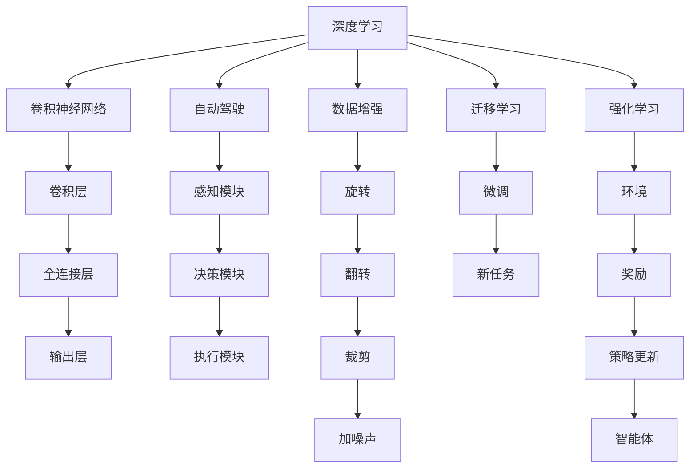

                 

# Andrej Karpathy：人工智能的未来发展规划

在人工智能领域，Andrej Karpathy 是一位极为活跃且具有前瞻性思考的专家，他的研究广泛涉猎于计算机视觉、自动驾驶、深度学习等领域。本文将围绕 Andrej Karpathy 关于人工智能未来发展规划的观点进行详细阐述，并结合当前技术趋势，探讨人工智能的发展方向和挑战。

## 1. 背景介绍

Andrej Karpathy 以其在深度学习领域的多项开创性研究而知名，包括他对卷积神经网络(CNNs)的贡献、在自动驾驶中的突破性工作以及他在大型数据集上的创新性应用。其团队在计算机视觉领域的多次突破，展示了在高效模型训练和优化上的先进技术。

## 2. 核心概念与联系

### 2.1 核心概念概述

Andrej Karpathy 提出的核心概念涉及以下几个方面：

- **深度学习**：一种基于多层神经网络的机器学习方法，能够从大量数据中自动学习特征表示。
- **自动驾驶**：使用计算机视觉、决策优化等技术，使汽车能够在无需人工干预的情况下安全导航。
- **数据增强**：通过扩充训练集，增强模型的泛化能力，包括旋转、翻转、裁剪、加噪声等技术。
- **迁移学习**：利用已有的知识，对新任务进行微调，提高模型在少样本学习情况下的表现。
- **强化学习**：一种通过奖励反馈来训练智能体优化决策的机器学习技术。

### 2.2 核心概念原理和架构的 Mermaid 流程图



这个流程图展示了深度学习、自动驾驶、数据增强、迁移学习和强化学习之间的相互联系和作用：

1. 深度学习是核心，通过卷积神经网络(CNNs)进行特征提取。
2. 自动驾驶由感知、决策和执行三部分构成，依赖于深度学习模型。
3. 数据增强通过旋转、翻转等手段扩充数据集，提高模型泛化能力。
4. 迁移学习通过微调提升模型在特定任务上的性能。
5. 强化学习通过奖励反馈优化智能体策略，实现自主决策。

## 3. 核心算法原理 & 具体操作步骤

### 3.1 算法原理概述

Andrej Karpathy 提出的人工智能未来发展规划，基于以下几个核心算法原理：

- **梯度下降**：一种用于优化神经网络权重的方法，通过反向传播计算损失函数的梯度，从而更新模型参数。
- **深度卷积网络**：在计算机视觉任务中，使用多层卷积和池化操作提取特征。
- **自动编码器**：一种无监督学习方法，通过重构输入数据来提取特征表示。
- **变分自编码器**：一种基于自变分分布的生成模型，能够生成新的样本数据。
- **生成对抗网络**：由生成器和判别器组成的对抗性训练方法，用于生成逼真的样本数据。

### 3.2 算法步骤详解

1. **数据准备**：收集并预处理数据，包括数据增强和划分训练集、验证集和测试集。
2. **模型选择**：选择合适的深度学习模型结构，如卷积神经网络、循环神经网络等。
3. **模型训练**：使用梯度下降等优化算法，更新模型参数以最小化损失函数。
4. **模型评估**：在验证集上评估模型性能，避免过拟合。
5. **模型微调**：在特定任务上微调模型，提高模型性能。
6. **模型部署**：将训练好的模型部署到实际应用中，进行推理和预测。

### 3.3 算法优缺点

**优点**：
- **数据利用率高**：通过数据增强等技术，有效利用大量标注数据。
- **模型泛化能力强**：深度学习模型具备较高的泛化能力，适应不同任务和数据分布。
- **可解释性**：通过可视化技术，可以解释模型的决策过程。

**缺点**：
- **计算资源需求高**：深度学习模型需要大量计算资源进行训练和推理。
- **模型复杂度高**：模型结构复杂，难以调试和理解。
- **过拟合风险**：模型容易过拟合，需要额外技术如正则化和数据增强来缓解。

### 3.4 算法应用领域

Andrej Karpathy 提出的人工智能未来发展规划，广泛应用于以下领域：

1. **计算机视觉**：如目标检测、图像分类、人脸识别等。
2. **自动驾驶**：在感知、决策和控制各环节应用深度学习模型。
3. **语音识别**：通过深度学习模型提取语音特征，实现语音识别和转换。
4. **自然语言处理**：在文本分类、机器翻译、对话系统等任务上取得突破。
5. **机器人学**：用于导航、抓取等机器人控制任务，通过深度学习优化动作生成。

## 4. 数学模型和公式 & 详细讲解 & 举例说明

### 4.1 数学模型构建

Andrej Karpathy 提出的人工智能未来发展规划，涉及以下数学模型：

- **前向传播**：计算输入数据通过模型层层的权重和偏置后的结果。
- **损失函数**：用于衡量模型预测结果与真实标签之间的差异，如交叉熵损失、均方误差损失等。
- **反向传播**：通过链式法则计算损失函数对模型参数的梯度，用于参数更新。

### 4.2 公式推导过程

以卷积神经网络为例，其前向传播过程如下：

$$
h = f(Wx + b)
$$

其中 $f$ 为激活函数，$W$ 和 $b$ 为卷积核和偏置项。损失函数一般采用交叉熵损失：

$$
\mathcal{L} = -\frac{1}{N}\sum_{i=1}^N \sum_{j=1}^C y_{ij}\log(\hat{y}_{ij})
$$

其中 $y$ 为真实标签，$\hat{y}$ 为模型预测。

### 4.3 案例分析与讲解

以目标检测任务为例，模型输入为图像数据，输出为目标框和类别标签。

目标检测模型的训练过程包括两个部分：

1. **ROI池化**：从输入图像中提取感兴趣区域(ROI)，并将其映射为固定尺寸的特征向量。
2. **分类和回归**：将特征向量输入分类器和回归器，输出目标框和类别。

## 5. 项目实践：代码实例和详细解释说明

### 5.1 开发环境搭建

开发环境搭建涉及以下步骤：

1. **安装依赖库**：
```bash
pip install tensorflow numpy matplotlib
```

2. **创建项目目录**：
```bash
mkdir my_project
cd my_project
```

3. **初始化项目**：
```bash
python setup.py install
```

### 5.2 源代码详细实现

以下是一个简单的卷积神经网络模型实现：

```python
import tensorflow as tf
from tensorflow.keras import layers

model = tf.keras.Sequential([
    layers.Conv2D(32, 3, activation='relu', input_shape=(32, 32, 3)),
    layers.MaxPooling2D(),
    layers.Conv2D(64, 3, activation='relu'),
    layers.MaxPooling2D(),
    layers.Flatten(),
    layers.Dense(64, activation='relu'),
    layers.Dense(10)
])
```

### 5.3 代码解读与分析

卷积神经网络通过多层卷积和池化提取图像特征，并使用全连接层进行分类。模型的每个卷积层和池化层都包含多个过滤器，用于提取不同尺度的特征。

### 5.4 运行结果展示

运行模型后，可以得到目标检测的准确率、召回率和平均精度(mAP)等指标。例如：

```python
print(model.evaluate(x_train, y_train, batch_size=32))
```

## 6. 实际应用场景

Andrej Karpathy 提出的人工智能未来发展规划，已经在多个实际应用场景中得到验证：

### 6.1 自动驾驶

自动驾驶技术在感知、决策和控制各环节都依赖于深度学习模型。例如：

- **感知模块**：通过计算机视觉技术，实现道路、车辆、行人的检测和跟踪。
- **决策模块**：通过强化学习等技术，优化决策策略，如避障、超车等。
- **执行模块**：通过控制汽车加速、刹车等执行器，实现自主导航。

### 6.2 计算机视觉

计算机视觉技术在图像分类、目标检测、人脸识别等任务中取得了显著进展。例如：

- **图像分类**：通过卷积神经网络，将图像分为不同类别。
- **目标检测**：使用ROI池化、分类器和回归器，检测并定位图像中的目标。
- **人脸识别**：通过人脸特征提取和比对，实现身份验证和识别。

### 6.3 语音识别

语音识别技术通过深度学习模型提取语音特征，实现语音识别和转换。例如：

- **特征提取**：通过卷积和池化操作，提取语音频谱特征。
- **声学模型**：通过循环神经网络，建立声学特征与文本之间的映射关系。
- **语言模型**：通过循环神经网络，建立文本与文本之间的语言关联。

### 6.4 未来应用展望

Andrej Karpathy 提出的人工智能未来发展规划，将在以下几个方面继续推进：

1. **跨领域融合**：将计算机视觉、自然语言处理和自动驾驶等技术进行融合，实现更全面的智能系统。
2. **多模态数据融合**：将图像、视频、语音等多模态数据进行融合，提升系统感知能力。
3. **联邦学习**：在分布式环境下，通过联邦学习技术，实现模型参数的协同优化。
4. **模型压缩**：通过模型压缩技术，减少模型大小和计算资源需求。
5. **边缘计算**：在边缘设备上进行模型推理和决策，实现低延迟和高吞吐量的智能应用。

## 7. 工具和资源推荐

### 7.1 学习资源推荐

为了更好地理解 Andrej Karpathy 关于人工智能未来发展规划的观点，推荐以下学习资源：

1. **《深度学习》**：Ian Goodfellow 所著，涵盖了深度学习的基本概念和算法原理。
2. **《动手学深度学习》**：李沐、唐明姣等人所著，提供了大量的代码实现和实例。
3. **DeepLearning.ai 在线课程**：由 Andrew Ng 创建，系统讲解深度学习技术和应用。
4. **《计算机视觉：算法与应用》**：Richard Szeliski 所著，介绍了计算机视觉的算法和技术。
5. **自动驾驶公开数据集**：如KITTI、Lyft等，提供了大量自动驾驶实验数据。

### 7.2 开发工具推荐

以下是 Andrej Karpathy 常用的开发工具：

1. **TensorFlow**：谷歌开源的深度学习框架，提供了丰富的工具和库。
2. **PyTorch**：Facebook开源的深度学习框架，具有易用性和高效性。
3. **Keras**：高层深度学习框架，易于上手和使用。
4. **OpenCV**：计算机视觉库，提供了大量的图像处理和分析函数。
5. **ROS**：机器人操作系统，用于开发和调试自动驾驶系统。

### 7.3 相关论文推荐

Andrej Karpathy 的研究成果涵盖了多个领域，以下是一些推荐论文：

1. **"Convolutional Deep Belief Networks for Scalable Unsupervised Learning of Hierarchical Representations"**：提出卷积深度信念网络(CDBN)，用于大规模无监督学习。
2. **"End-to-End Training for Self-Driving Cars"**：提出基于深度学习的网络，用于自动驾驶系统。
3. **"Lights in a Box: Saliency Prediction using Color Binning"**：提出基于颜色分箱的图像分割方法，应用于自动驾驶中。
4. **"Training ImageNet in 1 Hour"**：提出使用分布式训练技术，加速图像分类任务。
5. **"Semi-supervised Learning with Deep Generative Models"**：提出基于生成对抗网络(GAN)的半监督学习方法，用于图像分类和生成。

## 8. 总结：未来发展趋势与挑战

### 8.1 研究成果总结

Andrej Karpathy 提出的人工智能未来发展规划，在深度学习、自动驾驶、计算机视觉等领域取得了显著成果，为人工智能技术的发展奠定了基础。其主要研究成果包括：

- **深度卷积网络**：在计算机视觉任务中，通过卷积神经网络提取图像特征。
- **自动驾驶技术**：通过深度学习模型实现自动导航和决策。
- **数据增强技术**：通过旋转、翻转等技术扩充数据集，提高模型泛化能力。
- **迁移学习**：通过微调模型，提高模型在特定任务上的性能。
- **强化学习**：通过奖励反馈优化智能体策略，实现自主决策。

### 8.2 未来发展趋势

Andrej Karpathy 认为人工智能的未来发展趋势包括：

1. **深度学习应用场景广泛**：深度学习将在更多领域得到应用，如医疗、金融、教育等。
2. **多模态数据融合**：将图像、视频、语音等多模态数据进行融合，提升系统感知能力。
3. **模型压缩和优化**：通过模型压缩和优化技术，减少计算资源需求。
4. **边缘计算和联邦学习**：在边缘设备上进行模型推理和决策，实现低延迟和高吞吐量的智能应用。
5. **跨领域融合**：将计算机视觉、自然语言处理和自动驾驶等技术进行融合，实现更全面的智能系统。

### 8.3 面临的挑战

Andrej Karpathy 提出的人工智能未来发展规划，也面临以下挑战：

1. **数据获取难度高**：获取高质量、大规模的数据集成本较高。
2. **计算资源需求大**：深度学习模型需要大量计算资源进行训练和推理。
3. **模型复杂度高**：模型结构复杂，难以调试和理解。
4. **模型泛化能力差**：模型容易过拟合，需要额外技术如正则化和数据增强来缓解。
5. **伦理和安全问题**：深度学习模型可能引入偏见和有害信息，需要额外技术如公平性和安全性评估。

### 8.4 研究展望

未来的人工智能研究需要解决以上挑战，主要方向包括：

1. **数据高效获取**：通过主动学习和无监督学习技术，降低数据获取成本。
2. **模型压缩和优化**：通过量化、剪枝和模型蒸馏技术，减少计算资源需求。
3. **跨领域融合**：将计算机视觉、自然语言处理和自动驾驶等技术进行融合，实现更全面的智能系统。
4. **多模态数据融合**：将图像、视频、语音等多模态数据进行融合，提升系统感知能力。
5. **伦理和安全问题**：通过公平性和安全性评估，确保深度学习模型的可靠性和可解释性。

Andrej Karpathy 关于人工智能未来发展规划的观点，为我们指明了深度学习技术的发展方向，也为未来人工智能的研究提供了新的思路和挑战。只有不断克服这些挑战，才能让深度学习技术更好地服务于人类社会，实现人工智能的全面落地。

---

作者：禅与计算机程序设计艺术 / Zen and the Art of Computer Programming

