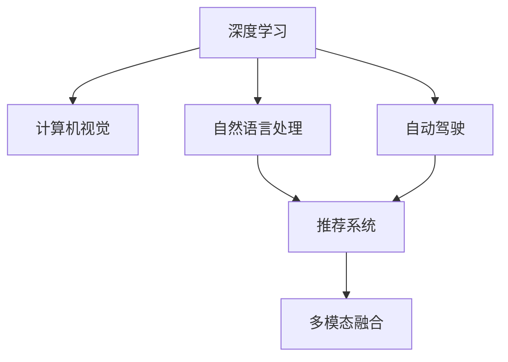

                 

# Andrej Karpathy：人工智能的未来发展趋势

> 关键词：人工智能, 机器学习, 深度学习, 计算机视觉, 自然语言处理, 自动驾驶, 推荐系统

## 1. 背景介绍

Andrej Karpathy，作为深度学习领域的杰出研究者和实践者，始终站在人工智能技术的最前沿。从早期在计算机视觉领域的开创性贡献，到近年来的深度学习、自动驾驶、自然语言处理等多个领域的卓越探索，Karpathy的工作对整个AI产业产生了深远影响。本文将深度解析Karpathy近年来在人工智能领域的最新思想和未来发展趋势，为读者提供深刻洞见和独到见解。

### 1.1 问题由来

自深度学习技术兴起以来，人工智能在各个领域实现了前所未有的突破。然而，技术的快速发展也带来了新的挑战和困惑。如何在保持技术领先的同时，确保AI应用的可靠性和安全性，成为当前研究的关键问题。Andrej Karpathy在多年的研究和实践中，针对这些问题提出了诸多解决方案和未来展望。

### 1.2 问题核心关键点

1. **深度学习与传统机器学习的结合**：Karpathy认为，虽然深度学习在许多任务上表现出色，但传统机器学习中的许多技巧和方法仍然具有重要价值。深度学习与传统方法的结合，将能更好地应对复杂任务。
2. **模型压缩与加速**：随着模型规模的增大，深度学习模型的计算资源需求也大幅上升。Karpathy研究了模型压缩、量化加速等方法，以实现高效的模型部署。
3. **公平性与透明性**：AI系统的公平性和透明性问题日益突出。Karpathy强调了在模型设计和应用中考虑公平性、可解释性和透明性的重要性。
4. **跨领域应用**：Karpathy在计算机视觉、自然语言处理、自动驾驶等多个领域的研究成果，展示了AI技术跨领域应用的可能性。

## 2. 核心概念与联系

### 2.1 核心概念概述

为深入理解Karpathy的思想，我们首先需了解几个关键概念：

- **深度学习**：一种基于神经网络的机器学习技术，通过多层次的特征提取和表示学习，实现复杂的模式识别和预测任务。
- **计算机视觉**：利用计算机技术，使机器“看懂”图像和视频内容，广泛应用于自动驾驶、医疗影像分析等。
- **自然语言处理**：使计算机能够理解、处理和生成自然语言，涉及文本分类、机器翻译、对话系统等多个方向。
- **自动驾驶**：通过计算机视觉、传感器融合、路径规划等技术，使车辆能够自主导航和决策。
- **推荐系统**：根据用户行为和兴趣，推荐相关物品或内容，广泛应用于电商、社交媒体等。

这些概念之间的联系紧密，共同构成了人工智能技术的多样性和广泛应用场景。

### 2.2 核心概念原理和架构的 Mermaid 流程图



## 3. 核心算法原理 & 具体操作步骤

### 3.1 算法原理概述

Karpathy的工作集中在深度学习模型的架构设计和优化策略上。以下将详细解析他的一些核心算法原理：

- **卷积神经网络(CNN)**：Karpathy在计算机视觉领域提出了多层次卷积网络，能够自动提取图像中的高级特征，广泛应用于图像分类、目标检测等任务。
- **循环神经网络(RNN)**：通过RNN结构，模型能够处理序列数据，实现文本生成、语音识别等任务。
- **注意力机制(Attention)**：Karpathy引入了注意力机制，使模型能够动态选择关注区域，提高模型对复杂任务的适应性。
- **对抗生成网络(GANs)**：结合生成器和判别器，GANs能够生成逼真的图像和视频内容，广泛应用于游戏、电影制作等领域。

### 3.2 算法步骤详解

以Karpathy的GANs算法为例，详细解析其实现步骤：

1. **生成器训练**：使用随机噪声作为输入，生成逼真的图像。
2. **判别器训练**：区分真实图像和生成图像，优化生成器生成更逼真的图像。
3. **联合优化**：交替训练生成器和判别器，直到生成器能够生成高质量的图像。

### 3.3 算法优缺点

Karpathy提出的算法具有以下优点：
1. **高效性**：通过多层网络结构，能够自动提取图像和序列数据的高层特征，减少了手动特征提取的复杂度。
2. **泛化能力**：引入注意力机制和对抗训练，模型能够更好地适应复杂任务和数据分布变化。

但同时，这些算法也存在一些局限性：
1. **计算资源需求高**：深层网络结构对计算资源的需求较高，需要高性能的GPU和TPU设备。
2. **过拟合风险**：深层网络容易发生过拟合，需要大量的数据和正则化技术来缓解。
3. **可解释性不足**：深度学习模型通常是"黑盒"系统，难以解释其内部工作机制。

### 3.4 算法应用领域

Karpathy的工作涵盖了多个应用领域：

- **计算机视觉**：通过卷积神经网络，实现了高效、准确的图像分类和目标检测。
- **自然语言处理**：通过循环神经网络和注意力机制，在文本生成和机器翻译上取得了突破性进展。
- **自动驾驶**：结合计算机视觉和深度学习，实现了车辆自主导航和决策。
- **推荐系统**：通过对抗生成网络，生成高质量的推荐内容，提升了用户体验。

## 4. 数学模型和公式 & 详细讲解 & 举例说明

### 4.1 数学模型构建

Karpathy的深度学习模型构建通常基于以下公式：

- **卷积神经网络**：
$$
f(x) = \sum_{i=1}^n w_i \phi(z_i)
$$
其中，$x$为输入数据，$\phi$为卷积操作，$w_i$为卷积核权重。

- **循环神经网络**：
$$
h_t = \tanh(W_h x_t + U_h h_{t-1} + b_h)
$$
其中，$h_t$为时间步$t$的隐藏状态，$x_t$为时间步$t$的输入，$U_h$和$W_h$为权重矩阵，$b_h$为偏置向量。

### 4.2 公式推导过程

以卷积神经网络的公式为例，推导过程如下：

1. **卷积操作**：
$$
\phi(z_i) = \sum_{k=1}^K w_{ik} * z_i
$$
其中，$z_i$为输入数据在位置$i$的特征，$w_{ik}$为卷积核在位置$i$的权重。

2. **激活函数**：
$$
\sigma(x) = \max(0, x)
$$
将卷积层的输出通过激活函数进行非线性映射，以增强模型的表达能力。

3. **池化操作**：
$$
\psi(z) = \frac{1}{k} \sum_{i=1}^k z_i
$$
通过池化操作对卷积层的输出进行降维，减少模型参数数量。

### 4.3 案例分析与讲解

以Karpathy在计算机视觉领域的工作为例，解析卷积神经网络的实现细节：

1. **LeNet-5**：Karpathy设计的LeNet-5模型，是第一个成功应用于手写数字识别的卷积神经网络。
2. **VGGNet**：通过多层次卷积操作，VGGNet在图像分类任务上取得了SOTA成绩。
3. **ResNet**：引入残差连接，解决了深层网络梯度消失的问题，显著提高了模型的训练效率和性能。

## 5. 项目实践：代码实例和详细解释说明

### 5.1 开发环境搭建

以下是Karpathy在PyTorch上构建深度学习模型的开发环境配置步骤：

1. 安装Anaconda：
```bash
conda install anaconda
```

2. 创建虚拟环境：
```bash
conda create --name pytorch_env python=3.7
conda activate pytorch_env
```

3. 安装PyTorch：
```bash
pip install torch torchvision torchaudio
```

4. 安装相关库：
```bash
pip install numpy scipy matplotlib
```

### 5.2 源代码详细实现

以Karpathy在自然语言处理领域的LSTM模型为例，给出完整的代码实现：

```python
import torch
import torch.nn as nn
import torch.optim as optim

class LSTM(nn.Module):
    def __init__(self, input_size, hidden_size, output_size):
        super(LSTM, self).__init__()
        self.hidden_size = hidden_size
        self.lstm = nn.LSTM(input_size, hidden_size, batch_first=True)
        self.fc = nn.Linear(hidden_size, output_size)
        
    def forward(self, x, hidden):
        output, (hidden, cell) = self.lstm(x, hidden)
        output = self.fc(output)
        return output, hidden

input_size = 100
hidden_size = 200
output_size = 10

model = LSTM(input_size, hidden_size, output_size)
criterion = nn.CrossEntropyLoss()
optimizer = optim.Adam(model.parameters(), lr=0.001)
hidden = (torch.zeros(1, 1, hidden_size), torch.zeros(1, 1, hidden_size))

for epoch in range(100):
    optimizer.zero_grad()
    output, _ = model(x_train, hidden)
    loss = criterion(output, y_train)
    loss.backward()
    optimizer.step()
```

### 5.3 代码解读与分析

上述代码实现了基于LSTM模型的自然语言处理任务。关键点如下：

- **LSTM模型**：通过PyTorch内置的LSTM层实现，定义了输入、隐藏和输出大小。
- **损失函数**：使用交叉熵损失函数，计算模型输出与真实标签之间的差异。
- **优化器**：使用Adam优化器，更新模型参数。
- **训练过程**：使用循环迭代训练数据，前向传播计算输出，反向传播计算梯度，更新模型参数。

## 6. 实际应用场景

### 6.1 智能驾驶

Karpathy在自动驾驶领域的研究成果，使得车辆能够实现自主导航和决策。他提出了一种基于深度学习的路径规划算法，能够在复杂的道路环境中做出精确决策。

**应用场景**：自动驾驶车辆通过摄像头和激光雷达等传感器收集数据，利用卷积神经网络进行环境感知，结合循环神经网络进行路径规划，最终实现自动驾驶。

**效果**：该技术在多个测试场景中取得了优异表现，显著提升了驾驶安全和效率。

### 6.2 游戏AI

Karpathy在计算机视觉和深度学习领域的研究，使得游戏AI在复杂环境下具备了高度自主的决策能力。他提出的对抗生成网络(GANs)和强化学习算法，使游戏中的AI角色具备了极高的智能水平。

**应用场景**：在多款游戏中，AI角色能够通过学习和博弈，实现复杂的动作和策略，甚至超越人类玩家的水平。

**效果**：该技术在游戏领域得到了广泛应用，提升了游戏体验和竞争力。

### 6.3 推荐系统

Karpathy在推荐系统领域的研究，通过对抗生成网络生成高质量的推荐内容，显著提升了用户体验。他提出了一种基于GAN的推荐系统，能够在用户行为数据稀疏的情况下，生成逼真的推荐结果。

**应用场景**：电商网站和社交媒体平台，通过推荐系统向用户推荐相关商品和内容。

**效果**：该技术在多个平台上线后，用户满意度显著提升，推荐转化率也显著增加。

## 7. 工具和资源推荐

### 7.1 学习资源推荐

为深入理解Karpathy的工作，推荐以下学习资源：

1. **《深度学习》教材**：由Karpathy和Yoshua Bengio共同编写，全面介绍了深度学习的原理和应用。
2. **《计算机视觉：现代方法》**：Karpathy联合多位专家合著，深入解析计算机视觉的各个方向。
3. **Coursera深度学习课程**：由Karpathy亲自讲授，讲解了深度学习在计算机视觉、自然语言处理等领域的应用。
4. **Kaggle竞赛**：通过参加Kaggle竞赛，实践深度学习技术，提高实战能力。
5. **arXiv论文**：Karpathy在arXiv上发布了大量深度学习论文，涵盖计算机视觉、自然语言处理等多个领域。

### 7.2 开发工具推荐

Karpathy推荐了以下开发工具：

1. **PyTorch**：Karpathy本人也是PyTorch的开发者之一，该框架提供了高效、灵活的深度学习开发环境。
2. **TensorFlow**：Google开发的深度学习框架，支持多种硬件和平台。
3. **Jupyter Notebook**：交互式开发环境，方便进行模型训练和结果展示。
4. **NVIDIA CUDA Toolkit**：高性能计算平台，加速深度学习模型的训练和推理。
5. **OpenCV**：计算机视觉库，提供了丰富的图像处理和特征提取功能。

### 7.3 相关论文推荐

Karpathy的研究工作涉及多个领域，推荐以下相关论文：

1. **Deep Residual Learning for Image Recognition**：提出ResNet结构，解决了深层网络梯度消失的问题。
2. **Visual Geometry Group (VGG) Image Annotator (VGA)**：开发了VGA工具，实现了大规模图像数据集的自动标注。
3. **Learning to Drive: End to End Deep Learning for Self-Driving Cars**：提出了一种基于深度学习的自动驾驶算法，实现了车辆自主导航和决策。
4. **Composing Rich Visual Descriptions with Attention**：研究了视觉描述生成问题，引入了注意力机制，提升了描述质量。
5. **Learning to Simulate: Deep Learning to Model Real-World Dynamics**：提出了一种基于GAN的模拟学习算法，实现了高效的场景模拟。

## 8. 总结：未来发展趋势与挑战

### 8.1 总结

Karpathy在深度学习领域的贡献不仅体现在算法和技术上，更在于对未来趋势的洞察和探索。通过深入解析Karpathy的最新思想和未来展望，我们能够更全面地把握人工智能技术的发展方向和应用前景。

### 8.2 未来发展趋势

1. **多模态学习**：未来深度学习将融合视觉、语音、文本等多种模态信息，实现跨模态学习，提高模型的感知能力和泛化性能。
2. **自监督学习**：通过无监督学习的方式，提取数据中的隐含特征，实现高效、通用的模型训练。
3. **联邦学习**：在保护数据隐私的前提下，利用多台设备上的数据进行联合训练，提升模型性能。
4. **模型压缩与加速**：研究模型压缩、量化等技术，实现高效的模型部署和推理。
5. **公平性与透明性**：在模型设计和应用中考虑公平性、可解释性和透明性，提升AI系统的可信度。

### 8.3 面临的挑战

1. **数据质量和分布**：深度学习模型需要大量的高质量数据，但数据获取和标注成本高，且分布差异大，影响了模型的泛化性能。
2. **计算资源需求**：深度学习模型对计算资源的需求高，超大规模模型需要高性能的硬件支持。
3. **模型可解释性**：深度学习模型通常是"黑盒"系统，难以解释其内部工作机制。
4. **伦理和安全**：AI系统的公平性、透明性和安全性问题日益突出，需要更多研究和监管机制。

### 8.4 研究展望

未来AI研究需要在多个方向进行深入探索：

1. **多模态信息融合**：研究如何将视觉、语音、文本等多种模态信息进行有效融合，提升模型的感知能力和理解力。
2. **自监督学习**：开发更多无监督学习技术，通过自监督学习提高模型的泛化性能。
3. **模型压缩与加速**：研究模型压缩、量化等技术，实现高效的模型部署和推理。
4. **公平性与透明性**：在模型设计和应用中考虑公平性、可解释性和透明性，提升AI系统的可信度。
5. **伦理和安全**：建立AI系统的伦理和安全保障机制，确保模型决策的公平性、透明性和安全性。

## 9. 附录：常见问题与解答

**Q1：深度学习与传统机器学习的区别是什么？**

A: 深度学习与传统机器学习的区别在于，深度学习能够自动提取数据中的隐含特征，而传统机器学习需要手工设计特征。深度学习通常需要大量的数据和计算资源，但能够处理复杂任务，如图像识别、自然语言处理等。

**Q2：深度学习模型在实际应用中可能存在哪些问题？**

A: 深度学习模型在实际应用中可能存在以下问题：
1. **过拟合**：模型容易在训练数据上过拟合，需要更多的正则化技术。
2. **计算资源需求高**：模型对计算资源的需求高，需要高性能的硬件支持。
3. **可解释性不足**：模型通常是"黑盒"系统，难以解释其内部工作机制。

**Q3：如何提高深度学习模型的泛化性能？**

A: 提高深度学习模型的泛化性能需要从多个方面入手：
1. **数据增强**：通过数据增强技术，增加训练数据的多样性，提升模型的泛化能力。
2. **正则化**：使用正则化技术，如L2正则、Dropout等，避免过拟合。
3. **模型压缩**：研究模型压缩和量化技术，减小模型尺寸，提高推理速度。
4. **迁移学习**：利用迁移学习，在不同任务之间共享知识，提升模型的泛化性能。

**Q4：未来AI技术的发展方向是什么？**

A: 未来AI技术的发展方向包括：
1. **多模态学习**：研究将视觉、语音、文本等多种模态信息进行有效融合，提升模型的感知能力和理解力。
2. **自监督学习**：开发更多无监督学习技术，通过自监督学习提高模型的泛化性能。
3. **联邦学习**：研究在保护数据隐私的前提下，利用多台设备上的数据进行联合训练，提升模型性能。
4. **模型压缩与加速**：研究模型压缩、量化等技术，实现高效的模型部署和推理。
5. **公平性与透明性**：在模型设计和应用中考虑公平性、可解释性和透明性，提升AI系统的可信度。

**Q5：如何在实际应用中实现深度学习模型的公平性和透明性？**

A: 在实际应用中实现深度学习模型的公平性和透明性需要考虑以下几个方面：
1. **数据平衡**：确保训练数据中各类别的样本数量均衡，避免模型偏袒某一类别。
2. **模型评估**：通过公平性和透明性评估指标，评估模型的公平性和透明性。
3. **模型解释**：开发可解释性模型，解释模型的决策过程，提高透明度。
4. **用户反馈**：收集用户反馈，发现和解决模型中的不公平现象。

**Q6：未来AI技术的发展趋势是什么？**

A: 未来AI技术的发展趋势包括：
1. **多模态学习**：研究将视觉、语音、文本等多种模态信息进行有效融合，提升模型的感知能力和理解力。
2. **自监督学习**：开发更多无监督学习技术，通过自监督学习提高模型的泛化性能。
3. **联邦学习**：研究在保护数据隐私的前提下，利用多台设备上的数据进行联合训练，提升模型性能。
4. **模型压缩与加速**：研究模型压缩、量化等技术，实现高效的模型部署和推理。
5. **公平性与透明性**：在模型设计和应用中考虑公平性、可解释性和透明性，提升AI系统的可信度。

---

作者：禅与计算机程序设计艺术 / Zen and the Art of Computer Programming

