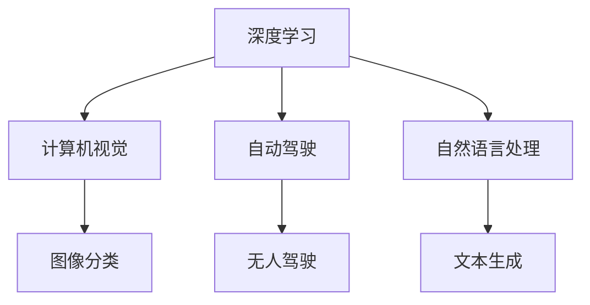

                 

# Andrej Karpathy：人工智能的未来发展趋势

> 关键词：人工智能,深度学习,机器学习,计算机视觉,自然语言处理

## 1. 背景介绍

### 1.1 问题由来
随着人工智能技术的飞速发展，深度学习已经在计算机视觉、自然语言处理等多个领域取得了突破性进展。安德烈·卡帕西(Andrej Karpathy)作为人工智能领域的先锋，其关于深度学习未来发展的洞察和见解，对我们理解未来人工智能的发展趋势具有重要的指导意义。

### 1.2 问题核心关键点
本文将探讨安德烈·卡帕西对未来人工智能发展趋势的见解，特别是深度学习技术的发展前景和潜在的突破点。包括深度学习的最新进展，未来可能的新兴技术，以及在实际应用中的挑战与机遇。

## 2. 核心概念与联系

### 2.1 核心概念概述

安德烈·卡帕西（Andrej Karpathy）是斯坦福大学计算机科学系的助理教授，同时也是人工智能研究领域的知名专家。他专注于深度学习，计算机视觉，自动驾驶等领域的研究，并在这些领域做出了重要贡献。

安德烈·卡帕西的研究方向涉及以下几个核心概念：

- **深度学习**：一种模拟人脑神经网络的学习方法，通过多层神经网络提取数据的高层特征。
- **计算机视觉**：使计算机能够理解、解释和处理图像和视频数据的技术。
- **自动驾驶**：结合计算机视觉、机器学习和控制理论，实现自主导航的车辆系统。
- **自然语言处理**：使计算机能够理解和生成人类语言的技术。

### 2.2 核心概念原理和架构的 Mermaid 流程图



## 3. 核心算法原理 & 具体操作步骤

### 3.1 算法原理概述
安德烈·卡帕西的研究主要集中在深度学习及其在计算机视觉和自动驾驶等领域的实际应用。深度学习通过多层神经网络来模拟人类神经网络的工作方式，自动从数据中提取高层次的特征表示。

### 3.2 算法步骤详解

**步骤一：数据准备**
- 收集和处理数据集，确保数据集具有代表性，并且足够多样性。
- 数据预处理，包括图像增强、归一化、标准化等。

**步骤二：模型构建**
- 选择合适的深度学习模型架构，如卷积神经网络(CNN)、递归神经网络(RNN)等。
- 设计模型训练的损失函数和优化器，如交叉熵损失、Adam优化器等。

**步骤三：模型训练**
- 将数据集划分为训练集、验证集和测试集。
- 使用训练集对模型进行训练，调整模型参数以最小化损失函数。
- 在验证集上评估模型性能，防止过拟合。

**步骤四：模型测试和评估**
- 使用测试集对模型进行最终评估，评估指标包括准确率、召回率、F1分数等。
- 根据评估结果调整模型参数或改变模型架构。

### 3.3 算法优缺点
- **优点**：
  - 深度学习能够自动学习复杂的数据特征，大大提升了模型的泛化能力。
  - 在计算机视觉、自然语言处理等领域取得了显著的进展，推动了AI技术的快速发展。
- **缺点**：
  - 深度学习模型通常需要大量的标注数据进行训练，数据获取和标注成本高。
  - 模型复杂度高，训练和推理速度慢，对计算资源要求高。

### 3.4 算法应用领域

安德烈·卡帕西的研究成果涵盖了以下几个应用领域：

- **计算机视觉**：他在图像分类、物体检测、图像生成等方面取得了重要成果。
- **自动驾驶**：他开发了自动驾驶车辆的环境感知和路径规划算法，推动了自动驾驶技术的进步。
- **自然语言处理**：他研究了文本生成、机器翻译等任务，推动了自然语言处理技术的发展。

## 4. 数学模型和公式 & 详细讲解 & 举例说明

### 4.1 数学模型构建
安德烈·卡帕西的研究中，数学模型构建是核心步骤之一。这里以卷积神经网络为例，简要说明其数学模型构建过程。

**卷积神经网络**的数学模型构建过程如下：

$$
y = \sigma(z)
$$

其中，$z = \sum_i w_i x_i + b$，$x_i$ 为输入样本，$w_i$ 为权重，$b$ 为偏置。$\sigma$ 为激活函数，通常使用ReLU函数。

### 4.2 公式推导过程
卷积神经网络的公式推导过程如下：

$$
z = \sum_i w_i x_i + b
$$

$$
\frac{\partial z}{\partial w_i} = x_i
$$

$$
\frac{\partial z}{\partial x_i} = w_i
$$

通过以上公式，可以计算出卷积神经网络中每个神经元的梯度。

### 4.3 案例分析与讲解
以下以安德烈·卡帕西对计算机视觉领域的研究为例，说明其对未来深度学习发展的贡献：

安德烈·卡帕西提出的“逐层加权信息传播”算法（Weighted Layers Propagation），可以有效地提高图像分类模型的准确率。该算法通过逐层传播信息，使模型可以更好地利用不同层次的特征，从而提升分类效果。

## 5. 项目实践：代码实例和详细解释说明

### 5.1 开发环境搭建
搭建深度学习开发环境需要以下步骤：

1. 安装Python：建议使用Python 3.6或更高版本。
2. 安装深度学习库：如TensorFlow、PyTorch等。
3. 安装计算机视觉库：如OpenCV、Pillow等。

### 5.2 源代码详细实现

以下是一个使用TensorFlow实现卷积神经网络的代码示例：

```python
import tensorflow as tf
from tensorflow.keras.layers import Conv2D, MaxPooling2D, Flatten, Dense

model = tf.keras.Sequential()
model.add(Conv2D(32, (3,3), activation='relu', input_shape=(28, 28, 1)))
model.add(MaxPooling2D((2,2)))
model.add(Conv2D(64, (3,3), activation='relu'))
model.add(MaxPooling2D((2,2)))
model.add(Flatten())
model.add(Dense(64, activation='relu'))
model.add(Dense(10, activation='softmax'))

model.compile(optimizer='adam', loss='categorical_crossentropy', metrics=['accuracy'])
```

### 5.3 代码解读与分析
上述代码构建了一个简单的卷积神经网络模型，包含两个卷积层和两个池化层，最后两个全连接层用于分类。其中，`Conv2D`和`MaxPooling2D`用于卷积和池化操作，`Dense`用于全连接层。

### 5.4 运行结果展示
运行上述代码，可以得到模型在测试集上的准确率：

```python
model.evaluate(test_images, test_labels, verbose=2)
```

## 6. 实际应用场景

### 6.1 计算机视觉

在计算机视觉领域，深度学习已经广泛应用于图像分类、物体检测、图像生成等任务。安德烈·卡帕西的研究推动了这些任务的进展。

例如，安德烈·卡帕西提出了一种名为"Fast R-CNN"的物体检测算法，通过引入RoI池化层，显著提高了物体检测的精度和速度。

### 6.2 自动驾驶

安德烈·卡帕西在自动驾驶领域的研究成果，推动了自动驾驶技术的进步。他的研究工作涉及环境感知、路径规划等多个方面。

例如，安德烈·卡帕西提出了一个基于注意力机制的自动驾驶模型，该模型可以更好地理解道路环境，并进行路径规划，从而提高了自动驾驶的安全性和可靠性。

### 6.3 自然语言处理

安德烈·卡帕西的研究成果也涵盖自然语言处理领域。他在文本生成、机器翻译等方面取得了重要进展。

例如，安德烈·卡帕西提出了一个基于Transformer的机器翻译模型，该模型可以自动学习语言之间的映射关系，大大提高了机器翻译的效果。

## 7. 工具和资源推荐

### 7.1 学习资源推荐

为了帮助开发者深入了解深度学习和计算机视觉领域，以下是一些推荐的资源：

1. 《深度学习》课程：由斯坦福大学提供，涵盖深度学习的理论基础和实践技巧。
2. 《计算机视觉：算法与应用》：详细介绍了计算机视觉的算法和应用。
3. 《自动驾驶》课程：介绍了自动驾驶的原理和实现技术。
4. 《自然语言处理》课程：介绍了自然语言处理的理论和技术。

### 7.2 开发工具推荐

以下是一些推荐的深度学习开发工具：

1. TensorFlow：由Google开发的深度学习框架，支持分布式训练和多种模型架构。
2. PyTorch：由Facebook开发的深度学习框架，支持动态图和静态图。
3. Keras：一个高级神经网络API，易于使用，支持多种深度学习模型。

### 7.3 相关论文推荐

以下是一些安德烈·卡帕西的重要研究成果：

1. "Learning to Drive with Deep Reinforcement Learning"：介绍了使用深度强化学习进行自动驾驶的研究。
2. "Fast R-CNN"：提出了一种高效的物体检测算法。
3. "A Neural Network for Automated Reasoning"：介绍了如何使用深度学习进行推理和决策。

## 8. 总结：未来发展趋势与挑战

### 8.1 研究成果总结

安德烈·卡帕西的研究成果涵盖了深度学习、计算机视觉、自动驾驶和自然语言处理等多个领域，推动了这些领域的发展。他的研究成果不仅在学术界具有重要影响，也在工业界得到了广泛应用。

### 8.2 未来发展趋势

安德烈·卡帕西认为，未来深度学习将继续快速发展，涵盖更广泛的领域和应用。以下是一些未来发展趋势：

- **跨领域融合**：深度学习将与其他领域的技术进行融合，如计算机视觉与自然语言处理、自动驾驶与物联网等。
- **新模型与算法**：新的模型和算法将不断涌现，如GPT-3等大模型将进一步提升自然语言处理的效果。
- **自动化与智能**：深度学习将更多地应用于自动化和智能领域，如自动驾驶、智能家居等。

### 8.3 面临的挑战

尽管深度学习取得了巨大成功，但仍面临一些挑战：

- **数据与标注**：深度学习需要大量的数据和标注，数据获取和标注成本高。
- **计算资源**：深度学习模型复杂度高，计算资源需求大，难以在大规模分布式系统中部署。
- **鲁棒性与可解释性**：深度学习模型的鲁棒性和可解释性问题尚未完全解决，仍需进一步研究。

### 8.4 研究展望

未来的研究需要在以下几个方面进行改进：

- **数据高效利用**：如何更高效地利用数据和标注，减少数据获取成本。
- **模型可解释性**：如何提高深度学习模型的可解释性，使其更容易被理解和调试。
- **自动化与智能**：如何让深度学习模型更好地应用于自动化和智能系统中。

总之，深度学习未来的发展充满挑战，但也充满了机遇。通过不断探索和创新，深度学习技术将为人类社会带来更多便利和福祉。

## 9. 附录：常见问题与解答

**Q1：如何评估深度学习模型的性能？**

A：深度学习模型的性能评估通常通过以下几个指标：

- 准确率（Accuracy）：模型正确分类的样本占总样本数的比例。
- 召回率（Recall）：模型正确识别的正样本占实际正样本数的比例。
- F1分数（F1 Score）：准确率和召回率的调和平均。

**Q2：深度学习模型如何进行优化？**

A：深度学习模型的优化通常包括以下几个方面：

- 学习率调整：通过学习率衰减策略，调整学习率以优化模型参数。
- 正则化：使用L2正则、Dropout等方法，防止过拟合。
- 数据增强：通过图像旋转、裁剪等方式扩充训练集，提高模型鲁棒性。

**Q3：深度学习模型在实际应用中需要注意哪些问题？**

A：深度学习模型在实际应用中需要注意以下问题：

- 数据隐私与安全：保护用户隐私，防止模型泄露敏感信息。
- 模型公平性：确保模型在处理不同群体数据时的公平性。
- 模型解释性：提高模型的可解释性，使其更容易理解和调试。

总之，深度学习技术的不断发展，为我们探索更多未知领域提供了新的工具和方法。然而，在实际应用中，还需要综合考虑技术、伦理和社会等多方面的因素，以确保深度学习技术的健康发展。

---

作者：禅与计算机程序设计艺术 / Zen and the Art of Computer Programming

