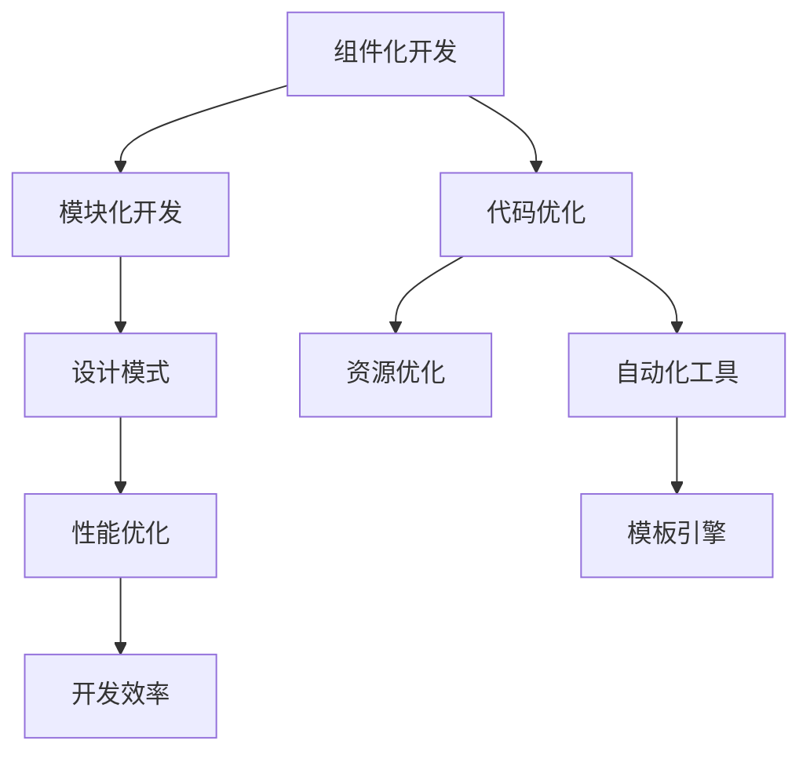

                 

# Android Jetpack：谷歌的 Android 开发套件

> 关键词：Android Jetpack, 谷歌, 移动应用开发, 组件化开发, 模块化开发, 性能优化, 开发效率

## 1. 背景介绍

在移动互联网时代，Android 平台凭借其庞大的用户基数和丰富的应用生态，已经成为移动应用开发的主流平台。然而，Android 应用的开发复杂度、维护成本以及性能优化等问题，一直是开发者面临的巨大挑战。为了帮助开发者更高效、更便捷地开发 Android 应用，谷歌于 2018 年推出了 Android Jetpack 开发套件，通过组件化和模块化开发，大幅提升了应用开发的效率和性能。

Android Jetpack 不仅仅是一个库的集合，更是一套完整的 Android 应用开发框架，涵盖了从代码组织、性能优化到工具支持等多个方面，旨在帮助开发者构建高质量的 Android 应用，并提供更好的开发体验。本文将系统介绍 Android Jetpack 的核心概念、关键技术以及实际应用场景，帮助开发者深入理解这一强大的开发工具。

## 2. 核心概念与联系

### 2.1 核心概念概述

Android Jetpack 提供了多种组件和模块，每个组件都旨在帮助开发者解决一个具体的开发问题，如布局管理、网络请求、存储管理等。这些组件和模块相互独立，可以根据实际需求进行组合，构成一个完整的应用系统。

**核心概念及其关联：**

1. **组件化开发**：将应用拆分为多个独立的组件，每个组件负责特定的功能，提高代码的可重用性和可维护性。

2. **模块化开发**：通过引入第三方库和组件，扩展应用功能，提升开发效率。

3. **设计模式**：如单例模式、观察者模式、依赖注入等，提升代码的可读性和可维护性。

4. **性能优化**：通过代码优化、资源优化和工具支持，提升应用的性能和用户体验。

5. **开发效率**：通过代码生成、模板引擎和自动化工具，减少开发者手写代码的负担，提升开发效率。

### 2.2 核心概念原理和架构的 Mermaid 流程图



这个流程图展示了 Android Jetpack 的核心概念之间的联系：组件化开发是基础，模块化开发、设计模式、性能优化和开发效率在此基础上进一步提升。通过代码优化、资源优化和自动化工具等手段，进一步提升应用的性能和开发效率。

## 3. 核心算法原理 & 具体操作步骤

### 3.1 算法原理概述

Android Jetpack 的核心算法原理主要基于组件化开发和模块化开发，通过将应用拆分为多个独立的组件和模块，每个组件负责特定的功能，从而提高代码的可重用性和可维护性。

在实际应用中，开发者可以根据需要选择合适的组件和模块，构建一个完整的应用系统。这些组件和模块之间通过依赖关系和接口进行通信，形成一个灵活、可扩展的架构体系。

### 3.2 算法步骤详解

Android Jetpack 的开发流程主要包括以下几个关键步骤：

1. **需求分析与组件划分**：根据应用需求，将应用划分为多个独立的组件，每个组件负责特定的功能，如用户界面、业务逻辑、数据管理等。

2. **选择合适的组件和模块**：从 Android Jetpack 提供的组件和模块中，选择合适的组件和模块，构建应用系统。

3. **组件和模块的依赖关系**：定义组件和模块之间的依赖关系，通过依赖注入等技术实现组件之间的通信。

4. **实现组件和模块的功能**：根据需求，实现每个组件和模块的功能。

5. **性能优化和调试**：通过代码优化、资源优化和工具支持，提升应用的性能和用户体验。

6. **发布与维护**：将构建好的应用发布到应用商店，并进行持续的维护和更新。

### 3.3 算法优缺点

Android Jetpack 的主要优点包括：

1. **提升开发效率**：通过组件化和模块化开发，降低开发门槛，提升开发效率。

2. **提高可维护性**：组件化和模块化开发使得代码结构清晰，便于维护和扩展。

3. **提升性能和用户体验**：通过代码优化、资源优化等手段，提升应用的性能和用户体验。

4. **提供全面的开发支持**：Android Jetpack 提供了丰富的组件和模块，涵盖从布局管理、网络请求到存储管理等多个方面，全面支持应用开发。

然而，Android Jetpack 也存在一些缺点：

1. **学习成本较高**：需要开发者熟悉 Android Jetpack 的组件和模块，理解其设计原理和使用方式。

2. **组件间耦合度较高**：如果组件设计不当，可能会影响应用的整体性能和稳定性。

3. **更新和维护成本较高**：随着组件和模块的不断更新和优化，开发者需要不断跟进，更新应用代码。

### 3.4 算法应用领域

Android Jetpack 广泛应用于各种类型的 Android 应用开发中，包括但不限于：

1. **移动应用**：如即时通讯、社交网络、电商应用等。

2. **游戏应用**：如休闲游戏、动作游戏、角色扮演游戏等。

3. **企业应用**：如企业门户、移动办公、ERP 系统等。

4. **物联网应用**：如智能家居、可穿戴设备等。

5. **增强现实应用**：如 AR 游戏、AR 导航等。

通过 Android Jetpack 的组件和模块，开发者可以更加高效、便捷地开发 Android 应用，提升应用的质量和用户体验。

## 4. 数学模型和公式 & 详细讲解 & 举例说明

### 4.1 数学模型构建

Android Jetpack 的开发模型主要基于组件化开发和模块化开发，通过将应用拆分为多个独立的组件和模块，每个组件负责特定的功能。这种模型结构可以抽象为有向无环图（DAG），其中每个组件和模块作为一个节点，组件之间的依赖关系作为有向边。

### 4.2 公式推导过程

假设应用被划分为 $n$ 个组件和 $m$ 个模块，组件之间的依赖关系可以表示为一个有向图 $G=(V,E)$，其中 $V$ 为节点集，$E$ 为边集。每个节点表示一个组件或模块，每条边表示组件之间的依赖关系。

在实际应用中，组件之间的依赖关系可以是单向的或双向的，因此可以采用有向无环图（DAG）或有向图（DAG）+ 反馈边（Feedback Loop）的模型。这种模型结构可以表示为：

$$
G=(V,E) \\
E = \{(x,y) | x \rightarrow y, x \in V, y \in V \} \\
$$

其中，$x$ 和 $y$ 分别表示组件和模块，$\rightarrow$ 表示依赖关系。

### 4.3 案例分析与讲解

以下以一个简单的 Android 应用为例，展示 Android Jetpack 的开发模型：

假设应用包含一个用户界面组件、一个业务逻辑组件和一个数据管理组件。这三个组件之间的依赖关系如下：

- 用户界面组件依赖于业务逻辑组件，用于显示业务逻辑组件的处理结果。
- 业务逻辑组件依赖于数据管理组件，用于从数据管理组件获取数据，并处理数据。
- 数据管理组件依赖于业务逻辑组件，用于存储和加载数据。

可以将其抽象为一个有向图，如下所示：

```
G=(V,E) \\
V = \{\text{UI}, \text{Logic}, \text{Data}\} \\
E = \{(\text{UI}, \text{Logic}), (\text{Logic}, \text{Data}), (\text{Data}, \text{Logic})\}
```

在这个模型中，每个组件和模块作为一个节点，组件之间的依赖关系作为有向边。通过这种模型结构，开发者可以更加清晰地理解应用的结构和功能，提高开发效率和可维护性。

## 5. 项目实践：代码实例和详细解释说明

### 5.1 开发环境搭建

Android Jetpack 的开发环境搭建主要包括以下几个步骤：

1. **安装 Android Studio**：从官网下载并安装 Android Studio，是最主要的 Android 开发工具。

2. **安装 Android SDK**：在 Android Studio 中安装所需的 Android SDK，包括 SDK 组件、系统图像、模拟器等。

3. **配置项目依赖**：在项目中添加所需的依赖库和组件，如 Retrofit、Retrofit 等，支持网络请求功能。

4. **配置调试工具**：配置 Logcat、Chrome 调试工具等，方便调试应用。

### 5.2 源代码详细实现

以下是一个简单的 Android Jetpack 项目示例，展示如何使用组件和模块构建一个完整的应用系统。

```java
package com.example.myapp;

import android.os.Bundle;
import androidx.appcompat.app.AppCompatActivity;
import androidx.appcompat.widget.Toolbar;

public class MainActivity extends AppCompatActivity {

    @Override
    protected void onCreate(Bundle savedInstanceState) {
        super.onCreate(savedInstanceState);
        setContentView(R.layout.activity_main);

        Toolbar toolbar = findViewById(R.id.toolbar);
        setSupportActionBar(toolbar);
        getSupportActionBar().setDisplayHomeAsUpEnabled(true);
    }
}
```

### 5.3 代码解读与分析

这段代码展示了如何使用 Android Jetpack 的 Activity 和 Toolbar 组件构建一个简单的应用。其中，Activity 组件用于管理应用的生命周期和用户界面，Toolbar 组件用于显示应用的标题栏。

### 5.4 运行结果展示

运行上述代码，将展示一个简单的应用界面，包括一个标题栏和一个布局。

## 6. 实际应用场景

### 6.1 移动应用开发

Android Jetpack 在移动应用开发中得到了广泛应用，通过组件化和模块化开发，开发者可以更加高效、便捷地开发各种类型的移动应用，包括即时通讯、社交网络、电商应用等。

### 6.2 游戏应用开发

Android Jetpack 在游戏应用开发中也发挥着重要作用，通过组件化和模块化开发，开发者可以更加高效地实现游戏逻辑、渲染和物理模拟等功能。

### 6.3 企业应用开发

Android Jetpack 在企业应用开发中同样具有广泛的应用，通过组件化和模块化开发，开发者可以更加高效地实现企业门户、移动办公、ERP 系统等功能。

### 6.4 未来应用展望

随着 Android Jetpack 的不断发展和优化，未来将会有更多的组件和模块被引入，进一步提升 Android 应用的开发效率和性能。同时，Android Jetpack 还将支持更多的跨平台开发技术，如 Kotlin 语言和 Jetpack Compose 等，帮助开发者构建更加现代化、高效的应用系统。

## 7. 工具和资源推荐

### 7.1 学习资源推荐

为了帮助开发者深入理解 Android Jetpack 的开发模型和实践方法，以下是一些优质的学习资源：

1. **Android Jetpack 官方文档**：Android Jetpack 的官方文档提供了详细的组件和模块介绍，是开发者学习 Android Jetpack 的最佳资源。

2. **Android 开发者博客**：Android 官方博客提供了大量的开发教程和示例代码，帮助开发者深入理解 Android Jetpack 的使用方法和最佳实践。

3. **《Android Jetpack 实战》书籍**：该书系统介绍了 Android Jetpack 的组件和模块，并提供了大量的示例代码，帮助开发者掌握 Android Jetpack 的开发技巧。

4. **《Android Jetpack 深度解析》视频课程**：YouTube 上提供了大量的 Android Jetpack 开发教程，帮助开发者深入理解 Android Jetpack 的开发模型和实践方法。

### 7.2 开发工具推荐

为了帮助开发者更加高效地开发 Android 应用，以下是一些常用的开发工具：

1. **Android Studio**：Android Studio 是 Android 开发的主要工具，提供了丰富的开发功能和可视化界面。

2. **Gradle**：Gradle 是 Android 项目的构建工具，支持自动化构建、测试和部署。

3. **Retrofit**：Retrofit 是 Android 的 HTTP 客户端库，支持基于注解的 RESTful API 开发。

4. **Room**：Room 是 Android 的数据访问库，支持 SQL 和 ORM 技术，用于管理本地数据。

5. **Espresso**：Espresso 是 Android 的测试框架，用于编写自动化测试用例。

6. **JUnit**：JUnit 是 Android 的测试框架，支持单元测试和集成测试。

### 7.3 相关论文推荐

Android Jetpack 的开发模型和技术架构引发了诸多研究关注，以下是几篇相关的论文，推荐阅读：

1. **"Component-Based Development for Android Applications"**：探讨 Android Jetpack 组件化开发的优势和实现方法。

2. **"Model-Driven Development with Android Jetpack"**：介绍 Android Jetpack 模块化开发的设计原理和实践方法。

3. **"Performance Optimization in Android Jetpack Applications"**：探讨 Android Jetpack 应用性能优化的策略和技术。

4. **"Android Jetpack: The Future of Android Development"**：分析 Android Jetpack 在 Android 开发中的应用前景和未来发展方向。

## 8. 总结：未来发展趋势与挑战

### 8.1 研究成果总结

本文系统介绍了 Android Jetpack 的开发模型和实践方法，帮助开发者深入理解 Android Jetpack 的核心概念和技术原理，并展示了 Android Jetpack 在实际应用中的广泛应用。通过组件化和模块化开发，开发者可以更加高效、便捷地构建高质量的 Android 应用，提升应用的质量和用户体验。

### 8.2 未来发展趋势

未来，Android Jetpack 将继续发展和优化，引入更多的组件和模块，提升应用开发的效率和性能。同时，Android Jetpack 还将支持更多的跨平台开发技术，如 Kotlin 语言和 Jetpack Compose 等，帮助开发者构建更加现代化、高效的应用系统。

### 8.3 面临的挑战

尽管 Android Jetpack 提供了许多组件和模块，帮助开发者提高开发效率，但仍面临一些挑战：

1. **组件之间的耦合度较高**：组件之间的依赖关系需要合理设计，避免出现依赖链过长、复杂度高的问题。

2. **组件的性能优化**：组件之间的通信和数据传递可能会影响应用的性能，需要合理设计组件之间的接口和数据结构。

3. **组件的兼容性**：不同版本和平台之间的兼容性问题，需要开发者在开发过程中注意版本和平台兼容性。

### 8.4 研究展望

未来的研究需要在以下几个方面寻求新的突破：

1. **组件的解耦设计**：通过组件解耦设计，降低组件之间的依赖关系，提升应用的灵活性和可维护性。

2. **组件的性能优化**：通过组件性能优化，提升组件之间的通信和数据传递效率，降低应用性能瓶颈。

3. **组件的跨平台支持**：通过引入跨平台开发技术，如 Kotlin 语言和 Jetpack Compose，提升组件的跨平台兼容性和开发效率。

4. **组件的自动化生成**：通过自动化工具生成组件代码，减少开发者手写代码的负担，提升开发效率。

5. **组件的可扩展性**：通过组件的可扩展设计，支持动态加载和扩展组件功能，提升应用的灵活性和可维护性。

总之，Android Jetpack 将继续引领 Android 应用的开发方向，提升应用的质量和用户体验。开发者需要不断学习 Android Jetpack 的组件和模块，掌握其设计原理和使用方式，才能更好地构建高质量的 Android 应用。

## 9. 附录：常见问题与解答

**Q1：Android Jetpack 组件和模块的选择标准是什么？**

A: Android Jetpack 组件和模块的选择主要基于以下标准：

1. **功能需求**：选择符合应用需求的功能模块，避免重复开发。

2. **性能要求**：选择性能最优的组件和模块，提升应用的性能和用户体验。

3. **开发效率**：选择易于使用、易于维护的组件和模块，提升开发效率。

4. **兼容性**：选择兼容性良好的组件和模块，避免平台和版本兼容性问题。

5. **社区支持**：选择有良好社区支持和文档的组件和模块，便于获取帮助和资源。

**Q2：Android Jetpack 组件和模块之间的依赖关系如何管理？**

A: Android Jetpack 组件和模块之间的依赖关系可以通过 Gradle 依赖管理工具进行管理。通过 Gradle 的依赖管理，可以方便地添加、更新和删除组件和模块，确保组件和模块之间的版本兼容性。

**Q3：Android Jetpack 组件和模块的性能如何优化？**

A: Android Jetpack 组件和模块的性能优化主要包括以下几个方面：

1. **数据传递优化**：通过减少数据传递量、优化数据结构等手段，提升组件之间的通信效率。

2. **异步处理**：通过异步处理、线程池等方式，避免阻塞主线程，提升应用的响应速度。

3. **缓存优化**：通过缓存机制，避免重复计算和数据加载，提升应用性能。

**Q4：Android Jetpack 组件和模块的可扩展性如何实现？**

A: Android Jetpack 组件和模块的可扩展性主要通过以下几个方式实现：

1. **接口设计**：通过接口设计，实现组件之间的松耦合，支持动态加载和扩展组件功能。

2. **插件机制**：通过插件机制，支持动态加载和扩展组件功能，提升应用的灵活性和可维护性。

3. **模块化设计**：通过模块化设计，实现组件功能的独立和可扩展，提升应用的灵活性和可维护性。

---

作者：禅与计算机程序设计艺术 / Zen and the Art of Computer Programming

