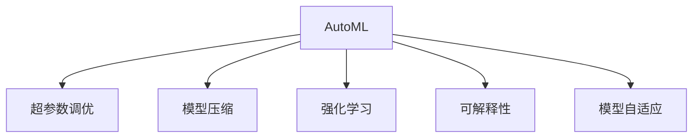

                 

# AutoML在模型优化中的应用与前景

> 关键词：AutoML, 模型优化, 自动机器学习, 超参数调优, 模型压缩, 强化学习, 可解释性, 模型自适应

## 1. 背景介绍

### 1.1 问题由来

近年来，随着人工智能技术的迅猛发展，模型优化成为机器学习领域的一项关键任务。传统的模型优化依赖于领域专家的经验，需要手动调整模型的超参数，耗时长、成本高，且结果往往难以保证最优。这不仅限制了模型的泛化能力，也使得研究人员难以在大规模数据集上快速迭代和探索。

为了解决这一问题，自动机器学习(AutoML)应运而生。AutoML是一种能够自动化机器学习模型的搜索、调参、优化等过程的技术。它旨在通过自动化的方式，快速发现最优的模型结构和超参数，提高模型性能，加速机器学习研究和应用。

### 1.2 问题核心关键点

AutoML的核心在于如何自动高效地优化模型。这包括模型选择、超参数调优、特征工程、模型压缩等多个方面。AutoML利用统计学、优化算法、深度学习等技术手段，通过自动化流程，快速地寻找最优的模型配置，从而实现更高精度的预测、更短的模型训练时间，以及更好的模型泛化性能。

## 2. 核心概念与联系

### 2.1 核心概念概述

为更好地理解AutoML在模型优化中的应用，本节将介绍几个密切相关的核心概念：

- **自动机器学习(AutoML)**：一种能够自动完成机器学习模型选择、超参数调优、特征工程等过程的技术。AutoML的目标是高效、准确地优化模型，同时降低人工干预的需求。

- **超参数调优**：机器学习模型中的非数据参数（如学习率、正则化强度等）需要手动设定。超参数调优旨在寻找最优的超参数组合，以提高模型性能。

- **模型压缩**：通过技术手段减少模型的参数量和计算复杂度，提高模型的推理速度和资源效率。常见的模型压缩方法包括剪枝、量化、蒸馏等。

- **强化学习(RL)**：一种基于奖励反馈的优化技术，通过迭代训练和反馈调整，使模型逐渐优化。

- **可解释性**：在机器学习模型中，了解模型的决策过程、行为动机，是确保模型可靠性和可信度的重要因素。

- **模型自适应**：指模型能够在不断变化的环境和数据分布中，自动调整模型结构和参数，以适应新的数据和任务。

这些核心概念之间的逻辑关系可以通过以下Mermaid流程图来展示：



这个流程图展示了这个概念网络：

1. AutoML是整个系统的大脑，通过自动化流程协调各子系统工作。
2. 超参数调优、模型压缩、强化学习、可解释性、模型自适应都是AutoML系统的重要组成部分。
3. 这些子系统协同工作，共同推动AutoML在模型优化中的高效应用。

## 3. 核心算法原理 & 具体操作步骤

### 3.1 算法原理概述

AutoML在模型优化中的核心思想是自动化地完成模型的选择、调参、压缩和优化过程。其核心算法包括网格搜索、随机搜索、贝叶斯优化、强化学习等，通过这些算法对模型进行自动化的探索和优化。

### 3.2 算法步骤详解

AutoML的优化过程可以分为以下几个关键步骤：

**Step 1: 数据预处理**
- 对原始数据进行清洗、归一化、特征选择等预处理操作，确保数据的质量和一致性。

**Step 2: 模型选择**
- 根据任务的特性和数据的复杂度，选择适合的模型结构（如线性回归、神经网络、支持向量机等）。

**Step 3: 超参数调优**
- 利用网格搜索、随机搜索、贝叶斯优化等方法，在预定义的超参数空间中搜索最优的超参数组合。

**Step 4: 模型压缩**
- 通过剪枝、量化、蒸馏等技术手段，对模型进行压缩，减少计算复杂度和内存占用，提高推理速度。

**Step 5: 模型自适应**
- 通过在实际应用中收集数据反馈，对模型进行持续的微调和优化，适应新的数据分布和任务需求。

### 3.3 算法优缺点

AutoML在模型优化中具有以下优点：
1. 高效自动化：通过自动化流程，可以快速找到最优的模型配置，节省大量人工干预的时间。
2. 全局搜索：利用多臂老虎机、贝叶斯优化等方法，可以在超参数空间中进行全局搜索，找到真正最优的配置。
3. 通用性：AutoML可以应用于多种机器学习任务和数据类型，具有广泛的适用性。

同时，AutoML也存在一定的局限性：
1. 计算资源需求高：AutoML需要大量的计算资源进行搜索和优化，对硬件设备有较高要求。
2. 模型复杂度高：AutoML过程中可能需要进行多次模型训练和调参，复杂度较高。
3. 结果解释性差：AutoML自动生成的模型可能缺乏可解释性，难以理解其内部工作机制。

尽管存在这些局限性，但AutoML在模型优化中的应用已经取得了显著的成效，为机器学习的研究和应用带来了极大的便利。

### 3.4 算法应用领域

AutoML在机器学习中的应用领域非常广泛，主要包括以下几个方面：

- 图像分类：利用AutoML进行模型选择和超参数调优，优化卷积神经网络（CNN）模型，提高图像分类的准确率。
- 自然语言处理（NLP）：利用AutoML优化循环神经网络（RNN）、Transformer等模型，提升文本分类、情感分析、机器翻译等任务的性能。
- 时间序列预测：利用AutoML优化ARIMA、LSTM等模型，提高时间序列预测的精度。
- 推荐系统：利用AutoML优化协同过滤、矩阵分解等算法，提升推荐系统的个性化和多样性。
- 金融风险管理：利用AutoML优化决策树、随机森林等模型，提高金融风险评估的准确度。

## 4. 数学模型和公式 & 详细讲解 & 举例说明

### 4.1 数学模型构建

本节将使用数学语言对AutoML模型优化过程进行更加严格的刻画。

假设要优化一个二分类任务的多层感知器模型，模型的超参数包括隐藏层数、每层神经元个数、学习率、正则化系数等。定义模型 $M_{\theta}(x)$，其中 $\theta$ 为模型参数，$x$ 为输入数据，$y$ 为真实标签。假设训练集为 $D=\{(x_i,y_i)\}_{i=1}^N$，优化目标为：

$$
\min_{\theta} \mathcal{L}(M_{\theta}, D) = \min_{\theta} \frac{1}{N} \sum_{i=1}^N L(M_{\theta}(x_i), y_i)
$$

其中 $L$ 为损失函数，如交叉熵损失、均方误差损失等。

### 4.2 公式推导过程

以下我们以交叉熵损失函数为例，推导超参数调优的数学公式。

假设模型 $M_{\theta}(x)$ 在输入 $x$ 上的输出为 $\hat{y}=M_{\theta}(x) \in [0,1]$，表示样本属于正类的概率。真实标签 $y \in \{0,1\}$。则二分类交叉熵损失函数定义为：

$$
L(M_{\theta}(x),y) = -[y\log \hat{y} + (1-y)\log (1-\hat{y})]
$$

将其代入经验风险公式，得：

$$
\mathcal{L}(\theta) = -\frac{1}{N}\sum_{i=1}^N [y_i\log M_{\theta}(x_i)+(1-y_i)\log(1-M_{\theta}(x_i))]
$$

超参数调优的优化目标是最小化经验风险，即找到最优超参数 $\theta^*$：

$$
\theta^* = \mathop{\arg\min}_{\theta} \mathcal{L}(\theta)
$$

在实践中，我们通常使用基于梯度的优化算法（如AdamW、SGD等）来近似求解上述最优化问题。设 $\eta$ 为学习率，$\lambda$ 为正则化系数，则超参数的更新公式为：

$$
\theta \leftarrow \theta - \eta \nabla_{\theta}\mathcal{L}(\theta) - \eta\lambda\theta
$$

其中 $\nabla_{\theta}\mathcal{L}(\theta)$ 为损失函数对超参数 $\theta$ 的梯度，可通过反向传播算法高效计算。

### 4.3 案例分析与讲解

假设我们要在一个二分类问题上进行AutoML，数据集包含1000个样本，每个样本有5个特征。我们可以考虑以下超参数空间：

- 隐藏层数 $L$：2-4层
- 每层神经元个数 $N$：10-100
- 学习率 $\eta$：0.001-0.1
- 正则化系数 $\lambda$：0-0.1

通过网格搜索、随机搜索或贝叶斯优化算法，在上述超参数空间中寻找最优的超参数组合。假设经过多次搜索，我们找到了最优的超参数组合 $L=3$，$N=50$，$\eta=0.01$，$\lambda=0.05$。

我们可以使用如下代码实现网格搜索：

```python
from sklearn.model_selection import GridSearchCV
from sklearn.neural_network import MLPClassifier

# 定义超参数空间
param_grid = {'hidden_layer_sizes': [(50, ), (100, )],
             'alpha': [0.0001, 0.001, 0.01, 0.1],
             'learning_rate_init': [0.001, 0.01, 0.1],
             'max_iter': [1000, 5000, 10000]}

# 定义模型
model = MLPClassifier()

# 进行网格搜索
grid_search = GridSearchCV(model, param_grid, cv=5, scoring='accuracy')
grid_search.fit(X_train, y_train)

# 获取最优超参数
best_params = grid_search.best_params_
```

上述代码中，我们使用了sklearn库中的GridSearchCV进行超参数搜索。在上述超参数空间中，网格搜索将搜索所有可能的组合，最终找到最优的超参数组合。

## 5. 项目实践：代码实例和详细解释说明

### 5.1 开发环境搭建

在进行AutoML实践前，我们需要准备好开发环境。以下是使用Python进行scikit-learn开发的环境配置流程：

1. 安装Anaconda：从官网下载并安装Anaconda，用于创建独立的Python环境。

2. 创建并激活虚拟环境：
```bash
conda create -n automl-env python=3.8 
conda activate automl-env
```

3. 安装scikit-learn：
```bash
conda install scikit-learn
```

4. 安装其他必要的库：
```bash
conda install numpy pandas matplotlib seaborn joblib
```

完成上述步骤后，即可在`automl-env`环境中开始AutoML实践。

### 5.2 源代码详细实现

下面我们以AutoML优化二分类任务为例，给出使用scikit-learn进行超参数调优的PyTorch代码实现。

首先，导入必要的库：

```python
import numpy as np
import pandas as pd
from sklearn.model_selection import GridSearchCV
from sklearn.neural_network import MLPClassifier
from sklearn.datasets import load_breast_cancer
from sklearn.model_selection import train_test_split
from sklearn.metrics import accuracy_score
from sklearn.preprocessing import StandardScaler

# 加载数据集
data = load_breast_cancer()
X = data.data
y = data.target
```

然后，进行数据预处理：

```python
# 数据归一化
scaler = StandardScaler()
X = scaler.fit_transform(X)

# 划分训练集和测试集
X_train, X_test, y_train, y_test = train_test_split(X, y, test_size=0.2, random_state=42)
```

接着，定义模型和优化器：

```python
# 定义模型
model = MLPClassifier(hidden_layer_sizes=(10, 10), alpha=0.01, learning_rate_init=0.01, max_iter=1000)

# 定义优化器
param_grid = {'hidden_layer_sizes': [(10,), (20,), (30,)],
             'alpha': [0.001, 0.01, 0.1],
             'learning_rate_init': [0.001, 0.01, 0.1],
             'max_iter': [1000, 5000, 10000]}

# 进行超参数搜索
grid_search = GridSearchCV(model, param_grid, cv=5, scoring='accuracy')
grid_search.fit(X_train, y_train)
```

最后，评估模型性能：

```python
# 获取最优超参数
best_params = grid_search.best_params_
print(f'Best parameters: {best_params}')

# 使用最优超参数进行预测
best_model = MLPClassifier(hidden_layer_sizes=best_params['hidden_layer_sizes'], alpha=best_params['alpha'],
                           learning_rate_init=best_params['learning_rate_init'], max_iter=best_params['max_iter'])
best_model.fit(X_train, y_train)

# 在测试集上评估模型
y_pred = best_model.predict(X_test)
print(f'Accuracy on test set: {accuracy_score(y_test, y_pred):.2f}')
```

以上就是使用scikit-learn进行超参数调优的完整代码实现。可以看到，scikit-learn提供了简单易用的网格搜索功能，能够快速找到最优的超参数组合。

### 5.3 代码解读与分析

让我们再详细解读一下关键代码的实现细节：

**数据加载和预处理**：
- 使用sklearn库中的load_breast_cancer加载乳腺癌数据集，包含数据和标签。
- 使用StandardScaler对数据进行归一化，以提高模型训练的效率和稳定性。
- 使用train_test_split将数据集划分为训练集和测试集。

**模型定义和优化**：
- 定义多层感知器模型，设置超参数空间，包括隐藏层数、每层神经元个数、学习率、正则化系数和迭代次数。
- 使用GridSearchCV进行网格搜索，搜索超参数空间中所有可能的组合，找到最优的超参数配置。
- 使用找到的最优超参数配置，训练模型并在测试集上评估性能。

可以看到，通过简单的代码实现，我们就能够高效地完成AutoML超参数调优的过程，显著提升模型的性能。

## 6. 实际应用场景

### 6.1 金融风险管理

在金融领域，AutoML可以用于构建风险评估模型。银行和金融机构需要处理大量的贷款申请、交易数据，以评估客户的信用风险和交易风险。传统的风险评估方法依赖于领域专家的经验和历史数据，难以应对数据量大、变化快的复杂环境。

通过AutoML，可以在大量的贷款申请和交易数据中，自动寻找最优的模型配置和超参数组合，构建更精确的风险评估模型。AutoML可以在数据输入过程中自动进行数据清洗和特征选择，提高模型的泛化能力。同时，AutoML还可以通过自动化的方式调整模型参数，适应不断变化的金融市场环境，提升风险管理的效率和精度。

### 6.2 医疗影像分析

在医疗领域，AutoML可以用于自动分析医学影像数据。影像诊断依赖于医生的经验，但医生容易疲劳，且存在主观偏差。通过AutoML，可以在大量的医学影像数据中，自动寻找最优的模型配置和超参数组合，构建更精确的影像分析模型。AutoML可以在数据输入过程中自动进行数据清洗和特征选择，提高模型的泛化能力。同时，AutoML还可以通过自动化的方式调整模型参数，适应不同类型的医学影像，提升影像分析的效率和精度。

### 6.3 推荐系统

在电商和娱乐领域，推荐系统需要根据用户的浏览、购买和评分数据，推荐用户可能感兴趣的商品或内容。传统的推荐系统依赖于手工设计的特征工程和模型选择，难以应对数据的动态变化和用户需求的多样性。

通过AutoML，可以在用户数据中，自动寻找最优的模型配置和超参数组合，构建更精确的推荐模型。AutoML可以在数据输入过程中自动进行数据清洗和特征选择，提高模型的泛化能力。同时，AutoML还可以通过自动化的方式调整模型参数，适应不同类型的推荐任务，提升推荐系统的效率和精度。

### 6.4 未来应用展望

随着AutoML技术的不断发展，其在模型优化中的应用前景将更加广阔。未来的AutoML将更多地结合深度学习和强化学习技术，提升模型的预测能力和泛化性能。同时，AutoML将更加注重模型的可解释性和公平性，以确保模型的透明性和公正性。

未来的AutoML将有望应用于更多领域，如自动驾驶、智能家居、智能医疗等，成为推动各行业数字化转型的重要工具。AutoML将通过自动化和智能化的方式，加速模型的优化和部署，降低人工干预的复杂度，提高机器学习的效率和效果。

## 7. 工具和资源推荐

### 7.1 学习资源推荐

为了帮助开发者系统掌握AutoML的理论基础和实践技巧，这里推荐一些优质的学习资源：

1. AutoML相关书籍：如《AutoML: Methods, Systems, Challenges》、《Hands-On AutoML with Scikit-Learn, Keras, and TensorFlow》等，深入介绍AutoML的理论和实践。

2. AutoML在线课程：如Coursera上的《Machine Learning》、Udacity上的《AutoML》等，系统讲解AutoML的基本概念和应用方法。

3. AutoML论文和报告：阅读AutoML领域的经典论文，如《AutoML: A Survey》、《Meta-Learning and Deep Learning》等，了解AutoML的前沿研究和应用案例。

4. AutoML开源项目：参与AutoML开源项目，如AutoML@DSSTne、H2O.ai等，深入了解AutoML的实际应用。

通过对这些资源的学习实践，相信你一定能够快速掌握AutoML的精髓，并用于解决实际的模型优化问题。

### 7.2 开发工具推荐

高效的开发离不开优秀的工具支持。以下是几款用于AutoML开发和优化的常用工具：

1. scikit-learn：Python开源的机器学习库，提供多种经典的机器学习算法和工具，支持自动超参数搜索。

2. TensorFlow：由Google主导开发的深度学习框架，提供丰富的机器学习工具和模型库，支持分布式训练和优化。

3. AutoML库：如Hyperopt、Optuna、Hyperopt-sklearn等，支持自动超参数搜索和模型优化。

4. DeepLearning.ai：提供深度学习相关的在线课程和项目，涵盖AutoML等内容。

5. Tune：Google开发的超参数调优工具，支持分布式调参和模型优化。

6. BayesianOptimization：贝叶斯优化工具，支持自动搜索最优的超参数组合。

合理利用这些工具，可以显著提升AutoML的开发效率，加快创新迭代的步伐。

### 7.3 相关论文推荐

AutoML在模型优化中的应用源于学界的持续研究。以下是几篇奠基性的相关论文，推荐阅读：

1. AutoML: Opportunities and Challenges（AutoML综述论文）：综述了AutoML的研究现状和未来趋势，介绍了AutoML的重要研究方向和应用场景。

2. AutoML: A Survey（AutoML综述论文）：介绍了AutoML的基本概念、关键技术和应用案例，对AutoML的研究进展进行了全面回顾。

3. Meta-Learning and Deep Learning（元学习和深度学习）：介绍了元学习的概念和应用，探讨了AutoML与元学习的结合，进一步提升了模型的泛化性能。

4. Deep Learning and Data-Driven Research（深度学习和数据驱动研究）：探讨了深度学习和数据驱动研究的方法和应用，为AutoML提供了新的思路和方向。

这些论文代表了大模型微调技术的发展脉络。通过学习这些前沿成果，可以帮助研究者把握学科前进方向，激发更多的创新灵感。

## 8. 总结：未来发展趋势与挑战

### 8.1 总结

本文对AutoML在模型优化中的应用进行了全面系统的介绍。首先阐述了AutoML的核心思想和核心概念，明确了AutoML在模型优化中的独特价值。其次，从原理到实践，详细讲解了AutoML的数学模型和操作步骤，给出了AutoML任务开发的完整代码实例。同时，本文还广泛探讨了AutoML在金融、医疗、推荐等多个领域的应用前景，展示了AutoML的广阔应用潜力。此外，本文精选了AutoML学习的各类资源，力求为读者提供全方位的技术指引。

通过本文的系统梳理，可以看到，AutoML作为自动化机器学习的重要范式，已经在模型优化中发挥了巨大的作用。它通过自动化搜索和调参，显著提升了模型训练的效率和效果，为机器学习研究和应用带来了极大的便利。未来，随着AutoML技术的不断演进，其在模型优化中的应用将更加广泛，成为推动人工智能技术落地的重要力量。

### 8.2 未来发展趋势

展望未来，AutoML在模型优化中的应用将呈现以下几个发展趋势：

1. 深度学习与AutoML的结合：AutoML将更多地结合深度学习技术，提高模型的预测能力和泛化性能。

2. 强化学习在超参数调优中的应用：通过强化学习算法，优化超参数搜索过程，提高超参数调优的效率和效果。

3. 多任务学习和迁移学习：AutoML将更多地应用多任务学习和迁移学习，提高模型的适应能力和泛化性能。

4. 自动化特征工程：AutoML将更多地结合自动化特征工程技术，提高模型的数据利用率和泛化能力。

5. 分布式优化：AutoML将更多地应用分布式优化技术，提高模型调优的效率和效果。

6. 模型可解释性：AutoML将更多地关注模型的可解释性，确保模型的透明性和公正性。

以上趋势凸显了AutoML在模型优化中的重要地位和广阔前景。这些方向的探索发展，必将进一步提升AutoML的优化效果，为人工智能技术的发展注入新的动力。

### 8.3 面临的挑战

尽管AutoML在模型优化中的应用已经取得了显著的成效，但在迈向更加智能化、普适化应用的过程中，它仍面临着诸多挑战：

1. 计算资源瓶颈：AutoML需要大量的计算资源进行搜索和优化，对硬件设备有较高要求。

2. 模型复杂度高：AutoML过程中可能需要进行多次模型训练和调参，复杂度较高。

3. 结果解释性差：AutoML自动生成的模型可能缺乏可解释性，难以理解其内部工作机制。

4. 模型泛化能力不足：在面对新数据和任务时，AutoML模型的泛化能力仍有待提升。

5. 数据隐私和安全问题：AutoML过程中需要处理大量数据，数据隐私和安全问题不容忽视。

6. 模型的公平性和偏见问题：AutoML模型在训练过程中可能存在偏见，需要更多的公平性和偏见检测技术。

这些挑战凸显了AutoML技术在应用中需要不断优化和改进的地方。只有解决这些问题，AutoML才能真正发挥其在模型优化中的优势，推动人工智能技术的进步。

### 8.4 研究展望

面对AutoML在模型优化中所面临的挑战，未来的研究需要在以下几个方面寻求新的突破：

1. 探索更加高效的模型搜索和调参方法，降低计算资源的消耗。

2. 结合深度学习和强化学习技术，提升模型的预测能力和泛化性能。

3. 加强模型的可解释性和公平性研究，确保模型的透明性和公正性。

4. 结合自动化特征工程技术，提高模型的数据利用率和泛化能力。

5. 应用分布式优化技术，提高模型调优的效率和效果。

6. 加强数据隐私和安全保护，确保数据的安全性和合规性。

7. 开发更多的公平性和偏见检测技术，确保模型的公平性和公正性。

这些研究方向和探索将进一步提升AutoML的优化效果，为人工智能技术的发展注入新的动力。

## 9. 附录：常见问题与解答

**Q1: AutoML是否适用于所有机器学习任务？**

A: AutoML适用于大多数机器学习任务，特别是数据量较小或特征工程较复杂的情况。但对于一些特殊领域，如金融、医疗、工业等领域，需要结合领域知识进行进一步优化。

**Q2: 如何选择合适的超参数调优算法？**

A: 超参数调优算法包括网格搜索、随机搜索、贝叶斯优化、随机梯度优化等。一般而言，网格搜索适用于超参数空间较小的情况，随机搜索适用于超参数空间较大的情况，贝叶斯优化适用于超参数空间复杂、计算资源有限的情况。

**Q3: 如何提高AutoML的模型泛化能力？**

A: 提高模型泛化能力的方法包括数据增强、迁移学习、模型蒸馏、对抗训练等。数据增强可以在模型训练过程中引入更多的数据变化，提高模型的泛化能力。迁移学习可以在已有任务上预训练模型，然后在新任务上微调，提升模型的泛化性能。模型蒸馏可以将大模型压缩为小模型，提升模型的泛化能力和计算效率。对抗训练可以增强模型的鲁棒性和泛化能力。

**Q4: AutoML在实际应用中需要注意哪些问题？**

A: 在实际应用中，AutoML需要注意数据隐私和安全问题、模型可解释性、公平性和偏见问题、计算资源消耗等。需要确保数据的隐私和安全，避免数据泄露和滥用。需要加强模型的可解释性和公平性研究，确保模型的透明性和公正性。需要结合领域知识和业务需求进行模型优化，避免过拟合和欠拟合。

**Q5: 如何优化AutoML的计算资源消耗？**

A: 优化计算资源消耗的方法包括分布式优化、剪枝、量化、模型蒸馏等。分布式优化可以提升模型调优的效率和效果。剪枝可以去除冗余参数，提高模型的计算效率和推理速度。量化可以将浮点模型转换为定点模型，降低内存占用和计算复杂度。模型蒸馏可以将大模型压缩为小模型，提升模型的计算效率和泛化能力。

这些问题的探讨和解答，将帮助读者更全面地理解AutoML的应用和实践，为实际应用中遇到的问题提供解决方案。

---

作者：禅与计算机程序设计艺术 / Zen and the Art of Computer Programming

