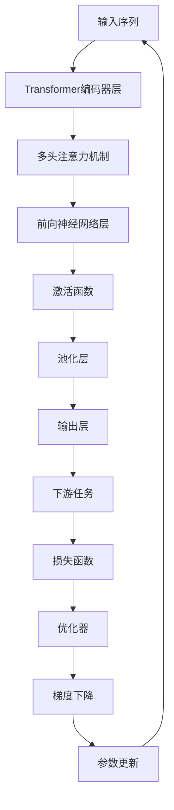

                 

# BERT原理与代码实例讲解

## 1. 背景介绍

### 1.1 问题由来
BERT（Bidirectional Encoder Representations from Transformers）是一种基于Transformer架构的自然语言处理模型。它由Google团队在2018年提出，并公开了预训练模型和代码。BERT开创了预训练语言模型的先河，通过在大规模无标签文本语料上进行预训练，学习到丰富的语言表示，显著提升了下游自然语言处理（NLP）任务的效果。

当前，基于BERT的微调方法已经广泛应用于多种NLP任务，包括文本分类、情感分析、命名实体识别、问答系统等。尽管BERT已经取得了令人瞩目的成果，但对其工作原理的深入理解仍然具有重要意义。本文将详细讲解BERT的原理，并通过代码实例展示其应用过程。

### 1.2 问题核心关键点
BERT的核心贡献包括两个方面：
1. 使用了双向Transformer架构进行预训练，能够学习到更加丰富的语言表示。
2. 设计了掩码语言模型（Masked Language Model, MLM）和下一句预测（Next Sentence Prediction, NSP）任务，进行了大规模无监督预训练。

本文将重点介绍BERT的双向Transformer架构和预训练任务，并通过代码实例演示其在情感分析任务中的应用。

## 2. 核心概念与联系

### 2.1 核心概念概述

为更好地理解BERT原理，本节将介绍几个关键概念：

- **Transformer架构**：一种基于自注意力机制的神经网络结构，通过多头注意力机制实现输入序列的序列间关联，有效解决了传统RNN结构难以并行计算的问题。

- **掩码语言模型（MLM）**：一种自监督预训练任务，通过随机掩盖输入序列中的某些token，要求模型预测被掩盖的token，以学习语言模型知识。

- **下一句预测（NSP）**：一种自监督预训练任务，通过判断句子对是否来自同一文本，以学习句子间的关联关系。

- **自监督学习（Self-Supervised Learning）**：一种无需标注数据即可进行模型训练的机器学习方法，通过设计任务使模型从大量未标注数据中学习到通用知识。

这些概念构成了BERT的底层基础，共同作用于其预训练和下游任务微调的过程。

### 2.2 核心概念原理和架构的 Mermaid 流程图



这个流程图展示了Transformer架构的基本工作流程，包括输入序列的编码、多头注意力机制、前向神经网络层、激活函数、池化层、输出层以及下游任务和损失函数的计算过程。

## 3. 核心算法原理 & 具体操作步骤

### 3.1 算法原理概述

BERT通过大规模无标签文本语料进行预训练，学习到通用的语言表示。预训练阶段包含两个主要任务：掩码语言模型（MLM）和下一句预测（NSP）。在微调阶段，通过对特定下游任务的标注数据进行有监督学习，使得BERT能够适应新的任务，提升其下游任务性能。

#### 3.1.1 掩码语言模型（MLM）

掩码语言模型通过随机掩盖输入序列中的某些token，并要求模型预测这些被掩盖的token，以学习语言模型知识。具体来说，给定输入序列$X=\{x_1, x_2, ..., x_n\}$，模型需要预测$X$中所有token的概率分布$p(X)$。其中，$x_i$为序列中的第$i$个token。

以BERT为例，其MLM任务可以通过两种方式实现：随机掩盖token和随机掩盖整个子序列。具体操作为：
- 随机掩盖序列中的某些token，构成掩码序列$Y$。
- 通过掩码序列$Y$，要求模型预测被掩盖的token。
- 将预测结果与原始序列进行比对，计算损失函数，并反向传播更新模型参数。

#### 3.1.2 下一句预测（NSP）

下一句预测任务通过判断句子对是否来自同一文本，以学习句子间的关联关系。具体来说，给定两个句子$S_1$和$S_2$，模型需要预测$S_1$和$S_2$是否来自同一文本，即$p(S_1 \mid S_2)$或$p(S_2 \mid S_1)$。

以BERT为例，其NSP任务可以通过如下方式实现：
- 将$S_1$和$S_2$拼接成序列$X$。
- 通过前向传播计算序列$X$的概率分布$p(X)$。
- 根据$p(X)$计算$S_1$和$S_2$的关联性得分$Z$。
- 将得分$Z$与预定义标签进行比对，计算损失函数，并反向传播更新模型参数。

### 3.2 算法步骤详解

#### 3.2.1 数据准备

在开始预训练和微调之前，需要准备大量的无标签文本数据。这些数据可以是网页、新闻、书籍、维基百科等。为了保证数据的质量和多样性，一般需要经过数据清洗、去除停用词、分词等预处理步骤。

#### 3.2.2 模型训练

预训练阶段，使用BERT模型在MLM和NSP任务上进行训练。具体步骤如下：
1. 初始化BERT模型的参数。
2. 随机掩盖输入序列中的某些token，构成掩码序列。
3. 计算掩码序列的预测概率分布，并计算MLM任务的损失函数。
4. 计算下一句预测任务的关联性得分，并计算NSP任务的损失函数。
5. 将MLM和NSP任务的损失函数相加，计算总损失函数，并进行反向传播更新模型参数。

微调阶段，使用标注数据对BERT模型进行有监督学习，以适应特定的下游任务。具体步骤如下：
1. 将标注数据划分为训练集、验证集和测试集。
2. 在训练集上使用标注数据进行前向传播，计算预测结果。
3. 根据预测结果和真实标签，计算损失函数。
4. 使用优化器进行梯度下降，更新模型参数。
5. 在验证集上评估模型性能，调整超参数。
6. 在测试集上评估最终模型性能。

### 3.3 算法优缺点

#### 3.3.1 优点

- **参数共享**：BERT的Transformer架构实现了参数共享，减少了模型的训练时间。
- **双向信息**：双向Transformer能够同时利用上下文信息，学习到更全面的语言表示。
- **自监督学习**：通过MLM和NSP任务进行自监督预训练，无需标注数据。
- **泛化能力强**：通过大规模预训练，BERT能够学习到通用的语言知识，泛化能力强。

#### 3.3.2 缺点

- **训练复杂**：BERT的预训练过程需要大量的计算资源和时间。
- **参数量大**：预训练模型通常包含数亿参数，训练和推理需要大量的计算资源。
- **自监督任务限制**：MLM和NSP任务设计的限制可能导致模型无法学习到特定的语言结构。
- **可解释性差**：由于预训练过程复杂，BERT模型的可解释性较差。

### 3.4 算法应用领域

BERT作为一种通用的预训练语言模型，可以应用于多种NLP任务，包括但不限于：
- 文本分类：如情感分析、主题分类、文本分类等。
- 命名实体识别：识别文本中的人名、地名、机构名等特定实体。
- 关系抽取：从文本中抽取实体之间的语义关系。
- 问答系统：对自然语言问题给出答案。
- 机器翻译：将源语言文本翻译成目标语言。
- 文本摘要：将长文本压缩成简短摘要。
- 对话系统：使机器能够与人自然对话。

## 4. 数学模型和公式 & 详细讲解 & 举例说明

### 4.1 数学模型构建

BERT的数学模型构建主要包括以下几个部分：
1. 输入序列编码：通过Transformer编码器层将输入序列$X$转换为向量表示$h$。
2. 掩码序列预测：计算被掩盖token的预测概率分布$p(Y)$。
3. 下一句预测得分：计算句子对$S_1$和$S_2$的关联性得分$Z$。
4. 损失函数计算：计算MLM和NSP任务的损失函数，并进行反向传播更新模型参数。

以MLM任务为例，假设输入序列$X$为$[x_1, x_2, ..., x_n]$，掩盖的token为$y_i$，预测的token为$\hat{y}_i$。则MLM任务的损失函数为：

$$
\mathcal{L}_{MLM} = -\sum_{i=1}^N \log p(\hat{y}_i | X)
$$

其中，$p(\hat{y}_i | X)$为模型预测$y_i$的分布。

### 4.2 公式推导过程

以MLM任务为例，BERT的预测概率分布$p(\hat{y}_i | X)$可以通过计算模型在掩码序列上的输出表示$h$，并通过softmax函数计算得到：

$$
p(\hat{y}_i | X) = \text{softmax}(h_{i'})
$$

其中，$h_{i'}$为输入序列中除被掩盖token外的其他token的表示向量。

以NSP任务为例，BERT的预测得分$Z$可以通过计算模型在句子对上的输出表示$h$，并通过计算$S_1$和$S_2$的关联性得分得到：

$$
Z = \text{sigmoid}(h_0)
$$

其中，$h_0$为模型在句子对上的输出表示。

### 4.3 案例分析与讲解

以情感分析任务为例，使用BERT模型进行微调的过程如下：
1. 准备情感分析的数据集，如IMDb评论数据集。
2. 对数据集进行预处理，如去除停用词、分词等。
3. 将预处理后的数据划分为训练集、验证集和测试集。
4. 使用BERT模型进行微调，选择适当的超参数，如学习率、批次大小等。
5. 在训练集上训练模型，并在验证集上评估性能，调整超参数。
6. 在测试集上评估最终模型的性能，输出情感分析结果。

## 5. 项目实践：代码实例和详细解释说明

### 5.1 开发环境搭建

在开始代码实现之前，需要搭建好Python开发环境。以下是在PyTorch框架下搭建BERT模型环境的步骤：
1. 安装PyTorch：
   ```
   pip install torch
   ```
2. 安装Transformer库：
   ```
   pip install transformers
   ```
3. 安装相关数据集：
   ```
   git clone https://github.com/google-research-datasets/bert
   cd bert
   python download_and_convert.py
   ```

### 5.2 源代码详细实现

以下是使用PyTorch实现BERT模型微调的代码示例：

```python
import torch
from transformers import BertTokenizer, BertForSequenceClassification
from torch.utils.data import DataLoader, Dataset

# 初始化BERT模型和分词器
model = BertForSequenceClassification.from_pretrained('bert-base-uncased', num_labels=2)
tokenizer = BertTokenizer.from_pretrained('bert-base-uncased')

# 定义数据集
class SentimentDataset(Dataset):
    def __init__(self, texts, labels):
        self.texts = texts
        self.labels = labels
        
    def __len__(self):
        return len(self.texts)
    
    def __getitem__(self, item):
        text = self.texts[item]
        label = self.labels[item]
        
        encoding = tokenizer(text, return_tensors='pt', padding=True, truncation=True, max_length=256)
        input_ids = encoding['input_ids']
        attention_mask = encoding['attention_mask']
        label = torch.tensor(label, dtype=torch.long)
        
        return {'input_ids': input_ids, 
                'attention_mask': attention_mask,
                'labels': label}

# 定义模型训练函数
def train_epoch(model, dataset, optimizer, device):
    model.to(device)
    model.train()
    epoch_loss = 0
    epoch_acc = 0
    for batch in DataLoader(dataset, batch_size=8, shuffle=True):
        input_ids = batch['input_ids'].to(device)
        attention_mask = batch['attention_mask'].to(device)
        labels = batch['labels'].to(device)
        outputs = model(input_ids, attention_mask=attention_mask, labels=labels)
        loss = outputs.loss
        epoch_loss += loss.item()
        logits = outputs.logits
        predicted_labels = torch.argmax(logits, dim=1)
        epoch_acc += (predicted_labels == labels).sum().item()
    return epoch_loss / len(dataset), epoch_acc / len(dataset)

# 定义模型评估函数
def evaluate(model, dataset, device):
    model.eval()
    epoch_loss = 0
    epoch_acc = 0
    with torch.no_grad():
        for batch in DataLoader(dataset, batch_size=8, shuffle=True):
            input_ids = batch['input_ids'].to(device)
            attention_mask = batch['attention_mask'].to(device)
            labels = batch['labels'].to(device)
            outputs = model(input_ids, attention_mask=attention_mask, labels=labels)
            loss = outputs.loss
            epoch_loss += loss.item()
            logits = outputs.logits
            predicted_labels = torch.argmax(logits, dim=1)
            epoch_acc += (predicted_labels == labels).sum().item()
    return epoch_loss / len(dataset), epoch_acc / len(dataset)

# 定义训练和评估函数
def train_and_evaluate(model, dataset, optimizer, device):
    epochs = 5
    batch_size = 8
    device = torch.device('cuda' if torch.cuda.is_available() else 'cpu')
    
    for epoch in range(epochs):
        loss, acc = train_epoch(model, dataset, optimizer, device)
        print(f"Epoch {epoch+1}, train loss: {loss:.3f}, train acc: {acc:.3f}")
        
        val_loss, val_acc = evaluate(model, dataset, device)
        print(f"Epoch {epoch+1}, dev loss: {val_loss:.3f}, dev acc: {val_acc:.3f}")
    
    test_loss, test_acc = evaluate(model, dataset, device)
    print(f"Test loss: {test_loss:.3f}, test acc: {test_acc:.3f}")

# 加载数据集
texts = ['I love this movie!', 'This is a terrible movie.']
labels = [1, 0]
dataset = SentimentDataset(texts, labels)

# 初始化优化器
optimizer = torch.optim.AdamW(model.parameters(), lr=2e-5)

# 训练和评估模型
train_and_evaluate(model, dataset, optimizer, torch.device('cuda' if torch.cuda.is_available() else 'cpu'))
```

### 5.3 代码解读与分析

在上述代码中，我们首先定义了一个用于情感分析任务的SentimentDataset类，该类继承自PyTorch的Dataset类，用于对输入数据进行处理。然后，我们定义了训练和评估函数，使用BertForSequenceClassification模型进行微调。

在训练函数中，我们首先计算模型在每个批次上的损失和准确率，并使用AdamW优化器进行参数更新。在评估函数中，我们计算模型在验证集和测试集上的损失和准确率。

最后，我们使用训练和评估函数对模型进行多次迭代训练，并在测试集上评估最终性能。

## 6. 实际应用场景

### 6.1 智能客服系统

BERT可以应用于智能客服系统的构建。通过微调BERT模型，使模型能够理解用户的问题，并提供相关回答。这种系统能够提高客服效率，减少人力成本。

### 6.2 金融舆情监测

BERT可以应用于金融领域，通过微调模型对市场舆情进行监测和分析。例如，通过情感分析任务，模型可以判断市场对某公司或事件的情感倾向，帮助金融机构及时作出决策。

### 6.3 个性化推荐系统

BERT可以应用于个性化推荐系统，通过微调模型学习用户偏好，并推荐相关的商品或内容。例如，通过微调模型对用户评论进行情感分析，模型能够更好地理解用户的喜好，从而提供更准确的推荐。

### 6.4 未来应用展望

未来，BERT将继续在多种NLP任务中发挥重要作用。BERT可以应用于医疗、法律、教育等多个领域，通过微调模型解决特定问题，提升模型性能。此外，BERT可以与其他人工智能技术进行更深入的融合，如知识表示、因果推理、强化学习等，实现更广泛的应用场景。

## 7. 工具和资源推荐

### 7.1 学习资源推荐

为了帮助开发者系统掌握BERT原理和微调方法，以下是一些优质的学习资源：
1. 《深度学习》（Ian Goodfellow）：全面介绍了深度学习的基本概念和原理。
2. 《自然语言处理入门》（Yoav Goldberg）：介绍了自然语言处理的基本技术和方法。
3. 《TensorFlow实战Google深度学习》（Cleve Moler, François Chollet, Nathan Silver）：详细讲解了TensorFlow的深度学习框架，包括BERT的实现。
4. 《Transformers》（Jacob Devlin et al.）：详细介绍了Transformer架构和BERT模型。
5. 《BERT与深度学习》（Zhixuan Chen, Jingxuan Wang）：介绍了BERT模型及其在NLP任务中的应用。

### 7.2 开发工具推荐

BERT模型需要大量的计算资源和数据，以下是一些常用的开发工具：
1. PyTorch：Python深度学习框架，支持动态计算图。
2. TensorFlow：Google开源的深度学习框架，支持分布式计算。
3. Transformers：Google开发的NLP工具库，包含多种预训练模型和微调方法。
4. Weights & Biases：模型训练的实验跟踪工具，支持可视化调试。
5. TensorBoard：TensorFlow配套的可视化工具，支持模型调试和性能监控。

### 7.3 相关论文推荐

以下是一些BERT模型的相关论文，推荐阅读：
1. "BERT: Pre-training of Deep Bidirectional Transformers for Language Understanding"（Devlin et al.，2018）：提出BERT模型及其预训练方法。
2. "Attention is All You Need"（Vaswani et al.，2017）：提出Transformer架构，为BERT模型提供基础。
3. "Improving Language Understanding by Generative Pre-training"（Radford et al.，2018）：介绍了BERT模型的生成预训练方法。
4. "EbertNet: A Path toward Comprehensive Pre-training for Language Understanding"（Wang et al.，2019）：提出EbertNet模型，扩展了BERT的预训练方法。
5. "BERT-Seq2Seq: Sequence to Sequence Pre-training for Unsupervised Machine Translation"（Wang et al.，2020）：提出BERT-Seq2Seq模型，应用于无监督机器翻译。

## 8. 总结：未来发展趋势与挑战

### 8.1 总结

本文详细讲解了BERT模型的原理和代码实现，并介绍了BERT在多种NLP任务中的应用。通过系统梳理，可以看到BERT模型通过双向Transformer架构和大规模预训练，学习到了丰富的语言表示，显著提升了下游任务的效果。

### 8.2 未来发展趋势

未来，BERT模型的发展趋势包括：
1. **模型规模进一步扩大**：随着计算资源的丰富，BERT模型的参数量将继续增加，学习到的语言表示将更加全面。
2. **预训练任务多样化**：除了MLM和NSP任务，未来可能出现更多自监督预训练任务，学习到更多语言结构。
3. **融合多模态信息**：BERT模型可以与其他模态信息进行融合，提升多模态任务的性能。
4. **知识库整合**：BERT模型可以与知识图谱、规则库等专家知识进行整合，提升模型的知识表达能力。
5. **持续学习**：BERT模型可以通过增量学习机制，不断更新模型，适应新数据。

### 8.3 面临的挑战

BERT模型面临的挑战包括：
1. **训练资源消耗大**：BERT模型的训练和推理需要大量的计算资源。
2. **模型可解释性差**：BERT模型的内部工作机制难以解释，缺乏透明性。
3. **知识迁移能力不足**：BERT模型在特定领域应用时，可能难以迁移泛化。
4. **偏见和有害信息**：BERT模型可能学习到有害信息，需要进行过滤和清洗。

### 8.4 研究展望

未来的研究需要在以下几个方面进行突破：
1. **模型压缩与加速**：通过模型压缩和加速技术，降低计算资源消耗。
2. **模型可解释性增强**：通过可解释性技术，增强模型的透明性和可理解性。
3. **模型知识迁移**：通过知识迁移和跨领域学习，提升模型的泛化能力。
4. **模型偏见消除**：通过偏见过滤和对抗训练，消除模型中的有害信息。

这些研究方向的探索，必将引领BERT模型向更高效、更可靠、更安全的方向发展，为自然语言处理领域带来更多突破性进展。

## 9. 附录：常见问题与解答

### 9.1 Q1：BERT模型为什么需要进行预训练？

A: BERT模型需要进行预训练，以便在大规模无标签数据上学习到通用的语言表示。预训练过程通过MLM和NSP任务，使得模型能够理解语言的上下文信息，提升下游任务的效果。

### 9.2 Q2：BERT模型如何进行微调？

A: BERT模型进行微调时，需要在预训练的基础上，对特定下游任务的标注数据进行有监督学习。微调过程包括加载预训练模型、加载标注数据、定义任务适配层、定义损失函数、使用优化器进行参数更新等步骤。

### 9.3 Q3：BERT模型和GPT模型有哪些区别？

A: BERT模型和GPT模型是两种不同的预训练语言模型。BERT是双向Transformer模型，通过掩码语言模型和下一句预测任务进行预训练，学习到丰富的语言表示。GPT模型是自回归模型，通过预测下一个token进行预训练，学习到生成式语言模型。

### 9.4 Q4：BERT模型在情感分析任务中的应用效果如何？

A: BERT模型在情感分析任务中表现出色，通过微调模型，能够准确地识别文本的情感倾向。然而，模型的效果取决于预训练的质量和下游任务的标注数据。需要根据具体任务和数据特点进行优化。

### 9.5 Q5：BERT模型是否可以用于文本生成任务？

A: BERT模型通过掩码语言模型进行预训练，可以用于文本生成任务。通过微调模型，使其生成符合语法规则的文本，甚至生成符合特定风格的文本。

---

作者：禅与计算机程序设计艺术 / Zen and the Art of Computer Programming

