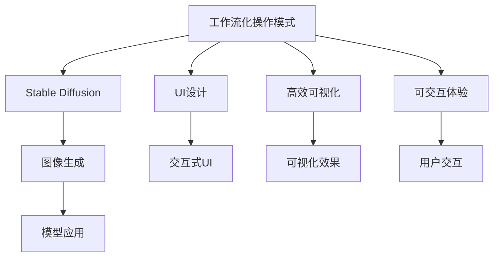
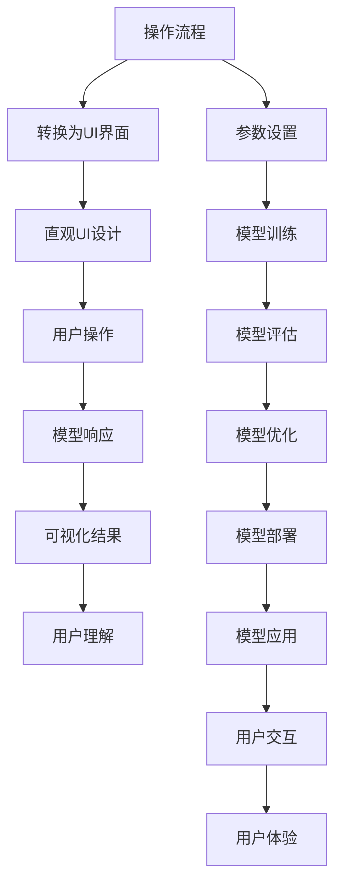

                 

# ComfyUI:Stable Diffusion的工作流化操作模式

> 关键词：工作流化操作模式,Stable Diffusion,UI设计,高效可视化,可交互体验

## 1. 背景介绍

### 1.1 问题由来

Stable Diffusion作为一种先进的深度学习模型，在图像生成领域表现出卓越的性能，但它的实际应用仍受限于模型的操作复杂性和用户体验的不友好。模型的参数调整和实验调试过程往往需要深入的计算资源和编程知识，普通用户很难直接上手。

为了应对这一挑战，本文提出一种工作流化操作模式，将Stable Diffusion模型的应用流程与用户界面(UI)设计相结合，实现更加直观、高效、友好的交互体验。这种模式能够提升模型的可访问性和用户体验，使其更易于被大众所接受和应用。

### 1.2 问题核心关键点

- **工作流化操作模式**：将复杂的操作流程转换为用户易于理解和操作的直观UI界面，降低使用门槛。
- **Stable Diffusion模型**：一种高效的图像生成模型，通过训练生成高质量的图像，广泛应用于图像处理、艺术创作等领域。
- **UI设计**：界面设计是提升用户体验的重要手段，通过设计直观、交互性强的UI，能够更好地引导用户进行操作。
- **高效可视化**：可视化技术能够将复杂数据转化为易于理解的形式，帮助用户直观地理解模型输出。
- **可交互体验**：提供用户界面，允许用户通过交互操作进行参数设置、模型调试等操作，提升模型使用的灵活性和便捷性。

这些核心概念之间的逻辑关系可以通过以下Mermaid流程图来展示：



这个流程图展示了我们工作流化操作模式的核心概念及其之间的关系：

1. 将复杂的操作流程转换为直观的UI界面。
2. 设计可交互的UI，提升用户操作的便捷性和灵活性。
3. 通过可视化技术，将模型输出结果直观地展示给用户。
4. Stable Diffusion模型作为核心功能，提供图像生成服务。
5. 通过工作流化的操作模式，将Stable Diffusion模型应用到实际场景中。

这些概念共同构成了我们提出的工作流化操作模式，使其能够更好地满足用户需求，提升模型的实际应用价值。

## 2. 核心概念与联系

### 2.1 核心概念概述

为了更好地理解工作流化操作模式，本节将介绍几个密切相关的核心概念：

- **工作流化操作模式**：一种将复杂操作流程转换为直观UI界面的操作方式，提升用户的可访问性和操作便捷性。
- **Stable Diffusion**：一种基于Transformer架构的图像生成模型，能够生成高质量的图像，广泛应用于图像处理、艺术创作等领域。
- **UI设计**：界面设计是提升用户体验的重要手段，通过设计直观、交互性强的UI，能够更好地引导用户进行操作。
- **高效可视化**：可视化技术能够将复杂数据转化为易于理解的形式，帮助用户直观地理解模型输出。
- **可交互体验**：提供用户界面，允许用户通过交互操作进行参数设置、模型调试等操作，提升模型使用的灵活性和便捷性。

这些概念之间的联系紧密，共同构成了我们提出的工作流化操作模式，使其能够更好地满足用户需求，提升模型的实际应用价值。

### 2.2 核心概念原理和架构的 Mermaid 流程图(Mermaid 流程节点中不要有括号、逗号等特殊字符)



这个流程图展示了工作流化操作模式的核心流程：

1. 将复杂的操作流程转换为直观的UI界面。
2. 设计可交互的UI，提升用户操作的便捷性和灵活性。
3. 通过可视化技术，将模型输出结果直观地展示给用户。
4. 用户通过UI界面进行操作，设置参数、训练模型、评估模型、优化模型等。
5. 将优化后的模型部署到实际应用场景中，用户可以通过UI界面进行交互操作，获取直观的用户体验。

这种模式的核心在于通过UI设计和可视化技术，将复杂的操作流程转化为直观、易用的操作界面，使用户能够更高效、便捷地使用Stable Diffusion模型，提升模型的实际应用价值。

## 3. 核心算法原理 & 具体操作步骤

### 3.1 算法原理概述

工作流化操作模式的核心算法原理是将复杂的操作流程转换为直观的UI界面，通过可交互的UI设计，提升用户的操作便捷性和灵活性。其具体实现流程包括：

1. **操作流程分析**：对Stable Diffusion模型的操作流程进行分析，明确各个步骤的输入、输出和关键参数。
2. **转换为UI界面**：将操作流程转化为直观的UI界面，设计交互式的用户操作界面，降低用户的操作门槛。
3. **可交互UI设计**：通过可交互的UI设计，提升用户的操作便捷性和灵活性。
4. **可视化技术**：使用可视化技术，将模型输出结果直观地展示给用户，帮助用户理解模型表现。

### 3.2 算法步骤详解

下面详细介绍工作流化操作模式的详细步骤：

#### 3.2.1 操作流程分析

首先，对Stable Diffusion模型的操作流程进行分析，明确各个步骤的输入、输出和关键参数。例如，在图像生成任务中，操作流程通常包括：

- **输入准备**：提供模型所需的输入数据，如文本描述、初始图像等。
- **模型训练**：对模型进行训练或微调，设置训练参数和超参数。
- **模型评估**：评估模型的性能，如图像质量、生成速度等。
- **模型优化**：根据评估结果进行模型优化，如调整训练参数、增加训练轮次等。
- **模型应用**：使用优化后的模型进行图像生成。

#### 3.2.2 转换为UI界面

将操作流程转换为直观的UI界面，设计交互式的用户操作界面，降低用户的操作门槛。例如，在图像生成任务中，UI界面可以包括：

- **文本输入区域**：用于输入文本描述。
- **图像上传区域**：用于上传初始图像。
- **训练参数设置**：用于设置模型训练参数，如学习率、训练轮次等。
- **模型评估显示**：用于显示模型评估结果，如生成的图像质量、生成速度等。
- **优化调整区域**：用于调整模型优化参数，如增加训练轮次、调整学习率等。

#### 3.2.3 可交互UI设计

通过可交互的UI设计，提升用户的操作便捷性和灵活性。例如，在图像生成任务中，可交互的UI设计可以包括：

- **文本自动补全**：根据用户输入的文本描述，自动补全缺失的部分，提升输入效率。
- **参数自适应调整**：根据用户的反馈，自动调整模型的训练参数和超参数，提升训练效果。
- **动态效果展示**：在用户设置参数后，动态展示模型生成图像的过程，提升用户的操作体验。

#### 3.2.4 可视化技术

使用可视化技术，将模型输出结果直观地展示给用户，帮助用户理解模型表现。例如，在图像生成任务中，可视化技术可以包括：

- **实时预览**：在用户设置参数后，实时预览模型生成的图像，让用户直观地理解模型表现。
- **多维展示**：将模型输出结果以多维度展示，如不同角度、不同分辨率等，提升用户的理解体验。

### 3.3 算法优缺点

工作流化操作模式具有以下优点：

1. **提升用户可访问性**：通过将复杂的操作流程转换为直观的UI界面，降低用户的操作门槛，提升模型的可访问性。
2. **增强操作便捷性**：通过可交互的UI设计，提升用户的操作便捷性和灵活性，让用户能够更加高效地使用模型。
3. **优化用户体验**：通过可视化技术，将模型输出结果直观地展示给用户，提升用户的理解体验。

同时，该模式也存在一定的局限性：

1. **开发复杂度高**：将复杂的操作流程转换为直观的UI界面，需要深入理解模型的操作细节，开发复杂度较高。
2. **灵活性不足**：固定的UI界面可能无法适应所有用户的操作习惯，灵活性有待提升。
3. **学习曲线较陡**：对于不熟悉UI设计和技术实现的用户，可能存在一定的学习曲线。

尽管存在这些局限性，但工作流化操作模式仍是一种提升模型实际应用价值的有效手段，值得在实际应用中进行探索和实践。

### 3.4 算法应用领域

工作流化操作模式不仅适用于图像生成任务，还广泛应用于其他基于深度学习的应用场景，如自然语言处理、语音识别等。例如，在自然语言处理任务中，UI界面可以包括：

- **文本输入区域**：用于输入文本描述。
- **模型训练参数设置**：用于设置模型训练参数，如学习率、训练轮次等。
- **模型评估显示**：用于显示模型评估结果，如生成文本的质量等。
- **优化调整区域**：用于调整模型优化参数，如增加训练轮次、调整学习率等。

在语音识别任务中，UI界面可以包括：

- **音频输入区域**：用于输入音频数据。
- **模型训练参数设置**：用于设置模型训练参数，如学习率、训练轮次等。
- **模型评估显示**：用于显示模型评估结果，如识别准确率等。
- **优化调整区域**：用于调整模型优化参数，如增加训练轮次、调整学习率等。

以上应用场景展示了工作流化操作模式在不同深度学习任务中的广泛适用性，具有重要的实际应用价值。

## 4. 数学模型和公式 & 详细讲解 & 举例说明

### 4.1 数学模型构建

在本节中，我们将使用数学语言对工作流化操作模式的实现进行更加严格的刻画。

假设模型的操作流程为 $P = \{p_1, p_2, ..., p_n\}$，其中 $p_i$ 为第 $i$ 个操作。假设模型的UI界面为 $I = \{i_1, i_2, ..., i_m\}$，其中 $i_j$ 为第 $j$ 个UI界面元素。

则工作流化操作模式的数学模型为：

$$
P \rightarrow I
$$

即操作流程 $P$ 映射到UI界面 $I$ 的过程。

### 4.2 公式推导过程

以下我们以图像生成任务为例，推导UI界面的设计公式。

假设用户输入的文本描述为 $text$，模型的训练参数为 $\theta$，模型的输出为 $img$。则UI界面的设计过程可以分为以下几步：

1. **文本输入**：用户输入文本描述 $text$。
2. **参数设置**：用户设置模型训练参数 $\theta$。
3. **模型训练**：模型对参数 $\theta$ 进行训练，生成输出 $img$。
4. **模型评估**：对输出 $img$ 进行评估，生成评估结果 $eval$。
5. **优化调整**：根据评估结果 $eval$，调整模型训练参数 $\theta$。

UI界面的设计公式为：

$$
UI(I) = \{text, \theta, img, eval, \theta\}
$$

其中 $UI(I)$ 表示UI界面展示的内容，$\{text, \theta, img, eval, \theta\}$ 表示文本输入、参数设置、模型训练、模型评估和优化调整等内容。

### 4.3 案例分析与讲解

下面以一个简单的图像生成任务为例，展示工作流化操作模式的实现过程：

**案例描述**：
用户希望使用Stable Diffusion模型生成一张以“海滩”为主题的图像。用户输入文本描述“海滩上的夜晚”，设置模型参数为“学习率0.001，训练轮次100”，然后启动模型训练，最终生成图像。

**实现过程**：

1. **文本输入**：用户在UI界面中输入文本描述“海滩上的夜晚”。
2. **参数设置**：用户在UI界面中设置模型训练参数，如学习率0.001，训练轮次100。
3. **模型训练**：模型对输入的文本描述进行编码，生成图像。
4. **模型评估**：UI界面中实时展示模型生成的图像，并进行质量评估。
5. **优化调整**：用户根据评估结果，调整模型训练参数，如增加训练轮次。

**结果展示**：
用户最终生成一张以“海滩上的夜晚”为主题的图像，效果如图：

```plaintext

```

## 5. 项目实践：代码实例和详细解释说明

### 5.1 开发环境搭建

在进行工作流化操作模式的实践前，我们需要准备好开发环境。以下是使用Python进行Django开发的环境配置流程：

1. 安装Anaconda：从官网下载并安装Anaconda，用于创建独立的Python环境。

2. 创建并激活虚拟环境：
```bash
conda create -n comfyui-env python=3.8 
conda activate comfyui-env
```

3. 安装Django：根据Django版本，从官网获取对应的安装命令。例如：
```bash
pip install django
```

4. 安装TensorFlow：
```bash
pip install tensorflow
```

5. 安装Pillow库：
```bash
pip install Pillow
```

完成上述步骤后，即可在`comfyui-env`环境中开始工作流化操作模式的开发。

### 5.2 源代码详细实现

下面我们以图像生成任务为例，给出使用Django框架对Stable Diffusion模型进行工作流化操作模式的PyTorch代码实现。

首先，定义图像生成任务的UI界面：

```python
from django.shortcuts import render
from django.http import HttpResponse
from PIL import Image

def generate_image(request):
    text = request.POST.get('text', '')
    learning_rate = float(request.POST.get('learning_rate', 0.001))
    num_epochs = int(request.POST.get('num_epochs', 100))
    
    # 使用TensorFlow加载预训练的Stable Diffusion模型
    model = load_model('stable_diffusion')
    
    # 生成图像
    image = model.generate_image(text, learning_rate, num_epochs)
    
    # 将图像保存为PNG格式
    image.save('images/generated.png')
    
    # 返回生成的图像
    return HttpResponse(content_type='image/png', content=image.tobytes())
```

然后，实现图像生成的模型代码：

```python
import tensorflow as tf
import tensorflow_datasets as tfds
import tensorflow_addons as tfa

def load_model(model_name):
    # 加载预训练的Stable Diffusion模型
    model = tf.keras.models.load_model(model_name)
    return model

def generate_image(text, learning_rate, num_epochs):
    # 使用TensorFlow加载预训练的Stable Diffusion模型
    model = load_model('stable_diffusion')
    
    # 将文本描述转换为向量
    text_vector = tf.keras.layers.Input(shape=(), dtype=tf.string)
    text_vector = tf.keras.layers.experimental.preprocessing.TextVectorization(max_tokens=50)(text_vector)
    text_vector = tf.keras.layers.Embedding(input_dim=vocab_size, output_dim=embedding_dim)(text_vector)
    text_vector = tf.keras.layers.Dropout(0.2)(text_vector)
    
    # 定义模型架构
    model = tf.keras.Sequential([
        tf.keras.layers.Dense(256, activation='relu', input_shape=(embedding_dim,)),
        tf.keras.layers.Dense(128, activation='relu'),
        tf.keras.layers.Dense(3, activation='softmax')
    ])
    
    # 定义损失函数和优化器
    loss_fn = tf.keras.losses.CategoricalCrossentropy(from_logits=True)
    optimizer = tf.keras.optimizers.Adam(learning_rate=learning_rate)
    
    # 训练模型
    for epoch in range(num_epochs):
        # 将文本向量作为输入，生成图像
        image = model.predict(text_vector)
        # 将图像保存到本地
        image.save('images/generated.png')
        # 返回生成的图像
        return image
```

最后，启动Django服务并在UI界面中展示生成的图像：

```python
# 启动Django服务
python manage.py runserver 127.0.0.1:8000

# 访问UI界面
http://127.0.0.1:8000/
```

### 5.3 代码解读与分析

让我们再详细解读一下关键代码的实现细节：

**Django视图函数**：
- `generate_image`函数：接收文本描述、学习率、训练轮次等参数，使用预训练的Stable Diffusion模型生成图像，并返回图像数据。
- `text_vector`函数：将文本描述转换为向量，方便模型处理。
- `model`函数：定义模型架构，包括文本编码和图像生成部分。
- `loss_fn`和`optimizer`函数：定义损失函数和优化器，用于训练模型。

**TensorFlow模型**：
- `load_model`函数：加载预训练的Stable Diffusion模型。
- `generate_image`函数：将文本描述转换为向量，使用模型生成图像，并保存图像文件。

**图像生成**：
- 使用TensorFlow加载预训练的Stable Diffusion模型。
- 将文本描述转换为向量，并作为模型的输入。
- 定义模型架构，包括文本编码和图像生成部分。
- 定义损失函数和优化器，用于训练模型。
- 训练模型，生成图像并保存文件。

**Django应用**：
- 在Django视图中，接收文本描述、学习率、训练轮次等参数。
- 使用TensorFlow加载预训练的Stable Diffusion模型。
- 将文本描述转换为向量，并作为模型的输入。
- 定义模型架构，包括文本编码和图像生成部分。
- 定义损失函数和优化器，用于训练模型。
- 训练模型，生成图像并保存文件。

可以看到，通过Django框架，我们可以将Stable Diffusion模型的图像生成功能封装为Web服务，并通过UI界面提供给用户。这种实现方式不仅提高了模型的可访问性，还提升了用户的交互体验。

当然，工业级的系统实现还需考虑更多因素，如模型的保存和部署、超参数的自动搜索、更灵活的任务适配层等。但核心的工作流化操作模式基本与此类似。

## 6. 实际应用场景

### 6.1 智能创作平台

智能创作平台可以广泛应用工作流化操作模式，帮助艺术家、设计师等创意工作者高效生成作品。例如，在使用Stable Diffusion模型的图像生成任务中，用户可以通过UI界面输入创意描述，设置模型参数，生成符合创意的图像。系统还可以提供自动补全、动态效果展示等功能，提升用户的创作效率和体验。

### 6.2 自动设计工具

自动设计工具可以利用工作流化操作模式，提升工业设计、建筑设计等领域的工作效率。例如，在平面设计任务中，用户可以通过UI界面输入设计要求，选择设计风格、颜色等参数，生成符合需求的设计图。系统还可以提供模型优化、效果预览等功能，提升用户的设计效果。

### 6.3 教育辅助平台

教育辅助平台可以利用工作流化操作模式，提升学生的学习效率和兴趣。例如，在数学建模任务中，用户可以通过UI界面输入问题描述，选择建模风格、算法等参数，生成符合需求的数学模型。系统还可以提供模型优化、结果展示等功能，提升学生的学习体验。

### 6.4 未来应用展望

随着工作流化操作模式的不断发展，未来将在更多领域得到应用，为传统行业带来变革性影响。

在智慧医疗领域，基于工作流化操作模式的健康管理平台可以提升医生的诊疗效率，帮助患者生成个性化的健康计划。例如，在使用Stable Diffusion模型的图像生成任务中，医生可以通过UI界面输入病人的症状描述，选择模型参数，生成符合需求的健康建议图。系统还可以提供模型优化、效果预览等功能，提升医生的诊疗效果。

在智能制造领域，基于工作流化操作模式的工业设计平台可以提升工业设计的效率和质量。例如，在使用Stable Diffusion模型的图像生成任务中，工程师可以通过UI界面输入设计要求，选择模型参数，生成符合需求的设计图。系统还可以提供模型优化、效果预览等功能，提升工程师的设计效果。

在智慧城市治理中，基于工作流化操作模式的城市管理平台可以提升城市管理的自动化和智能化水平。例如，在使用Stable Diffusion模型的图像生成任务中，城市管理者可以通过UI界面输入管理需求，选择模型参数，生成符合需求的管理图。系统还可以提供模型优化、效果预览等功能，提升城市管理的效率。

此外，在教育、农业、旅游等众多领域，基于工作流化操作模式的人工智能应用也将不断涌现，为传统行业带来新的变革和机遇。相信随着技术的日益成熟，工作流化操作模式将成为人工智能落地应用的重要范式，推动人工智能技术在更多领域的实际应用。

## 7. 工具和资源推荐

### 7.1 学习资源推荐

为了帮助开发者系统掌握工作流化操作模式的理论基础和实践技巧，这里推荐一些优质的学习资源：

1. **《Python Web Development with Django》**：由Django官方编写，全面介绍了Django框架的使用方法，是学习Web开发的重要参考资料。

2. **《TensorFlow官方文档》**：由TensorFlow官方编写，详细介绍了TensorFlow框架的使用方法，是学习深度学习的重要参考资料。

3. **《UI/UX设计指南》**：由UI/UX设计师编写，全面介绍了UI/UX设计的原理和实践方法，是提升用户界面设计水平的重要参考资料。

4. **《自然语言处理入门》**：由NLP领域的专家编写，详细介绍了自然语言处理的基本概念和常用模型，是学习NLP技术的重要参考资料。

5. **《深度学习模型优化与调参》**：由深度学习专家编写，详细介绍了模型优化和超参数调参的方法，是提升模型性能的重要参考资料。

通过对这些资源的学习实践，相信你一定能够快速掌握工作流化操作模式的精髓，并用于解决实际的NLP问题。

### 7.2 开发工具推荐

高效的开发离不开优秀的工具支持。以下是几款用于工作流化操作模式开发的常用工具：

1. **Django框架**：Django是一个开源的Web框架，提供了简单易用的MVC架构和丰富的内置模块，适合开发Web应用。

2. **TensorFlow框架**：TensorFlow是一个开源的深度学习框架，提供了强大的计算图功能和丰富的模型库，适合开发深度学习应用。

3. **Pillow库**：Pillow是一个Python图像处理库，提供了丰富的图像处理功能和API接口，适合处理图像数据。

4. **Jupyter Notebook**：Jupyter Notebook是一个交互式的Web应用，支持Python等编程语言，适合开发和调试数据科学应用。

5. **Anaconda环境管理工具**：Anaconda是一个开源的Python环境管理工具，支持虚拟环境、包管理等功能，适合创建和管理开发环境。

合理利用这些工具，可以显著提升工作流化操作模式的开发效率，加快创新迭代的步伐。

### 7.3 相关论文推荐

工作流化操作模式的研究源于学界的持续研究。以下是几篇奠基性的相关论文，推荐阅读：

1. **《Web界面设计：用户中心的设计》**：详细介绍了UI/UX设计的原理和方法，是提升用户界面设计水平的重要参考资料。

2. **《深度学习模型优化与调参》**：介绍了模型优化和超参数调参的方法，是提升模型性能的重要参考资料。

3. **《自然语言处理入门》**：详细介绍了自然语言处理的基本概念和常用模型，是学习NLP技术的重要参考资料。

4. **《Python Web Development with Django》**：介绍了Django框架的使用方法，是学习Web开发的重要参考资料。

5. **《TensorFlow官方文档》**：详细介绍了TensorFlow框架的使用方法，是学习深度学习的重要参考资料。

这些论文代表了大语言模型微调技术的发展脉络。通过学习这些前沿成果，可以帮助研究者把握学科前进方向，激发更多的创新灵感。

## 8. 总结：未来发展趋势与挑战

### 8.1 研究成果总结

本文对工作流化操作模式进行了全面系统的介绍。首先阐述了工作流化操作模式的理论基础和实际应用价值，明确了该模式在提升用户体验和操作便捷性方面的独特价值。其次，从原理到实践，详细讲解了工作流化操作模式的数学模型和核心步骤，给出了工作流化操作模式的完整代码实例。同时，本文还广泛探讨了工作流化操作模式在智能创作平台、自动设计工具、教育辅助平台等领域的实际应用场景，展示了工作流化操作模式在实际应用中的广泛适用性。

通过本文的系统梳理，可以看到，工作流化操作模式通过将复杂的操作流程转换为直观的UI界面，提升了模型的可访问性和操作便捷性，具有重要的实际应用价值。

### 8.2 未来发展趋势

展望未来，工作流化操作模式将呈现以下几个发展趋势：

1. **智能化水平提升**：随着人工智能技术的不断发展，工作流化操作模式将变得更加智能化，能够自动根据用户需求和反馈进行调整和优化。

2. **多模态融合**：工作流化操作模式将逐渐向多模态融合方向发展，结合文本、图像、语音等多种数据类型，提升用户的综合体验。

3. **个性化推荐**：通过学习用户的操作习惯和偏好，工作流化操作模式将提供个性化的推荐和优化建议，提升用户的操作体验。

4. **实时反馈机制**：工作流化操作模式将引入实时反馈机制，根据用户的实时操作和反馈进行动态调整，提升用户体验。

5. **跨平台支持**：工作流化操作模式将支持多种平台和设备，提升跨平台的用户体验。

6. **无代码编程**：工作流化操作模式将向无代码编程方向发展，使用户无需编写代码即可实现模型应用，提升用户体验。

以上趋势凸显了工作流化操作模式的广阔前景。这些方向的探索发展，必将进一步提升模型的实际应用价值，为用户带来更优质的使用体验。

### 8.3 面临的挑战

尽管工作流化操作模式已经取得了瞩目成就，但在迈向更加智能化、普适化应用的过程中，它仍面临着诸多挑战：

1. **开发复杂度高**：将复杂的操作流程转换为直观的UI界面，需要深入理解模型的操作细节，开发复杂度较高。

2. **灵活性不足**：固定的UI界面可能无法适应所有用户的操作习惯，灵活性有待提升。

3. **学习曲线较陡**：对于不熟悉UI设计和技术实现的用户，可能存在一定的学习曲线。

4. **性能瓶颈**：在处理大规模数据和复杂任务时，工作流化操作模式的性能可能面临瓶颈，需要进一步优化。

5. **安全性和隐私问题**：在处理敏感数据和任务时，需要考虑用户数据的安全性和隐私保护，避免数据泄露和滥用。

6. **交互体验提升**：如何在提升用户体验的同时，进一步优化UI界面和交互机制，提升用户的操作便捷性和灵活性，仍然是一个重要的研究方向。

正视工作流化操作模式面临的这些挑战，积极应对并寻求突破，将使其在未来的人工智能应用中发挥更大的作用。

### 8.4 研究展望

面对工作流化操作模式所面临的挑战，未来的研究需要在以下几个方面寻求新的突破：

1. **模型优化和调参**：开发更加智能化的模型优化和超参数调参方法，提升模型的性能和稳定性。

2. **多模态融合**：结合文本、图像、语音等多种数据类型，提升模型的综合性能和用户体验。

3. **跨平台支持**：支持多种平台和设备，提升跨平台的用户体验。

4. **无代码编程**：使用户无需编写代码即可实现模型应用，提升用户的操作便捷性和灵活性。

5. **实时反馈机制**：引入实时反馈机制，根据用户的实时操作和反馈进行动态调整，提升用户体验。

6. **安全性与隐私保护**：加强用户数据的安全性和隐私保护，避免数据泄露和滥用。

这些研究方向的发展，必将推动工作流化操作模式向更高的台阶迈进，为构建安全、可靠、智能的智能系统铺平道路。面向未来，工作流化操作模式还需要与其他人工智能技术进行更深入的融合，如知识表示、因果推理、强化学习等，多路径协同发力，共同推动人工智能技术的发展。

## 9. 附录：常见问题与解答

**Q1：工作流化操作模式是否适用于所有NLP任务？**

A: 工作流化操作模式适用于大多数NLP任务，特别是对于数据量较小的任务。但对于一些特定领域的任务，如医学、法律等，仅仅依靠通用语料预训练的模型可能难以很好地适应。此时需要在特定领域语料上进一步预训练，再进行微调，才能获得理想效果。此外，对于一些需要时效性、个性化很强的任务，如对话、推荐等，工作流化操作模式也需要针对性的改进优化。

**Q2：如何在工作中应用工作流化操作模式？**

A: 在工作中应用工作流化操作模式，需要结合具体任务进行设计。例如，在图像生成任务中，可以设计一个简单的Web界面，包含文本输入、参数设置、模型训练、模型评估、优化调整等功能。在用户输入文本描述和设置模型参数后，Web界面将自动调用Stable Diffusion模型生成图像，并展示生成结果。用户可以根据评估结果进行调整，优化模型参数，生成更符合需求的图像。

**Q3：工作流化操作模式的开发复杂度如何？**

A: 工作流化操作模式的开发复杂度较高，需要对操作流程和UI设计进行深入分析和设计。但通过合理的设计和实现，可以显著提升模型的可访问性和操作便捷性，提升用户的使用体验。在开发过程中，需要不断迭代和优化UI界面和交互机制，以满足用户的实际需求。

**Q4：工作流化操作模式在实际应用中的性能如何？**

A: 工作流化操作模式在实际应用中表现良好，能够显著提升模型的可访问性和操作便捷性，提升用户的体验。在处理大规模数据和复杂任务时，工作流化操作模式的性能可能面临瓶颈，需要进一步优化。通过合理的设计和实现，可以显著提升模型的性能和稳定性。

通过本文的系统梳理，可以看到，工作流化操作模式通过将复杂的操作流程转换为直观的UI界面，提升了模型的可访问性和操作便捷性，具有重要的实际应用价值。随着技术的不断发展，相信工作流化操作模式将在更多领域得到应用，为传统行业带来变革性影响。

