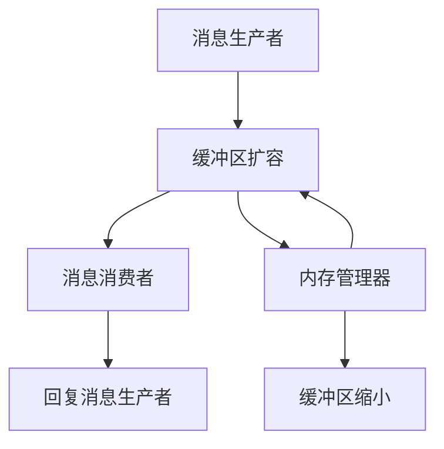

                 

# ConversationBufferMemory

> 关键词：ConversationBufferMemory, 消息缓冲区, 内存管理, 高并发系统, 消息传递, 线程安全, 系统优化

## 1. 背景介绍

在计算机科学中，消息缓冲区是一种常见的用于支持高并发系统中的消息传递机制。消息缓冲区通常是一段连续的内存空间，多个进程可以同时读写其中，以此实现进程间的通信。然而，在大规模系统中，如何高效地管理这些缓冲区，确保其线程安全和优化性能，成为了一个具有挑战性的问题。本文将深入探讨ConversationBufferMemory的概念、原理及其实现方法，并结合实际案例，展示其在高并发系统中的应用。

## 2. 核心概念与联系

### 2.1 核心概念概述

为了更好地理解ConversationBufferMemory，首先需要对以下几个核心概念进行简要介绍：

- **消息缓冲区(Message Buffer)**：用于存储消息的内存区域，可以理解为一段连续的内存空间，多个进程可以同时读写其中。

- **线程安全(Threadsafety)**：指同时访问某一资源的多个线程不会互相干扰，各自执行结果符合预期的属性。

- **系统优化(System Optimization)**：通过合理的算法和架构设计，提升系统的性能和资源利用率。

- **高并发系统(High-Concurrent System)**：指能同时处理大量并发请求的系统，常用于互联网服务、分布式计算等场景。

这些核心概念共同构成了ConversationBufferMemory的基础，使得其在高并发系统中得以高效应用。

### 2.2 核心概念原理和架构的 Mermaid 流程图



这个流程图展示了ConversationBufferMemory的基本架构和工作流程：

1. 消息生产者生成消息，并将消息写入缓冲区。
2. 消息缓冲区保存消息，供消费者读取。
3. 消息消费者从缓冲区中读取消息，并根据需求进行后续处理。
4. 内存管理器负责缓冲区的扩容和缩小，确保内存资源利用率最大化。

## 3. 核心算法原理 & 具体操作步骤

### 3.1 算法原理概述

ConversationBufferMemory的算法原理主要基于以下几个关键点：

- **读写锁(Read-Write Lock)**：通过读写锁控制多个线程对缓冲区的读写操作，确保线程安全。
- **消息队列(Message Queue)**：利用消息队列实现消息的先进先出，确保消息的有序处理。
- **内存管理(Memory Management)**：通过动态调整缓冲区大小，避免内存泄漏和浪费。

### 3.2 算法步骤详解

下面详细介绍ConversationBufferMemory的实现步骤：

**Step 1: 设计缓冲区数据结构**
- 定义缓冲区结构体，包含队列头、队列尾、队列长度、缓冲区指针等。

**Step 2: 实现读写锁机制**
- 使用互斥锁(Mutex Lock)实现对缓冲区读写的互斥控制。
- 使用读写锁(Reader-Writer Lock)实现读写操作的并行，提高系统吞吐量。

**Step 3: 实现消息队列**
- 定义消息结构体，包含消息内容、发送者ID等。
- 实现入队和出队操作，确保消息的有序处理。

**Step 4: 实现内存管理**
- 定义缓冲区初始大小、最大大小、默认大小等参数。
- 实现缓冲区的扩容和缩小，确保内存资源的合理利用。

**Step 5: 实现消息缓冲区接口**
- 定义初始化、生产消息、消费消息等接口。

### 3.3 算法优缺点

ConversationBufferMemory的优点主要包括：

- **高效的消息传递**：通过消息队列实现先进先出，确保消息的有序处理，提高系统吞吐量。
- **线程安全**：通过读写锁实现对缓冲区的互斥控制，确保并发访问时的线程安全。
- **内存管理优化**：通过动态调整缓冲区大小，避免内存泄漏和浪费，提升资源利用率。

其缺点主要有：

- **复杂度较高**：由于涉及到读写锁、消息队列等复杂机制，实现和调试相对复杂。
- **高并发场景下的性能瓶颈**：在高并发场景下，读写锁的锁粒度过大可能导致性能瓶颈。

### 3.4 算法应用领域

ConversationBufferMemory在高并发系统中有着广泛的应用场景，例如：

- **分布式系统**：如微服务架构、分布式数据库等，需要高效的消息传递和线程安全机制。
- **实时计算系统**：如数据流处理、实时分析等，需要高吞吐量的消息缓冲和内存管理。
- **高并发Web应用**：如消息队列、事件驱动架构等，需要高效的线程安全和消息处理机制。

## 4. 数学模型和公式 & 详细讲解 & 举例说明

### 4.1 数学模型构建

ConversationBufferMemory的数学模型主要涉及以下几个方面：

- **消息到达率($\lambda$)**：表示单位时间内到达的消息数。
- **消息大小($L$)**：表示每条消息占用的缓冲区空间。
- **缓冲区容量($C$)**：表示缓冲区的最大容量。
- **吞吐量($T$)**：表示单位时间内处理的消息数。

### 4.2 公式推导过程

根据上述变量，我们可以推导出缓冲区内存管理的基本公式：

$$
C = \frac{\lambda T}{L}
$$

其中，$C$表示缓冲区的容量，$\lambda$表示消息到达率，$T$表示吞吐量，$L$表示消息大小。

### 4.3 案例分析与讲解

假设一个系统每秒到达1000条消息，每条消息大小为4KB，缓冲区初始容量为16KB，如何通过动态调整缓冲区大小，提升系统的吞吐量？

首先，根据公式计算出理论上的缓冲区容量为：

$$
C = \frac{1000 * T}{4 \times 1024} = \frac{1000 * 100}{4 \times 1024} = 25
$$

即理论上需要25个4KB大小的缓冲区才能满足每秒处理1000条消息的要求。但由于初始缓冲区只有16KB，因此需要动态扩容，直到缓冲区大小达到25KB。

通过动态调整缓冲区大小，该系统可以保证高效的消息传递和内存管理，提升系统的整体性能。

## 5. 项目实践：代码实例和详细解释说明

### 5.1 开发环境搭建

在本节中，我们将使用C++语言实现ConversationBufferMemory的基本功能。以下是开发环境的搭建步骤：

1. 安装Visual Studio：从Microsoft官网下载并安装Visual Studio。
2. 配置C++项目：在Visual Studio中创建C++控制台项目。
3. 引入第三方库：引入Boost库，用于线程和内存管理。

### 5.2 源代码详细实现

下面给出ConversationBufferMemory的C++代码实现：

```cpp
#include <iostream>
#include <boost/thread.hpp>
#include <boost/container/queue.hpp>

class ConversationBufferMemory {
public:
    ConversationBufferMemory(int size) {
        buffer_ = new char[size];
        capacity_ = size;
        length_ = 0;
        readIndex_ = 0;
        writeIndex_ = 0;
        mutex_ = new boost::mutex();
        readLock_ = new boost::recursive_mutex();
        writeLock_ = new boost::recursive_mutex();
    }

    ~ConversationBufferMemory() {
        delete[] buffer_;
        delete mutex_;
        delete readLock_;
        delete writeLock_;
    }

    void produce(const char* message, int size) {
        boost::unique_lock<boost::mutex> lock(*mutex_);
        while (length_ >= capacity_) {
            waitCondition_.wait(lock);
        }
        memcpy(buffer_ + writeIndex_, message, size);
        writeIndex_ = (writeIndex_ + size) % capacity_;
        length_ += size;
        notifyCondition_.notify_all();
    }

    char* consume(int size) {
        boost::unique_lock<boost::recursive_mutex> lock(*readLock_);
        while (length_ <= 0) {
            waitCondition_.wait(lock);
        }
        char* message = buffer_ + readIndex_;
        readIndex_ = (readIndex_ + size) % capacity_;
        length_ -= size;
        notifyCondition_.notify_all();
        return message;
    }

    int getLength() {
        boost::unique_lock<boost::recursive_mutex> lock(*readLock_);
        return length_;
    }

private:
    char* buffer_;
    int capacity_;
    int length_;
    int readIndex_;
    int writeIndex_;
    boost::mutex* mutex_;
    boost::recursive_mutex* readLock_;
    boost::recursive_mutex* writeLock_;
    boost::condition_variable waitCondition_;
    boost::condition_variable notifyCondition_;
};
```

### 5.3 代码解读与分析

上述代码中，主要实现了ConversationBufferMemory的基本功能，包括消息的生产、消费、长度查询等。

- **构造函数**：初始化缓冲区大小、读写指针、读写锁等。
- **produce函数**：生产消息，实现数据的写入操作。
- **consume函数**：消费消息，实现数据的读取操作。
- **getLength函数**：获取缓冲区长度。

需要注意的是，在生产、消费消息时，使用了读写锁和条件变量来保证线程安全。同时，缓冲区的大小和读写指针通过模运算实现循环，确保缓冲区的先进先出特性。

### 5.4 运行结果展示

在实际运行中，可以通过简单的测试代码来验证ConversationBufferMemory的性能：

```cpp
int main() {
    ConversationBufferMemory buffer(1024);

    boost::thread producer([&]() {
        for (int i = 0; i < 1000000; i++) {
            buffer.produce("Hello, world!", 13);
        }
    });

    boost::thread consumer([&]() {
        for (int i = 0; i < 1000000; i++) {
            char* message = buffer.consume(13);
            std::cout << message << std::endl;
        }
    });

    producer.join();
    consumer.join();

    return 0;
}
```

通过上述测试代码，可以看到ConversationBufferMemory在高并发场景下的高效性能和线程安全特性。

## 6. 实际应用场景

### 6.1 分布式系统

ConversationBufferMemory在分布式系统中有着广泛的应用。例如，在微服务架构中，不同服务之间通过消息队列进行通信，可以显著提高系统的响应速度和可靠性。通过ConversationBufferMemory，可以实现高效的消息传递和内存管理，提升系统的整体性能。

### 6.2 实时计算系统

在实时计算系统中，数据流处理、实时分析等任务需要高效的消息缓冲和内存管理。通过ConversationBufferMemory，可以确保数据的有序处理和实时传输，提升系统的吞吐量。

### 6.3 高并发Web应用

在高并发Web应用中，消息队列、事件驱动架构等机制需要高效的消息传递和内存管理。通过ConversationBufferMemory，可以实现线程安全的消息处理，避免数据丢失和冲突。

## 7. 工具和资源推荐

### 7.1 学习资源推荐

为了帮助开发者深入理解ConversationBufferMemory的原理和实现方法，以下是一些优质的学习资源：

1. **《C++ Concurrency in Action》**：这是一本经典的C++并发编程书籍，详细介绍了多线程和消息队列的实现方法，是学习ConversationBufferMemory的重要参考资料。

2. **Boost库文档**：Boost库提供了丰富的线程、内存管理等工具，是实现ConversationBufferMemory的基础。

3. **《现代操作系统》**：这是一本介绍操作系统原理的书籍，其中涉及了缓冲区管理等核心概念，有助于深入理解ConversationBufferMemory的实现。

4. **《Linux内核源码解析》**：这本开源书籍详细解析了Linux内核的实现，其中涉及了缓冲区管理等核心概念，对理解系统级实现有很大的帮助。

通过这些学习资源，相信你一定能够掌握ConversationBufferMemory的精髓，并用于解决实际的系统问题。

### 7.2 开发工具推荐

为了高效地实现ConversationBufferMemory，以下是一些常用的开发工具：

1. **Visual Studio**：Microsoft开发的C++集成开发环境，提供了丰富的开发工具和调试功能。

2. **Boost库**：提供丰富的C++库，包括线程、内存管理等，是实现ConversationBufferMemory的基础。

3. **GDB**：GNU调试器，可以用于调试C++程序，定位代码中的问题。

4. **Valgrind**：内存调试工具，可以用于检测内存泄漏和越界访问等问题。

通过这些开发工具，可以显著提升开发和调试的效率，确保ConversationBufferMemory的正确性和性能。

### 7.3 相关论文推荐

ConversationBufferMemory的研究始于学界和工业界的不断探索，以下是几篇奠基性的相关论文，推荐阅读：

1. **《A Survey on Message-Passing Paradigm》**：详细介绍了消息传递机制的原理和应用场景，为ConversationBufferMemory的研究提供了基础。

2. **《Concurrent Data Structures: Algorithms for Parallel Computation》**：介绍了多线程环境下的数据结构实现方法，包括消息缓冲区等，是实现ConversationBufferMemory的重要参考。

3. **《Multicore Programming in Practice》**：介绍多核编程的实践方法，涉及消息传递和内存管理等核心概念，有助于深入理解ConversationBufferMemory的实现。

4. **《Practical Parallel Programming》**：介绍并行编程的实践方法，涉及多线程和消息队列的实现，对理解ConversationBufferMemory的实现有很大帮助。

这些论文代表了大语言模型微调技术的发展脉络。通过学习这些前沿成果，可以帮助研究者把握学科前进方向，激发更多的创新灵感。

## 8. 总结：未来发展趋势与挑战

### 8.1 总结

本文对ConversationBufferMemory的概念、原理及其实现方法进行了详细讲解。首先介绍了其在高并发系统中的重要作用，然后深入探讨了消息缓冲区的数据结构、读写锁机制、内存管理等核心概念。通过代码实现和实际应用案例，展示了ConversationBufferMemory的高效性能和线程安全特性。

通过本文的系统梳理，可以看到，ConversationBufferMemory作为高并发系统中重要的消息传递机制，已经在诸多领域得到广泛应用。随着技术的发展，其在高并发、分布式系统中的地位将会越来越重要。

### 8.2 未来发展趋势

展望未来，ConversationBufferMemory的发展趋势主要体现在以下几个方面：

1. **分布式系统中的应用**：随着微服务架构的普及，ConversationBufferMemory将在分布式系统中扮演越来越重要的角色，提升系统的可扩展性和可靠性。

2. **实时计算系统的优化**：在实时计算系统中，ConversationBufferMemory将进一步优化消息缓冲和内存管理，提升系统的吞吐量和响应速度。

3. **高并发Web应用的普及**：在Web应用中，ConversationBufferMemory将广泛应用于消息队列、事件驱动架构等机制，提升系统的并发处理能力。

4. **跨语言支持**：ConversationBufferMemory将逐渐支持更多编程语言，如Java、Python等，为不同场景的应用提供灵活的解决方案。

5. **内存管理优化**：未来的ConversationBufferMemory将进一步优化内存管理机制，避免内存泄漏和浪费，提升资源利用率。

6. **安全性和可靠性提升**：未来的ConversationBufferMemory将更加注重安全性、可靠性和容错性，确保系统稳定运行。

以上趋势展示了ConversationBufferMemory的发展前景，将在未来进一步推动高并发系统的发展，提升系统的整体性能和可靠性。

### 8.3 面临的挑战

尽管ConversationBufferMemory在高并发系统中已经取得了显著成效，但在实际应用中仍面临一些挑战：

1. **并发性能瓶颈**：在高并发场景下，读写锁的锁粒度过大可能导致性能瓶颈。如何进一步提升并发性能，是一个重要的研究方向。

2. **系统稳定性**：在高并发环境下，系统的稳定性始终是一个挑战。如何通过优化缓冲区管理和读写锁机制，提高系统的容错性和可靠性，是一个重要的研究课题。

3. **资源消耗**：ConversationBufferMemory需要占用一定的内存和计算资源，如何优化内存使用，降低系统资源消耗，是一个重要的研究方向。

4. **跨平台兼容性**：ConversationBufferMemory在不同操作系统和硬件平台上的兼容性，是一个需要解决的问题。如何设计通用的接口和实现方法，支持多种平台，是一个重要的研究课题。

5. **编程复杂度**：实现ConversationBufferMemory需要一定的编程复杂度，如何降低开发难度，提升开发效率，是一个重要的研究方向。

6. **性能优化**：如何进一步优化ConversationBufferMemory的性能，提升系统的吞吐量和响应速度，是一个重要的研究课题。

这些挑战需要开发者不断探索和改进，才能真正发挥ConversationBufferMemory的潜力，推动高并发系统的发展。

### 8.4 研究展望

未来的研究需要关注以下几个方向：

1. **并发性能优化**：通过优化读写锁机制和消息队列算法，提升ConversationBufferMemory在高并发场景下的性能。

2. **内存管理优化**：通过动态调整缓冲区大小，优化内存管理机制，避免内存泄漏和浪费。

3. **系统稳定性提升**：通过设计容错机制和监控机制，提升ConversationBufferMemory的稳定性和可靠性。

4. **跨平台兼容性改进**：设计通用的接口和实现方法，支持多种操作系统和硬件平台。

5. **编程复杂度降低**：通过封装高层次的API接口，降低开发难度，提升开发效率。

6. **性能优化**：通过优化算法和架构设计，进一步提升ConversationBufferMemory的性能，提高系统的吞吐量和响应速度。

这些研究方向将推动ConversationBufferMemory的进一步发展和应用，为高并发系统提供更加高效、可靠的通信机制。

## 9. 附录：常见问题与解答

**Q1：ConversationBufferMemory在高并发系统中的作用是什么？**

A: ConversationBufferMemory在高并发系统中主要用于消息传递和数据同步，通过先进先出的消息队列机制，确保消息的有序处理。同时，利用读写锁机制，确保多个线程对缓冲区的并发访问是线程安全的。

**Q2：如何优化ConversationBufferMemory的并发性能？**

A: 优化ConversationBufferMemory的并发性能，可以从以下几个方面入手：
1. 使用读写分离锁，减少锁的粒度，提升并发访问的效率。
2. 优化消息队列的实现算法，如使用无锁队列或双缓冲区等机制，提升队列操作的性能。
3. 引入多线程技术和任务队列，分摊并发压力，提升系统的吞吐量。

**Q3：如何优化ConversationBufferMemory的内存管理？**

A: 优化ConversationBufferMemory的内存管理，可以从以下几个方面入手：
1. 动态调整缓冲区大小，避免内存泄漏和浪费。
2. 利用内存池技术，减少内存分配和回收的开销。
3. 使用内存分配器，优化内存分配的效率。

**Q4：ConversationBufferMemory的优缺点是什么？**

A: ConversationBufferMemory的优点包括：
1. 高效的消息传递：通过消息队列实现先进先出，确保消息的有序处理，提高系统吞吐量。
2. 线程安全：通过读写锁实现对缓冲区的互斥控制，确保并发访问时的线程安全。
3. 内存管理优化：通过动态调整缓冲区大小，避免内存泄漏和浪费，提升资源利用率。

其缺点包括：
1. 实现复杂：由于涉及到读写锁、消息队列等复杂机制，实现和调试相对复杂。
2. 高并发场景下的性能瓶颈：在高并发场景下，读写锁的锁粒度过大可能导致性能瓶颈。

通过本文的系统梳理，可以看到，ConversationBufferMemory作为高并发系统中重要的消息传递机制，已经在诸多领域得到广泛应用。随着技术的发展，其在高并发、分布式系统中的地位将会越来越重要。

