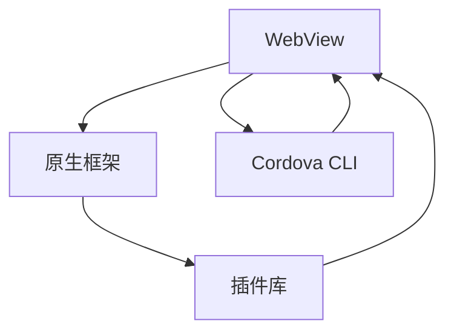

                 

# Cordova 混合应用：在原生平台上运行

> 关键词：Cordova, Web开发, 跨平台, 移动应用, 混合应用开发, 原生渲染

## 1. 背景介绍

### 1.1 问题由来
在Web时代，开发者们常常使用JavaScript、HTML和CSS等前端技术开发Web应用，而移动端应用则通常依赖于各自平台的原生开发技术（如iOS的Swift和Android的Kotlin）。这种技术割裂严重制约了Web应用的跨平台扩展能力，使得开发者在跨平台开发中面临巨大挑战。

移动端的迅速普及和应用场景的多样化，促使Web开发者寻找一种跨平台解决方案，既能够充分利用前端技术优势，又能在不同移动平台上获得原生级的体验。Cordova正是这样的跨平台开发工具，通过将Web应用嵌入原生应用中，实现了Web应用的原生渲染，从而大幅度提升了Web应用的性能和用户体验。

### 1.2 问题核心关键点
Cordova通过Web视图控制原生框架，实现了Web应用的跨平台运行，其主要特性包括：
- **跨平台兼容性**：能够在iOS、Android、Windows Phone等多个移动平台上运行。
- **Web技术灵活**：充分利用HTML5、JavaScript、CSS等Web技术，实现高效开发。
- **原生渲染**：将Web内容嵌入原生应用中，实现良好的用户体验。
- **丰富的插件库**：提供大量第三方插件，支持相机、位置、推送等移动功能。

Cordova框架的灵活性和易用性使其成为了开发跨平台移动应用的强大工具，但同时也面临以下挑战：
- **性能问题**：Web内容在原生应用中的渲染效率较低。
- **用户体验不一致**：不同平台的原生UI控件存在差异。
- **兼容性问题**：不同移动设备的浏览器差异较大，可能导致兼容性问题。
- **开发者门槛**：需要掌握两种以上的前端和移动端开发技术。

本文档将全面介绍Cordova的工作原理、技术栈、开发流程和最佳实践，帮助你更好地理解和应用Cordova进行跨平台开发。

## 2. 核心概念与联系

### 2.1 核心概念概述

Cordova是一个开源的跨平台移动应用开发框架，由Apache基金会维护。它基于HTML5、CSS3和JavaScript技术，通过Web视图控制原生框架，实现了Web应用的原生渲染。其核心概念包括以下几点：

- **WebView**：是Cordova应用的核心组件，负责展示Web页面。
- **插件**：用于实现移动设备的特定功能，如相机、地理位置、通知等。
- **原生框架**：负责处理移动设备的特定功能，如相机调用、地理位置获取等。
- **Cordova CLI**：Cordova的命令行工具，用于创建和管理Cordova应用。

### 2.2 核心概念原理和架构的 Mermaid 流程图



这个流程图展示了Cordova的架构关系：
- 浏览器中的`WebView`负责展示Web页面。
- `原生框架`负责处理移动设备上的原生功能，如相机调用、地理位置获取等。
- `插件库`提供了丰富的第三方插件，增强了应用的功能性。
- `Cordova CLI`是Cordova的核心管理工具，用于创建和管理Cordova应用。

## 3. 核心算法原理 & 具体操作步骤

### 3.1 算法原理概述

Cordova的工作原理基于Web技术的跨平台特性，主要包括以下步骤：

1. **创建Cordova应用**：使用Cordova CLI创建新的Cordova应用项目。
2. **添加插件**：根据需求添加相应的移动功能插件，如相机、地理位置等。
3. **构建应用**：通过打包工具将Cordova应用打包成移动应用，支持iOS、Android等平台。
4. **运行应用**：在移动设备上运行打包后的应用，Web页面通过`WebView`组件原生渲染。

### 3.2 算法步骤详解

#### 3.2.1 创建Cordova应用

1. **安装Cordova CLI**：
```bash
npm install -g cordova
```

2. **创建新项目**：
```bash
cordova create myapp
cd myapp
```

3. **配置项目**：编辑`config.xml`文件，添加所需插件，如相机、地理位置等。

#### 3.2.2 添加插件

1. **安装插件**：
```bash
cordova plugin add cordova-plugin-camera
cordova plugin add cordova-plugin-geolocation
```

2. **配置插件**：编辑`config.xml`文件，配置插件参数，如相机权限、地理位置精度等。

#### 3.2.3 构建应用

1. **构建应用**：
```bash
cordova build
```

2. **打包应用**：选择目标平台（iOS、Android等）进行打包。
```bash
cordova build ios
```

3. **安装应用**：将打包后的应用安装到移动设备上。
```bash
cordova install
```

### 3.3 算法优缺点

#### 3.3.1 优点

- **跨平台兼容**：能够在多个移动平台上运行，减少了开发和维护成本。
- **Web技术灵活**：使用HTML5、CSS3和JavaScript，便于Web开发者快速上手。
- **原生渲染**：通过`WebView`实现Web内容的原生渲染，提升用户体验。
- **插件丰富**：支持大量的第三方插件，丰富应用功能。

#### 3.3.2 缺点

- **性能问题**：Web内容在原生应用中的渲染效率较低，可能导致性能瓶颈。
- **用户体验不一致**：不同平台的原生UI控件存在差异，可能导致用户体验不一致。
- **兼容性问题**：不同移动设备的浏览器差异较大，可能导致兼容性问题。
- **开发者门槛**：需要掌握两种以上的前端和移动端开发技术，开发者门槛较高。

### 3.4 算法应用领域

Cordova广泛应用于各种跨平台移动应用开发，如：

- **企业移动应用**：为企业提供统一的移动应用开发平台，支持内部通讯、CRM、ERP等系统。
- **个人移动应用**：开发个人移动应用，如社交网络、健康管理、金融理财等。
- **游戏开发**：通过Cordova开发跨平台游戏，减少平台开发成本。
- **教育应用**：开发跨平台教育应用，支持在线课程、智能答疑等。
- **物联网应用**：开发跨平台物联网应用，支持设备控制、数据采集等。

## 4. 数学模型和公式 & 详细讲解 & 举例说明

### 4.1 数学模型构建

Cordova的数学模型主要涉及Web内容在`WebView`中的渲染效率和用户体验。以相机的调用为例，其数学模型如下：

1. **调用相机**：通过JavaScript代码调用相机功能，采集用户照片或视频。
2. **传递数据**：将采集到的数据通过JavaScript传递给原生代码进行处理。
3. **处理数据**：原生代码对数据进行处理，如压缩、编码等。
4. **显示数据**：将处理后的数据通过`WebView`展示给用户。

### 4.2 公式推导过程

以相机的调用为例，其公式推导过程如下：

1. **调用相机**：
   $$
   \text{camera()} = \text{document}.\text{getElementById}('camera').\text{click}()
   $$

2. **传递数据**：
   $$
   \text{oncamera}(\text{image}) = \text{console}.\text{log}(\text{image})
   $$

3. **处理数据**：
   $$
   \text{processImage}(\text{image}) = \text{encodeURIComponent}(\text{image})
   $$

4. **显示数据**：
   $$
   \text{displayImage}(\text{url}) = \text{document}.\text{getElementById}('image').\text{src} = \text{url}
   $$

### 4.3 案例分析与讲解

以一个简单的拍照应用为例，展示Cordova的拍照功能实现：

1. **调用相机**：
```javascript
var camera = document.getElementById('camera');
camera.addEventListener('click', function() {
    navigator.camera.getPicture(function(imageData) {
        console.log('Picture acquired');
    }, function() {
        console.log('Picture acquisition failed');
    }, {quality: 50, destinationType: navigator.camera.DestinationType.DATA_URL});
});
```

2. **传递数据**：
```javascript
function oncamera(image) {
    console.log('Image acquired');
}
```

3. **处理数据**：
```javascript
function processImage(image) {
    var imageData = encodeURIComponent(image);
    return imageData;
}
```

4. **显示数据**：
```javascript
var image = document.getElementById('image');
image.src = 'data:image/jpeg;base64,' + imageData;
```

## 5. 项目实践：代码实例和详细解释说明

### 5.1 开发环境搭建

创建Cordova应用和添加插件的基本流程如下：

1. **安装Node.js和Cordova CLI**：
   ```bash
   npm install -g node
   npm install -g cordova
   ```

2. **创建新项目**：
   ```bash
   cordova create myapp
   cd myapp
   ```

3. **添加插件**：
   ```bash
   cordova plugin add cordova-plugin-camera
   cordova plugin add cordova-plugin-geolocation
   ```

4. **配置插件**：
   ```xml
   <plugin name="cordova-plugin-camera" spec="~4.0.1">
       <variable name="Camera" />
       <variable name="CameraOptions" />
       <variable name="CameraDirection" />
       <variable name="CameraType" />
       <variable name="CameraCaptureMode" />
       <variable name="CameraPictureFormat" />
       <variable name="CameraQuality" />
       <variable name="CameraRange" />
       <variable name="CameraShutterSpeed" />
       <variable name="CameraZoom" />
       <variable name="CameraLightSource" />
   </plugin>
   ```

### 5.2 源代码详细实现

以下是Cordova应用中相机调用功能的完整代码实现：

**index.html**：
```html
<!DOCTYPE html>
<html>
<head>
    <title>Cordova示例</title>
</head>
<body>
    <div id="camera">拍照</div>
    
    <script src="cordova.js"></script>
    <script src="main.js"></script>
</body>
</html>
```

**cordova.js**：
```javascript
document.addEventListener('deviceready', function() {
    document.getElementById('camera').addEventListener('click', function() {
        navigator.camera.getPicture(function(imageData) {
            console.log('Picture acquired');
            var image = document.getElementById('image');
            image.src = 'data:image/jpeg;base64,' + imageData;
        }, function() {
            console.log('Picture acquisition failed');
        }, {quality: 50, destinationType: navigator.camera.DestinationType.DATA_URL});
    });
}, false);
```

**main.js**：
```javascript
function oncamera(image) {
    console.log('Image acquired');
}
```

### 5.3 代码解读与分析

以下是Cordova应用中相机调用功能的代码解读：

1. **调用相机**：在`index.html`中添加一个按钮，点击按钮后调用`navigator.camera.getPicture`方法，采集用户照片或视频。
2. **传递数据**：将采集到的数据通过JavaScript传递给`oncamera`函数，进行进一步处理。
3. **处理数据**：在`main.js`中定义`oncamera`函数，对采集到的图片进行处理，并将其展示在`image`标签中。

## 6. 实际应用场景

### 6.1 企业移动应用

Cordova为企业提供了统一的移动应用开发平台，支持内部通讯、CRM、ERP等系统。企业可以使用Cordova开发统一的移动应用，减少不同平台开发和维护成本，提升应用开发效率。

### 6.2 个人移动应用

个人开发者可以通过Cordova开发各种跨平台移动应用，如社交网络、健康管理、金融理财等。这些应用通常具有较高的交互性和丰富的功能，通过Cordova可以快速实现。

### 6.3 游戏开发

Cordova支持跨平台游戏开发，通过添加相应的插件（如游戏控件、物理引擎等），可以开发出功能丰富、性能稳定的游戏应用。

### 6.4 教育应用

Cordova可以开发跨平台教育应用，支持在线课程、智能答疑等。通过添加相应的插件，可以实现互动教学、作业批改等功能，提升教学效果。

### 6.5 物联网应用

Cordova支持跨平台物联网应用开发，支持设备控制、数据采集等功能。通过添加相应的插件，可以实现智能家居、工业控制等应用。

## 7. 工具和资源推荐

### 7.1 学习资源推荐

为了帮助开发者更好地理解和应用Cordova，这里推荐一些优质的学习资源：

1. **Cordova官方文档**：提供了详细的API文档和开发指南，帮助开发者快速上手。
2. **MDN Web Docs**：提供了Cordova的详细介绍和开发教程，适合初学者学习。
3. **《Cordova移动应用开发实战》书籍**：由业内专家编写，全面介绍了Cordova的应用场景和开发技巧。
4. **Udemy和Coursera等在线课程**：提供了大量的Cordova开发教程，适合不同层次的开发者学习。

### 7.2 开发工具推荐

Cordova的开发工具包括：

1. **Visual Studio Code**：提供了强大的代码编辑和调试功能，支持Cordova开发。
2. **IntelliJ IDEA**：支持Cordova开发，提供了丰富的插件和扩展功能。
3. **Sublime Text**：轻量级的文本编辑器，支持Cordova开发。

### 7.3 相关论文推荐

以下是几篇Cordova相关的论文，推荐阅读：

1. **《Cordova: A Cross-Platform Mobile Development Framework for JavaScript》**：介绍了Cordova的核心概念和技术栈，帮助开发者全面了解Cordova。
2. **《Improving Cross-Platform Mobile Application Performance with Cordova》**：探讨了Cordova的性能优化策略，帮助开发者提升应用性能。
3. **《The Future of Mobile Development: Cordova and Beyond》**：讨论了Cordova的未来发展趋势和挑战，帮助开发者了解行业动态。

## 8. 总结：未来发展趋势与挑战

### 8.1 总结

Cordova作为一种跨平台移动应用开发工具，通过Web技术的跨平台特性，实现了Web内容的原生渲染，提升了Web应用的性能和用户体验。在实际应用中，Cordova广泛应用于企业移动应用、个人移动应用、游戏开发、教育应用、物联网应用等多个领域。但同时，Cordova也面临性能、用户体验、兼容性等问题，需要开发者在开发过程中进行优化和改进。

### 8.2 未来发展趋势

未来，Cordova将继续在跨平台移动应用开发中发挥重要作用。其主要发展趋势包括：

1. **性能优化**：通过Web技术的优化，提升Web内容在原生应用中的渲染效率。
2. **用户体验改进**：通过原生UI控件的适配，提升应用在不同平台上的用户体验。
3. **兼容性增强**：通过浏览器兼容性的优化，提升不同设备上的应用表现。
4. **插件扩展**：开发更多高质量的插件，增强应用功能。
5. **生态系统建设**：建立完善的生态系统，提供更多的开发工具和资源支持。

### 8.3 面临的挑战

尽管Cordova在跨平台开发中具有重要地位，但同时面临以下挑战：

1. **性能瓶颈**：Web内容在原生应用中的渲染效率较低，可能导致性能瓶颈。
2. **用户体验不一致**：不同平台的原生UI控件存在差异，可能导致用户体验不一致。
3. **兼容性问题**：不同移动设备的浏览器差异较大，可能导致兼容性问题。
4. **开发者门槛**：需要掌握两种以上的前端和移动端开发技术，开发者门槛较高。

### 8.4 研究展望

未来的研究需要在以下几个方面寻求新的突破：

1. **性能优化**：通过Web技术的优化，提升Web内容在原生应用中的渲染效率。
2. **用户体验改进**：通过原生UI控件的适配，提升应用在不同平台上的用户体验。
3. **兼容性增强**：通过浏览器兼容性的优化，提升不同设备上的应用表现。
4. **插件扩展**：开发更多高质量的插件，增强应用功能。
5. **生态系统建设**：建立完善的生态系统，提供更多的开发工具和资源支持。

## 9. 附录：常见问题与解答

**Q1: Cordova 是什么？**

A: Cordova 是一个开源的跨平台移动应用开发框架，由 Apache 基金会维护。它基于 HTML5、CSS3 和 JavaScript 技术，通过 WebView 控制原生框架，实现了 Web 应用的原生渲染。

**Q2: 如何使用 Cordova 创建新的移动应用项目？**

A: 可以使用 Cordova CLI 创建新的移动应用项目。具体步骤如下：

1. 安装 Cordova CLI：`npm install -g cordova`
2. 创建新项目：`cordova create myapp`
3. 配置项目：编辑 `config.xml` 文件，添加所需插件。

**Q3: 如何使用 Cordova 添加插件？**

A: 可以使用 Cordova CLI 添加插件。具体步骤如下：

1. 安装插件：`cordova plugin add <plugin-name>`
2. 配置插件：编辑 `config.xml` 文件，配置插件参数。

**Q4: 如何使用 Cordova 构建和打包移动应用？**

A: 可以使用 Cordova CLI 构建和打包移动应用。具体步骤如下：

1. 构建应用：`cordova build`
2. 打包应用：选择目标平台（iOS、Android 等）进行打包。
3. 安装应用：将打包后的应用安装到移动设备上。

**Q5: Cordova 面临哪些挑战？**

A: Cordova 面临的主要挑战包括：

1. 性能问题：Web 内容在原生应用中的渲染效率较低。
2. 用户体验不一致：不同平台的原生 UI 控件存在差异。
3. 兼容性问题：不同移动设备的浏览器差异较大。
4. 开发者门槛：需要掌握两种以上的前端和移动端开发技术。

---

作者：禅与计算机程序设计艺术 / Zen and the Art of Computer Programming

