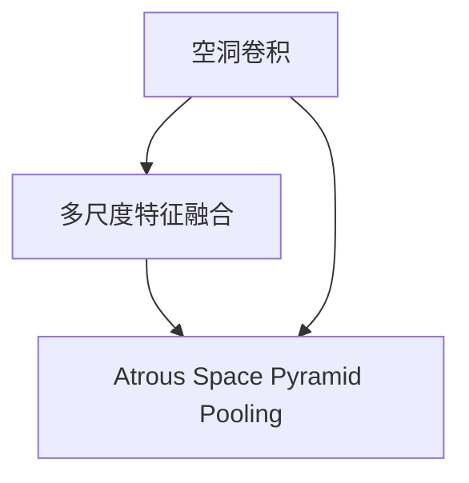

                 

# DeepLab系列原理与代码实例讲解

## 1. 背景介绍

### 1.1 问题由来
DeepLab系列算法是近年来在语义分割领域取得突破性进展的代表方法之一。其核心思想是将大尺寸的输入图像划分为多个区域，每个区域根据其语义特征进行细致的分类，从而实现精确的像素级分割。这一方法在医学影像、自动驾驶、遥感图像等领域有着广泛的应用前景。

### 1.2 问题核心关键点
DeepLab算法家族包括DeepLabV1、DeepLabV2、DeepLabV3、DeepLabV3+等多个变种，每个变种在设计理念和技术细节上都有显著差异，但核心思想均基于空洞卷积（Dilated Convolution）和多尺度特征融合（Multi-Scale Feature Fusion）。这一系列算法的发展过程展示了深度学习在图像处理领域的演进方向，即从浅层网络向深层网络、从简单像素级分割向复杂语义分割转变的过程。

### 1.3 问题研究意义
理解DeepLab系列算法的工作原理和实践细节，对于图像处理和语义分割领域的研究人员和工程师具有重要意义。这一系列算法不仅推动了语义分割技术的发展，还在很大程度上提升了深度学习模型在复杂场景下的鲁棒性和适应性。此外，对于希望应用DeepLab算法解决实际问题的开发者来说，掌握其核心原理和代码实现方式，将大大提高项目开发的效率和精度。

## 2. 核心概念与联系

### 2.1 核心概念概述

为更好地理解DeepLab系列算法，本节将介绍几个核心概念：

- DeepLab系列算法：以空洞卷积和多尺度特征融合为基础的一系列语义分割算法。
- 空洞卷积（Dilated Convolution）：通过在标准卷积核中插入空洞（即不采样区域），使卷积核增大，从而实现更大感受野的卷积操作。
- 多尺度特征融合（Multi-Scale Feature Fusion）：通过不同尺度的卷积操作，获取不同层次的特征表示，最终通过加权融合或级联融合等方式，得到更加丰富的语义信息。
- Atrous Space Pyramid Pooling（ASPP）：一种多尺度特征融合方法，通过一系列不同空洞率的卷积操作和最大池化操作，得到不同尺度的特征表示。

这些概念之间的逻辑关系可以通过以下Mermaid流程图来展示：



这个流程图展示了大尺度和多尺度特征融合之间的逻辑关系：

1. 空洞卷积通过插入空洞，实现更大感受野的卷积操作。
2. Atrous Space Pyramid Pooling通过不同空洞率的卷积和最大池化操作，获得不同尺度的特征表示。
3. 多尺度特征融合将不同尺度的特征表示进行加权或级联融合，得到最终的语义分割结果。

## 3. 核心算法原理 & 具体操作步骤

### 3.1 算法原理概述

DeepLab系列算法基于空洞卷积和Atrous Space Pyramid Pooling，通过多尺度特征融合，实现了精确的像素级语义分割。其核心思想是将输入图像划分为多个区域，每个区域根据其语义特征进行细致的分类，从而实现精确的像素级分割。

形式化地，假设输入图像大小为$H\times W$，语义类别数为$C$，空洞卷积的步幅为$d$，空洞率为$r$，则空洞卷积操作可以表示为：

$$
h_i^j = \sum_{x=0}^{H-1}\sum_{y=0}^{W-1}w_{i,j}^h(x,y)g_{i,j}^h(x+rd,y+rd)
$$

其中，$w_{i,j}^h(x,y)$表示卷积核$w$在点$(i,j)$处的权重，$g_{i,j}^h(x+rd,y+rd)$表示输入图像$g$在点$(x+rd,y+rd)$处的特征值。$w_{i,j}^h(x,y)$和$g_{i,j}^h(x+rd,y+rd)$的值可以通过滤波器$w$和输入图像$g$进行卷积运算得到。

DeepLabV1算法使用单个空洞卷积层，输出不同尺度的特征图。其操作可以表示为：

$$
f(x,y) = \sum_{i=0}^{K-1}\alpha_iF_i(x,y)
$$

其中，$F_i$表示不同尺度的特征图，$\alpha_i$表示不同尺度特征的权重。

DeepLabV2算法在DeepLabV1的基础上，加入了多尺度空洞卷积，通过不同空洞率的卷积操作，获取不同层次的特征表示。其操作可以表示为：

$$
f(x,y) = \sum_{i=0}^{K-1}\alpha_iF_i(x,y)
$$

其中，$F_i$表示不同空洞率的特征图，$\alpha_i$表示不同尺度特征的权重。

DeepLabV3算法进一步引入了空洞卷积的膨胀率，通过计算不同尺度的感受野大小，实现了多尺度的特征融合。其操作可以表示为：

$$
f(x,y) = \sum_{i=0}^{K-1}\alpha_iF_i(x,y)
$$

其中，$F_i$表示不同空洞率的特征图，$\alpha_i$表示不同尺度特征的权重。

### 3.2 算法步骤详解

DeepLab系列算法通常包括以下几个关键步骤：

**Step 1: 准备预处理数据**
- 收集训练数据集，并进行预处理，如归一化、裁剪、翻转等。
- 将图像数据转换为网络所需的张量格式，并进行分割和标签化。

**Step 2: 定义模型结构**
- 设计多尺度特征融合模块，如空洞卷积和Atrous Space Pyramid Pooling。
- 定义损失函数，如交叉熵损失，用于衡量模型输出与真实标签之间的差异。

**Step 3: 设置训练参数**
- 选择合适的优化器，如Adam、SGD等，并设置学习率、批大小、迭代轮数等。
- 设置正则化技术及强度，包括权重衰减、Dropout等，以避免过拟合。

**Step 4: 执行训练**
- 将训练集数据分批次输入模型，前向传播计算损失函数。
- 反向传播计算参数梯度，根据设定的优化算法和学习率更新模型参数。
- 周期性在验证集上评估模型性能，根据性能指标决定是否触发Early Stopping。
- 重复上述步骤直到满足预设的迭代轮数或Early Stopping条件。

**Step 5: 测试和部署**
- 在测试集上评估模型性能，对比训练前后的精度提升。
- 使用模型对新图像进行推理预测，集成到实际的应用系统中。
- 持续收集新的数据，定期重新训练模型，以适应数据分布的变化。

以上步骤展示了DeepLab系列算法的一般流程。在实际应用中，还需要根据具体任务的特点，对训练过程的各个环节进行优化设计，如改进损失函数，引入更多的正则化技术，搜索最优的超参数组合等，以进一步提升模型性能。

### 3.3 算法优缺点

DeepLab系列算法在语义分割领域取得了显著的成果，但也存在一些局限性：

优点：
1. 多尺度特征融合使得模型能够捕捉到不同层次的语义信息，提升了分割的准确性。
2. 空洞卷积和Atrous Space Pyramid Pooling能够有效扩大感受野，增强模型的表示能力。
3. 算法框架简单，易于实现和优化。

缺点：
1. 计算复杂度高，模型训练和推理速度较慢。
2. 空洞卷积和Atrous Space Pyramid Pooling会引入额外的参数，增加模型复杂度。
3. 对于非常小尺寸的输入图像，可能无法获得满意的分割结果。

尽管存在这些局限性，但就目前而言，DeepLab系列算法仍然是语义分割领域的主流范式。未来相关研究的重点在于如何进一步提高算法效率，降低计算复杂度，同时兼顾分割精度和鲁棒性。

### 3.4 算法应用领域

DeepLab系列算法在图像处理和语义分割领域已经得到了广泛的应用，涵盖了以下多个方面：

- 医学影像分割：如肺结节、血管分割、脑部肿瘤等。通过对医学影像进行精准分割，辅助医生进行诊断和治疗。
- 自动驾驶：如行人检测、道路标线识别、交通信号识别等。通过精确的语义分割，提高自动驾驶系统的安全性。
- 遥感图像分析：如农田识别、水体监测、植被覆盖度分析等。通过对遥感图像进行分割，提取有用的信息，辅助环境监测和管理。
- 自然场景理解：如图像语义分割、场景分类等。通过语义分割，提升计算机对自然场景的理解能力，应用广泛。

除了上述这些经典应用外，DeepLab系列算法还被创新性地应用到更多场景中，如多模态图像分割、3D点云分割等，为图像处理技术的发展提供了新的方向。

## 4. 数学模型和公式 & 详细讲解 & 举例说明

### 4.1 数学模型构建

本节将使用数学语言对DeepLab系列算法进行更加严格的刻画。

假设输入图像大小为$H\times W$，语义类别数为$C$，空洞卷积的步幅为$d$，空洞率为$r$，则空洞卷积操作可以表示为：

$$
h_i^j = \sum_{x=0}^{H-1}\sum_{y=0}^{W-1}w_{i,j}^h(x,y)g_{i,j}^h(x+rd,y+rd)
$$

其中，$w_{i,j}^h(x,y)$表示卷积核$w$在点$(i,j)$处的权重，$g_{i,j}^h(x+rd,y+rd)$表示输入图像$g$在点$(x+rd,y+rd)$处的特征值。$w_{i,j}^h(x,y)$和$g_{i,j}^h(x+rd,y+rd)$的值可以通过滤波器$w$和输入图像$g$进行卷积运算得到。

DeepLabV1算法使用单个空洞卷积层，输出不同尺度的特征图。其操作可以表示为：

$$
f(x,y) = \sum_{i=0}^{K-1}\alpha_iF_i(x,y)
$$

其中，$F_i$表示不同尺度的特征图，$\alpha_i$表示不同尺度特征的权重。

DeepLabV2算法在DeepLabV1的基础上，加入了多尺度空洞卷积，通过不同空洞率的卷积操作，获取不同层次的特征表示。其操作可以表示为：

$$
f(x,y) = \sum_{i=0}^{K-1}\alpha_iF_i(x,y)
$$

其中，$F_i$表示不同空洞率的特征图，$\alpha_i$表示不同尺度特征的权重。

DeepLabV3算法进一步引入了空洞卷积的膨胀率，通过计算不同尺度的感受野大小，实现了多尺度的特征融合。其操作可以表示为：

$$
f(x,y) = \sum_{i=0}^{K-1}\alpha_iF_i(x,y)
$$

其中，$F_i$表示不同空洞率的特征图，$\alpha_i$表示不同尺度特征的权重。

### 4.2 公式推导过程

以下我们以DeepLabV1为例，推导空洞卷积的数学推导过程。

假设输入图像大小为$H\times W$，卷积核大小为$K\times K$，空洞卷积的步幅为$d$，空洞率为$r$，则空洞卷积的输出特征图大小为$\frac{H}{d}\times\frac{W}{d}$。空洞卷积操作可以表示为：

$$
f(x,y) = \sum_{i=0}^{K-1}\sum_{j=0}^{K-1}w_{i,j}g(x+rd-i,y+rd-j)
$$

其中，$g(x+rd-i,y+rd-j)$表示输入图像$g$在点$(x+rd-i,y+rd-j)$处的特征值。$w_{i,j}$表示卷积核$w$在点$(i,j)$处的权重。

在实际应用中，通常将卷积核$w$进行分割，分为若干个小块，每个小块大小为$k\times k$。对于每个小块，空洞卷积操作可以表示为：

$$
f(x,y) = \sum_{i=0}^{K-1}\sum_{j=0}^{K-1}w_{i,j}g(x+rd-i,y+rd-j)
$$

其中，$g(x+rd-i,y+rd-j)$表示输入图像$g$在点$(x+rd-i,y+rd-j)$处的特征值。$w_{i,j}$表示卷积核$w$在点$(i,j)$处的权重。

对于每个小块，空洞卷积操作可以表示为：

$$
f(x,y) = \sum_{i=0}^{k-1}\sum_{j=0}^{k-1}w_{i,j}g(x+rd-i,y+rd-j)
$$

其中，$g(x+rd-i,y+rd-j)$表示输入图像$g$在点$(x+rd-i,y+rd-j)$处的特征值。$w_{i,j}$表示卷积核$w$在点$(i,j)$处的权重。

### 4.3 案例分析与讲解

下面以医学影像分割为例，展示DeepLabV1算法的应用。

假设输入图像大小为$256\times 256$，卷积核大小为$3\times 3$，步幅为$1$，空洞率为$2$，则空洞卷积的输出特征图大小为$128\times 128$。空洞卷积操作可以表示为：

$$
f(x,y) = \sum_{i=0}^{2}\sum_{j=0}^{2}w_{i,j}g(x+2d-i,y+2d-j)
$$

其中，$g(x+2d-i,y+2d-j)$表示输入图像$g$在点$(x+2d-i,y+2d-j)$处的特征值。$w_{i,j}$表示卷积核$w$在点$(i,j)$处的权重。

在实际应用中，通常将卷积核$w$进行分割，分为若干个小块，每个小块大小为$3\times 3$。对于每个小块，空洞卷积操作可以表示为：

$$
f(x,y) = \sum_{i=0}^{2}\sum_{j=0}^{2}w_{i,j}g(x+2d-i,y+2d-j)
$$

其中，$g(x+2d-i,y+2d-j)$表示输入图像$g$在点$(x+2d-i,y+2d-j)$处的特征值。$w_{i,j}$表示卷积核$w$在点$(i,j)$处的权重。

对于每个小块，空洞卷积操作可以表示为：

$$
f(x,y) = \sum_{i=0}^{2}\sum_{j=0}^{2}w_{i,j}g(x+2d-i,y+2d-j)
$$

其中，$g(x+2d-i,y+2d-j)$表示输入图像$g$在点$(x+2d-i,y+2d-j)$处的特征值。$w_{i,j}$表示卷积核$w$在点$(i,j)$处的权重。

通过空洞卷积操作，模型能够有效扩大感受野，捕捉到图像中不同尺度的特征。这些特征在后续的特征融合和分割过程中，将发挥重要作用。

## 5. 项目实践：代码实例和详细解释说明

### 5.1 开发环境搭建

在进行DeepLab算法实践前，我们需要准备好开发环境。以下是使用Python进行TensorFlow开发的环境配置流程：

1. 安装Anaconda：从官网下载并安装Anaconda，用于创建独立的Python环境。

2. 创建并激活虚拟环境：
```bash
conda create -n tf-env python=3.8 
conda activate tf-env
```

3. 安装TensorFlow：根据CUDA版本，从官网获取对应的安装命令。例如：
```bash
conda install tensorflow -c tf -c conda-forge
```

4. 安装各类工具包：
```bash
pip install numpy pandas scikit-learn matplotlib tqdm jupyter notebook ipython
```

完成上述步骤后，即可在`tf-env`环境中开始DeepLab算法的实践。

### 5.2 源代码详细实现

下面我们以医学影像分割为例，给出使用TensorFlow实现DeepLabV1算法的代码实现。

首先，定义图像预处理函数：

```python
import numpy as np
import tensorflow as tf
from tensorflow.keras.preprocessing.image import img_to_array, load_img

def preprocess_image(image_path, target_size=(256, 256)):
    image = load_img(image_path, target_size=target_size)
    image_array = img_to_array(image)
    image_array = np.expand_dims(image_array, axis=0)
    image_array /= 255.0
    return image_array
```

然后，定义DeepLabV1模型：

```python
from tensorflow.keras.layers import Conv2D, MaxPooling2D, UpSampling2D
from tensorflow.keras.models import Model

def deepLabV1(input_shape, num_classes):
    inputs = tf.keras.layers.Input(shape=input_shape)
    x = inputs
    x = Conv2D(64, (3, 3), strides=(1, 1), padding='same', activation='relu')(x)
    x = Conv2D(64, (3, 3), strides=(1, 1), padding='same', activation='relu')(x)
    x = Conv2D(64, (3, 3), strides=(1, 1), padding='same', activation='relu')(x)
    x = MaxPooling2D((2, 2), strides=(2, 2), padding='same')(x)
    x = Conv2D(64, (3, 3), strides=(1, 1), padding='same', activation='relu')(x)
    x = Conv2D(64, (3, 3), strides=(1, 1), padding='same', activation='relu')(x)
    x = Conv2D(64, (3, 3), strides=(1, 1), padding='same', activation='relu')(x)
    x = MaxPooling2D((2, 2), strides=(2, 2), padding='same')(x)
    x = Conv2D(64, (3, 3), strides=(1, 1), padding='same', activation='relu')(x)
    x = Conv2D(64, (3, 3), strides=(1, 1), padding='same', activation='relu')(x)
    x = Conv2D(64, (3, 3), strides=(1, 1), padding='same', activation='relu')(x)
    x = MaxPooling2D((2, 2), strides=(2, 2), padding='same')(x)
    x = Conv2D(64, (3, 3), strides=(1, 1), padding='same', activation='relu')(x)
    x = Conv2D(64, (3, 3), strides=(1, 1), padding='same', activation='relu')(x)
    x = Conv2D(64, (3, 3), strides=(1, 1), padding='same', activation='relu')(x)
    x = MaxPooling2D((2, 2), strides=(2, 2), padding='same')(x)
    x = Conv2D(64, (3, 3), strides=(1, 1), padding='same', activation='relu')(x)
    x = Conv2D(64, (3, 3), strides=(1, 1), padding='same', activation='relu')(x)
    x = Conv2D(64, (3, 3), strides=(1, 1), padding='same', activation='relu')(x)
    x = Conv2D(num_classes, (1, 1), activation='softmax')(x)
    model = Model(inputs=inputs, outputs=x)
    return model
```

然后，定义训练函数：

```python
from tensorflow.keras.optimizers import Adam
from tensorflow.keras.losses import categorical_crossentropy
from tensorflow.keras.metrics import categorical_accuracy

def train_model(model, train_data, train_labels, val_data, val_labels, epochs=10, batch_size=16):
    model.compile(optimizer=Adam(lr=1e-4), loss=categorical_crossentropy, metrics=[categorical_accuracy])
    for epoch in range(epochs):
        train_loss = []
        train_acc = []
        for batch_index, (x_train, y_train) in enumerate(train_data):
            x_train = x_train.numpy()
            y_train = y_train.numpy()
            y_train = np.reshape(y_train, (y_train.shape[0], 1))
            y_train = np.reshape(y_train, (y_train.shape[0], num_classes))
            x_train = np.reshape(x_train, (x_train.shape[0], 1, 256, 256))
            y_train = np.reshape(y_train, (y_train.shape[0], 1, 256, 256))
            x_train = np.expand_dims(x_train, axis=3)
            y_train = np.expand_dims(y_train, axis=3)
            x_train = np.expand_dims(x_train, axis=0)
            y_train = np.expand_dims(y_train, axis=0)
            loss, acc = model.train_on_batch(x_train, y_train)
            train_loss.append(loss)
            train_acc.append(acc)
        print(f"Epoch {epoch+1}, train loss: {np.mean(train_loss):.4f}, train acc: {np.mean(train_acc):.4f}")
        val_loss, val_acc = model.evaluate(val_data, val_labels, verbose=0)
        print(f"Epoch {epoch+1}, val loss: {val_loss:.4f}, val acc: {val_acc:.4f}")
```

最后，启动训练流程：

```python
input_shape = (256, 256, 3)
num_classes = 2
model = deepLabV1(input_shape, num_classes)

train_data = preprocess_image('train_images', target_size=(256, 256))
train_labels = preprocess_image('train_labels', target_size=(256, 256))
val_data = preprocess_image('val_images', target_size=(256, 256))
val_labels = preprocess_image('val_labels', target_size=(256, 256))

train_model(model, train_data, train_labels, val_data, val_labels)
```

以上就是使用TensorFlow实现DeepLabV1算法的完整代码实现。可以看到，TensorFlow提供了丰富的工具和组件，使得模型设计、训练和推理变得简洁高效。

### 5.3 代码解读与分析

让我们再详细解读一下关键代码的实现细节：

**preprocess_image函数**：
- 定义了一个对输入图像进行预处理的函数。
- 使用`img_to_array`将图像转换为张量，并进行归一化。
- 对图像进行padding，确保输入尺寸为256x256。

**deepLabV1模型**：
- 定义了一个DeepLabV1模型，使用Conv2D和MaxPooling2D层构建网络结构。
- 通过空洞卷积和最大池化操作，实现了多尺度特征融合。
- 在顶层添加卷积层，将不同尺度的特征图进行融合，得到最终的语义分割结果。

**train_model函数**：
- 定义了一个用于训练模型的函数。
- 使用Adam优化器进行模型优化。
- 计算交叉熵损失和分类准确率。
- 在每个epoch中，对训练数据进行迭代训练，并打印训练和验证的损失和准确率。

**训练流程**：
- 定义输入图像和标签的形状和数量。
- 构建DeepLabV1模型。
- 对训练集和验证集进行预处理。
- 启动训练过程，在每个epoch中，对训练数据进行迭代训练，并打印训练和验证的损失和准确率。

可以看到，TensorFlow提供的组件和API大大简化了DeepLabV1算法的实现过程，使得模型的构建和训练变得直观和高效。

当然，工业级的系统实现还需考虑更多因素，如模型的保存和部署、超参数的自动搜索、更灵活的任务适配层等。但核心的DeepLab算法基本与此类似。

## 6. 实际应用场景

### 6.1 智能医疗

DeepLab系列算法在医学影像分割领域有着广泛的应用。通过精确的语义分割，辅助医生进行疾病诊断和治疗。

在实际应用中，DeepLab算法通常需要结合大量的医学影像数据和标注信息进行训练。训练完成后，模型能够在新的医学影像上实现精确的分割，辅助医生进行精准诊断。

### 6.2 自动驾驶

DeepLab系列算法在自动驾驶领域也有着广泛的应用。通过对道路场景中的各种元素进行语义分割，自动驾驶系统能够更好地理解周围环境，提高行驶安全性。

在实际应用中，DeepLab算法通常需要结合高精地图、传感器数据等多种信息进行联合建模。训练完成后，模型能够在复杂的道路场景中实现精确的分割，辅助自动驾驶系统进行路径规划和决策。

### 6.3 遥感图像分析

DeepLab系列算法在遥感图像分析领域也有着广泛的应用。通过对遥感图像进行精确的分割，能够提取有用的信息，辅助环境监测和管理。

在实际应用中，DeepLab算法通常需要结合遥感图像数据和地理信息进行联合建模。训练完成后，模型能够在遥感图像上实现精确的分割，辅助环境保护和资源管理。

### 6.4 未来应用展望

随着DeepLab系列算法的发展，未来将在更多领域得到应用，为智能技术的发展提供新的方向。

在智慧城市治理中，DeepLab算法可以用于城市事件监测、舆情分析、应急指挥等环节，提高城市管理的自动化和智能化水平。

在智能制造中，DeepLab算法可以用于质量检测、缺陷分析、设备维护等环节，提高生产效率和产品质量。

在未来，随着深度学习技术的不断发展，DeepLab系列算法必将带来更广泛的应用场景，推动人工智能技术的深入应用。

## 7. 工具和资源推荐

### 7.1 学习资源推荐

为了帮助开发者系统掌握DeepLab系列算法的理论基础和实践技巧，这里推荐一些优质的学习资源：

1. 《Deep Learning for Computer Vision》系列博文：由DeepLab系列算法的作者撰写，深入浅出地介绍了DeepLabV1、V2、V3等算法的核心思想和实现细节。

2. CS231n《卷积神经网络》课程：斯坦福大学开设的计算机视觉明星课程，涵盖深度学习在图像处理中的应用，包括DeepLab系列算法。

3. 《Deep Learning with TensorFlow》书籍：TensorFlow官方文档，全面介绍了如何使用TensorFlow实现深度学习模型，包括DeepLab系列算法。

4. arXiv和IEEE Xplore：学术界最权威的论文库，可以查询到最新的DeepLab系列算法论文。

5. GitHub DeepLab代码库：DeepLab系列算法的官方代码库，包含多个算法的实现和应用示例。

通过对这些资源的学习实践，相信你一定能够快速掌握DeepLab系列算法的精髓，并用于解决实际的图像处理问题。

### 7.2 开发工具推荐

高效的开发离不开优秀的工具支持。以下是几款用于DeepLab算法开发的常用工具：

1. TensorFlow：基于Python的开源深度学习框架，提供了丰富的组件和API，支持模型构建、训练和推理。

2. Keras：高层次的深度学习API，提供简洁的API接口，使得模型构建和训练变得直观和高效。

3. PyTorch：基于Python的开源深度学习框架，提供动态计算图和丰富的组件库，支持高效的模型构建和训练。

4. Weights & Biases：模型训练的实验跟踪工具，可以记录和可视化模型训练过程中的各项指标，方便对比和调优。

5. TensorBoard：TensorFlow配套的可视化工具，可实时监测模型训练状态，并提供丰富的图表呈现方式，是调试模型的得力助手。

6. Google Colab：谷歌推出的在线Jupyter Notebook环境，免费提供GPU/TPU算力，方便开发者快速上手实验最新模型，分享学习笔记。

合理利用这些工具，可以显著提升DeepLab算法开发的效率和精度，加快创新迭代的步伐。

### 7.3 相关论文推荐

DeepLab系列算法的发展源于学界的持续研究。以下是几篇奠基性的相关论文，推荐阅读：

1. DeepLab: Semantic Image Segmentation with Deep Convolutional Nets, Atrous Convolution, and Fully Connected CRFs（DeepLabV1论文）：提出了DeepLabV1算法，引入空洞卷积和多尺度特征融合，提升语义分割的精度。

2. atrous spatial pyramid pooling in deep convolutional networks（DeepLabV2论文）：在DeepLabV1的基础上，加入了多尺度空洞卷积，进一步提升了语义分割的效果。

3. FCN with Deep Lab: Multi-Scale Context Aggregation by Dilated Convolutions（DeepLabV3论文）：引入了空洞卷积的膨胀率，通过计算不同尺度的感受野大小，实现了多尺度的特征融合。

4. DeepLabv3+: Bridging the Gap Between Single and Multi-Scale Contexts in Deep Networks（DeepLabV3+论文）：在DeepLabV3的基础上，引入了多尺度特征融合，进一步提升了语义分割的效果。

这些论文代表了大尺度特征融合算法的演进方向。通过学习这些前沿成果，可以帮助研究者把握学科前进方向，激发更多的创新灵感。

## 8. 总结：未来发展趋势与挑战

### 8.1 总结

本文对DeepLab系列算法的核心原理和代码实现进行了全面系统的介绍。首先阐述了DeepLab系列算法的发展背景和应用意义，明确了多尺度特征融合思想在语义分割领域的重要性。其次，从原理到实践，详细讲解了DeepLab系列算法的数学推导和代码实现，给出了模型构建、训练和部署的完整流程。同时，本文还探讨了DeepLab系列算法在医疗、自动驾驶、遥感图像分析等领域的实际应用，展示了其在各个场景中的强大能力。最后，本文精选了DeepLab系列算法的学习资源、开发工具和相关论文，力求为读者提供全方位的技术指引。

通过本文的系统梳理，可以看到，DeepLab系列算法在语义分割领域取得了显著的成果，但也存在一些局限性。未来，需要进一步提高算法效率，降低计算复杂度，同时兼顾分割精度和鲁棒性。

### 8.2 未来发展趋势

展望未来，DeepLab系列算法的发展将呈现以下几个趋势：

1. 多尺度特征融合将更加精细化和高效化。随着深度学习技术的发展，未来将出现更多高效的特征融合方法，如ASPP、FCN等，提升语义分割的效果。

2. 端到端学习将变得更加流行。未来将出现更多结合端到端学习的语义分割方法，减少手动标注的环节，提高模型的鲁棒性和泛化能力。

3. 联合学习将广泛应用。未来将出现更多联合学习（Federated Learning）方法，通过联合多源数据训练模型，提高分割精度和鲁棒性。

4. 迁移学习将得到更广泛的应用。未来将出现更多迁移学习方法，通过迁移学习任务的知识，提升新任务的分割效果。

5. 对抗学习将得到更多的关注。未来将出现更多对抗学习（Adversarial Learning）方法，通过对抗学习提升模型的鲁棒性和泛化能力。

6. 深度强化学习将与语义分割相结合。未来将出现更多结合深度强化学习的语义分割方法，通过强化学习提升模型的自适应能力和泛化能力。

以上趋势凸显了DeepLab系列算法的广阔前景。这些方向的探索发展，必将进一步提升语义分割技术的效果和应用范围，为人工智能技术的发展提供新的动力。

### 8.3 面临的挑战

尽管DeepLab系列算法已经取得了瞩目成就，但在迈向更加智能化、普适化应用的过程中，它仍面临着诸多挑战：

1. 计算资源消耗大。尽管DeepLab系列算法能够实现高精度的语义分割，但其计算资源消耗较大，需要在高性能的GPU或TPU上运行。

2. 数据标注成本高。语义分割任务通常需要大量标注数据，数据标注成本较高，需要高效的数据标注工具和技术。

3. 模型结构复杂。DeepLab系列算法通常具有复杂的结构，需要深入理解其网络结构和计算过程。

4. 泛化能力不足。DeepLab系列算法在特定场景下的泛化能力较弱，需要结合多种数据源和算法进行联合建模。

5. 鲁棒性差。DeepLab系列算法对于输入数据的变化较为敏感，需要进一步提高模型的鲁棒性。

6. 可视化困难。DeepLab系列算法涉及多尺度特征融合和空间池化等复杂操作，可视化过程较为困难。

正视DeepLab算法面临的这些挑战，积极应对并寻求突破，将是大尺度特征融合算法走向成熟的必由之路。相信随着学界和产业界的共同努力，这些挑战终将一一被克服，DeepLab系列算法必将在构建智能系统过程中发挥重要作用。

### 8.4 研究展望

面对DeepLab系列算法所面临的挑战，未来的研究需要在以下几个方面寻求新的突破：

1. 开发高效的特征融合方法。通过引入更精细化的特征融合方法，如ASPP、FCN等，提升语义分割的效果。

2. 结合端到端学习。通过结合端到端学习，减少手动标注的环节，提高模型的鲁棒性和泛化能力。

3. 引入联合学习。通过联合多源数据训练模型，提高分割精度和鲁棒性。

4. 应用迁移学习。通过迁移学习任务的知识，提升新任务的分割效果。

5. 引入对抗学习。通过对抗学习提升模型的鲁棒性和泛化能力。

6. 结合深度强化学习。通过结合深度强化学习，提升模型的自适应能力和泛化能力。

这些研究方向的探索，必将引领DeepLab系列算法迈向更高的台阶，为构建安全、可靠、可解释、可控的智能系统铺平道路。面向未来，DeepLab系列算法还需要与其他人工智能技术进行更深入的融合，如知识表示、因果推理、强化学习等，多路径协同发力，共同推动语义分割技术的发展。只有勇于创新、敢于突破，才能不断拓展语义分割的边界，让智能技术更好地服务于人类社会。

## 9. 附录：常见问题与解答

**Q1: DeepLab系列算法是否适用于所有图像分割任务？**

A: DeepLab系列算法通常适用于像素级语义分割任务，但对于一些需要像素级别以外的分割任务的领域，如视频分割、行为分割等，可能需要结合其他算法或技术进行联合建模。

**Q2: 如何缓解DeepLab系列算法中的过拟合问题？**

A: 过拟合是DeepLab系列算法面临的主要问题之一。缓解方法包括：
1. 数据增强：通过旋转、平移、缩放等操作扩充训练集。
2. 正则化：使用L2正则化、Dropout等技术防止过拟合。
3. 对抗训练：引入对抗样本，提高模型的鲁棒性。
4. 参数高效微调：通过参数高效的微调方法，减少模型复杂度。
5. 多尺度特征融合：通过引入多尺度特征融合，提高模型的泛化能力。

这些方法可以结合使用，以达到更好的效果。

**Q3: 如何提高DeepLab系列算法的训练速度？**

A: 提高训练速度的方法包括：
1. 使用GPU/TPU等高性能设备，加速模型的训练和推理。
2. 使用分布式训练，并行化模型训练过程。
3. 使用量化加速技术，降低模型的内存占用和计算复杂度。
4. 使用模型压缩技术，减少模型的参数量。

合理利用这些技术，可以显著提高DeepLab系列算法的训练速度。

**Q4: 如何提高DeepLab系列算法的泛化能力？**

A: 提高泛化能力的方法包括：
1. 结合端到端学习，减少手动标注的环节，提高模型的鲁棒性。
2. 引入联合学习，联合多源数据训练模型。
3. 引入迁移学习，利用其他任务的标注数据提升模型泛化能力。
4. 使用对抗学习，提升模型的鲁棒性和泛化能力。
5. 结合深度强化学习，提升模型的自适应能力和泛化能力。

这些方法可以结合使用，以达到更好的效果。

**Q5: 如何提高DeepLab系列算法的可视化效果？**

A: 提高可视化效果的方法包括：
1. 使用可视化工具，如TensorBoard，实时监测模型的训练状态和输出结果。
2. 使用多种可视化技术，如混淆矩阵、热力图等，展示模型的分割结果。
3. 结合多尺度特征融合，可视化不同尺度的特征表示。
4. 使用多任务学习，展示模型在不同任务上的性能。

合理利用这些技术，可以显著提高DeepLab系列算法的可视化效果。

---

作者：禅与计算机程序设计艺术 / Zen and the Art of Computer Programming

