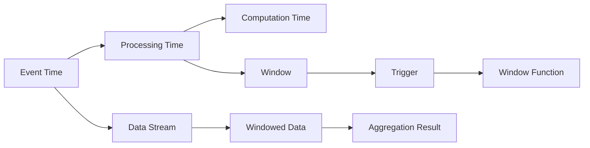

                 

# Flink Window原理与代码实例讲解

> 关键词：Flink, 流处理, Window, 时间窗口, 事件时间, 处理时间, 时间语义, 时间排序, 代码实例, 实时数据流, 窗口函数, 时间戳, 触发器, 计算时间

## 1. 背景介绍

### 1.1 问题由来

在大数据处理中，流处理技术成为了新一代的数据处理引擎的核心能力。相比传统批处理模式，流处理能够实现数据的实时处理和分析，极大地提高了数据处理的实时性和响应速度。而在流处理中，窗口（Window）机制是非常重要的一部分。它将连续到来的数据流划分为固定大小或滑动大小的窗口，并对每个窗口内的数据进行聚合、统计、计算等操作，从而实现对数据流的实时分析。

### 1.2 问题核心关键点

- **时间窗口**：流处理中的数据是以事件时间（Event Time）为基准的。因此，窗口机制根据时间进行分组，将数据分成固定时间间隔或滑动时间间隔的窗口，以便进行聚合计算。
- **时间语义**：Flink中的窗口机制支持多种时间语义，包括处理时间（Processing Time）、事件时间（Event Time）和计算时间（Computation Time），用于适应不同场景下的数据处理需求。
- **时间排序**：为了正确处理时间窗口，需要对数据流进行时间排序，确保数据按照时间戳顺序进入窗口，避免数据丢失或重复。
- **触发器（Trigger）**：窗口操作执行的条件，即触发器定义了何时对窗口内的数据进行聚合计算。
- **窗口函数**：对每个时间窗口内的事件进行聚合计算的函数，支持灵活的计算逻辑。

## 2. 核心概念与联系

### 2.1 核心概念概述

在Flink中，窗口机制是实现流处理的关键技术之一。它将连续到来的数据流按照时间划分窗口，对每个窗口内的数据进行聚合计算。以下是对核心概念的简要概述：

- **事件时间（Event Time）**：指数据生成的时间，即事件发生的时间戳。
- **处理时间（Processing Time）**：指数据到达处理系统的实际时间。
- **计算时间（Computation Time）**：指执行计算所需的时间，通常指处理器执行代码的时间。
- **时间窗口**：按照时间进行分组，可以固定大小（如 tumble window）或滑动大小（如 slide window）。
- **触发器（Trigger）**：定义何时对窗口内的数据进行聚合计算，可以基于时间（如 time-based trigger）或数据量（如 count-based trigger）。
- **窗口函数**：对每个时间窗口内的事件进行聚合计算的函数，如求和、计数、平均值等。

### 2.2 核心概念原理和架构的 Mermaid 流程图



## 3. 核心算法原理 & 具体操作步骤

### 3.1 算法原理概述

Flink中的窗口机制通过将数据流划分为不同大小的时间窗口，并对每个窗口内的数据进行聚合计算。窗口机制支持多种时间语义，包括事件时间、处理时间和计算时间。不同的时间语义对应不同的窗口执行方式和时间排序策略。

### 3.2 算法步骤详解

1. **时间窗口的划分**：根据时间语义，将连续到来的数据流划分为固定大小或滑动大小的时间窗口。
2. **数据排序**：对数据流进行时间排序，确保数据按照时间戳顺序进入窗口。
3. **触发器判断**：根据触发器条件，判断何时对窗口内的数据进行聚合计算。
4. **窗口函数计算**：对每个时间窗口内的事件进行聚合计算，得到最终的计算结果。

### 3.3 算法优缺点

**优点**：
- 支持多种时间语义，适应不同的数据处理需求。
- 灵活的触发器机制，可以根据数据量或时间条件进行计算。
- 支持多种窗口函数，适应不同的聚合需求。

**缺点**：
- 对计算资源和内存的要求较高，尤其是在窗口大小较大的情况下。
- 时间排序和触发器的复杂度较高，需要精确的时间戳管理和数据处理。

### 3.4 算法应用领域

窗口机制广泛应用于实时数据流处理，如实时计算、实时监控、实时分析等场景。它能够实现对数据流的实时聚合计算，为数据分析和业务决策提供实时支持。

## 4. 数学模型和公式 & 详细讲解 & 举例说明

### 4.1 数学模型构建

Flink中的窗口机制可以通过数学模型进行描述。以下是一个简单的窗口计算模型：

- **时间窗口大小**：$\Delta t$。
- **触发器条件**：$T_{trigger}$。
- **窗口函数**：$F_{window}$。

### 4.2 公式推导过程

以一个简单的求和窗口为例，假设有一个数据流 $\{1, 2, 3, 4, 5, 6\}$，每个数据的时间戳分别为 $[0, 1, 2, 3, 4, 5]$。设窗口大小为 2，触发器为 "any time"。则窗口计算过程如下：

1. 将数据流划分为两个窗口 $[0, 2]$ 和 $[2, 5]$。
2. 对每个窗口内的数据进行求和计算：$1 + 2 = 3$ 和 $3 + 4 + 5 = 12$。
3. 根据触发器条件，对每个窗口的结果进行聚合计算，得到最终结果：$3 + 12 = 15$。

### 4.3 案例分析与讲解

以 Flink 中的 tumble window 为例，分析其工作原理。tumble window 是一种固定大小的时间窗口，每个窗口内的时间戳都相同，且窗口大小固定。

假设有一个数据流 $\{1, 2, 3, 4, 5, 6\}$，每个数据的时间戳分别为 $[0, 1, 2, 3, 4, 5]$。设窗口大小为 2，触发器为 "any time"。则窗口计算过程如下：

1. 将数据流划分为两个窗口 $[0, 2]$ 和 $[2, 4]$。
2. 对每个窗口内的数据进行求和计算：$1 + 2 = 3$ 和 $3 + 4 = 7$。
3. 根据触发器条件，对每个窗口的结果进行聚合计算，得到最终结果：$3 + 7 = 10$。

## 5. 项目实践：代码实例和详细解释说明

### 5.1 开发环境搭建

在进行窗口机制的实践前，需要准备好开发环境。以下是在本地搭建 Flink 环境的详细步骤：

1. 安装 Java：从官网下载并安装 Java Development Kit（JDK），建议安装最新版本。
2. 安装 Flink：从官网下载 Flink 的最新稳定版本，解压后进入 bin 目录，启动本地 Flink 集群。
3. 编写代码：使用 IDE 如 IntelliJ IDEA 或 Eclipse 进行代码编写。

### 5.2 源代码详细实现

以下是一个简单的 Flink 窗口函数示例，用于对数据流进行求和计算：

```java
DataStream<String> input = env.addSource(new FlinkKafkaConsumer<>("my-topic", new SimpleStringSchema(), properties));
DataStream<Integer> output = input
    .keyBy("key")
    .window(TumblingEventTimeWindows.of(Time.seconds(2)))
    .reduce(new Sum<Integer>());
```

### 5.3 代码解读与分析

- `keyBy("key")`：按照 key 字段对数据进行分组。
- `window(TumblingEventTimeWindows.of(Time.seconds(2)))`：使用 tumble window，窗口大小为 2 秒。
- `reduce(new Sum<Integer>())`：对每个窗口内的数据进行求和计算。

### 5.4 运行结果展示

运行上述代码，Flink 会从 Kafka 中读取数据，并按照 tumble window 进行分组求和。最终输出结果为每个 key 对应的总和。

## 6. 实际应用场景

### 6.1 实时计算

在实时计算场景中，窗口机制可以用于对数据流进行实时统计分析。例如，可以使用 tumble window 对一个网站的访问流量进行统计，计算每个小时内的访问量。

### 6.2 实时监控

在实时监控场景中，窗口机制可以用于对系统指标进行实时监控。例如，可以使用 sliding window 对一个服务器集群的负载进行监控，计算每个时间段内的平均负载。

### 6.3 实时分析

在实时分析场景中，窗口机制可以用于对用户行为进行实时分析。例如，可以使用 tumble window 对一个电商平台的用户点击行为进行统计，计算每个时间段内的点击量和点击次数。

### 6.4 未来应用展望

未来，窗口机制将在更多的场景中得到应用，如实时推荐、实时定价、实时风控等。它能够为实时数据处理提供更加灵活和高效的方式，为业务决策提供实时支持。

## 7. 工具和资源推荐

### 7.1 学习资源推荐

- Flink 官方文档：Flink 提供了完整的 API 文档和用户指南，是学习 Flink 的重要资源。
- Flink 社区博客：Flink 社区维护了大量关于 Flink 的文章和技术博客，涵盖了 Flink 的各个方面。
- Flink 培训课程：各大培训机构提供了 Flink 的培训课程，帮助用户系统学习 Flink。

### 7.2 开发工具推荐

- IntelliJ IDEA：一款强大的 Java IDE，支持 Flink 开发和调试。
- Eclipse：另一款流行的 Java IDE，支持 Flink 开发和调试。

### 7.3 相关论文推荐

- "Flink: Stream Processing at Scale"：Flink 的创始论文，介绍了 Flink 的架构和设计思路。
- "Flink Window 机制的优化研究"：一篇关于 Flink 窗口机制优化的学术论文，提供了窗口机制的深入分析。

## 8. 总结：未来发展趋势与挑战

### 8.1 研究成果总结

本文详细讲解了 Flink 窗口机制的原理和实现方法，包括时间窗口的划分、数据排序、触发器和窗口函数等核心概念。通过代码实例和详细解释，帮助读者理解和实践窗口机制。

### 8.2 未来发展趋势

未来，Flink 窗口机制将在更多场景中得到应用，如实时推荐、实时定价、实时风控等。同时，Flink 将继续优化窗口机制的性能和扩展性，提升流处理的能力。

### 8.3 面临的挑战

- 窗口机制对计算资源和内存的要求较高，尤其是在窗口大小较大的情况下。
- 时间排序和触发器的复杂度较高，需要精确的时间戳管理和数据处理。

### 8.4 研究展望

未来的研究将进一步优化窗口机制的性能和扩展性，提升流处理的能力。同时，将探索新的窗口机制和时间语义，满足不同场景下的数据处理需求。

## 9. 附录：常见问题与解答

**Q1: 什么是事件时间？**

A: 事件时间是指数据生成的时间，即事件发生的时间戳。在流处理中，事件时间是非常重要的，因为它可以保证数据的一致性和完整性。

**Q2: 什么是处理时间？**

A: 处理时间是指数据到达处理系统的实际时间。在流处理中，处理时间通常用于计算和任务调度。

**Q3: 什么是计算时间？**

A: 计算时间是指执行计算所需的时间，通常指处理器执行代码的时间。在流处理中，计算时间用于衡量任务的执行效率。

**Q4: 什么是触发器（Trigger）？**

A: 触发器是窗口机制中的一个重要概念，用于定义何时对窗口内的数据进行聚合计算。触发器可以根据时间、数据量等多种条件进行定义。

**Q5: 什么是窗口函数（Window Function）？**

A: 窗口函数是对每个时间窗口内的事件进行聚合计算的函数。窗口函数可以是求和、计数、平均值等，用于满足不同的聚合需求。

**Q6: 什么是 tumble window？**

A: tumble window 是一种固定大小的时间窗口，每个窗口内的时间戳都相同，且窗口大小固定。它适用于对数据流进行静态的、固定的窗口计算。

**Q7: 什么是 slide window？**

A: slide window 是一种滑动大小的时间窗口，窗口大小固定，但窗口可以滑动。它适用于对数据流进行动态的、滑动窗口计算。

**Q8: 什么是 count-based trigger？**

A: count-based trigger 是一种触发器，基于数据量进行触发。当窗口内的数据量达到预设值时，触发器触发窗口计算。

**Q9: 什么是 time-based trigger？**

A: time-based trigger 是一种触发器，基于时间进行触发。当窗口内的时间达到预设值时，触发器触发窗口计算。

**Q10: 什么是 Flink？**

A: Flink 是一个开源的流处理框架，支持多种编程语言和数据源。它提供了丰富的 API 和工具，用于实现大规模、高性能的流处理任务。

作者：禅与计算机程序设计艺术 / Zen and the Art of Computer Programming

