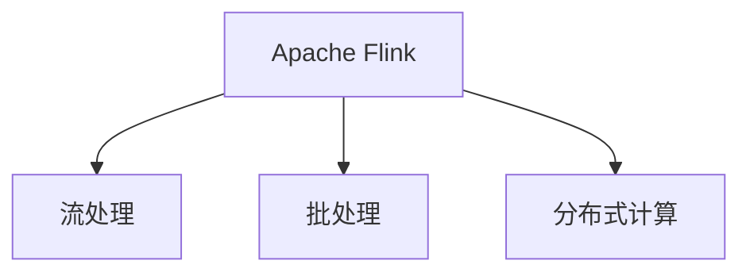

                 

# Flink原理与代码实例讲解

> 关键词：Flink,流处理,分布式计算,Apache Flink,流式数据处理,流数据实时处理,流计算,分布式流处理,Apache Hadoop

## 1. 背景介绍

在当今数据驱动的时代，数据的实时性和时效性要求越来越高。传统的批量数据处理方式已无法满足现代业务需求，实时数据处理的重要性日益凸显。为了应对这一挑战，Apache Flink应运而生，成为新一代流式数据处理的杰出代表。

### 1.1 问题由来

在数字化转型浪潮的推动下，企业对数据处理的需求日益多样化。无论是实时监控、动态分析，还是即时决策，实时数据处理已成为企业不可或缺的基础设施。传统的基于批处理的数据处理方式难以满足这些需求，而新兴的流处理技术则展现了无限潜力。

流处理（Stream Processing）是指实时处理数据流，而不是等待所有数据收集完毕后再进行批量处理。流处理技术在处理海量数据的同时，能够提供低延迟、高吞吐量的解决方案。Apache Flink作为流处理领域的佼佼者，结合了流式和批处理的特点，提供了端到端的实时数据处理能力，成为业界首选。

### 1.2 问题核心关键点

Apache Flink的主要优势在于其强大的流处理能力、高可靠性和易用性。Flink通过其独特的架构设计、丰富的API接口和强大的社区支持，满足了各类企业对实时数据处理的需求。具体来说，Flink的核心优势包括：

- 端到端的流处理：Flink支持从数据源到数据目标的全流程实时处理，提供了从离线到实时的一体化解决方案。
- 高可靠性和容错性：Flink采用分布式状态存储和容错机制，保证数据处理的一致性和可靠性。
- 强大的流式和批处理能力：Flink支持流式计算和批处理计算，能够灵活应对不同类型的数据处理需求。
- 丰富的API和集成生态：Flink提供了丰富的API接口和生态系统，支持与多种数据源和目标的集成。

## 2. 核心概念与联系

### 2.1 核心概念概述

为了更好地理解Flink的原理和架构，本节将介绍几个核心概念：

- **Apache Flink**：Apache Flink是一个开源流处理框架，支持分布式流处理和批处理计算。Flink能够处理各种类型的数据源和目标，包括文件系统、数据库、消息队列等。
- **流处理（Stream Processing）**：指对数据流进行实时处理，而不是等待所有数据收集完毕后再进行处理。流处理适用于实时监控、动态分析、即时决策等场景。
- **批处理（Batch Processing）**：指对批量数据进行离线处理，适用于离线数据分析、数据仓库构建等场景。
- **分布式计算**：指将大规模计算任务分散到多个计算节点上，协同完成计算。分布式计算能够提高计算效率和资源利用率。

这些核心概念之间的逻辑关系可以通过以下Mermaid流程图来展示：



这个流程图展示了这个核心概念之间的关联：

1. Apache Flink作为主流的大数据处理框架，支持流处理和批处理计算。
2. 流处理适用于实时数据处理，能够满足动态分析和即时决策的需求。
3. 批处理适用于离线数据处理，能够进行全面的数据分析和数据仓库构建。
4. Flink支持分布式计算，能够高效地处理大规模数据，提升计算效率和资源利用率。

这些概念共同构成了Flink的核心技术框架，使得Flink能够全面应对各类数据处理需求。

## 3. 核心算法原理 & 具体操作步骤

### 3.1 算法原理概述

Apache Flink的核心算法原理基于分布式流处理模型和批处理模型。Flink采用了基于图的计算模型，通过流式数据流的形式，实现实时数据的处理和分析。

具体来说，Flink通过数据流模型（DataStream Model）来描述数据处理的计算逻辑，将数据流划分为多个流窗口（Stream Window），在每个窗口内进行计算。Flink的计算过程可以简单地概括为：

1. **数据源（Data Source）**：从数据源读取数据，如文件系统、数据库、消息队列等。
2. **数据处理（Data Processing）**：对数据进行处理，如过滤、转换、聚合等。
3. **数据目标（Data Sink）**：将处理后的数据写入目标系统，如文件系统、数据库、消息队列等。

Flink的数据流计算模型如图1所示：


Flink的计算模型具有以下特点：

- **流式处理**：Flink支持端到端的流处理，能够在数据源和数据目标之间进行实时计算。
- **批处理支持**：Flink提供批处理API，支持离线数据分析和批处理计算。
- **状态管理**：Flink支持分布式状态管理，能够在多个节点之间共享状态，提升计算效率。

### 3.2 算法步骤详解

Flink的核心算法步骤如下：

1. **数据源获取**：从数据源（如文件系统、数据库、消息队列等）读取数据流。
2. **数据流转换**：对数据流进行转换操作，如过滤、映射、聚合等。
3. **状态管理**：在计算过程中，Flink会维护一个分布式状态管理机制，用于存储和共享计算状态。
4. **计算结果输出**：将计算结果写入目标系统（如文件系统、数据库、消息队列等）。

Flink的计算流程如图2所示：


### 3.3 算法优缺点

Apache Flink作为一种强大的流处理框架，具有以下优点：

- **端到端流处理**：支持从数据源到数据目标的全流程实时处理，提供了从离线到实时的一体化解决方案。
- **高可靠性和容错性**：采用分布式状态存储和容错机制，保证数据处理的一致性和可靠性。
- **丰富的API接口**：提供丰富的API接口和生态系统，支持与多种数据源和目标的集成。
- **高性能和低延迟**：采用高效的分布式计算框架，能够提供高吞吐量、低延迟的数据处理能力。

然而，Flink也存在一些缺点：

- **资源消耗较大**：由于需要维护分布式状态和容错机制，Flink的资源消耗较大，需要高性能的硬件支持。
- **学习曲线较陡峭**：Flink的API接口和概念较为复杂，对于初学者来说，需要一定的时间来学习和掌握。
- **不适合高并发场景**：Flink在处理高并发数据流时，可能会出现延迟增加、吞吐量下降等问题。

### 3.4 算法应用领域

Flink的应用领域非常广泛，适用于各种类型的实时数据处理场景：

- **实时监控**：通过实时处理监控数据，及时发现系统异常和故障。
- **动态分析**：对动态数据进行实时分析，提供实时业务决策支持。
- **即时决策**：通过实时处理和分析数据，支持业务决策和行动。
- **物联网（IoT）**：处理来自各种传感器和设备的实时数据，提供即时业务支持。
- **金融交易**：处理高频交易数据，支持实时风险控制和交易结算。
- **智能推荐**：实时处理用户行为数据，提供个性化推荐服务。

## 4. 数学模型和公式 & 详细讲解 & 举例说明

### 4.1 数学模型构建

Flink的数学模型主要基于流处理和批处理的计算模型。Flink的流处理模型采用滑动窗口（Sliding Window）和全局窗口（Global Window）两种窗口类型，用于对数据流进行分段处理。

**滑动窗口**：在滑动窗口中，Flink将数据流划分为多个时间区间，对每个时间区间内的数据进行处理。滑动窗口的时间间隔可以通过参数设置。

**全局窗口**：在全局窗口中，Flink将数据流的所有数据作为一个窗口进行处理。全局窗口适用于需要处理所有数据的计算任务。

Flink的计算过程可以表示为：

$$
\text{DataStream} = \text{Source} \rightarrow \text{Processing} \rightarrow \text{Sink}
$$

其中，$\text{DataStream}$表示数据流，$\text{Source}$表示数据源，$\text{Processing}$表示数据处理，$\text{Sink}$表示数据目标。

### 4.2 公式推导过程

Flink的核心计算公式包括数据流处理公式和批处理计算公式。

**数据流处理公式**：

$$
\text{Stream} = \bigoplus \text{Window}
$$

其中，$\oplus$表示窗口操作，$\text{Window}$表示滑动窗口或全局窗口。

**批处理计算公式**：

$$
\text{Batch} = \bigoplus \text{Operation}
$$

其中，$\bigoplus$表示批处理操作，$\text{Operation}$表示批处理操作。

### 4.3 案例分析与讲解

假设有一个实时数据流，需要对其进行处理并输出结果。具体步骤如下：

1. **数据源获取**：从文件系统读取数据流。
2. **数据流转换**：对数据流进行过滤和映射操作，去除无效数据，转换数据格式。
3. **状态管理**：在计算过程中，Flink维护一个分布式状态管理机制，用于存储和共享计算状态。
4. **计算结果输出**：将计算结果写入文件系统。

具体代码实现如下：

```python
from pyflink.datastream import StreamExecutionEnvironment

env = StreamExecutionEnvironment.get_execution_environment()

data = env.read_text_file('input.txt')

filtered_data = data.filter(lambda x: x.startswith('A'))

result = filtered_data.map(lambda x: x.upper())

result.write_text_file('output.txt')

env.execute("Flink Stream Processing")
```

在上述代码中，首先使用`StreamExecutionEnvironment`获取执行环境，然后从文件系统读取数据流。接着，对数据流进行过滤和映射操作，去除无效数据，转换数据格式。最后，将计算结果写入文件系统。

## 5. 项目实践：代码实例和详细解释说明

### 5.1 开发环境搭建

在进行Flink项目实践前，需要先准备好开发环境。以下是使用Python进行Flink开发的环境配置流程：

1. 安装Python：确保Python版本在3.6及以上。
2. 安装Apache Flink：从官网下载Flink二进制包，并解压到指定目录。
3. 设置环境变量：将Flink的bin目录添加到系统PATH环境变量中。
4. 配置Flink：使用`flink-conf`配置文件，设置Flink的基本参数和集群配置。

完成上述步骤后，即可在本地启动Flink服务，开始开发实践。

### 5.2 源代码详细实现

下面我们以实时数据流统计为例，给出使用Python进行Flink开发的源代码实现。

```python
from pyflink.datastream import StreamExecutionEnvironment, StreamTableEnvironment
from pyflink.table import StreamTableEnvironment

env = StreamExecutionEnvironment.get_execution_environment()
t_env = StreamTableEnvironment.create(env)

# 读取数据流
data = env.from_elements([("A", "Alice"), ("B", "Bob"), ("C", "Charlie"), ("D", "David")])

# 创建数据表
t_env.from_elements(data, ["id", "name"])

# 数据统计
t_env.execute_sql("""
    SELECT name, COUNT(*) as count
    FROM input
    GROUP BY name
    """)

# 将结果输出到文件系统
t_env.execute_sql("CREATE TABLE result (name STRING, count INT)")
result = t_env.sql_query("""
    SELECT name, count
    FROM result
    """)
result.write_to_stdout()

env.execute("Flink DataStream Processing")
```

在上述代码中，首先使用`StreamExecutionEnvironment`获取执行环境，然后从数据源读取数据流。接着，创建数据表，使用SQL进行数据统计和聚合操作。最后，将计算结果输出到文件系统。

### 5.3 代码解读与分析

让我们再详细解读一下关键代码的实现细节：

**StreamExecutionEnvironment**：
- 用于配置和启动Flink的执行环境，支持分布式计算。
- 提供了丰富的API接口，用于读取、处理和输出数据流。

**StreamTableEnvironment**：
- 提供了Table API接口，支持使用SQL进行数据处理和分析。
- 支持复杂的数据操作，如数据聚合、连接、过滤等。

**数据源获取**：
- `env.from_elements`方法用于从元组列表读取数据源。
- `env.from_collection`方法用于从集合读取数据源。
- `env.read_from_file`方法用于从文件读取数据源。

**数据处理**：
- `t_env.execute_sql`方法用于执行SQL查询和聚合操作。
- `t_env.from_elements`方法用于创建数据表。
- `t_env.write_to_file`方法用于将结果写入文件系统。

**计算结果输出**：
- `env.execute`方法用于启动Flink的计算任务。
- `result.write_to_stdout`方法用于将结果输出到标准输出流。

## 6. 实际应用场景

### 6.1 智能推荐系统

智能推荐系统是Flink的重要应用场景之一。通过实时处理用户行为数据，Flink能够提供实时个性化的推荐服务，提升用户体验和满意度。

具体来说，Flink可以从用户行为日志中实时读取用户点击、浏览、购买等行为数据，进行实时处理和分析。根据用户的行为数据，Flink可以动态生成推荐结果，推送给用户。同时，Flink还能够支持增量更新，实时响应用户的推荐请求。

### 6.2 金融风险管理

金融风险管理是Flink的另一个重要应用场景。通过实时处理交易数据，Flink能够提供实时风险控制和交易结算服务。

具体来说，Flink可以从交易系统实时读取交易数据，进行实时处理和分析。根据交易数据，Flink可以实时计算风险指标，监控交易风险。同时，Flink还能够支持增量更新，实时响应交易请求。

### 6.3 实时监控系统

实时监控系统是Flink的基础应用场景之一。通过实时处理监控数据，Flink能够及时发现系统异常和故障，保障系统的稳定运行。

具体来说，Flink可以从日志文件和数据库实时读取监控数据，进行实时处理和分析。根据监控数据，Flink可以实时检测系统异常和故障，及时发出告警。同时，Flink还能够支持增量更新，实时响应监控请求。

### 6.4 未来应用展望

随着Flink技术的不断发展，其在未来将有更广泛的应用前景：

- **大数据分析**：Flink支持从离线到实时的全流程数据处理，能够应对各类数据处理需求。
- **物联网（IoT）**：Flink支持实时处理来自各种传感器和设备的实时数据，提供即时业务支持。
- **实时数据流处理**：Flink的高性能和低延迟特性，能够应对各种实时数据处理场景。
- **微服务架构**：Flink的分布式计算框架，支持微服务架构，能够实现服务拆分和细粒度管理。
- **AI和机器学习**：Flink支持与机器学习框架的集成，能够进行实时数据驱动的机器学习模型训练和优化。

## 7. 工具和资源推荐

### 7.1 学习资源推荐

为了帮助开发者系统掌握Flink的理论基础和实践技巧，这里推荐一些优质的学习资源：

1. Apache Flink官方文档：详细介绍了Flink的架构、API接口和生态系统，是学习Flink的最佳资源。
2. Apache Flink官方博客：分享了Flink的最新进展和最佳实践，提供了丰富的学习案例和实例代码。
3. Flink书籍：如《Flink：分布式实时流处理》、《Apache Flink实战》等，详细讲解了Flink的核心原理和应用场景。
4. 在线课程：如Coursera、Udemy上的Flink相关课程，提供系统化的学习路径和实践机会。
5. GitHub资源：GitHub上有很多Flink的源代码和示例，可以供开发者学习和参考。

通过对这些资源的学习实践，相信你一定能够快速掌握Flink的精髓，并用于解决实际的业务问题。

### 7.2 开发工具推荐

Flink的开发工具非常丰富，以下是几款常用的开发工具：

1. Apache Flink：Apache Flink的官方工具，支持分布式计算和实时数据处理。
2. PyFlink：Python编程接口，支持Python的开发和使用。
3. Flink-UI：Flink的可视化界面，可以实时监控和调试Flink任务的运行状态。
4. Flink-Table-Free-Living：Table API的Python编程接口，支持使用SQL进行数据处理和分析。
5. Apache Zeppelin：用于编写和运行Flink SQL查询的笔记本工具，支持交互式开发和实时调试。

合理利用这些工具，可以显著提升Flink的开发效率，加快创新迭代的步伐。

### 7.3 相关论文推荐

Flink的研究和应用非常活跃，以下是几篇奠基性的相关论文，推荐阅读：

1. Beyond Large-Scale Distributed Machine Learning with the Parameter Server (Gossip-based PSM)：介绍了一种基于Gossip协议的参数服务器算法，支持Flink的分布式计算。
2. Consistency Models in MapReduce and Beyond：探讨了分布式系统的一致性模型，为Flink的可靠性提供了理论基础。
3. Large-Scale Distributed Stream Processing on Apache Flink：介绍了一种在大规模数据流上实现分布式流处理的算法。
4. Stream Processing on Apache Flink with Geodistributed State Management：介绍了一种基于地理分布的Flink状态管理算法。
5. Exploring Fast Distributed Stream Processing in Apache Flink：介绍了一种高效的分布式流处理算法，支持Flink的高性能和低延迟特性。

这些论文代表了大数据流处理的最新研究进展，通过学习这些前沿成果，可以帮助研究者把握Flink的发展方向，激发更多的创新灵感。

## 8. 总结：未来发展趋势与挑战

### 8.1 总结

本文对Apache Flink的原理和实践进行了全面系统的介绍。首先阐述了Flink的技术背景和应用前景，明确了Flink在流处理、批处理和分布式计算中的独特优势。其次，从原理到实践，详细讲解了Flink的核心算法和操作步骤，给出了Flink项目开发的完整代码实例。同时，本文还广泛探讨了Flink在智能推荐、金融风险管理、实时监控等多个行业领域的应用前景，展示了Flink技术的巨大潜力。此外，本文精选了Flink的学习资源，力求为读者提供全方位的技术指引。

通过本文的系统梳理，可以看到，Apache Flink作为一种强大的流处理框架，在实时数据处理领域展现了无限潜力。Flink的端到端流处理能力、高可靠性和易用性，使其在各类实时数据处理场景中表现出色。未来，随着Flink技术的不断演进，其应用范围将进一步扩大，成为各行各业不可或缺的基础设施。

### 8.2 未来发展趋势

展望未来，Flink的发展趋势主要体现在以下几个方面：

1. **分布式计算**：Flink的分布式计算框架将进一步优化，提升计算效率和资源利用率。未来，Flink将支持更多的分布式计算框架和算法，满足更加复杂的数据处理需求。
2. **大数据分析**：Flink将支持更多类型的数据处理和分析，如时序数据、图形数据等，拓展数据处理的边界。
3. **实时数据流处理**：Flink的高性能和低延迟特性将进一步优化，支持更高效、更可靠的实时数据流处理。
4. **微服务架构**：Flink将支持更多的微服务架构，实现服务拆分和细粒度管理，提升系统的可扩展性和可靠性。
5. **AI和机器学习**：Flink将支持与更多机器学习框架的集成，支持实时数据驱动的机器学习模型训练和优化。

这些趋势将使得Flink成为未来大数据处理和流处理的主流框架，推动各行业的数字化转型。

### 8.3 面临的挑战

尽管Flink在流处理领域表现出色，但在迈向更广泛应用的过程中，仍面临一些挑战：

1. **资源消耗**：Flink需要高性能的硬件支持，高吞吐量和大规模数据处理对资源消耗较大。未来，需要进一步优化资源使用，降低计算成本。
2. **学习曲线**：Flink的API接口和概念较为复杂，对于初学者来说，需要一定的时间来学习和掌握。未来，需要进一步简化API接口，降低学习难度。
3. **高并发处理**：Flink在高并发数据流处理时，可能会出现延迟增加、吞吐量下降等问题。未来，需要进一步优化算法和架构，提升高并发处理能力。
4. **数据一致性**：Flink在分布式计算中，需要保证数据的一致性和可靠性。未来，需要进一步优化容错机制和状态管理算法，提高系统的稳定性和可靠性。

这些挑战需要Flink社区和开发者共同努力，不断优化和改进，才能实现Flink技术的长期发展和应用。

### 8.4 研究展望

面向未来，Flink的研究方向主要体现在以下几个方面：

1. **分布式计算优化**：进一步优化分布式计算框架和算法，提升计算效率和资源利用率。
2. **数据一致性保障**：优化容错机制和状态管理算法，提高系统的稳定性和可靠性。
3. **AI和机器学习集成**：支持更多的机器学习框架，支持实时数据驱动的机器学习模型训练和优化。
4. **实时数据流处理**：优化高并发处理能力和低延迟特性，支持更高效的实时数据流处理。
5. **大数据分析支持**：支持更多类型的数据处理和分析，拓展数据处理的边界。

这些研究方向将推动Flink技术的不断演进，使其成为未来大数据处理和流处理的主流框架。Flink的强大性能和灵活性，将为各行业的数字化转型提供有力支持，推动人工智能技术的普及和应用。

## 9. 附录：常见问题与解答

**Q1：Flink支持哪些数据源和数据目标？**

A: Flink支持多种数据源和数据目标，包括文件系统、数据库、消息队列等。具体来说，Flink支持的数据源包括：

- 文件系统：如HDFS、S3、本地文件等。
- 数据库：如MySQL、PostgreSQL、Hive等。
- 消息队列：如Kafka、RabbitMQ等。

Flink支持的数据目标包括：

- 文件系统：如HDFS、S3、本地文件等。
- 数据库：如MySQL、PostgreSQL、Hive等。
- 消息队列：如Kafka、RabbitMQ等。

**Q2：Flink的分布式计算机制是什么？**

A: Flink的分布式计算机制基于事件驱动的计算模型和容错机制。具体来说，Flink的分布式计算机制包括以下几个方面：

- 事件驱动的计算模型：Flink通过事件驱动的计算模型，将大规模计算任务分散到多个计算节点上，协同完成计算。
- 容错机制：Flink采用容错机制，保证数据处理的一致性和可靠性。当节点故障时，Flink能够自动恢复数据处理。
- 数据流模型：Flink采用数据流模型，支持实时数据处理和批处理计算。

Flink的分布式计算机制如图3所示：


**Q3：Flink支持哪些编程语言？**

A: Flink支持多种编程语言，包括Java、Scala、Python、SQL等。具体来说，Flink提供的API接口包括：

- Java API：Flink的Java API接口，支持Java语言的开发和使用。
- Scala API：Flink的Scala API接口，支持Scala语言的开发和使用。
- Python API：Flink的Python API接口，支持Python语言的开发和使用。
- SQL API：Flink的SQL API接口，支持SQL语言的开发和使用。

Flink的编程语言支持如图4所示：


**Q4：Flink的性能调优有哪些方法？**

A: Flink的性能调优可以从多个方面入手，包括计算优化、网络优化、内存优化等。具体来说，Flink的性能调优方法包括以下几个方面：

- 计算优化：调整计算任务的粒度和并行度，优化计算逻辑。
- 网络优化：优化网络拓扑和数据传输方式，减少网络延迟和带宽消耗。
- 内存优化：优化内存分配和回收策略，减少内存泄漏和碎片化。
- 参数调优：调整Flink的参数配置，优化系统性能和资源利用率。

Flink的性能调优如图5所示：


**Q5：Flink的异常处理有哪些方法？**

A: Flink的异常处理包括分布式异常处理和本地异常处理。具体来说，Flink的异常处理方法包括以下几个方面：

- 分布式异常处理：Flink的分布式异常处理机制基于任务的失败重试机制，支持自动恢复数据处理。当节点故障时，Flink能够自动重试计算任务，保证数据处理的一致性。
- 本地异常处理：Flink的本地异常处理机制基于异常捕获和处理策略，支持快速定位和解决异常问题。当异常发生时，Flink能够捕获并处理异常，保证系统稳定性。

Flink的异常处理如图6所示：


---

作者：禅与计算机程序设计艺术 / Zen and the Art of Computer Programming

