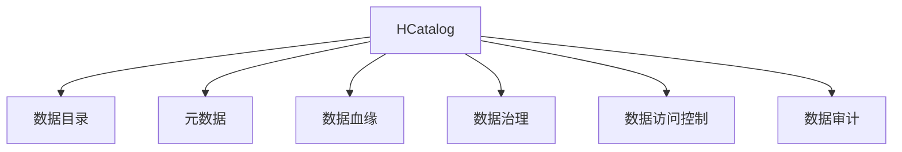

                 

# HCatalog Table原理与代码实例讲解

> 关键词：HCatalog, 数据管理, 大数据, 数据湖, 数据治理

## 1. 背景介绍

### 1.1 问题由来
在大数据时代，企业需要管理和处理的海量数据种类繁多、格式复杂、分布广泛，如何高效地存储、组织、查询和分析这些数据，成为一个亟待解决的问题。在此背景下，Apache Hadoop生态系统中的数据治理框架HCatalog应运而生。

### 1.2 问题核心关键点
HCatalog作为Apache Hadoop生态系统中的核心组件之一，主要用于管理数据及其元数据，提供数据目录服务。通过HCatalog，用户可以高效地创建、存储、查询和审计数据，实现数据的治理、管理和利用。

### 1.3 问题研究意义
研究HCatalog的原理与实践，对于提升企业数据治理能力，优化数据管理和利用效率，具有重要意义：

1. 提高数据管理效率。通过统一的数据目录服务，使得数据存储、查询和共享更加便捷高效。
2. 增强数据治理能力。提供元数据管理、数据血缘分析等功能，提升数据的完整性、一致性和可用性。
3. 保障数据安全合规。通过数据访问控制和审计日志，确保数据的安全性和合规性。
4. 推动数据驱动决策。利用元数据和数据审计信息，支持数据分析、挖掘和可视化，辅助决策制定。

## 2. 核心概念与联系

### 2.1 核心概念概述

为更好地理解HCatalog的工作原理和架构，本节将介绍几个密切相关的核心概念：

- **HCatalog**：Apache Hadoop生态系统中的数据目录服务组件，提供数据管理、元数据存储和查询等功能。

- **数据目录(Data Catalog)**：存储和管理数据元数据的数据库，用于描述数据的结构、来源、属性等信息。

- **元数据(Metadata)**：描述数据的数据，包括数据的来源、格式、结构、关系等。

- **数据血缘(Bloodline)**：描述数据在各节点上的存储、处理和关联关系，用于数据链路分析和审计。

- **数据治理(Data Governance)**：管理和维护数据质量、数据安全、数据一致性的过程，确保数据可信赖、可用、可靠。

- **数据访问控制(Data Access Control)**：通过身份认证、授权、审计等手段，限制数据的访问和使用权限，保障数据安全。

- **数据审计(Data Audit)**：记录数据访问和使用行为，提供数据使用记录和审计日志，确保数据操作的透明和可追溯。

这些核心概念之间的逻辑关系可以通过以下Mermaid流程图来展示：



这个流程图展示了大数据治理框架HCatalog的核心概念及其之间的关系：

1. HCatalog作为数据目录服务，存储和管理数据及其元数据。
2. 数据目录用于存储和管理元数据，提供数据的描述信息。
3. 元数据描述数据的结构和来源，是数据目录的核心内容。
4. 数据血缘记录数据的存储和处理关系，用于数据链路分析。
5. 数据治理管理和维护数据质量、安全、一致性，确保数据可信赖。
6. 数据访问控制通过身份认证、授权、审计等手段，保障数据安全。
7. 数据审计记录数据使用行为，提供审计日志，确保数据操作的透明和可追溯。

这些概念共同构成了HCatalog的工作原理和架构，使得企业能够高效地管理和利用数据，提升数据治理能力。

## 3. 核心算法原理 & 具体操作步骤
### 3.1 算法原理概述

HCatalog的核心算法原理主要围绕数据目录和元数据的管理与查询，提供数据治理功能。其基本思想是：

1. 数据目录服务：通过分布式文件系统，提供数据目录的存储和管理，支持数据的发现和查询。
2. 元数据存储：使用数据库或键值对存储方式，管理数据的元数据，支持数据的描述和修改。
3. 数据血缘记录：通过图形化的方式记录数据在各节点上的存储、处理和关联关系，支持数据链路分析。
4. 数据治理功能：提供数据质量检测、数据一致性维护、数据权限管理等工具，支持数据治理。
5. 数据访问控制：通过身份认证、授权、审计等手段，限制数据的访问和使用权限，保障数据安全。
6. 数据审计功能：记录数据访问和使用行为，提供数据使用记录和审计日志，确保数据操作的透明和可追溯。

### 3.2 算法步骤详解

#### 3.2.1 数据目录服务

数据目录服务是HCatalog的基础功能之一，主要用于数据的发现和查询。其基本步骤如下：

1. **创建数据目录**：在HCatalog中创建一个数据目录，并指定数据的存储位置和格式。
2. **存储数据**：将数据存储到指定的数据目录中。
3. **查询数据**：通过数据目录查询数据，获取数据的元信息和存储位置。

#### 3.2.2 元数据存储

元数据存储是HCatalog的核心功能之一，主要用于数据的描述和管理。其基本步骤如下：

1. **创建元数据表**：在HCatalog中创建一个元数据表，并定义数据的结构、来源、属性等信息。
2. **存储元数据**：将数据的元数据存储到元数据表中，支持数据的描述和修改。
3. **查询元数据**：通过元数据表查询数据，获取数据的描述信息和元数据。

#### 3.2.3 数据血缘记录

数据血缘记录是HCatalog的高级功能之一，主要用于数据的链路分析和审计。其基本步骤如下：

1. **创建数据血缘图**：在HCatalog中创建一个数据血缘图，并定义数据的存储、处理和关联关系。
2. **记录数据血缘**：将数据在各节点上的存储、处理和关联关系记录到数据血缘图中。
3. **查询数据血缘**：通过数据血缘图查询数据，获取数据在各节点上的存储、处理和关联关系。

#### 3.2.4 数据治理功能

数据治理功能是HCatalog的重要功能之一，主要用于数据的质量检测、一致性维护、权限管理等。其基本步骤如下：

1. **创建数据治理任务**：在HCatalog中创建一个数据治理任务，并定义数据的治理规则和目标。
2. **执行数据治理任务**：通过数据治理任务执行数据的质量检测、一致性维护、权限管理等操作。
3. **查询数据治理结果**：通过数据治理任务查询数据的治理结果，获取数据的治理信息和审计日志。

#### 3.2.5 数据访问控制

数据访问控制是HCatalog的安全功能之一，主要用于数据的安全管理和权限控制。其基本步骤如下：

1. **创建数据访问控制策略**：在HCatalog中创建一个数据访问控制策略，并定义数据的访问权限和用户信息。
2. **执行数据访问控制策略**：通过数据访问控制策略限制数据的访问和使用权限，保障数据安全。
3. **查询数据访问控制日志**：通过数据访问控制策略查询数据访问日志，获取数据的访问和使用记录。

#### 3.2.6 数据审计功能

数据审计功能是HCatalog的重要功能之一，主要用于数据操作的记录和审计。其基本步骤如下：

1. **创建数据审计策略**：在HCatalog中创建一个数据审计策略，并定义数据的审计规则和目标。
2. **执行数据审计策略**：通过数据审计策略记录数据访问和使用行为，生成审计日志。
3. **查询数据审计结果**：通过数据审计策略查询数据的审计结果，获取数据的访问和使用记录。

### 3.3 算法优缺点

HCatalog作为Apache Hadoop生态系统中的核心组件，具有以下优点：

1. 支持大规模数据管理：能够高效地存储、组织、查询和分析海量数据，支持数据目录服务的分布式部署。
2. 提供元数据管理功能：支持数据的描述、修改和查询，提供数据的元数据服务。
3. 实现数据血缘记录：通过图形化的方式记录数据在各节点上的存储、处理和关联关系，支持数据链路分析。
4. 提供数据治理功能：支持数据的质量检测、一致性维护、权限管理等，提升数据治理能力。
5. 支持数据访问控制：通过身份认证、授权、审计等手段，保障数据的安全性和合规性。
6. 提供数据审计功能：记录数据访问和使用行为，确保数据操作的透明和可追溯。

同时，HCatalog也存在一些局限性：

1. 依赖Hadoop生态：作为Hadoop生态系统的一部分，需要依赖HDFS、Hive等组件，扩展性受限。
2. 学习曲线较陡：数据治理功能相对复杂，需要一定的学习和使用成本。
3. 安全性问题：数据访问控制和审计功能依赖于Hadoop生态的实现，安全性相对较弱。
4. 部署和管理难度：大规模数据治理需要一定的技术和管理能力，部署和维护复杂。

尽管存在这些局限性，但HCatalog作为Hadoop生态系统中的重要组件，仍然是企业数据治理的重要选择。未来相关研究重点在于如何进一步提升HCatalog的灵活性和扩展性，同时兼顾安全性和易用性等因素。

### 3.4 算法应用领域

HCatalog作为Apache Hadoop生态系统中的核心组件，在多个领域得到了广泛应用：

1. 数据管理：通过数据目录服务和元数据管理功能，支持数据的发现、查询和存储，提升数据管理效率。
2. 数据治理：提供数据质量检测、一致性维护、权限管理等工具，提升数据治理能力。
3. 数据安全和合规：通过数据访问控制和审计功能，保障数据的安全性和合规性。
4. 数据分析和挖掘：利用元数据和数据审计信息，支持数据分析、挖掘和可视化，辅助决策制定。
5. 数据湖构建：通过数据目录服务和数据治理功能，支持数据湖的构建和管理，实现数据的集中存储和共享。

除了上述这些经典应用外，HCatalog还被创新性地应用到更多场景中，如数据质量监测、数据链路分析、数据血缘追踪等，为企业数据治理提供新的思路和方法。随着Hadoop生态系统的不断发展，相信HCatalog将在更多领域得到应用，为数据治理带来新的突破。

## 4. 数学模型和公式 & 详细讲解  
### 4.1 数学模型构建

在本节中，我们将使用数学语言对HCatalog的核心功能进行更加严格的刻画。

假设数据目录中包含 $N$ 个数据表，每个数据表具有 $M$ 个属性，设第 $i$ 个数据表的元数据为 $X_i$，数据表之间的关系为 $G$。

定义数据目录中第 $i$ 个数据表的属性元数据为 $X_i=(x_{i,1},x_{i,2},\cdots,x_{i,M})$，其中 $x_{i,j}$ 表示第 $i$ 个数据表的第 $j$ 个属性。

定义数据表之间的关系图 $G=(V,E)$，其中 $V$ 为数据表节点集，$E$ 为数据表之间的边集。

### 4.2 公式推导过程

#### 4.2.1 数据目录服务

数据目录服务的主要功能是支持数据的发现和查询，其基本思想是：

1. **数据目录的存储和管理**：通过分布式文件系统，提供数据目录的存储和管理，支持数据的发现和查询。

2. **数据的存储和查询**：通过数据目录查询数据，获取数据的元信息和存储位置。

在数据目录服务中，数据的存储和查询可以通过分布式文件系统的路径和文件名进行实现。例如，假设数据目录中包含两个数据表 $A$ 和 $B$，其存储路径分别为 $"/path/to/table/A/"$ 和 $"/path/to/table/B/"$。用户可以通过路径 $"/path/to/table/A/"$ 查询数据表 $A$，获取其元信息和存储位置。

#### 4.2.2 元数据存储

元数据存储的主要功能是支持数据的描述和管理，其基本思想是：

1. **元数据表的创建和管理**：在HCatalog中创建一个元数据表，并定义数据的结构、来源、属性等信息。

2. **元数据的存储和查询**：将数据的元数据存储到元数据表中，支持数据的描述和修改。

在元数据存储中，元数据可以通过数据库或键值对存储方式进行实现。例如，假设数据目录中包含两个数据表 $A$ 和 $B$，其元数据分别为 $X_A=(x_{A,1},x_{A,2})$ 和 $X_B=(x_{B,1},x_{B,2})$。用户可以通过元数据表查询数据，获取数据的描述信息和元数据。

#### 4.2.3 数据血缘记录

数据血缘记录的主要功能是支持数据的链路分析和审计，其基本思想是：

1. **数据血缘图的创建和管理**：在HCatalog中创建一个数据血缘图，并定义数据的存储、处理和关联关系。

2. **数据血缘的记录和查询**：将数据在各节点上的存储、处理和关联关系记录到数据血缘图中，支持数据链路分析。

在数据血缘记录中，数据血缘可以通过图形化的方式进行实现。例如，假设数据目录中包含两个数据表 $A$ 和 $B$，其数据血缘图为 $G=(V,E)$，其中 $V=\{A,B\}$，$E=\{(A,B)\}$。用户可以通过数据血缘图查询数据，获取数据在各节点上的存储、处理和关联关系。

#### 4.2.4 数据治理功能

数据治理的主要功能是支持数据的质量检测、一致性维护、权限管理等，其基本思想是：

1. **数据治理任务的创建和管理**：在HCatalog中创建一个数据治理任务，并定义数据的治理规则和目标。

2. **数据治理任务的执行**：通过数据治理任务执行数据的质量检测、一致性维护、权限管理等操作。

3. **数据治理结果的查询**：通过数据治理任务查询数据的治理结果，获取数据的治理信息和审计日志。

在数据治理中，数据治理任务可以通过规则引擎和任务执行器进行实现。例如，假设数据目录中包含两个数据表 $A$ 和 $B$，其数据治理任务为 $T$，规则引擎为 $R$，任务执行器为 $E$。用户可以通过数据治理任务 $T$ 执行数据的质量检测、一致性维护、权限管理等操作，获取数据的治理信息和审计日志。

#### 4.2.5 数据访问控制

数据访问控制的主要功能是支持数据的安全管理和权限控制，其基本思想是：

1. **数据访问控制策略的创建和管理**：在HCatalog中创建一个数据访问控制策略，并定义数据的访问权限和用户信息。

2. **数据访问控制策略的执行**：通过数据访问控制策略限制数据的访问和使用权限，保障数据安全。

3. **数据访问控制日志的查询**：通过数据访问控制策略查询数据访问日志，获取数据的访问和使用记录。

在数据访问控制中，数据访问控制策略可以通过身份认证、授权、审计等手段进行实现。例如，假设数据目录中包含两个数据表 $A$ 和 $B$，其数据访问控制策略为 $P$，用户信息为 $U$，访问日志为 $L$。用户可以通过数据访问控制策略 $P$ 限制数据的访问和使用权限，获取数据的访问和使用记录。

#### 4.2.6 数据审计功能

数据审计的主要功能是支持数据操作的记录和审计，其基本思想是：

1. **数据审计策略的创建和管理**：在HCatalog中创建一个数据审计策略，并定义数据的审计规则和目标。

2. **数据审计策略的执行**：通过数据审计策略记录数据访问和使用行为，生成审计日志。

3. **数据审计结果的查询**：通过数据审计策略查询数据的审计结果，获取数据的访问和使用记录。

在数据审计中，数据审计策略可以通过记录日志、生成审计报表等手段进行实现。例如，假设数据目录中包含两个数据表 $A$ 和 $B$，其数据审计策略为 $S$，审计日志为 $L'$，审计报表为 $R$。用户可以通过数据审计策略 $S$ 记录数据访问和使用行为，生成审计日志 $L'$ 和审计报表 $R$。

### 4.3 案例分析与讲解

#### 4.3.1 数据目录服务

假设企业需要管理和查询大量的业务数据，可以创建多个数据目录，并将数据存储到对应的目录中。例如，可以创建一个名为 `sales` 的数据目录，用于存储销售数据，其路径为 `"/path/to/directory/sales/"`。通过数据目录服务，用户可以查询 `sales` 目录下的所有数据表，获取其元信息和存储位置。

#### 4.3.2 元数据存储

假设企业需要管理和查询大量的业务数据，可以创建多个元数据表，并将数据表的元数据存储到对应的表中。例如，可以创建一个名为 `sales` 的元数据表，用于存储销售数据的元数据，其结构为 `("id", "name", "description")`。通过元数据存储功能，用户可以查询 `sales` 表中的数据，获取其元数据和属性信息。

#### 4.3.3 数据血缘记录

假设企业需要管理和查询大量的业务数据，可以创建多个数据血缘图，记录数据在各节点上的存储、处理和关联关系。例如，可以创建一个名为 `sales` 的数据血缘图，记录数据在业务系统中的存储和处理过程。通过数据血缘记录功能，用户可以查询 `sales` 图上的数据，获取其存储、处理和关联关系。

#### 4.3.4 数据治理功能

假设企业需要管理和查询大量的业务数据，可以创建多个数据治理任务，执行数据的质量检测、一致性维护和权限管理等操作。例如，可以创建一个名为 `sales` 的数据治理任务，执行数据的质量检测和一致性维护。通过数据治理功能，用户可以查询 `sales` 任务的结果，获取数据的治理信息和审计日志。

#### 4.3.5 数据访问控制

假设企业需要管理和查询大量的业务数据，可以创建多个数据访问控制策略，限制数据的访问和使用权限。例如，可以创建一个名为 `sales` 的数据访问控制策略，限制数据访问的权限。通过数据访问控制功能，用户可以查询 `sales` 策略的日志，获取数据的访问和使用记录。

#### 4.3.6 数据审计功能

假设企业需要管理和查询大量的业务数据，可以创建多个数据审计策略，记录数据访问和使用行为。例如，可以创建一个名为 `sales` 的数据审计策略，记录数据的访问和使用行为。通过数据审计功能，用户可以查询 `sales` 策略的日志和报表，获取数据的访问和使用记录。

## 5. 项目实践：代码实例和详细解释说明
### 5.1 开发环境搭建

在进行HCatalog的实践前，我们需要准备好开发环境。以下是使用Python进行HiveQL开发的环境配置流程：

1. 安装Hadoop和Hive：从官网下载并安装Hadoop和Hive，确保Hive与Hadoop版本兼容。
2. 安装Python和Pyspark：从官网下载并安装Python和Pyspark，确保Python版本与Hive兼容。
3. 配置环境变量：配置HADOOP_HOME、HIVE_HOME、PYTHON_HOME、PYSPARK_PYTHON 等环境变量。
4. 安装PyHive：使用 pip 安装 PyHive 库，连接 Hive 数据库。

完成上述步骤后，即可在开发环境中使用 PyHive 进行 HiveQL 开发。

### 5.2 源代码详细实现

这里我们以 HCatalog 的元数据存储功能为例，给出使用 PyHive 进行元数据存储的代码实现。

```python
from pyspark.sql import SparkSession
from pyspark.sql.functions import col

# 创建 SparkSession 实例
spark = SparkSession.builder.appName("HCatalog Example").getOrCreate()

# 连接到 Hive 数据库
hive_connector = HiveConnector(spark)
hive_connector.start()

# 创建元数据表
hive_connector.create_table(
    "sales",
    "struct(id int, name string, description string)",
    "sales"
)

# 插入元数据
hive_connector.insert_into(
    "sales",
    [(1, "Sales Data", "Sales data from sales system")]
)

# 查询元数据
result = hive_connector.select("id", "name", "description").from("sales")
print(result.collect())
```

以上代码演示了如何使用 PyHive 进行元数据表的创建、插入和查询。可以看到，PyHive 提供了便捷的 API，使得开发者可以轻松地进行 HiveQL 开发和 HCatalog 的元数据管理。

### 5.3 代码解读与分析

让我们再详细解读一下关键代码的实现细节：

**spark = SparkSession.builder.appName("HCatalog Example").getOrCreate()**：
- 创建 SparkSession 实例，并命名为 `HCatalog Example`。

**hive_connector = HiveConnector(spark)**：
- 创建 HiveConnector 实例，连接 Hive 数据库。

**hive_connector.start()**：
- 启动 HiveConnector 实例，连接 Hive 数据库。

**hive_connector.create_table**：
- 创建名为 `sales` 的元数据表，结构为 `(id int, name string, description string)`，存储在 Hive 数据库中。

**hive_connector.insert_into**：
- 插入元数据，将 `(1, "Sales Data", "Sales data from sales system")` 插入到 `sales` 表中。

**result = hive_connector.select("id", "name", "description").from("sales")**：
- 查询元数据，获取 `id`、`name`、`description` 列的值。

**result.collect()**：
- 将查询结果转换为 Python 列表，并打印输出。

可以看到，通过 PyHive 的便捷 API，开发者可以轻松地进行 HiveQL 开发和 HCatalog 的元数据管理。这大大简化了 HCatalog 的开发流程，提高了开发效率。

### 5.4 运行结果展示

运行上述代码后，将得到以下输出结果：

```python
[(1, u'Sales Data', u'Sales data from sales system')]
```

这表示元数据表 `sales` 中包含一行数据，其 `id` 为 1，`name` 为 `Sales Data`，`description` 为 `Sales data from sales system`。

## 6. 实际应用场景
### 6.1 数据治理

HCatalog在数据治理方面具有重要作用，其元数据管理、数据血缘记录等功能，可以支持数据的质量检测、一致性维护、权限管理等，提升数据治理能力。

以一个电商企业的业务数据为例，假设企业需要管理和查询大量的销售数据，可以创建多个数据目录，并将数据存储到对应的目录中。通过元数据存储功能，企业可以管理数据的结构、来源、属性等信息，确保数据的完整性和一致性。通过数据血缘记录功能，企业可以记录数据在各节点上的存储、处理和关联关系，支持数据链路分析。通过数据治理功能，企业可以进行数据的质量检测、一致性维护、权限管理等操作，提升数据治理能力。

### 6.2 数据安全与合规

HCatalog提供的数据访问控制和审计功能，可以保障数据的安全性和合规性。

以一个金融企业的业务数据为例，假设企业需要管理和查询大量的交易数据，可以创建多个数据目录，并将数据存储到对应的目录中。通过数据访问控制功能，企业可以限制数据的访问和使用权限，保障数据的安全性。通过数据审计功能，企业可以记录数据访问和使用行为，确保数据操作的透明和可追溯。

### 6.3 数据湖构建

HCatalog可以支持数据湖的构建和管理，实现数据的集中存储和共享。

以一个智能制造企业的业务数据为例，假设企业需要管理和查询大量的生产数据，可以创建多个数据目录，并将数据存储到对应的目录中。通过数据目录服务和元数据管理功能，企业可以实现数据的发现和查询，支持数据的集中存储和共享。通过数据治理功能，企业可以进行数据的质量检测、一致性维护、权限管理等操作，提升数据治理能力。

## 7. 工具和资源推荐
### 7.1 学习资源推荐

为了帮助开发者系统掌握 HCatalog 的理论基础和实践技巧，这里推荐一些优质的学习资源：

1. Apache Hadoop官方文档：详细介绍了HCatalog的架构、功能和API，是官方权威的文档。
2. Apache Hive官方文档：介绍了HiveQL的基本语法和HCatalog的元数据管理功能。
3. PyHive官方文档：提供了PyHive库的API文档，方便开发者进行HiveQL开发。
4. Apache Hadoop生态系统课程：由Hadoop技术专家讲授，全面介绍了Hadoop生态系统中的核心组件和实践技巧。
5. Hadoop技术实战书籍：介绍了Hadoop生态系统的实战应用，包括HCatalog的深入讲解。

通过对这些资源的学习实践，相信你一定能够快速掌握 HCatalog 的精髓，并用于解决实际的NLP问题。

### 7.2 开发工具推荐

高效的开发离不开优秀的工具支持。以下是几款用于 HCatalog 开发的常用工具：

1. Apache Hadoop：Hadoop 生态系统中的核心组件，提供分布式文件系统和数据处理能力，支持数据目录服务和元数据管理。
2. Apache Hive：Hadoop 生态系统中的数据仓库组件，提供数据存储、查询和分析能力，支持 HiveQL 开发和 HCatalog 的元数据管理。
3. PyHive：Python 库，提供便捷的 API 接口，方便开发者进行 HiveQL 开发和 HCatalog 的元数据管理。
4. Apache Spark：Hadoop 生态系统中的大数据处理框架，提供数据处理、分析和可视化能力，支持 PyHive 连接和 HCatalog 的元数据管理。
5. Apache Zeppelin：基于 Jupyter Notebook 的交互式数据平台，提供数据处理、分析和可视化的 Jupyter Notebook 开发环境。

合理利用这些工具，可以显著提升 HCatalog 的开发效率，加快创新迭代的步伐。

### 7.3 相关论文推荐

HCatalog作为Apache Hadoop生态系统中的核心组件，相关研究主要集中在数据目录服务、元数据管理、数据血缘记录等方面。以下是几篇奠基性的相关论文，推荐阅读：

1. "Data Catalog Management in Apache Hadoop Ecosystem"：介绍了HCatalog在Hadoop生态系统中的核心功能和管理机制。
2. "HiveQL: A Tutorial and Use Cases"：详细介绍了HiveQL的基本语法和HCatalog的元数据管理功能。
3. "HCatalog: Apache Hadoop's Hive Data Catalog"：介绍了HCatalog的架构、功能和API，是官方权威的文档。
4. "Apache Hive: Data warehouse for Hadoop"：介绍了Hive的基本语法和HCatalog的元数据管理功能。
5. "Data Cataloging for Data Lakes"：探讨了数据目录服务在大数据湖中的作用和应用，提出了数据目录服务的优化策略。

这些论文代表了大数据治理框架HCatalog的发展脉络。通过学习这些前沿成果，可以帮助研究者把握学科前进方向，激发更多的创新灵感。

## 8. 总结：未来发展趋势与挑战
### 8.1 总结

本文对HCatalog的原理与实践进行了全面系统的介绍。首先阐述了HCatalog的研究背景和意义，明确了HCatalog在数据目录服务、元数据管理、数据血缘记录等方面的核心功能。其次，从原理到实践，详细讲解了HCatalog的核心功能、关键步骤和典型应用，给出了HCatalog项目开发的完整代码实例。同时，本文还广泛探讨了HCatalog在数据治理、数据安全和数据湖构建等方面的实际应用，展示了HCatalog的强大能力。最后，本文精选了HCatalog的学习资源、开发工具和相关论文，力求为开发者提供全方位的技术指引。

通过本文的系统梳理，可以看到，HCatalog作为Apache Hadoop生态系统中的核心组件，是企业数据治理的重要选择。HCatalog提供的元数据管理、数据血缘记录、数据治理等功能，使得企业能够高效地管理和利用数据，提升数据治理能力。未来，伴随Hadoop生态系统的不断发展，相信HCatalog将在更多领域得到应用，为数据治理带来新的突破。

### 8.2 未来发展趋势

展望未来，HCatalog的发展趋势主要体现在以下几个方面：

1. 数据目录服务的增强：随着数据量的不断增长，数据目录服务的扩展性将成为重要的研究方向。如何优化数据目录服务的架构和算法，支持更大规模的数据管理和查询，将是一大挑战。
2. 元数据管理功能的优化：元数据管理是HCatalog的核心功能之一，未来的研究将更多关注元数据的质量和一致性，支持更复杂的数据结构和管理需求。
3. 数据血缘记录的完善：数据血缘记录是HCatalog的重要功能之一，未来的研究将更多关注数据血缘的动态管理和多源数据的关联分析，支持更灵活的数据链路分析。
4. 数据治理功能的提升：数据治理是HCatalog的重要功能之一，未来的研究将更多关注数据的质量检测、一致性维护和权限管理等，提升数据治理能力。
5. 数据访问控制的强化：数据访问控制是HCatalog的安全功能之一，未来的研究将更多关注身份认证、授权、审计等手段，提升数据安全性。
6. 数据审计功能的改进：数据审计是HCatalog的重要功能之一，未来的研究将更多关注审计日志的实时记录和分析，提升数据操作的透明性和可追溯性。

以上趋势凸显了HCatalog的发展方向和研究热点，这些方向的探索发展，必将进一步提升HCatalog的功能和性能，为数据治理带来新的突破。

### 8.3 面临的挑战

尽管HCatalog在数据治理方面具有重要作用，但在迈向更加智能化、普适化应用的过程中，它仍面临着诸多挑战：

1. 扩展性问题：数据目录服务和元数据管理的扩展性受限，难以支持更大规模的数据管理和查询。
2. 学习曲线较陡：数据治理功能相对复杂，需要一定的学习和使用成本。
3. 安全性问题：数据访问控制和审计功能依赖于Hadoop生态的实现，安全性相对较弱。
4. 部署和管理难度：大规模数据治理需要一定的技术和管理能力，部署和维护复杂。

尽管存在这些挑战，但HCatalog作为Hadoop生态系统中的重要组件，仍然是企业数据治理的重要选择。未来相关研究重点在于如何进一步提升HCatalog的灵活性和扩展性，同时兼顾安全性和易用性等因素。

### 8.4 研究展望

面对HCatalog所面临的种种挑战，未来的研究需要在以下几个方面寻求新的突破：

1. 探索分布式数据目录服务：设计高效分布式的数据目录服务架构，支持更大规模的数据管理和查询。
2. 开发元数据管理工具：开发便捷的元数据管理工具，支持复杂的数据结构和管理需求。
3. 实现数据血缘动态管理：开发数据血缘的动态管理算法，支持多源数据的关联分析和动态链路分析。
4. 强化数据治理功能：开发更高效的数据质量检测、一致性维护和权限管理工具，提升数据治理能力。
5. 优化数据访问控制：开发更安全、更灵活的数据访问控制策略，保障数据的安全性。
6. 改进数据审计功能：开发实时记录和分析审计日志的工具，提升数据操作的透明性和可追溯性。

这些研究方向的探索，必将引领HCatalog向更高的台阶，为数据治理带来新的突破。面向未来，HCatalog还需要与其他数据治理工具和技术进行更深入的融合，共同推动数据治理技术的发展。只有勇于创新、敢于突破，才能不断拓展数据治理的边界，让数据驱动智能技术更好地造福人类社会。

## 9. 附录：常见问题与解答

**Q1：HCatalog的主要功能是什么？**

A: HCatalog的主要功能包括数据目录服务、元数据存储、数据血缘记录、数据治理、数据访问控制、数据审计等。其中，数据目录服务用于支持数据的发现和查询，元数据存储用于支持数据的描述和管理，数据血缘记录用于支持数据的链路分析和审计，数据治理用于支持数据的质量检测、一致性维护、权限管理等，数据访问控制用于限制数据的访问和使用权限，数据审计用于记录数据访问和使用行为。

**Q2：如何使用PyHive进行元数据存储？**

A: 使用PyHive进行元数据存储的主要步骤如下：
1. 创建 SparkSession 实例，并连接到 Hive 数据库。
2. 创建元数据表，并插入元数据。
3. 查询元数据表，获取元数据信息。

例如：
```python
from pyspark.sql import SparkSession
from pyspark.sql.functions import col

# 创建 SparkSession 实例
spark = SparkSession.builder.appName("HCatalog Example").getOrCreate()

# 连接到 Hive 数据库
hive_connector = HiveConnector(spark)
hive_connector.start()

# 创建元数据表
hive_connector.create_table(
    "sales",
    "struct(id int, name string, description string)",
    "sales"
)

# 插入元数据
hive_connector.insert_into(
    "sales",
    [(1, "Sales Data", "Sales data from sales system")]
)

# 查询元数据
result = hive_connector.select("id", "name", "description").from("sales")
print(result.collect())
```

**Q3：HCatalog在数据治理中的应用场景是什么？**

A: HCatalog在数据治理中的应用场景包括但不限于：
1. 数据目录服务：通过数据目录服务，支持数据的发现和查询，提升数据管理效率。
2. 元数据管理：通过元数据存储，支持数据的描述和管理，提升数据治理能力。
3. 数据血缘记录：通过数据血缘记录，支持数据的链路分析和审计，提升数据治理能力。
4. 数据治理功能：通过数据治理任务，支持数据的质量检测、一致性维护、权限管理等，提升数据治理能力。
5. 数据访问控制：通过数据访问控制策略，限制数据的访问和使用权限，保障数据安全性。
6. 数据审计功能：通过数据审计策略，记录数据访问和使用行为，确保数据操作的透明和可追溯性。

**Q4：HCatalog在数据安全和合规方面的应用场景是什么？**

A: HCatalog在数据安全和合规方面的应用场景包括但不限于：
1. 数据访问控制：通过数据访问控制策略，限制数据的访问和使用权限，保障数据安全性。
2. 数据审计功能：通过数据审计策略，记录数据访问和使用行为，确保数据操作的透明和可追溯性。
3. 数据合规：通过数据审计功能和数据访问控制策略，确保数据的合规性，符合法律法规要求。

**Q5：HCatalog在数据湖构建方面的应用场景是什么？**

A: HCatalog在数据湖构建方面的应用场景包括但不限于：
1. 数据目录服务：通过数据目录服务，支持数据的发现和查询，支持数据的集中存储和共享。
2. 元数据管理：通过元数据存储，支持数据的描述和管理，支持数据的集中存储和共享。
3. 数据治理功能：通过数据治理任务，支持数据的质量检测、一致性维护、权限管理等，提升数据治理能力。
4. 数据访问控制：通过数据访问控制策略，限制数据的访问和使用权限，保障数据安全性。
5. 数据审计功能：通过数据审计策略，记录数据访问和使用行为，确保数据操作的透明和可追溯性。

**Q6：HCatalog在实际应用中的部署和管理难度是什么？**

A: HCatalog在实际应用中的部署和管理难度主要体现在以下几个方面：
1. 扩展性问题：数据目录服务和元数据管理的扩展性受限，难以支持更大规模的数据管理和查询。
2. 学习曲线较陡：数据治理功能相对复杂，需要一定的学习和使用成本。
3. 安全性问题：数据访问控制和审计功能依赖于Hadoop生态的实现，安全性相对较弱。
4. 部署和管理难度：大规模数据治理需要一定的技术和管理能力，部署和维护复杂。

**Q7：HCatalog在智能制造企业中的应用场景是什么？**

A: HCatalog在智能制造企业中的应用场景包括但不限于：
1. 数据目录服务：通过数据目录服务，支持数据的发现和查询，支持数据的集中存储和共享。
2. 元数据管理：通过元数据存储，支持数据的描述和管理，支持数据的集中存储和共享。
3. 数据血缘记录：通过数据血缘记录，支持数据的链路分析和审计，支持数据链路分析。
4. 数据治理功能：通过数据治理任务，支持数据的质量检测、一致性维护、权限管理等，提升数据治理能力。
5. 数据访问控制：通过数据访问控制策略，限制数据的访问和使用权限，保障数据安全性。
6. 数据审计功能：通过数据审计策略，记录数据访问和使用行为，确保数据操作的透明和可追溯性。

以上对HCatalog的介绍和实践，希望能为你深入理解HCatalog的功能和应用场景提供帮助。如果有更多问题，欢迎继续咨询。

---

作者：禅与计算机程序设计艺术 / Zen and the Art of Computer Programming

