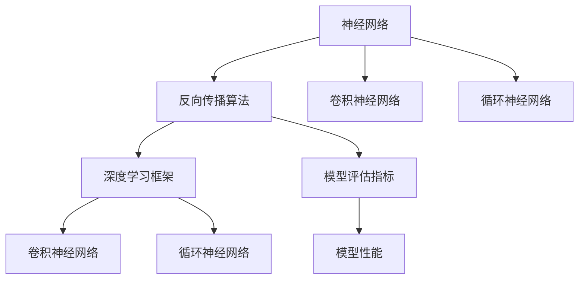

                 

# Hinton、LeCun、Bengio：AI算法的奠基者

> 关键词：深度学习,神经网络,反向传播,卷积神经网络,循环神经网络,计算机视觉,自然语言处理

## 1. 背景介绍

### 1.1 问题由来
人工智能(AI)是当前最为热门的前沿技术之一。从1950年代开始，人类就对机器能否模拟人类智能这一问题进行了孜孜不倦的探索，先后经历了符号主义、连接主义、统计学习等不同的研究范式。然而，真正使得人工智能技术取得突破的，无疑是深度学习。而深度学习的诞生，离不开三位在AI领域深耕多年的科学家：Geoffrey Hinton、Yann LeCun和Yoshua Bengio。他们三人被誉为“深度学习三巨头”，开创了深度学习时代，奠定了现代人工智能的基石。

深度学习是通过多层神经网络实现对数据的高维非线性映射，从而进行复杂的特征提取与模式识别。其核心思想是：通过大量的标注数据，利用反向传播算法对模型进行端到端的训练，使得模型可以自动学习数据中的隐含规律，并输出对数据的精确预测。深度学习在计算机视觉、自然语言处理、语音识别等诸多领域都取得了突破性的进展，驱动了人工智能技术的全面复兴。

### 1.2 问题核心关键点
深度学习的关键在于如何构建高效、鲁棒的神经网络模型，并利用大量的标注数据对其进行训练。深度学习的主要难点在于：

- 如何高效地设计神经网络架构，使得网络能够有效地提取和利用数据中的特征。
- 如何利用反向传播算法高效地更新模型参数，提高训练速度和精度。
- 如何避免过拟合，保证模型泛化性能。
- 如何处理大规模数据和复杂任务，如计算机视觉、自然语言处理等。
- 如何加速模型的推理速度，降低计算资源消耗。
- 如何在保持高精度的情况下，提高模型的可解释性和可控性。

### 1.3 问题研究意义
研究深度学习算法，对于推动人工智能技术的进步，促进数据驱动的科学研究，具有重要意义：

1. 提升智能技术性能。深度学习在图像识别、语音识别、自然语言处理等领域取得了显著效果，推动了智能技术的全面落地。
2. 加速数据驱动科研。深度学习可以通过对大规模数据的处理分析，揭示数据中的隐含规律，促进科学研究和技术创新。
3. 驱动工业应用。深度学习技术在自动驾驶、智能推荐、智能客服等产业应用中得到了广泛应用，带来了经济效益和社会价值。
4. 激发新学科发展。深度学习与计算机视觉、自然语言处理、认知科学等学科交叉融合，促进了新学科的发展。
5. 引领未来趋势。深度学习在不断演进中，将带来更多的技术突破和应用场景，引领未来科技发展。

## 2. 核心概念与联系

### 2.1 核心概念概述

深度学习算法涉及的核心概念和联系包括：

- 神经网络：通过多层神经元组成的非线性映射函数，实现对输入数据的高维特征提取。
- 反向传播算法：利用链式法则，计算损失函数对参数的梯度，指导参数更新，从而优化模型性能。
- 卷积神经网络(CNN)：一种特殊的神经网络架构，适合处理图像、视频等空间特征数据。
- 循环神经网络(RNN)：一种特殊的神经网络架构，适合处理序列特征数据，如自然语言处理。
- 自编码器(Autoencoder)：一种无监督学习方法，通过重构输入数据，学习数据的低维表示。
- 深度学习框架：如TensorFlow、PyTorch等，提供高效的模型构建、训练和推理工具。
- 模型评估指标：如准确率、精确率、召回率、F1-score等，用于评价模型性能。

这些核心概念之间通过深度学习范式有机地联系在一起，构建了完整的深度学习框架和算法体系。深度学习通过构建多层神经网络，利用反向传播算法进行参数优化，从而实现对复杂数据的高效处理和特征提取，并通过模型评估指标进行性能评估。

### 2.2 核心概念原理和架构的 Mermaid 流程图



这个流程图展示了深度学习中的核心概念和联系，从神经网络到反向传播算法，再到卷积和循环神经网络，以及深度学习框架和模型评估指标。这些概念和联系共同构成了深度学习的基础框架，使得深度学习算法在处理各类数据时具备强大的表现力。

## 3. 核心算法原理 & 具体操作步骤
### 3.1 算法原理概述

深度学习算法的核心原理是利用多层神经网络进行复杂的数据映射和特征提取，并利用反向传播算法对模型参数进行优化。其基本流程包括：

1. 构建神经网络架构，并随机初始化权重参数。
2. 通过前向传播计算模型输出，并计算损失函数。
3. 利用反向传播算法计算参数梯度，指导参数更新。
4. 重复前向传播和反向传播，直到模型收敛或达到预设迭代次数。

深度学习算法的核心思想是通过数据的反向传播，逐步更新模型参数，使得模型能够适应数据的分布规律，并输出对数据的精确预测。这种端到端的学习方式，使得深度学习在处理复杂任务时具备强大的表现力。

### 3.2 算法步骤详解

以下是一般的深度学习算法执行步骤：

**Step 1: 神经网络构建**
- 选择合适的神经网络架构，如卷积神经网络(CNN)、循环神经网络(RNN)等。
- 初始化权重参数，如随机高斯分布或Xavier初始化。

**Step 2: 前向传播**
- 将输入数据输入网络，计算各层神经元的输出。
- 使用激活函数处理输出，如ReLU、Sigmoid等。
- 计算模型的最终输出，如分类器的预测概率。

**Step 3: 损失函数计算**
- 根据任务类型，选择合适的损失函数，如交叉熵损失、均方误差损失等。
- 计算模型输出与真实标签之间的差异。

**Step 4: 反向传播**
- 利用链式法则计算损失函数对各层参数的梯度。
- 反向传播梯度，更新模型参数。

**Step 5: 模型训练**
- 循环执行前向传播、损失函数计算和反向传播。
- 根据损失函数梯度更新参数，直至收敛。

**Step 6: 模型评估**
- 在测试集上评估模型性能。
- 计算模型在各个评估指标上的表现。

### 3.3 算法优缺点

深度学习算法的优点在于：

1. 强大的特征提取能力。通过多层神经网络，深度学习能够高效地从数据中提取高维特征，处理复杂模式。
2. 端到端的学习方式。深度学习通过反向传播算法，可以自动学习数据的隐含规律，避免特征工程和手工设计。
3. 高效的处理大规模数据。深度学习能够处理海量数据，并利用分布式计算资源加速训练。
4. 广泛的应用领域。深度学习在计算机视觉、自然语言处理、语音识别等诸多领域都有广泛应用。

深度学习算法也存在一些缺点：

1. 参数量巨大。深度学习模型往往需要大量的参数进行训练，对计算资源和存储空间要求较高。
2. 训练时间长。深度学习模型通常需要较长的训练时间，难以快速迭代。
3. 模型复杂性高。深度学习模型的设计复杂，难以理解和调试。
4. 容易过拟合。深度学习模型在训练过程中容易过拟合，泛化性能较差。
5. 模型可解释性差。深度学习模型通常是"黑盒"系统，难以解释其内部工作机制。

### 3.4 算法应用领域

深度学习算法广泛应用于计算机视觉、自然语言处理、语音识别等多个领域，具体包括：

- 计算机视觉：图像分类、目标检测、人脸识别、视频分析等。
- 自然语言处理：机器翻译、情感分析、问答系统、文本生成等。
- 语音识别：语音转写、说话人识别、语音合成等。
- 游戏AI：自动对战、智能导航、策略优化等。
- 推荐系统：用户兴趣分析、商品推荐、广告投放等。
- 医疗影像：病灶检测、医学图像分析、基因序列分析等。

深度学习算法在这些领域的应用，极大地提升了数据分析和任务处理的效率，为人工智能技术带来了新的突破。

## 4. 数学模型和公式 & 详细讲解 & 举例说明

### 4.1 数学模型构建

深度学习算法通常使用多层神经网络作为模型，并使用反向传播算法进行参数优化。以下以二分类任务为例，展示深度学习模型的数学模型构建。

设二分类任务的输入为 $x \in \mathbb{R}^{n}$，输出为 $y \in \{0, 1\}$，模型使用 $d$ 层的全连接神经网络。每一层神经元个数分别为 $n_0, n_1, \dots, n_{d-1}, n_d$。模型的前向传播过程可表示为：

$$
h^{(1)} = \sigma(W^{(1)}x + b^{(1)})
$$

$$
h^{(2)} = \sigma(W^{(2)}h^{(1)} + b^{(2)})
$$

$$
\cdots
$$

$$
h^{(d-1)} = \sigma(W^{(d-1)}h^{(d-2)} + b^{(d-1)})
$$

$$
y' = \sigma(W^{(d)}h^{(d-1)} + b^{(d)})
$$

其中 $\sigma$ 为激活函数，如ReLU、Sigmoid等。$W^{(i)}$ 和 $b^{(i)}$ 分别为第 $i$ 层的权重矩阵和偏置向量。最终输出 $y'$ 经过 Softmax 函数后，得到二分类概率：

$$
y' = \frac{\exp(h^{(d)})}{\sum_k \exp(h^{(d)})}
$$

根据输出与真实标签之间的差异，计算损失函数：

$$
\mathcal{L} = -\sum_{i=1}^N(y_i \log y_i' + (1-y_i) \log (1-y_i'))
$$

其中 $y$ 为真实标签，$N$ 为样本数。

### 4.2 公式推导过程

以下是二分类任务中深度学习模型的公式推导过程：

**前向传播**：
设 $x$ 为输入向量，$y'$ 为模型输出。前向传播过程可表示为：

$$
h^{(1)} = \sigma(W^{(1)}x + b^{(1)})
$$

$$
h^{(2)} = \sigma(W^{(2)}h^{(1)} + b^{(2)})
$$

$$
\cdots
$$

$$
h^{(d-1)} = \sigma(W^{(d-1)}h^{(d-2)} + b^{(d-1)})
$$

$$
y' = \sigma(W^{(d)}h^{(d-1)} + b^{(d)})
$$

其中 $h^{(i)}$ 表示第 $i$ 层的神经元输出，$W^{(i)}$ 和 $b^{(i)}$ 分别为第 $i$ 层的权重矩阵和偏置向量。最终输出 $y'$ 经过 Softmax 函数后，得到二分类概率：

$$
y' = \frac{\exp(h^{(d)})}{\sum_k \exp(h^{(d)})}
$$

**损失函数**：
根据输出与真实标签之间的差异，计算损失函数：

$$
\mathcal{L} = -\sum_{i=1}^N(y_i \log y_i' + (1-y_i) \log (1-y_i'))
$$

其中 $y$ 为真实标签，$N$ 为样本数。

**反向传播**：
利用链式法则计算损失函数对权重和偏置的梯度：

$$
\frac{\partial \mathcal{L}}{\partial W^{(i)}} = \frac{\partial \mathcal{L}}{\partial h^{(i+1)}} \frac{\partial h^{(i+1)}}{\partial h^{(i)}} \frac{\partial h^{(i)}}{\partial W^{(i)}}
$$

$$
\frac{\partial \mathcal{L}}{\partial b^{(i)}} = \frac{\partial \mathcal{L}}{\partial h^{(i)}} \frac{\partial h^{(i)}}{\partial b^{(i)}}
$$

其中 $\frac{\partial h^{(i)}}{\partial W^{(i)}}$ 和 $\frac{\partial h^{(i)}}{\partial b^{(i)}}$ 为链式法则中的中间结果。

### 4.3 案例分析与讲解

以LeNet-5为例，分析其模型结构和反向传播算法。

LeNet-5是一种经典的卷积神经网络，广泛应用于手写数字识别任务。其网络结构如下：

```
   input layer -> conv layer -> pool layer -> conv layer -> pool layer -> fully connected layer -> output layer
```

其中，input layer 表示输入层，conv layer 表示卷积层，pool layer 表示池化层，fully connected layer 表示全连接层，output layer 表示输出层。

假设输入图像大小为 $28 \times 28$，经过两个卷积层和两个池化层后，特征图大小变为 $5 \times 5 \times 32$。接着使用两个全连接层，输出为10个节点，用于分类。

假设第一层卷积核大小为 $5 \times 5$，步长为 $1$，padding为 $0$。第一层卷积层的参数为 $5 \times 5 \times 1 \times 6 = 60$，表示有6个卷积核。

在前向传播中，首先对输入图像进行卷积操作，得到特征图：

$$
h^{(1)} = \sigma(W^{(1)}x + b^{(1)})
$$

其中 $W^{(1)} \in \mathbb{R}^{5 \times 5 \times 1 \times 6}$，$b^{(1)} \in \mathbb{R}^{6}$。

接着对特征图进行最大池化操作：

$$
h^{(2)} = \sigma(W^{(2)}h^{(1)} + b^{(2)})
$$

其中 $W^{(2)} \in \mathbb{R}^{2 \times 2 \times 6 \times 16}$，$b^{(2)} \in \mathbb{R}^{16}$。

经过两个卷积层和两个池化层后，特征图大小变为 $5 \times 5 \times 16$。

接着使用两个全连接层进行分类：

$$
y' = \sigma(W^{(3)}h^{(2)} + b^{(3)})
$$

其中 $W^{(3)} \in \mathbb{R}^{5 \times 5 \times 16 \times 10}$，$b^{(3)} \in \mathbb{R}^{10}$。

最后输出 $y'$ 经过 Softmax 函数后，得到二分类概率：

$$
y' = \frac{\exp(h^{(3)})}{\sum_k \exp(h^{(3)})}
$$

## 5. 项目实践：代码实例和详细解释说明
### 5.1 开发环境搭建

在进行深度学习项目实践前，需要准备好开发环境。以下是使用Python进行TensorFlow和Keras开发的环境配置流程：

1. 安装Anaconda：从官网下载并安装Anaconda，用于创建独立的Python环境。

2. 创建并激活虚拟环境：
```bash
conda create -n tf-env python=3.8 
conda activate tf-env
```

3. 安装TensorFlow：从官网获取对应的安装命令。例如：
```bash
pip install tensorflow==2.4
```

4. 安装Keras：
```bash
pip install keras
```

5. 安装各类工具包：
```bash
pip install numpy pandas scikit-learn matplotlib tqdm jupyter notebook ipython
```

完成上述步骤后，即可在`tf-env`环境中开始深度学习项目实践。

### 5.2 源代码详细实现

下面我们以手写数字识别为例，给出使用TensorFlow和Keras对LeNet-5模型进行训练和评估的Python代码实现。

```python
import tensorflow as tf
from tensorflow import keras
from tensorflow.keras import layers
from tensorflow.keras.datasets import mnist

# 加载MNIST数据集
(x_train, y_train), (x_test, y_test) = mnist.load_data()

# 数据预处理
x_train = x_train / 255.0
x_test = x_test / 255.0

# 构建模型
model = keras.Sequential([
    layers.Conv2D(6, (5, 5), padding='same', activation='relu', input_shape=(28, 28, 1)),
    layers.MaxPooling2D((2, 2)),
    layers.Conv2D(16, (5, 5), padding='same', activation='relu'),
    layers.MaxPooling2D((2, 2)),
    layers.Flatten(),
    layers.Dense(10, activation='softmax')
])

# 编译模型
model.compile(optimizer='adam', loss='sparse_categorical_crossentropy', metrics=['accuracy'])

# 训练模型
model.fit(x_train.reshape(-1, 28, 28, 1), y_train, epochs=5, batch_size=64)

# 评估模型
model.evaluate(x_test.reshape(-1, 28, 28, 1), y_test)
```

以上代码实现了LeNet-5模型对手写数字识别任务的训练和评估。可以看到，Keras提供了强大的高层次API，使得深度学习模型的构建和训练变得非常简单。

### 5.3 代码解读与分析

让我们再详细解读一下关键代码的实现细节：

**数据预处理**：
- `(x_train, y_train), (x_test, y_test) = mnist.load_data()`：加载MNIST数据集，将训练集和测试集分开。
- `x_train = x_train / 255.0; x_test = x_test / 255.0`：将像素值归一化到0-1之间，以便模型训练。

**模型构建**：
- `model = keras.Sequential([...])`：使用Keras的Sequential模型，按照顺序添加网络层。
- `layers.Conv2D(...)`：添加卷积层，`padding='same'`表示使用相同的填充方式。
- `layers.MaxPooling2D(...)`：添加池化层，`(2, 2)`表示取最大值池化。
- `layers.Flatten()`：将特征图展平，以便输入全连接层。
- `layers.Dense(...)`：添加全连接层，输出10个节点，使用Softmax激活函数。

**模型编译**：
- `model.compile(...)`：编译模型，指定优化器、损失函数和评估指标。

**模型训练**：
- `model.fit(...)`：训练模型，指定训练集、批次大小和迭代次数。

**模型评估**：
- `model.evaluate(...)`：评估模型，在测试集上计算损失和准确率。

可以看到，使用Keras可以很方便地构建和训练深度学习模型。开发者可以更关注于算法设计和模型优化，而无需过多关注底层实现细节。

当然，工业级的系统实现还需考虑更多因素，如模型的保存和部署、超参数的自动搜索、模型的集成与优化等。但核心的深度学习算法基本与此类似。

## 6. 实际应用场景
### 6.1 图像分类

基于深度学习算法的图像分类技术，已经在图像识别、物体检测、视频分析等诸多领域得到广泛应用。例如，利用LeNet-5和AlexNet等经典卷积神经网络，可以对图像进行准确的分类，并在实时性要求较高的场合，如自动驾驶、医疗影像等领域进行高效的应用。

在实际应用中，深度学习模型通常需要进行模型的裁剪和量化，以降低计算资源消耗和推理时间，同时保持较高的模型精度。例如，可以使用TensorFlow Lite和ONNX Runtime等工具，将模型转化为移动端部署的模型，方便实时推理和预测。

### 6.2 自然语言处理

深度学习在自然语言处理领域也取得了显著进展，如机器翻译、情感分析、问答系统等。基于循环神经网络和Transformer等模型，可以进行文本生成、语义理解等复杂任务。

在实际应用中，深度学习模型通常需要处理大规模文本数据，进行预处理和分词操作。例如，可以使用HuggingFace的BERT模型，将其微调到特定的任务，如情感分析、文本分类等，从而获得较好的效果。

### 6.3 语音识别

深度学习在语音识别领域的应用同样广泛，如自动语音识别、说话人识别等。基于卷积神经网络和循环神经网络，可以对音频信号进行特征提取和分类，从而实现高精度的语音识别。

在实际应用中，深度学习模型通常需要处理实时音频数据，进行特征提取和分类。例如，可以使用Kaldi和DeepSpeech等工具，进行语音识别和文本转写。

### 6.4 游戏AI

深度学习在游戏AI领域也取得了突破，如自动对战、智能导航、策略优化等。基于深度强化学习算法，可以进行智能决策和动作控制，从而实现高水平的智能游戏。

在实际应用中，深度学习模型通常需要进行多轮训练和优化，以适应游戏环境的变化。例如，可以使用TensorFlow和PyTorch等工具，进行游戏AI的训练和测试。

### 6.5 推荐系统

深度学习在推荐系统领域的应用也非常广泛，如用户兴趣分析、商品推荐、广告投放等。基于深度学习算法，可以对用户行为进行建模，预测用户偏好，从而实现精准推荐。

在实际应用中，深度学习模型通常需要处理大规模用户数据，进行特征工程和模型优化。例如，可以使用TensorFlow和Keras等工具，进行推荐系统的训练和部署。

### 6.6 医疗影像

深度学习在医疗影像领域的应用同样广泛，如病灶检测、医学图像分析等。基于卷积神经网络和循环神经网络，可以对医学影像进行分类和分析，从而实现高精度的医学诊断。

在实际应用中，深度学习模型通常需要处理医疗影像数据，进行特征提取和分类。例如，可以使用TensorFlow和Keras等工具，进行医学影像的训练和测试。

## 7. 工具和资源推荐
### 7.1 学习资源推荐

为了帮助开发者系统掌握深度学习算法的理论基础和实践技巧，这里推荐一些优质的学习资源：

1. Deep Learning Specialization（深度学习专项课程）：由Andrew Ng主持，斯坦福大学开设的深度学习课程，涵盖了深度学习的基础理论和实践应用。

2. Neural Networks and Deep Learning（深度学习教材）：Michael Nielsen的经典教材，深入浅出地介绍了深度学习的基本原理和算法。

3. Deep Learning with Python（深度学习实战教程）：使用Python和TensorFlow实现深度学习模型，适合初学者上手。

4. TensorFlow官方文档：TensorFlow的官方文档，提供了详尽的API和示例代码，适合进阶学习。

5. PyTorch官方文档：PyTorch的官方文档，提供了高效的模型构建、训练和推理工具，适合开发者使用。

通过对这些资源的学习实践，相信你一定能够快速掌握深度学习算法的精髓，并用于解决实际的NLP问题。
### 7.2 开发工具推荐

高效的开发离不开优秀的工具支持。以下是几款用于深度学习算法开发的常用工具：

1. TensorFlow：由Google主导开发的深度学习框架，灵活易用，支持分布式计算和GPU加速。

2. PyTorch：Facebook开发的深度学习框架，灵活性高，易于开发，支持动态图和静态图。

3. Keras：高层次API，简单易用，支持TensorFlow和Theano后端。

4. MXNet：由亚马逊开发的深度学习框架，支持多种编程语言和分布式计算。

5. Caffe：由Berkeley Vision and Learning Center开发的深度学习框架，适合图像处理任务。

6. Theano：支持GPU加速的深度学习框架，适合数学计算。

合理利用这些工具，可以显著提升深度学习算法的开发效率，加快创新迭代的步伐。

### 7.3 相关论文推荐

深度学习算法的不断发展，源于学界的持续研究。以下是几篇奠基性的相关论文，推荐阅读：

1. Convolutional Neural Networks for Visual Recognition（LeCun et al. 1998）：提出卷积神经网络，广泛应用于计算机视觉领域。

2. Deep Blue Book（Hinton et al. 2006）：Hinton团队编写的深度学习教材，深入浅出地介绍了深度学习的基本原理和算法。

3. ImageNet Classification with Deep Convolutional Neural Networks（Krizhevsky et al. 2012）：提出AlexNet模型，在ImageNet图像分类任务中取得突破。

4. Recurrent Neural Network for Named Entity Recognition（LSTM）（Hochreiter et al. 1997）：提出LSTM模型，用于序列数据的分类任务。

5. Deep Speech 2: End-to-End Speech Recognition in English and Mandarin（Hinton et al. 2015）：提出Deep Speech模型，实现高精度的语音识别。

6. Attention is All You Need（Vaswani et al. 2017）：提出Transformer模型，应用于自然语言处理任务。

这些论文代表了大深度学习算法的发展脉络。通过学习这些前沿成果，可以帮助研究者把握学科前进方向，激发更多的创新灵感。

## 8. 总结：未来发展趋势与挑战

### 8.1 总结

本文对深度学习算法的核心原理和操作步骤进行了全面系统的介绍。首先阐述了深度学习算法的研究背景和意义，明确了深度学习在处理复杂数据时具备的强大表现力。其次，从原理到实践，详细讲解了深度学习算法的数学模型和具体实现步骤，给出了深度学习项目开发的完整代码实例。同时，本文还广泛探讨了深度学习算法在图像分类、自然语言处理、语音识别等多个领域的应用前景，展示了深度学习算法的广泛适用性。

通过本文的系统梳理，可以看到，深度学习算法在处理复杂数据时具备强大的表现力，为人工智能技术的突破提供了重要推动力。未来，伴随深度学习算法的不断演进，深度学习技术必将在更多领域得到应用，为科学研究、工业生产和日常生活带来新的变革。

### 8.2 未来发展趋势

展望未来，深度学习算法将呈现以下几个发展趋势：

1. 算法多样化和融合。未来深度学习算法将不再局限于单一架构，而是通过融合不同的网络结构（如卷积、循环、Transformer等）和优化算法（如SGD、Adam等），构建更加多样化和高效的模型。

2. 自动化学习。通过强化学习、元学习等自动化学习范式，深度学习算法将能够更加灵活地适应不同任务和数据。

3. 多模态学习。深度学习算法将逐渐融入更多的模态数据（如图像、语音、文本等），通过多模态融合提升模型的泛化能力和应用范围。

4. 知识图谱与深度学习的融合。深度学习算法将与知识图谱等外部知识库进行融合，提升模型的语义理解和推理能力。

5. 模型可解释性。深度学习算法的可解释性将得到更多重视，研究者将通过可视化、特征分析等手段，增强模型的透明度和可解释性。

6. 联邦学习与隐私保护。深度学习算法将更多地应用到分布式环境中，通过联邦学习等方式，保护用户隐私和数据安全。

以上趋势凸显了深度学习算法的广阔前景。这些方向的探索发展，必将进一步提升深度学习算法的性能和应用范围，为人工智能技术的发展提供新的突破。

### 8.3 面临的挑战

尽管深度学习算法已经取得了显著成果，但在迈向更加智能化、普适化应用的过程中，仍面临诸多挑战：

1. 计算资源需求高。深度学习算法通常需要大量的计算资源进行训练和推理，难以在小规模设备上部署。

2. 数据依赖性强。深度学习算法对标注数据的需求较高，难以快速适应新领域和新任务。

3. 模型可解释性差。深度学习模型通常被视为"黑盒"系统，难以解释其内部工作机制和决策逻辑。

4. 模型泛化能力不足。深度学习模型在特定任务上的泛化能力有限，难以应对域外数据和新任务。

5. 数据隐私问题。深度学习算法在处理敏感数据时，可能存在隐私泄露的风险。

6. 算法公平性和偏见。深度学习模型可能存在性别偏见、种族偏见等问题，需要进一步研究如何消除这些偏见。

### 8.4 研究展望

面向未来，深度学习算法的研究需要在以下几个方面寻求新的突破：

1. 提高模型可解释性和透明性。通过可视化、特征分析等手段，增强深度学习模型的可解释性和透明性。

2. 降低对标注数据的依赖。通过无监督学习和半监督学习等方法，降低深度学习算法对标注数据的依赖。

3. 提升模型泛化能力和鲁棒性。通过正则化、对抗训练等方法，提升深度学习模型的泛化能力和鲁棒性。

4. 加速模型推理和部署。通过模型剪枝、量化加速等技术，降低深度学习模型的计算资源消耗，提升推理速度。

5. 探索自动化学习范式。通过强化学习、元学习等自动化学习范式，提升深度学习算法对新领域和新任务的适应能力。

6. 研究隐私保护与公平性。通过联邦学习、差分隐私等技术，保护用户隐私和数据安全，确保深度学习算法的公平性。

这些研究方向的探索，必将引领深度学习算法的演进，推动人工智能技术的进一步发展。未来，深度学习算法将在更广阔的应用领域中发挥其独特的优势，为人类认知智能的进化带来深远影响。

## 9. 附录：常见问题与解答

**Q1：深度学习算法的核心思想是什么？**

A: 深度学习算法的核心思想是通过多层神经网络进行复杂的数据映射和特征提取，利用反向传播算法对模型参数进行优化，从而实现对数据的高维非线性映射和特征提取。

**Q2：深度学习算法在图像分类任务中取得了什么进展？**

A: 深度学习算法在图像分类任务中取得了显著进展，特别是在ImageNet分类任务中，AlexNet、VGG、ResNet、Inception等模型相继提出，取得了大幅度的性能提升。

**Q3：如何处理深度学习模型中的过拟合问题？**

A: 处理深度学习模型中的过拟合问题，通常需要采用数据增强、正则化、Dropout等方法。例如，使用随机裁剪、翻转等数据增强技术，可以增加训练数据的多样性，防止过拟合。

**Q4：深度学习模型在医疗影像中的应用有哪些？**

A: 深度学习模型在医疗影像中的应用包括病灶检测、医学图像分析、基因序列分析等。例如，使用卷积神经网络对医学影像进行分类和分割，可以辅助医生进行诊断。

**Q5：深度学习算法在推荐系统中的应用有哪些？**

A: 深度学习算法在推荐系统中的应用包括用户兴趣分析、商品推荐、广告投放等。例如，使用循环神经网络对用户行为进行建模，可以预测用户兴趣，实现精准推荐。

这些常见问题的回答，展示了深度学习算法的广泛应用和潜力，同时也强调了深度学习算法在实际应用中需要注意的问题和解决方法。

---

作者：禅与计算机程序设计艺术 / Zen and the Art of Computer Programming

