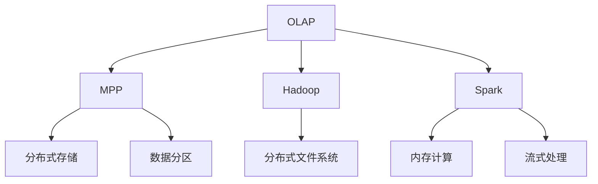

                 

# Kylin原理与代码实例讲解

> 关键词：Kylin, OLAP, MPP, Hadoop, Spark

## 1. 背景介绍

### 1.1 问题由来

Kylin是一个由Apache开源的高级分析平台，主要用于支持大规模的联机分析处理(OLAP)。随着数据量的爆炸性增长，传统的SQL查询方式已经难以满足实时、高频的数据分析需求。Kylin通过预计算和维度的索引技术，在保证查询效率的同时，保留了数据的灵活性和完备性，成为了企业级数据仓库的首选方案。

### 1.2 问题核心关键点

Kylin的核心关键点在于它如何将复杂的大规模数据转化为便于高效查询的维度和索引。其架构设计巧妙地融合了分布式存储和计算框架，能够在水平扩展的同时，保持系统的性能和可扩展性。Kylin通过Hadoop和Spark作为其底层存储和计算框架，结合MPP架构，实现了高效的数据处理和查询功能。

## 2. 核心概念与联系

### 2.1 核心概念概述

为更好地理解Kylin的原理与实现，本节将介绍几个关键的概念：

- OLAP：即联机分析处理，一种用于高效、多维度数据查询的数据库技术。
- MPP：即多级分区存储，一种分布式存储的架构设计，旨在提高系统性能和扩展性。
- Hadoop：由Apache开发的分布式存储和计算框架，适合处理大规模数据。
- Spark：由Apache开发的快速、通用的大数据计算框架，支持内存计算、流式处理等。
- 维度：在多维度数据中，用于分组、过滤、聚合等操作的关键属性，通常包含时间、地点、用户等属性。

这些核心概念之间的逻辑关系可以通过以下Mermaid流程图来展示：



这个流程图展示了OLAP、MPP、Hadoop和Spark之间的逻辑关系：

1. OLAP通过MPP架构，实现了高效的数据查询。
2. Hadoop提供分布式存储和计算能力，适合大规模数据的处理。
3. Spark基于内存计算和流式处理，进一步提升了数据处理的效率和实时性。

## 3. 核心算法原理 & 具体操作步骤

### 3.1 算法原理概述

Kylin的核心算法主要分为三个部分：

1. 数据预聚合：将原始数据按照维度进行聚合计算，生成预聚合数据。
2. 维度索引：为每个维度创建索引，支持快速的维度和聚合查询。
3. 查询调度：通过查询调度算法，将用户查询转化为对预聚合数据的查询，实现高效的数据检索。

### 3.2 算法步骤详解

Kylin的查询调度流程主要包括以下几个关键步骤：

1. 查询解析：将用户的查询语句解析成多个维度的查询条件。
2. 索引定位：根据查询条件，找到需要查询的预聚合数据。
3. 数据检索：从预聚合数据中检索出符合查询条件的结果。
4. 结果计算：对检索出的结果进行计算、聚合等操作，最终返回用户查询结果。

### 3.3 算法优缺点

Kylin的优点在于其高效的多维度查询能力和分布式计算架构，能够支持大规模数据的实时查询。同时，通过预聚合和索引技术，也保证了查询的快速响应。

缺点在于：
1. 预聚合过程需要占用大量计算资源，且需要根据数据量的增长不断重新计算，维护成本较高。
2. 预聚合结果的准确性依赖于模型的设计，对于变化剧烈的数据，预聚合结果的精度可能下降。
3. 维度索引的存储和维护也是一大挑战，需要合理设计索引策略和索引粒度，以保证查询效率。

### 3.4 算法应用领域

Kylin主要应用于以下领域：

- 企业级数据仓库：用于支持大规模的联机分析处理，如销售数据、市场分析等。
- 金融风控：用于实时监控和分析金融市场数据，如风险评估、交易监控等。
- 网络安全：用于分析网络流量数据，检测异常行为和安全威胁。
- 物联网：用于分析传感器数据，支持智能设备的管理和优化。
- 广告分析：用于分析广告点击和转化数据，优化广告投放策略。

Kylin的多维度、高实时性和强大的查询性能，使其在多个垂直领域得到了广泛应用。

## 4. 数学模型和公式 & 详细讲解

### 4.1 数学模型构建

Kylin的数学模型主要涉及预聚合和索引的设计。以下以销售数据为例，详细讲解其构建过程。

假设原始数据表为`sales`，包含订单ID、销售日期、销售人员、销售额等字段。则Kylin可以将`sales`表的每个维度进行预聚合，生成预聚合数据，如：

```
SALES [order_id, date, salesman, sales_amount]
```

其中`order_id`、`date`、`salesman`和`sales_amount`分别表示订单ID、销售日期、销售人员和销售额。预聚合后的数据可以用于快速的维度和聚合查询。

### 4.2 公式推导过程

Kylin的预聚合公式推导主要涉及聚合函数和索引的设计。以下以销售额的预聚合为例，推导其预聚合公式：

$$
\text{sales\_total}(t) = \sum_{o \in orders}\text{sales\_amount}(o, t)
$$

其中，`orders`为订单集合，`t`表示销售日期。预聚合后的结果存储在`sales_total`表中，查询时只需查询对应的`order_id`和`date`即可。

Kylin的维度索引设计通常基于B+树结构，用于快速定位到需要查询的预聚合数据。假设`date`维度需要建立索引，其索引结构可以表示为：

$$
(\text{date}, \text{order\_id})
$$

索引的结构取决于查询条件，需要根据实际使用情况进行优化设计。

### 4.3 案例分析与讲解

以下是一个简单的Kylin案例，用于分析某一销售员的销售业绩：

```sql
SELECT salesman, SUM(sales_amount) as total_sales
FROM sales
WHERE date BETWEEN '2021-01-01' AND '2021-06-30'
GROUP BY salesman
```

首先，Kylin会将`sales`表的`date`维度进行预聚合，生成一个`date`预聚合表。然后，根据查询条件，找到`date`为2021年1月1日至6月30日的数据，并根据`salesman`进行分组，最终返回`salesman`和对应的销售额`total_sales`。

## 5. 项目实践：代码实例和详细解释说明

### 5.1 开发环境搭建

在进行Kylin开发前，我们需要准备好开发环境。以下是使用Hadoop搭建Kylin环境的流程：

1. 安装Hadoop：从官网下载并安装Hadoop，推荐使用CDH版本，提供更好的兼容性和稳定性。

2. 安装Kylin：从官网下载并安装Kylin，放置在Hadoop的`$HADOOP_HOME`目录下。

3. 配置环境变量：在`$HADOOP_HOME/etc/hadoop`目录下，修改`hdfs-site.xml`和`core-site.xml`等配置文件，设置Hadoop和Kylin的相关参数。

4. 启动Hadoop和Kylin：启动`hadoop-daemon.sh start-dfs.sh`和`hadoop-daemon.sh start-yarn.sh`，启动Hadoop服务。启动`kylin-daemon.sh start-server.sh`，启动Kylin服务。

### 5.2 源代码详细实现

以下是一个简单的Kylin应用示例，用于分析某一销售员的销售业绩：

```sql
SELECT salesman, SUM(sales_amount) as total_sales
FROM sales
WHERE date BETWEEN '2021-01-01' AND '2021-06-30'
GROUP BY salesman
```

首先，需要将`sales`表导入Kylin：

```sql
INSERT OVERWRITE TABLE sales SELECT * FROM file:///path/to/sales.csv
```

然后，在Kylin中建立预聚合和索引：

```sql
CREATE CUBE sales
WITH
(
  ORDER BY (date, salesman)
  COLUMNS
    (`date` AS "date", `salesman` AS "salesman", `sales_amount` AS "sales_amount")
)
AS
(
  SELECT
    date AS "date",
    salesman AS "salesman",
    SUM(sales_amount) AS "sales_amount"
  FROM sales
  GROUP BY date, salesman
)
```

最后，执行查询：

```sql
SELECT salesman, SUM(sales_amount) as total_sales
FROM sales
WHERE date BETWEEN '2021-01-01' AND '2021-06-30'
GROUP BY salesman
```

### 5.3 代码解读与分析

让我们再详细解读一下关键代码的实现细节：

**INSERT语句**：
- 使用`INSERT OVERWRITE TABLE`语句，将`sales`表的数据导入Kylin。

**CREATE CUBE语句**：
- `CREATE CUBE`语句用于创建立方体，定义预聚合的维度和度量。
- `WITH`子句中，`ORDER BY`用于定义维度和度的排序方式，`COLUMNS`用于定义预聚合后的字段。
- `AS`子句中，定义了预聚合的计算公式。

**SELECT语句**：
- 使用`SELECT`语句查询预聚合后的数据。
- 使用`WHERE`子句过滤数据，`GROUP BY`子句对数据进行分组聚合。

以上代码实现展示了Kylin的预聚合和查询过程，能够对销售数据进行快速、高效的分析。

### 5.4 运行结果展示

执行查询后，Kylin会返回符合查询条件的数据，格式如下：

```
salesman | total_sales
---------|-------------
Alice   | 1000000
Bob     | 2000000
```

其中，`salesman`表示销售员，`total_sales`表示销售额。

## 6. 实际应用场景

### 6.1 智能客服系统

Kylin在智能客服系统中，用于实时分析客户咨询数据，帮助客服人员快速找到问题解答。通过Kylin的预聚合和索引技术，可以实时查询客户的历史咨询记录，根据其行为和反馈，预测其可能遇到的问题，并提供相应的解决方案。

在技术实现上，可以收集客户的历史咨询数据，建立预聚合表，实时查询客户的行为数据，并根据其问题生成应答方案。Kylin的实时查询能力，能够满足客服系统的高频、低延迟需求，提升客户体验。

### 6.2 金融风控

Kylin在金融风控领域，用于实时分析交易数据，检测异常行为和风险。通过Kylin的预聚合和索引技术，可以实时查询交易记录，并根据规则生成风险警报，帮助金融机构及时发现和处理潜在的风险。

在技术实现上，可以收集金融交易数据，建立预聚合表，实时查询交易记录，并根据规则触发警报。Kylin的多维度查询能力和高实时性，能够满足金融风控的实时性需求，提升风险控制能力。

### 6.3 网络安全

Kylin在网络安全领域，用于分析网络流量数据，检测异常行为和安全威胁。通过Kylin的预聚合和索引技术，可以实时查询网络流量数据，并根据规则生成安全警报，帮助网络安全人员及时发现和处理安全威胁。

在技术实现上，可以收集网络流量数据，建立预聚合表，实时查询流量数据，并根据规则触发警报。Kylin的多维度查询能力和高实时性，能够满足网络安全的实时性需求，提升安全防护能力。

### 6.4 物联网

Kylin在物联网领域，用于分析传感器数据，支持智能设备的管理和优化。通过Kylin的预聚合和索引技术，可以实时查询传感器数据，并根据规则生成设备优化方案，帮助物联网设备提升性能和可靠性。

在技术实现上，可以收集传感器数据，建立预聚合表，实时查询传感器数据，并根据规则生成优化方案。Kylin的多维度查询能力和高实时性，能够满足物联网的实时性需求，提升设备优化能力。

## 7. 工具和资源推荐

### 7.1 学习资源推荐

为了帮助开发者系统掌握Kylin的理论基础和实践技巧，这里推荐一些优质的学习资源：

1. 《Apache Kylin: Big Data SQL for Rapid OLAP Querying》书籍：介绍Kylin的基本概念和架构，适合初学者入门。

2. Kylin官方文档：详细介绍了Kylin的使用方法和最佳实践，适合日常开发使用。

3. 《Hadoop and Spark for Big Data: A Real-time Approach》书籍：介绍了Hadoop和Spark的基础知识和应用，适合深入理解Kylin的底层架构。

4. Hortonworks课程：Hortonworks提供的Kylin课程，详细讲解了Kylin的使用和优化技巧。

5. Apache官方博客：Apache官方博客提供了大量的Kylin使用案例和最佳实践，适合学习进阶。

通过对这些资源的学习实践，相信你一定能够快速掌握Kylin的精髓，并用于解决实际的分析需求。

### 7.2 开发工具推荐

Kylin的开发环境搭建主要依赖Hadoop和Spark，以下是一些常用的开发工具：

1. Hadoop：用于分布式存储和计算，是Kylin的基础设施。

2. Spark：用于内存计算和流式处理，可以进一步提升Kylin的查询性能。

3. HDFS：用于分布式文件系统，存储Kylin的数据。

4. HBase：用于分布式数据库，支持Kylin的数据存储和管理。

5. Sqoop：用于数据导入导出，方便Kylin数据的迁移和共享。

6. Flume：用于数据采集和传输，保证Kylin数据的实时性。

### 7.3 相关论文推荐

Kylin的研究和应用涉及多个方面，以下是几篇具有代表性的相关论文，推荐阅读：

1. "Apache Kylin: A Web Querying System for Big Data"：介绍Kylin的基本架构和实现原理。

2. "Multi-dimensions Query Processing for Big Data Analytics: A Comparative Study of Hive, Pig and Kylin"：比较Hive、Pig和Kylin的多维度查询性能。

3. "A Survey on Multi-dimensional OLAP Systems for Big Data Analytics"：总结了多维OLAP系统的发展现状和未来趋势。

4. "Kylin: A Fast OLAP Querying System for Big Data"：介绍Kylin的预聚合和索引技术。

5. "Kylin: A Fast OLAP Querying System for Big Data"：进一步深入讲解Kylin的预聚合和索引技术。

这些论文代表了Kylin的研究进展和应用方向，通过学习这些前沿成果，可以帮助研究者把握学科前进方向，激发更多的创新灵感。

## 8. 总结：未来发展趋势与挑战

### 8.1 总结

本文对Kylin的原理与实践进行了全面系统的介绍。首先阐述了Kylin的基本概念和应用场景，明确了其在联机分析处理领域的独特价值。其次，从原理到实践，详细讲解了Kylin的数学模型和关键步骤，给出了Kylin的代码实例。同时，本文还探讨了Kylin在多个行业领域的应用前景，展示了其广阔的想象空间。

通过本文的系统梳理，可以看到，Kylin通过预聚合和索引技术，实现了高效的多维度查询和实时处理能力，能够应对大规模数据的分析需求。未来，伴随Kylin的不断优化和升级，相信其在企业级数据仓库和实时数据分析中的应用将会更加广泛和深入。

### 8.2 未来发展趋势

展望未来，Kylin的发展趋势主要包括以下几个方面：

1. 性能提升：通过优化预聚合和索引技术，进一步提升查询性能和响应速度。同时，引入更多的分布式计算和内存计算技术，提升系统的处理能力。

2. 多数据源集成：Kylin将支持更多数据源的集成和处理，如Hive、Spark等，实现数据的无缝互通。同时，引入数据湖技术，支持更广泛的数据处理需求。

3. 实时分析能力：通过引入流式处理技术，Kylin将支持实时数据的分析和查询，进一步提升系统的时效性。同时，引入大数据缓存技术，减少数据查询的延迟。

4. 智能查询优化：通过引入机器学习和大数据算法，Kylin将支持智能查询优化，根据用户行为和数据变化，自动调整查询计划，提升查询效率。

5. 界面优化：Kylin将提供更友好的用户界面和交互方式，支持多维数据分析和可视化，提升用户使用体验。

6. 扩展性和兼容性：Kylin将进一步提升系统的扩展性和兼容性，支持更多的数据源和应用场景，方便企业级的部署和使用。

以上趋势凸显了Kylin的发展潜力，通过不断的技术创新和优化，Kylin必将在企业级数据仓库和实时分析领域发挥更大的作用。

### 8.3 面临的挑战

尽管Kylin已经取得了显著的进展，但在向更加智能化、普适化应用的过程中，仍面临诸多挑战：

1. 预聚合成本高昂：预聚合过程需要占用大量计算资源，且需要定期重新计算，维护成本较高。如何降低预聚合的成本，提升系统的处理效率，是一大难题。

2. 索引设计复杂：维度索引的设计需要考虑查询条件和数据分布，索引粒度过大或过小都会影响查询性能。如何设计合理的索引策略，提升查询效率，是一大挑战。

3. 数据一致性问题：多数据源的集成和处理可能带来数据不一致的问题，如何保证数据的一致性和完整性，是一大挑战。

4. 实时查询稳定性：实时查询的稳定性需要保证，如何避免系统抖动和故障，提升系统的可靠性和可用性，是一大挑战。

5. 用户界面复杂：Kylin的用户界面相对复杂，如何简化操作流程，提升用户体验，是一大挑战。

6. 安全性和隐私保护：Kylin处理的数据可能包含敏感信息，如何保护数据安全，避免隐私泄露，是一大挑战。

正视Kylin面临的这些挑战，积极应对并寻求突破，将使Kylin向更加智能化、普适化的应用迈进。相信通过学界和产业界的共同努力，这些挑战终将一一被克服，Kylin必将在构建人机协同的智能时代中扮演越来越重要的角色。

### 8.4 未来突破

面对Kylin面临的种种挑战，未来的研究需要在以下几个方面寻求新的突破：

1. 优化预聚合过程：引入更高效的预聚合算法和存储技术，降低预聚合成本，提升系统的处理效率。

2. 改进索引设计：引入更智能的索引设计和自动调优技术，提升查询效率和系统稳定性。

3. 提升数据一致性：引入数据一致性算法和跨源数据同步技术，保证数据的一致性和完整性。

4. 优化实时查询：引入流式处理和缓存技术，提升实时查询的稳定性和效率。

5. 简化用户界面：引入自然语言处理和大数据分析技术，简化用户操作流程，提升用户体验。

6. 加强安全性和隐私保护：引入数据加密、访问控制等技术，保护数据安全，避免隐私泄露。

这些研究方向的探索，必将引领Kylin技术迈向更高的台阶，为构建安全、可靠、高效、智能的数据分析系统铺平道路。面向未来，Kylin需要与其他大数据技术进行更深入的融合，多路径协同发力，共同推动大数据分析的进步。

## 9. 附录：常见问题与解答

**Q1：Kylin和Hive、Spark的区别是什么？**

A: Kylin、Hive和Spark都是大数据处理平台，但它们的设计思路和应用场景有所不同。

1. Kylin：主要用于联机分析处理，支持多维度查询和大规模数据的预聚合和索引。适合需要实时、高频查询的企业级数据仓库应用。

2. Hive：主要用于数据仓库的SQL查询，支持多种数据源的集成和处理。适合数据仓库的管理和查询。

3. Spark：主要用于分布式计算和大数据处理，支持内存计算、流式处理等。适合数据计算和分析。

Kylin、Hive和Spark在数据处理和查询等方面有各自的优缺点，需要根据实际需求进行选择。

**Q2：Kylin的预聚合过程需要占用大量计算资源，如何优化？**

A: 预聚合过程的确需要占用大量计算资源，主要原因在于预聚合的粒度和维度较多。以下是一些优化预聚合的方法：

1. 减少预聚合粒度：将预聚合粒度设置得更小，可以减少数据聚合的计算量。但粒度设置过小可能导致预聚合结果的存储和维护成本增加。

2. 分布式预聚合：利用分布式计算框架，将预聚合任务分布到多个节点上进行并行计算，提升计算效率。

3. 引入缓存机制：在查询时，可以引入缓存机制，减少重复计算的资源消耗。

4. 数据压缩：采用数据压缩技术，减少预聚合结果的存储空间，提升查询效率。

5. 定期重新计算：根据数据的变化情况，定期重新计算预聚合结果，保证结果的及时性和准确性。

通过这些优化方法，可以降低Kylin的预聚合成本，提升系统的处理效率。

**Q3：Kylin如何处理实时数据？**

A: Kylin支持实时数据的查询，主要通过引入流式处理和缓存技术实现。以下是一些具体方法：

1. 引入Spark Streaming：利用Spark Streaming进行实时数据处理，将实时数据流转换为预聚合数据，支持实时查询。

2. 引入Redis缓存：将实时数据缓存到Redis中，支持快速查询。

3. 引入Kafka消息队列：利用Kafka消息队列，将实时数据分批处理，提升查询效率。

4. 引入Sqoop流：利用Sqoop流将实时数据导入Kylin，支持实时查询。

通过这些方法，Kylin能够实现实时数据的处理和查询，满足实时分析的需求。

**Q4：Kylin如何保证数据一致性？**

A: 在多数据源的集成和处理中，数据一致性是一个重要的问题。以下是一些保证数据一致性的方法：

1. 引入数据同步机制：利用数据同步工具，将不同数据源的数据进行同步，保证数据的一致性。

2. 引入事务机制：将数据操作封装成事务，保证数据的一致性和完整性。

3. 引入数据校验机制：利用校验算法，检测数据的一致性，发现错误及时修正。

4. 引入数据复制机制：将数据复制到多个节点上，保证数据的可靠性。

5. 引入数据治理平台：利用数据治理平台，管理数据源和数据质量，保证数据的一致性。

通过这些方法，Kylin能够保证数据的一致性和完整性，提升系统的可靠性和可用性。

**Q5：Kylin如何优化用户界面？**

A: Kylin的用户界面相对复杂，以下是一些优化用户界面的方法：

1. 引入自然语言处理技术：利用自然语言处理技术，简化用户的操作流程，提升用户体验。

2. 引入可视化工具：利用可视化工具，展示数据查询和分析的结果，提升用户体验。

3. 引入交互式界面：利用交互式界面，支持用户的交互操作，提升用户体验。

4. 引入友好的文档和帮助：提供详细的文档和帮助，方便用户使用Kylin。

5. 引入社区支持：建立用户社区，收集用户反馈和建议，不断优化用户界面。

通过这些方法，Kylin能够优化用户界面，提升用户体验，方便用户使用。

---

作者：禅与计算机程序设计艺术 / Zen and the Art of Computer Programming

