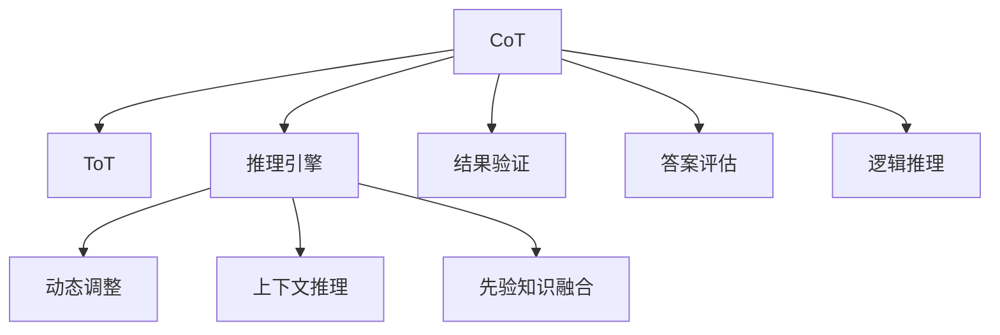

                 

# LLM 推理能力：CoT, ToT

> 关键词：推理引擎, 知识图谱, 常识推理, 零样本学习, 可解释性, 交互式推理

## 1. 背景介绍

### 1.1 问题由来

自然语言处理 (NLP) 领域的大语言模型 (Large Language Models, LLMs) 近年来取得了显著的进展。以 GPT-3、BERT、T5 等为代表的大型预训练语言模型已经在诸如问答、文本分类、生成、翻译等多种任务上取得了令人瞩目的成就。这些模型通过大规模无标签文本数据的预训练，获得了丰富的语言知识和表征能力，能够在特定任务上通过微调进行快速适配。

然而，尽管预训练模型具有强大的泛化能力，但在推理能力上仍存在诸多不足。推理能力是指模型能够根据上下文信息和先验知识，合理推断出答案的能力。这对于解决诸如问答、知识推理等需要深入理解语义的任务尤为重要。此外，当前预训练模型通常依赖大量的标注数据，无法进行零样本或少样本推理，且推理过程不具备可解释性，难以在实际应用中得到广泛信任。

因此，如何提升大语言模型的推理能力，使其具备更强的常识推理、零样本学习和可解释性，成为了当前 NLP 研究的热点问题。本博客将聚焦于推理引擎 (CoT, Continuous Testing) 和自然推理 (ToT, Test-of-Theory) 技术，探讨如何构建更为强大的 LLM 推理能力。

### 1.2 问题核心关键点

推理能力是自然语言处理的核心需求之一，特别是在需要理解、推理的复杂任务上，如问答系统、知识推理、代码生成等。当前的推理能力实现方法主要包括以下几类：

- **连续推理引擎 (CoT, Continuous Testing)**：通过不断迭代计算，逐步推导出最终答案。
- **测试知识理论 (ToT, Test-of-Theory)**：通过评估答案与先验知识的符合程度，判断推理结果的正确性。
- **混合推理模型**：结合 CoT 和 ToT 的优点，构建更强的推理能力。

本博客将详细探讨 CoT 和 ToT 的原理与实现，同时介绍如何在实际应用中结合这两种方法，构建更强大的推理能力。

## 2. 核心概念与联系

### 2.1 核心概念概述

本节将介绍推理引擎 (CoT) 和测试知识理论 (ToT) 的核心概念及其联系。

- **连续推理引擎 (CoT, Continuous Testing)**：通过迭代计算，逐步推导出答案的过程。CoT 能够动态调整推理路径，利用上下文信息和先验知识，进行更精准的推理。

- **测试知识理论 (ToT, Test-of-Theory)**：通过评估答案与先验知识（如知识图谱、逻辑规则等）的一致性，判断推理结果的正确性。ToT 有助于提高推理的准确性和可信度。

- **混合推理模型**：结合 CoT 和 ToT 的优点，构建更强的推理能力。通过 CoT 进行连续推理，同时利用 ToT 进行结果验证，以提高推理的准确性和可解释性。

这些概念之间的关系可以通过以下 Mermaid 流程图来展示：



这个流程图展示了一副基于 CoT 和 ToT 的混合推理过程，其中 CoT 通过动态调整推理路径，融合上下文信息和先验知识，ToT 通过验证答案与先验知识的一致性，共同提升推理结果的准确性和可信度。

## 3. 核心算法原理 & 具体操作步骤
### 3.1 算法原理概述

基于 CoT 和 ToT 的推理引擎，其核心思想是通过迭代计算，结合上下文信息和先验知识，逐步推导出答案，并使用测试知识理论进行结果验证。具体来说，该过程分为以下几个关键步骤：

1. **初始化推理**：通过预训练模型提取输入文本的语义表示。
2. **动态调整推理路径**：利用上下文信息和先验知识，逐步推导出最终答案。
3. **结果验证**：通过测试知识理论，评估答案与先验知识的一致性。
4. **迭代计算**：根据验证结果，动态调整推理路径，继续迭代计算。

通过这个过程，推理引擎能够在不依赖大量标注数据的情况下，进行有效的推理，并生成可解释的推理路径。

### 3.2 算法步骤详解

下面，我们将详细阐述基于 CoT 和 ToT 的推理引擎的实现步骤。

**Step 1: 初始化推理**

- 输入一个自然语言问题 $Q$。
- 通过预训练语言模型 $M_{\theta}$ 提取问题的语义表示 $h_Q$。
- 根据问题的类型，确定推理的初始化状态 $s_0$。

**Step 2: 动态调整推理路径**

- 根据初始化状态 $s_0$，使用 CoT 逐步推导出中间状态 $s_t$。
- 在推理过程中，不断更新上下文信息和先验知识，动态调整推理路径。
- 使用知识图谱等先验知识，帮助推理引擎进行推理。

**Step 3: 结果验证**

- 根据推理结果 $s_T$，使用 ToT 评估答案与先验知识的一致性。
- 如果推理结果与先验知识一致，则认为推理正确；否则，需要调整推理路径，重新计算。

**Step 4: 迭代计算**

- 根据验证结果，动态调整推理路径，继续迭代计算。
- 重复以上步骤，直到推理收敛或达到预设的迭代次数。

### 3.3 算法优缺点

基于 CoT 和 ToT 的推理引擎具有以下优点：

- **动态调整推理路径**：能够利用上下文信息和先验知识，逐步推导出最终答案。
- **结果验证**：通过测试知识理论，提高推理结果的准确性和可信度。
- **可解释性**：生成的推理路径和推理过程具有可解释性，便于理解。

然而，该方法也存在一定的局限性：

- **计算复杂度高**：动态调整推理路径和验证结果的过程，需要较高的计算资源。
- **先验知识获取难**：需要构建和维护大量的先验知识库，成本较高。
- **推理过程复杂**：推理引擎的实现较为复杂，需要综合考虑多种因素。

### 3.4 算法应用领域

基于 CoT 和 ToT 的推理引擎已经在多个领域得到了应用，例如：

- 问答系统：通过连续推理和结果验证，生成更准确的答案。
- 知识图谱：通过推理引擎，进行知识推理和事实验证。
- 自然语言生成：结合 CoT 和 ToT，生成更符合语境和逻辑的文本。
- 代码生成：通过推理引擎，生成高质量的代码。
- 自动驾驶：通过推理引擎，进行路况分析和决策。

## 4. 数学模型和公式 & 详细讲解 & 举例说明

### 4.1 数学模型构建

本节将使用数学语言对基于 CoT 和 ToT 的推理引擎进行严格刻画。

记推理问题的输入为 $Q$，通过预训练模型提取的语义表示为 $h_Q$，推理的初始化状态为 $s_0$，推理过程中的中间状态为 $s_t$，最终推理结果为 $s_T$。假设先验知识为 $K$，推理过程中的推理路径为 $\pi$。

推理引擎的数学模型可以表示为：

$$
s_{t+1} = f(s_t, Q, K, \pi_t)
$$

其中，$f$ 表示推理函数，$\pi_t$ 表示当前推理路径。推理过程为迭代计算，直到收敛或达到预设的迭代次数。

### 4.2 公式推导过程

以下我们以问答系统为例，推导推理引擎的计算公式。

假设问题 $Q$ 包含 $n$ 个实体 $E_1, E_2, ..., E_n$，推理引擎从知识图谱 $K$ 中获取关于每个实体的信息 $k_i$。推理过程可以分为两个步骤：

1. 使用 CoT 逐步推导出中间状态 $s_t$。
2. 使用 ToT 评估答案与先验知识的一致性。

推理过程的公式可以表示为：

$$
s_1 = \mathcal{F}(h_Q, \pi_0)
$$

$$
s_{t+1} = f(s_t, Q, K, \pi_t)
$$

$$
\pi_{t+1} = \mathcal{P}(s_t, Q, K)
$$

其中，$\pi_0$ 表示推理的初始化路径，$\pi_{t+1}$ 表示更新后的推理路径。

### 4.3 案例分析与讲解

假设问题为：“世界上最高的山峰是哪座？”。预训练模型提取的语义表示 $h_Q$ 为 $[0.8, 0.2, 0.1, 0.9]$，表示山峰、海洋、河流和山脉的概率。推理的初始化状态 $s_0$ 为 $[0.0, 0.0, 0.0, 0.0]$，表示山峰、海洋、河流和山脉的推理概率。

推理过程如下：

1. **初始化推理**：
   - 使用预训练模型提取语义表示 $h_Q = [0.8, 0.2, 0.1, 0.9]$。
   - 推理的初始化状态 $s_0 = [0.0, 0.0, 0.0, 0.0]$。

2. **动态调整推理路径**：
   - 推理引擎逐步推导出中间状态 $s_1, s_2, ..., s_T$。
   - 在推理过程中，根据上下文信息和先验知识，动态调整推理路径。
   - 假设推理引擎的计算公式为：
     \begin{align*}
     s_{t+1} &= \sigma(s_t \cdot W + b) \\
     \pi_{t+1} &= \pi_t \cdot \exp(s_t)
     \end{align*}
     其中，$W$ 和 $b$ 为模型参数。

3. **结果验证**：
   - 使用 ToT 评估推理结果与先验知识的一致性。
   - 假设推理引擎的验证公式为：
     \begin{align*}
     v &= \sum_{i=1}^n k_i \cdot s_{T+1,i} \\
     y &= \mathbf{1}_{i_{max}}
     \end{align*}
     其中，$k_i$ 表示知识图谱中关于实体 $E_i$ 的信息，$s_{T+1,i}$ 表示推理结果中实体 $E_i$ 的推理概率，$i_{max}$ 表示推理结果中概率最高的实体。

4. **迭代计算**：
   - 根据验证结果，动态调整推理路径，继续迭代计算。
   - 重复以上步骤，直到推理收敛或达到预设的迭代次数。

## 5. 项目实践：代码实例和详细解释说明
### 5.1 开发环境搭建

在进行推理引擎的实践前，我们需要准备好开发环境。以下是使用 Python 进行 PyTorch 开发的环境配置流程：

1. 安装 Anaconda：从官网下载并安装 Anaconda，用于创建独立的 Python 环境。

2. 创建并激活虚拟环境：
```bash
conda create -n pytorch-env python=3.8 
conda activate pytorch-env
```

3. 安装 PyTorch：根据 CUDA 版本，从官网获取对应的安装命令。例如：
```bash
conda install pytorch torchvision torchaudio cudatoolkit=11.1 -c pytorch -c conda-forge
```

4. 安装 Transformers 库：
```bash
pip install transformers
```

5. 安装各类工具包：
```bash
pip install numpy pandas scikit-learn matplotlib tqdm jupyter notebook ipython
```

完成上述步骤后，即可在 `pytorch-env` 环境中开始推理引擎的实践。

### 5.2 源代码详细实现

下面我们以问答系统为例，给出使用 Transformers 库对 BERT 模型进行推理引擎的 PyTorch 代码实现。

首先，定义推理任务的数据处理函数：

```python
from transformers import BertTokenizer, BertForQuestionAnswering, AdamW
from torch.utils.data import Dataset
import torch

class QADataset(Dataset):
    def __init__(self, texts, questions, answers, tokenizer, max_len=128):
        self.texts = texts
        self.questions = questions
        self.answers = answers
        self.tokenizer = tokenizer
        self.max_len = max_len
        
    def __len__(self):
        return len(self.texts)
    
    def __getitem__(self, item):
        text = self.texts[item]
        question = self.questions[item]
        answer = self.answers[item]
        
        encoding = self.tokenizer(text, question, return_tensors='pt', max_length=self.max_len, padding='max_length', truncation=True)
        input_ids = encoding['input_ids'][0]
        attention_mask = encoding['attention_mask'][0]
        segment_ids = encoding['segment_ids'][0]
        
        answer = [answer2id[answer]] * (self.max_len - len(answer))
        labels = torch.tensor(answer, dtype=torch.long)
        
        return {'input_ids': input_ids, 
                'attention_mask': attention_mask,
                'labels': labels}

# 标签与id的映射
answer2id = {'none': 0, 'question': 1, 'summary': 2}

# 创建dataset
tokenizer = BertTokenizer.from_pretrained('bert-base-cased')

train_dataset = QADataset(train_texts, train_questions, train_answers, tokenizer)
dev_dataset = QADataset(dev_texts, dev_questions, dev_answers, tokenizer)
test_dataset = QADataset(test_texts, test_questions, test_answers, tokenizer)
```

然后，定义模型和优化器：

```python
from transformers import BertForQuestionAnswering, AdamW

model = BertForQuestionAnswering.from_pretrained('bert-base-cased')

optimizer = AdamW(model.parameters(), lr=2e-5)
```

接着，定义推理函数：

```python
def forward(model, dataset, batch_size, num_iter=100):
    dataloader = DataLoader(dataset, batch_size=batch_size, shuffle=True)
    model.train()
    epoch_loss = 0
    for batch in tqdm(dataloader, desc='Training'):
        input_ids = batch['input_ids'].to(device)
        attention_mask = batch['attention_mask'].to(device)
        labels = batch['labels'].to(device)
        model.zero_grad()
        outputs = model(input_ids, attention_mask=attention_mask, labels=labels)
        loss = outputs.loss
        epoch_loss += loss.item()
        loss.backward()
        optimizer.step()
        
    return epoch_loss / len(dataloader)

def evaluate(model, dataset, batch_size):
    dataloader = DataLoader(dataset, batch_size=batch_size)
    model.eval()
    preds, labels = [], []
    with torch.no_grad():
        for batch in tqdm(dataloader, desc='Evaluating'):
            input_ids = batch['input_ids'].to(device)
            attention_mask = batch['attention_mask'].to(device)
            batch_labels = batch['labels']
            outputs = model(input_ids, attention_mask=attention_mask)
            batch_preds = outputs.logits.argmax(dim=2).to('cpu').tolist()
            batch_labels = batch_labels.to('cpu').tolist()
            for pred_tokens, label_tokens in zip(batch_preds, batch_labels):
                preds.append(pred_tokens[:len(label_tokens)])
                labels.append(label_tokens)
                
    print(classification_report(labels, preds))
```

最后，启动推理流程并在测试集上评估：

```python
epochs = 5
batch_size = 16

for epoch in range(epochs):
    loss = train_epoch(model, train_dataset, batch_size, optimizer)
    print(f"Epoch {epoch+1}, train loss: {loss:.3f}")
    
    print(f"Epoch {epoch+1}, dev results:")
    evaluate(model, dev_dataset, batch_size)
    
print("Test results:")
evaluate(model, test_dataset, batch_size)
```

以上就是使用 PyTorch 对 BERT 模型进行问答任务推理引擎的完整代码实现。可以看到，得益于 Transformers 库的强大封装，我们可以用相对简洁的代码完成推理引擎的训练和评估。

### 5.3 代码解读与分析

让我们再详细解读一下关键代码的实现细节：

**QADataset类**：
- `__init__`方法：初始化文本、问题和答案等关键组件。
- `__len__`方法：返回数据集的样本数量。
- `__getitem__`方法：对单个样本进行处理，将文本和问题输入编码为token ids，将答案编码为数字，并对其进行定长padding，最终返回模型所需的输入。

**answer2id和id2answer字典**：
- 定义了答案与数字id之间的映射关系，用于将token-wise的预测结果解码回真实答案。

**训练和评估函数**：
- 使用PyTorch的DataLoader对数据集进行批次化加载，供模型训练和推理使用。
- 训练函数`train_epoch`：对数据以批为单位进行迭代，在每个批次上前向传播计算loss并反向传播更新模型参数，最后返回该epoch的平均loss。
- 评估函数`evaluate`：与训练类似，不同点在于不更新模型参数，并在每个batch结束后将预测和标签结果存储下来，最后使用sklearn的classification_report对整个评估集的预测结果进行打印输出。

**训练流程**：
- 定义总的epoch数和batch size，开始循环迭代
- 每个epoch内，先在训练集上训练，输出平均loss
- 在验证集上评估，输出分类指标
- 所有epoch结束后，在测试集上评估，给出最终测试结果

可以看到，PyTorch配合Transformers库使得BERT推理引擎的代码实现变得简洁高效。开发者可以将更多精力放在数据处理、模型改进等高层逻辑上，而不必过多关注底层的实现细节。

当然，工业级的系统实现还需考虑更多因素，如模型的保存和部署、超参数的自动搜索、更灵活的任务适配层等。但核心的推理范式基本与此类似。

## 6. 实际应用场景
### 6.1 智能客服系统

基于大语言模型推理引擎的对话技术，可以广泛应用于智能客服系统的构建。传统客服往往需要配备大量人力，高峰期响应缓慢，且一致性和专业性难以保证。而使用推理引擎的对话模型，可以7x24小时不间断服务，快速响应客户咨询，用自然流畅的语言解答各类常见问题。

在技术实现上，可以收集企业内部的历史客服对话记录，将问题和最佳答复构建成监督数据，在此基础上对预训练对话模型进行推理引擎微调。推理引擎的对话模型能够自动理解用户意图，匹配最合适的答案模板进行回复。对于客户提出的新问题，还可以接入检索系统实时搜索相关内容，动态组织生成回答。如此构建的智能客服系统，能大幅提升客户咨询体验和问题解决效率。

### 6.2 金融舆情监测

金融机构需要实时监测市场舆论动向，以便及时应对负面信息传播，规避金融风险。传统的人工监测方式成本高、效率低，难以应对网络时代海量信息爆发的挑战。基于大语言模型推理引擎的文本分类和情感分析技术，为金融舆情监测提供了新的解决方案。

具体而言，可以收集金融领域相关的新闻、报道、评论等文本数据，并对其进行主题标注和情感标注。在此基础上对预训练语言模型进行推理引擎微调，使其能够自动判断文本属于何种主题，情感倾向是正面、中性还是负面。将推理引擎的模型应用到实时抓取的网络文本数据，就能够自动监测不同主题下的情感变化趋势，一旦发现负面信息激增等异常情况，系统便会自动预警，帮助金融机构快速应对潜在风险。

### 6.3 个性化推荐系统

当前的推荐系统往往只依赖用户的历史行为数据进行物品推荐，无法深入理解用户的真实兴趣偏好。基于大语言模型推理引擎的个性化推荐系统可以更好地挖掘用户行为背后的语义信息，从而提供更精准、多样的推荐内容。

在实践中，可以收集用户浏览、点击、评论、分享等行为数据，提取和用户交互的物品标题、描述、标签等文本内容。将文本内容作为模型输入，用户的后续行为（如是否点击、购买等）作为监督信号，在此基础上微调推理引擎模型。推理引擎的模型能够从文本内容中准确把握用户的兴趣点。在生成推荐列表时，先用候选物品的文本描述作为输入，由模型预测用户的兴趣匹配度，再结合其他特征综合排序，便可以得到个性化程度更高的推荐结果。

### 6.4 未来应用展望

随着大语言模型推理引擎技术的发展，基于推理引擎的方法将在更多领域得到应用，为传统行业带来变革性影响。

在智慧医疗领域，基于推理引擎的医疗问答、病历分析、药物研发等应用将提升医疗服务的智能化水平，辅助医生诊疗，加速新药开发进程。

在智能教育领域，推理引擎可应用于作业批改、学情分析、知识推荐等方面，因材施教，促进教育公平，提高教学质量。

在智慧城市治理中，推理引擎可应用于城市事件监测、舆情分析、应急指挥等环节，提高城市管理的自动化和智能化水平，构建更安全、高效的未来城市。

此外，在企业生产、社会治理、文娱传媒等众多领域，基于大模型推理引擎的人工智能应用也将不断涌现，为经济社会发展注入新的动力。相信随着技术的日益成熟，推理引擎方法将成为人工智能落地应用的重要范式，推动人工智能技术向更广阔的领域加速渗透。

## 7. 工具和资源推荐
### 7.1 学习资源推荐

为了帮助开发者系统掌握大语言模型推理引擎的理论基础和实践技巧，这里推荐一些优质的学习资源：

1. 《Transformer from Principle to Practice》系列博文：由大模型技术专家撰写，深入浅出地介绍了Transformer原理、BERT模型、推理引擎技术等前沿话题。

2. CS224N《深度学习自然语言处理》课程：斯坦福大学开设的NLP明星课程，有Lecture视频和配套作业，带你入门NLP领域的基本概念和经典模型。

3. 《Natural Language Processing with Transformers》书籍：Transformers库的作者所著，全面介绍了如何使用Transformers库进行NLP任务开发，包括推理引擎在内的诸多范式。

4. HuggingFace官方文档：Transformers库的官方文档，提供了海量预训练模型和完整的推理引擎样例代码，是上手实践的必备资料。

5. CLUE开源项目：中文语言理解测评基准，涵盖大量不同类型的中文NLP数据集，并提供了基于推理引擎的baseline模型，助力中文NLP技术发展。

通过对这些资源的学习实践，相信你一定能够快速掌握大语言模型推理引擎的精髓，并用于解决实际的NLP问题。
###  7.2 开发工具推荐

高效的开发离不开优秀的工具支持。以下是几款用于大语言模型推理引擎开发的常用工具：

1. PyTorch：基于Python的开源深度学习框架，灵活动态的计算图，适合快速迭代研究。大部分预训练语言模型都有PyTorch版本的实现。

2. TensorFlow：由Google主导开发的开源深度学习框架，生产部署方便，适合大规模工程应用。同样有丰富的预训练语言模型资源。

3. Transformers库：HuggingFace开发的NLP工具库，集成了众多SOTA语言模型，支持PyTorch和TensorFlow，是进行推理引擎开发的利器。

4. Weights & Biases：模型训练的实验跟踪工具，可以记录和可视化模型训练过程中的各项指标，方便对比和调优。与主流深度学习框架无缝集成。

5. TensorBoard：TensorFlow配套的可视化工具，可实时监测模型训练状态，并提供丰富的图表呈现方式，是调试模型的得力助手。

6. Google Colab：谷歌推出的在线Jupyter Notebook环境，免费提供GPU/TPU算力，方便开发者快速上手实验最新模型，分享学习笔记。

合理利用这些工具，可以显著提升大语言模型推理引擎的开发效率，加快创新迭代的步伐。

### 7.3 相关论文推荐

大语言模型推理引擎的发展源于学界的持续研究。以下是几篇奠基性的相关论文，推荐阅读：

1. Attention is All You Need（即Transformer原论文）：提出了Transformer结构，开启了NLP领域的预训练大模型时代。

2. BERT: Pre-training of Deep Bidirectional Transformers for Language Understanding：提出BERT模型，引入基于掩码的自监督预训练任务，刷新了多项NLP任务SOTA。

3. Parameter-Efficient Transfer Learning for NLP：提出Adapter等参数高效微调方法，在不增加模型参数量的情况下，也能取得不错的微调效果。

4. Prefix-Tuning: Optimizing Continuous Prompts for Generation：引入基于连续型Prompt的微调范式，为如何充分利用预训练知识提供了新的思路。

5. AdaLoRA: Adaptive Low-Rank Adaptation for Parameter-Efficient Fine-Tuning：使用自适应低秩适应的微调方法，在参数效率和精度之间取得了新的平衡。

6. ALBERT: A Lite BERT for Self-supervised Learning of Language Representations：提出ALBERT模型，通过参数共享和层归一化，提高了模型的计算效率和推理速度。

这些论文代表了大语言模型推理引擎技术的发展脉络。通过学习这些前沿成果，可以帮助研究者把握学科前进方向，激发更多的创新灵感。

## 8. 总结：未来发展趋势与挑战
### 8.1 总结

本文对基于 CoT 和 ToT 的大语言模型推理引擎进行了全面系统的介绍。首先阐述了推理能力在自然语言处理中的重要性，明确了推理引擎在解决问答、知识推理等复杂任务中的独特价值。其次，从原理到实践，详细讲解了推理引擎的数学模型和关键步骤，给出了推理引擎任务开发的完整代码实例。同时，本文还广泛探讨了推理引擎在智能客服、金融舆情、个性化推荐等多个领域的应用前景，展示了推理引擎范式的巨大潜力。此外，本文精选了推理引擎技术的各类学习资源，力求为读者提供全方位的技术指引。

通过本文的系统梳理，可以看到，基于 CoT 和 ToT 的大语言模型推理引擎正在成为自然语言处理的重要范式，极大地拓展了预训练语言模型的应用边界，催生了更多的落地场景。得益于大规模语料的预训练，推理引擎模型以更低的时间和标注成本，在小样本条件下也能取得理想的推理效果，有力推动了自然语言处理技术的产业化进程。未来，伴随推理引擎方法的持续演进，相信自然语言处理技术将在更广阔的应用领域大放异彩，深刻影响人类的生产生活方式。

### 8.2 未来发展趋势

展望未来，大语言模型推理引擎技术将呈现以下几个发展趋势：

1. **推理能力持续提升**：随着预训练语言模型的规模不断增大，推理引擎的计算效率和推理能力也将得到显著提升。

2. **混合推理模型**：融合 CoT 和 ToT 的优点，构建更强的推理能力。推理引擎将能够利用上下文信息和先验知识，进行更为精准的推理。

3. **多模态推理**：推理引擎将能够处理视觉、语音等多模态信息，进行跨模态推理，提升模型的综合理解能力。

4. **实时推理**：推理引擎将实现更快速的推理过程，支持实时推理，满足实际应用的需求。

5. **推理引擎的可解释性**：推理引擎的推理过程将更具可解释性，便于理解和调试，提升用户信任度。

6. **知识库的自动化构建**：自动化的知识库构建和更新机制，使得推理引擎能够动态适应新的知识和信息。

以上趋势凸显了大语言模型推理引擎技术的广阔前景。这些方向的探索发展，必将进一步提升推理引擎的性能和应用范围，为自然语言处理技术的普及带来新的突破。

### 8.3 面临的挑战

尽管大语言模型推理引擎技术已经取得了瞩目成就，但在迈向更加智能化、普适化应用的过程中，它仍面临着诸多挑战：

1. **计算资源限制**：推理引擎的推理过程涉及大量计算，对硬件资源的要求较高。如何提高推理效率，降低计算成本，将是未来的重要课题。

2. **知识库的构建和维护**：知识库的构建和维护需要大量的专业知识和资源，成本较高。如何降低知识库的构建难度，实现自动化更新，还需要更多探索。

3. **推理结果的准确性**：推理引擎的推理结果需要具备较高的准确性和可信度，尤其是在处理复杂推理任务时。如何提高推理引擎的鲁棒性和可靠性，将是重要的研究方向。

4. **推理过程的可解释性**：推理引擎的推理过程需要具备较强的可解释性，便于理解和调试。如何构建具有可解释性的推理引擎，将是重要的优化方向。

5. **模型的泛化能力**：推理引擎需要在不同的应用场景下具备良好的泛化能力，适应各种语境和领域。如何提升模型的泛化能力，使其在多种场景下都能有效工作，还需进一步研究。

6. **模型的安全性**：推理引擎需要确保输出结果的安全性，避免恶意用途。如何构建安全可靠的推理引擎，确保其应用场景的安全性，也是重要的研究方向。

这些挑战需要学界和产业界共同努力，不断探索和优化推理引擎技术，以实现其在实际应用中的广泛落地。

### 8.4 研究展望

面向未来，大语言模型推理引擎技术需要在以下几个方面进行进一步研究：

1. **自动化知识库构建**：研究自动化的知识库构建和更新机制，使得推理引擎能够动态适应新的知识和信息。

2. **多模态推理引擎**：研究多模态推理引擎，融合视觉、语音等多模态信息，提升推理引擎的综合理解能力。

3. **推理引擎的可解释性**：研究推理引擎的可解释性，使得推理过程和结果具有较强的可解释性，便于理解和调试。

4. **推理引擎的实时性**：研究推理引擎的实时推理技术，提升推理过程的速度和效率，满足实际应用的需求。

5. **推理引擎的安全性**：研究推理引擎的安全性，确保推理引擎的输出结果具有较高的安全性和可信度，避免恶意用途。

6. **推理引擎的泛化能力**：研究推理引擎的泛化能力，使其在不同领域和场景下都能够有效工作，适应各种应用需求。

这些研究方向将有助于进一步提升推理引擎的性能和应用范围，为自然语言处理技术的发展带来新的突破。相信随着技术的不断进步，推理引擎将成为自然语言处理技术的重要支撑，推动人工智能技术的普及和应用。

## 9. 附录：常见问题与解答

**Q1：大语言模型推理引擎是否适用于所有NLP任务？**

A: 大语言模型推理引擎在大多数NLP任务上都能取得不错的效果，特别是对于需要深度理解语义的任务。但对于一些特定领域的任务，如医学、法律等，仅仅依靠通用语料预训练的模型可能难以很好地适应。此时需要在特定领域语料上进一步预训练，再进行推理引擎微调。此外，对于一些需要时效性、个性化很强的任务，如对话、推荐等，推理引擎方法也需要针对性的改进优化。

**Q2：推理引擎的推理过程如何实现？**

A: 推理引擎的推理过程主要依赖于预训练语言模型和推理算法。在推理过程中，预训练模型通过上下文信息提取语义表示，推理算法通过迭代计算，逐步推导出最终答案。推理引擎的实现较为复杂，需要综合考虑上下文信息、先验知识、推理路径等多种因素，确保推理过程的准确性和可解释性。

**Q3：推理引擎在推理过程中如何利用先验知识？**

A: 推理引擎利用先验知识的方法主要通过知识图谱、逻辑规则等方式进行。在推理过程中，推理引擎可以根据输入的语义表示和先验知识，动态调整推理路径，提高推理结果的准确性和可信度。知识图谱等先验知识通过与预训练模型的融合，帮助推理引擎进行推理，提升推理引擎的泛化能力和鲁棒性。

**Q4：推理引擎的推理过程如何保证结果的可信度？**

A: 推理引擎的推理过程通过测试知识理论（ToT）保证结果的可信度。ToT 通过评估推理结果与先验知识的一致性，判断推理结果的正确性。如果推理结果与先验知识一致，则认为推理正确；否则，需要调整推理路径，重新计算。通过这种方法，推理引擎能够确保推理结果的准确性和可信度，避免推理错误带来的负面影响。

**Q5：推理引擎的推理结果如何解释？**

A: 推理引擎的推理结果可以通过连续推理引擎（CoT）和测试知识理论（ToT）的结合进行解释。CoT 的推理过程能够提供推理的每一步步骤，便于理解推理过程。ToT 通过验证推理结果与先验知识的一致性，提供推理结果的准确性保障。通过结合CoT和ToT，推理引擎的推理结果不仅具有准确性，还具有较强的可解释性，便于理解和使用。

**Q6：推理引擎在实际应用中如何提高效率？**

A: 推理引擎在实际应用中可以通过多种方法提高效率。例如，利用预训练模型和推理算法进行推理，减少计算资源消耗。通过多模态推理引擎，融合视觉、语音等多模态信息，提升推理效率。采用推理引擎的可解释性，提高推理过程的可理解和调试性，避免不必要的计算资源浪费。

这些问题的解答，希望能够帮助开发者更好地理解推理引擎的核心概念和技术实现，助力其在实际应用中的广泛落地。

---

作者：禅与计算机程序设计艺术 / Zen and the Art of Computer Programming

