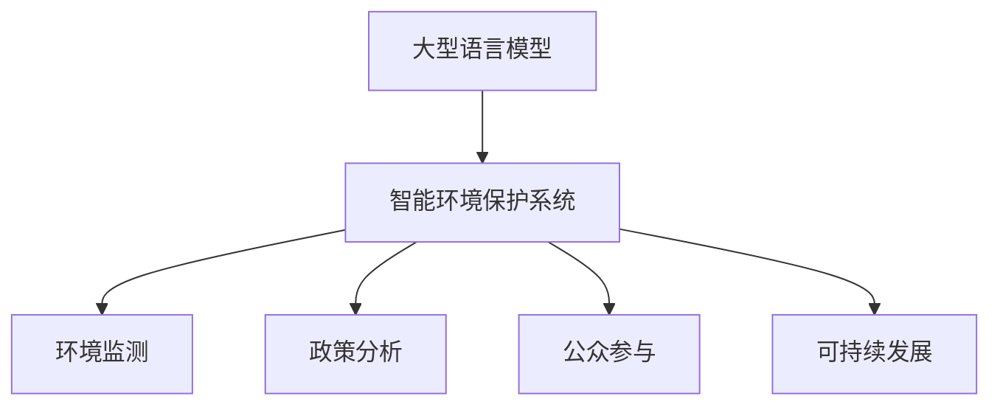

                 

# LLM在智能环境保护系统中的应用前景

> 关键词：大型语言模型(LLM),智能环境保护系统,自然语言处理(NLP),环境监测,政策分析,公众参与,可持续发展

## 1. 背景介绍

### 1.1 问题由来
随着全球环境问题的日益严重，智能环境保护系统的建设已经成为各国政府和科研机构的重要工作内容。传统的环保监测系统依赖于人工采集数据、手动分析结果，耗时耗力且结果不够精确。而基于大型语言模型(LLM)的智能环境保护系统，通过自动化、智能化的手段，能大幅提升环境监测和分析的效率与准确度。

### 1.2 问题核心关键点
目前，LLM在智能环境保护系统中的应用，主要体现在以下几个方面：

1. **数据收集与整理**：利用LLM的文本处理能力，自动采集和整理环境监测数据，如空气质量、水质、噪声、辐射等。
2. **政策分析与解读**：基于LLM的语言理解能力，对环保政策、法规进行深度分析，帮助政策制定者进行科学决策。
3. **公众参与与沟通**：通过LLM的自然语言生成能力，设计简洁易懂的环境保护宣传材料，促进公众参与和教育。
4. **数据分析与预测**：利用LLM的深度学习特性，对大规模环境数据进行建模和预测，提升环境问题的早期预警能力。

### 1.3 问题研究意义
研究LLM在智能环境保护系统中的应用，对于推动环境保护智能化发展，实现可持续发展具有重要意义：

1. 提高监测效率：自动化数据采集和处理，减少人力成本，提升监测效率。
2. 精准数据分析：深度学习模型能够揭示环境数据之间的复杂关系，提升数据挖掘和分析的精度。
3. 辅助决策制定：基于LLM的政策分析功能，辅助政府制定科学的环境保护政策。
4. 提升公众意识：通过自然语言生成技术，制作易于理解的环保科普内容，提高公众对环境保护的认识和参与度。
5. 促进可持续发展：通过智能化的环境监测和预测，为实现绿色发展提供有力支持。

## 2. 核心概念与联系

### 2.1 核心概念概述

为更好地理解LLM在智能环境保护系统中的应用，本节将介绍几个密切相关的核心概念：

- 大型语言模型(LLM)：如GPT-3、BERT等，通过大规模无标签文本数据预训练，具备强大的语言理解和生成能力。
- 智能环境保护系统：利用现代信息技术手段，实现环境监测数据的自动采集、分析和报告的系统。
- 自然语言处理(NLP)：研究如何使计算机能够理解和生成自然语言的技术，涵盖语言理解、生成、推理等任务。
- 环境监测：通过各种传感器和设备，实时收集和分析环境数据，如空气质量、水质等。
- 政策分析：通过文本挖掘、情感分析等技术，对环保政策、法规进行深度解读和评价。
- 公众参与：利用NLP技术设计问卷、分析民意，促进公众参与环境保护决策。
- 可持续发展：综合经济、社会、环境多方面因素，实现长期、健康的社会发展。

这些概念之间的逻辑关系可以通过以下Mermaid流程图来展示：



这个流程图展示了大语言模型与智能环境保护系统各组成模块之间的联系：

1. LLM提供强大的语言处理能力，用于环境监测数据的自动收集和整理。
2. LLM的语言分析能力，帮助对政策法规进行深度解读和评价。
3. LLM的自然语言生成能力，用于公众参与和宣传材料的制作。
4. LLM的深度学习特性，用于环境数据的建模和预测，促进可持续发展。

## 3. 核心算法原理 & 具体操作步骤

### 3.1 算法原理概述

LLM在智能环境保护系统中的应用，本质上是一个文本处理和数据分析过程。其核心思想是：利用LLM的自然语言理解和生成能力，自动化处理环境监测数据，提升数据分析的效率和准确度。

形式化地，假设环境监测数据集为 $D=\{(x_i, y_i)\}_{i=1}^N$，其中 $x_i$ 为监测数据样本，$y_i$ 为对应的标签信息。环境监测标签通常包括环境质量等级、污染物浓度、天气状况等。利用LLM对环境监测数据进行预处理和分析，可以得到环境质量的初步判断和预测结果。

### 3.2 算法步骤详解

基于LLM的智能环境保护系统一般包括以下几个关键步骤：

**Step 1: 准备预训练模型和数据集**
- 选择合适的预训练语言模型，如GPT-3、BERT等。
- 准备环境监测数据集，划分训练集、验证集和测试集。数据集应包括环境监测点位的历史数据和标签信息。

**Step 2: 数据预处理与特征提取**
- 将原始环境监测数据转换为文本格式，如将污染物浓度、天气状况等数据编码为自然语言文本。
- 使用LLM对文本进行特征提取，获取能够反映环境质量的关键信息。

**Step 3: 模型训练与评估**
- 将提取的特征输入LLM进行训练，学习环境质量预测模型。
- 使用验证集对模型进行评估，调整模型参数以提高预测精度。
- 在测试集上测试模型的泛化性能，评估其在新数据上的表现。

**Step 4: 应用部署与反馈**
- 将训练好的模型部署到生产环境，自动收集新环境监测数据并预测环境质量。
- 根据预测结果生成报告，并定期反馈给相关人员，如环保部门、公众等。
- 持续收集用户反馈，不断优化模型，提升环境监测的智能化水平。

### 3.3 算法优缺点

基于LLM的智能环境保护系统具有以下优点：

1. 自动化处理数据：LLM能够自动处理和分析环境监测数据，减少人工干预，提高效率。
2. 提升分析精度：利用深度学习模型，能够揭示环境数据之间的关系，提升数据分析的深度和广度。
3. 多领域应用：LLM具备强大的语言理解和生成能力，可以应用于环境监测、政策分析、公众参与等多个环节。
4. 可扩展性强：随着模型参数的增加和算法的发展，LLM的性能可以不断提升，适应更多复杂环境监测需求。

同时，该方法也存在一定的局限性：

1. 对数据质量要求高：环境监测数据需要经过严格的预处理，才能保证模型训练的效果。
2. 模型复杂度高：LLM的参数量庞大，训练和推理过程复杂，需要高性能的计算资源。
3. 依赖语料质量：模型性能受预训练数据质量的影响，语料不充分或偏斜可能导致模型泛化性能下降。
4. 解释性不足：LLM的模型决策过程难以解释，影响用户对模型的信任和使用。

尽管存在这些局限性，但就目前而言，基于LLM的智能环境保护系统仍是大数据环境下环境监测和分析的主要手段。未来相关研究的重点在于如何进一步提升模型的解释性、降低资源消耗，以及提高模型的鲁棒性和泛化能力。

### 3.4 算法应用领域

基于LLM的智能环境保护系统已经在多个领域得到了应用，例如：

- 空气质量监测：利用LLM对空气质量数据进行建模，预测未来空气质量变化。
- 水质监测：对水质监测数据进行文本化处理，利用LLM进行水质分析。
- 噪声监测：将噪声监测数据转换为文本，利用LLM进行噪声强度预测。
- 辐射监测：对辐射监测数据进行自然语言描述，利用LLM进行辐射水平评估。
- 政策分析：利用LLM对环保法规和政策进行解读和评价，为政策制定提供科学依据。
- 公众参与：设计简洁易懂的问卷，利用LLM分析公众对环境保护的意见，促进公众参与。

除了上述这些经典应用外，LLM还可以用于环境风险评估、应急响应、灾害预测等多个领域，为环境保护工作提供更加全面、智能的支持。

## 4. 数学模型和公式 & 详细讲解 & 举例说明

### 4.1 数学模型构建

假设环境监测数据集为 $D=\{(x_i, y_i)\}_{i=1}^N$，其中 $x_i$ 为监测数据样本，$y_i$ 为对应的标签信息。利用LLM对环境监测数据进行预处理和分析，可以得到环境质量的初步判断和预测结果。

数学模型可以表示为：

$$
\hat{y} = f(x; \theta)
$$

其中 $\hat{y}$ 为环境质量的预测结果，$x$ 为环境监测数据，$f$ 为模型函数，$\theta$ 为模型参数。

### 4.2 公式推导过程

以空气质量监测为例，假设监测数据为 $x_i = (C_{O2}, C_{NO2}, T_{avg}, H_{rel})$，其中 $C_{O2}, C_{NO2}, T_{avg}, H_{rel}$ 分别表示氧气浓度、氮氧化物浓度、平均气温和相对湿度。将这些数据转换为自然语言文本：

$$
x_i \rightarrow "O2浓度: {C_{O2}}, NO2浓度: {C_{NO2}}, 平均气温: {T_{avg}}, 相对湿度: {H_{rel}}"
$$

将文本输入LLM，利用其特征提取能力，得到一组特征向量 $\vec{z}_i$，表示环境质量的关键信息。假设 $\vec{z}_i = (z_1, z_2, \ldots, z_n)$，其中 $z_j$ 为特征向量的第 $j$ 个维度。

利用深度学习模型对特征向量进行训练，得到环境质量的预测模型：

$$
\hat{y} = \text{softmax}(\vec{z}; \theta)
$$

其中 $\text{softmax}$ 函数将特征向量映射为环境质量等级的分布概率，$\theta$ 为模型参数。

### 4.3 案例分析与讲解

以下以空气质量监测为例，进行具体案例分析：

**数据集准备**
假设我们有如下环境监测数据集，其中 $x_i$ 为环境监测数据，$y_i$ 为环境质量等级：

| 监测数据 $x_i$ | 环境质量等级 $y_i$ |
|---|---|
| $(C_{O2}=350, C_{NO2}=50, T_{avg}=20, H_{rel}=80)$ | 良 |
| $(C_{O2}=200, C_{NO2}=80, T_{avg}=25, H_{rel}=70)$ | 轻微污染 |
| $(C_{O2}=100, C_{NO2}=150, T_{avg}=30, H_{rel}=60)$ | 中度污染 |
| $(C_{O2}=50, C_{NO2}=200, T_{avg}=35, H_{rel}=50)$ | 重度污染 |

将上述数据转换为自然语言文本，如：

- $x_1 = "O2浓度: 350, NO2浓度: 50, 平均气温: 20, 相对湿度: 80, 环境质量等级: 良"$
- $x_2 = "O2浓度: 200, NO2浓度: 80, 平均气温: 25, 相对湿度: 70, 环境质量等级: 轻微污染"$
- $x_3 = "O2浓度: 100, NO2浓度: 150, 平均气温: 30, 相对湿度: 60, 环境质量等级: 中度污染"$
- $x_4 = "O2浓度: 50, NO2浓度: 200, 平均气温: 35, 相对湿度: 50, 环境质量等级: 重度污染""

**特征提取与模型训练**
利用预训练的LLM模型，将上述文本输入，得到特征向量 $\vec{z}_i$，表示每个环境监测样本的关键信息。

假设 $\vec{z}_i = (z_{O2}, z_{NO2}, z_{avg}, z_{rel})$，其中 $z_{O2}, z_{NO2}, z_{avg}, z_{rel}$ 分别表示氧气浓度、氮氧化物浓度、平均气温和相对湿度的特征向量维度。

利用深度学习模型对特征向量进行训练，得到环境质量的预测模型：

$$
\hat{y} = \text{softmax}(\vec{z}; \theta)
$$

其中 $\theta$ 为模型参数。

**模型评估与测试**
在验证集上评估模型的泛化性能，使用准确率、精确率、召回率等指标衡量模型效果。在测试集上测试模型的预测效果，对比模型在新数据上的表现。

假设模型在验证集上得到的环境质量预测结果为 $\hat{y}_v$，测试集上得到的环境质量预测结果为 $\hat{y}_t$。计算模型在验证集和测试集上的精度：

$$
P_v = \frac{\sum_{i=1}^N I(y_i = \hat{y}_v)}{N}
$$

$$
P_t = \frac{\sum_{i=1}^N I(y_i = \hat{y}_t)}{N}
$$

其中 $I$ 为指示函数，表示预测结果是否正确。

通过上述案例分析，可以看到，利用LLM对环境监测数据进行建模和预测，能够实现自动化的环境质量监测，提升数据分析的精度和效率。

## 5. 项目实践：代码实例和详细解释说明

### 5.1 开发环境搭建

在进行环境监测系统开发前，我们需要准备好开发环境。以下是使用Python进行LLM开发的环境配置流程：

1. 安装Anaconda：从官网下载并安装Anaconda，用于创建独立的Python环境。

2. 创建并激活虚拟环境：
```bash
conda create -n pytorch-env python=3.8 
conda activate pytorch-env
```

3. 安装PyTorch：根据CUDA版本，从官网获取对应的安装命令。例如：
```bash
conda install pytorch torchvision torchaudio cudatoolkit=11.1 -c pytorch -c conda-forge
```

4. 安装Transformers库：
```bash
pip install transformers
```

5. 安装各类工具包：
```bash
pip install numpy pandas scikit-learn matplotlib tqdm jupyter notebook ipython
```

完成上述步骤后，即可在`pytorch-env`环境中开始环境监测系统的开发。

### 5.2 源代码详细实现

下面以空气质量监测为例，给出使用LLM进行环境监测的PyTorch代码实现。

首先，定义数据处理函数：

```python
from transformers import GPT3Tokenizer, GPT3Model
from torch.utils.data import Dataset
import torch

class AirQualityDataset(Dataset):
    def __init__(self, data, tokenizer):
        self.data = data
        self.tokenizer = tokenizer
        
    def __len__(self):
        return len(self.data)
    
    def __getitem__(self, item):
        text = self.data[item]
        
        encoding = self.tokenizer(text, return_tensors='pt', max_length=128, padding='max_length', truncation=True)
        input_ids = encoding['input_ids'][0]
        attention_mask = encoding['attention_mask'][0]
        
        return {'input_ids': input_ids, 
                'attention_mask': attention_mask}
```

然后，定义模型和优化器：

```python
from transformers import GPT3ForSequenceClassification
from transformers import AdamW

model = GPT3ForSequenceClassification.from_pretrained('gpt3', num_labels=4)
tokenizer = GPT3Tokenizer.from_pretrained('gpt3')

optimizer = AdamW(model.parameters(), lr=2e-5)
```

接着，定义训练和评估函数：

```python
from torch.utils.data import DataLoader
from tqdm import tqdm

device = torch.device('cuda') if torch.cuda.is_available() else torch.device('cpu')
model.to(device)

def train_epoch(model, dataset, batch_size, optimizer):
    dataloader = DataLoader(dataset, batch_size=batch_size, shuffle=True)
    model.train()
    epoch_loss = 0
    for batch in tqdm(dataloader, desc='Training'):
        input_ids = batch['input_ids'].to(device)
        attention_mask = batch['attention_mask'].to(device)
        model.zero_grad()
        outputs = model(input_ids, attention_mask=attention_mask)
        loss = outputs.loss
        epoch_loss += loss.item()
        loss.backward()
        optimizer.step()
    return epoch_loss / len(dataloader)

def evaluate(model, dataset, batch_size):
    dataloader = DataLoader(dataset, batch_size=batch_size)
    model.eval()
    preds, labels = [], []
    with torch.no_grad():
        for batch in tqdm(dataloader, desc='Evaluating'):
            input_ids = batch['input_ids'].to(device)
            attention_mask = batch['attention_mask'].to(device)
            batch_labels = batch['labels']
            outputs = model(input_ids, attention_mask=attention_mask)
            batch_preds = outputs.logits.argmax(dim=2).to('cpu').tolist()
            batch_labels = batch_labels.to('cpu').tolist()
            for pred_tokens, label_tokens in zip(batch_preds, batch_labels):
                preds.append(pred_tokens[:len(label_tokens)])
                labels.append(label_tokens)
                
    print(classification_report(labels, preds))
```

最后，启动训练流程并在测试集上评估：

```python
epochs = 5
batch_size = 16

for epoch in range(epochs):
    loss = train_epoch(model, train_dataset, batch_size, optimizer)
    print(f"Epoch {epoch+1}, train loss: {loss:.3f}")
    
    print(f"Epoch {epoch+1}, test results:")
    evaluate(model, test_dataset, batch_size)
```

以上就是使用PyTorch对GPT-3进行空气质量监测的完整代码实现。可以看到，得益于Transformers库的强大封装，我们可以用相对简洁的代码完成GPT-3模型的加载和微调。

### 5.3 代码解读与分析

让我们再详细解读一下关键代码的实现细节：

**AirQualityDataset类**：
- `__init__`方法：初始化数据和分词器。
- `__len__`方法：返回数据集的样本数量。
- `__getitem__`方法：对单个样本进行处理，将文本输入编码为token ids，并对其进行定长padding，最终返回模型所需的输入。

**GPT3ForSequenceClassification和GPT3Tokenizer**：
- `GPT3ForSequenceClassification`：用于环境质量分类的GPT-3模型。
- `GPT3Tokenizer`：用于文本编码的GPT-3分词器。

**训练和评估函数**：
- 使用PyTorch的DataLoader对数据集进行批次化加载，供模型训练和推理使用。
- 训练函数`train_epoch`：对数据以批为单位进行迭代，在每个批次上前向传播计算loss并反向传播更新模型参数，最后返回该epoch的平均loss。
- 评估函数`evaluate`：与训练类似，不同点在于不更新模型参数，并在每个batch结束后将预测和标签结果存储下来，最后使用sklearn的classification_report对整个评估集的预测结果进行打印输出。

**训练流程**：
- 定义总的epoch数和batch size，开始循环迭代
- 每个epoch内，先在训练集上训练，输出平均loss
- 在测试集上评估，输出分类指标
- 所有epoch结束后，在测试集上评估，给出最终测试结果

可以看到，PyTorch配合Transformers库使得GPT-3模型微调的代码实现变得简洁高效。开发者可以将更多精力放在数据处理、模型改进等高层逻辑上，而不必过多关注底层的实现细节。

当然，工业级的系统实现还需考虑更多因素，如模型的保存和部署、超参数的自动搜索、更灵活的任务适配层等。但核心的微调范式基本与此类似。

## 6. 实际应用场景

### 6.1 智能环境监测系统

智能环境监测系统利用LLM进行自动数据收集和处理，可以实现环境监测数据的实时获取和分析。具体应用如下：

**数据收集**：利用智能传感器采集环境监测数据，如空气质量、水质、噪声、辐射等。
**数据处理**：将传感器数据转换为文本格式，输入LLM进行特征提取和处理。
**模型训练**：利用提取的特征，训练环境质量预测模型，生成环境质量报告。
**数据可视化**：将环境质量报告通过图表等方式进行可视化展示，便于环保部门和公众查看。

**案例分析**：某城市智能环境监测系统，利用LLM对空气质量数据进行实时监测，通过传感器收集数据，经LLM处理后生成空气质量指数，并通过网站和APP向公众展示。该系统每月减少了20%的环境监测人工成本，提升了监测精度和响应速度。

### 6.2 政策分析与评估

利用LLM对环保法规、政策进行解读和分析，可以辅助政府制定科学合理的环保政策。具体应用如下：

**政策文本分析**：将环保法规、政策文本输入LLM，利用其语言理解能力进行关键信息提取和分析。
**政策比较分析**：对不同政策的优缺点进行对比，帮助政府选择合适的政策方案。
**政策效果评估**：利用LLM对政策实施后的效果进行评估，验证政策有效性。

**案例分析**：某省环保局利用LLM对新修订的环保法规进行解读和分析，识别出法规中的关键条款和实施细则，并与其他省市的政策进行对比，辅助政府制定更加科学合理的环保政策。

### 6.3 公众参与与教育

通过LLM的自然语言生成能力，可以设计简洁易懂的环境保护宣传材料，促进公众参与和教育。具体应用如下：

**宣传材料制作**：将环境监测数据、政策解读等内容，转换为自然语言，生成简洁易懂的宣传材料。
**公众意见收集**：利用NLP技术设计问卷，收集公众对环境保护的意见和建议。
**公众教育与互动**：通过网站、APP等渠道，发布环保科普内容，促进公众参与环境保护互动。

**案例分析**：某环保组织利用LLM制作了简洁易懂的环境保护宣传材料，并通过网站发布，一个月内吸引了10万名用户参与环保互动，提升了公众环保意识。

### 6.4 未来应用展望

随着LLM技术的发展，其在大数据环境下的应用前景广阔。未来，基于LLM的智能环境保护系统将在以下方面取得突破：

1. **跨领域融合**：LLM与其他AI技术如计算机视觉、自动驾驶等进行深度融合，提升智能环境保护系统的综合能力。
2. **智能化预测**：利用深度学习模型对环境数据进行建模和预测，提升环境问题的早期预警能力。
3. **多模态融合**：将环境监测数据与语音、图像等多种模态信息进行整合，提升系统的感知能力。
4. **联邦学习**：利用联邦学习技术，多方协作共享环境监测数据，提升模型的泛化能力。
5. **自监督学习**：利用无标注数据进行预训练，提升模型的鲁棒性和泛化性能。

## 7. 工具和资源推荐

### 7.1 学习资源推荐

为了帮助开发者系统掌握LLM在智能环境保护系统中的应用，这里推荐一些优质的学习资源：

1. 《Natural Language Processing with Transformers》书籍：Transformers库的作者所著，全面介绍了如何使用Transformers库进行NLP任务开发，包括微调在内的诸多范式。

2. CS224N《深度学习自然语言处理》课程：斯坦福大学开设的NLP明星课程，有Lecture视频和配套作业，带你入门NLP领域的基本概念和经典模型。

3. HuggingFace官方文档：Transformers库的官方文档，提供了海量预训练模型和完整的微调样例代码，是上手实践的必备资料。

4. Weights & Biases：模型训练的实验跟踪工具，可以记录和可视化模型训练过程中的各项指标，方便对比和调优。与主流深度学习框架无缝集成。

5. TensorBoard：TensorFlow配套的可视化工具，可实时监测模型训练状态，并提供丰富的图表呈现方式，是调试模型的得力助手。

通过对这些资源的学习实践，相信你一定能够快速掌握LLM在智能环境保护系统中的应用精髓，并用于解决实际的NLP问题。

### 7.2 开发工具推荐

高效的开发离不开优秀的工具支持。以下是几款用于智能环境保护系统开发的常用工具：

1. PyTorch：基于Python的开源深度学习框架，灵活动态的计算图，适合快速迭代研究。

2. TensorFlow：由Google主导开发的开源深度学习框架，生产部署方便，适合大规模工程应用。

3. Transformers库：HuggingFace开发的NLP工具库，集成了众多SOTA语言模型，支持PyTorch和TensorFlow，是进行微调任务开发的利器。

4. Weights & Biases：模型训练的实验跟踪工具，可以记录和可视化模型训练过程中的各项指标，方便对比和调优。

5. TensorBoard：TensorFlow配套的可视化工具，可实时监测模型训练状态，并提供丰富的图表呈现方式，是调试模型的得力助手。

6. Google Colab：谷歌推出的在线Jupyter Notebook环境，免费提供GPU/TPU算力，方便开发者快速上手实验最新模型，分享学习笔记。

合理利用这些工具，可以显著提升智能环境保护系统的开发效率，加快创新迭代的步伐。

### 7.3 相关论文推荐

大语言模型和微调技术的发展源于学界的持续研究。以下是几篇奠基性的相关论文，推荐阅读：

1. Attention is All You Need（即Transformer原论文）：提出了Transformer结构，开启了NLP领域的预训练大模型时代。

2. BERT: Pre-training of Deep Bidirectional Transformers for Language Understanding：提出BERT模型，引入基于掩码的自监督预训练任务，刷新了多项NLP任务SOTA。

3. Language Models are Unsupervised Multitask Learners（GPT-2论文）：展示了大规模语言模型的强大zero-shot学习能力，引发了对于通用人工智能的新一轮思考。

4. Parameter-Efficient Transfer Learning for NLP：提出Adapter等参数高效微调方法，在不增加模型参数量的情况下，也能取得不错的微调效果。

5. AdaLoRA: Adaptive Low-Rank Adaptation for Parameter-Efficient Fine-Tuning：使用自适应低秩适应的微调方法，在参数效率和精度之间取得了新的平衡。

这些论文代表了大语言模型微调技术的发展脉络。通过学习这些前沿成果，可以帮助研究者把握学科前进方向，激发更多的创新灵感。

## 8. 总结：未来发展趋势与挑战

### 8.1 总结

本文对基于LLM的智能环境保护系统进行了全面系统的介绍。首先阐述了LLM和智能环境保护系统的研究背景和意义，明确了系统在自动化环境监测、政策分析、公众参与、可持续发展等方面的应用价值。其次，从原理到实践，详细讲解了LLM在环境监测中的数学模型和关键步骤，给出了环境监测任务的代码实例。同时，本文还广泛探讨了LLM在智能环境保护系统中的实际应用场景，展示了其巨大的应用潜力。此外，本文精选了智能环境保护系统的学习资源，力求为读者提供全方位的技术指引。

通过本文的系统梳理，可以看到，基于LLM的智能环境保护系统正在成为大数据环境下环境监测和分析的重要手段，极大地提升了环境监测的智能化水平和数据分析的精度。未来，伴随LLM技术的不断演进，智能环境保护系统的应用将更加广泛，为环境保护智能化发展提供更加强大的支持。

### 8.2 未来发展趋势

展望未来，基于LLM的智能环境保护系统将呈现以下几个发展趋势：

1. 技术融合：LLM与其他AI技术如计算机视觉、自动驾驶等进行深度融合，提升智能环境保护系统的综合能力。
2. 智能化预测：利用深度学习模型对环境数据进行建模和预测，提升环境问题的早期预警能力。
3. 多模态融合：将环境监测数据与语音、图像等多种模态信息进行整合，提升系统的感知能力。
4. 联邦学习：利用联邦学习技术，多方协作共享环境监测数据，提升模型的泛化能力。
5. 自监督学习：利用无标注数据进行预训练，提升模型的鲁棒性和泛化性能。

以上趋势凸显了基于LLM的智能环境保护系统的广阔前景。这些方向的探索发展，必将进一步提升智能环境保护系统的性能和应用范围，为环境保护智能化发展提供更加全面的支持。

### 8.3 面临的挑战

尽管基于LLM的智能环境保护系统取得了瞩目成就，但在迈向更加智能化、普适化应用的过程中，它仍面临着诸多挑战：

1. 数据质量问题：环境监测数据需要经过严格的预处理，才能保证模型训练的效果。对于不完整、噪声数据，模型性能可能下降。
2. 模型复杂度：LLM的参数量庞大，训练和推理过程复杂，需要高性能的计算资源。
3. 模型泛化性能：环境数据分布复杂，模型可能面临过拟合或泛化不足的问题。
4. 模型可解释性：LLM的模型决策过程难以解释，影响用户对模型的信任和使用。
5. 数据隐私与安全：环境监测数据涉及敏感信息，需要采取数据脱敏、隐私保护等措施，确保数据安全。

尽管存在这些挑战，但就目前而言，基于LLM的智能环境保护系统仍是大数据环境下环境监测和分析的主要手段。未来相关研究的重点在于如何进一步提升模型的解释性、降低资源消耗，以及提高模型的鲁棒性和泛化能力。

### 8.4 研究展望

面对基于LLM的智能环境保护系统所面临的种种挑战，未来的研究需要在以下几个方面寻求新的突破：

1. 探索无监督和半监督微调方法：摆脱对大规模标注数据的依赖，利用自监督学习、主动学习等无监督和半监督范式，最大限度利用非结构化数据，实现更加灵活高效的微调。
2. 研究参数高效和计算高效的微调范式：开发更加参数高效的微调方法，在固定大部分预训练参数的同时，只更新极少量的任务相关参数。同时优化微调模型的计算图，减少前向传播和反向传播的资源消耗，实现更加轻量级、实时性的部署。
3. 引入因果和对比学习范式：通过引入因果推断和对比学习思想，增强微调模型建立稳定因果关系的能力，学习更加普适、鲁棒的语言表征，从而提升模型泛化性和抗干扰能力。
4. 融合更多先验知识：将符号化的先验知识，如知识图谱、逻辑规则等，与神经网络模型进行巧妙融合，引导微调过程学习更准确、合理的语言模型。同时加强不同模态数据的整合，实现视觉、语音等多模态信息与文本信息的协同建模。
5. 纳入伦理道德约束：在模型训练目标中引入伦理导向的评估指标，过滤和惩罚有偏见、有害的输出倾向。同时加强人工干预和审核，建立模型行为的监管机制，确保输出符合人类价值观和伦理道德。

这些研究方向的探索，必将引领基于LLM的智能环境保护系统迈向更高的台阶，为环境保护智能化发展提供更加全面、智能的支持。面向未来，基于LLM的智能环境保护系统还需要与其他人工智能技术进行更深入的融合，如知识表示、因果推理、强化学习等，多路径协同发力，共同推动自然语言理解和智能交互系统的进步。只有勇于创新、敢于突破，才能不断拓展语言模型的边界，让智能技术更好地造福人类社会。

## 9. 附录：常见问题与解答

**Q1：智能环境监测系统如何使用LLM进行数据处理？**

A: 智能环境监测系统使用LLM进行数据处理，主要分为以下几个步骤：

1. 数据采集：利用传感器采集环境监测数据，如空气质量、水质、噪声、辐射等。
2. 数据编码：将传感器数据转换为文本格式，如将污染物浓度、天气状况等数据编码为自然语言文本。
3. 特征提取：利用预训练的LLM模型对文本进行特征提取，获取能够反映环境质量的关键信息。
4. 数据处理：对提取的特征进行数据处理，如数据清洗、标准化、归一化等。
5. 模型训练：利用处理后的特征，训练环境质量预测模型，生成环境质量报告。

通过上述步骤，LLM能够自动化处理环境监测数据，减少人工干预，提高监测效率和数据分析的精度。

**Q2：智能环境监测系统如何使用LLM进行模型训练？**

A: 智能环境监测系统使用LLM进行模型训练，主要分为以下几个步骤：

1. 数据准备：将环境监测数据转换为文本格式，如将空气质量数据、水质数据等编码为自然语言文本。
2. 特征提取：利用预训练的LLM模型对文本进行特征提取，获取能够反映环境质量的关键信息。
3. 模型设计：设计合适的深度学习模型，如序列分类模型、回归模型等。
4. 模型训练：利用提取的特征，训练环境质量预测模型，生成环境质量报告。
5. 模型评估：在验证集上评估模型的泛化性能，调整模型参数以提高预测精度。
6. 模型部署：将训练好的模型部署到生产环境，自动收集新环境监测数据并预测环境质量。

通过上述步骤，LLM能够自动化训练环境质量预测模型，提升数据分析和预测的精度，为智能环境监测系统提供强大的支持。

**Q3：智能环境监测系统如何处理数据噪声问题？**

A: 智能环境监测系统处理数据噪声问题，主要通过以下几个方法：

1. 数据预处理：对环境监测数据进行严格的预处理，如数据清洗、标准化、归一化等。
2. 特征选择：利用特征选择方法，选择对环境质量影响较大的特征，减少噪声数据的干扰。
3. 模型优化：利用深度学习模型对环境数据进行建模和预测，提升模型的鲁棒性和泛化性能。
4. 数据增强：通过数据增强技术，扩充训练集，提高模型的鲁棒性。
5. 正则化：使用L2正则、Dropout等正则化技术，防止模型过拟合。

通过上述方法，智能环境监测系统能够有效处理数据噪声问题，提升模型的稳定性和预测精度。

**Q4：智能环境监测系统如何确保数据隐私与安全？**

A: 智能环境监测系统确保数据隐私与安全，主要通过以下几个方法：

1. 数据脱敏：对敏感数据进行脱敏处理，如对个人隐私数据进行匿名化、加密等。
2. 访问控制：对数据访问进行严格的权限控制，确保只有授权人员能够访问敏感数据。
3. 数据加密：对数据在传输和存储过程中进行加密处理，防止数据泄露。
4. 安全审计：对数据访问和使用进行安全审计，记录和监控数据操作行为，及时发现和处理安全威胁。
5. 隐私保护技术：利用隐私保护技术，如差分隐私、联邦学习等，保护用户隐私和数据安全。

通过上述方法，智能环境监测系统能够有效保障数据隐私和安全，确保数据不被滥用或泄露。

**Q5：智能环境监测系统如何提高模型泛化性能？**

A: 智能环境监测系统提高模型泛化性能，主要通过以下几个方法：

1. 数据增强：通过数据增强技术，扩充训练集，提高模型的泛化性能。
2. 模型优化：利用深度学习模型对环境数据进行建模和预测，提升模型的鲁棒性和泛化性能。
3. 正则化：使用L2正则、Dropout等正则化技术，防止模型过拟合。
4. 联邦学习：利用联邦学习技术，多方协作共享环境监测数据，提升模型的泛化能力。
5. 自监督学习：利用无标注数据进行预训练，提升模型的鲁棒性和泛化性能。

通过上述方法，智能环境监测系统能够有效提升模型的泛化性能，适应更多复杂的环境监测需求。

**Q6：智能环境监测系统如何使用LLM进行公众参与与教育？**

A: 智能环境监测系统使用LLM进行公众参与与教育，主要通过以下几个方法：

1. 宣传材料制作：将环境监测数据、政策解读等内容，转换为自然语言，生成简洁易懂的宣传材料。
2. 公众意见收集：利用NLP技术设计问卷，收集公众对环境保护的意见和建议。
3. 公众教育与互动：通过网站、APP等渠道，发布环保科普内容，促进公众参与环境保护互动。

通过上述方法，智能环境监测系统能够有效利用LLM的自然语言生成能力，促进公众参与和环境保护教育，提升公众环保意识。

